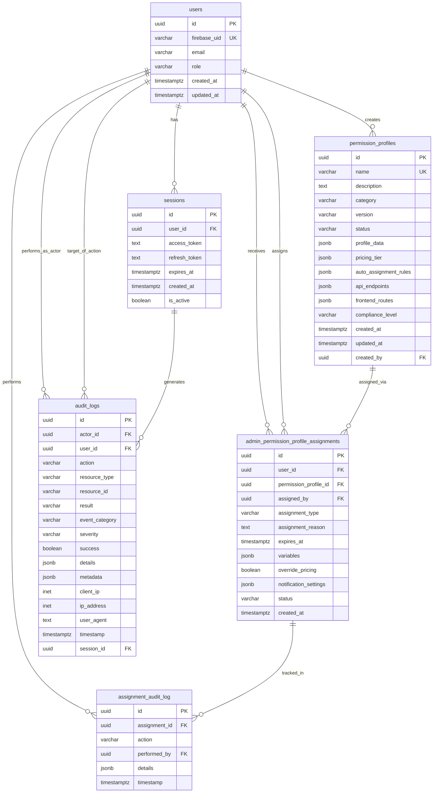

# Database Entity Relationship Diagram

## ER Diagram

## Entity Descriptions

### Core Entities

**users**
- Primary user table with Firebase authentication
- Contains user role (user, premium, moderator, admin, super_admin)
- Base entity for all user-related operations

**sessions** 
- User authentication sessions
- Links to Firebase tokens and expiration
- Tracks active user sessions

**permission_profiles**
- Predefined permission templates (Bronze, Silver, Admin Dashboard, etc.)
- Contains JSONB configuration for features, API endpoints, and pricing
- Created by admin users for assignment to others

**admin_permission_profile_assignments**
- Junction table linking users to permission profiles
- Contains assignment metadata (reason, expiration, variables)
- Tracks who assigned what to whom

### Audit & Compliance

**audit_logs**
- Comprehensive audit trail for all system actions
- Tracks actor, target, action type, and results
- Includes client information and session correlation

**assignment_audit_log**
- Dedicated audit trail for permission assignments
- Tracks changes to user permission assignments
- Links to main audit system

## Key Relationships

1. **User Management**
   - Users authenticate via sessions
   - Users can be assigned multiple permission profiles
   - All user actions generate audit logs

2. **Permission System**
   - Admins create permission profiles with specific capabilities
   - Profiles are assigned to users through assignment table
   - Assignments can have expiration and custom variables

3. **Audit Trail**
   - All actions tracked in audit_logs
   - Permission assignments have dedicated audit log
   - Session activities correlated with audit entries

## Data Flow

1. User authenticates → creates session
2. Admin creates permission profiles → stored with configuration
3. Admin assigns profiles to users → tracked in assignments table
4. All operations logged → comprehensive audit trail
5. Session activities → correlated audit entries

## Security Features

- Firebase UID integration for authentication
- Role-based access control
- Comprehensive audit logging
- Session tracking and management
- Assignment reason tracking for compliance
- IP and user agent logging for security