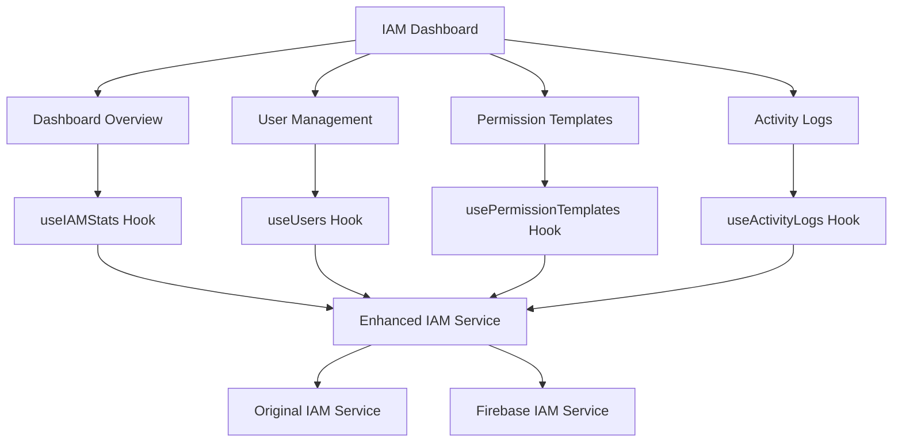

# IAM Dashboard Implementation

This document describes the comprehensive Identity & Access Management (IAM) dashboard implementation for the admin frontend.

## 🏗️ Architecture Overview

The IAM dashboard is built with a modular component architecture:

```
components/iam/
├── IAMDashboardNew.tsx           # Main dashboard container
├── dashboard/
│   └── DashboardOverview.tsx     # Statistics and metrics
├── users/
│   ├── UserManagement.tsx        # User list and management
│   └── UserDetailsModal.tsx      # Detailed user information
├── templates/
│   ├── PermissionTemplates.tsx   # Template gallery
│   └── TemplatePreviewModal.tsx  # Template preview
└── logs/
    └── ActivityLogs.tsx          # Activity logs and timeline
```

## ✨ Implemented Features

### 1. Dashboard Overview

- **User Statistics**: Total users, active subscriptions, permission templates
- **Trend Indicators**: Growth metrics with visual indicators
- **Real-time Data**: Integrated with existing IAM service

### 2. User Management

- **Enhanced User List**: Comprehensive view with essential information
- **Advanced Search**: By name, email, package tier, or status
- **Inline Actions**: Quick edit and manage options
- **User Details Modal**: Complete user information with tabbed interface
  - Overview tab with basic information
  - Permissions tab showing all user permissions
  - Activity tab with recent user actions
  - Security tab with login history

### 3. Permission Templates

- **Template Gallery**: Visual overview of all permission templates
- **Category Filtering**: Organize by User, Admin, Support, Manager types
- **Usage Tracking**: See how many users use each template
- **Quick Preview**: View permissions without opening full details
- **Template Information**: Complete template details with permission lists

### 4. Activity Logs

- **Comprehensive Logging**: All system activities and user actions
- **Timeline View**: Chronological activity with timestamps
- **Smart Filtering**: By action type, status, user, and date range
- **Export Capability**: Download logs for compliance and auditing
- **Visual Status**: Success, warning, and error indicators

## 🔧 Technical Implementation

### UI Components

Custom UI components built for the admin frontend:

- `Tabs`: Tab navigation system
- `Card`: Container components with headers and content
- `Button`, `Input`, `Badge`: Form components with variants
- `Dialog`: Modal system for detailed views

### Hooks

Custom hooks for data management:

- `useIAMStats`: Dashboard statistics and metrics
- `useUsers`: User list with filtering and search
- `usePermissionTemplates`: Template management
- `useActivityLogs`: Activity log management with export

### Services

- `enhancedIAMService`: Extended IAM service with new features
- Integration with existing `iamService` for backward compatibility

## 🚀 Phase 2 Features (Ready for Implementation)

### Advanced Permissions

```typescript
// Fine-grained permission editing
async updateCustomPermissions(userId: string, permissions: string[])

// Custom permission management
async grantCustomPermission(userId: string, featureId: string, permission: Permission)
async revokeCustomPermission(permissionId: string, revokedBy: string)
```

### Role-based Access

```typescript
// User role management system
async createRole(roleData: RoleData)
async assignRole(userId: string, roleId: string)

// Role assignment and inheritance
async getRoleHierarchy()
async getUserRoles(userId: string)
```

### Modal Implementations

- Complete user details modals ✅
- Bulk action modals (ready for implementation)
- Advanced permission editing modals

### Bulk Operations

```typescript
// Bulk user updates
async bulkUpdateUsers(userIds: string[], updates: UserUpdates)
async bulkApplyTemplate(userIds: string[], templateId: string)
```

## 📊 Data Flow



## 🎯 Usage

### Accessing the Dashboard

Navigate to `/iam-new` to access the new IAM dashboard.

### Navigation

The dashboard uses a tab-based interface:

1. **Overview**: Statistics and system metrics
2. **Users**: User management and details
3. **Templates**: Permission template management
4. **Logs**: Activity monitoring and export

### Key Features Usage

#### User Management

- Search users by name, email, package tier, or status
- Click on actions dropdown for user operations
- View detailed user information in modal
- Track user activity and permissions

#### Permission Templates

- Browse templates by category
- Preview template permissions
- Track template usage across users
- Apply templates to users (ready for implementation)

#### Activity Logs

- Filter by status, action type, and date range
- Export logs for compliance
- Monitor system activities in real-time
- View detailed activity information

## 🔒 Security Features

- **Audit Trail**: Complete activity logging
- **Permission Tracking**: Full permission lifecycle
- **Access Control**: Role-based access management
- **Compliance**: Export capabilities for auditing

## 🛣️ Roadmap

### Phase 3 Features (Planned)

- **Real-time Updates**: WebSocket integration
- **Advanced Analytics**: User behavior insights
- **API Documentation**: Interactive explorer
- **Workflow Automation**: Rule-based permissions

## 🧪 Testing

The implementation includes:

- Mock data for development and testing
- Error handling and loading states
- Responsive design for all screen sizes
- TypeScript type safety throughout

## 📈 Performance

- **Lazy Loading**: Components load on demand
- **Debounced Search**: Optimized search performance
- **Efficient Filtering**: Client-side filtering with server integration
- **Caching**: Hook-based caching for improved UX

## 🔗 Integration

The new IAM dashboard integrates seamlessly with:

- Existing IAM service infrastructure
- Firebase authentication system
- Current admin frontend architecture
- Package permission system

All features are backward compatible and extend existing functionality without breaking changes.
