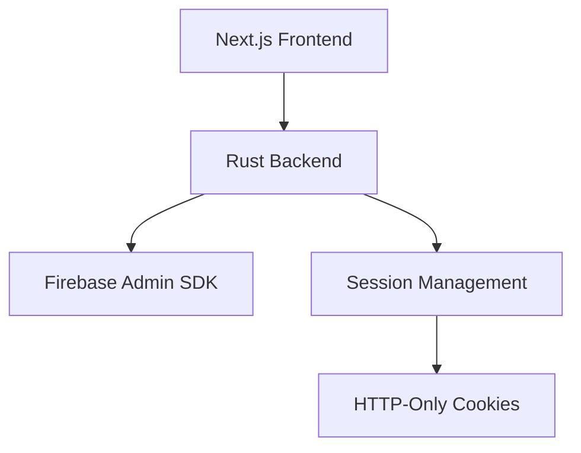

# EPSX Backend

## Authentication Implementation

The backend authentication system uses Firebase Admin SDK for token verification and implements secure session management with Rust.

### Architecture



### Features

- Firebase Admin SDK Integration
- Google OAuth Token Verification
- Secure Session Management
- HTTP-Only Cookie Handling
- Bearer Token Authentication
- Session Refresh Mechanism

### Setup Instructions

1. Copy environment variables:
```bash
cp .env.example .env
```

2. Configure Firebase Admin:
   - Go to Firebase Console
   - Generate a new service account key
   - Download the JSON file
   - Extract credentials to `.env`:
     - `FIREBASE_PROJECT_ID`
     - `FIREBASE_CLIENT_EMAIL`
     - `FIREBASE_PRIVATE_KEY`

3. Configure Google OAuth:
   - Create OAuth 2.0 credentials in Google Cloud Console
   - Add authorized redirect URIs
   - Copy credentials to `.env`:
     - `GOOGLE_CLIENT_ID`
     - `GOOGLE_CLIENT_SECRET`
     - `GOOGLE_REDIRECT_URI`

4. Build and run:
```bash
cargo build
cargo run
```

### API Endpoints

```
POST /v1/auth/google/init
- Initiates Google OAuth flow
- Returns OAuth URL

GET /v1/auth/google/callback
- Handles OAuth callback
- Validates token with Firebase
- Sets session cookies

GET /v1/auth/session/validate
- Validates active session
- Requires Bearer token
- Returns session info

POST /v1/auth/logout
- Clears session
- Removes cookies
```

### File Structure

```
src/
├── auth/
│   ├── handlers.rs    # Auth route handlers
│   ├── firebase.rs    # Firebase Admin SDK integration
│   ├── errors.rs      # Error definitions
│   └── mod.rs         # Module exports
├── config.rs          # Environment configuration
└── main.rs            # Server setup
```

### Authentication Flow

1. **Token Verification**:
   ```rust
   async fn verify_id_token(token: &str) -> Result<(String, String)>
   ```
   - Verifies Firebase ID tokens
   - Extracts user ID and email
   - Returns error for invalid tokens

2. **Session Management**:
   ```rust
   fn create_session_token(user_id: &str) -> Result<String>
   ```
   - Creates signed session token
   - Sets secure HTTP-only cookies
   - Manages token expiration

3. **Cookie Security**:
   ```rust
   fn set_auth_cookies(session: &Session) -> Vec<HeaderValue>
   ```
   - Sets HTTP-only cookies
   - Configures security flags
   - Handles SameSite policy

### Environment Variables

```env
# Server Configuration
PORT=3002
RUST_ENV=development
FRONTEND_URL=http://localhost:3000

# Firebase Admin Configuration
FIREBASE_PROJECT_ID=
FIREBASE_CLIENT_EMAIL=
FIREBASE_PRIVATE_KEY=
FIREBASE_API_KEY=

# Google OAuth Configuration
GOOGLE_CLIENT_ID=
GOOGLE_CLIENT_SECRET=
GOOGLE_REDIRECT_URI=

# Session Configuration
SESSION_SECRET=
SESSION_EXPIRY=604800

# Cookie Configuration
COOKIE_SECURE=false
COOKIE_SAMESITE=Lax
COOKIE_DOMAIN=localhost
```

### Security Considerations

1. **Token Security**:
   - Firebase Admin SDK verification
   - RSA key pair validation
   - JWT signature verification

2. **Session Management**:
   - Secure session tokens
   - Configurable expiry times
   - Safe cookie handling

3. **Cookie Protection**:
   - HTTP-only flag
   - Secure flag in production
   - Strict SameSite policy
   - Domain restriction

4. **Error Handling**:
   - Safe error responses
   - No sensitive data exposure
   - Proper error logging

### Development Guidelines

1. **Token Handling**:
   - Always verify tokens server-side
   - Use Firebase Admin SDK
   - Handle token expiration

2. **Cookie Management**:
   - Use HTTP-only cookies
   - Set appropriate flags
   - Configure domains correctly

3. **Error Management**:
   - Use proper error types
   - Safe error messages
   - Proper logging
