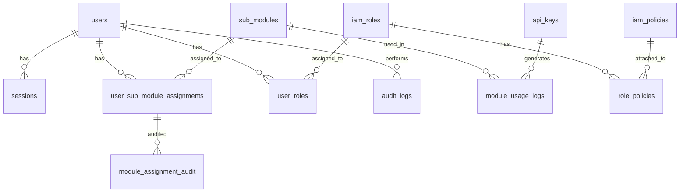

# EPSX Database Schema Documentation

## Overview

The EPSX (EPS Analysis System) backend uses PostgreSQL with a sophisticated module-based access control system, comprehensive IAM (Identity and Access Management), and detailed audit trails. The database has evolved through 4 major migrations, transitioning from a simple permission profile system to an enterprise-grade module-based architecture.

---

## Database Evolution

### Migration History
1. **001_basic_schema.sql**: Initial schema with core user management
2. **002_add_actor_id_to_audit_logs.sql**: Enhanced audit logging
3. **002_module_system_migration.sql**: Major migration to module-based system
4. **003_add_role_to_users.sql**: Added role-based access control
5. **003_data_migration_profiles_to_modules.sql**: Data migration from legacy profiles
6. **004_add_iam_tables.sql**: Comprehensive IAM system implementation

---

## Core Entity Relationships

---

## Table Definitions

### 1. Core User Management

#### `users`
**Primary table for user accounts and authentication**

| Column | Type | Constraints | Description |
|--------|------|-------------|-------------|
| `id` | UUID | PRIMARY KEY | Unique user identifier |
| `firebase_uid` | VARCHAR(128) | UNIQUE, NOT NULL | Firebase authentication ID |
| `email` | VARCHAR(255) | UNIQUE, NOT NULL | User email address |
| `role` | VARCHAR(50) | DEFAULT 'user' | User role (user, admin, moderator) |
| `created_at` | TIMESTAMPTZ | NOT NULL | Account creation timestamp |
| `updated_at` | TIMESTAMPTZ | NOT NULL | Last update timestamp |

**Indexes:**
- `idx_users_firebase_uid` (UNIQUE)
- `idx_users_email` (UNIQUE)

#### `sessions`
**User session management for authentication**

| Column | Type | Constraints | Description |
|--------|------|-------------|-------------|
| `id` | UUID | PRIMARY KEY | Session identifier |
| `user_id` | UUID | FK → users(id) | Associated user |
| `access_token` | TEXT | NOT NULL | JWT access token |
| `refresh_token` | TEXT | | JWT refresh token |
| `expires_at` | TIMESTAMPTZ | NOT NULL | Session expiration |
| `created_at` | TIMESTAMPTZ | NOT NULL | Session creation |
| `is_active` | BOOLEAN | DEFAULT true | Session status |

**Indexes:**
- `idx_sessions_user_id`
- `idx_sessions_expires_at`

### 2. Module-Based Access Control System

#### `sub_modules`
**Core modules available in the system**

| Column | Type | Constraints | Description |
|--------|------|-------------|-------------|
| `id` | UUID | PRIMARY KEY | Module identifier |
| `name` | VARCHAR(255) | UNIQUE, NOT NULL | Internal module name |
| `display_name` | VARCHAR(255) | NOT NULL | Human-readable name |
| `description` | TEXT | | Module description |
| `category` | VARCHAR(100) | NOT NULL | Module category |
| `icon` | VARCHAR(100) | | UI icon reference |
| `api_endpoints` | JSONB | | API configuration |
| `ui_components` | JSONB | | Frontend components |
| `feature_flags` | JSONB | | Feature toggles |
| `access_levels` | JSONB | NOT NULL | Bronze/Silver/Gold/Platinum configs |
| `default_quotas` | JSONB | | Default quotas per level |
| `pricing_tiers` | JSONB | | Pricing information |
| `dependencies` | JSONB | | Required modules |
| `conflicts` | JSONB | | Conflicting modules |
| `status` | VARCHAR(50) | DEFAULT 'active' | Module status |
| `version` | VARCHAR(20) | | Module version |
| `min_package_tier` | VARCHAR(50) | | Minimum required tier |
| `created_at` | TIMESTAMPTZ | NOT NULL | Creation timestamp |
| `updated_at` | TIMESTAMPTZ | NOT NULL | Last update |
| `created_by` | UUID | FK → users(id) | Creator |

**Pre-seeded Modules:**
1. **stock-ranking**: Stock ranking & EPS analysis
2. **portfolio-analysis**: Portfolio analysis with risk metrics
3. **market-data**: Real-time market data feeds
4. **trading-signals**: AI-powered trading signals

#### `user_sub_module_assignments`
**User access assignments to specific modules**

| Column | Type | Constraints | Description |
|--------|------|-------------|-------------|
| `id` | UUID | PRIMARY KEY | Assignment identifier |
| `user_id` | UUID | FK → users(id) | User granted access |
| `sub_module_id` | UUID | FK → sub_modules(id) | Module granted |
| `access_level` | VARCHAR(50) | NOT NULL | bronze/silver/gold/platinum/enterprise |
| `custom_quotas` | JSONB | | Override default quotas |
| `restrictions` | JSONB | | IP, time restrictions |
| `assigned_by` | UUID | FK → users(id) | Who assigned access |
| `assignment_reason` | TEXT | | Reason for assignment |
| `assignment_type` | VARCHAR(50) | DEFAULT 'manual' | Assignment method |
| `starts_at` | TIMESTAMPTZ | | Access start time |
| `expires_at` | TIMESTAMPTZ | | Access expiration (NULL = never) |
| `status` | VARCHAR(50) | DEFAULT 'active' | Assignment status |
| `first_used_at` | TIMESTAMPTZ | | First usage timestamp |
| `last_used_at` | TIMESTAMPTZ | | Last usage timestamp |
| `usage_count` | INTEGER | DEFAULT 0 | Total usage count |
| `created_at` | TIMESTAMPTZ | NOT NULL | Assignment creation |
| `updated_at` | TIMESTAMPTZ | NOT NULL | Last update |

**Constraints:**
- UNIQUE(`user_id`, `sub_module_id`)

**Indexes:**
- `idx_user_assignments_user_id`
- `idx_user_assignments_module_id`
- `idx_user_assignments_status`
- `idx_user_assignments_expires_at`

### 3. Third-Party API Access

#### `api_keys`
**API key management for third-party access**

| Column | Type | Constraints | Description |
|--------|------|-------------|-------------|
| `id` | UUID | PRIMARY KEY | API key identifier |
| `key_hash` | VARCHAR(255) | UNIQUE, NOT NULL | Hashed API key |
| `key_prefix` | VARCHAR(20) | NOT NULL | Key prefix for identification |
| `client_name` | VARCHAR(255) | NOT NULL | Client application name |
| `client_description` | TEXT | | Client description |
| `client_contact_email` | VARCHAR(255) | | Contact email |
| `client_website` | VARCHAR(255) | | Client website |
| `allowed_modules` | JSONB | NOT NULL | Module access configuration |
| `rate_limits` | JSONB | | Per-module rate limits |
| `permissions` | JSONB | | Specific permissions |
| `ip_restrictions` | JSONB | | Allowed IP ranges |
| `allowed_domains` | JSONB | | CORS domains |
| `allowed_user_agents` | JSONB | | Allowed user agents |
| `require_https` | BOOLEAN | DEFAULT true | HTTPS requirement |
| `starts_at` | TIMESTAMPTZ | | Key activation time |
| `expires_at` | TIMESTAMPTZ | | Key expiration |
| `status` | VARCHAR(50) | DEFAULT 'active' | Key status |
| `first_used_at` | TIMESTAMPTZ | | First usage |
| `last_used_at` | TIMESTAMPTZ | | Last usage |
| `total_requests` | INTEGER | DEFAULT 0 | Total request count |
| `usage_stats` | JSONB | | Usage statistics |
| `created_by` | UUID | FK → users(id) | Key creator |
| `managed_by` | UUID | FK → users(id) | Key manager |
| `notes` | TEXT | | Administrative notes |
| `created_at` | TIMESTAMPTZ | NOT NULL | Creation timestamp |
| `updated_at` | TIMESTAMPTZ | NOT NULL | Last update |

### 4. Usage Tracking and Analytics

#### `module_usage_logs`
**Detailed usage tracking for modules and API calls**

| Column | Type | Constraints | Description |
|--------|------|-------------|-------------|
| `id` | UUID | PRIMARY KEY | Log entry identifier |
| `user_id` | UUID | FK → users(id), NULL | User (if user request) |
| `api_key_id` | UUID | FK → api_keys(id), NULL | API key (if API request) |
| `sub_module_id` | UUID | FK → sub_modules(id) | Module used |
| `endpoint` | VARCHAR(500) | NOT NULL | API endpoint called |
| `request_method` | VARCHAR(10) | NOT NULL | HTTP method |
| `response_status` | INTEGER | NOT NULL | HTTP response status |
| `response_time_ms` | INTEGER | | Response time in ms |
| `quota_consumed` | INTEGER | DEFAULT 1 | Quota units consumed |
| `quota_type` | VARCHAR(100) | NOT NULL | Type of quota consumed |
| `client_ip` | INET | | Client IP address |
| `user_agent` | TEXT | | User agent string |
| `request_id` | VARCHAR(100) | | Request correlation ID |
| `session_id` | UUID | | Session identifier |
| `request_size_bytes` | INTEGER | | Request size |
| `response_size_bytes` | INTEGER | | Response size |
| `cache_hit` | BOOLEAN | DEFAULT false | Cache hit indicator |
| `billable` | BOOLEAN | DEFAULT true | Billable request |
| `cost_units` | DECIMAL(10,4) | | Cost units for billing |
| `timestamp` | TIMESTAMPTZ | NOT NULL | Request timestamp |
| `request_metadata` | JSONB | | Additional metadata |

**Indexes:**
- `idx_usage_logs_user_id_timestamp`
- `idx_usage_logs_api_key_timestamp`
- `idx_usage_logs_module_timestamp`
- `idx_usage_logs_billable`

### 5. IAM (Identity and Access Management) System

#### `iam_roles`
**Role definitions for RBAC system**

| Column | Type | Constraints | Description |
|--------|------|-------------|-------------|
| `id` | UUID | PRIMARY KEY | Role identifier |
| `name` | VARCHAR(255) | UNIQUE, NOT NULL | Role name |
| `description` | TEXT | | Role description |
| `permissions` | JSONB | NOT NULL | Array of permissions |
| `is_system` | BOOLEAN | DEFAULT false | System role indicator |
| `created_at` | TIMESTAMPTZ | NOT NULL | Creation timestamp |
| `updated_at` | TIMESTAMPTZ | NOT NULL | Last update |

**Default Roles:**
- `admin`: System administrator with full access
- `user`: Regular user with basic permissions
- `moderator`: Content moderator with limited admin access

#### `iam_policies`
**Policy definitions for fine-grained access control**

| Column | Type | Constraints | Description |
|--------|------|-------------|-------------|
| `id` | UUID | PRIMARY KEY | Policy identifier |
| `name` | VARCHAR(255) | UNIQUE, NOT NULL | Policy name |
| `description` | TEXT | | Policy description |
| `effect` | VARCHAR(50) | DEFAULT 'Allow' | Allow or Deny |
| `actions` | JSONB | NOT NULL | Array of allowed actions |
| `resources` | JSONB | NOT NULL | Array of resources |
| `created_at` | TIMESTAMPTZ | NOT NULL | Creation timestamp |
| `updated_at` | TIMESTAMPTZ | NOT NULL | Last update |

**Default Policies:**
- `FullAccess`: Complete system access
- `ReadOnlyAccess`: Read-only access to all resources
- `UserSelfManagement`: Users can manage their own profile
- `AdminUserManagement`: Admin can manage all users

#### `user_roles`
**Junction table for user-role assignments**

| Column | Type | Constraints | Description |
|--------|------|-------------|-------------|
| `id` | UUID | PRIMARY KEY | Assignment identifier |
| `user_id` | UUID | FK → users(id) | User |
| `role_id` | UUID | FK → iam_roles(id) | Role |
| `assigned_by` | UUID | FK → users(id) | Who assigned |
| `assigned_at` | TIMESTAMPTZ | NOT NULL | Assignment time |
| `expires_at` | TIMESTAMPTZ | | Assignment expiration |

**Constraints:**
- UNIQUE(`user_id`, `role_id`)

#### `role_policies`
**Junction table for role-policy attachments**

| Column | Type | Constraints | Description |
|--------|------|-------------|-------------|
| `id` | UUID | PRIMARY KEY | Attachment identifier |
| `role_id` | UUID | FK → iam_roles(id) | Role |
| `policy_id` | UUID | FK → iam_policies(id) | Policy |
| `created_at` | TIMESTAMPTZ | NOT NULL | Attachment time |

**Constraints:**
- UNIQUE(`role_id`, `policy_id`)

### 6. Audit and Compliance

#### `audit_logs`
**Comprehensive audit trail for all system actions**

| Column | Type | Constraints | Description |
|--------|------|-------------|-------------|
| `id` | UUID | PRIMARY KEY | Log entry identifier |
| `actor_id` | UUID | FK → users(id) | Who performed action |
| `user_id` | UUID | FK → users(id) | User affected |
| `action` | VARCHAR(100) | NOT NULL | Action performed |
| `resource_type` | VARCHAR(50) | NOT NULL | Resource type |
| `resource_id` | VARCHAR(255) | | Resource identifier |
| `result` | VARCHAR(50) | DEFAULT 'success' | Action result |
| `event_category` | VARCHAR(50) | DEFAULT 'system_security' | Event category |
| `severity` | VARCHAR(20) | DEFAULT 'medium' | Event severity |
| `success` | BOOLEAN | DEFAULT true | Success indicator |
| `details` | JSONB | | Detailed information |
| `metadata` | JSONB | | Additional metadata |
| `client_ip` | INET | | Client IP address |
| `ip_address` | INET | | (Legacy) IP address |
| `user_agent` | TEXT | | User agent string |
| `timestamp` | TIMESTAMPTZ | NOT NULL | Event timestamp |
| `session_id` | UUID | FK → sessions(id) | Session identifier |

**Indexes:**
- `idx_audit_logs_actor_id`
- `idx_audit_logs_timestamp`

#### `module_assignment_audit`
**Detailed audit trail for module assignments**

| Column | Type | Constraints | Description |
|--------|------|-------------|-------------|
| `id` | UUID | PRIMARY KEY | Audit entry identifier |
| `assignment_id` | UUID | FK → user_sub_module_assignments(id) | Assignment ID (nullable) |
| `user_id` | UUID | FK → users(id) | User affected |
| `sub_module_id` | UUID | FK → sub_modules(id) | Module affected |
| `action` | VARCHAR(50) | NOT NULL | Action performed |
| `old_values` | JSONB | | Previous state |
| `new_values` | JSONB | | New state |
| `changes` | JSONB | | Specific changes |
| `performed_by` | UUID | FK → users(id) | Who performed action |
| `reason` | TEXT | | Reason for change |
| `session_id` | UUID | | Session identifier |
| `client_ip` | INET | | Client IP |
| `user_agent` | TEXT | | User agent |
| `timestamp` | TIMESTAMPTZ | NOT NULL | Event timestamp |

**Indexes:**
- `idx_assignment_audit_user_id`

---

## Database Views

### `user_module_access`
Provides a comprehensive view of user module assignments with current status and usage statistics.

### `api_key_access`
Shows API key access summary including allowed modules and usage metrics.

### `module_usage_summary`
Aggregated module usage statistics for performance monitoring and billing.

### `migration_validation`
Validation view to ensure data integrity after migrations.

### `user_access_comparison`
Comparison view between legacy permission profiles and new module assignments.

---

## Business Logic and Access Levels

### Access Levels
- **Bronze**: Basic access with limited features and quotas
- **Silver**: Enhanced features with moderate quotas
- **Gold**: Professional features with high quotas  
- **Platinum**: Enterprise features with unlimited quotas
- **Enterprise**: Custom enterprise features and quotas

### Module Categories
- **Analytics**: Stock analysis, ranking, and EPS tools
- **Trading**: Trading signals and strategy tools
- **Data**: Market data feeds and historical analysis
- **Reporting**: Analytics and reporting dashboard tools

### Assignment Types
- **Manual**: Manually assigned by administrator
- **Auto**: Automatically assigned based on rules
- **Subscription**: Assigned through payment/subscription
- **Migrated**: Migrated from legacy permission system

---

## Security Features

### Authentication
- Firebase-based authentication with secure session management
- JWT tokens with configurable expiration
- Multi-role support (admin, user, moderator)

### Authorization
- Role-based access control (RBAC) with IAM policies
- Module-based feature access control
- Fine-grained permissions with AWS-style policies
- API key management with module-specific permissions

### Security Controls
- IP-based access restrictions
- User agent filtering
- HTTPS enforcement for API keys
- Rate limiting per user and API key
- Comprehensive audit logging with correlation IDs

### Compliance
- Complete audit trail for all actions
- Data migration tracking and validation
- User activity monitoring
- API usage tracking for billing and compliance

---

## Performance Optimizations

### Indexing Strategy
- Primary keys on all tables (UUID)
- Unique constraints on critical business keys
- Foreign key indexes for relationship queries
- Composite indexes for common query patterns
- Time-based indexes for audit and usage logs

### Data Types
- UUID for all identifiers (globally unique, non-sequential)
- TIMESTAMPTZ for all timestamps (timezone-aware)
- JSONB for structured data (indexed and queryable)
- INET for IP addresses (optimized storage and querying)
- DECIMAL for monetary values (precision-safe)

---

## Backup and Recovery

### Legacy Data Preservation
- `backup_permission_profiles`: Original permission profiles
- `backup_admin_permission_profile_assignments`: Original assignments
- Migration validation views for data integrity verification

### Audit Trail Retention
- Complete audit logs for compliance requirements
- Usage logs for billing and analytics
- Session tracking for security monitoring

---

*Database schema supports enterprise-grade security, comprehensive audit trails, and flexible module-based access control for the EPSX trading platform.*