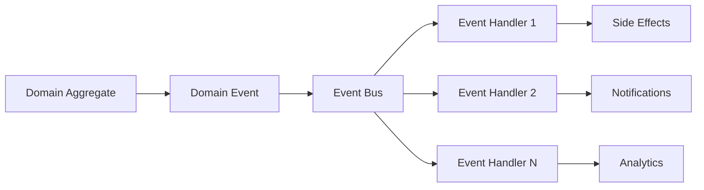

# EPSX Architecture Overview

## 🏗️ Architecture Summary

The EPSX trading analytics platform is fully implemented using **Domain-Driven Design (DDD)**, **Clean Architecture**, and **Hexagonal Architecture** principles with complete migration from legacy layers.

```
┌─────────────────────────────────────────────────────────────┐
│                    WEB LAYER                                │
│  ┌─────────────┐  ┌─────────────┐  ┌─────────────┐        │
│  │   Frontend  │  │    Admin    │  │ API Gateway │        │
│  │   (Next.js) │  │  Frontend   │  │   (Axum)    │        │
│  └─────────────┘  └─────────────┘  └─────────────┘        │
└─────────────────────────────────────────────────────────────┘
                             │
┌─────────────────────────────────────────────────────────────┐
│                APPLICATION LAYER                            │
│  ┌─────────────┐  ┌─────────────┐  ┌─────────────┐        │
│  │   Commands  │  │   Queries   │  │ Application │        │
│  │   (CQRS)    │  │   (CQRS)    │  │  Services   │        │
│  └─────────────┘  └─────────────┘  └─────────────┘        │
└─────────────────────────────────────────────────────────────┘
                             │
┌─────────────────────────────────────────────────────────────┐
│                  DOMAIN LAYER                               │
│  ┌─────────────┐  ┌─────────────┐  ┌─────────────┐        │
│  │  Bounded    │  │    Domain   │  │    Value    │        │
│  │  Contexts   │  │   Events    │  │   Objects   │        │
│  └─────────────┘  └─────────────┘  └─────────────┘        │
└─────────────────────────────────────────────────────────────┘
                             │
┌─────────────────────────────────────────────────────────────┐
│              INFRASTRUCTURE LAYER                           │
│  ┌─────────────┐  ┌─────────────┐  ┌─────────────┐        │
│  │ Repository  │  │  External   │  │   Database  │        │
│  │  Adapters   │  │  Services   │  │ (PostgreSQL)│        │
│  └─────────────┘  └─────────────┘  └─────────────┘        │
└─────────────────────────────────────────────────────────────┘
```

## 🎯 Bounded Contexts

### 1. Authentication BC
**Purpose**: User authentication, session creation, token management
- **Aggregates**: AuthenticationSession
- **Events**: SessionCreated, TokensIssued, SessionTerminated
- **Services**: Multi-provider auth (Firebase, OIDC), anomaly detection

### 2. User Management BC  
**Purpose**: User profiles, permissions, account lifecycle
- **Aggregates**: User, Session
- **Events**: UserCreated, PermissionGranted, ProfileUpdated
- **Services**: Embedded timestamp permissions, RBAC

### 3. Session Management BC
**Purpose**: Session persistence, monitoring, analytics
- **Aggregates**: UserSessionManager
- **Events**: ActivityRecorded, SuspiciousActivityDetected
- **Services**: Behavioral analysis, multi-session tracking

### 4. Payment BC
**Purpose**: Payment processing, crypto addresses, transactions  
- **Aggregates**: Payment
- **Events**: PaymentInitiated, PaymentConfirmed, PaymentFailed
- **Services**: Multi-network crypto, exchange rates

### 5. Notification BC
**Purpose**: Multi-channel notifications, preferences, delivery
- **Aggregates**: Notification
- **Events**: NotificationCreated, NotificationDelivered
- **Services**: FCM, email, SMS, in-app notifications

### 6. Realtime Events BC
**Purpose**: Live event broadcasting, WebSocket connections
- **Aggregates**: RealtimeEvent
- **Events**: EventCreated, EventDelivered, ConnectionEstablished
- **Services**: WebSocket/SSE management, event broadcasting

### 7. Trading Analytics BC
**Purpose**: EPS analysis, stock rankings, financial metrics
- **Aggregates**: EPSRanking, StockAnalysis  
- **Events**: EPSRankingUpdated, AnalysisCompleted
- **Services**: EPS calculations, growth analysis, rankings

## 🔄 CQRS Implementation

### Command Side (Write Operations)
```rust
pub trait Command: Send + Sync + Debug + Clone {
    type Response: Send + Sync;
    fn validate(&self) -> ApplicationResult<()>;
}

pub trait CommandHandler<C: Command>: Send + Sync {
    async fn handle(&self, command: C) -> ApplicationResult<C::Response>;
}
```

### Query Side (Read Operations)
```rust
pub trait Query: Send + Sync + Debug {
    type Response: Send + Sync;
    fn validate(&self) -> ApplicationResult<()>;
}

pub trait QueryHandler<Q: Query>: Send + Sync {
    async fn handle(&self, query: Q) -> ApplicationResult<Q::Response>;
}
```

## 🔌 Hexagonal Architecture (Ports & Adapters)

### Inbound Ports (Use Cases)
- Command handlers for business operations
- Query handlers for data retrieval
- Event handlers for domain events

### Outbound Ports (Dependencies)
- Repository ports for data persistence
- Service ports for external integrations
- Event bus ports for domain events

### Adapters
- **Repository Adapters**: PostgreSQL/Diesel implementations
- **Service Adapters**: Firebase, external APIs
- **Event Adapters**: In-memory, Redis, or message queue

## 📊 Domain Events

### Event Flow


### Event Examples
```rust
// Authentication events
AuthenticationSessionCreatedEvent
TokensIssuedEvent
SessionTerminatedEvent

// User management events  
UserCreatedEvent
PermissionGrantedEvent
UserProfileUpdatedEvent

// Payment events
PaymentInitiatedEvent
PaymentConfirmedEvent
PaymentFailedEvent
```

## 🏛️ Clean Architecture Layers

### 1. Domain Layer (Core Business Logic)
```
src/domain/
├── shared_kernel/          # Common abstractions (AggregateRoot, DomainEvent, etc.)
├── authentication/         # Auth business rules and events
├── user_management/       # User business rules and aggregates
├── session_management/    # Session business rules and security
├── notification/          # Notification business rules
├── payment/               # Payment processing business rules
├── realtime_events/       # Real-time event business rules
└── trading_analytics/     # EPS ranking and analysis business rules
```

**Characteristics**:
- ✅ Zero external dependencies
- ✅ Pure business logic with domain events
- ✅ Technology agnostic
- ✅ Highly testable with aggregate roots

### 2. Application Layer (Use Cases)
```
src/application/
├── authentication/        # Auth command/query handlers
├── user_management/       # User CQRS handlers  
├── payment/              # Payment command handlers
├── shared/               # Command/query bus implementations
└── ports/                # Inbound/outbound port definitions
```

**Characteristics**:
- ✅ Orchestrates domain aggregates
- ✅ Implements use cases with CQRS
- ✅ Depends only on domain layer
- ✅ Technology agnostic

### 3. Infrastructure Layer (External Concerns)
```  
src/infrastructure/
├── adapters/repositories/ # Repository port implementations
├── adapters/services/     # Service port implementations  
├── container/            # DDD dependency injection container
├── event_bus/            # Domain event bus implementation
└── integration/          # External service integrations
```

**Characteristics**:
- ✅ Implements domain/application ports
- ✅ Handles external dependencies (PostgreSQL, Redis, Firebase)
- ✅ Database mappers and adapters
- ✅ Replaceable/pluggable implementations

### 4. Web Layer (Interface Adapters)
```
src/web/
├── controllers/           # API endpoints
├── dto/                   # Request/response models
├── middleware/            # Cross-cutting concerns
└── validation/            # Input validation
```

**Characteristics**:
- ✅ HTTP-specific concerns
- ✅ Request/response transformation
- ✅ Authentication/authorization
- ✅ Error handling

## 🔄 Dependency Flow

### Clean Architecture Dependency Rule
```
Web Layer ──────→ Application Layer
                       │
                       ↓
                  Domain Layer
                       ↑
                       │
Infrastructure Layer ──┘
```

**Key Principles**:
- ✅ Dependencies point inward
- ✅ Inner layers know nothing about outer layers
- ✅ Domain layer has zero external dependencies
- ✅ Interfaces define contracts (Dependency Inversion)

## 🔧 Technology Stack

### Core Technologies
- **Language**: Rust 1.75+
- **Web Framework**: Axum
- **Database**: PostgreSQL with Diesel ORM
- **Authentication**: OIDC + Firebase
- **Cache**: Redis
- **Frontend**: Next.js 15 + React 19

### Domain-Specific Tools
- **Event Bus**: Custom implementation with Redis option
- **CQRS**: Custom command/query buses
- **Validation**: Domain-driven validation rules
- **Serialization**: Serde for DTOs and events

## 📈 Performance Characteristics

### Read Performance
- **Query Optimization**: Dedicated read models
- **Caching**: Aggressive caching on query side
- **Indexing**: Database indexes optimized per query
- **Pagination**: Built-in pagination support

### Write Performance  
- **Event Sourcing**: Optional for audit-heavy domains
- **Batch Operations**: Bulk commands and events
- **Async Processing**: Non-blocking event handling
- **Connection Pooling**: Optimized database connections

## 🧪 Testing Strategy

### Unit Testing
```rust
#[cfg(test)]
mod tests {
    use super::*;
    
    #[test]
    fn test_user_creation_domain_logic() {
        // Test pure domain logic
        let user = User::create(email, profile).unwrap();
        assert_eq!(user.status(), AccountStatus::Active);
    }
}
```

### Integration Testing
```rust
#[tokio::test]  
async fn test_create_user_command_handler() {
    let handler = CreateUserCommandHandler::new(
        mock_repository(), 
        mock_event_bus()
    );
    
    let response = handler.handle(command).await.unwrap();
    assert!(response.user_id.is_valid());
}
```

### Architecture Testing
```rust
#[test]
fn test_dependency_rules() {
    // Verify domain layer has no external dependencies
    // Verify application layer only depends on domain
    // Verify infrastructure implements required ports
}
```

## 🔍 Monitoring and Observability

### Domain Metrics
- Command execution times
- Query performance
- Event processing latency
- Business rule violations

### Architecture Metrics  
- Layer dependency violations
- Port/adapter health
- CQRS command vs query ratios
- Event sourcing replay times

## 🚀 Deployment Architecture

### Production Setup
```yaml
# docker-compose.yml structure
services:
  backend:          # Rust API server
  frontend:         # Next.js application  
  admin:            # Admin dashboard
  postgres:         # Primary database
  redis:            # Cache and sessions
  nginx:            # Load balancer
```

### Scaling Strategy
- **Horizontal**: Multiple backend instances
- **Vertical**: Resource optimization per layer
- **Database**: Read replicas for query optimization
- **Cache**: Redis clustering for high availability

## 📚 References

- **ADR-001**: DDD + Clean Architecture + Hexagonal Architecture
- **ADR-002**: Bounded Contexts Design  
- **ADR-003**: CQRS Implementation Strategy
- **Code Structure**: `/src` directory organization
- **API Documentation**: OpenAPI/Swagger specs

---

**Last Updated**: 2025-09-05  
**Architecture Version**: 2.1 (Complete DDD Migration)  
**Review Cycle**: Quarterly  
**Status**: ✅ Production Ready - Legacy Code Removed