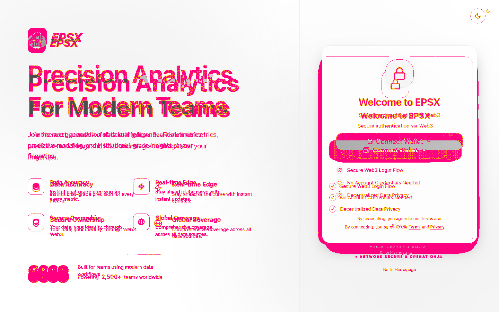
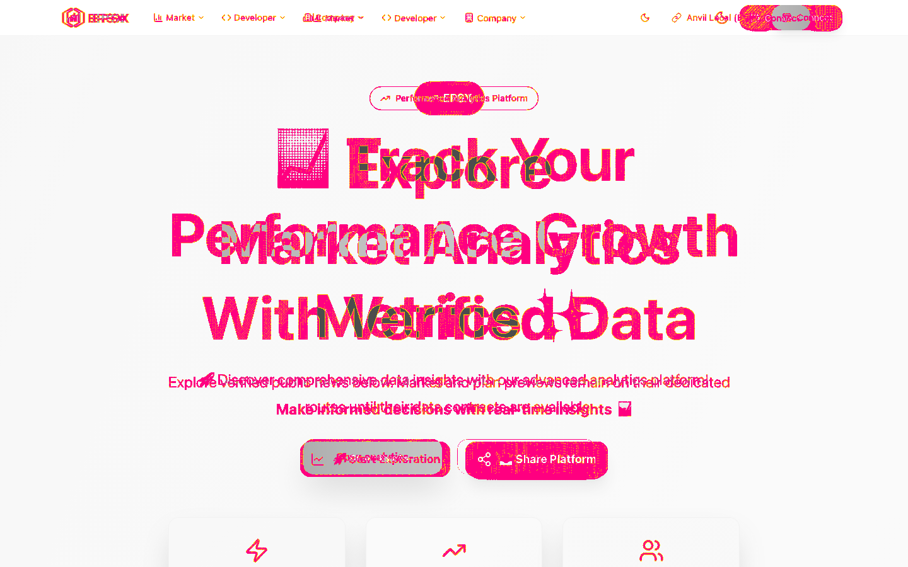
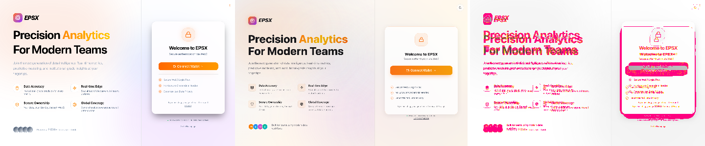

# PR 0 — E2E harness and immutable baseline evidence

Result: **PASS**

Source Next.js SHA: `373bd231cb7a616c3d4c0ddc1d60e0099a88a5db`

Target Rust/Dioxus SHA: `4b411516e609c3dca38014e0a82acb4f442b6789`

Generated: 2026-07-29T12:40:43.727Z

PR 0 is a capture/reproducibility gate. Visual differences are recorded and assigned to PR 1; they are not silently treated as parity.

## Scenario evidence

| Scenario | Matrix | Result / coverage | Next.js | Rust/Dioxus | Highlighted diff | Δ pixels | Difference disposition | Reset proof |
|---|---|---|---|---|---|---:|---|---|
| `pr0.public.about` | `desktop-light` | PASS; 2 clean repeats | [](./pr0.public.about--desktop-light--source.png) | [](./pr0.public.about--desktop-light--target.png) | [](./pr0.public.about--desktop-light--diff.png) | 8.9044% | PR 0 establishes the immutable baseline and reproducible evidence path; source/target parity disposition is owned by PR 1. | pre=PASS, post=PASS |
| `pr0.public.about` | `mobile-dark` | PASS; 2 clean repeats | [](./pr0.public.about--mobile-dark--source.png) | [](./pr0.public.about--mobile-dark--target.png) | [](./pr0.public.about--mobile-dark--diff.png) | 15.6565% | PR 0 establishes the immutable baseline and reproducible evidence path; source/target parity disposition is owned by PR 1. | pre=PASS, post=PASS |
| `pr0.public.contact` | `desktop-light` | PASS; 2 clean repeats | [](./pr0.public.contact--desktop-light--source.png) | [](./pr0.public.contact--desktop-light--target.png) | [](./pr0.public.contact--desktop-light--diff.png) | 8.9044% | PR 0 establishes the immutable baseline and reproducible evidence path; source/target parity disposition is owned by PR 1. | pre=PASS, post=PASS |
| `pr0.public.contact` | `mobile-dark` | PASS; 2 clean repeats | [](./pr0.public.contact--mobile-dark--source.png) | [](./pr0.public.contact--mobile-dark--target.png) | [](./pr0.public.contact--mobile-dark--diff.png) | 15.6568% | PR 0 establishes the immutable baseline and reproducible evidence path; source/target parity disposition is owned by PR 1. | pre=PASS, post=PASS |
| `pr0.public.home` | `desktop-light` | PASS; 2 clean repeats | [](./pr0.public.home--desktop-light--source.png) | [](./pr0.public.home--desktop-light--target.png) | [](./pr0.public.home--desktop-light--diff.png) | 8.9566% | PR 0 establishes the immutable baseline and reproducible evidence path; source/target parity disposition is owned by PR 1. | pre=PASS, post=PASS |
| `pr0.public.home` | `mobile-dark` | PASS; 2 clean repeats | [](./pr0.public.home--mobile-dark--source.png) | [](./pr0.public.home--mobile-dark--target.png) | [](./pr0.public.home--mobile-dark--diff.png) | 20.2722% | PR 0 establishes the immutable baseline and reproducible evidence path; source/target parity disposition is owned by PR 1. | pre=PASS, post=PASS |

## Contact sheets

Each sheet is ordered **Next.js source → Rust/Dioxus target → highlighted pixel diff**.

### pr0.public.about — desktop-light



### pr0.public.about — mobile-dark


### pr0.public.contact — desktop-light


### pr0.public.contact — mobile-dark


### pr0.public.home — desktop-light


### pr0.public.home — mobile-dark


## Runtime rollback gate

Every repeat restored a guarded `epsx_e2e_*` PostgreSQL database from its template, deleted only the `epsx:e2e:*` Redis namespace, reverted Anvil chain 31337 to its recorded snapshot, reset fixture requests/mutations, and cleared its isolated browser context. PostgreSQL checksums and row counts, transient queue/outbox emptiness, Redis hashes, Anvil account/block state, and fixture counters matched the baseline after reset.

Final process-stopped rollback: **PASS**. The source and target applications were stopped before the final reset and smoke, preventing background polling from repopulating fixture or durable state. The full artifact manifest includes `reset-final.json` with every baseline comparison.

## Full artifacts

The CI artifact contains full-resolution PNGs, video, traces, HAR/network data, DOM, accessibility snapshots, browser/server logs, Playwright HTML, and reset proofs. [`artifact-manifest.json`](./artifact-manifest.json) records the SHA-256 and byte length of every file in that artifact.

## Reproduce

```bash
bun install --frozen-lockfile
bunx playwright install chromium
bun run test:e2e:migration:pr0
bun run e2e:migration:verify-artifacts
```
