# PR 2 — cumulative migration E2E evidence

Result: **PASS**

Source Next.js SHA: `373bd231cb7a616c3d4c0ddc1d60e0099a88a5db`

Target Rust/Dioxus SHA: `d3106200af3a3fe58692dec151f873ab4864ad15`

Generated: 2026-07-29T21:17:34.662Z

This report covers every executable scenario owned by cumulative groups 0–2. Visual differences above 1% require a machine-readable non-styling exception.

## Scenario evidence

| Scenario | Matrix | Result / coverage | Next.js | Rust/Dioxus | Highlighted diff | Δ pixels | Difference disposition | Reset proof |
|---|---|---|---|---|---|---:|---|---|
| `pr0.public.about` | `desktop-light` | PASS; 2 clean repeats | [](./pr0.public.about--desktop-light--source.png) | [](./pr0.public.about--desktop-light--target.png) | [](./pr0.public.about--desktop-light--diff.png) | 8.3697% | PR 0 establishes the immutable baseline and reproducible evidence path; source/target parity disposition is owned by PR 1. | pre=PASS, post=PASS |
| `pr0.public.about` | `mobile-dark` | PASS; 2 clean repeats | [](./pr0.public.about--mobile-dark--source.png) | [](./pr0.public.about--mobile-dark--target.png) | [](./pr0.public.about--mobile-dark--diff.png) | 15.6568% | PR 0 establishes the immutable baseline and reproducible evidence path; source/target parity disposition is owned by PR 1. | pre=PASS, post=PASS |
| `pr0.public.contact` | `desktop-light` | PASS; 2 clean repeats | [](./pr0.public.contact--desktop-light--source.png) | [](./pr0.public.contact--desktop-light--target.png) | [](./pr0.public.contact--desktop-light--diff.png) | 8.3697% | PR 0 establishes the immutable baseline and reproducible evidence path; source/target parity disposition is owned by PR 1. | pre=PASS, post=PASS |
| `pr0.public.contact` | `mobile-dark` | PASS; 2 clean repeats | [](./pr0.public.contact--mobile-dark--source.png) | [](./pr0.public.contact--mobile-dark--target.png) | [](./pr0.public.contact--mobile-dark--diff.png) | 15.6568% | PR 0 establishes the immutable baseline and reproducible evidence path; source/target parity disposition is owned by PR 1. | pre=PASS, post=PASS |
| `pr0.public.home` | `desktop-light` | PASS; 2 clean repeats | [](./pr0.public.home--desktop-light--source.png) | [](./pr0.public.home--desktop-light--target.png) | [](./pr0.public.home--desktop-light--diff.png) | 8.7815% | PR 0 establishes the immutable baseline and reproducible evidence path; source/target parity disposition is owned by PR 1. | pre=PASS, post=PASS |
| `pr0.public.home` | `mobile-dark` | PASS; 2 clean repeats | [](./pr0.public.home--mobile-dark--source.png) | [](./pr0.public.home--mobile-dark--target.png) | [](./pr0.public.home--mobile-dark--diff.png) | 20.2722% | PR 0 establishes the immutable baseline and reproducible evidence path; source/target parity disposition is owned by PR 1. | pre=PASS, post=PASS |
| `pr1.about.authenticated` | `desktop-light` | PASS; 2 clean repeats | [](./pr1.about.authenticated--desktop-light--source.png) | [](./pr1.about.authenticated--desktop-light--target.png) | [](./pr1.about.authenticated--desktop-light--diff.png) | 0.6133% | Within the 1% campaign visual threshold. | pre=PASS, post=PASS |
| `pr1.about.authenticated` | `mobile-dark` | PASS; 2 clean repeats | [](./pr1.about.authenticated--mobile-dark--source.png) | [](./pr1.about.authenticated--mobile-dark--target.png) | [](./pr1.about.authenticated--mobile-dark--diff.png) | 1.1177% | The target validates the fixture's signed frontend session with the Rust BFF and renders the authenticated, owner-scoped chat control. The pinned source middleware admits the cookie for this public body but its client shell has no verified identity and therefore omits that control. With the authenticated control region excluded, the screenshot delta is below 1%. | pre=PASS, post=PASS |
| `pr1.admin.denial-query` | `desktop-light` | PASS; 2 clean repeats | [](./pr1.admin.denial-query--desktop-light--source.png) | [](./pr1.admin.denial-query--desktop-light--target.png) | [](./pr1.admin.denial-query--desktop-light--diff.png) | 1.5624% | The pinned source presents browser-controlled reason and detail parameters as authoritative denial evidence. The target ignores those claims and explains that only the authenticated session and backend permissions determine access. | pre=PASS, post=PASS |
| `pr1.admin.denial-query` | `mobile-dark` | PASS; 2 clean repeats | [](./pr1.admin.denial-query--mobile-dark--source.png) | [](./pr1.admin.denial-query--mobile-dark--target.png) | [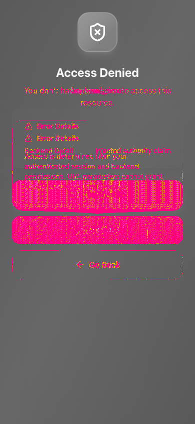](./pr1.admin.denial-query--mobile-dark--diff.png) | 12.771% | The pinned source presents browser-controlled reason and detail parameters as authoritative denial evidence. The target ignores those claims and explains that only the authenticated session and backend permissions determine access. | pre=PASS, post=PASS |
| `pr1.admin.unauthorized` | `desktop-light` | PASS; 2 clean repeats | [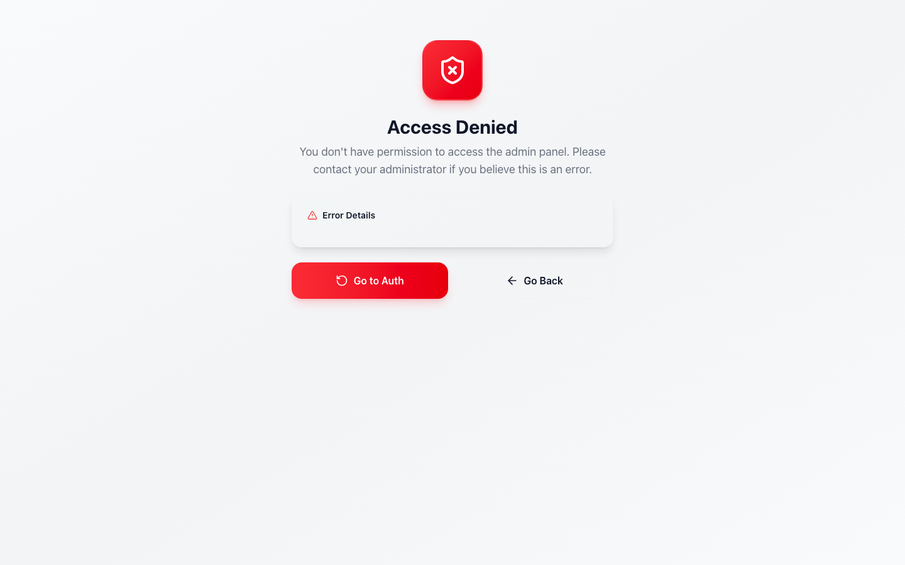](./pr1.admin.unauthorized--desktop-light--source.png) | [](./pr1.admin.unauthorized--desktop-light--target.png) | [](./pr1.admin.unauthorized--desktop-light--diff.png) | 3.5723% | The target removes browser-controlled denial context and adds static administrator guidance without claiming an unverified route, permission, or backend error. Access remains determined by the Rust backend. | pre=PASS, post=PASS |
| `pr1.admin.unauthorized` | `mobile-dark` | PASS; 2 clean repeats | [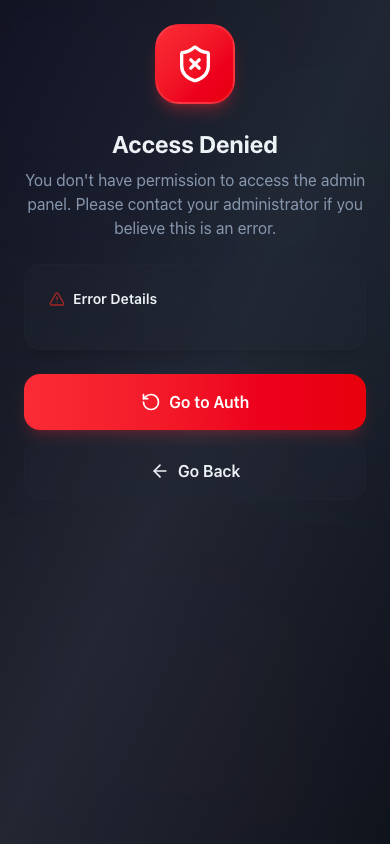](./pr1.admin.unauthorized--mobile-dark--source.png) | [](./pr1.admin.unauthorized--mobile-dark--target.png) | [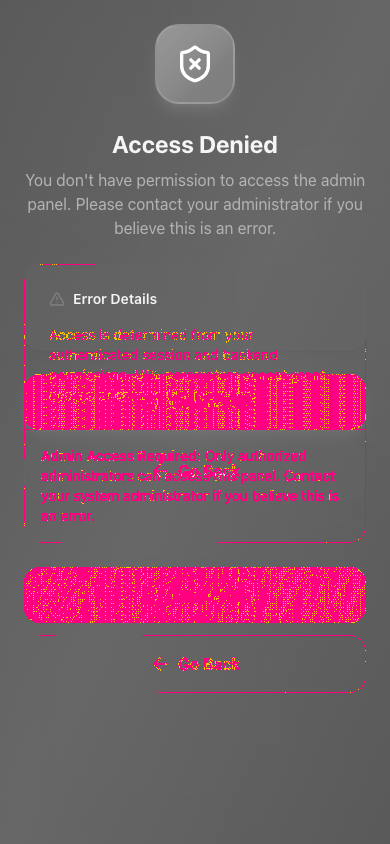](./pr1.admin.unauthorized--mobile-dark--diff.png) | 12.5586% | The target removes browser-controlled denial context and adds static administrator guidance without claiming an unverified route, permission, or backend error. Access remains determined by the Rust backend. | pre=PASS, post=PASS |
| `pr1.auth.about-redirect` | `desktop-light` | PASS; 2 clean repeats | [](./pr1.auth.about-redirect--desktop-light--source.png) | [](./pr1.auth.about-redirect--desktop-light--target.png) | [](./pr1.auth.about-redirect--desktop-light--diff.png) | 8.3697% | The pinned source auth surface asserts that the network is secure and operational without a backend health proof and advertises an unverified customer count. The target keeps the wallet CTA and feature geometry while replacing those claims with a static wallet-sign-in description and truthful product copy. | pre=PASS, post=PASS |
| `pr1.auth.about-redirect` | `mobile-dark` | PASS; 2 clean repeats | [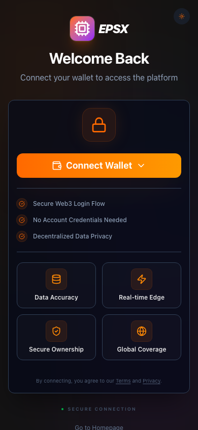](./pr1.auth.about-redirect--mobile-dark--source.png) | [](./pr1.auth.about-redirect--mobile-dark--target.png) | [](./pr1.auth.about-redirect--mobile-dark--diff.png) | 15.6568% | The pinned source auth surface asserts that the network is secure and operational without a backend health proof and advertises an unverified customer count. The target keeps the wallet CTA and feature geometry while replacing those claims with a static wallet-sign-in description and truthful product copy. | pre=PASS, post=PASS |
| `pr1.auth.contact-redirect` | `desktop-light` | PASS; 2 clean repeats | [](./pr1.auth.contact-redirect--desktop-light--source.png) | [](./pr1.auth.contact-redirect--desktop-light--target.png) | [](./pr1.auth.contact-redirect--desktop-light--diff.png) | 8.3697% | The pinned source auth surface asserts that the network is secure and operational without a backend health proof and advertises an unverified customer count. The target keeps the wallet CTA and feature geometry while replacing those claims with a static wallet-sign-in description and truthful product copy. | pre=PASS, post=PASS |
| `pr1.auth.contact-redirect` | `mobile-dark` | PASS; 2 clean repeats | [](./pr1.auth.contact-redirect--mobile-dark--source.png) | [](./pr1.auth.contact-redirect--mobile-dark--target.png) | [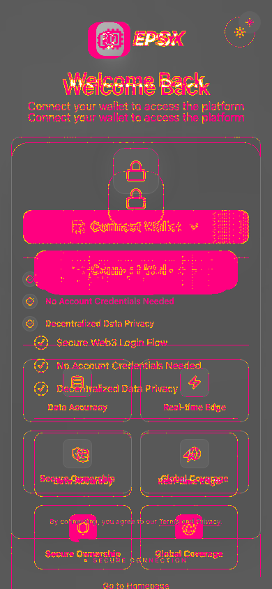](./pr1.auth.contact-redirect--mobile-dark--diff.png) | 15.6568% | The pinned source auth surface asserts that the network is secure and operational without a backend health proof and advertises an unverified customer count. The target keeps the wallet CTA and feature geometry while replacing those claims with a static wallet-sign-in description and truthful product copy. | pre=PASS, post=PASS |
| `pr1.contact.authenticated` | `desktop-light` | PASS; 2 clean repeats | [](./pr1.contact.authenticated--desktop-light--source.png) | [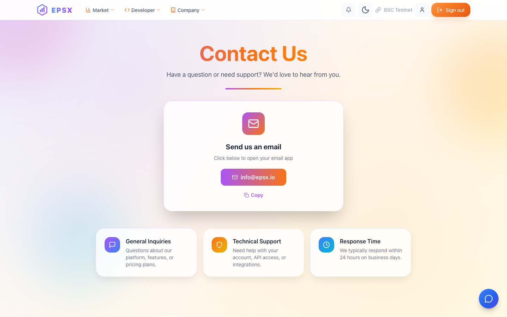](./pr1.contact.authenticated--desktop-light--target.png) | [](./pr1.contact.authenticated--desktop-light--diff.png) | 0.376% | Within the 1% campaign visual threshold. | pre=PASS, post=PASS |
| `pr1.contact.authenticated` | `mobile-dark` | PASS; 2 clean repeats | [](./pr1.contact.authenticated--mobile-dark--source.png) | [](./pr1.contact.authenticated--mobile-dark--target.png) | [](./pr1.contact.authenticated--mobile-dark--diff.png) | 1.5825% | The target validates the fixture's signed frontend session with the Rust BFF and renders the authenticated, owner-scoped chat control. The pinned source middleware admits the cookie for this public body but its client shell has no verified identity and therefore omits that control. With the authenticated control region excluded, the screenshot delta is below 1%. | pre=PASS, post=PASS |
| `pr1.error.access-denied` | `desktop-light` | PASS; 2 clean repeats | [](./pr1.error.access-denied--desktop-light--source.png) | [](./pr1.error.access-denied--desktop-light--target.png) | [](./pr1.error.access-denied--desktop-light--diff.png) | 0.8513% | Within the 1% campaign visual threshold. | pre=PASS, post=PASS |
| `pr1.error.access-denied` | `mobile-dark` | PASS; 2 clean repeats | [](./pr1.error.access-denied--mobile-dark--source.png) | [](./pr1.error.access-denied--mobile-dark--target.png) | [](./pr1.error.access-denied--mobile-dark--diff.png) | 0.0933% | Within the 1% campaign visual threshold. | pre=PASS, post=PASS |
| `pr1.error.not-found` | `desktop-light` | PASS; 2 clean repeats | [](./pr1.error.not-found--desktop-light--source.png) | [](./pr1.error.not-found--desktop-light--target.png) | [](./pr1.error.not-found--desktop-light--diff.png) | 8.7822% | The pinned source masks an unknown signed-out route by redirecting to authentication. The target preserves the HTTP 404 boundary and renders safe recovery links, so route existence and error semantics are not confused with an authorization decision. | pre=PASS, post=PASS |
| `pr1.error.not-found` | `mobile-dark` | PASS; 2 clean repeats | [](./pr1.error.not-found--mobile-dark--source.png) | [](./pr1.error.not-found--mobile-dark--target.png) | [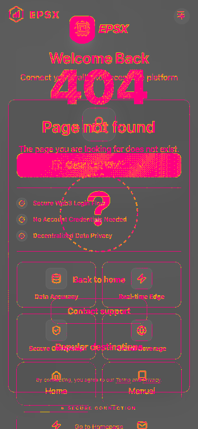](./pr1.error.not-found--mobile-dark--diff.png) | 12.4338% | The pinned source masks an unknown signed-out route by redirecting to authentication. The target preserves the HTTP 404 boundary and renders safe recovery links, so route existence and error semantics are not confused with an authorization decision. | pre=PASS, post=PASS |
| `pr1.offline.public` | `desktop-light` | PASS; 2 clean repeats | [](./pr1.offline.public--desktop-light--source.png) | [](./pr1.offline.public--desktop-light--target.png) | [](./pr1.offline.public--desktop-light--diff.png) | 2.0041% | The pinned source offline page claims cached dashboard and analytics capabilities that have no verified service-worker cache contract. The target limits its availability list to the static shell and recovery actions that actually work offline. | pre=PASS, post=PASS |
| `pr1.offline.public` | `mobile-dark` | PASS; 2 clean repeats | [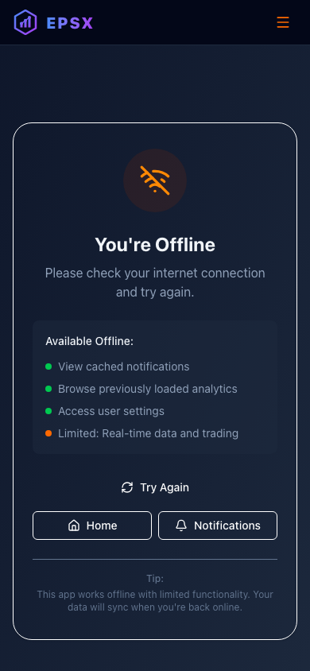](./pr1.offline.public--mobile-dark--source.png) | [](./pr1.offline.public--mobile-dark--target.png) | [](./pr1.offline.public--mobile-dark--diff.png) | 6.1298% | The pinned source offline page claims cached dashboard and analytics capabilities that have no verified service-worker cache contract. The target limits its availability list to the static shell and recovery actions that actually work offline. | pre=PASS, post=PASS |
| `pr1.privacy.legal` | `desktop-light` | PASS; 2 clean repeats | [](./pr1.privacy.legal--desktop-light--source.png) | [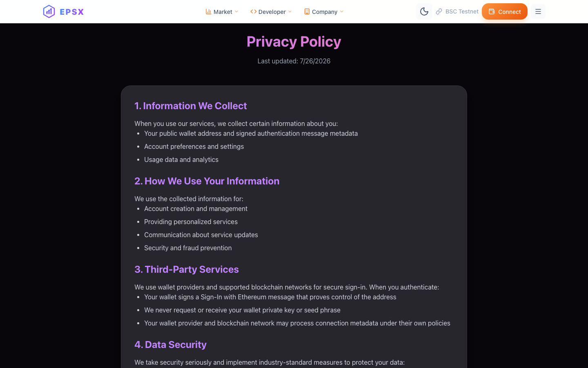](./pr1.privacy.legal--desktop-light--target.png) | [](./pr1.privacy.legal--desktop-light--diff.png) | 2.4241% | The pinned source privacy policy describes Google/OIDC and OAuth data flows that this wallet-only application does not use. The target accurately documents wallet addresses, EIP-4361 signatures, nonce/session handling, and provides a real contact link. | pre=PASS, post=PASS |
| `pr1.privacy.legal` | `mobile-dark` | PASS; 2 clean repeats | [](./pr1.privacy.legal--mobile-dark--source.png) | [](./pr1.privacy.legal--mobile-dark--target.png) | [](./pr1.privacy.legal--mobile-dark--diff.png) | 4.221% | The pinned source privacy policy describes Google/OIDC and OAuth data flows that this wallet-only application does not use. The target accurately documents wallet addresses, EIP-4361 signatures, nonce/session handling, and provides a real contact link. | pre=PASS, post=PASS |
| `pr1.shell.home` | `desktop-light` | PASS; 2 clean repeats | [](./pr1.shell.home--desktop-light--source.png) | [](./pr1.shell.home--desktop-light--target.png) | [](./pr1.shell.home--desktop-light--diff.png) | 8.7815% | The pinned source hero advertises real-time analytics and interactive sharing before their verified public data contracts are available. The target replaces those claims with truthful navigation to dedicated routes; the shell structure and controls remain functional. | pre=PASS, post=PASS |
| `pr1.shell.home` | `mobile-dark` | PASS; 2 clean repeats | [](./pr1.shell.home--mobile-dark--source.png) | [](./pr1.shell.home--mobile-dark--target.png) | [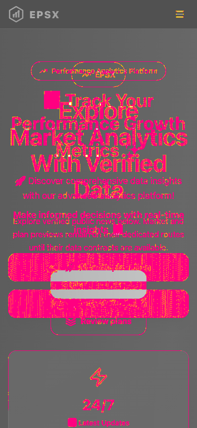](./pr1.shell.home--mobile-dark--diff.png) | 20.2722% | The pinned source hero advertises real-time analytics and interactive sharing before their verified public data contracts are available. The target replaces those claims with truthful navigation to dedicated routes; the shell structure and controls remain functional. | pre=PASS, post=PASS |
| `pr1.terms.legal` | `desktop-light` | PASS; 2 clean repeats | [](./pr1.terms.legal--desktop-light--source.png) | [](./pr1.terms.legal--desktop-light--target.png) | [](./pr1.terms.legal--desktop-light--diff.png) | 2.6065% | The pinned source terms describe OAuth and Google sign-in and render non-functional subscription controls. The target states the wallet/SIWE authentication contract, links to contact, and removes the unsupported pseudo-form. | pre=PASS, post=PASS |
| `pr1.terms.legal` | `mobile-dark` | PASS; 2 clean repeats | [](./pr1.terms.legal--mobile-dark--source.png) | [](./pr1.terms.legal--mobile-dark--target.png) | [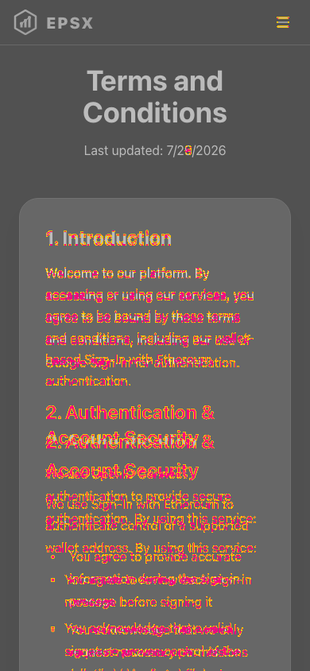](./pr1.terms.legal--mobile-dark--diff.png) | 4.2478% | The pinned source terms describe OAuth and Google sign-in and render non-functional subscription controls. The target states the wallet/SIWE authentication contract, links to contact, and removes the unsupported pseudo-form. | pre=PASS, post=PASS |
| `pr2.account.verified` | `desktop-light` | PASS; 2 clean repeats | [](./pr2.account.verified--desktop-light--source.png) | [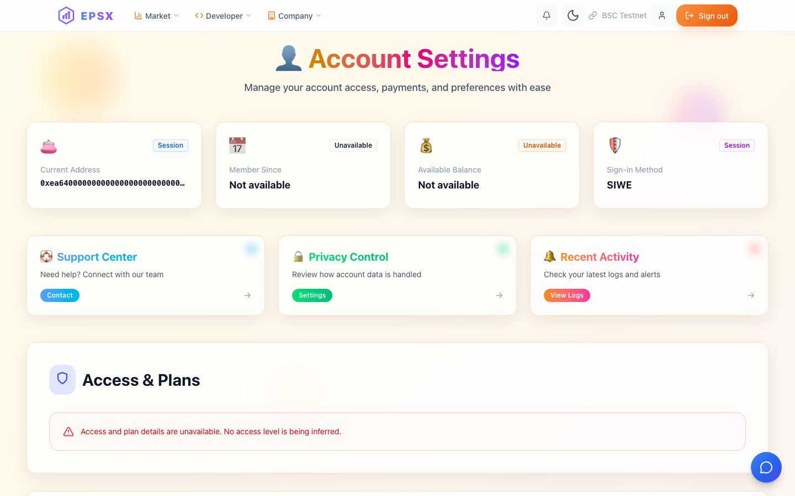](./pr2.account.verified--desktop-light--target.png) | [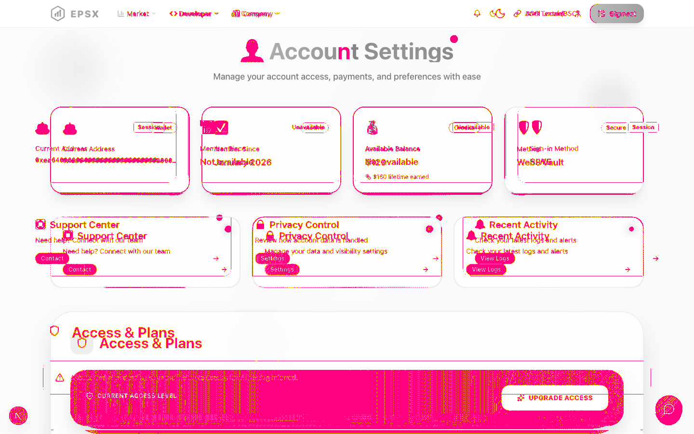](./pr2.account.verified--desktop-light--diff.png) | 13.9544% | The pinned source mixes a server session with client wallet state and renders fixture-derived membership, credit, plan, feature, payment, and preference claims. The target renders the verified wallet and SIWE method but marks every unselected owner-scoped backend projection unavailable instead of inventing authority. | pre=PASS, post=PASS |
| `pr2.account.verified` | `mobile-dark` | PASS; 2 clean repeats | [](./pr2.account.verified--mobile-dark--source.png) | [](./pr2.account.verified--mobile-dark--target.png) | [](./pr2.account.verified--mobile-dark--diff.png) | 15.1571% | The pinned source mixes a server session with client wallet state and renders fixture-derived membership, credit, plan, feature, payment, and preference claims. The target renders the verified wallet and SIWE method but marks every unselected owner-scoped backend projection unavailable instead of inventing authority. | pre=PASS, post=PASS |
| `pr2.admin.settings` | `desktop-light` | PASS; 2 clean repeats | [](./pr2.admin.settings--desktop-light--source.png) | [](./pr2.admin.settings--desktop-light--target.png) | [](./pr2.admin.settings--desktop-light--diff.png) | 5.7444% | The pinned source renders fixture-owned administrator contact and maintenance values as settings. The target keeps the authenticated settings route but explicitly declines to project those claims when the Rust adapter cannot verify its strict backend contract. | pre=PASS, post=PASS |
| `pr2.admin.settings` | `mobile-dark` | PASS; 2 clean repeats | [](./pr2.admin.settings--mobile-dark--source.png) | [](./pr2.admin.settings--mobile-dark--target.png) | [](./pr2.admin.settings--mobile-dark--diff.png) | 8.741% | The pinned source renders fixture-owned administrator contact and maintenance values as settings. The target keeps the authenticated settings route but explicitly declines to project those claims when the Rust adapter cannot verify its strict backend contract. | pre=PASS, post=PASS |
| `pr2.admin.wrong-audience` | `desktop-light` | PASS; 2 clean repeats | [](./pr2.admin.wrong-audience--desktop-light--source.png) | [](./pr2.admin.wrong-audience--desktop-light--target.png) | [](./pr2.admin.wrong-audience--desktop-light--diff.png) | 25.2198% | The source receives its valid admin baseline session, while the target receives an equally signed frontend-audience token and must replace all administrator settings with the public Admin Access gate. | pre=PASS, post=PASS |
| `pr2.admin.wrong-audience` | `mobile-dark` | PASS; 2 clean repeats | [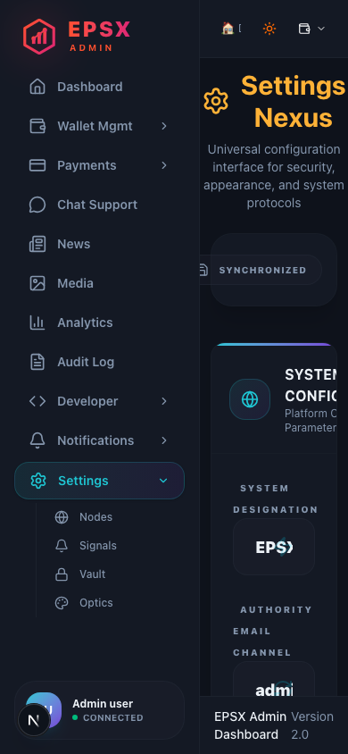](./pr2.admin.wrong-audience--mobile-dark--source.png) | [](./pr2.admin.wrong-audience--mobile-dark--target.png) | [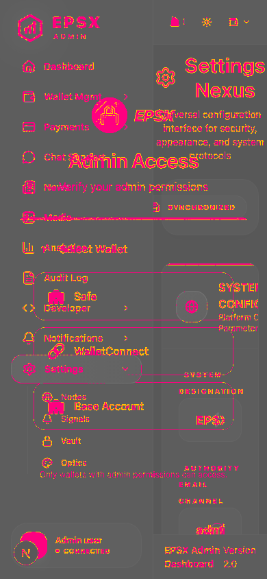](./pr2.admin.wrong-audience--mobile-dark--diff.png) | 6.7013% | The source receives its valid admin baseline session, while the target receives an equally signed frontend-audience token and must replace all administrator settings with the public Admin Access gate. | pre=PASS, post=PASS |
| `pr2.auth.dependency-failure` | `desktop-light` | PASS; 2 clean repeats | [](./pr2.auth.dependency-failure--desktop-light--source.png) | [](./pr2.auth.dependency-failure--desktop-light--target.png) | [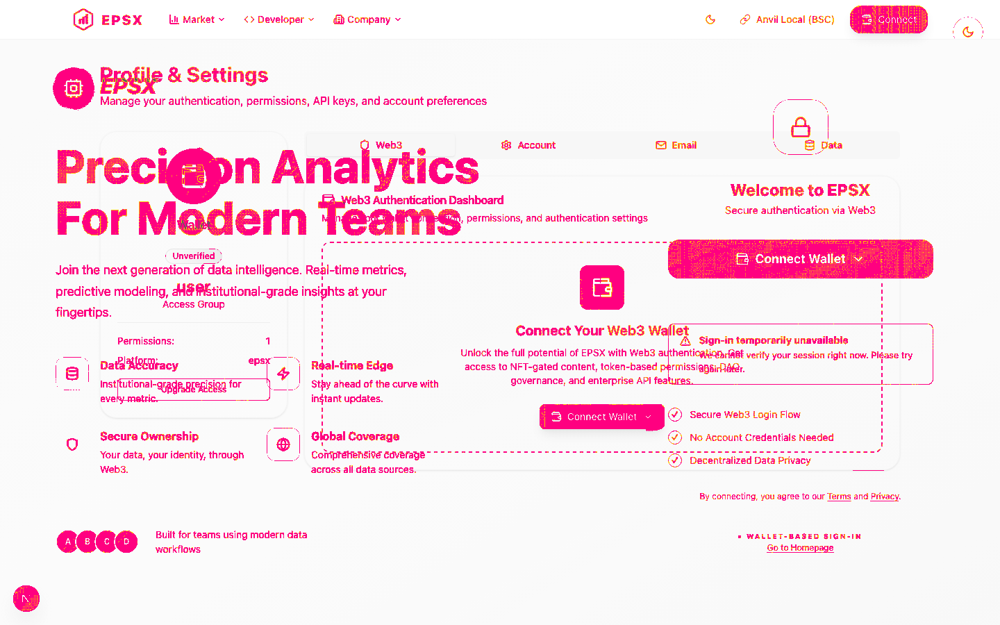](./pr2.auth.dependency-failure--desktop-light--diff.png) | 8.5552% | The source receives its normal valid-session baseline. The target's token uses an uncached key identifier while identity verification is unavailable, so the Rust verifier clears unprovable authority and renders the explicit unavailable sign-in gate. | pre=PASS, post=PASS |
| `pr2.auth.dependency-failure` | `mobile-dark` | PASS; 2 clean repeats | [](./pr2.auth.dependency-failure--mobile-dark--source.png) | [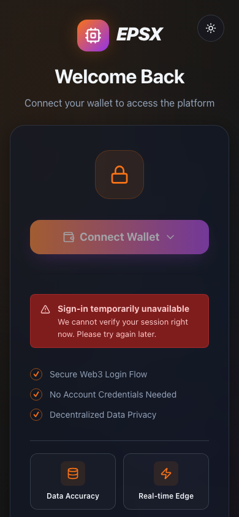](./pr2.auth.dependency-failure--mobile-dark--target.png) | [](./pr2.auth.dependency-failure--mobile-dark--diff.png) | 19.5331% | The source receives its normal valid-session baseline. The target's token uses an uncached key identifier while identity verification is unavailable, so the Rust verifier clears unprovable authority and renders the explicit unavailable sign-in gate. | pre=PASS, post=PASS |
| `pr2.auth.logout` | `desktop-light` | PASS; 2 clean repeats | [](./pr2.auth.logout--desktop-light--source.png) | [](./pr2.auth.logout--desktop-light--target.png) | [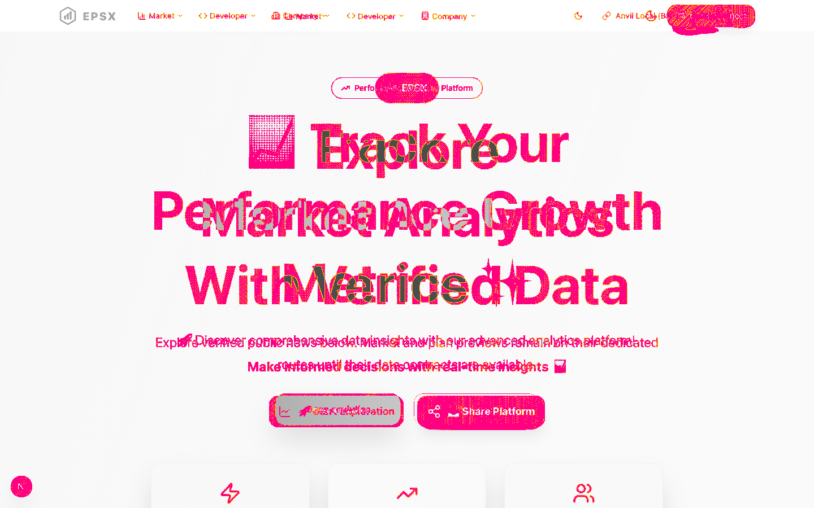](./pr2.auth.logout--desktop-light--diff.png) | 9.0935% | Both captures finish signed out after their respective session-clearing mechanisms. The residual public-home difference is the same removal of unsupported live-market, social-proof, customer, and call-to-action claims approved for the shared-shell home capture. | pre=PASS, post=PASS |
| `pr2.auth.logout` | `mobile-dark` | PASS; 2 clean repeats | [](./pr2.auth.logout--mobile-dark--source.png) | [](./pr2.auth.logout--mobile-dark--target.png) | [](./pr2.auth.logout--mobile-dark--diff.png) | 20.5095% | Both captures finish signed out after their respective session-clearing mechanisms. The residual public-home difference is the same removal of unsupported live-market, social-proof, customer, and call-to-action claims approved for the shared-shell home capture. | pre=PASS, post=PASS |
| `pr2.auth.signed-out` | `desktop-light` | PASS; 2 clean repeats | [](./pr2.auth.signed-out--desktop-light--source.png) | [](./pr2.auth.signed-out--desktop-light--target.png) | [](./pr2.auth.signed-out--desktop-light--diff.png) | 8.3697% | The pinned source sign-in gate claims secure operation and customer adoption without backend evidence. The target preserves the wallet CTA and gate structure while removing those unverified claims and describing only the wallet-based authentication contract. | pre=PASS, post=PASS |
| `pr2.auth.signed-out` | `mobile-dark` | PASS; 2 clean repeats | [](./pr2.auth.signed-out--mobile-dark--source.png) | [](./pr2.auth.signed-out--mobile-dark--target.png) | [](./pr2.auth.signed-out--mobile-dark--diff.png) | 15.6568% | The pinned source sign-in gate claims secure operation and customer adoption without backend evidence. The target preserves the wallet CTA and gate structure while removing those unverified claims and describing only the wallet-based authentication contract. | pre=PASS, post=PASS |
| `pr2.frontend.wrong-audience` | `desktop-light` | PASS; 2 clean repeats | [](./pr2.frontend.wrong-audience--desktop-light--source.png) | [](./pr2.frontend.wrong-audience--desktop-light--target.png) | [](./pr2.frontend.wrong-audience--desktop-light--diff.png) | 8.5798% | The source receives its valid frontend-audience baseline session, while the target receives an equally signed admin-audience token and must replace the owner profile with the public authentication gate. | pre=PASS, post=PASS |
| `pr2.frontend.wrong-audience` | `mobile-dark` | PASS; 2 clean repeats | [](./pr2.frontend.wrong-audience--mobile-dark--source.png) | [](./pr2.frontend.wrong-audience--mobile-dark--target.png) | [](./pr2.frontend.wrong-audience--mobile-dark--diff.png) | 13.5548% | The source receives its valid frontend-audience baseline session, while the target receives an equally signed admin-audience token and must replace the owner profile with the public authentication gate. | pre=PASS, post=PASS |
| `pr2.permissions.empty-claims` | `desktop-light` | PASS; 2 clean repeats | [](./pr2.permissions.empty-claims--desktop-light--source.png) | [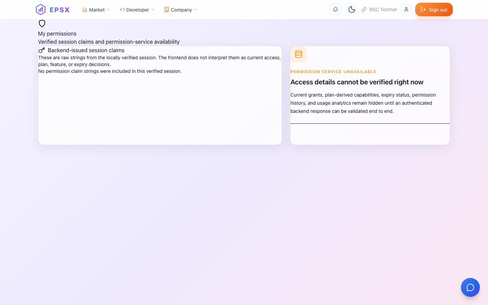](./pr2.permissions.empty-claims--desktop-light--target.png) | [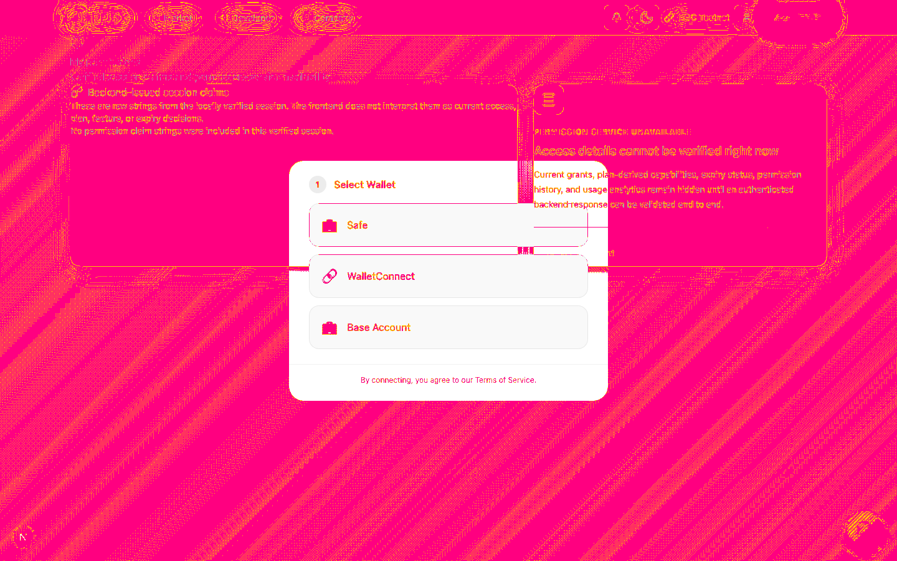](./pr2.permissions.empty-claims--desktop-light--diff.png) | 78.3572% | The pinned source client gate cannot establish authority from the valid backend session without a connected browser wallet. The target accepts the correctly signed owner session but renders an explicit zero-permission state, proving that empty backend claims stay empty and gain no frontend defaults. | pre=PASS, post=PASS |
| `pr2.permissions.empty-claims` | `mobile-dark` | PASS; 2 clean repeats | [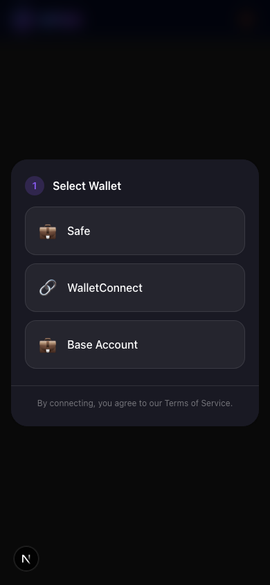](./pr2.permissions.empty-claims--mobile-dark--source.png) | [](./pr2.permissions.empty-claims--mobile-dark--target.png) | [](./pr2.permissions.empty-claims--mobile-dark--diff.png) | 6.7165% | The pinned source client gate cannot establish authority from the valid backend session without a connected browser wallet. The target accepts the correctly signed owner session but renders an explicit zero-permission state, proving that empty backend claims stay empty and gain no frontend defaults. | pre=PASS, post=PASS |
| `pr2.permissions.verified` | `desktop-light` | PASS; 2 clean repeats | [](./pr2.permissions.verified--desktop-light--source.png) | [](./pr2.permissions.verified--desktop-light--target.png) | [](./pr2.permissions.verified--desktop-light--diff.png) | 78.4425% | The pinned source client gate cannot establish authority from the valid backend session without a connected browser wallet and therefore obscures the permission body. The target validates the exact Rust-issued audience and scope and renders only those verified permission claims. | pre=PASS, post=PASS |
| `pr2.permissions.verified` | `mobile-dark` | PASS; 2 clean repeats | [](./pr2.permissions.verified--mobile-dark--source.png) | [](./pr2.permissions.verified--mobile-dark--target.png) | [](./pr2.permissions.verified--mobile-dark--diff.png) | 6.509% | The pinned source client gate cannot establish authority from the valid backend session without a connected browser wallet and therefore obscures the permission body. The target validates the exact Rust-issued audience and scope and renders only those verified permission claims. | pre=PASS, post=PASS |
| `pr2.profile.verified` | `desktop-light` | PASS; 2 clean repeats | [](./pr2.profile.verified--desktop-light--source.png) | [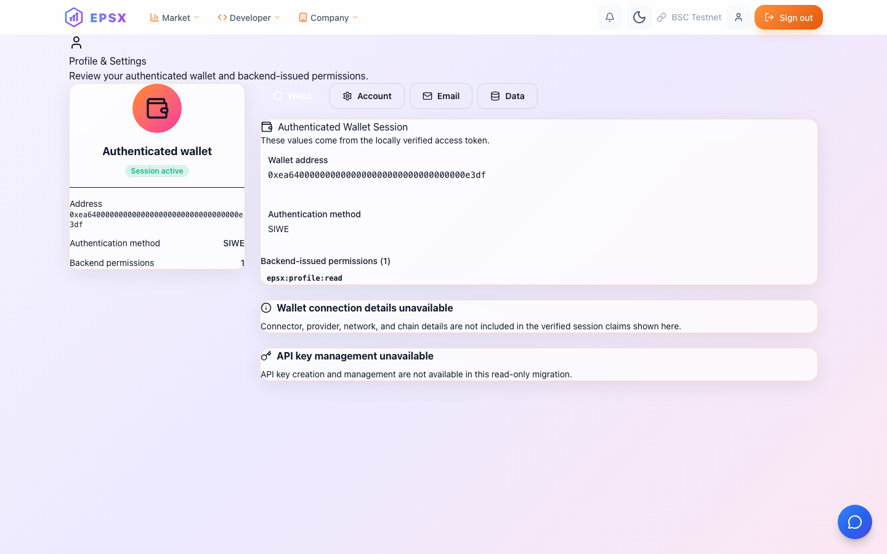](./pr2.profile.verified--desktop-light--target.png) | [](./pr2.profile.verified--desktop-light--diff.png) | 4.8801% | The pinned source profile treats browser wallet connectivity as the profile authority even when its server session is valid. The target distinguishes the backend-verified session wallet from unavailable browser-wallet and policy-management state, preserving owner identity without fabricating connected-provider capabilities. | pre=PASS, post=PASS |
| `pr2.profile.verified` | `mobile-dark` | PASS; 2 clean repeats | [](./pr2.profile.verified--mobile-dark--source.png) | [](./pr2.profile.verified--mobile-dark--target.png) | [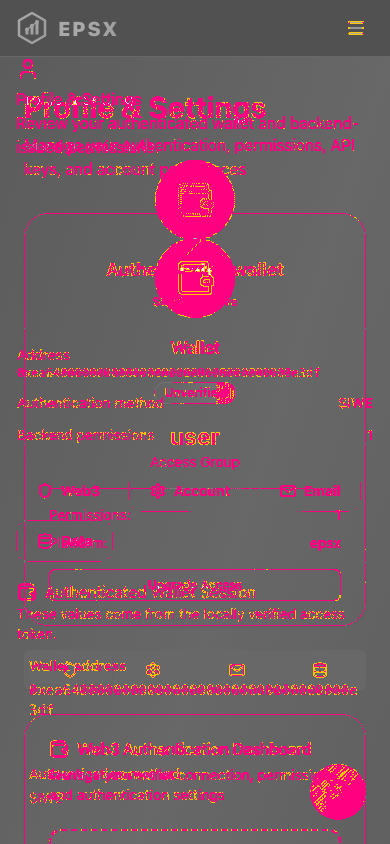](./pr2.profile.verified--mobile-dark--diff.png) | 11.1113% | The pinned source profile treats browser wallet connectivity as the profile authority even when its server session is valid. The target distinguishes the backend-verified session wallet from unavailable browser-wallet and policy-management state, preserving owner identity without fabricating connected-provider capabilities. | pre=PASS, post=PASS |

## Backend-authoritative contract evidence

| Suite | Group | Result | Clean repeats | Rust tests per repeat | Claims | Source anchors |
|---|---:|---|---:|---:|---|---|
| `pr2.admin-session-boundary` | 2 | PASS | 2 | 160 | SIWE exchange requires the admin audience; frontend and multiple audiences cannot establish admin authority; refresh rotation, rejection, transport failure, and logout fail closed; backend profile permissions remain verbatim; unauthenticated and under-permissioned requests stop before upstream access | `apps/admin/src/session_auth.rs`<br>`apps/admin/src/session_auth_tests.rs`<br>`apps/admin/src/auth.rs`<br>`apps/admin/src/main.rs` |
| `pr2.frontend-session-boundary` | 2 | PASS | 2 | 126 | invalid login and identity mismatch set no session; refresh rotates the verified cookie pair without replay; refresh dependency failure clears unprovable sessions; logout clears canonical and legacy cookies; profile and account data stay bound to the verified owner | `apps/frontend/src/api.rs`<br>`apps/frontend/src/auth.rs`<br>`apps/frontend/src/ssr.rs` |
| `pr2.identity-service-policy` | 2 | PASS | 2 | 8 | identity routes require exact audiences and literal permissions; spoofable owner headers are stripped; malformed credentials and hidden lifecycle routes fail closed; dependency verifier failures do not expose protected handlers | `services/identity/src/lib.rs` |
| `pr2.identity-token-contracts` | 2 | PASS | 2 | 34 | SIWE nonce entropy and replay-state classification; refresh client and family-state isolation; revoked, consumed, replayed, and invalid refresh states fail closed; single exact access-token audience; RS256 issuer, audience, algorithm, and key-id validation; persistent signing material survives service reconstruction | `shared/rust/epsx-identity-shared/src/auth_service.rs`<br>`shared/rust/epsx-identity-shared/src/token_service.rs`<br>`shared/rust/epsx-identity-shared/src/key_manager.rs`<br>`shared/rust/epsx-identity-shared/src/refresh_token_digest.rs` |
| `pr2.service-auth-boundary` | 2 | PASS | 2 | 8 | frontend and admin audiences are exact and isolated; wrong audience, issuer, expiry, algorithm, and unknown keys are rejected; permission wildcard grammar does not widen authority | `shared/rust/epsx-service-auth/src/lib.rs` |

Each repeat has a checksummed Cargo log plus guarded pre/post PostgreSQL, Redis, Anvil, and fixture reset proofs in the full artifact. Test counts and ignored-test counts must be stable, every command must pass, and ignored tests are forbidden.

## Contact sheets

Each sheet is ordered **Next.js source → Rust/Dioxus target → highlighted pixel diff**.

### pr0.public.about — desktop-light


### pr0.public.about — mobile-dark


### pr0.public.contact — desktop-light


### pr0.public.contact — mobile-dark


### pr0.public.home — desktop-light


### pr0.public.home — mobile-dark


### pr1.about.authenticated — desktop-light


### pr1.about.authenticated — mobile-dark


### pr1.admin.denial-query — desktop-light


### pr1.admin.denial-query — mobile-dark

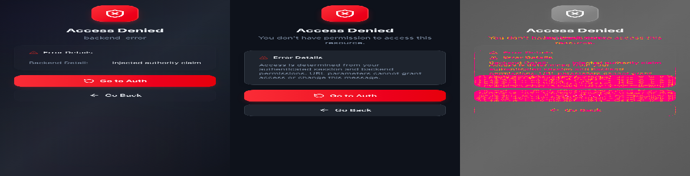

### pr1.admin.unauthorized — desktop-light


### pr1.admin.unauthorized — mobile-dark

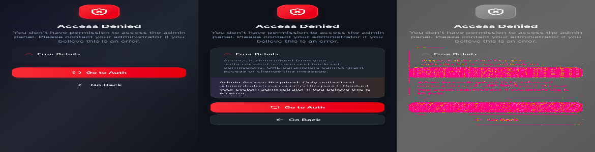

### pr1.auth.about-redirect — desktop-light


### pr1.auth.about-redirect — mobile-dark


### pr1.auth.contact-redirect — desktop-light


### pr1.auth.contact-redirect — mobile-dark


### pr1.contact.authenticated — desktop-light


### pr1.contact.authenticated — mobile-dark


### pr1.error.access-denied — desktop-light


### pr1.error.access-denied — mobile-dark


### pr1.error.not-found — desktop-light


### pr1.error.not-found — mobile-dark


### pr1.offline.public — desktop-light


### pr1.offline.public — mobile-dark

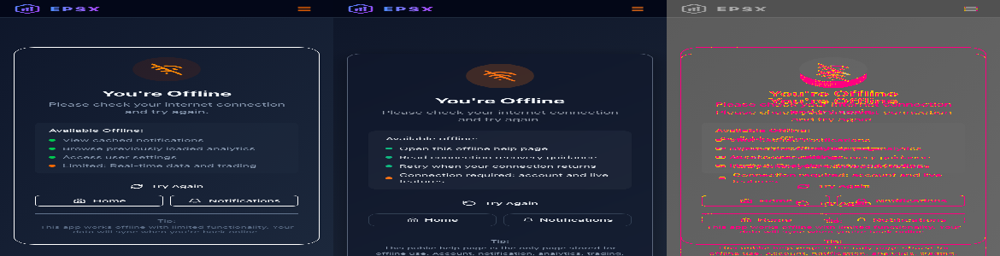

### pr1.privacy.legal — desktop-light


### pr1.privacy.legal — mobile-dark


### pr1.shell.home — desktop-light


### pr1.shell.home — mobile-dark


### pr1.terms.legal — desktop-light

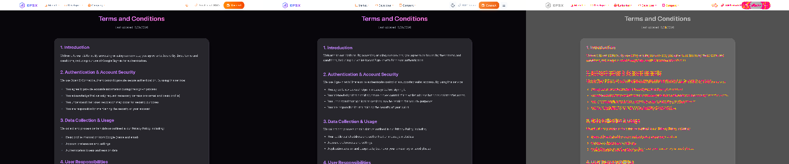

### pr1.terms.legal — mobile-dark


### pr2.account.verified — desktop-light

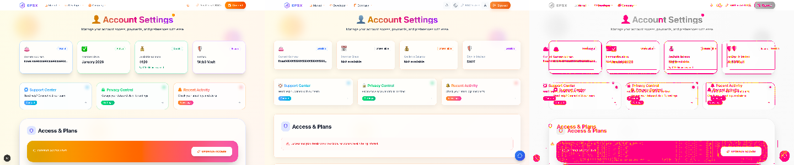

### pr2.account.verified — mobile-dark


### pr2.admin.settings — desktop-light


### pr2.admin.settings — mobile-dark


### pr2.admin.wrong-audience — desktop-light


### pr2.admin.wrong-audience — mobile-dark


### pr2.auth.dependency-failure — desktop-light


### pr2.auth.dependency-failure — mobile-dark

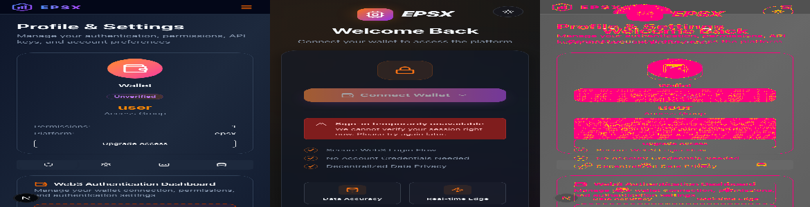

### pr2.auth.logout — desktop-light


### pr2.auth.logout — mobile-dark


### pr2.auth.signed-out — desktop-light


### pr2.auth.signed-out — mobile-dark


### pr2.frontend.wrong-audience — desktop-light


### pr2.frontend.wrong-audience — mobile-dark


### pr2.permissions.empty-claims — desktop-light


### pr2.permissions.empty-claims — mobile-dark


### pr2.permissions.verified — desktop-light


### pr2.permissions.verified — mobile-dark


### pr2.profile.verified — desktop-light


### pr2.profile.verified — mobile-dark


## Runtime rollback gate

Every repeat restored a guarded `epsx_e2e_*` PostgreSQL database from its template, deleted only the `epsx:e2e:*` Redis namespace, reverted Anvil chain 31337 to its recorded snapshot, reset fixture requests/mutations, and cleared its isolated browser context. PostgreSQL checksums and row counts, transient queue/outbox emptiness, Redis hashes, Anvil account/block state, and fixture counters matched the baseline after reset.

Final process-stopped rollback: **PASS**. The source and target applications were stopped before the final reset and smoke, preventing background polling from repopulating fixture or durable state. The full artifact manifest includes `reset-final.json` with every baseline comparison.

## Full artifacts

The CI artifact contains full-resolution PNGs, video, traces, HAR/network data, DOM, accessibility snapshots, browser/server logs, Playwright HTML, and reset proofs. [`artifact-manifest.json`](./artifact-manifest.json) records the SHA-256 and byte length of every file in that artifact.

## Reproduce

```bash
bun install --frozen-lockfile
bunx playwright install chromium
bun e2e/migration/cli.ts run --group 2
bun e2e/migration/cli.ts verify-artifacts --group 2
```
