# PR 3 — cumulative migration E2E evidence

Result: **PASS**

Source Next.js SHA: `373bd231cb7a616c3d4c0ddc1d60e0099a88a5db`

Target Rust/Dioxus SHA: `4bf6a63f4794b77b5bc2bd218cf51ed072e13ae5`

Generated: 2026-07-30T01:35:56.338Z

This report covers every executable scenario owned by cumulative groups 0–3. Visual differences above 1% require a machine-readable non-styling exception.

## Scenario evidence

| Scenario | Matrix | Result / coverage | Next.js | Rust/Dioxus | Highlighted diff | Δ pixels | Difference disposition | Reset proof |
|---|---|---|---|---|---|---:|---|---|
| `pr0.public.about` | `desktop-light` | PASS; 2 clean repeats | [](./pr0.public.about--desktop-light--source.png) | [](./pr0.public.about--desktop-light--target.png) | [](./pr0.public.about--desktop-light--diff.png) | 8.3697% | PR 0 establishes the immutable baseline and reproducible evidence path; source/target parity disposition is owned by PR 1. | pre=PASS, post=PASS |
| `pr0.public.about` | `mobile-dark` | PASS; 2 clean repeats | [](./pr0.public.about--mobile-dark--source.png) | [](./pr0.public.about--mobile-dark--target.png) | [](./pr0.public.about--mobile-dark--diff.png) | 15.6568% | PR 0 establishes the immutable baseline and reproducible evidence path; source/target parity disposition is owned by PR 1. | pre=PASS, post=PASS |
| `pr0.public.contact` | `desktop-light` | PASS; 2 clean repeats | [](./pr0.public.contact--desktop-light--source.png) | [](./pr0.public.contact--desktop-light--target.png) | [](./pr0.public.contact--desktop-light--diff.png) | 8.3697% | PR 0 establishes the immutable baseline and reproducible evidence path; source/target parity disposition is owned by PR 1. | pre=PASS, post=PASS |
| `pr0.public.contact` | `mobile-dark` | PASS; 2 clean repeats | [](./pr0.public.contact--mobile-dark--source.png) | [](./pr0.public.contact--mobile-dark--target.png) | [](./pr0.public.contact--mobile-dark--diff.png) | 15.6568% | PR 0 establishes the immutable baseline and reproducible evidence path; source/target parity disposition is owned by PR 1. | pre=PASS, post=PASS |
| `pr0.public.home` | `desktop-light` | PASS; 2 clean repeats | [](./pr0.public.home--desktop-light--source.png) | [](./pr0.public.home--desktop-light--target.png) | [](./pr0.public.home--desktop-light--diff.png) | 8.7815% | PR 0 establishes the immutable baseline and reproducible evidence path; source/target parity disposition is owned by PR 1. | pre=PASS, post=PASS |
| `pr0.public.home` | `mobile-dark` | PASS; 2 clean repeats | [](./pr0.public.home--mobile-dark--source.png) | [](./pr0.public.home--mobile-dark--target.png) | [](./pr0.public.home--mobile-dark--diff.png) | 20.2689% | PR 0 establishes the immutable baseline and reproducible evidence path; source/target parity disposition is owned by PR 1. | pre=PASS, post=PASS |
| `pr1.about.authenticated` | `desktop-light` | PASS; 2 clean repeats | [](./pr1.about.authenticated--desktop-light--source.png) | [](./pr1.about.authenticated--desktop-light--target.png) | [](./pr1.about.authenticated--desktop-light--diff.png) | 0.6133% | Within the 1% campaign visual threshold. | pre=PASS, post=PASS |
| `pr1.about.authenticated` | `mobile-dark` | PASS; 2 clean repeats | [](./pr1.about.authenticated--mobile-dark--source.png) | [](./pr1.about.authenticated--mobile-dark--target.png) | [](./pr1.about.authenticated--mobile-dark--diff.png) | 1.1177% | The target validates the fixture's signed frontend session with the Rust BFF and renders the authenticated, owner-scoped chat control. The pinned source middleware admits the cookie for this public body but its client shell has no verified identity and therefore omits that control. With the authenticated control region excluded, the screenshot delta is below 1%. | pre=PASS, post=PASS |
| `pr1.admin.denial-query` | `desktop-light` | PASS; 2 clean repeats | [](./pr1.admin.denial-query--desktop-light--source.png) | [](./pr1.admin.denial-query--desktop-light--target.png) | [](./pr1.admin.denial-query--desktop-light--diff.png) | 1.5624% | The pinned source presents browser-controlled reason and detail parameters as authoritative denial evidence. The target ignores those claims and explains that only the authenticated session and backend permissions determine access. | pre=PASS, post=PASS |
| `pr1.admin.denial-query` | `mobile-dark` | PASS; 2 clean repeats | [](./pr1.admin.denial-query--mobile-dark--source.png) | [](./pr1.admin.denial-query--mobile-dark--target.png) | [](./pr1.admin.denial-query--mobile-dark--diff.png) | 12.771% | The pinned source presents browser-controlled reason and detail parameters as authoritative denial evidence. The target ignores those claims and explains that only the authenticated session and backend permissions determine access. | pre=PASS, post=PASS |
| `pr1.admin.unauthorized` | `desktop-light` | PASS; 2 clean repeats | [](./pr1.admin.unauthorized--desktop-light--source.png) | [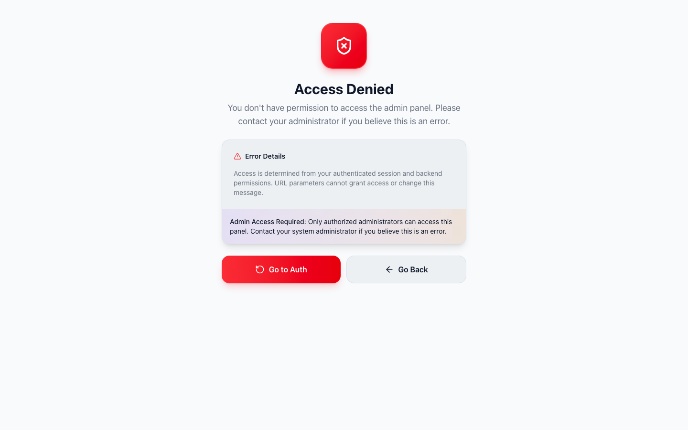](./pr1.admin.unauthorized--desktop-light--target.png) | [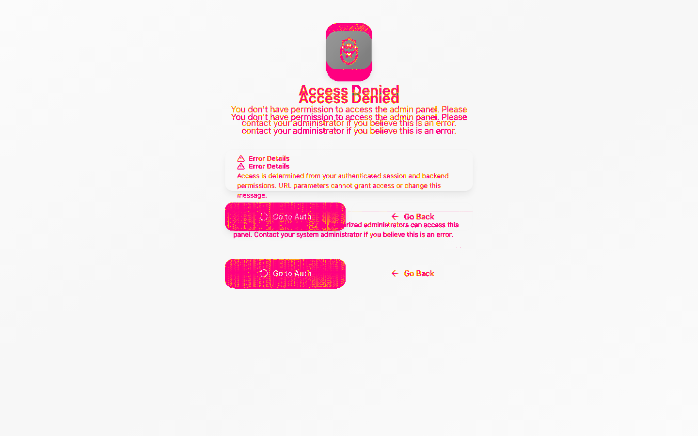](./pr1.admin.unauthorized--desktop-light--diff.png) | 3.5723% | The target removes browser-controlled denial context and adds static administrator guidance without claiming an unverified route, permission, or backend error. Access remains determined by the Rust backend. | pre=PASS, post=PASS |
| `pr1.admin.unauthorized` | `mobile-dark` | PASS; 2 clean repeats | [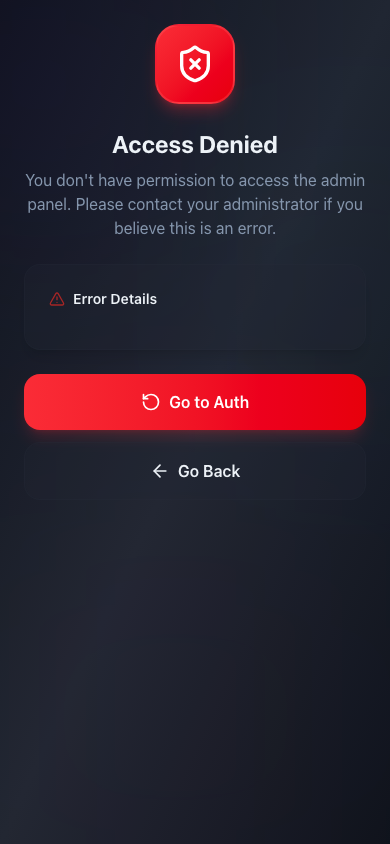](./pr1.admin.unauthorized--mobile-dark--source.png) | [](./pr1.admin.unauthorized--mobile-dark--target.png) | [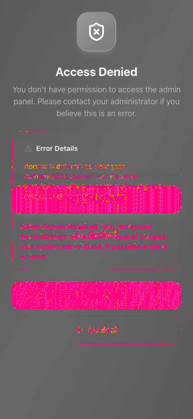](./pr1.admin.unauthorized--mobile-dark--diff.png) | 12.5586% | The target removes browser-controlled denial context and adds static administrator guidance without claiming an unverified route, permission, or backend error. Access remains determined by the Rust backend. | pre=PASS, post=PASS |
| `pr1.auth.about-redirect` | `desktop-light` | PASS; 2 clean repeats | [](./pr1.auth.about-redirect--desktop-light--source.png) | [](./pr1.auth.about-redirect--desktop-light--target.png) | [](./pr1.auth.about-redirect--desktop-light--diff.png) | 8.3697% | The pinned source auth surface asserts that the network is secure and operational without a backend health proof and advertises an unverified customer count. The target keeps the wallet CTA and feature geometry while replacing those claims with a static wallet-sign-in description and truthful product copy. | pre=PASS, post=PASS |
| `pr1.auth.about-redirect` | `mobile-dark` | PASS; 2 clean repeats | [](./pr1.auth.about-redirect--mobile-dark--source.png) | [](./pr1.auth.about-redirect--mobile-dark--target.png) | [](./pr1.auth.about-redirect--mobile-dark--diff.png) | 15.6565% | The pinned source auth surface asserts that the network is secure and operational without a backend health proof and advertises an unverified customer count. The target keeps the wallet CTA and feature geometry while replacing those claims with a static wallet-sign-in description and truthful product copy. | pre=PASS, post=PASS |
| `pr1.auth.contact-redirect` | `desktop-light` | PASS; 2 clean repeats | [](./pr1.auth.contact-redirect--desktop-light--source.png) | [](./pr1.auth.contact-redirect--desktop-light--target.png) | [](./pr1.auth.contact-redirect--desktop-light--diff.png) | 8.3697% | The pinned source auth surface asserts that the network is secure and operational without a backend health proof and advertises an unverified customer count. The target keeps the wallet CTA and feature geometry while replacing those claims with a static wallet-sign-in description and truthful product copy. | pre=PASS, post=PASS |
| `pr1.auth.contact-redirect` | `mobile-dark` | PASS; 2 clean repeats | [](./pr1.auth.contact-redirect--mobile-dark--source.png) | [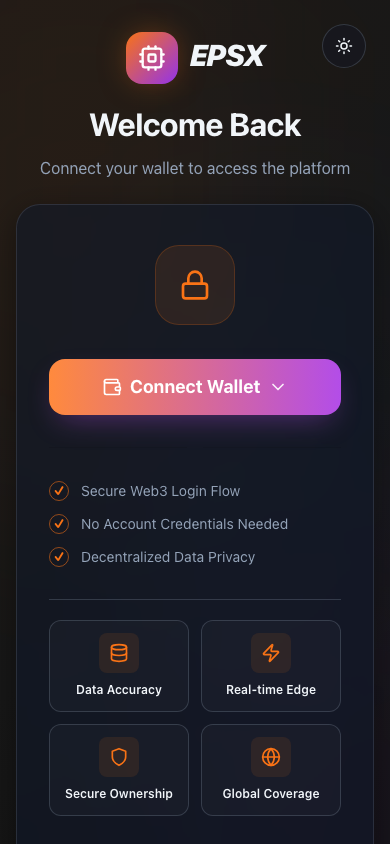](./pr1.auth.contact-redirect--mobile-dark--target.png) | [](./pr1.auth.contact-redirect--mobile-dark--diff.png) | 15.6568% | The pinned source auth surface asserts that the network is secure and operational without a backend health proof and advertises an unverified customer count. The target keeps the wallet CTA and feature geometry while replacing those claims with a static wallet-sign-in description and truthful product copy. | pre=PASS, post=PASS |
| `pr1.contact.authenticated` | `desktop-light` | PASS; 2 clean repeats | [](./pr1.contact.authenticated--desktop-light--source.png) | [](./pr1.contact.authenticated--desktop-light--target.png) | [](./pr1.contact.authenticated--desktop-light--diff.png) | 0.376% | Within the 1% campaign visual threshold. | pre=PASS, post=PASS |
| `pr1.contact.authenticated` | `mobile-dark` | PASS; 2 clean repeats | [](./pr1.contact.authenticated--mobile-dark--source.png) | [](./pr1.contact.authenticated--mobile-dark--target.png) | [](./pr1.contact.authenticated--mobile-dark--diff.png) | 1.5825% | The target validates the fixture's signed frontend session with the Rust BFF and renders the authenticated, owner-scoped chat control. The pinned source middleware admits the cookie for this public body but its client shell has no verified identity and therefore omits that control. With the authenticated control region excluded, the screenshot delta is below 1%. | pre=PASS, post=PASS |
| `pr1.error.access-denied` | `desktop-light` | PASS; 2 clean repeats | [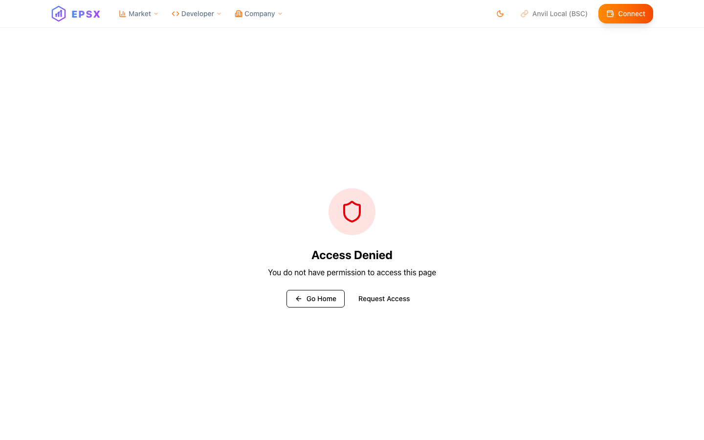](./pr1.error.access-denied--desktop-light--source.png) | [](./pr1.error.access-denied--desktop-light--target.png) | [](./pr1.error.access-denied--desktop-light--diff.png) | 0.8513% | Within the 1% campaign visual threshold. | pre=PASS, post=PASS |
| `pr1.error.access-denied` | `mobile-dark` | PASS; 2 clean repeats | [](./pr1.error.access-denied--mobile-dark--source.png) | [](./pr1.error.access-denied--mobile-dark--target.png) | [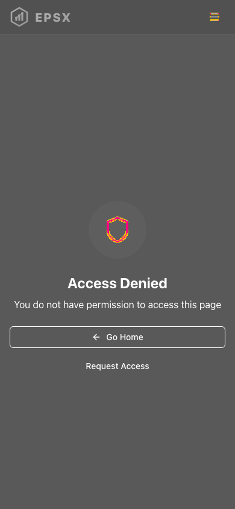](./pr1.error.access-denied--mobile-dark--diff.png) | 0.0933% | Within the 1% campaign visual threshold. | pre=PASS, post=PASS |
| `pr1.error.not-found` | `desktop-light` | PASS; 2 clean repeats | [](./pr1.error.not-found--desktop-light--source.png) | [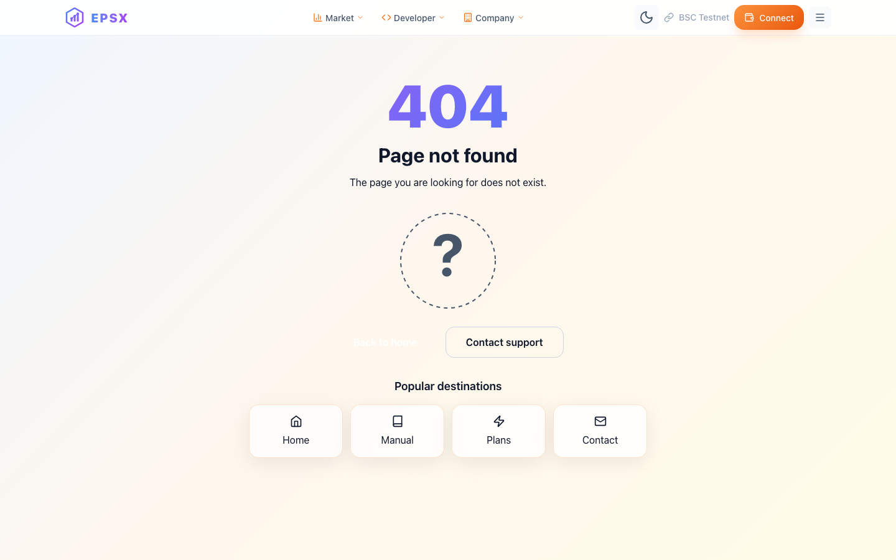](./pr1.error.not-found--desktop-light--target.png) | [](./pr1.error.not-found--desktop-light--diff.png) | 8.7822% | The pinned source masks an unknown signed-out route by redirecting to authentication. The target preserves the HTTP 404 boundary and renders safe recovery links, so route existence and error semantics are not confused with an authorization decision. | pre=PASS, post=PASS |
| `pr1.error.not-found` | `mobile-dark` | PASS; 2 clean repeats | [](./pr1.error.not-found--mobile-dark--source.png) | [](./pr1.error.not-found--mobile-dark--target.png) | [](./pr1.error.not-found--mobile-dark--diff.png) | 12.4338% | The pinned source masks an unknown signed-out route by redirecting to authentication. The target preserves the HTTP 404 boundary and renders safe recovery links, so route existence and error semantics are not confused with an authorization decision. | pre=PASS, post=PASS |
| `pr1.offline.public` | `desktop-light` | PASS; 2 clean repeats | [](./pr1.offline.public--desktop-light--source.png) | [](./pr1.offline.public--desktop-light--target.png) | [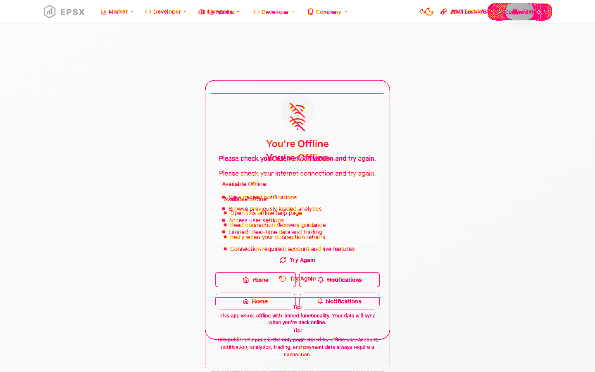](./pr1.offline.public--desktop-light--diff.png) | 2.0041% | The pinned source offline page claims cached dashboard and analytics capabilities that have no verified service-worker cache contract. The target limits its availability list to the static shell and recovery actions that actually work offline. | pre=PASS, post=PASS |
| `pr1.offline.public` | `mobile-dark` | PASS; 2 clean repeats | [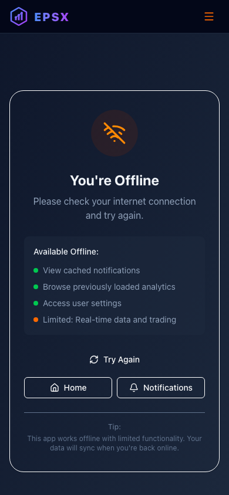](./pr1.offline.public--mobile-dark--source.png) | [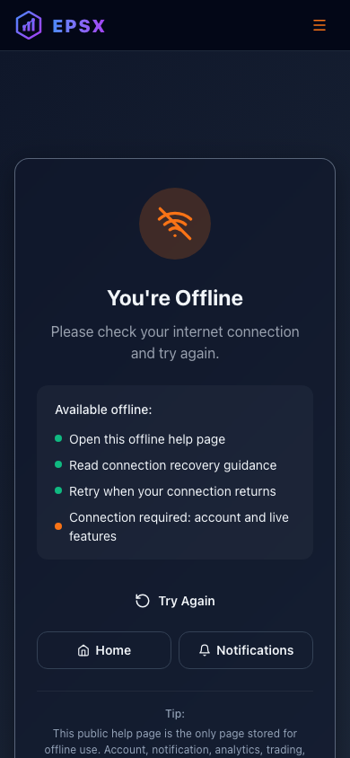](./pr1.offline.public--mobile-dark--target.png) | [](./pr1.offline.public--mobile-dark--diff.png) | 6.1298% | The pinned source offline page claims cached dashboard and analytics capabilities that have no verified service-worker cache contract. The target limits its availability list to the static shell and recovery actions that actually work offline. | pre=PASS, post=PASS |
| `pr1.privacy.legal` | `desktop-light` | PASS; 2 clean repeats | [](./pr1.privacy.legal--desktop-light--source.png) | [](./pr1.privacy.legal--desktop-light--target.png) | [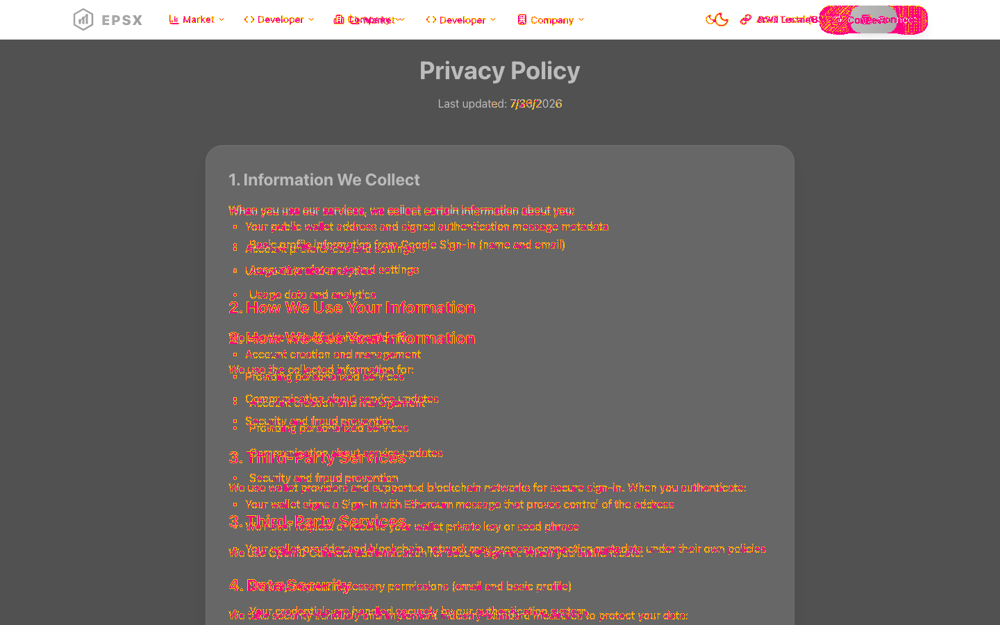](./pr1.privacy.legal--desktop-light--diff.png) | 2.4258% | The pinned source privacy policy describes Google/OIDC and OAuth data flows that this wallet-only application does not use. The target accurately documents wallet addresses, EIP-4361 signatures, nonce/session handling, and provides a real contact link. | pre=PASS, post=PASS |
| `pr1.privacy.legal` | `mobile-dark` | PASS; 2 clean repeats | [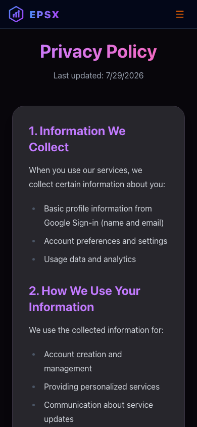](./pr1.privacy.legal--mobile-dark--source.png) | [](./pr1.privacy.legal--mobile-dark--target.png) | [](./pr1.privacy.legal--mobile-dark--diff.png) | 4.228% | The pinned source privacy policy describes Google/OIDC and OAuth data flows that this wallet-only application does not use. The target accurately documents wallet addresses, EIP-4361 signatures, nonce/session handling, and provides a real contact link. | pre=PASS, post=PASS |
| `pr1.shell.home` | `desktop-light` | PASS; 2 clean repeats | [](./pr1.shell.home--desktop-light--source.png) | [](./pr1.shell.home--desktop-light--target.png) | [](./pr1.shell.home--desktop-light--diff.png) | 8.7815% | The pinned source hero advertises real-time analytics and interactive sharing before their verified public data contracts are available. The target replaces those claims with truthful navigation to dedicated routes; the shell structure and controls remain functional. | pre=PASS, post=PASS |
| `pr1.shell.home` | `mobile-dark` | PASS; 2 clean repeats | [](./pr1.shell.home--mobile-dark--source.png) | [](./pr1.shell.home--mobile-dark--target.png) | [](./pr1.shell.home--mobile-dark--diff.png) | 20.2722% | The pinned source hero advertises real-time analytics and interactive sharing before their verified public data contracts are available. The target replaces those claims with truthful navigation to dedicated routes; the shell structure and controls remain functional. | pre=PASS, post=PASS |
| `pr1.terms.legal` | `desktop-light` | PASS; 2 clean repeats | [](./pr1.terms.legal--desktop-light--source.png) | [](./pr1.terms.legal--desktop-light--target.png) | [](./pr1.terms.legal--desktop-light--diff.png) | 2.6083% | The pinned source terms describe OAuth and Google sign-in and render non-functional subscription controls. The target states the wallet/SIWE authentication contract, links to contact, and removes the unsupported pseudo-form. | pre=PASS, post=PASS |
| `pr1.terms.legal` | `mobile-dark` | PASS; 2 clean repeats | [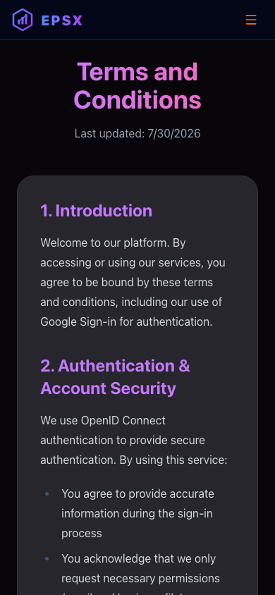](./pr1.terms.legal--mobile-dark--source.png) | [](./pr1.terms.legal--mobile-dark--target.png) | [](./pr1.terms.legal--mobile-dark--diff.png) | 4.2548% | The pinned source terms describe OAuth and Google sign-in and render non-functional subscription controls. The target states the wallet/SIWE authentication contract, links to contact, and removes the unsupported pseudo-form. | pre=PASS, post=PASS |
| `pr2.account.verified` | `desktop-light` | PASS; 2 clean repeats | [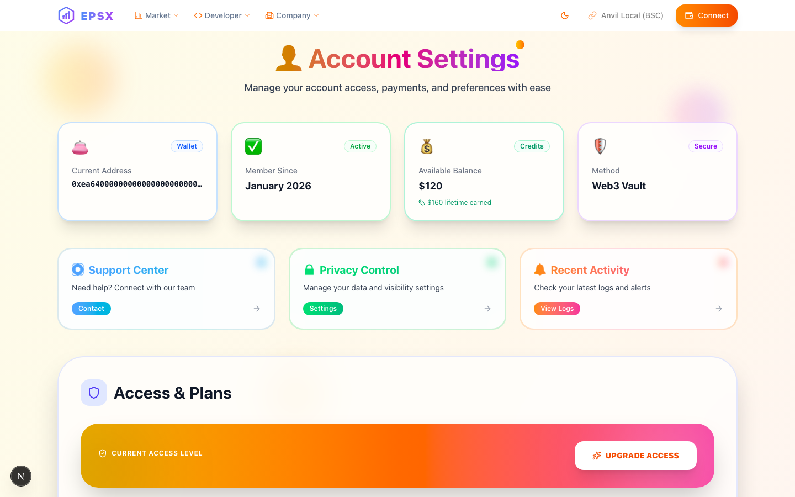](./pr2.account.verified--desktop-light--source.png) | [](./pr2.account.verified--desktop-light--target.png) | [](./pr2.account.verified--desktop-light--diff.png) | 13.9544% | The pinned source mixes a server session with client wallet state and renders fixture-derived membership, credit, plan, feature, payment, and preference claims. The target renders the verified wallet and SIWE method but marks every unselected owner-scoped backend projection unavailable instead of inventing authority. | pre=PASS, post=PASS |
| `pr2.account.verified` | `mobile-dark` | PASS; 2 clean repeats | [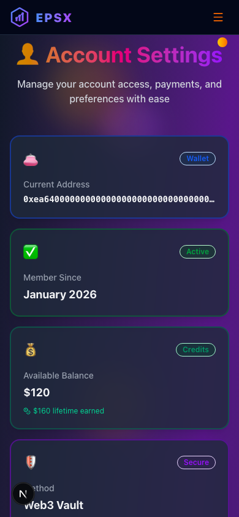](./pr2.account.verified--mobile-dark--source.png) | [](./pr2.account.verified--mobile-dark--target.png) | [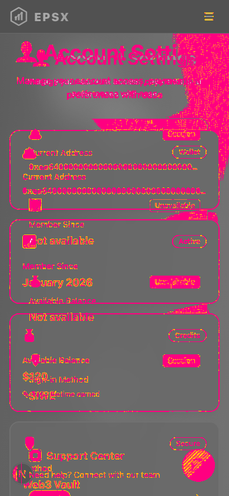](./pr2.account.verified--mobile-dark--diff.png) | 15.1571% | The pinned source mixes a server session with client wallet state and renders fixture-derived membership, credit, plan, feature, payment, and preference claims. The target renders the verified wallet and SIWE method but marks every unselected owner-scoped backend projection unavailable instead of inventing authority. | pre=PASS, post=PASS |
| `pr2.admin.settings` | `desktop-light` | PASS; 2 clean repeats | [](./pr2.admin.settings--desktop-light--source.png) | [](./pr2.admin.settings--desktop-light--target.png) | [](./pr2.admin.settings--desktop-light--diff.png) | 5.7444% | The pinned source renders fixture-owned administrator contact and maintenance values as settings. The target keeps the authenticated settings route but explicitly declines to project those claims when the Rust adapter cannot verify its strict backend contract. | pre=PASS, post=PASS |
| `pr2.admin.settings` | `mobile-dark` | PASS; 2 clean repeats | [](./pr2.admin.settings--mobile-dark--source.png) | [](./pr2.admin.settings--mobile-dark--target.png) | [](./pr2.admin.settings--mobile-dark--diff.png) | 8.741% | The pinned source renders fixture-owned administrator contact and maintenance values as settings. The target keeps the authenticated settings route but explicitly declines to project those claims when the Rust adapter cannot verify its strict backend contract. | pre=PASS, post=PASS |
| `pr2.admin.wrong-audience` | `desktop-light` | PASS; 2 clean repeats | [](./pr2.admin.wrong-audience--desktop-light--source.png) | [](./pr2.admin.wrong-audience--desktop-light--target.png) | [](./pr2.admin.wrong-audience--desktop-light--diff.png) | 25.2198% | The source receives its valid admin baseline session, while the target receives an equally signed frontend-audience token and must replace all administrator settings with the public Admin Access gate. | pre=PASS, post=PASS |
| `pr2.admin.wrong-audience` | `mobile-dark` | PASS; 2 clean repeats | [](./pr2.admin.wrong-audience--mobile-dark--source.png) | [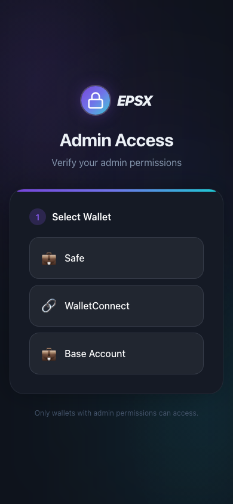](./pr2.admin.wrong-audience--mobile-dark--target.png) | [](./pr2.admin.wrong-audience--mobile-dark--diff.png) | 6.7013% | The source receives its valid admin baseline session, while the target receives an equally signed frontend-audience token and must replace all administrator settings with the public Admin Access gate. | pre=PASS, post=PASS |
| `pr2.auth.dependency-failure` | `desktop-light` | PASS; 2 clean repeats | [](./pr2.auth.dependency-failure--desktop-light--source.png) | [](./pr2.auth.dependency-failure--desktop-light--target.png) | [](./pr2.auth.dependency-failure--desktop-light--diff.png) | 8.5552% | The source receives its normal valid-session baseline. The target's token uses an uncached key identifier while identity verification is unavailable, so the Rust verifier clears unprovable authority and renders the explicit unavailable sign-in gate. | pre=PASS, post=PASS |
| `pr2.auth.dependency-failure` | `mobile-dark` | PASS; 2 clean repeats | [](./pr2.auth.dependency-failure--mobile-dark--source.png) | [](./pr2.auth.dependency-failure--mobile-dark--target.png) | [](./pr2.auth.dependency-failure--mobile-dark--diff.png) | 19.5331% | The source receives its normal valid-session baseline. The target's token uses an uncached key identifier while identity verification is unavailable, so the Rust verifier clears unprovable authority and renders the explicit unavailable sign-in gate. | pre=PASS, post=PASS |
| `pr2.auth.logout` | `desktop-light` | PASS; 2 clean repeats | [](./pr2.auth.logout--desktop-light--source.png) | [](./pr2.auth.logout--desktop-light--target.png) | [](./pr2.auth.logout--desktop-light--diff.png) | 9.0935% | Both captures finish signed out after their respective session-clearing mechanisms. The residual public-home difference is the same removal of unsupported live-market, social-proof, customer, and call-to-action claims approved for the shared-shell home capture. | pre=PASS, post=PASS |
| `pr2.auth.logout` | `mobile-dark` | PASS; 2 clean repeats | [](./pr2.auth.logout--mobile-dark--source.png) | [](./pr2.auth.logout--mobile-dark--target.png) | [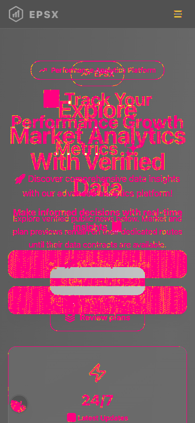](./pr2.auth.logout--mobile-dark--diff.png) | 20.5095% | Both captures finish signed out after their respective session-clearing mechanisms. The residual public-home difference is the same removal of unsupported live-market, social-proof, customer, and call-to-action claims approved for the shared-shell home capture. | pre=PASS, post=PASS |
| `pr2.auth.signed-out` | `desktop-light` | PASS; 2 clean repeats | [](./pr2.auth.signed-out--desktop-light--source.png) | [](./pr2.auth.signed-out--desktop-light--target.png) | [](./pr2.auth.signed-out--desktop-light--diff.png) | 8.3697% | The pinned source sign-in gate claims secure operation and customer adoption without backend evidence. The target preserves the wallet CTA and gate structure while removing those unverified claims and describing only the wallet-based authentication contract. | pre=PASS, post=PASS |
| `pr2.auth.signed-out` | `mobile-dark` | PASS; 2 clean repeats | [](./pr2.auth.signed-out--mobile-dark--source.png) | [](./pr2.auth.signed-out--mobile-dark--target.png) | [](./pr2.auth.signed-out--mobile-dark--diff.png) | 15.6565% | The pinned source sign-in gate claims secure operation and customer adoption without backend evidence. The target preserves the wallet CTA and gate structure while removing those unverified claims and describing only the wallet-based authentication contract. | pre=PASS, post=PASS |
| `pr2.frontend.wrong-audience` | `desktop-light` | PASS; 2 clean repeats | [](./pr2.frontend.wrong-audience--desktop-light--source.png) | [](./pr2.frontend.wrong-audience--desktop-light--target.png) | [](./pr2.frontend.wrong-audience--desktop-light--diff.png) | 8.5798% | The source receives its valid frontend-audience baseline session, while the target receives an equally signed admin-audience token and must replace the owner profile with the public authentication gate. | pre=PASS, post=PASS |
| `pr2.frontend.wrong-audience` | `mobile-dark` | PASS; 2 clean repeats | [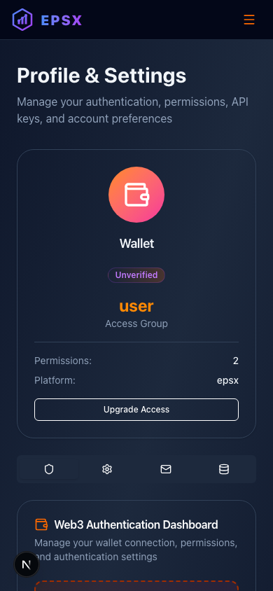](./pr2.frontend.wrong-audience--mobile-dark--source.png) | [](./pr2.frontend.wrong-audience--mobile-dark--target.png) | [](./pr2.frontend.wrong-audience--mobile-dark--diff.png) | 13.5548% | The source receives its valid frontend-audience baseline session, while the target receives an equally signed admin-audience token and must replace the owner profile with the public authentication gate. | pre=PASS, post=PASS |
| `pr2.permissions.empty-claims` | `desktop-light` | PASS; 2 clean repeats | [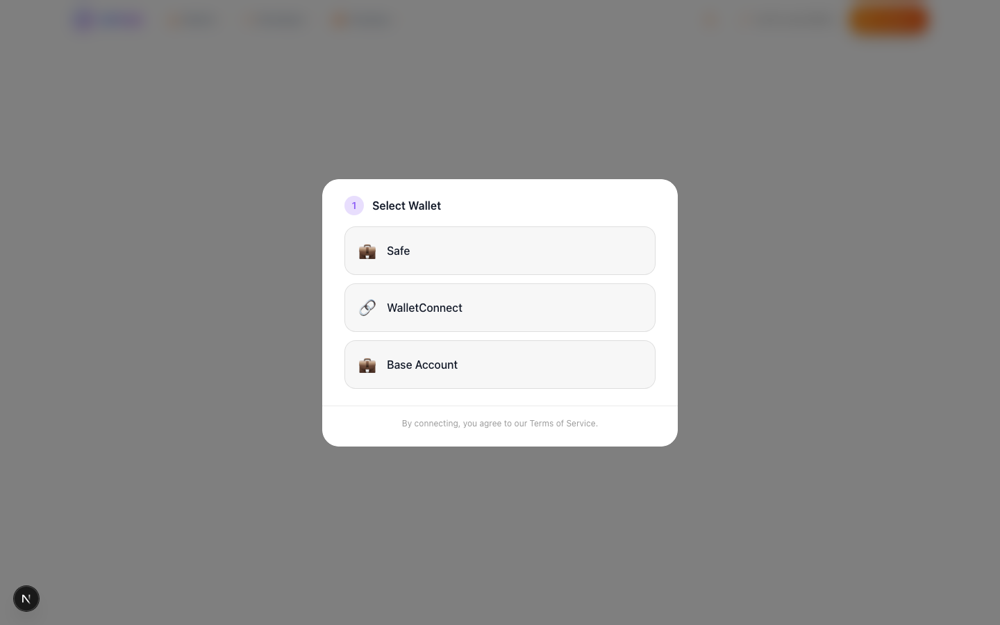](./pr2.permissions.empty-claims--desktop-light--source.png) | [](./pr2.permissions.empty-claims--desktop-light--target.png) | [](./pr2.permissions.empty-claims--desktop-light--diff.png) | 78.3572% | The pinned source client gate cannot establish authority from the valid backend session without a connected browser wallet. The target accepts the correctly signed owner session but renders an explicit zero-permission state, proving that empty backend claims stay empty and gain no frontend defaults. | pre=PASS, post=PASS |
| `pr2.permissions.empty-claims` | `mobile-dark` | PASS; 2 clean repeats | [](./pr2.permissions.empty-claims--mobile-dark--source.png) | [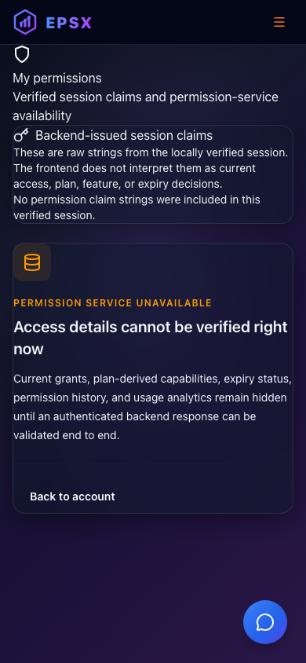](./pr2.permissions.empty-claims--mobile-dark--target.png) | [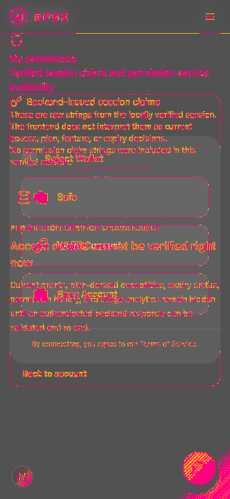](./pr2.permissions.empty-claims--mobile-dark--diff.png) | 6.7165% | The pinned source client gate cannot establish authority from the valid backend session without a connected browser wallet. The target accepts the correctly signed owner session but renders an explicit zero-permission state, proving that empty backend claims stay empty and gain no frontend defaults. | pre=PASS, post=PASS |
| `pr2.permissions.verified` | `desktop-light` | PASS; 2 clean repeats | [](./pr2.permissions.verified--desktop-light--source.png) | [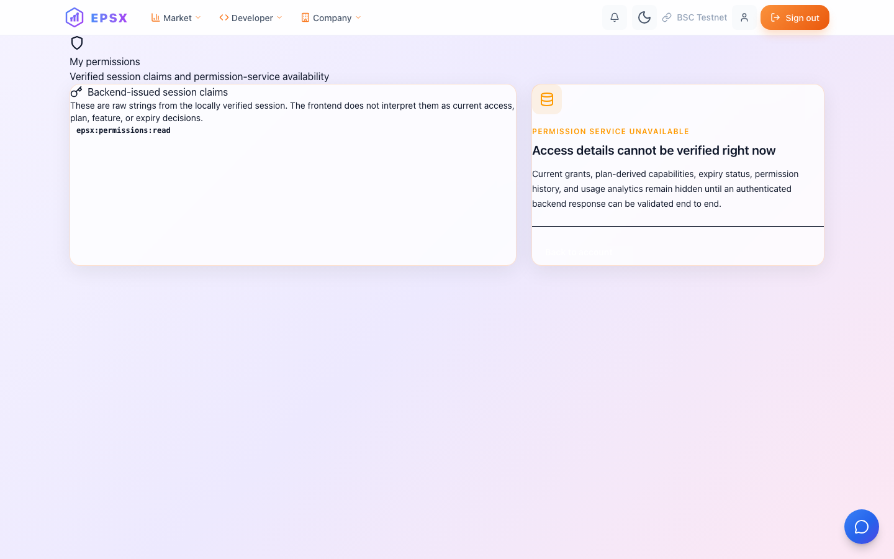](./pr2.permissions.verified--desktop-light--target.png) | [](./pr2.permissions.verified--desktop-light--diff.png) | 78.4425% | The pinned source client gate cannot establish authority from the valid backend session without a connected browser wallet and therefore obscures the permission body. The target validates the exact Rust-issued audience and scope and renders only those verified permission claims. | pre=PASS, post=PASS |
| `pr2.permissions.verified` | `mobile-dark` | PASS; 2 clean repeats | [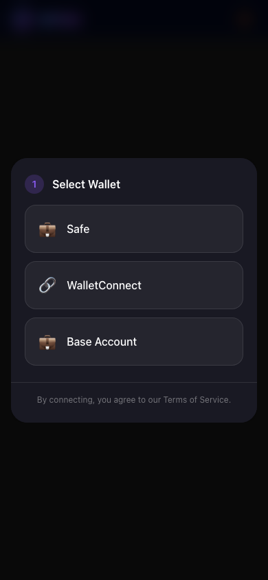](./pr2.permissions.verified--mobile-dark--source.png) | [](./pr2.permissions.verified--mobile-dark--target.png) | [](./pr2.permissions.verified--mobile-dark--diff.png) | 6.509% | The pinned source client gate cannot establish authority from the valid backend session without a connected browser wallet and therefore obscures the permission body. The target validates the exact Rust-issued audience and scope and renders only those verified permission claims. | pre=PASS, post=PASS |
| `pr2.profile.verified` | `desktop-light` | PASS; 2 clean repeats | [](./pr2.profile.verified--desktop-light--source.png) | [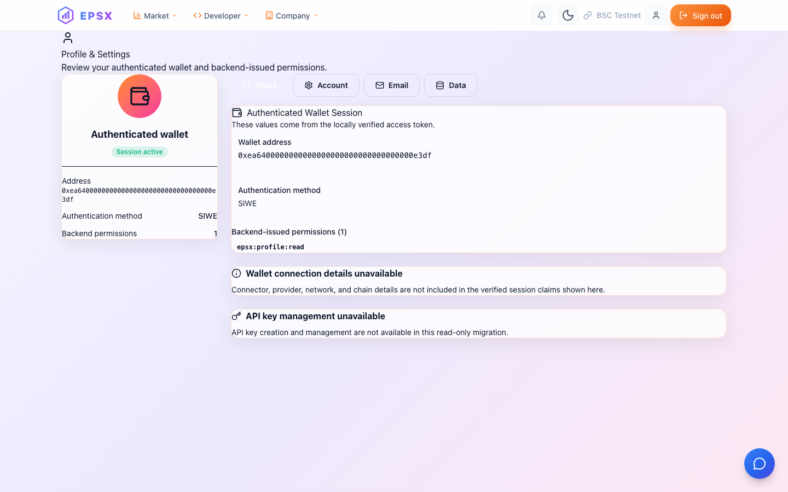](./pr2.profile.verified--desktop-light--target.png) | [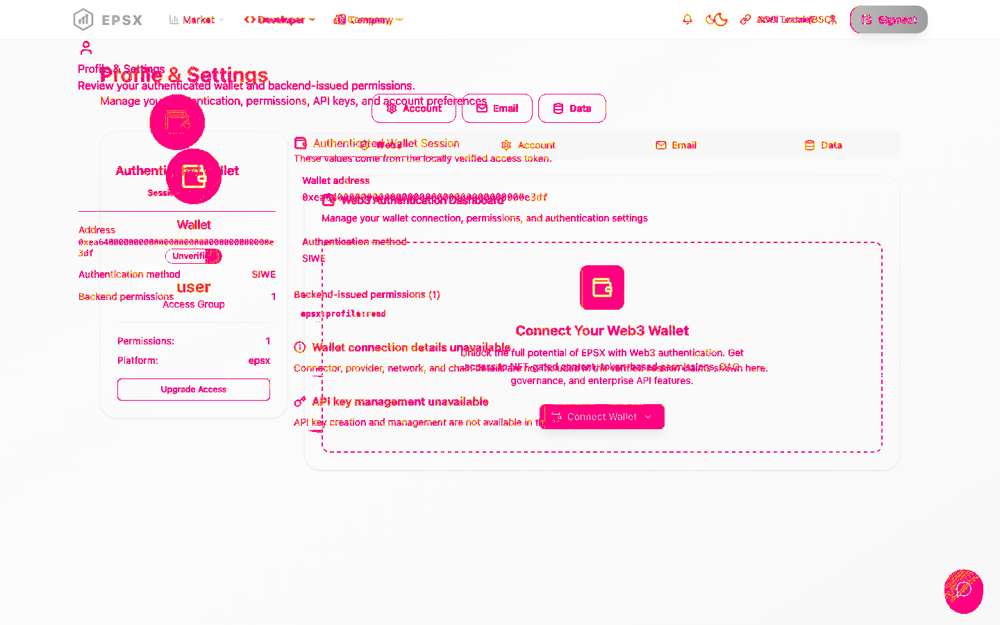](./pr2.profile.verified--desktop-light--diff.png) | 4.8801% | The pinned source profile treats browser wallet connectivity as the profile authority even when its server session is valid. The target distinguishes the backend-verified session wallet from unavailable browser-wallet and policy-management state, preserving owner identity without fabricating connected-provider capabilities. | pre=PASS, post=PASS |
| `pr2.profile.verified` | `mobile-dark` | PASS; 2 clean repeats | [](./pr2.profile.verified--mobile-dark--source.png) | [](./pr2.profile.verified--mobile-dark--target.png) | [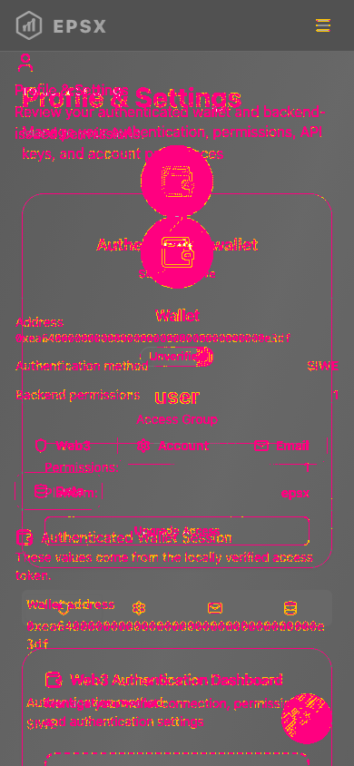](./pr2.profile.verified--mobile-dark--diff.png) | 11.1113% | The pinned source profile treats browser wallet connectivity as the profile authority even when its server session is valid. The target distinguishes the backend-verified session wallet from unavailable browser-wallet and policy-management state, preserving owner identity without fabricating connected-provider capabilities. | pre=PASS, post=PASS |
| `pr3.admin.access-forbidden` | `desktop-light` | PASS; 2 clean repeats | [](./pr3.admin.access-forbidden--desktop-light--source.png) | [](./pr3.admin.access-forbidden--desktop-light--target.png) | [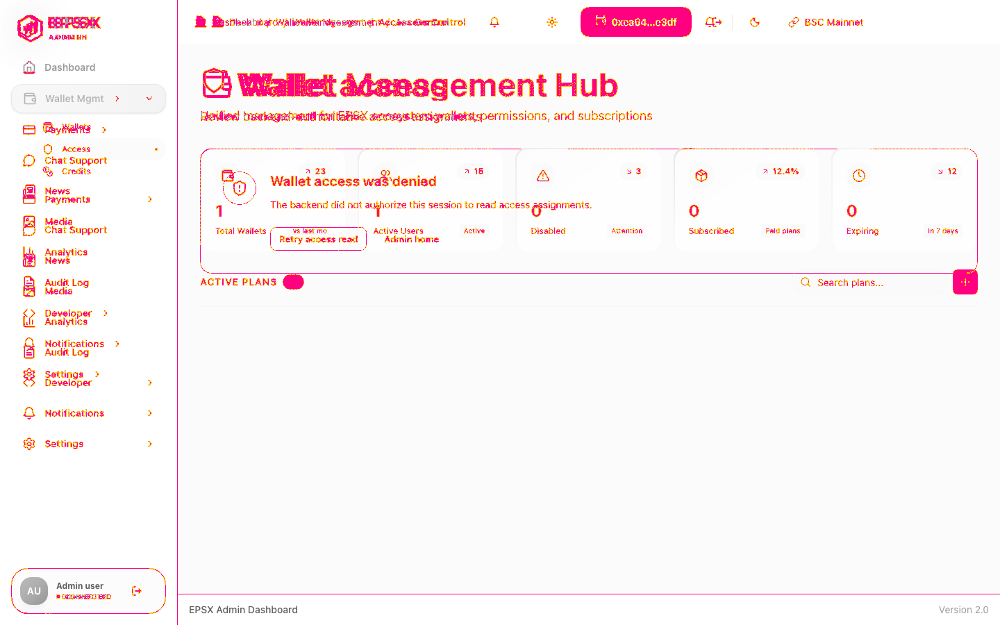](./pr3.admin.access-forbidden--desktop-light--diff.png) | 2.919% | The source receives its healthy baseline while the target subscription service denies the access read. The Rust BFF exposes no assignment fields and distinguishes the denial from empty data. | pre=PASS, post=PASS |
| `pr3.admin.access-forbidden` | `mobile-dark` | PASS; 2 clean repeats | [](./pr3.admin.access-forbidden--mobile-dark--source.png) | [](./pr3.admin.access-forbidden--mobile-dark--target.png) | [](./pr3.admin.access-forbidden--mobile-dark--diff.png) | 5.7218% | The source receives its healthy baseline while the target subscription service denies the access read. The Rust BFF exposes no assignment fields and distinguishes the denial from empty data. | pre=PASS, post=PASS |
| `pr3.admin.access` | `desktop-light` | PASS; 2 clean repeats | [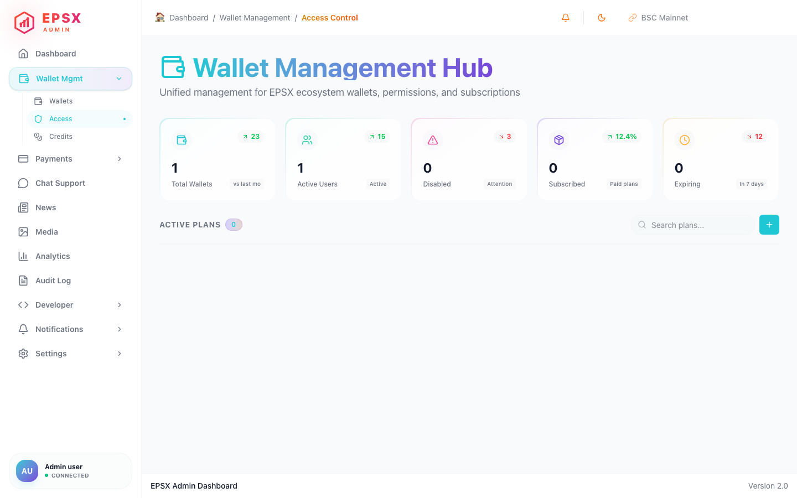](./pr3.admin.access--desktop-light--source.png) | [](./pr3.admin.access--desktop-light--target.png) | [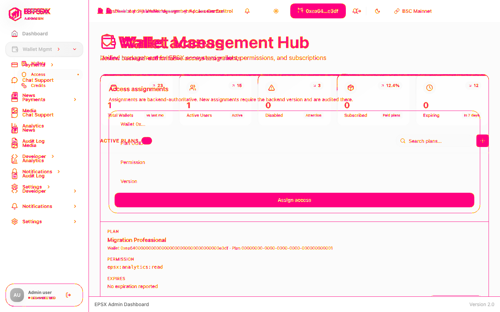](./pr3.admin.access--desktop-light--diff.png) | 7.01% | The target renders exact backend plan, wallet, permission, expiry, and version claims and omits legacy client-composed membership and hierarchy interpretations. | pre=PASS, post=PASS |
| `pr3.admin.access` | `mobile-dark` | PASS; 2 clean repeats | [](./pr3.admin.access--mobile-dark--source.png) | [](./pr3.admin.access--mobile-dark--target.png) | [](./pr3.admin.access--mobile-dark--diff.png) | 10.3318% | The target renders exact backend plan, wallet, permission, expiry, and version claims and omits legacy client-composed membership and hierarchy interpretations. | pre=PASS, post=PASS |
| `pr3.admin.audit` | `desktop-light` | PASS; 2 clean repeats | [](./pr3.admin.audit--desktop-light--source.png) | [](./pr3.admin.audit--desktop-light--target.png) | [](./pr3.admin.audit--desktop-light--diff.png) | 5.3897% | The target audit page accepts only a bounded Rust projection and intentionally omits legacy actor identity, network, device, arbitrary details, totals, and export claims. | pre=PASS, post=PASS |
| `pr3.admin.audit` | `mobile-dark` | PASS; 2 clean repeats | [](./pr3.admin.audit--mobile-dark--source.png) | [](./pr3.admin.audit--mobile-dark--target.png) | [](./pr3.admin.audit--mobile-dark--diff.png) | 10.3497% | The target audit page accepts only a bounded Rust projection and intentionally omits legacy actor identity, network, device, arbitrary details, totals, and export claims. | pre=PASS, post=PASS |
| `pr3.admin.credits-validation` | `desktop-light` | PASS; 2 clean repeats | [](./pr3.admin.credits-validation--desktop-light--source.png) | [](./pr3.admin.credits-validation--desktop-light--target.png) | [](./pr3.admin.credits-validation--desktop-light--diff.png) | 5.5569% | The target rejects an oversized credit amount at the Rust BFF boundary and renders a malformed mutation state without sending a wallet-service mutation. | pre=PASS, post=PASS |
| `pr3.admin.credits-validation` | `mobile-dark` | PASS; 2 clean repeats | [](./pr3.admin.credits-validation--mobile-dark--source.png) | [](./pr3.admin.credits-validation--mobile-dark--target.png) | [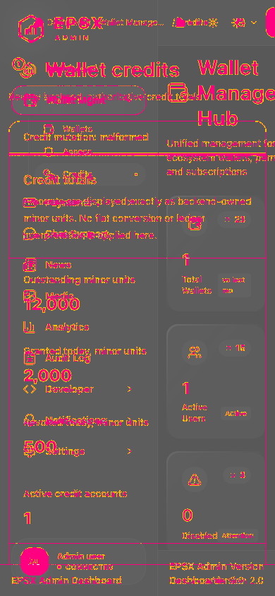](./pr3.admin.credits-validation--mobile-dark--diff.png) | 7.1737% | The target rejects an oversized credit amount at the Rust BFF boundary and renders a malformed mutation state without sending a wallet-service mutation. | pre=PASS, post=PASS |
| `pr3.admin.credits` | `desktop-light` | PASS; 2 clean repeats | [](./pr3.admin.credits--desktop-light--source.png) | [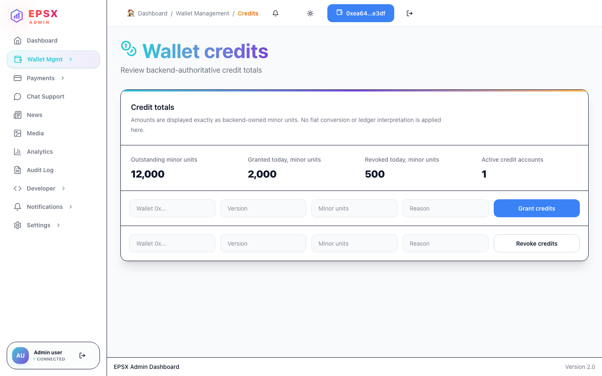](./pr3.admin.credits--desktop-light--target.png) | [](./pr3.admin.credits--desktop-light--diff.png) | 5.5229% | The target displays backend-owned minor units without fiat conversion or ledger interpretation and keeps grant/revoke authority behind the Rust service. | pre=PASS, post=PASS |
| `pr3.admin.credits` | `mobile-dark` | PASS; 2 clean repeats | [](./pr3.admin.credits--mobile-dark--source.png) | [](./pr3.admin.credits--mobile-dark--target.png) | [](./pr3.admin.credits--mobile-dark--diff.png) | 7.0054% | The target displays backend-owned minor units without fiat conversion or ledger interpretation and keeps grant/revoke authority behind the Rust service. | pre=PASS, post=PASS |
| `pr3.admin.disable-audit` | `desktop-light` | PASS; 2 clean repeats | [](./pr3.admin.disable-audit--desktop-light--source.png) | [](./pr3.admin.disable-audit--desktop-light--target.png) | [](./pr3.admin.disable-audit--desktop-light--diff.png) | 5.4138% | The pinned source comparison remains on its stable wallet detail because its client-only disable route emits an invalid duplicate-key error before any service decision. The target treats disable as committed only after an evidence-bearing wallet response, then displays the resulting bounded wallet.disabled audit summary from analytics. | pre=PASS, post=PASS |
| `pr3.admin.disable-audit` | `mobile-dark` | PASS; 2 clean repeats | [](./pr3.admin.disable-audit--mobile-dark--source.png) | [](./pr3.admin.disable-audit--mobile-dark--target.png) | [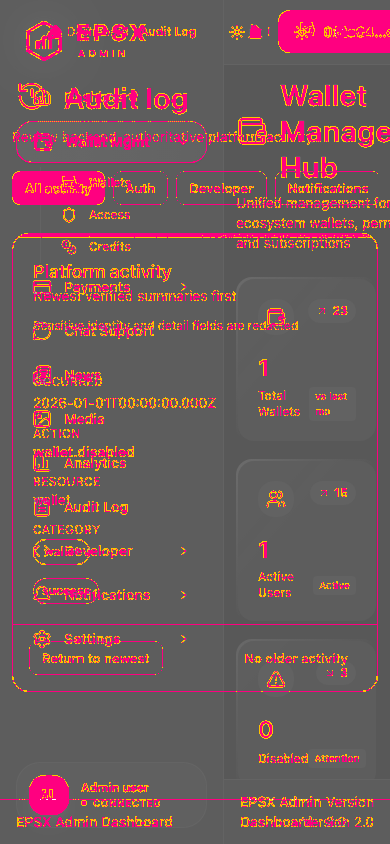](./pr3.admin.disable-audit--mobile-dark--diff.png) | 8.707% | The pinned source comparison remains on its stable wallet detail because its client-only disable route emits an invalid duplicate-key error before any service decision. The target treats disable as committed only after an evidence-bearing wallet response, then displays the resulting bounded wallet.disabled audit summary from analytics. | pre=PASS, post=PASS |
| `pr3.admin.disable` | `desktop-light` | PASS; 2 clean repeats | [](./pr3.admin.disable--desktop-light--source.png) | [](./pr3.admin.disable--desktop-light--target.png) | [](./pr3.admin.disable--desktop-light--diff.png) | 4.2421% | The pinned source comparison remains on its stable wallet detail because its client-only disable route emits an invalid duplicate-key error before any service decision. The target enters the versioned form and proves that literal admin:wallets:manage authority is required: a read-only administrator receives an explicit forbidden result and no success claim. | pre=PASS, post=PASS |
| `pr3.admin.disable` | `mobile-dark` | PASS; 2 clean repeats | [](./pr3.admin.disable--mobile-dark--source.png) | [](./pr3.admin.disable--mobile-dark--target.png) | [](./pr3.admin.disable--mobile-dark--diff.png) | 7.1901% | The pinned source comparison remains on its stable wallet detail because its client-only disable route emits an invalid duplicate-key error before any service decision. The target enters the versioned form and proves that literal admin:wallets:manage authority is required: a read-only administrator receives an explicit forbidden result and no success claim. | pre=PASS, post=PASS |
| `pr3.admin.plan-conflict` | `desktop-light` | PASS; 2 clean repeats | [](./pr3.admin.plan-conflict--desktop-light--source.png) | [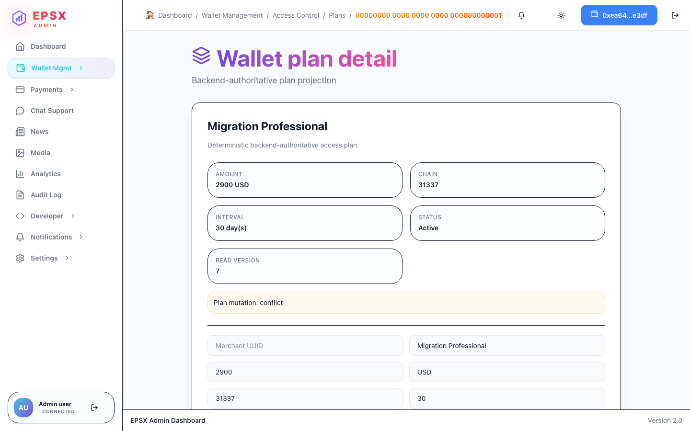](./pr3.admin.plan-conflict--desktop-light--target.png) | [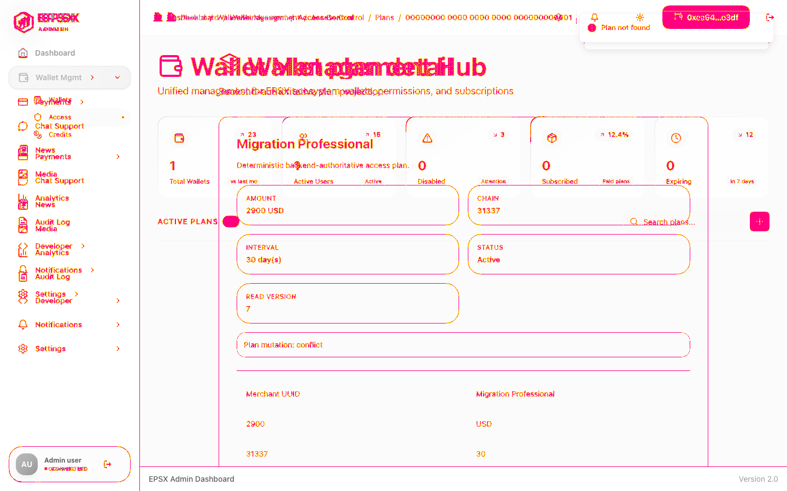](./pr3.admin.plan-conflict--desktop-light--diff.png) | 3.5666% | The target submits the read version and preserves the subscription service's 409 as an explicit optimistic-conflict state rather than inferring that an update committed. | pre=PASS, post=PASS |
| `pr3.admin.plan-conflict` | `mobile-dark` | PASS; 2 clean repeats | [](./pr3.admin.plan-conflict--mobile-dark--source.png) | [](./pr3.admin.plan-conflict--mobile-dark--target.png) | [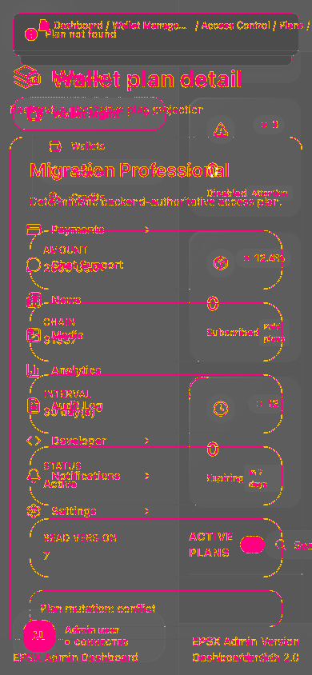](./pr3.admin.plan-conflict--mobile-dark--diff.png) | 6.6685% | The target submits the read version and preserves the subscription service's 409 as an explicit optimistic-conflict state rather than inferring that an update committed. | pre=PASS, post=PASS |
| `pr3.admin.plan-detail` | `desktop-light` | PASS; 2 clean repeats | [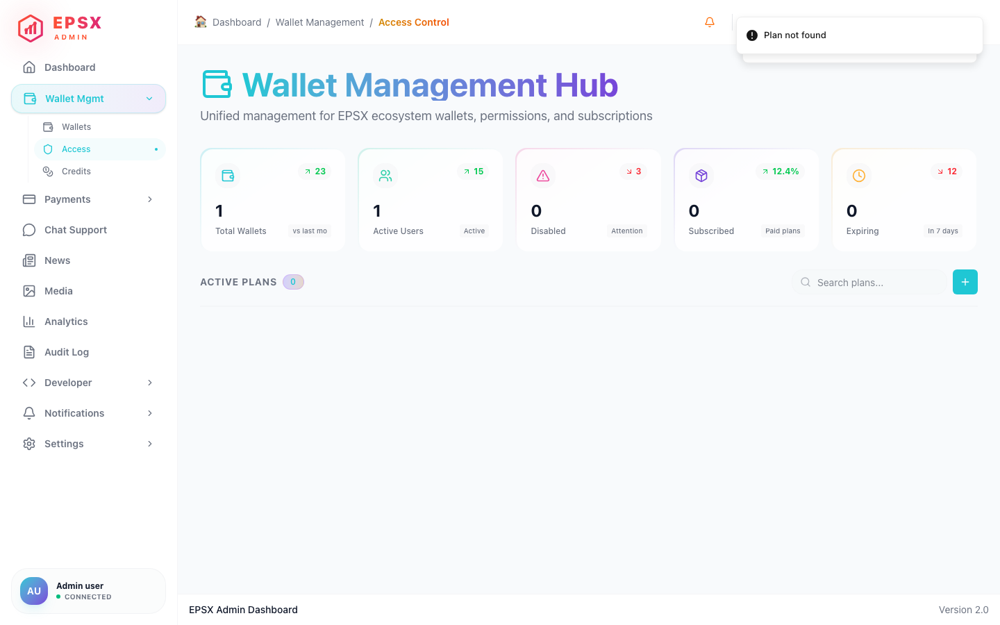](./pr3.admin.plan-detail--desktop-light--source.png) | [](./pr3.admin.plan-detail--desktop-light--target.png) | [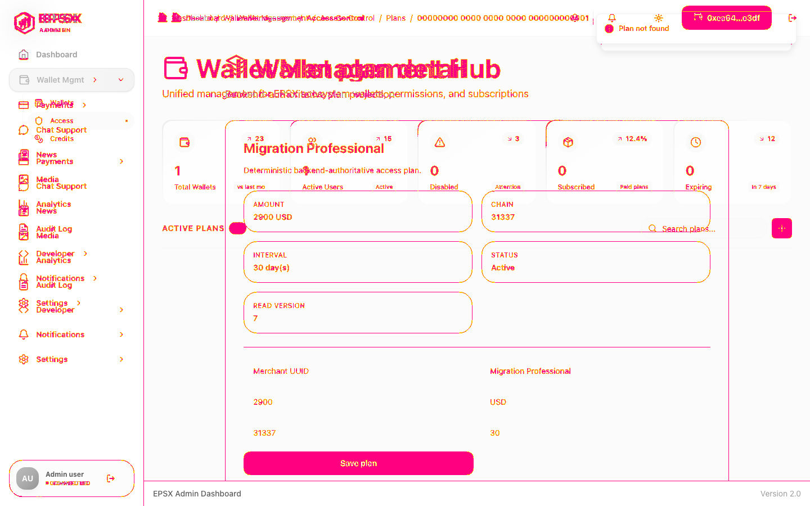](./pr3.admin.plan-detail--desktop-light--diff.png) | 4.704% | The target exposes only the Rust-verified plan identifier, amount, currency, chain, interval, active state, and version; merchant and legacy permission-policy details remain redacted. | pre=PASS, post=PASS |
| `pr3.admin.plan-detail` | `mobile-dark` | PASS; 2 clean repeats | [](./pr3.admin.plan-detail--mobile-dark--source.png) | [](./pr3.admin.plan-detail--mobile-dark--target.png) | [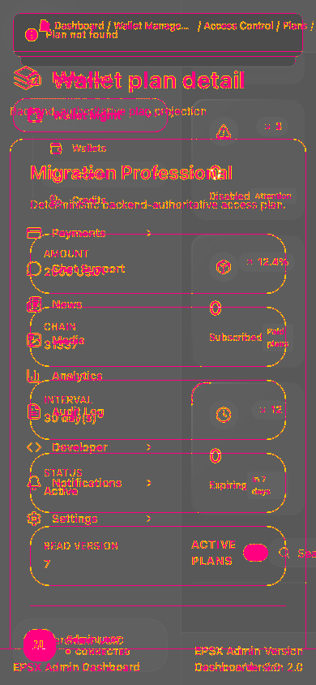](./pr3.admin.plan-detail--mobile-dark--diff.png) | 6.5357% | The target exposes only the Rust-verified plan identifier, amount, currency, chain, interval, active state, and version; merchant and legacy permission-policy details remain redacted. | pre=PASS, post=PASS |
| `pr3.admin.plans` | `desktop-light` | PASS; 2 clean repeats | [](./pr3.admin.plans--desktop-light--source.png) | [](./pr3.admin.plans--desktop-light--target.png) | [](./pr3.admin.plans--desktop-light--diff.png) | 4.9485% | The target plan list is limited to the strict subscription-service DTO and does not recreate legacy permission-plan policy, hierarchy, membership, or client-owned operation claims. | pre=PASS, post=PASS |
| `pr3.admin.plans` | `mobile-dark` | PASS; 2 clean repeats | [](./pr3.admin.plans--mobile-dark--source.png) | [](./pr3.admin.plans--mobile-dark--target.png) | [](./pr3.admin.plans--mobile-dark--diff.png) | 10.3424% | The target plan list is limited to the strict subscription-service DTO and does not recreate legacy permission-plan policy, hierarchy, membership, or client-owned operation claims. | pre=PASS, post=PASS |
| `pr3.admin.wallet-detail-forbidden` | `desktop-light` | PASS; 2 clean repeats | [](./pr3.admin.wallet-detail-forbidden--desktop-light--source.png) | [](./pr3.admin.wallet-detail-forbidden--desktop-light--target.png) | [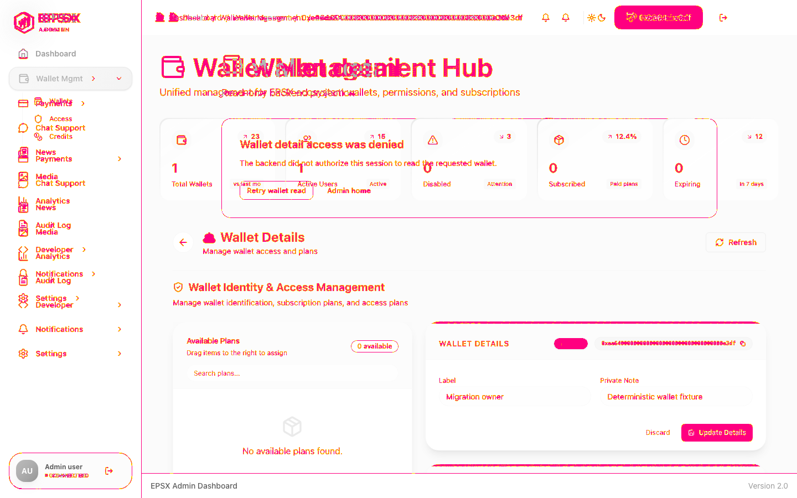](./pr3.admin.wallet-detail-forbidden--desktop-light--diff.png) | 4.0285% | The source receives its healthy baseline while the target wallet service denies the same signed administrator. The Rust BFF removes all wallet fields and renders an explicit forbidden state. | pre=PASS, post=PASS |
| `pr3.admin.wallet-detail-forbidden` | `mobile-dark` | PASS; 2 clean repeats | [](./pr3.admin.wallet-detail-forbidden--mobile-dark--source.png) | [](./pr3.admin.wallet-detail-forbidden--mobile-dark--target.png) | [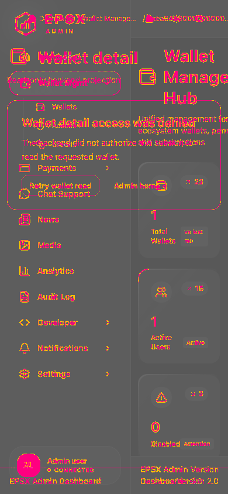](./pr3.admin.wallet-detail-forbidden--mobile-dark--diff.png) | 5.7477% | The source receives its healthy baseline while the target wallet service denies the same signed administrator. The Rust BFF removes all wallet fields and renders an explicit forbidden state. | pre=PASS, post=PASS |
| `pr3.admin.wallet-detail` | `desktop-light` | PASS; 2 clean repeats | [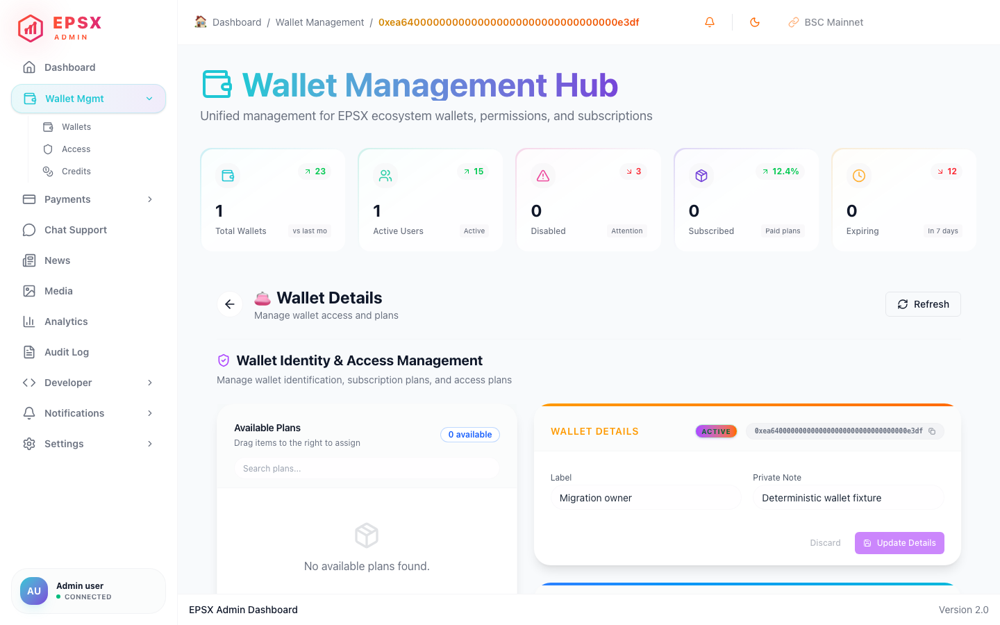](./pr3.admin.wallet-detail--desktop-light--source.png) | [](./pr3.admin.wallet-detail--desktop-light--target.png) | [](./pr3.admin.wallet-detail--desktop-light--diff.png) | 5.0812% | The target detail is a strict redacted wallet projection and omits legacy metadata, permission, group, plan, subscription, and inferred activity fields that the wallet service did not authorize for this boundary. | pre=PASS, post=PASS |
| `pr3.admin.wallet-detail` | `mobile-dark` | PASS; 2 clean repeats | [](./pr3.admin.wallet-detail--mobile-dark--source.png) | [](./pr3.admin.wallet-detail--mobile-dark--target.png) | [](./pr3.admin.wallet-detail--mobile-dark--diff.png) | 7.2497% | The target detail is a strict redacted wallet projection and omits legacy metadata, permission, group, plan, subscription, and inferred activity fields that the wallet service did not authorize for this boundary. | pre=PASS, post=PASS |
| `pr3.admin.wallet-redirect` | `desktop-light` | PASS; 2 clean repeats | [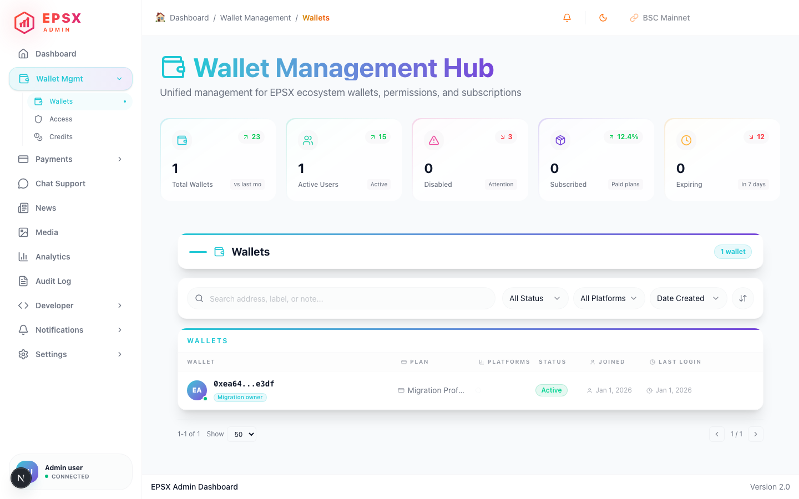](./pr3.admin.wallet-redirect--desktop-light--source.png) | [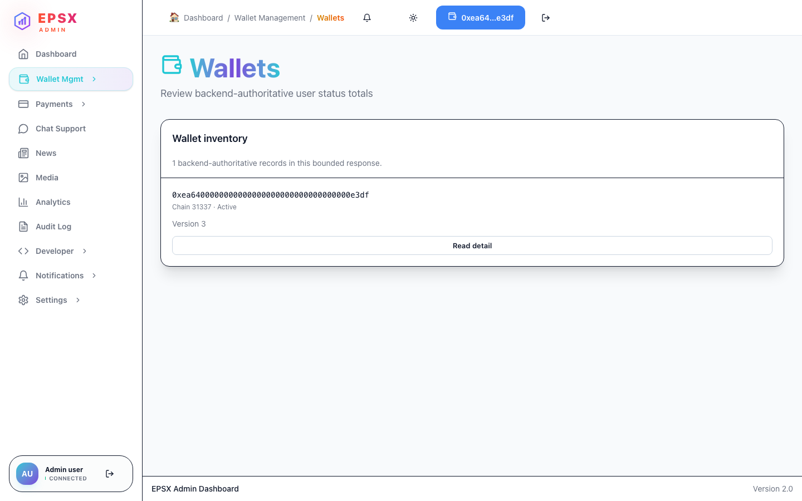](./pr3.admin.wallet-redirect--desktop-light--target.png) | [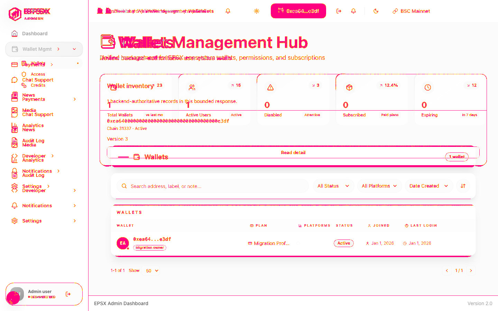](./pr3.admin.wallet-redirect--desktop-light--diff.png) | 4.5756% | The legacy wallet hub exposes unsupported mixed management claims. The target canonicalizes the entry route to the bounded backend-authoritative wallet list. | pre=PASS, post=PASS |
| `pr3.admin.wallet-redirect` | `mobile-dark` | PASS; 2 clean repeats | [](./pr3.admin.wallet-redirect--mobile-dark--source.png) | [](./pr3.admin.wallet-redirect--mobile-dark--target.png) | [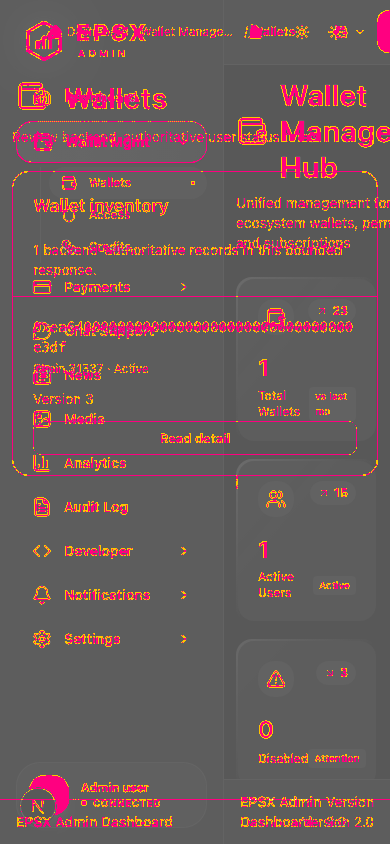](./pr3.admin.wallet-redirect--mobile-dark--diff.png) | 5.9679% | The legacy wallet hub exposes unsupported mixed management claims. The target canonicalizes the entry route to the bounded backend-authoritative wallet list. | pre=PASS, post=PASS |
| `pr3.admin.wallets-query-rejected` | `desktop-light` | PASS; 2 clean repeats | [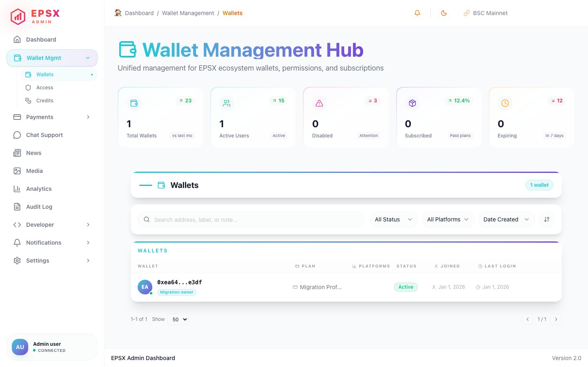](./pr3.admin.wallets-query-rejected--desktop-light--source.png) | [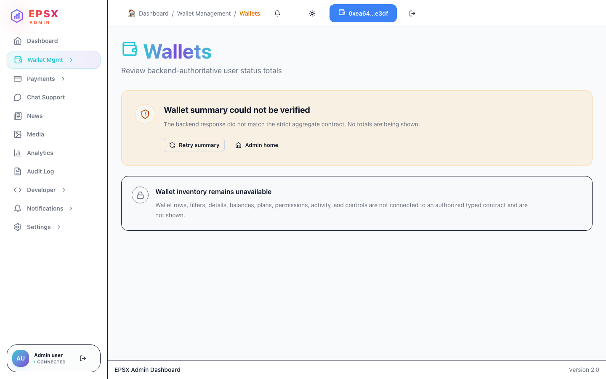](./pr3.admin.wallets-query-rejected--desktop-light--target.png) | [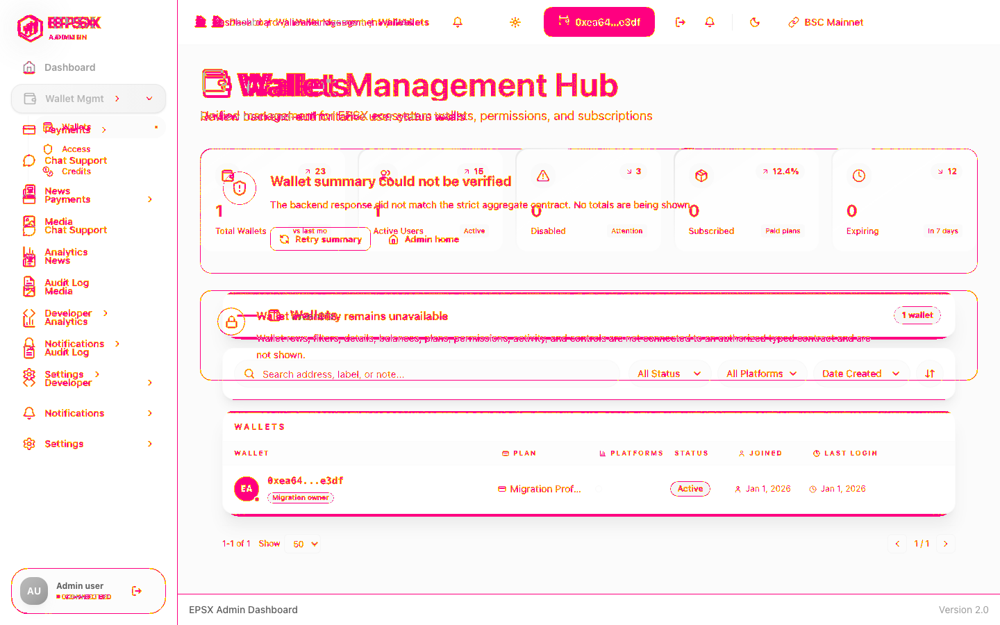](./pr3.admin.wallets-query-rejected--desktop-light--diff.png) | 4.4958% | The source applies browser-controlled search and status filters. The target rejects those unsupported query claims before upstream I/O because the wallet service exposes only a bounded authoritative list contract. | pre=PASS, post=PASS |
| `pr3.admin.wallets-query-rejected` | `mobile-dark` | PASS; 2 clean repeats | [](./pr3.admin.wallets-query-rejected--mobile-dark--source.png) | [](./pr3.admin.wallets-query-rejected--mobile-dark--target.png) | [](./pr3.admin.wallets-query-rejected--mobile-dark--diff.png) | 7.1202% | The source applies browser-controlled search and status filters. The target rejects those unsupported query claims before upstream I/O because the wallet service exposes only a bounded authoritative list contract. | pre=PASS, post=PASS |
| `pr3.admin.wallets` | `desktop-light` | PASS; 2 clean repeats | [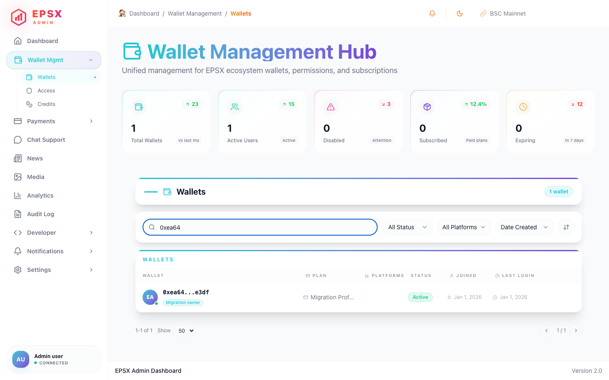](./pr3.admin.wallets--desktop-light--source.png) | [](./pr3.admin.wallets--desktop-light--target.png) | [](./pr3.admin.wallets--desktop-light--diff.png) | 4.7291% | The source presents client-side search, filter facets, activity, subscription, and platform distributions that are absent from the selected wallet service contract. The target renders only the bounded wallet rows and stored status totals verified by Rust. | pre=PASS, post=PASS |
| `pr3.admin.wallets` | `mobile-dark` | PASS; 2 clean repeats | [](./pr3.admin.wallets--mobile-dark--source.png) | [](./pr3.admin.wallets--mobile-dark--target.png) | [](./pr3.admin.wallets--mobile-dark--diff.png) | 5.4308% | The source presents client-side search, filter facets, activity, subscription, and platform distributions that are absent from the selected wallet service contract. The target renders only the bounded wallet rows and stored status totals verified by Rust. | pre=PASS, post=PASS |
| `pr3.frontend.credits` | `desktop-light` | PASS; 2 clean repeats | [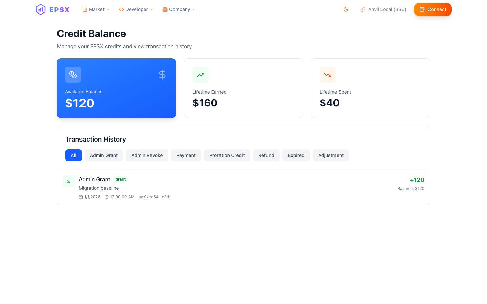](./pr3.frontend.credits--desktop-light--source.png) | [](./pr3.frontend.credits--desktop-light--target.png) | [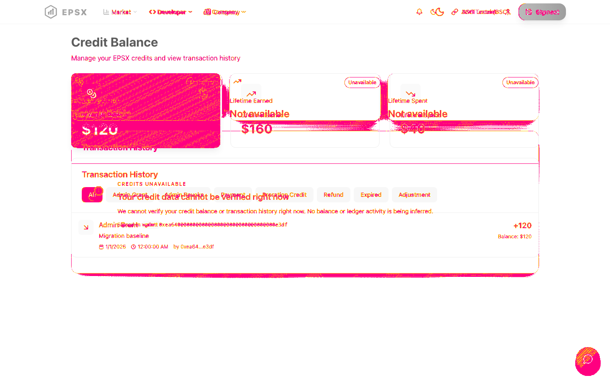](./pr3.frontend.credits--desktop-light--diff.png) | 7.4506% | The pinned source renders a legacy credits balance and transaction interpretation. The target preserves the authenticated route but explicitly reports that no owner-scoped Rust ledger contract was selected, so it cannot infer a balance, zero value, or transaction history. | pre=PASS, post=PASS |
| `pr3.frontend.credits` | `mobile-dark` | PASS; 2 clean repeats | [](./pr3.frontend.credits--mobile-dark--source.png) | [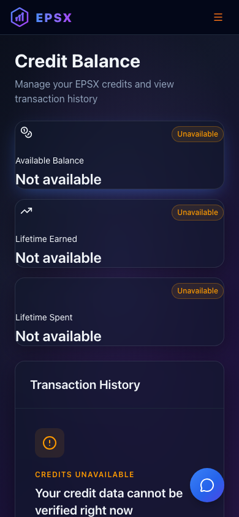](./pr3.frontend.credits--mobile-dark--target.png) | [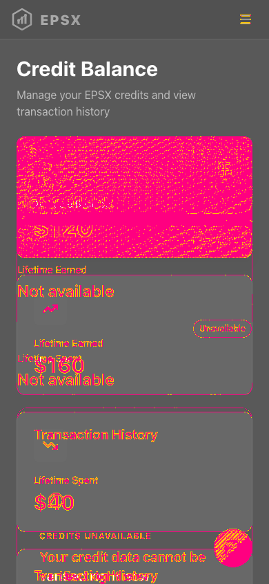](./pr3.frontend.credits--mobile-dark--diff.png) | 19.6758% | The pinned source renders a legacy credits balance and transaction interpretation. The target preserves the authenticated route but explicitly reports that no owner-scoped Rust ledger contract was selected, so it cannot infer a balance, zero value, or transaction history. | pre=PASS, post=PASS |

## Backend-authoritative contract evidence

| Suite | Group | Result | Clean repeats | Rust tests per repeat | Claims | Source anchors |
|---|---:|---|---:|---:|---|---|
| `pr2.admin-session-boundary` | 2 | PASS | 2 | 161 | SIWE exchange requires the admin audience; frontend and multiple audiences cannot establish admin authority; refresh rotation, rejection, transport failure, and logout fail closed; backend profile permissions remain verbatim; unauthenticated and under-permissioned requests stop before upstream access | `apps/admin/src/session_auth.rs`<br>`apps/admin/src/session_auth_tests.rs`<br>`apps/admin/src/auth.rs`<br>`apps/admin/src/main.rs` |
| `pr2.frontend-session-boundary` | 2 | PASS | 2 | 126 | invalid login and identity mismatch set no session; refresh rotates the verified cookie pair without replay; refresh dependency failure clears unprovable sessions; logout clears canonical and legacy cookies; profile and account data stay bound to the verified owner | `apps/frontend/src/api.rs`<br>`apps/frontend/src/auth.rs`<br>`apps/frontend/src/ssr.rs` |
| `pr2.identity-service-policy` | 2 | PASS | 2 | 8 | identity routes require exact audiences and literal permissions; spoofable owner headers are stripped; malformed credentials and hidden lifecycle routes fail closed; dependency verifier failures do not expose protected handlers | `services/identity/src/lib.rs` |
| `pr2.identity-token-contracts` | 2 | PASS | 2 | 34 | SIWE nonce entropy and replay-state classification; refresh client and family-state isolation; revoked, consumed, replayed, and invalid refresh states fail closed; single exact access-token audience; RS256 issuer, audience, algorithm, and key-id validation; persistent signing material survives service reconstruction | `shared/rust/epsx-identity-shared/src/auth_service.rs`<br>`shared/rust/epsx-identity-shared/src/token_service.rs`<br>`shared/rust/epsx-identity-shared/src/key_manager.rs`<br>`shared/rust/epsx-identity-shared/src/refresh_token_digest.rs` |
| `pr2.service-auth-boundary` | 2 | PASS | 2 | 8 | frontend and admin audiences are exact and isolated; wrong audience, issuer, expiry, algorithm, and unknown keys are rejected; permission wildcard grammar does not widen authority | `shared/rust/epsx-service-auth/src/lib.rs` |
| `pr3.admin-audit-adapter` | 3 | PASS | 2 | 7 | audit reads accept only bounded backend summaries; invalid filters and cursors fail before upstream access; duplicate, unsorted, or malformed audit records are rejected; sensitive actor and metadata fields never enter the UI projection | `apps/admin/src/audit_log_adapter.rs` |
| `pr3.admin-commerce-adapter` | 3 | PASS | 2 | 4 | wallet, credit, access, and plan DTOs reject unknown or malformed fields; wallet and plan identifiers are canonical before upstream I/O; optimistic conflicts and forbidden mutations remain distinct; mutation success requires evidence-bearing backend responses | `apps/admin/src/commerce_adapter.rs` |
| `pr3.subscription-service-policy` | 3 | PASS | 2 | 10 | plan and access reads require their literal read permissions; plan and access mutations require their literal manage permissions; audience and owner isolation are enforced by the Rust service; spoofed headers and hidden paths cannot widen authority | `services/subscription/src/lib.rs` |
| `pr3.wallet-service-policy` | 3 | PASS | 2 | 12 | wallet and credit reads require exact read permissions; wallet and credit mutations require exact manage permissions; frontend owners cannot cross wallet boundaries; admin and frontend audiences remain isolated; spoofed owner headers and unsafe paths fail closed | `services/wallet/src/lib.rs` |

Each repeat has a checksummed Cargo log plus guarded pre/post PostgreSQL, Redis, Anvil, and fixture reset proofs in the full artifact. Test counts and ignored-test counts must be stable, every command must pass, and ignored tests are forbidden.

## Contact sheets

Each sheet is ordered **Next.js source → Rust/Dioxus target → highlighted pixel diff**.

### pr0.public.about — desktop-light


### pr0.public.about — mobile-dark


### pr0.public.contact — desktop-light


### pr0.public.contact — mobile-dark


### pr0.public.home — desktop-light


### pr0.public.home — mobile-dark


### pr1.about.authenticated — desktop-light

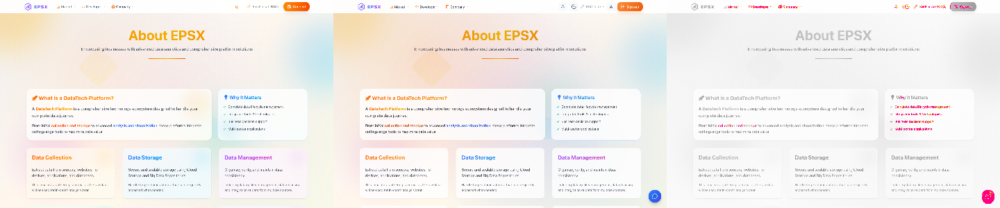

### pr1.about.authenticated — mobile-dark


### pr1.admin.denial-query — desktop-light


### pr1.admin.denial-query — mobile-dark


### pr1.admin.unauthorized — desktop-light


### pr1.admin.unauthorized — mobile-dark


### pr1.auth.about-redirect — desktop-light


### pr1.auth.about-redirect — mobile-dark


### pr1.auth.contact-redirect — desktop-light


### pr1.auth.contact-redirect — mobile-dark


### pr1.contact.authenticated — desktop-light


### pr1.contact.authenticated — mobile-dark


### pr1.error.access-denied — desktop-light

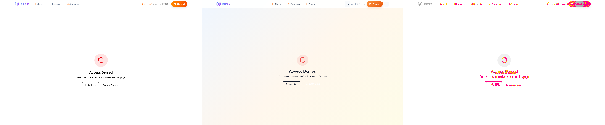

### pr1.error.access-denied — mobile-dark


### pr1.error.not-found — desktop-light


### pr1.error.not-found — mobile-dark


### pr1.offline.public — desktop-light


### pr1.offline.public — mobile-dark

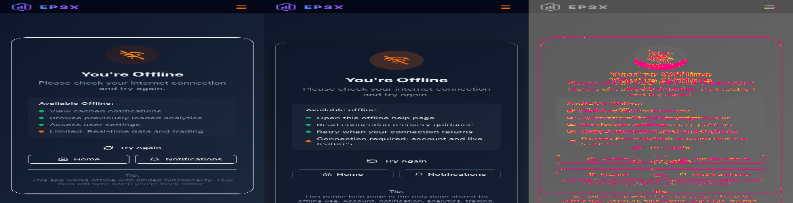

### pr1.privacy.legal — desktop-light


### pr1.privacy.legal — mobile-dark


### pr1.shell.home — desktop-light


### pr1.shell.home — mobile-dark


### pr1.terms.legal — desktop-light


### pr1.terms.legal — mobile-dark


### pr2.account.verified — desktop-light


### pr2.account.verified — mobile-dark


### pr2.admin.settings — desktop-light


### pr2.admin.settings — mobile-dark


### pr2.admin.wrong-audience — desktop-light


### pr2.admin.wrong-audience — mobile-dark


### pr2.auth.dependency-failure — desktop-light

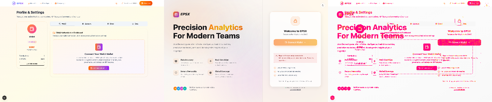

### pr2.auth.dependency-failure — mobile-dark


### pr2.auth.logout — desktop-light


### pr2.auth.logout — mobile-dark


### pr2.auth.signed-out — desktop-light


### pr2.auth.signed-out — mobile-dark


### pr2.frontend.wrong-audience — desktop-light

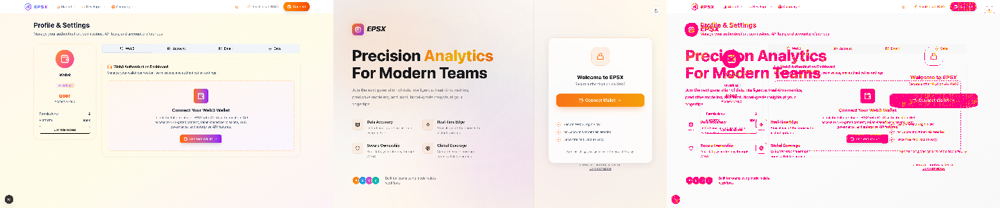

### pr2.frontend.wrong-audience — mobile-dark


### pr2.permissions.empty-claims — desktop-light


### pr2.permissions.empty-claims — mobile-dark

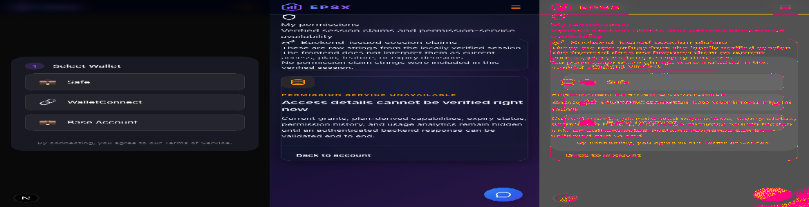

### pr2.permissions.verified — desktop-light


### pr2.permissions.verified — mobile-dark

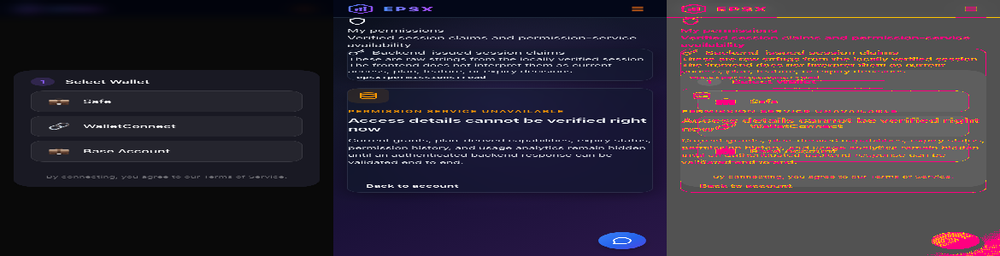

### pr2.profile.verified — desktop-light

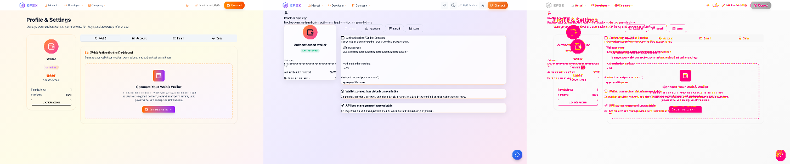

### pr2.profile.verified — mobile-dark


### pr3.admin.access-forbidden — desktop-light


### pr3.admin.access-forbidden — mobile-dark

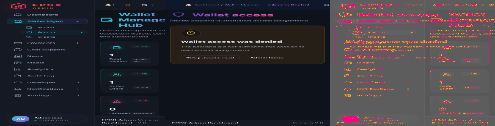

### pr3.admin.access — desktop-light

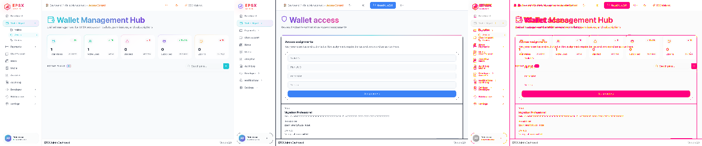

### pr3.admin.access — mobile-dark


### pr3.admin.audit — desktop-light


### pr3.admin.audit — mobile-dark

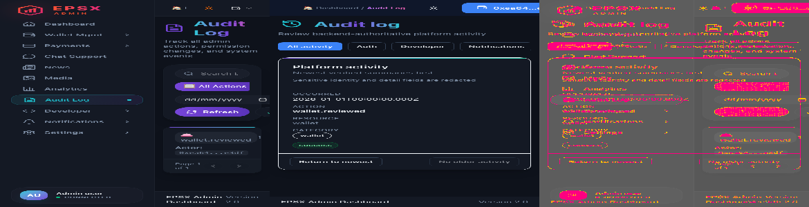

### pr3.admin.credits-validation — desktop-light

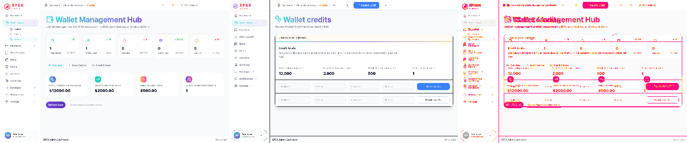

### pr3.admin.credits-validation — mobile-dark


### pr3.admin.credits — desktop-light


### pr3.admin.credits — mobile-dark


### pr3.admin.disable-audit — desktop-light


### pr3.admin.disable-audit — mobile-dark


### pr3.admin.disable — desktop-light


### pr3.admin.disable — mobile-dark

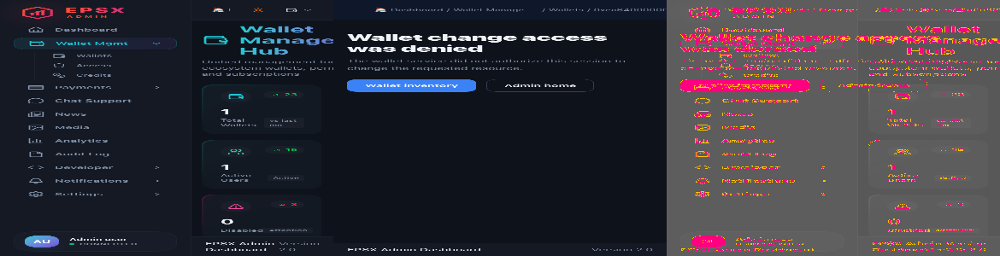

### pr3.admin.plan-conflict — desktop-light

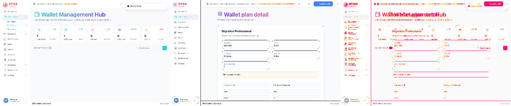

### pr3.admin.plan-conflict — mobile-dark

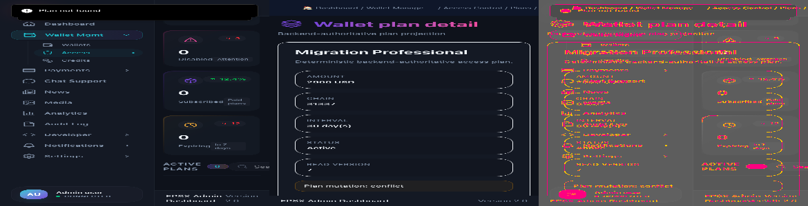

### pr3.admin.plan-detail — desktop-light


### pr3.admin.plan-detail — mobile-dark


### pr3.admin.plans — desktop-light


### pr3.admin.plans — mobile-dark


### pr3.admin.wallet-detail-forbidden — desktop-light


### pr3.admin.wallet-detail-forbidden — mobile-dark

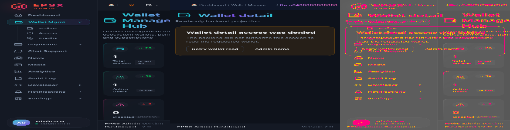

### pr3.admin.wallet-detail — desktop-light


### pr3.admin.wallet-detail — mobile-dark


### pr3.admin.wallet-redirect — desktop-light

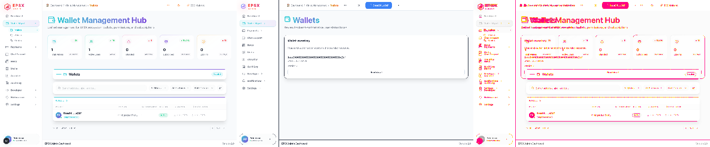

### pr3.admin.wallet-redirect — mobile-dark

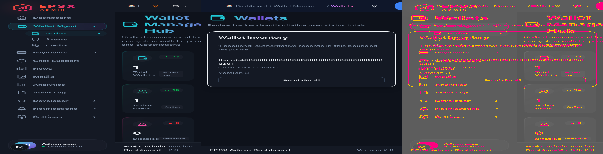

### pr3.admin.wallets-query-rejected — desktop-light


### pr3.admin.wallets-query-rejected — mobile-dark


### pr3.admin.wallets — desktop-light


### pr3.admin.wallets — mobile-dark

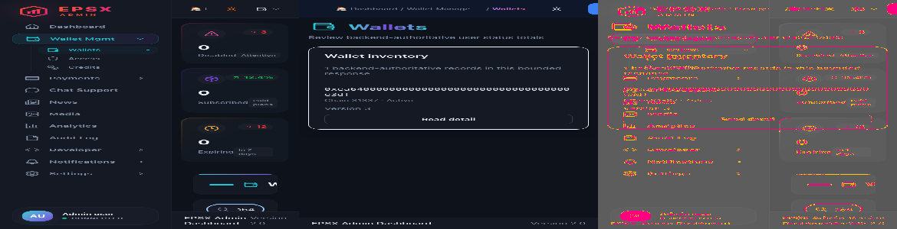

### pr3.frontend.credits — desktop-light

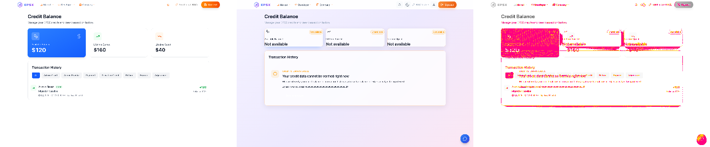

### pr3.frontend.credits — mobile-dark


## Runtime rollback gate

Every repeat restored a guarded `epsx_e2e_*` PostgreSQL database from its template, deleted only the `epsx:e2e:*` Redis namespace, reverted Anvil chain 31337 to its recorded snapshot, reset fixture requests/mutations, and cleared its isolated browser context. PostgreSQL checksums and row counts, transient queue/outbox emptiness, Redis hashes, Anvil account/block state, and fixture counters matched the baseline after reset.

Final process-stopped rollback: **PASS**. The source and target applications were stopped before the final reset and smoke, preventing background polling from repopulating fixture or durable state. The full artifact manifest includes `reset-final.json` with every baseline comparison.

## Full artifacts

The CI artifact contains full-resolution PNGs, video, traces, HAR/network data, DOM, accessibility snapshots, browser/server logs, Playwright HTML, and reset proofs. [`artifact-manifest.json`](./artifact-manifest.json) records the SHA-256 and byte length of every file in that artifact.

## Reproduce

```bash
bun install --frozen-lockfile
bunx playwright install chromium
bun e2e/migration/cli.ts run --group 3
bun e2e/migration/cli.ts verify-artifacts --group 3
```
