# PR 5 — cumulative migration E2E evidence

Result: **PASS**

Source Next.js SHA: `373bd231cb7a616c3d4c0ddc1d60e0099a88a5db`

Target Rust/Dioxus SHA: `86d6e506c0991b07f48cd669da014a09eaf45ee6`

Generated: 2026-07-30T19:38:16.283Z

This report covers every executable scenario owned by cumulative groups 0–5. Visual differences above 1% require a machine-readable non-styling exception.

## Scenario evidence

| Scenario | Matrix | Result / coverage | Next.js | Rust/Dioxus | Highlighted diff | Δ pixels | Difference disposition | Reset proof |
|---|---|---|---|---|---|---:|---|---|
| `pr0.public.about` | `desktop-light` | PASS; 2 clean repeats | [](./pr0.public.about--desktop-light--source.png) | [](./pr0.public.about--desktop-light--target.png) | [](./pr0.public.about--desktop-light--diff.png) | 8.3697% | PR 0 establishes the immutable baseline and reproducible evidence path; source/target parity disposition is owned by PR 1. | pre=PASS, post=PASS |
| `pr0.public.about` | `mobile-dark` | PASS; 2 clean repeats | [](./pr0.public.about--mobile-dark--source.png) | [](./pr0.public.about--mobile-dark--target.png) | [](./pr0.public.about--mobile-dark--diff.png) | 15.6568% | PR 0 establishes the immutable baseline and reproducible evidence path; source/target parity disposition is owned by PR 1. | pre=PASS, post=PASS |
| `pr0.public.contact` | `desktop-light` | PASS; 2 clean repeats | [](./pr0.public.contact--desktop-light--source.png) | [](./pr0.public.contact--desktop-light--target.png) | [](./pr0.public.contact--desktop-light--diff.png) | 8.3697% | PR 0 establishes the immutable baseline and reproducible evidence path; source/target parity disposition is owned by PR 1. | pre=PASS, post=PASS |
| `pr0.public.contact` | `mobile-dark` | PASS; 2 clean repeats | [](./pr0.public.contact--mobile-dark--source.png) | [](./pr0.public.contact--mobile-dark--target.png) | [](./pr0.public.contact--mobile-dark--diff.png) | 15.6568% | PR 0 establishes the immutable baseline and reproducible evidence path; source/target parity disposition is owned by PR 1. | pre=PASS, post=PASS |
| `pr0.public.home` | `desktop-light` | PASS; 2 clean repeats | [](./pr0.public.home--desktop-light--source.png) | [](./pr0.public.home--desktop-light--target.png) | [](./pr0.public.home--desktop-light--diff.png) | 8.8315% | PR 0 establishes the immutable baseline and reproducible evidence path; source/target parity disposition is owned by PR 1. | pre=PASS, post=PASS |
| `pr0.public.home` | `mobile-dark` | PASS; 2 clean repeats | [](./pr0.public.home--mobile-dark--source.png) | [](./pr0.public.home--mobile-dark--target.png) | [](./pr0.public.home--mobile-dark--diff.png) | 20.288% | PR 0 establishes the immutable baseline and reproducible evidence path; source/target parity disposition is owned by PR 1. | pre=PASS, post=PASS |
| `pr1.about.authenticated` | `desktop-light` | PASS; 2 clean repeats | [](./pr1.about.authenticated--desktop-light--source.png) | [](./pr1.about.authenticated--desktop-light--target.png) | [](./pr1.about.authenticated--desktop-light--diff.png) | 0.6133% | Within the 1% campaign visual threshold. | pre=PASS, post=PASS |
| `pr1.about.authenticated` | `mobile-dark` | PASS; 2 clean repeats | [](./pr1.about.authenticated--mobile-dark--source.png) | [](./pr1.about.authenticated--mobile-dark--target.png) | [](./pr1.about.authenticated--mobile-dark--diff.png) | 1.1177% | The target validates the fixture's signed frontend session with the Rust BFF and renders the authenticated, owner-scoped chat control. The pinned source middleware admits the cookie for this public body but its client shell has no verified identity and therefore omits that control. With the authenticated control region excluded, the screenshot delta is below 1%. | pre=PASS, post=PASS |
| `pr1.admin.denial-query` | `desktop-light` | PASS; 2 clean repeats | [](./pr1.admin.denial-query--desktop-light--source.png) | [](./pr1.admin.denial-query--desktop-light--target.png) | [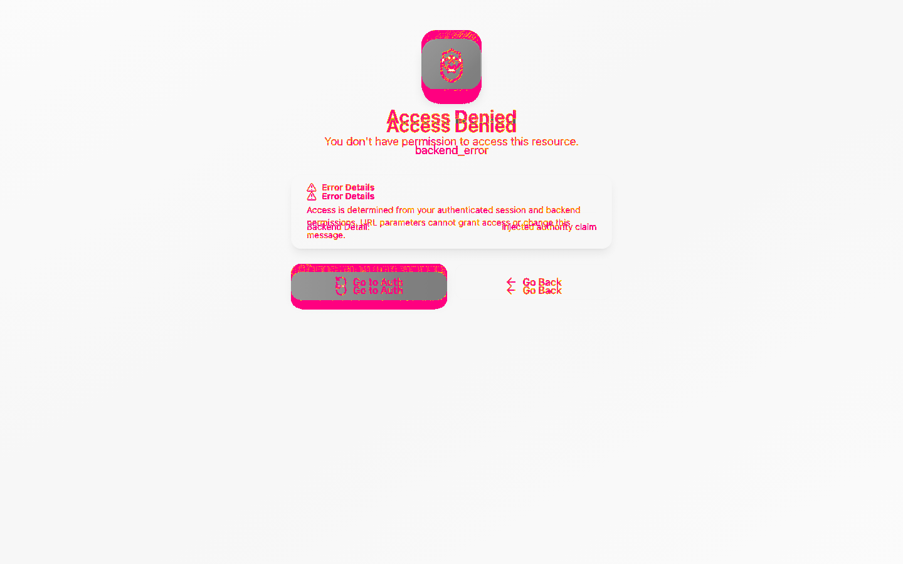](./pr1.admin.denial-query--desktop-light--diff.png) | 1.5624% | The pinned source presents browser-controlled reason and detail parameters as authoritative denial evidence. The target ignores those claims and explains that only the authenticated session and backend permissions determine access. | pre=PASS, post=PASS |
| `pr1.admin.denial-query` | `mobile-dark` | PASS; 2 clean repeats | [](./pr1.admin.denial-query--mobile-dark--source.png) | [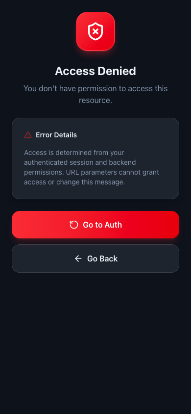](./pr1.admin.denial-query--mobile-dark--target.png) | [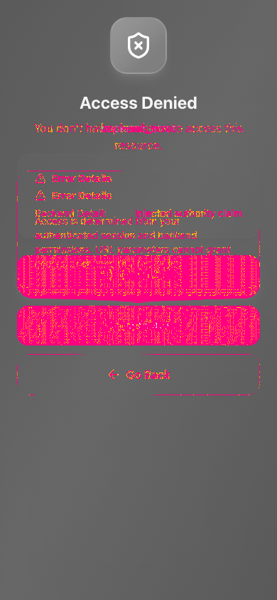](./pr1.admin.denial-query--mobile-dark--diff.png) | 12.771% | The pinned source presents browser-controlled reason and detail parameters as authoritative denial evidence. The target ignores those claims and explains that only the authenticated session and backend permissions determine access. | pre=PASS, post=PASS |
| `pr1.admin.unauthorized` | `desktop-light` | PASS; 2 clean repeats | [](./pr1.admin.unauthorized--desktop-light--source.png) | [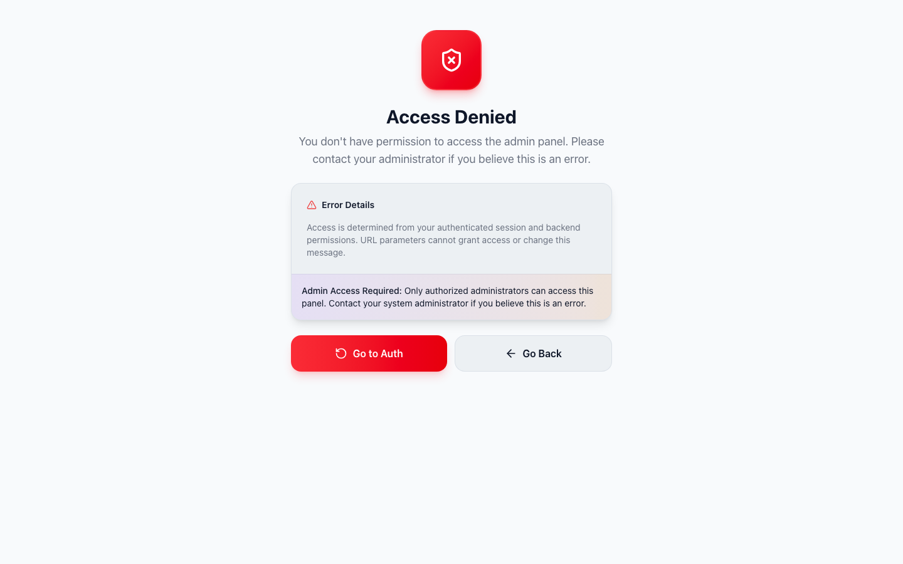](./pr1.admin.unauthorized--desktop-light--target.png) | [](./pr1.admin.unauthorized--desktop-light--diff.png) | 3.5723% | The target removes browser-controlled denial context and adds static administrator guidance without claiming an unverified route, permission, or backend error. Access remains determined by the Rust backend. | pre=PASS, post=PASS |
| `pr1.admin.unauthorized` | `mobile-dark` | PASS; 2 clean repeats | [](./pr1.admin.unauthorized--mobile-dark--source.png) | [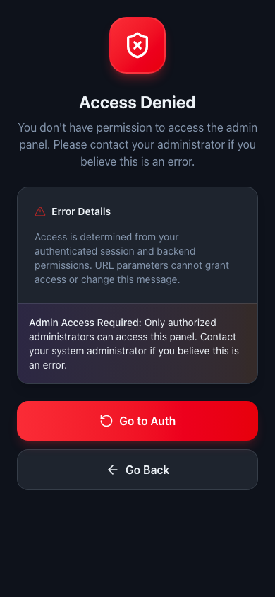](./pr1.admin.unauthorized--mobile-dark--target.png) | [](./pr1.admin.unauthorized--mobile-dark--diff.png) | 12.5586% | The target removes browser-controlled denial context and adds static administrator guidance without claiming an unverified route, permission, or backend error. Access remains determined by the Rust backend. | pre=PASS, post=PASS |
| `pr1.auth.about-redirect` | `desktop-light` | PASS; 2 clean repeats | [](./pr1.auth.about-redirect--desktop-light--source.png) | [](./pr1.auth.about-redirect--desktop-light--target.png) | [](./pr1.auth.about-redirect--desktop-light--diff.png) | 8.3697% | The pinned source auth surface asserts that the network is secure and operational without a backend health proof and advertises an unverified customer count. The target keeps the wallet CTA and feature geometry while replacing those claims with a static wallet-sign-in description and truthful product copy. | pre=PASS, post=PASS |
| `pr1.auth.about-redirect` | `mobile-dark` | PASS; 2 clean repeats | [](./pr1.auth.about-redirect--mobile-dark--source.png) | [](./pr1.auth.about-redirect--mobile-dark--target.png) | [](./pr1.auth.about-redirect--mobile-dark--diff.png) | 15.6568% | The pinned source auth surface asserts that the network is secure and operational without a backend health proof and advertises an unverified customer count. The target keeps the wallet CTA and feature geometry while replacing those claims with a static wallet-sign-in description and truthful product copy. | pre=PASS, post=PASS |
| `pr1.auth.contact-redirect` | `desktop-light` | PASS; 2 clean repeats | [](./pr1.auth.contact-redirect--desktop-light--source.png) | [](./pr1.auth.contact-redirect--desktop-light--target.png) | [](./pr1.auth.contact-redirect--desktop-light--diff.png) | 8.3697% | The pinned source auth surface asserts that the network is secure and operational without a backend health proof and advertises an unverified customer count. The target keeps the wallet CTA and feature geometry while replacing those claims with a static wallet-sign-in description and truthful product copy. | pre=PASS, post=PASS |
| `pr1.auth.contact-redirect` | `mobile-dark` | PASS; 2 clean repeats | [](./pr1.auth.contact-redirect--mobile-dark--source.png) | [](./pr1.auth.contact-redirect--mobile-dark--target.png) | [](./pr1.auth.contact-redirect--mobile-dark--diff.png) | 15.6568% | The pinned source auth surface asserts that the network is secure and operational without a backend health proof and advertises an unverified customer count. The target keeps the wallet CTA and feature geometry while replacing those claims with a static wallet-sign-in description and truthful product copy. | pre=PASS, post=PASS |
| `pr1.contact.authenticated` | `desktop-light` | PASS; 2 clean repeats | [](./pr1.contact.authenticated--desktop-light--source.png) | [](./pr1.contact.authenticated--desktop-light--target.png) | [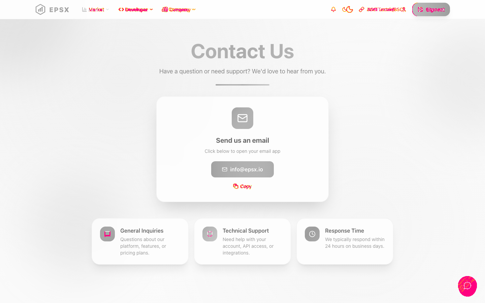](./pr1.contact.authenticated--desktop-light--diff.png) | 0.376% | Within the 1% campaign visual threshold. | pre=PASS, post=PASS |
| `pr1.contact.authenticated` | `mobile-dark` | PASS; 2 clean repeats | [](./pr1.contact.authenticated--mobile-dark--source.png) | [](./pr1.contact.authenticated--mobile-dark--target.png) | [](./pr1.contact.authenticated--mobile-dark--diff.png) | 1.5825% | The target validates the fixture's signed frontend session with the Rust BFF and renders the authenticated, owner-scoped chat control. The pinned source middleware admits the cookie for this public body but its client shell has no verified identity and therefore omits that control. With the authenticated control region excluded, the screenshot delta is below 1%. | pre=PASS, post=PASS |
| `pr1.error.access-denied` | `desktop-light` | PASS; 2 clean repeats | [](./pr1.error.access-denied--desktop-light--source.png) | [](./pr1.error.access-denied--desktop-light--target.png) | [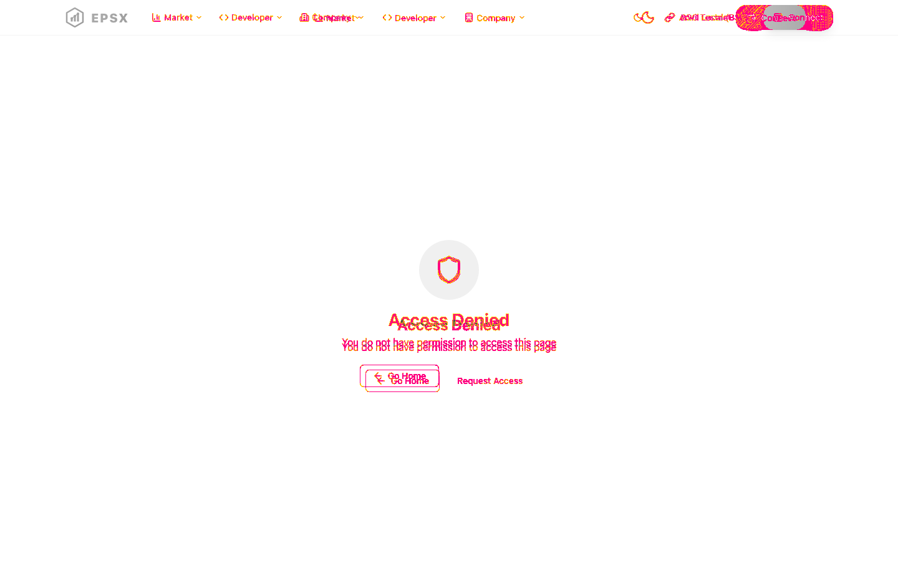](./pr1.error.access-denied--desktop-light--diff.png) | 0.8513% | Within the 1% campaign visual threshold. | pre=PASS, post=PASS |
| `pr1.error.access-denied` | `mobile-dark` | PASS; 2 clean repeats | [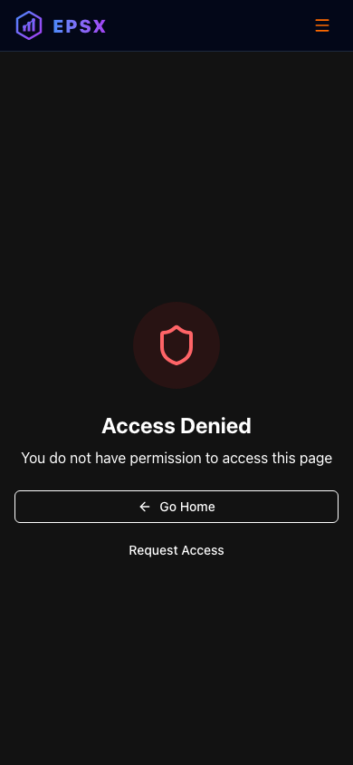](./pr1.error.access-denied--mobile-dark--source.png) | [](./pr1.error.access-denied--mobile-dark--target.png) | [](./pr1.error.access-denied--mobile-dark--diff.png) | 0.0933% | Within the 1% campaign visual threshold. | pre=PASS, post=PASS |
| `pr1.error.not-found` | `desktop-light` | PASS; 2 clean repeats | [](./pr1.error.not-found--desktop-light--source.png) | [](./pr1.error.not-found--desktop-light--target.png) | [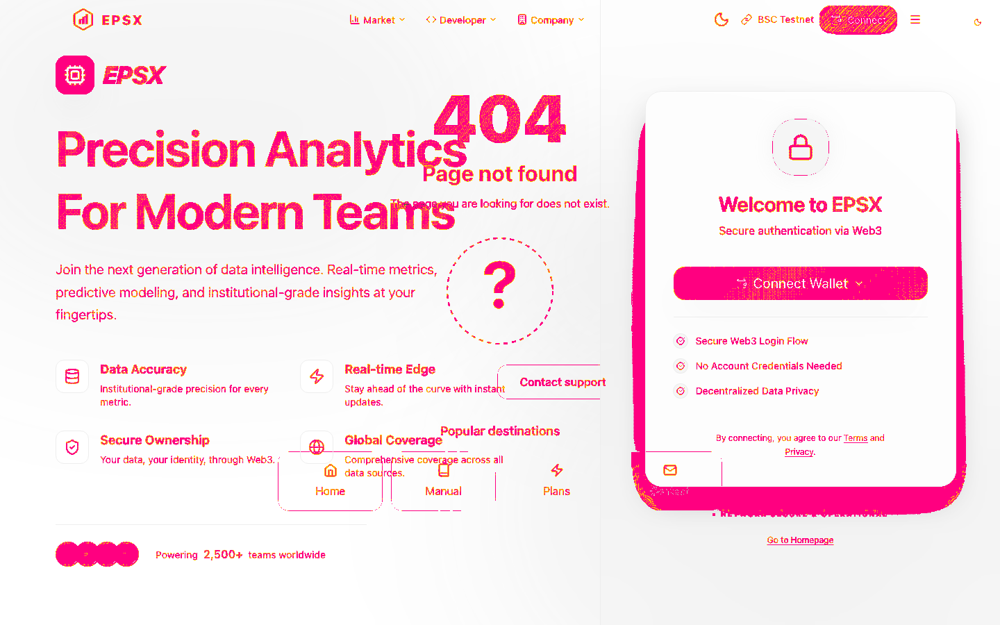](./pr1.error.not-found--desktop-light--diff.png) | 8.7822% | The pinned source masks an unknown signed-out route by redirecting to authentication. The target preserves the HTTP 404 boundary and renders safe recovery links, so route existence and error semantics are not confused with an authorization decision. | pre=PASS, post=PASS |
| `pr1.error.not-found` | `mobile-dark` | PASS; 2 clean repeats | [](./pr1.error.not-found--mobile-dark--source.png) | [](./pr1.error.not-found--mobile-dark--target.png) | [](./pr1.error.not-found--mobile-dark--diff.png) | 12.4338% | The pinned source masks an unknown signed-out route by redirecting to authentication. The target preserves the HTTP 404 boundary and renders safe recovery links, so route existence and error semantics are not confused with an authorization decision. | pre=PASS, post=PASS |
| `pr1.offline.public` | `desktop-light` | PASS; 2 clean repeats | [](./pr1.offline.public--desktop-light--source.png) | [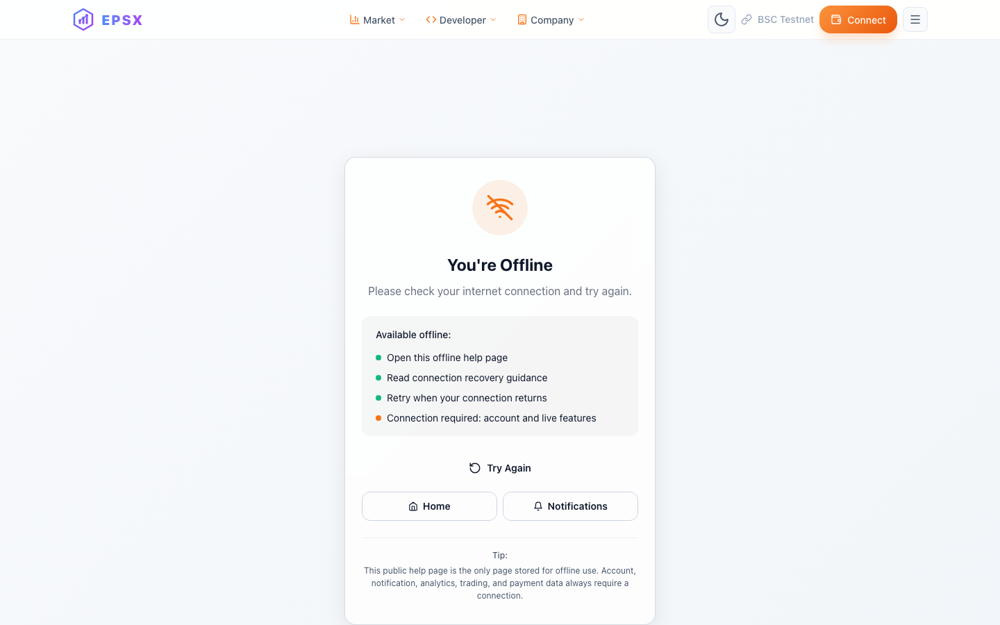](./pr1.offline.public--desktop-light--target.png) | [](./pr1.offline.public--desktop-light--diff.png) | 2.0041% | The pinned source offline page claims cached dashboard and analytics capabilities that have no verified service-worker cache contract. The target limits its availability list to the static shell and recovery actions that actually work offline. | pre=PASS, post=PASS |
| `pr1.offline.public` | `mobile-dark` | PASS; 2 clean repeats | [](./pr1.offline.public--mobile-dark--source.png) | [](./pr1.offline.public--mobile-dark--target.png) | [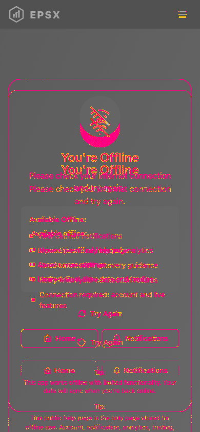](./pr1.offline.public--mobile-dark--diff.png) | 6.1298% | The pinned source offline page claims cached dashboard and analytics capabilities that have no verified service-worker cache contract. The target limits its availability list to the static shell and recovery actions that actually work offline. | pre=PASS, post=PASS |
| `pr1.privacy.legal` | `desktop-light` | PASS; 2 clean repeats | [](./pr1.privacy.legal--desktop-light--source.png) | [](./pr1.privacy.legal--desktop-light--target.png) | [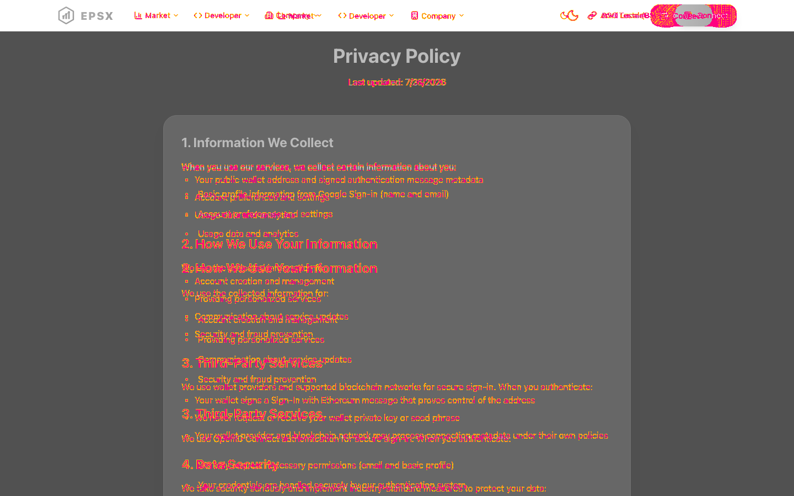](./pr1.privacy.legal--desktop-light--diff.png) | 2.4258% | The pinned source privacy policy describes Google/OIDC and OAuth data flows that this wallet-only application does not use. The target accurately documents wallet addresses, EIP-4361 signatures, nonce/session handling, and provides a real contact link. | pre=PASS, post=PASS |
| `pr1.privacy.legal` | `mobile-dark` | PASS; 2 clean repeats | [](./pr1.privacy.legal--mobile-dark--source.png) | [](./pr1.privacy.legal--mobile-dark--target.png) | [](./pr1.privacy.legal--mobile-dark--diff.png) | 4.228% | The pinned source privacy policy describes Google/OIDC and OAuth data flows that this wallet-only application does not use. The target accurately documents wallet addresses, EIP-4361 signatures, nonce/session handling, and provides a real contact link. | pre=PASS, post=PASS |
| `pr1.shell.home` | `desktop-light` | PASS; 2 clean repeats | [](./pr1.shell.home--desktop-light--source.png) | [](./pr1.shell.home--desktop-light--target.png) | [](./pr1.shell.home--desktop-light--diff.png) | 8.8315% | The pinned source hero advertises real-time analytics and interactive sharing before their verified public data contracts are available. The target replaces those claims with truthful navigation to dedicated routes; the shell structure and controls remain functional. | pre=PASS, post=PASS |
| `pr1.shell.home` | `mobile-dark` | PASS; 2 clean repeats | [](./pr1.shell.home--mobile-dark--source.png) | [](./pr1.shell.home--mobile-dark--target.png) | [](./pr1.shell.home--mobile-dark--diff.png) | 20.288% | The pinned source hero advertises real-time analytics and interactive sharing before their verified public data contracts are available. The target replaces those claims with truthful navigation to dedicated routes; the shell structure and controls remain functional. | pre=PASS, post=PASS |
| `pr1.terms.legal` | `desktop-light` | PASS; 2 clean repeats | [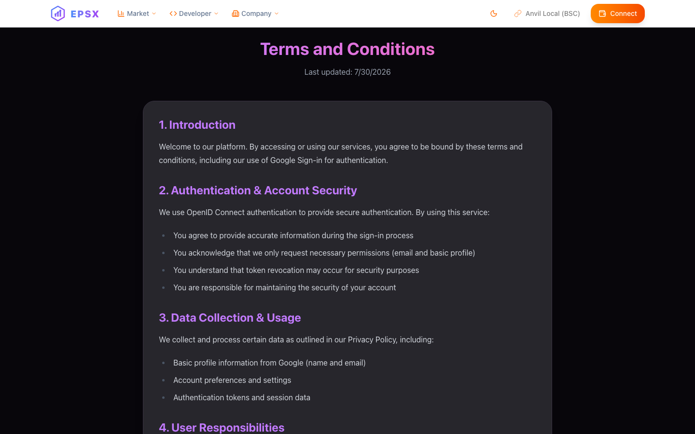](./pr1.terms.legal--desktop-light--source.png) | [](./pr1.terms.legal--desktop-light--target.png) | [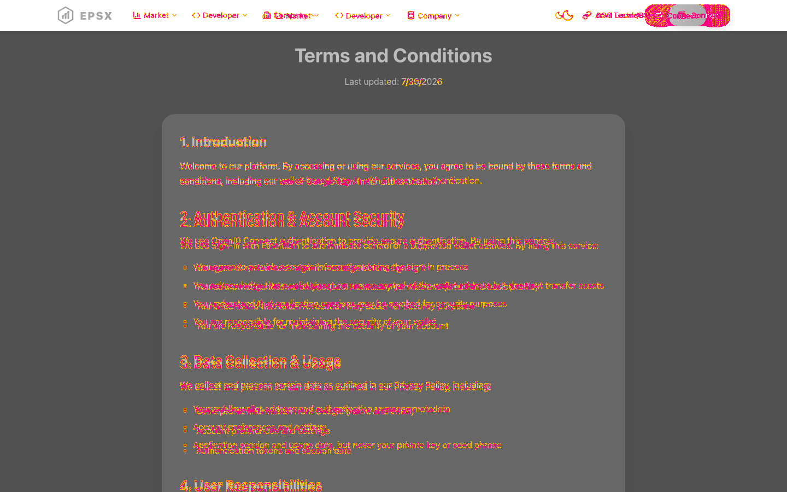](./pr1.terms.legal--desktop-light--diff.png) | 2.6083% | The pinned source terms describe OAuth and Google sign-in and render non-functional subscription controls. The target states the wallet/SIWE authentication contract, links to contact, and removes the unsupported pseudo-form. | pre=PASS, post=PASS |
| `pr1.terms.legal` | `mobile-dark` | PASS; 2 clean repeats | [](./pr1.terms.legal--mobile-dark--source.png) | [](./pr1.terms.legal--mobile-dark--target.png) | [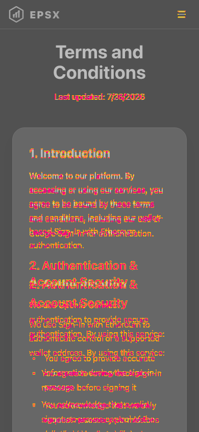](./pr1.terms.legal--mobile-dark--diff.png) | 4.2548% | The pinned source terms describe OAuth and Google sign-in and render non-functional subscription controls. The target states the wallet/SIWE authentication contract, links to contact, and removes the unsupported pseudo-form. | pre=PASS, post=PASS |
| `pr2.account.verified` | `desktop-light` | PASS; 2 clean repeats | [](./pr2.account.verified--desktop-light--source.png) | [](./pr2.account.verified--desktop-light--target.png) | [](./pr2.account.verified--desktop-light--diff.png) | 13.9544% | The pinned source mixes a server session with client wallet state and renders fixture-derived membership, credit, plan, feature, payment, and preference claims. The target renders the verified wallet and SIWE method but marks every unselected owner-scoped backend projection unavailable instead of inventing authority. | pre=PASS, post=PASS |
| `pr2.account.verified` | `mobile-dark` | PASS; 2 clean repeats | [](./pr2.account.verified--mobile-dark--source.png) | [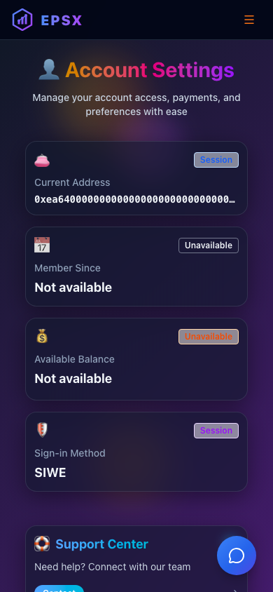](./pr2.account.verified--mobile-dark--target.png) | [](./pr2.account.verified--mobile-dark--diff.png) | 15.1571% | The pinned source mixes a server session with client wallet state and renders fixture-derived membership, credit, plan, feature, payment, and preference claims. The target renders the verified wallet and SIWE method but marks every unselected owner-scoped backend projection unavailable instead of inventing authority. | pre=PASS, post=PASS |
| `pr2.admin.settings` | `desktop-light` | PASS; 2 clean repeats | [](./pr2.admin.settings--desktop-light--source.png) | [](./pr2.admin.settings--desktop-light--target.png) | [](./pr2.admin.settings--desktop-light--diff.png) | 5.7444% | The pinned source renders fixture-owned administrator contact and maintenance values as settings. The target keeps the authenticated settings route but explicitly declines to project those claims when the Rust adapter cannot verify its strict backend contract. | pre=PASS, post=PASS |
| `pr2.admin.settings` | `mobile-dark` | PASS; 2 clean repeats | [](./pr2.admin.settings--mobile-dark--source.png) | [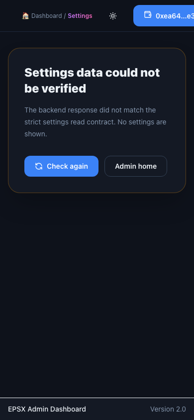](./pr2.admin.settings--mobile-dark--target.png) | [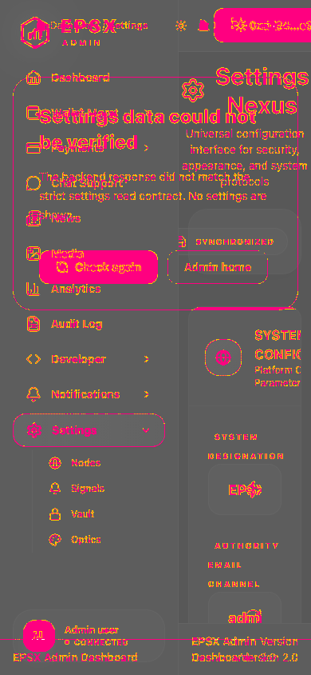](./pr2.admin.settings--mobile-dark--diff.png) | 8.741% | The pinned source renders fixture-owned administrator contact and maintenance values as settings. The target keeps the authenticated settings route but explicitly declines to project those claims when the Rust adapter cannot verify its strict backend contract. | pre=PASS, post=PASS |
| `pr2.admin.wrong-audience` | `desktop-light` | PASS; 2 clean repeats | [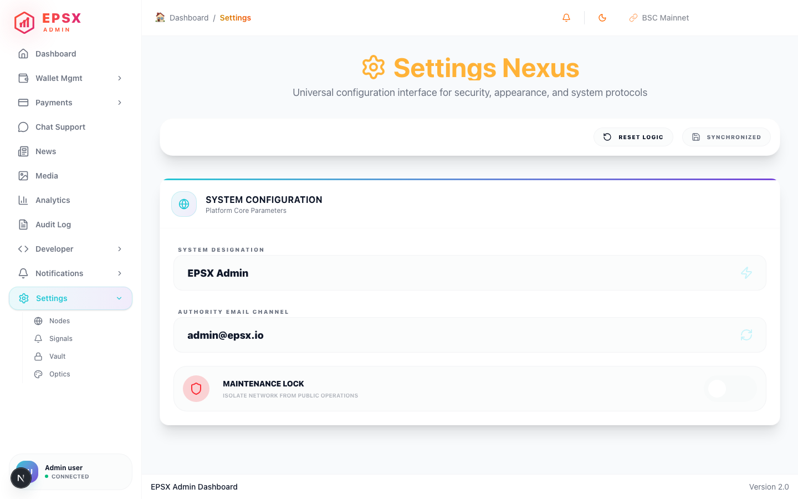](./pr2.admin.wrong-audience--desktop-light--source.png) | [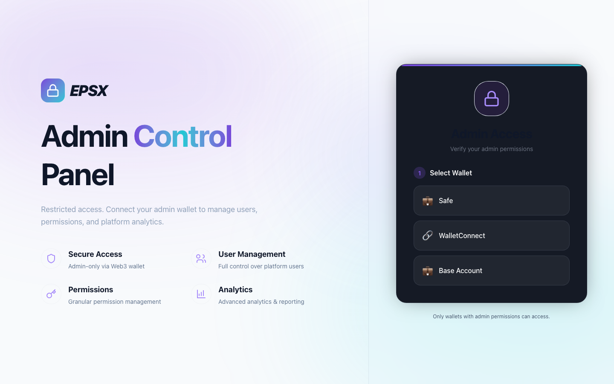](./pr2.admin.wrong-audience--desktop-light--target.png) | [](./pr2.admin.wrong-audience--desktop-light--diff.png) | 25.2198% | The source receives its valid admin baseline session, while the target receives an equally signed frontend-audience token and must replace all administrator settings with the public Admin Access gate. | pre=PASS, post=PASS |
| `pr2.admin.wrong-audience` | `mobile-dark` | PASS; 2 clean repeats | [](./pr2.admin.wrong-audience--mobile-dark--source.png) | [](./pr2.admin.wrong-audience--mobile-dark--target.png) | [](./pr2.admin.wrong-audience--mobile-dark--diff.png) | 6.7013% | The source receives its valid admin baseline session, while the target receives an equally signed frontend-audience token and must replace all administrator settings with the public Admin Access gate. | pre=PASS, post=PASS |
| `pr2.auth.dependency-failure` | `desktop-light` | PASS; 2 clean repeats | [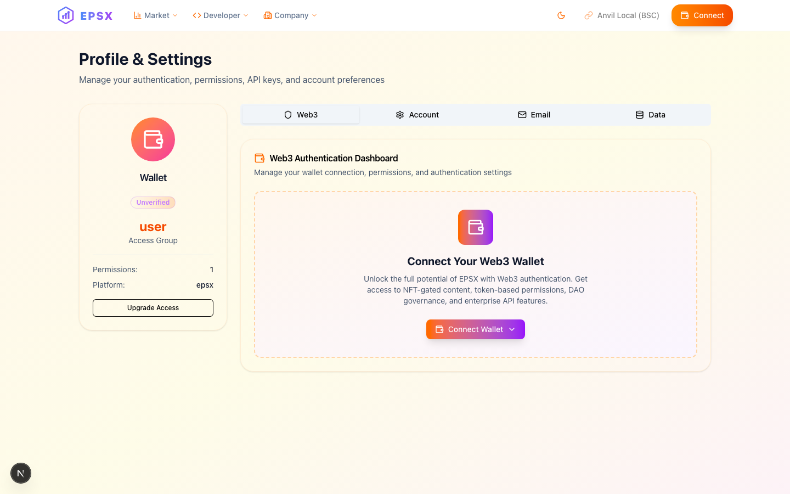](./pr2.auth.dependency-failure--desktop-light--source.png) | [](./pr2.auth.dependency-failure--desktop-light--target.png) | [](./pr2.auth.dependency-failure--desktop-light--diff.png) | 8.5552% | The source receives its normal valid-session baseline. The target's token uses an uncached key identifier while identity verification is unavailable, so the Rust verifier clears unprovable authority and renders the explicit unavailable sign-in gate. | pre=PASS, post=PASS |
| `pr2.auth.dependency-failure` | `mobile-dark` | PASS; 2 clean repeats | [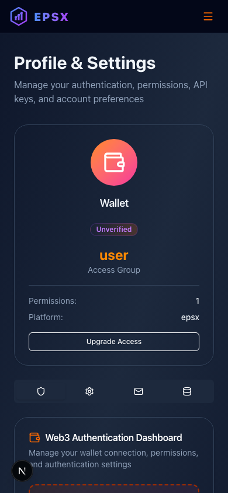](./pr2.auth.dependency-failure--mobile-dark--source.png) | [](./pr2.auth.dependency-failure--mobile-dark--target.png) | [](./pr2.auth.dependency-failure--mobile-dark--diff.png) | 19.5331% | The source receives its normal valid-session baseline. The target's token uses an uncached key identifier while identity verification is unavailable, so the Rust verifier clears unprovable authority and renders the explicit unavailable sign-in gate. | pre=PASS, post=PASS |
| `pr2.auth.logout` | `desktop-light` | PASS; 2 clean repeats | [](./pr2.auth.logout--desktop-light--source.png) | [](./pr2.auth.logout--desktop-light--target.png) | [](./pr2.auth.logout--desktop-light--diff.png) | 9.132% | Both captures finish signed out after their respective session-clearing mechanisms. The residual public-home difference is the same removal of unsupported live-market, social-proof, customer, and call-to-action claims approved for the shared-shell home capture. | pre=PASS, post=PASS |
| `pr2.auth.logout` | `mobile-dark` | PASS; 2 clean repeats | [](./pr2.auth.logout--mobile-dark--source.png) | [](./pr2.auth.logout--mobile-dark--target.png) | [](./pr2.auth.logout--mobile-dark--diff.png) | 20.5207% | Both captures finish signed out after their respective session-clearing mechanisms. The residual public-home difference is the same removal of unsupported live-market, social-proof, customer, and call-to-action claims approved for the shared-shell home capture. | pre=PASS, post=PASS |
| `pr2.auth.signed-out` | `desktop-light` | PASS; 2 clean repeats | [](./pr2.auth.signed-out--desktop-light--source.png) | [](./pr2.auth.signed-out--desktop-light--target.png) | [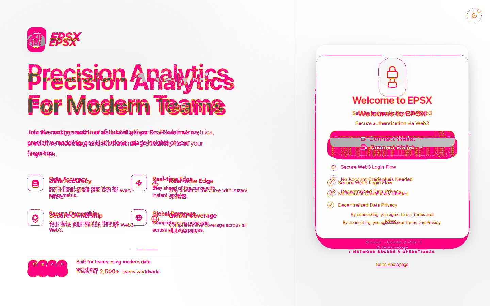](./pr2.auth.signed-out--desktop-light--diff.png) | 8.3697% | The pinned source sign-in gate claims secure operation and customer adoption without backend evidence. The target preserves the wallet CTA and gate structure while removing those unverified claims and describing only the wallet-based authentication contract. | pre=PASS, post=PASS |
| `pr2.auth.signed-out` | `mobile-dark` | PASS; 2 clean repeats | [](./pr2.auth.signed-out--mobile-dark--source.png) | [](./pr2.auth.signed-out--mobile-dark--target.png) | [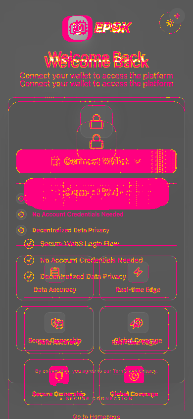](./pr2.auth.signed-out--mobile-dark--diff.png) | 15.6568% | The pinned source sign-in gate claims secure operation and customer adoption without backend evidence. The target preserves the wallet CTA and gate structure while removing those unverified claims and describing only the wallet-based authentication contract. | pre=PASS, post=PASS |
| `pr2.frontend.wrong-audience` | `desktop-light` | PASS; 2 clean repeats | [](./pr2.frontend.wrong-audience--desktop-light--source.png) | [](./pr2.frontend.wrong-audience--desktop-light--target.png) | [](./pr2.frontend.wrong-audience--desktop-light--diff.png) | 8.5798% | The source receives its valid frontend-audience baseline session, while the target receives an equally signed admin-audience token and must replace the owner profile with the public authentication gate. | pre=PASS, post=PASS |
| `pr2.frontend.wrong-audience` | `mobile-dark` | PASS; 2 clean repeats | [](./pr2.frontend.wrong-audience--mobile-dark--source.png) | [](./pr2.frontend.wrong-audience--mobile-dark--target.png) | [](./pr2.frontend.wrong-audience--mobile-dark--diff.png) | 13.5548% | The source receives its valid frontend-audience baseline session, while the target receives an equally signed admin-audience token and must replace the owner profile with the public authentication gate. | pre=PASS, post=PASS |
| `pr2.permissions.empty-claims` | `desktop-light` | PASS; 2 clean repeats | [](./pr2.permissions.empty-claims--desktop-light--source.png) | [](./pr2.permissions.empty-claims--desktop-light--target.png) | [](./pr2.permissions.empty-claims--desktop-light--diff.png) | 78.3572% | The pinned source client gate cannot establish authority from the valid backend session without a connected browser wallet. The target accepts the correctly signed owner session but renders an explicit zero-permission state, proving that empty backend claims stay empty and gain no frontend defaults. | pre=PASS, post=PASS |
| `pr2.permissions.empty-claims` | `mobile-dark` | PASS; 2 clean repeats | [](./pr2.permissions.empty-claims--mobile-dark--source.png) | [](./pr2.permissions.empty-claims--mobile-dark--target.png) | [](./pr2.permissions.empty-claims--mobile-dark--diff.png) | 6.7165% | The pinned source client gate cannot establish authority from the valid backend session without a connected browser wallet. The target accepts the correctly signed owner session but renders an explicit zero-permission state, proving that empty backend claims stay empty and gain no frontend defaults. | pre=PASS, post=PASS |
| `pr2.permissions.verified` | `desktop-light` | PASS; 2 clean repeats | [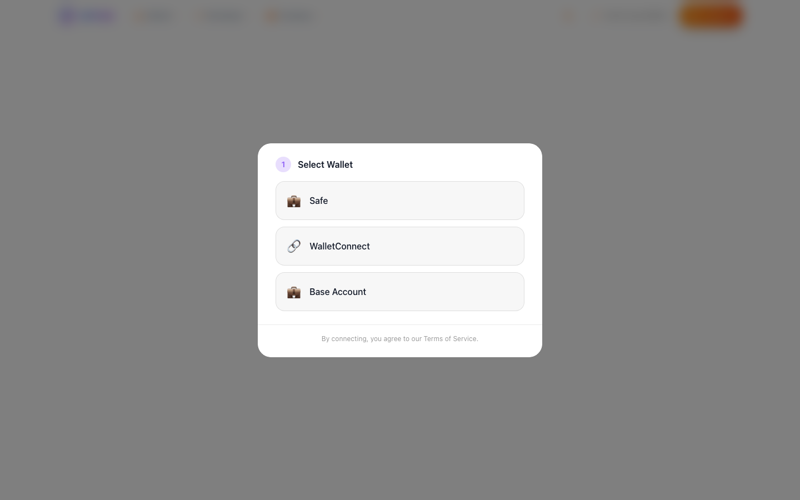](./pr2.permissions.verified--desktop-light--source.png) | [](./pr2.permissions.verified--desktop-light--target.png) | [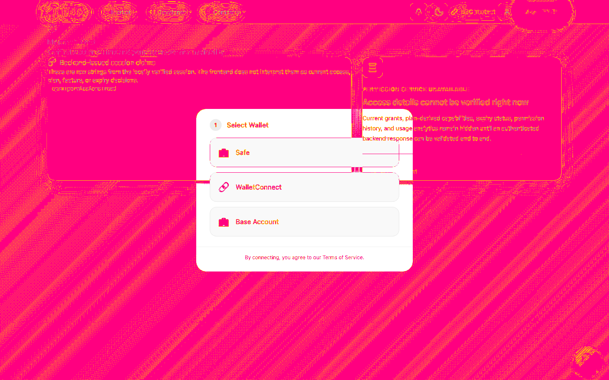](./pr2.permissions.verified--desktop-light--diff.png) | 78.4425% | The pinned source client gate cannot establish authority from the valid backend session without a connected browser wallet and therefore obscures the permission body. The target validates the exact Rust-issued audience and scope and renders only those verified permission claims. | pre=PASS, post=PASS |
| `pr2.permissions.verified` | `mobile-dark` | PASS; 2 clean repeats | [](./pr2.permissions.verified--mobile-dark--source.png) | [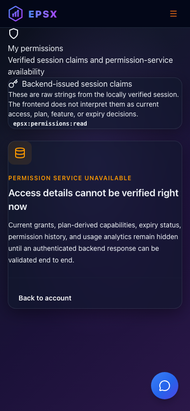](./pr2.permissions.verified--mobile-dark--target.png) | [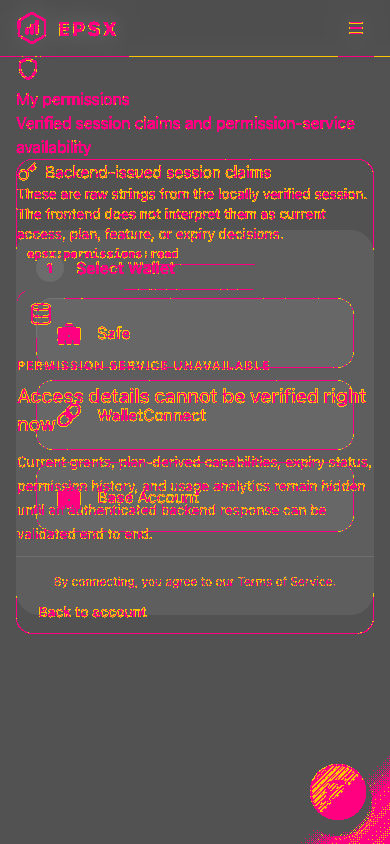](./pr2.permissions.verified--mobile-dark--diff.png) | 6.509% | The pinned source client gate cannot establish authority from the valid backend session without a connected browser wallet and therefore obscures the permission body. The target validates the exact Rust-issued audience and scope and renders only those verified permission claims. | pre=PASS, post=PASS |
| `pr2.profile.verified` | `desktop-light` | PASS; 2 clean repeats | [](./pr2.profile.verified--desktop-light--source.png) | [](./pr2.profile.verified--desktop-light--target.png) | [](./pr2.profile.verified--desktop-light--diff.png) | 4.8801% | The pinned source profile treats browser wallet connectivity as the profile authority even when its server session is valid. The target distinguishes the backend-verified session wallet from unavailable browser-wallet and policy-management state, preserving owner identity without fabricating connected-provider capabilities. | pre=PASS, post=PASS |
| `pr2.profile.verified` | `mobile-dark` | PASS; 2 clean repeats | [](./pr2.profile.verified--mobile-dark--source.png) | [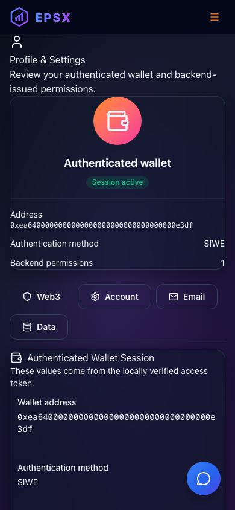](./pr2.profile.verified--mobile-dark--target.png) | [](./pr2.profile.verified--mobile-dark--diff.png) | 11.1113% | The pinned source profile treats browser wallet connectivity as the profile authority even when its server session is valid. The target distinguishes the backend-verified session wallet from unavailable browser-wallet and policy-management state, preserving owner identity without fabricating connected-provider capabilities. | pre=PASS, post=PASS |
| `pr3.admin.access-forbidden` | `desktop-light` | PASS; 2 clean repeats | [](./pr3.admin.access-forbidden--desktop-light--source.png) | [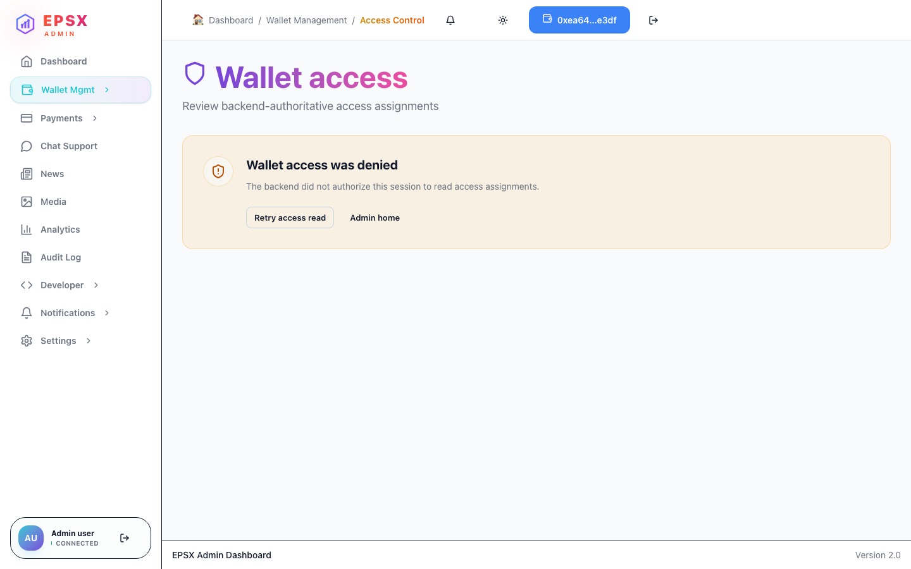](./pr3.admin.access-forbidden--desktop-light--target.png) | [](./pr3.admin.access-forbidden--desktop-light--diff.png) | 2.919% | The source receives its healthy baseline while the target subscription service denies the access read. The Rust BFF exposes no assignment fields and distinguishes the denial from empty data. | pre=PASS, post=PASS |
| `pr3.admin.access-forbidden` | `mobile-dark` | PASS; 2 clean repeats | [](./pr3.admin.access-forbidden--mobile-dark--source.png) | [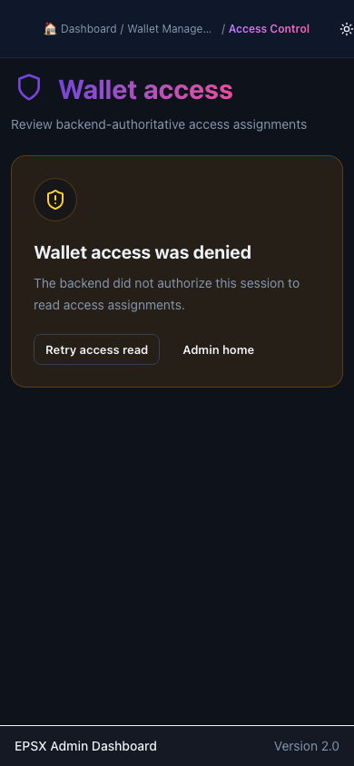](./pr3.admin.access-forbidden--mobile-dark--target.png) | [](./pr3.admin.access-forbidden--mobile-dark--diff.png) | 5.7218% | The source receives its healthy baseline while the target subscription service denies the access read. The Rust BFF exposes no assignment fields and distinguishes the denial from empty data. | pre=PASS, post=PASS |
| `pr3.admin.access` | `desktop-light` | PASS; 2 clean repeats | [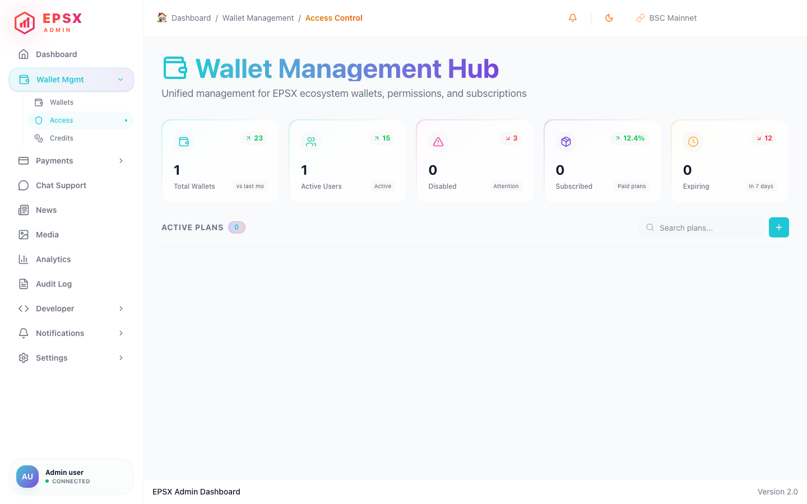](./pr3.admin.access--desktop-light--source.png) | [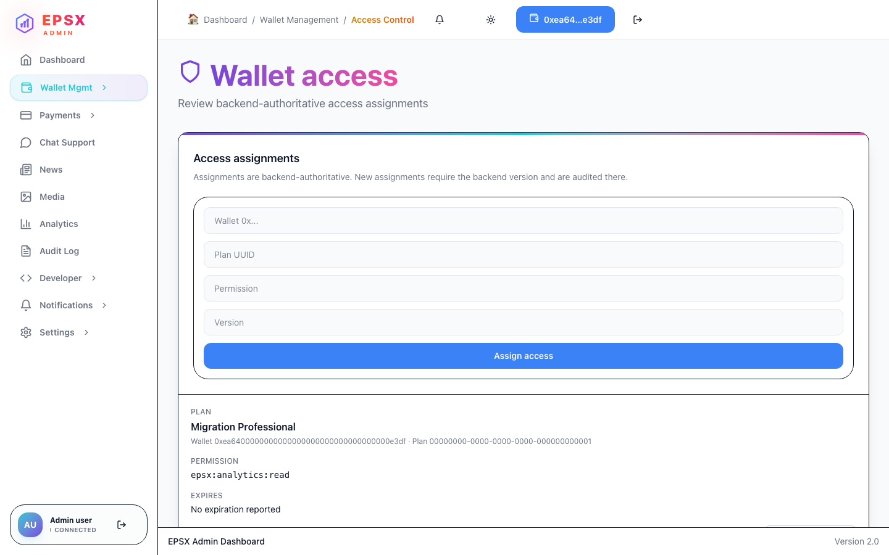](./pr3.admin.access--desktop-light--target.png) | [](./pr3.admin.access--desktop-light--diff.png) | 7.01% | The target renders exact backend plan, wallet, permission, expiry, and version claims and omits legacy client-composed membership and hierarchy interpretations. | pre=PASS, post=PASS |
| `pr3.admin.access` | `mobile-dark` | PASS; 2 clean repeats | [](./pr3.admin.access--mobile-dark--source.png) | [](./pr3.admin.access--mobile-dark--target.png) | [](./pr3.admin.access--mobile-dark--diff.png) | 10.3318% | The target renders exact backend plan, wallet, permission, expiry, and version claims and omits legacy client-composed membership and hierarchy interpretations. | pre=PASS, post=PASS |
| `pr3.admin.audit` | `desktop-light` | PASS; 2 clean repeats | [](./pr3.admin.audit--desktop-light--source.png) | [](./pr3.admin.audit--desktop-light--target.png) | [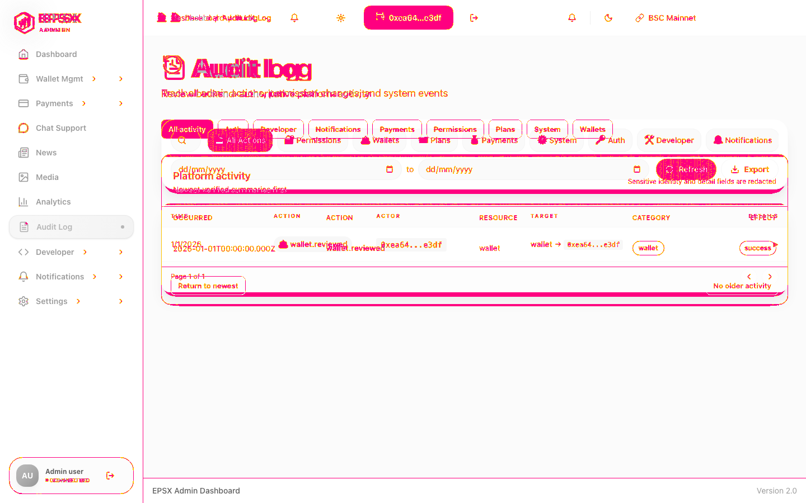](./pr3.admin.audit--desktop-light--diff.png) | 5.3897% | The target audit page accepts only a bounded Rust projection and intentionally omits legacy actor identity, network, device, arbitrary details, totals, and export claims. | pre=PASS, post=PASS |
| `pr3.admin.audit` | `mobile-dark` | PASS; 2 clean repeats | [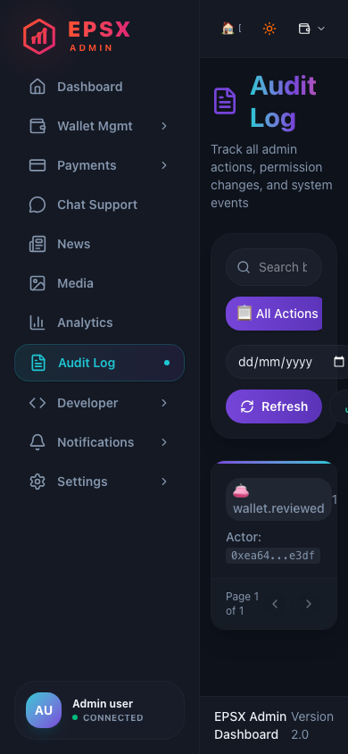](./pr3.admin.audit--mobile-dark--source.png) | [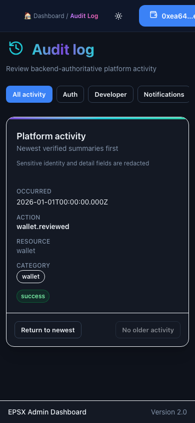](./pr3.admin.audit--mobile-dark--target.png) | [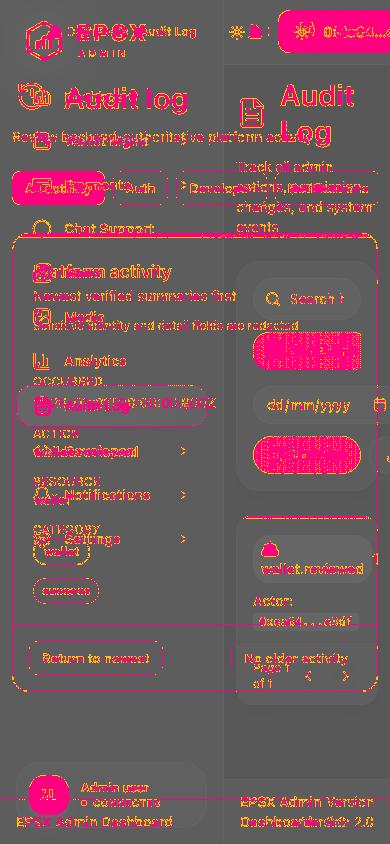](./pr3.admin.audit--mobile-dark--diff.png) | 10.3497% | The target audit page accepts only a bounded Rust projection and intentionally omits legacy actor identity, network, device, arbitrary details, totals, and export claims. | pre=PASS, post=PASS |
| `pr3.admin.credits-validation` | `desktop-light` | PASS; 2 clean repeats | [](./pr3.admin.credits-validation--desktop-light--source.png) | [](./pr3.admin.credits-validation--desktop-light--target.png) | [](./pr3.admin.credits-validation--desktop-light--diff.png) | 5.5569% | The target rejects an oversized credit amount at the Rust BFF boundary and renders a malformed mutation state without sending a wallet-service mutation. | pre=PASS, post=PASS |
| `pr3.admin.credits-validation` | `mobile-dark` | PASS; 2 clean repeats | [](./pr3.admin.credits-validation--mobile-dark--source.png) | [](./pr3.admin.credits-validation--mobile-dark--target.png) | [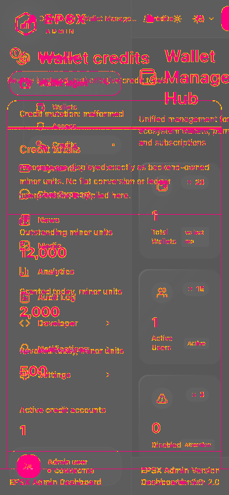](./pr3.admin.credits-validation--mobile-dark--diff.png) | 7.1737% | The target rejects an oversized credit amount at the Rust BFF boundary and renders a malformed mutation state without sending a wallet-service mutation. | pre=PASS, post=PASS |
| `pr3.admin.credits` | `desktop-light` | PASS; 2 clean repeats | [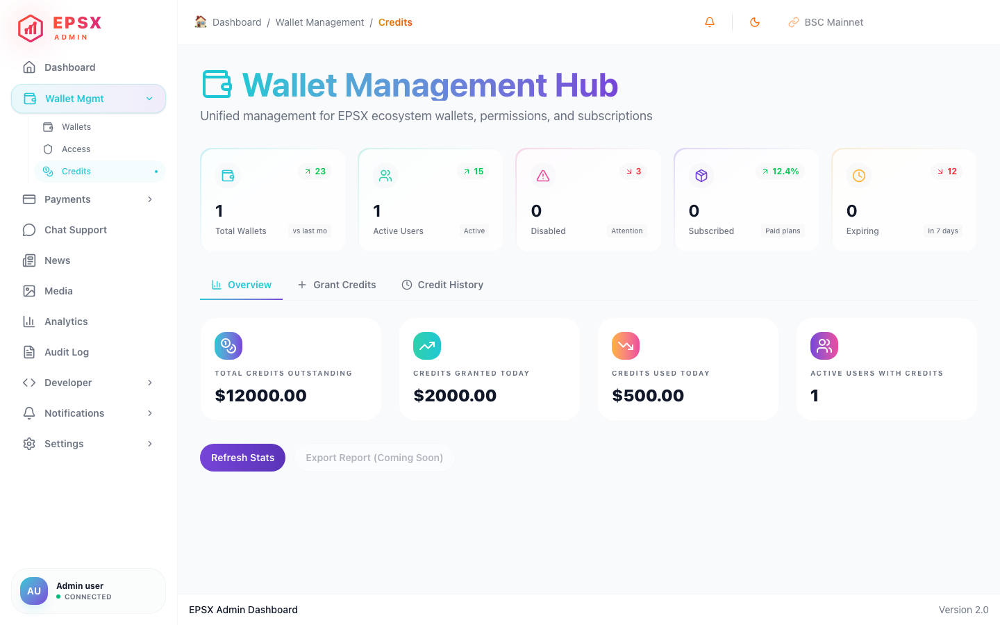](./pr3.admin.credits--desktop-light--source.png) | [](./pr3.admin.credits--desktop-light--target.png) | [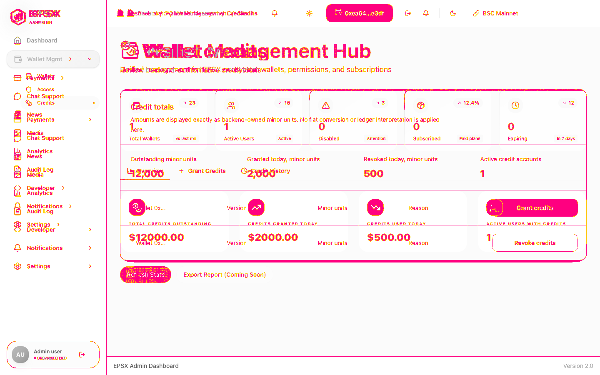](./pr3.admin.credits--desktop-light--diff.png) | 5.5229% | The target displays backend-owned minor units without fiat conversion or ledger interpretation and keeps grant/revoke authority behind the Rust service. | pre=PASS, post=PASS |
| `pr3.admin.credits` | `mobile-dark` | PASS; 2 clean repeats | [](./pr3.admin.credits--mobile-dark--source.png) | [](./pr3.admin.credits--mobile-dark--target.png) | [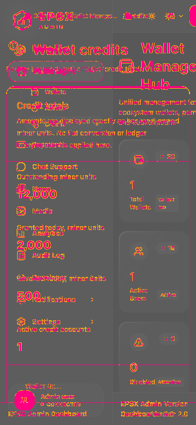](./pr3.admin.credits--mobile-dark--diff.png) | 7.0054% | The target displays backend-owned minor units without fiat conversion or ledger interpretation and keeps grant/revoke authority behind the Rust service. | pre=PASS, post=PASS |
| `pr3.admin.disable-audit` | `desktop-light` | PASS; 2 clean repeats | [](./pr3.admin.disable-audit--desktop-light--source.png) | [](./pr3.admin.disable-audit--desktop-light--target.png) | [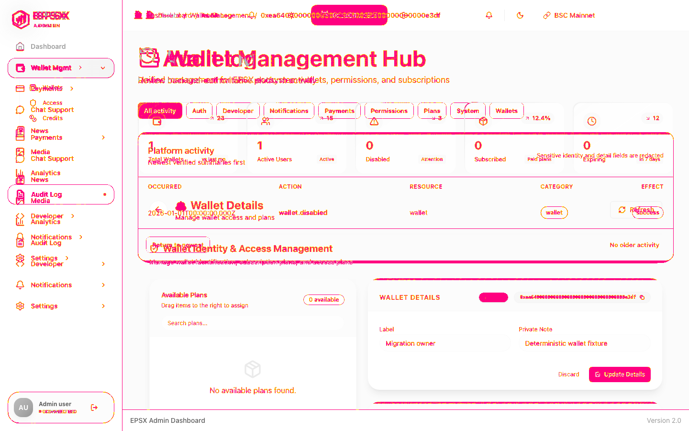](./pr3.admin.disable-audit--desktop-light--diff.png) | 5.4138% | The pinned source comparison remains on its stable wallet detail because its client-only disable route emits an invalid duplicate-key error before any service decision. The target treats disable as committed only after an evidence-bearing wallet response, then displays the resulting bounded wallet.disabled audit summary from analytics. | pre=PASS, post=PASS |
| `pr3.admin.disable-audit` | `mobile-dark` | PASS; 2 clean repeats | [](./pr3.admin.disable-audit--mobile-dark--source.png) | [](./pr3.admin.disable-audit--mobile-dark--target.png) | [](./pr3.admin.disable-audit--mobile-dark--diff.png) | 8.707% | The pinned source comparison remains on its stable wallet detail because its client-only disable route emits an invalid duplicate-key error before any service decision. The target treats disable as committed only after an evidence-bearing wallet response, then displays the resulting bounded wallet.disabled audit summary from analytics. | pre=PASS, post=PASS |
| `pr3.admin.disable` | `desktop-light` | PASS; 2 clean repeats | [](./pr3.admin.disable--desktop-light--source.png) | [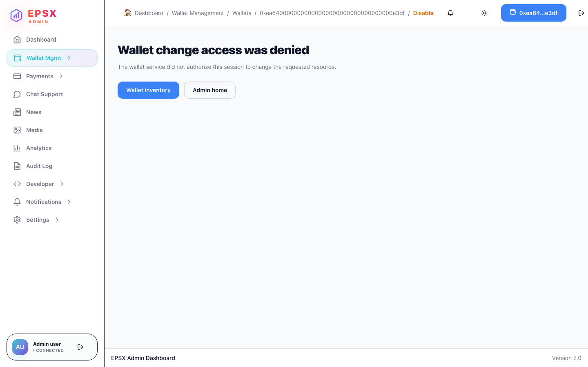](./pr3.admin.disable--desktop-light--target.png) | [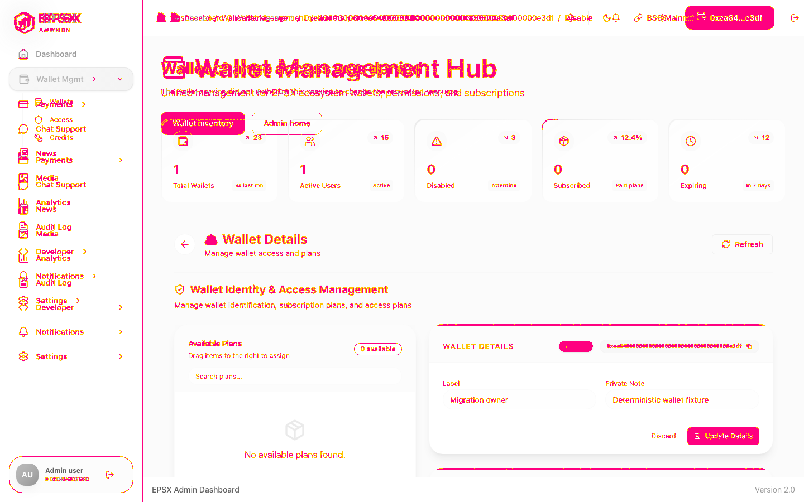](./pr3.admin.disable--desktop-light--diff.png) | 4.2421% | The pinned source comparison remains on its stable wallet detail because its client-only disable route emits an invalid duplicate-key error before any service decision. The target enters the versioned form and proves that literal admin:wallets:manage authority is required: a read-only administrator receives an explicit forbidden result and no success claim. | pre=PASS, post=PASS |
| `pr3.admin.disable` | `mobile-dark` | PASS; 2 clean repeats | [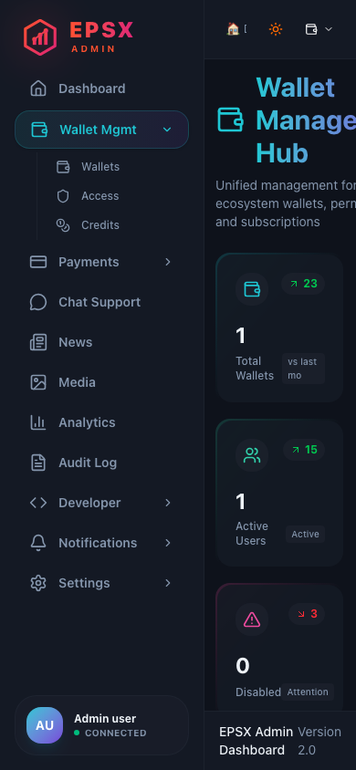](./pr3.admin.disable--mobile-dark--source.png) | [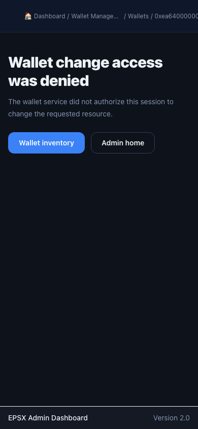](./pr3.admin.disable--mobile-dark--target.png) | [](./pr3.admin.disable--mobile-dark--diff.png) | 7.1901% | The pinned source comparison remains on its stable wallet detail because its client-only disable route emits an invalid duplicate-key error before any service decision. The target enters the versioned form and proves that literal admin:wallets:manage authority is required: a read-only administrator receives an explicit forbidden result and no success claim. | pre=PASS, post=PASS |
| `pr3.admin.plan-conflict` | `desktop-light` | PASS; 2 clean repeats | [](./pr3.admin.plan-conflict--desktop-light--source.png) | [](./pr3.admin.plan-conflict--desktop-light--target.png) | [](./pr3.admin.plan-conflict--desktop-light--diff.png) | 3.5666% | The target submits the read version and preserves the subscription service's 409 as an explicit optimistic-conflict state rather than inferring that an update committed. | pre=PASS, post=PASS |
| `pr3.admin.plan-conflict` | `mobile-dark` | PASS; 2 clean repeats | [](./pr3.admin.plan-conflict--mobile-dark--source.png) | [](./pr3.admin.plan-conflict--mobile-dark--target.png) | [](./pr3.admin.plan-conflict--mobile-dark--diff.png) | 6.6685% | The target submits the read version and preserves the subscription service's 409 as an explicit optimistic-conflict state rather than inferring that an update committed. | pre=PASS, post=PASS |
| `pr3.admin.plan-detail` | `desktop-light` | PASS; 2 clean repeats | [](./pr3.admin.plan-detail--desktop-light--source.png) | [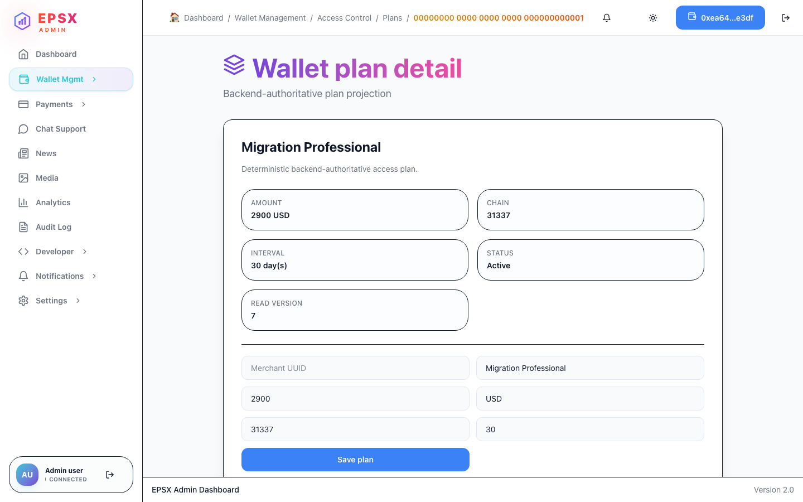](./pr3.admin.plan-detail--desktop-light--target.png) | [](./pr3.admin.plan-detail--desktop-light--diff.png) | 4.704% | The target exposes only the Rust-verified plan identifier, amount, currency, chain, interval, active state, and version; merchant and legacy permission-policy details remain redacted. | pre=PASS, post=PASS |
| `pr3.admin.plan-detail` | `mobile-dark` | PASS; 2 clean repeats | [](./pr3.admin.plan-detail--mobile-dark--source.png) | [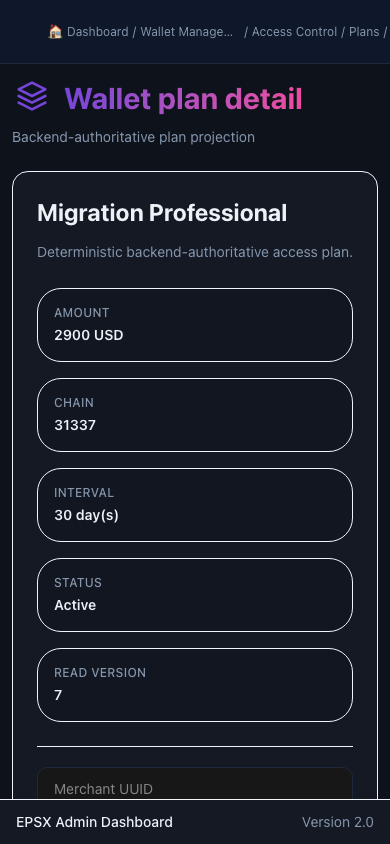](./pr3.admin.plan-detail--mobile-dark--target.png) | [](./pr3.admin.plan-detail--mobile-dark--diff.png) | 6.5357% | The target exposes only the Rust-verified plan identifier, amount, currency, chain, interval, active state, and version; merchant and legacy permission-policy details remain redacted. | pre=PASS, post=PASS |
| `pr3.admin.plans` | `desktop-light` | PASS; 2 clean repeats | [](./pr3.admin.plans--desktop-light--source.png) | [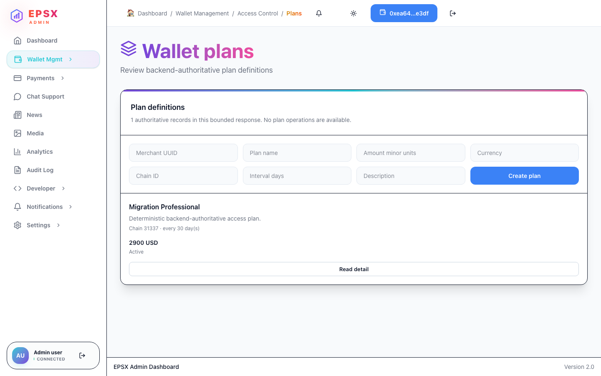](./pr3.admin.plans--desktop-light--target.png) | [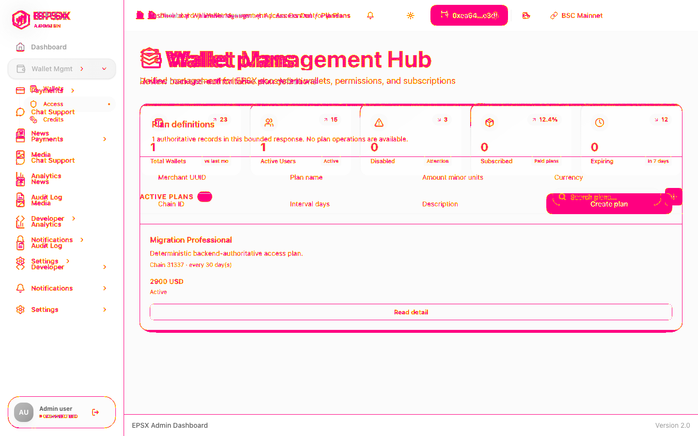](./pr3.admin.plans--desktop-light--diff.png) | 4.9485% | The target plan list is limited to the strict subscription-service DTO and does not recreate legacy permission-plan policy, hierarchy, membership, or client-owned operation claims. | pre=PASS, post=PASS |
| `pr3.admin.plans` | `mobile-dark` | PASS; 2 clean repeats | [](./pr3.admin.plans--mobile-dark--source.png) | [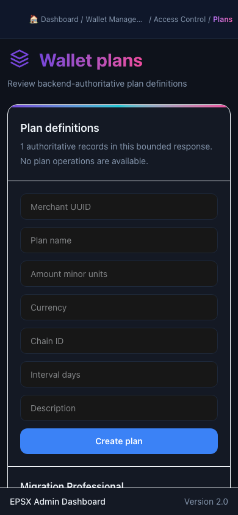](./pr3.admin.plans--mobile-dark--target.png) | [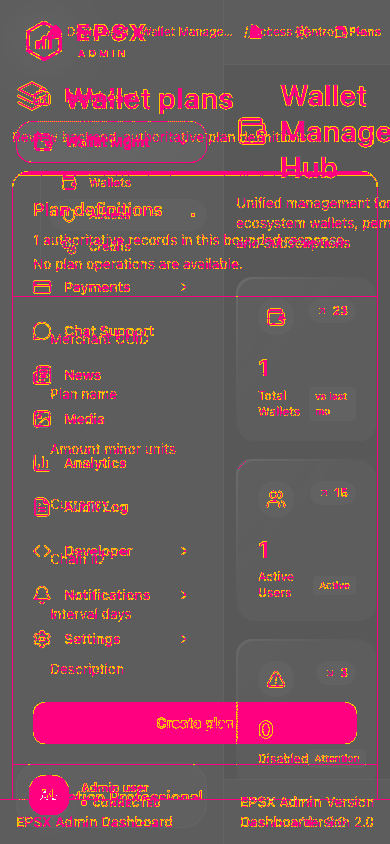](./pr3.admin.plans--mobile-dark--diff.png) | 10.3424% | The target plan list is limited to the strict subscription-service DTO and does not recreate legacy permission-plan policy, hierarchy, membership, or client-owned operation claims. | pre=PASS, post=PASS |
| `pr3.admin.wallet-detail-forbidden` | `desktop-light` | PASS; 2 clean repeats | [](./pr3.admin.wallet-detail-forbidden--desktop-light--source.png) | [](./pr3.admin.wallet-detail-forbidden--desktop-light--target.png) | [](./pr3.admin.wallet-detail-forbidden--desktop-light--diff.png) | 4.0285% | The source receives its healthy baseline while the target wallet service denies the same signed administrator. The Rust BFF removes all wallet fields and renders an explicit forbidden state. | pre=PASS, post=PASS |
| `pr3.admin.wallet-detail-forbidden` | `mobile-dark` | PASS; 2 clean repeats | [](./pr3.admin.wallet-detail-forbidden--mobile-dark--source.png) | [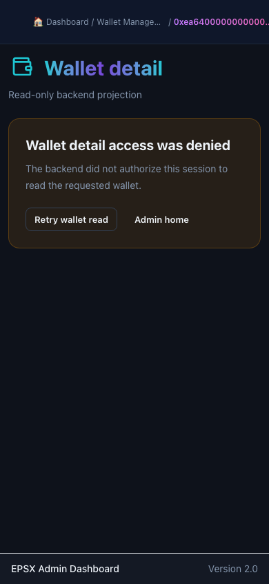](./pr3.admin.wallet-detail-forbidden--mobile-dark--target.png) | [](./pr3.admin.wallet-detail-forbidden--mobile-dark--diff.png) | 5.7477% | The source receives its healthy baseline while the target wallet service denies the same signed administrator. The Rust BFF removes all wallet fields and renders an explicit forbidden state. | pre=PASS, post=PASS |
| `pr3.admin.wallet-detail` | `desktop-light` | PASS; 2 clean repeats | [](./pr3.admin.wallet-detail--desktop-light--source.png) | [](./pr3.admin.wallet-detail--desktop-light--target.png) | [](./pr3.admin.wallet-detail--desktop-light--diff.png) | 5.0812% | The target detail is a strict redacted wallet projection and omits legacy metadata, permission, group, plan, subscription, and inferred activity fields that the wallet service did not authorize for this boundary. | pre=PASS, post=PASS |
| `pr3.admin.wallet-detail` | `mobile-dark` | PASS; 2 clean repeats | [](./pr3.admin.wallet-detail--mobile-dark--source.png) | [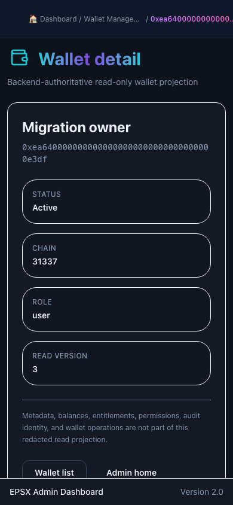](./pr3.admin.wallet-detail--mobile-dark--target.png) | [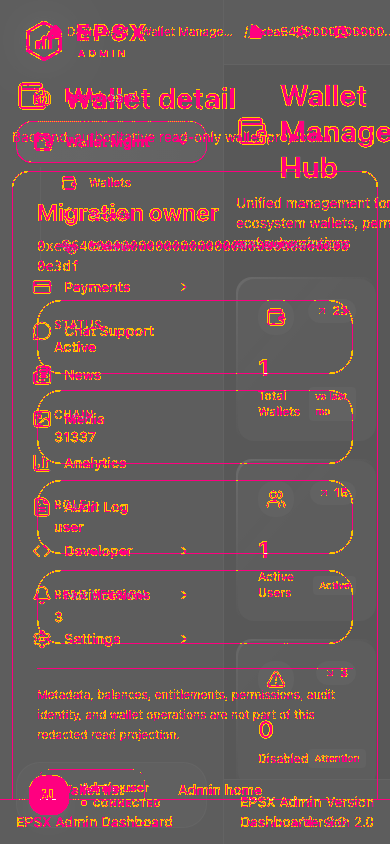](./pr3.admin.wallet-detail--mobile-dark--diff.png) | 7.2497% | The target detail is a strict redacted wallet projection and omits legacy metadata, permission, group, plan, subscription, and inferred activity fields that the wallet service did not authorize for this boundary. | pre=PASS, post=PASS |
| `pr3.admin.wallet-redirect` | `desktop-light` | PASS; 2 clean repeats | [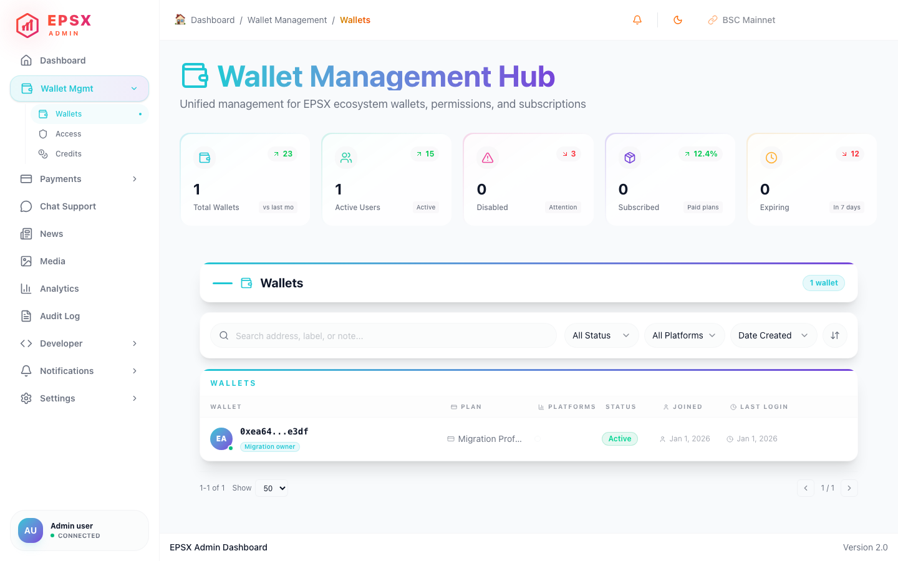](./pr3.admin.wallet-redirect--desktop-light--source.png) | [](./pr3.admin.wallet-redirect--desktop-light--target.png) | [](./pr3.admin.wallet-redirect--desktop-light--diff.png) | 4.5756% | The legacy wallet hub exposes unsupported mixed management claims. The target canonicalizes the entry route to the bounded backend-authoritative wallet list. | pre=PASS, post=PASS |
| `pr3.admin.wallet-redirect` | `mobile-dark` | PASS; 2 clean repeats | [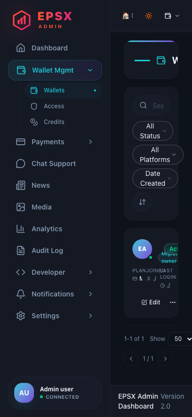](./pr3.admin.wallet-redirect--mobile-dark--source.png) | [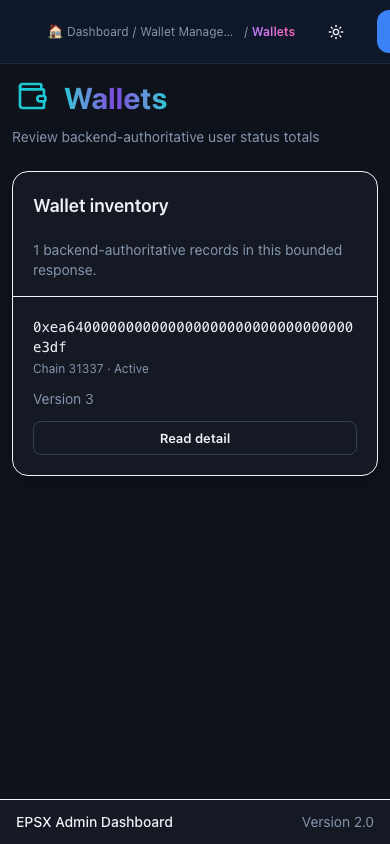](./pr3.admin.wallet-redirect--mobile-dark--target.png) | [](./pr3.admin.wallet-redirect--mobile-dark--diff.png) | 5.9679% | The legacy wallet hub exposes unsupported mixed management claims. The target canonicalizes the entry route to the bounded backend-authoritative wallet list. | pre=PASS, post=PASS |
| `pr3.admin.wallets-query-rejected` | `desktop-light` | PASS; 2 clean repeats | [](./pr3.admin.wallets-query-rejected--desktop-light--source.png) | [](./pr3.admin.wallets-query-rejected--desktop-light--target.png) | [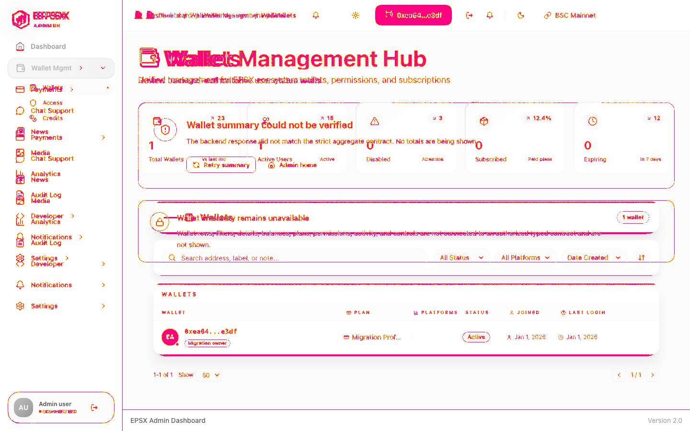](./pr3.admin.wallets-query-rejected--desktop-light--diff.png) | 4.4958% | The source applies browser-controlled search and status filters. The target rejects those unsupported query claims before upstream I/O because the wallet service exposes only a bounded authoritative list contract. | pre=PASS, post=PASS |
| `pr3.admin.wallets-query-rejected` | `mobile-dark` | PASS; 2 clean repeats | [](./pr3.admin.wallets-query-rejected--mobile-dark--source.png) | [](./pr3.admin.wallets-query-rejected--mobile-dark--target.png) | [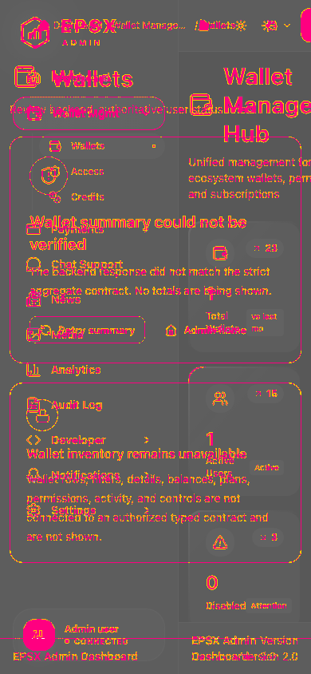](./pr3.admin.wallets-query-rejected--mobile-dark--diff.png) | 7.1202% | The source applies browser-controlled search and status filters. The target rejects those unsupported query claims before upstream I/O because the wallet service exposes only a bounded authoritative list contract. | pre=PASS, post=PASS |
| `pr3.admin.wallets` | `desktop-light` | PASS; 2 clean repeats | [](./pr3.admin.wallets--desktop-light--source.png) | [](./pr3.admin.wallets--desktop-light--target.png) | [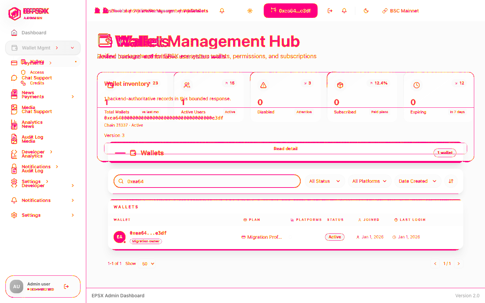](./pr3.admin.wallets--desktop-light--diff.png) | 4.7291% | The source presents client-side search, filter facets, activity, subscription, and platform distributions that are absent from the selected wallet service contract. The target renders only the bounded wallet rows and stored status totals verified by Rust. | pre=PASS, post=PASS |
| `pr3.admin.wallets` | `mobile-dark` | PASS; 2 clean repeats | [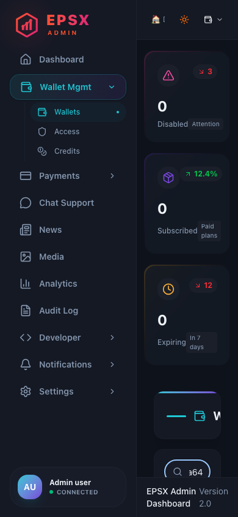](./pr3.admin.wallets--mobile-dark--source.png) | [](./pr3.admin.wallets--mobile-dark--target.png) | [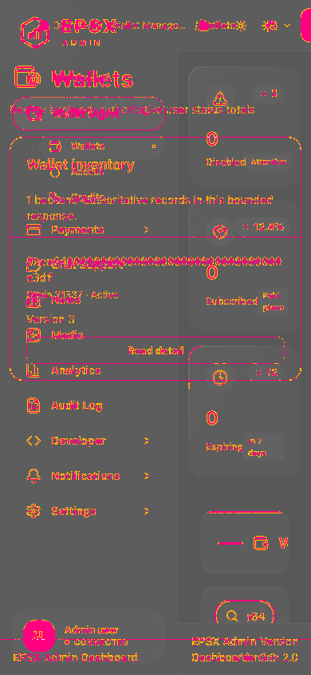](./pr3.admin.wallets--mobile-dark--diff.png) | 5.4308% | The source presents client-side search, filter facets, activity, subscription, and platform distributions that are absent from the selected wallet service contract. The target renders only the bounded wallet rows and stored status totals verified by Rust. | pre=PASS, post=PASS |
| `pr3.frontend.credits` | `desktop-light` | PASS; 2 clean repeats | [](./pr3.frontend.credits--desktop-light--source.png) | [](./pr3.frontend.credits--desktop-light--target.png) | [](./pr3.frontend.credits--desktop-light--diff.png) | 7.4506% | The pinned source renders a legacy credits balance and transaction interpretation. The target preserves the authenticated route but explicitly reports that no owner-scoped Rust ledger contract was selected, so it cannot infer a balance, zero value, or transaction history. | pre=PASS, post=PASS |
| `pr3.frontend.credits` | `mobile-dark` | PASS; 2 clean repeats | [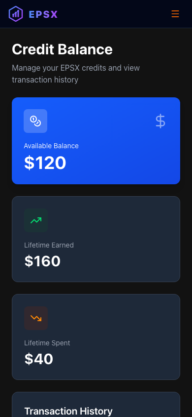](./pr3.frontend.credits--mobile-dark--source.png) | [](./pr3.frontend.credits--mobile-dark--target.png) | [](./pr3.frontend.credits--mobile-dark--diff.png) | 19.6758% | The pinned source renders a legacy credits balance and transaction interpretation. The target preserves the authenticated route but explicitly reports that no owner-scoped Rust ledger contract was selected, so it cannot infer a balance, zero value, or transaction history. | pre=PASS, post=PASS |
| `pr4.admin.analytics-empty` | `desktop-light` | PASS; 2 clean repeats | [](./pr4.admin.analytics-empty--desktop-light--source.png) | [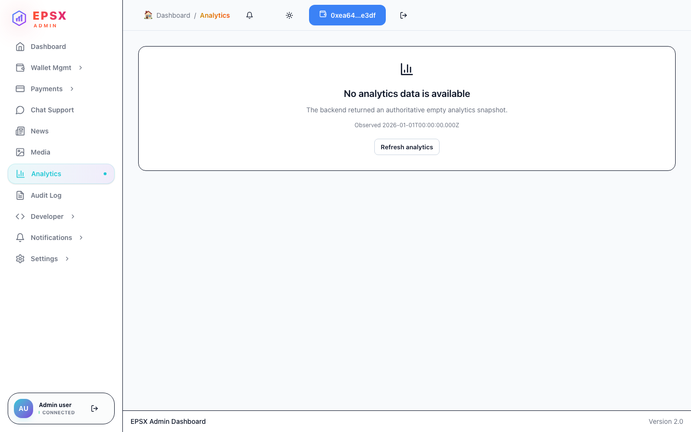](./pr4.admin.analytics-empty--desktop-light--target.png) | [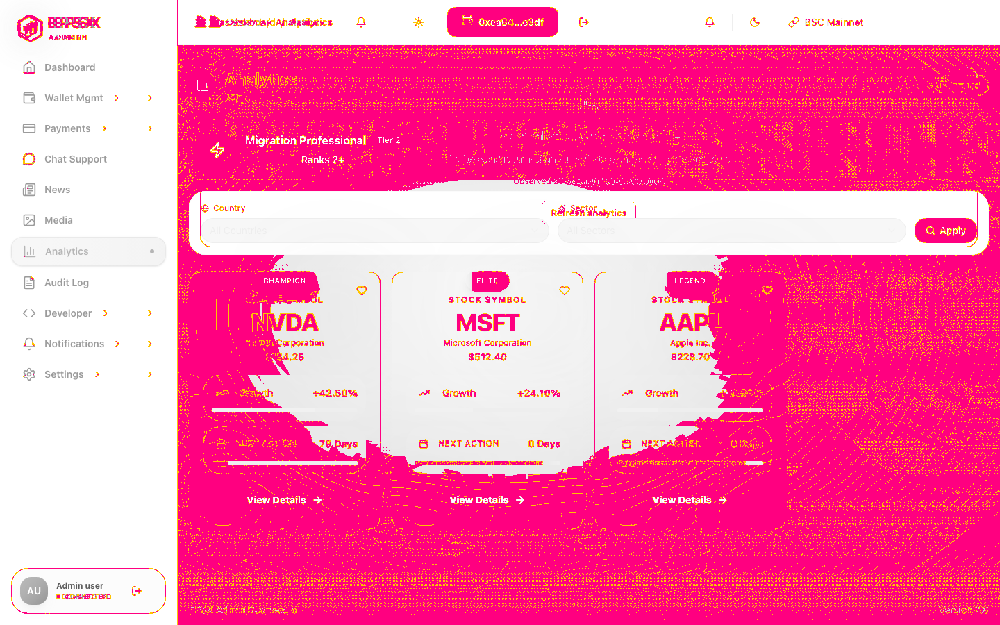](./pr4.admin.analytics-empty--desktop-light--diff.png) | 51.5894% | The target accepts the verified envelope observation time but treats a zero-valued service projection as authoritative empty data. It does not create charts, totals, freshness, or activity from frontend defaults. | pre=PASS, post=PASS |
| `pr4.admin.analytics-empty` | `mobile-dark` | PASS; 2 clean repeats | [](./pr4.admin.analytics-empty--mobile-dark--source.png) | [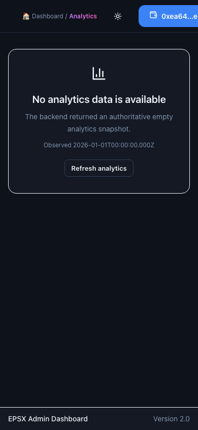](./pr4.admin.analytics-empty--mobile-dark--target.png) | [](./pr4.admin.analytics-empty--mobile-dark--diff.png) | 13.2829% | The target accepts the verified envelope observation time but treats a zero-valued service projection as authoritative empty data. It does not create charts, totals, freshness, or activity from frontend defaults. | pre=PASS, post=PASS |
| `pr4.admin.analytics-forbidden` | `desktop-light` | PASS; 2 clean repeats | [](./pr4.admin.analytics-forbidden--desktop-light--source.png) | [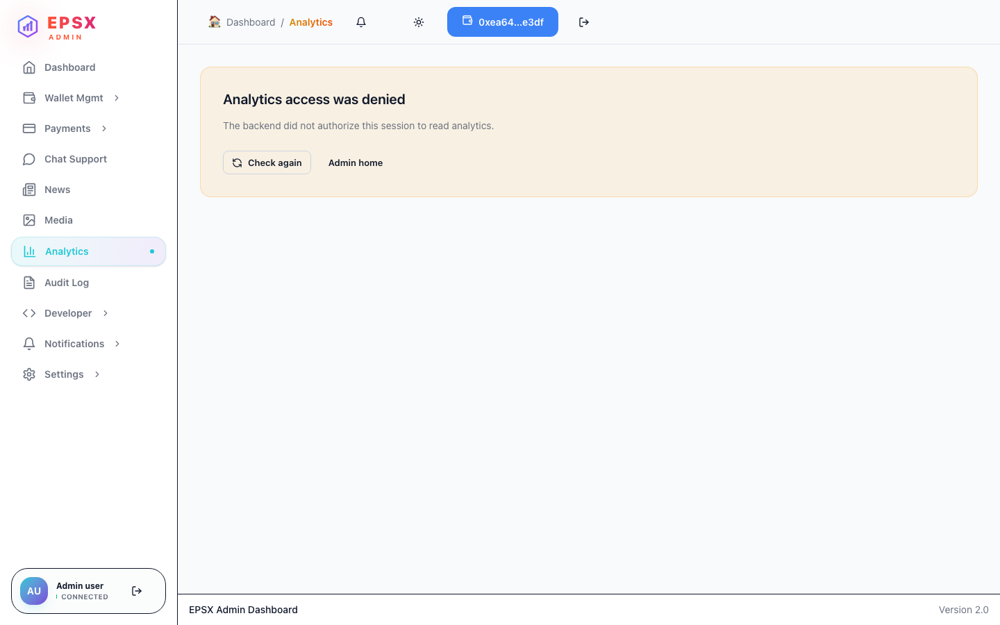](./pr4.admin.analytics-forbidden--desktop-light--target.png) | [](./pr4.admin.analytics-forbidden--desktop-light--diff.png) | 49.9666% | The source receives its healthy baseline while the target analytics service denies the read. The Rust BFF removes every analytics field and renders a denial that cannot be confused with a zero-valued snapshot. | pre=PASS, post=PASS |
| `pr4.admin.analytics-forbidden` | `mobile-dark` | PASS; 2 clean repeats | [](./pr4.admin.analytics-forbidden--mobile-dark--source.png) | [](./pr4.admin.analytics-forbidden--mobile-dark--target.png) | [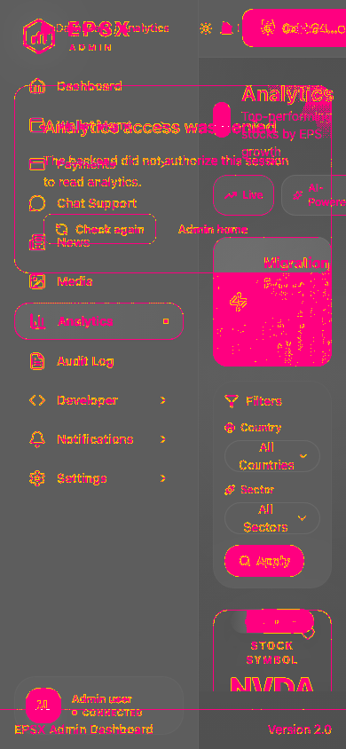](./pr4.admin.analytics-forbidden--mobile-dark--diff.png) | 12.1658% | The source receives its healthy baseline while the target analytics service denies the read. The Rust BFF removes every analytics field and renders a denial that cannot be confused with a zero-valued snapshot. | pre=PASS, post=PASS |
| `pr4.admin.analytics-malformed` | `desktop-light` | PASS; 2 clean repeats | [](./pr4.admin.analytics-malformed--desktop-light--source.png) | [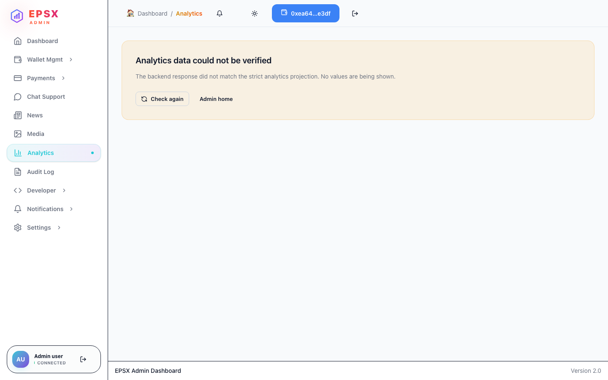](./pr4.admin.analytics-malformed--desktop-light--target.png) | [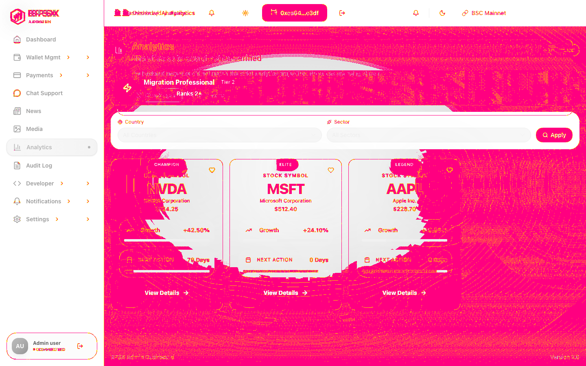](./pr4.admin.analytics-malformed--desktop-light--diff.png) | 49.9547% | The source receives its healthy baseline while the target payload attempts to own its observation time. The Rust adapter rejects data-owned freshness, exposes no analytics values, and renders a malformed state. | pre=PASS, post=PASS |
| `pr4.admin.analytics-malformed` | `mobile-dark` | PASS; 2 clean repeats | [](./pr4.admin.analytics-malformed--mobile-dark--source.png) | [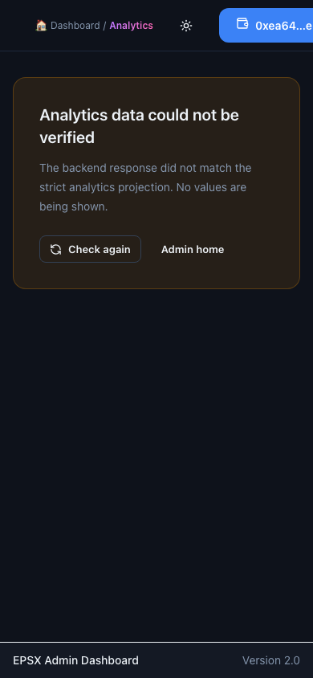](./pr4.admin.analytics-malformed--mobile-dark--target.png) | [](./pr4.admin.analytics-malformed--mobile-dark--diff.png) | 10.9427% | The source receives its healthy baseline while the target payload attempts to own its observation time. The Rust adapter rejects data-owned freshness, exposes no analytics values, and renders a malformed state. | pre=PASS, post=PASS |
| `pr4.admin.analytics-unavailable` | `desktop-light` | PASS; 2 clean repeats | [](./pr4.admin.analytics-unavailable--desktop-light--source.png) | [](./pr4.admin.analytics-unavailable--desktop-light--target.png) | [](./pr4.admin.analytics-unavailable--desktop-light--diff.png) | 49.9532% | The source receives its healthy baseline while the target analytics dependency remains unavailable after retry. The Rust BFF exposes no stale totals or invented freshness and renders a distinct unavailable state. | pre=PASS, post=PASS |
| `pr4.admin.analytics-unavailable` | `mobile-dark` | PASS; 2 clean repeats | [](./pr4.admin.analytics-unavailable--mobile-dark--source.png) | [](./pr4.admin.analytics-unavailable--mobile-dark--target.png) | [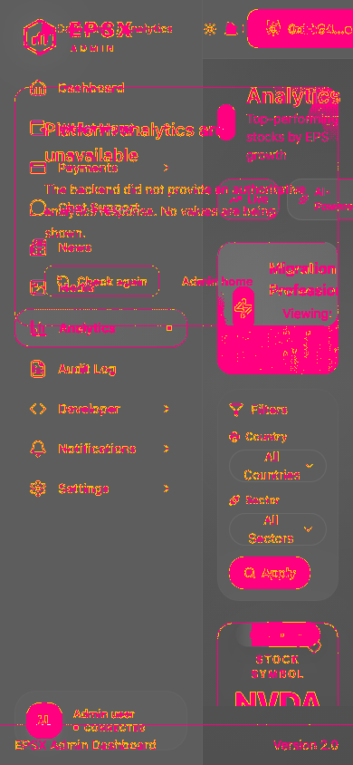](./pr4.admin.analytics-unavailable--mobile-dark--diff.png) | 10.9375% | The source receives its healthy baseline while the target analytics dependency remains unavailable after retry. The Rust BFF exposes no stale totals or invented freshness and renders a distinct unavailable state. | pre=PASS, post=PASS |
| `pr4.admin.analytics` | `desktop-light` | PASS; 2 clean repeats | [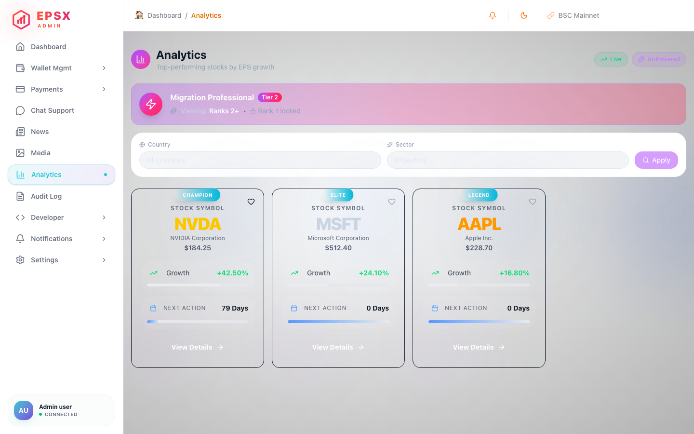](./pr4.admin.analytics--desktop-light--source.png) | [](./pr4.admin.analytics--desktop-light--target.png) | [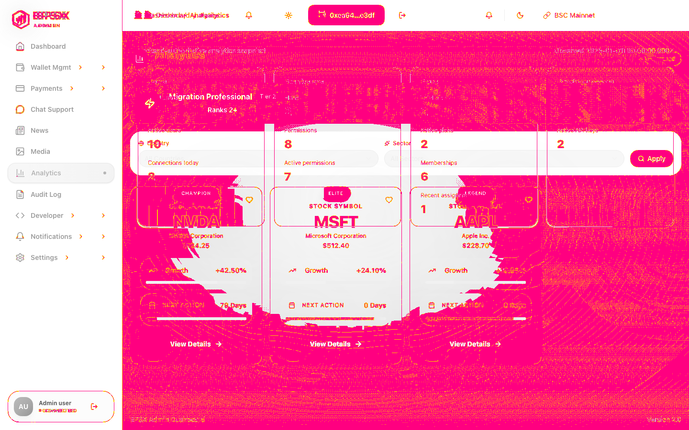](./pr4.admin.analytics--desktop-light--diff.png) | 52.2293% | The target renders only bounded user, permission, plan, developer, and system values accepted by the Rust adapter and binds freshness exclusively to the verified response envelope. It removes the pinned source's unconditional Live and AI-Powered claims. | pre=PASS, post=PASS |
| `pr4.admin.analytics` | `mobile-dark` | PASS; 2 clean repeats | [](./pr4.admin.analytics--mobile-dark--source.png) | [](./pr4.admin.analytics--mobile-dark--target.png) | [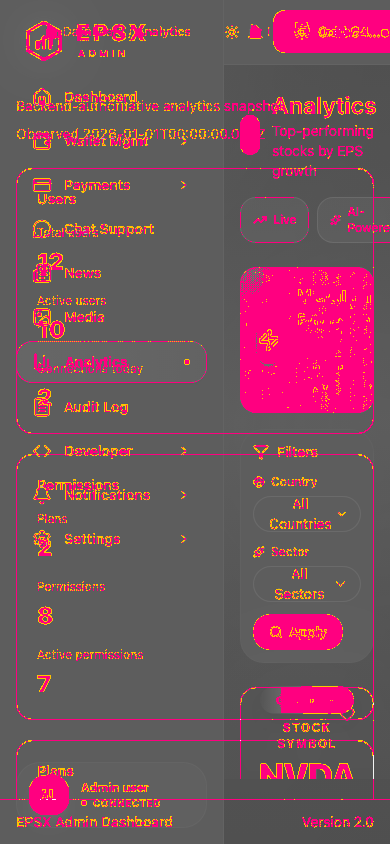](./pr4.admin.analytics--mobile-dark--diff.png) | 13.7796% | The target renders only bounded user, permission, plan, developer, and system values accepted by the Rust adapter and binds freshness exclusively to the verified response envelope. It removes the pinned source's unconditional Live and AI-Powered claims. | pre=PASS, post=PASS |
| `pr4.admin.dashboard-forbidden` | `desktop-light` | PASS; 2 clean repeats | [](./pr4.admin.dashboard-forbidden--desktop-light--source.png) | [](./pr4.admin.dashboard-forbidden--desktop-light--target.png) | [](./pr4.admin.dashboard-forbidden--desktop-light--diff.png) | 8.8319% | The source receives its healthy baseline while the target analytics service denies the dashboard read. The Rust BFF removes all count and activity fields and renders the denial as distinct from empty or unavailable data. | pre=PASS, post=PASS |
| `pr4.admin.dashboard-forbidden` | `mobile-dark` | PASS; 2 clean repeats | [](./pr4.admin.dashboard-forbidden--mobile-dark--source.png) | [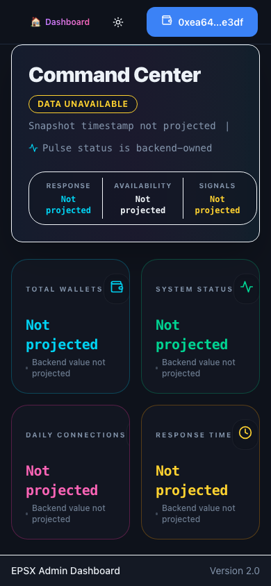](./pr4.admin.dashboard-forbidden--mobile-dark--target.png) | [](./pr4.admin.dashboard-forbidden--mobile-dark--diff.png) | 10.6875% | The source receives its healthy baseline while the target analytics service denies the dashboard read. The Rust BFF removes all count and activity fields and renders the denial as distinct from empty or unavailable data. | pre=PASS, post=PASS |
| `pr4.admin.dashboard-malformed` | `desktop-light` | PASS; 2 clean repeats | [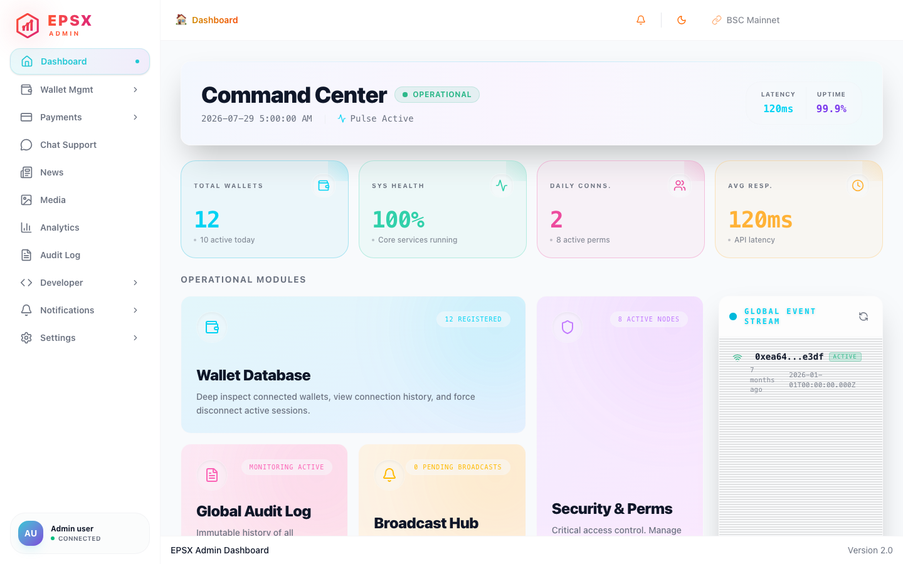](./pr4.admin.dashboard-malformed--desktop-light--source.png) | [](./pr4.admin.dashboard-malformed--desktop-light--target.png) | [](./pr4.admin.dashboard-malformed--desktop-light--diff.png) | 8.8319% | The source receives its healthy baseline while the target dashboard snapshot violates the bounded projection. The Rust decoder fails closed and renders no totals, activity, or observation-time claim from malformed data. | pre=PASS, post=PASS |
| `pr4.admin.dashboard-malformed` | `mobile-dark` | PASS; 2 clean repeats | [](./pr4.admin.dashboard-malformed--mobile-dark--source.png) | [](./pr4.admin.dashboard-malformed--mobile-dark--target.png) | [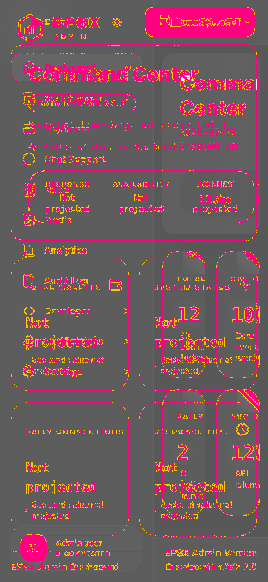](./pr4.admin.dashboard-malformed--mobile-dark--diff.png) | 10.6881% | The source receives its healthy baseline while the target dashboard snapshot violates the bounded projection. The Rust decoder fails closed and renders no totals, activity, or observation-time claim from malformed data. | pre=PASS, post=PASS |
| `pr4.admin.dashboard-unavailable` | `desktop-light` | PASS; 2 clean repeats | [](./pr4.admin.dashboard-unavailable--desktop-light--source.png) | [](./pr4.admin.dashboard-unavailable--desktop-light--target.png) | [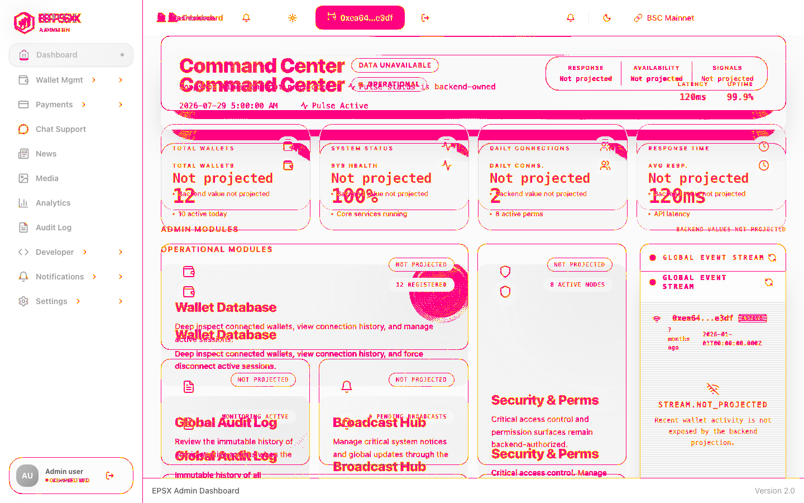](./pr4.admin.dashboard-unavailable--desktop-light--diff.png) | 8.8319% | The source receives its healthy baseline while the target dashboard dependency is unavailable. The Rust BFF exposes no cached or fabricated counts and preserves a distinct retryable unavailable state. | pre=PASS, post=PASS |
| `pr4.admin.dashboard-unavailable` | `mobile-dark` | PASS; 2 clean repeats | [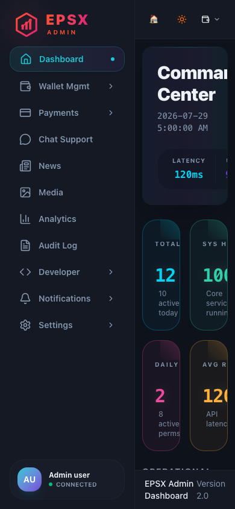](./pr4.admin.dashboard-unavailable--mobile-dark--source.png) | [](./pr4.admin.dashboard-unavailable--mobile-dark--target.png) | [](./pr4.admin.dashboard-unavailable--mobile-dark--diff.png) | 10.6881% | The source receives its healthy baseline while the target dashboard dependency is unavailable. The Rust BFF exposes no cached or fabricated counts and preserves a distinct retryable unavailable state. | pre=PASS, post=PASS |
| `pr4.admin.dashboard` | `desktop-light` | PASS; 2 clean repeats | [](./pr4.admin.dashboard--desktop-light--source.png) | [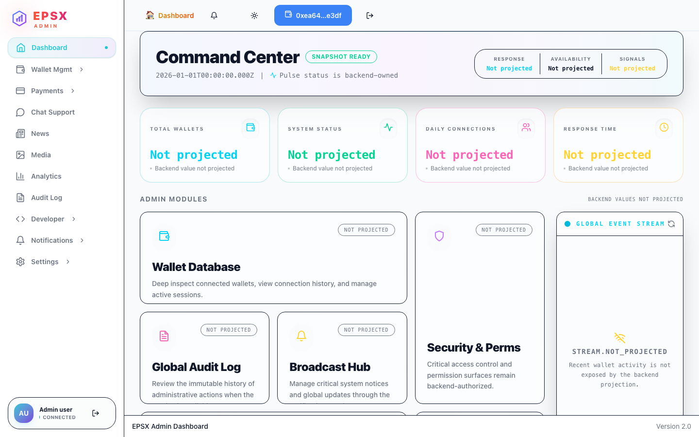](./pr4.admin.dashboard--desktop-light--target.png) | [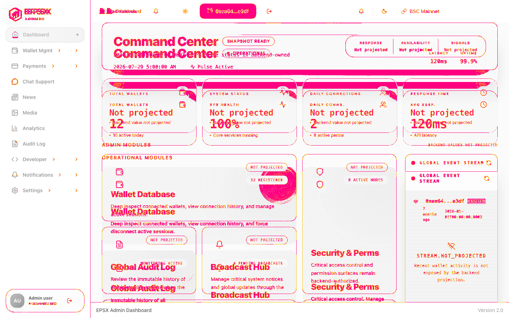](./pr4.admin.dashboard--desktop-light--diff.png) | 8.8274% | The target dashboard limits its authoritative data region to the analytics service's strict total-user, active-user, and envelope observation-time projection. Legacy recent-wallet activity and additional HUD values remain non-authoritative navigation rather than service claims. | pre=PASS, post=PASS |
| `pr4.admin.dashboard` | `mobile-dark` | PASS; 2 clean repeats | [](./pr4.admin.dashboard--mobile-dark--source.png) | [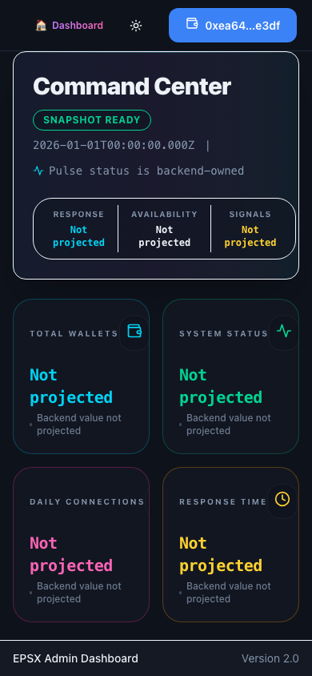](./pr4.admin.dashboard--mobile-dark--target.png) | [](./pr4.admin.dashboard--mobile-dark--diff.png) | 10.6416% | The target dashboard limits its authoritative data region to the analytics service's strict total-user, active-user, and envelope observation-time projection. Legacy recent-wallet activity and additional HUD values remain non-authoritative navigation rather than service claims. | pre=PASS, post=PASS |
| `pr4.frontend.analytics-empty` | `desktop-light` | PASS; 2 clean repeats | [](./pr4.frontend.analytics-empty--desktop-light--source.png) | [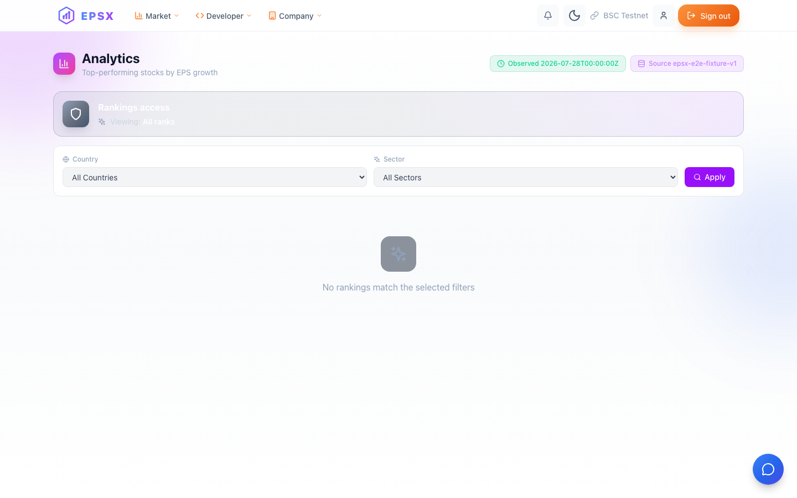](./pr4.frontend.analytics-empty--desktop-light--target.png) | [](./pr4.frontend.analytics-empty--desktop-light--diff.png) | 10.8858% | The target preserves a valid service observation while rendering an explicit empty ranking result. It does not substitute sample rows, a synthetic count, or a frontend-owned freshness label. | pre=PASS, post=PASS |
| `pr4.frontend.analytics-empty` | `mobile-dark` | PASS; 2 clean repeats | [](./pr4.frontend.analytics-empty--mobile-dark--source.png) | [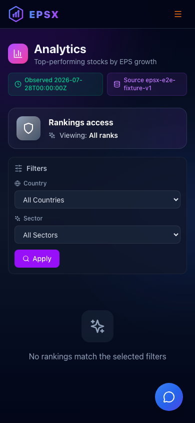](./pr4.frontend.analytics-empty--mobile-dark--target.png) | [](./pr4.frontend.analytics-empty--mobile-dark--diff.png) | 19.7904% | The target preserves a valid service observation while rendering an explicit empty ranking result. It does not substitute sample rows, a synthetic count, or a frontend-owned freshness label. | pre=PASS, post=PASS |
| `pr4.frontend.analytics-limited` | `desktop-light` | PASS; 2 clean repeats | [](./pr4.frontend.analytics-limited--desktop-light--source.png) | [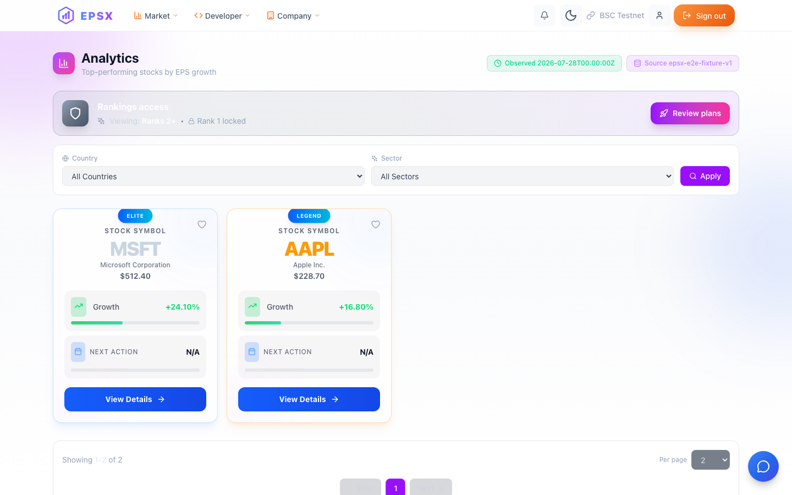](./pr4.frontend.analytics-limited--desktop-light--target.png) | [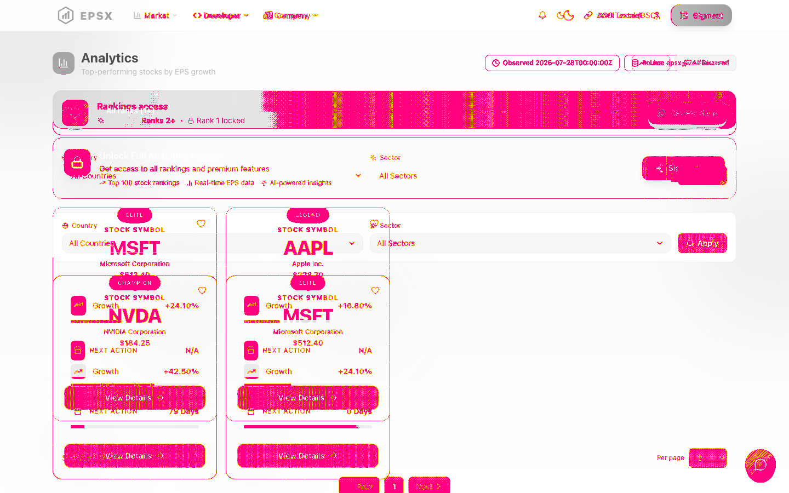](./pr4.frontend.analytics-limited--desktop-light--diff.png) | 12.0592% | The target applies the ranking offset supplied by the Rust service, marks the locked range, and omits rows outside that entitlement. The pinned source composes plan presentation in the frontend and cannot prove the same backend-owned offset. | pre=PASS, post=PASS |
| `pr4.frontend.analytics-limited` | `mobile-dark` | PASS; 2 clean repeats | [](./pr4.frontend.analytics-limited--mobile-dark--source.png) | [](./pr4.frontend.analytics-limited--mobile-dark--target.png) | [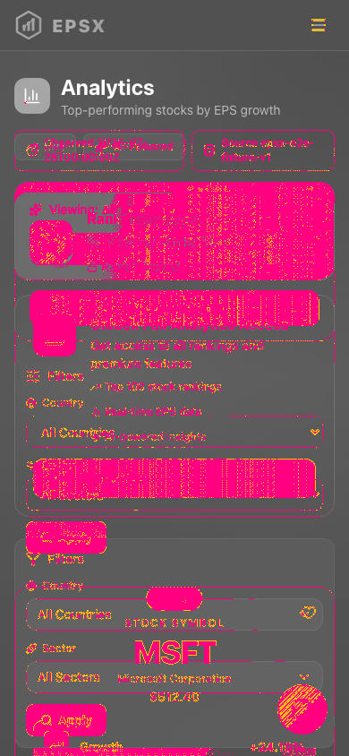](./pr4.frontend.analytics-limited--mobile-dark--diff.png) | 24.3161% | The target applies the ranking offset supplied by the Rust service, marks the locked range, and omits rows outside that entitlement. The pinned source composes plan presentation in the frontend and cannot prove the same backend-owned offset. | pre=PASS, post=PASS |
| `pr4.frontend.analytics-malformed` | `desktop-light` | PASS; 2 clean repeats | [](./pr4.frontend.analytics-malformed--desktop-light--source.png) | [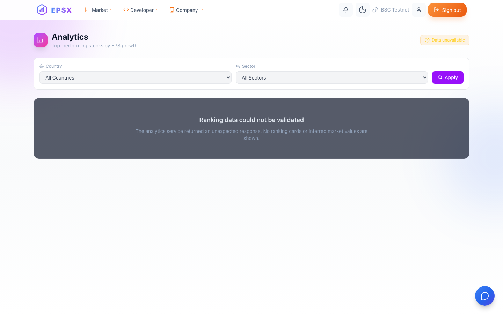](./pr4.frontend.analytics-malformed--desktop-light--target.png) | [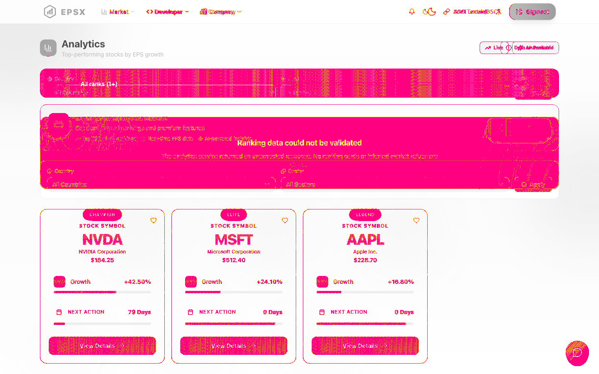](./pr4.frontend.analytics-malformed--desktop-light--diff.png) | 26.6191% | The source receives its healthy comparison baseline while the target response carries malformed freshness evidence. The Rust decoder fails closed, exposes no ranking fields, and does not present the hostile value as an observation time. | pre=PASS, post=PASS |
| `pr4.frontend.analytics-malformed` | `mobile-dark` | PASS; 2 clean repeats | [](./pr4.frontend.analytics-malformed--mobile-dark--source.png) | [](./pr4.frontend.analytics-malformed--mobile-dark--target.png) | [](./pr4.frontend.analytics-malformed--mobile-dark--diff.png) | 19.9201% | The source receives its healthy comparison baseline while the target response carries malformed freshness evidence. The Rust decoder fails closed, exposes no ranking fields, and does not present the hostile value as an observation time. | pre=PASS, post=PASS |
| `pr4.frontend.analytics-query` | `desktop-light` | PASS; 2 clean repeats | [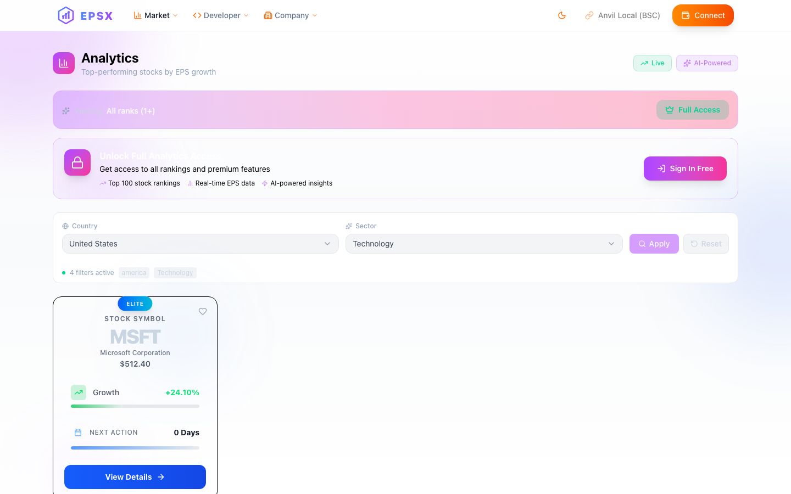](./pr4.frontend.analytics-query--desktop-light--source.png) | [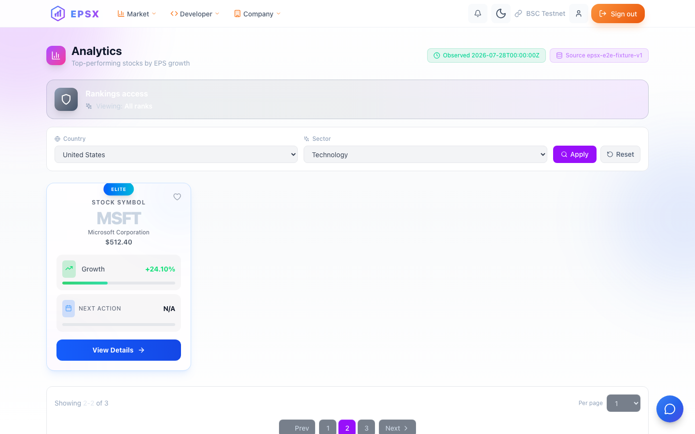](./pr4.frontend.analytics-query--desktop-light--target.png) | [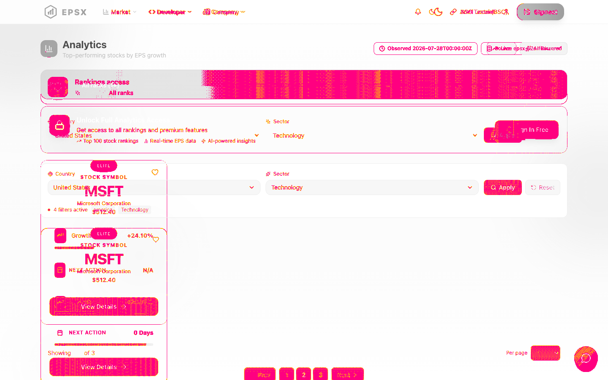](./pr4.frontend.analytics-query--desktop-light--diff.png) | 9.6606% | The target preserves the requested filters and pagination while rendering the service's exact row, total, access, source, and observation-time projection. It removes the pinned source's unconditional Live and AI-Powered badges because neither is established by the response. | pre=PASS, post=PASS |
| `pr4.frontend.analytics-query` | `mobile-dark` | PASS; 2 clean repeats | [](./pr4.frontend.analytics-query--mobile-dark--source.png) | [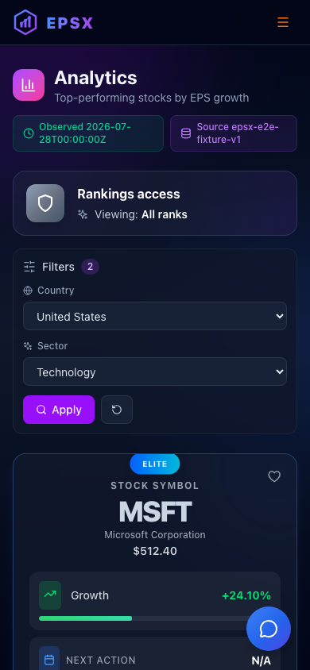](./pr4.frontend.analytics-query--mobile-dark--target.png) | [](./pr4.frontend.analytics-query--mobile-dark--diff.png) | 20.8042% | The target preserves the requested filters and pagination while rendering the service's exact row, total, access, source, and observation-time projection. It removes the pinned source's unconditional Live and AI-Powered badges because neither is established by the response. | pre=PASS, post=PASS |
| `pr4.frontend.analytics-stale` | `desktop-light` | PASS; 2 clean repeats | [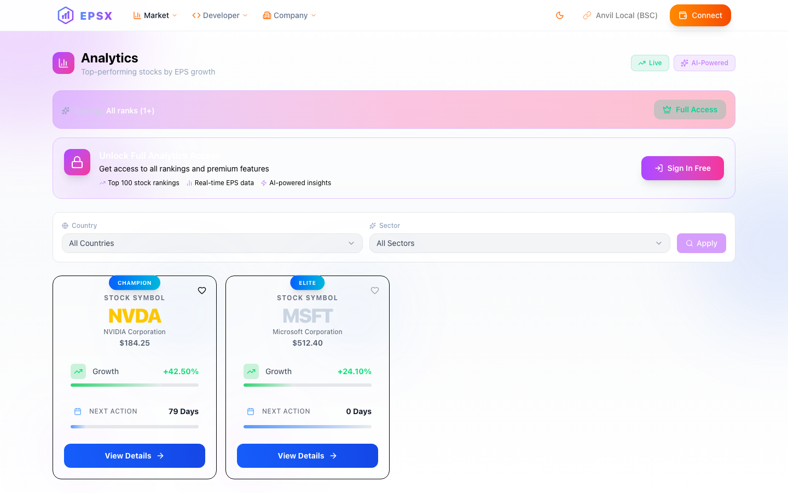](./pr4.frontend.analytics-stale--desktop-light--source.png) | [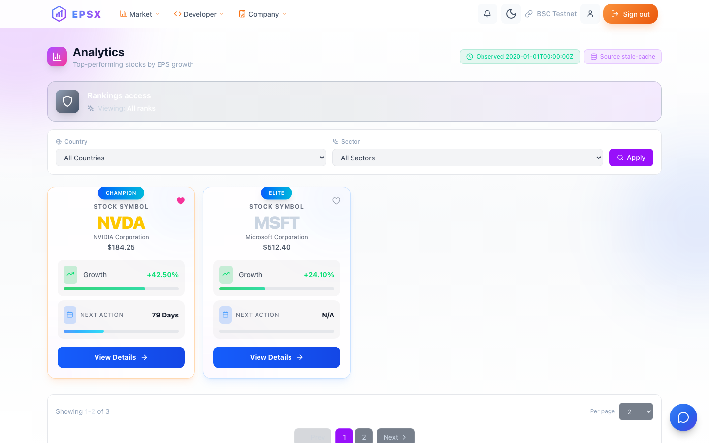](./pr4.frontend.analytics-stale--desktop-light--target.png) | [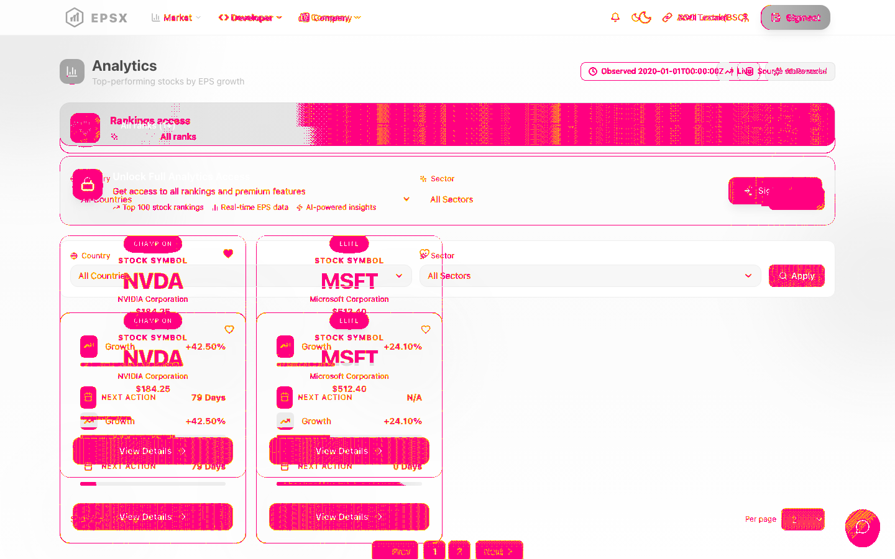](./pr4.frontend.analytics-stale--desktop-light--diff.png) | 12.2451% | The target exposes the service's stale observation time and source verbatim and deliberately omits the pinned source's unconditional Live badge. No browser clock or frontend heuristic upgrades stale data to fresh. | pre=PASS, post=PASS |
| `pr4.frontend.analytics-stale` | `mobile-dark` | PASS; 2 clean repeats | [](./pr4.frontend.analytics-stale--mobile-dark--source.png) | [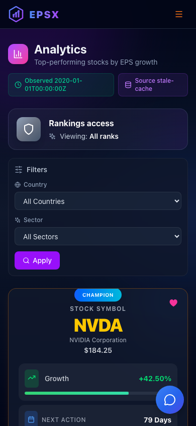](./pr4.frontend.analytics-stale--mobile-dark--target.png) | [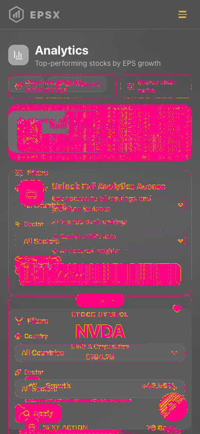](./pr4.frontend.analytics-stale--mobile-dark--diff.png) | 21.6089% | The target exposes the service's stale observation time and source verbatim and deliberately omits the pinned source's unconditional Live badge. No browser clock or frontend heuristic upgrades stale data to fresh. | pre=PASS, post=PASS |
| `pr4.frontend.analytics-unavailable` | `desktop-light` | PASS; 2 clean repeats | [](./pr4.frontend.analytics-unavailable--desktop-light--source.png) | [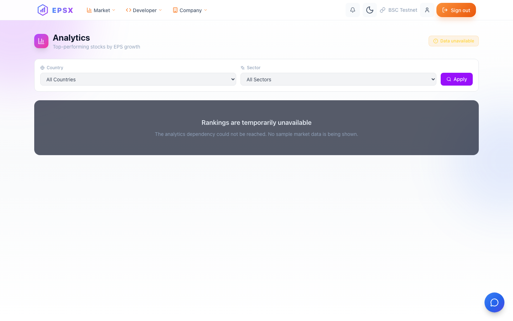](./pr4.frontend.analytics-unavailable--desktop-light--target.png) | [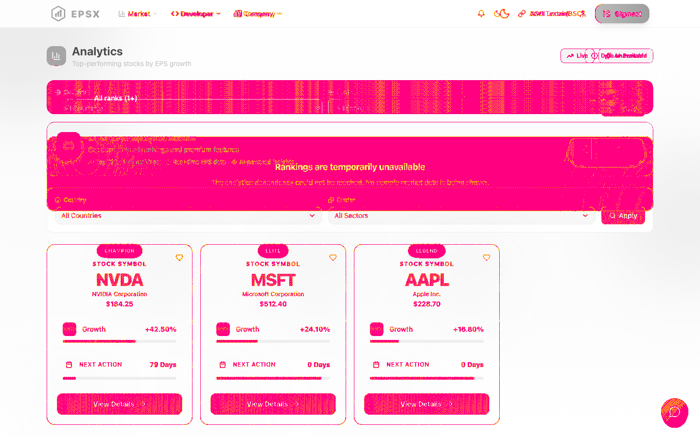](./pr4.frontend.analytics-unavailable--desktop-light--diff.png) | 24.9324% | The source receives its healthy comparison baseline while the target ranking dependency is unavailable. The Rust boundary removes all ranking and freshness claims and renders a retryable unavailable state. | pre=PASS, post=PASS |
| `pr4.frontend.analytics-unavailable` | `mobile-dark` | PASS; 2 clean repeats | [](./pr4.frontend.analytics-unavailable--mobile-dark--source.png) | [](./pr4.frontend.analytics-unavailable--mobile-dark--target.png) | [](./pr4.frontend.analytics-unavailable--mobile-dark--diff.png) | 20.0805% | The source receives its healthy comparison baseline while the target ranking dependency is unavailable. The Rust boundary removes all ranking and freshness claims and renders a retryable unavailable state. | pre=PASS, post=PASS |
| `pr4.frontend.dashboard` | `desktop-light` | PASS; 2 clean repeats | [](./pr4.frontend.dashboard--desktop-light--source.png) | [](./pr4.frontend.dashboard--desktop-light--target.png) | [](./pr4.frontend.dashboard--desktop-light--diff.png) | 3.941% | No owner-scoped dashboard projection was selected for the Rust boundary. The target renders verified session identity and safe navigation but marks analytics, portfolio, and subscription summaries unavailable instead of reconstructing the pinned source's client-owned dashboard claims. | pre=PASS, post=PASS |
| `pr4.frontend.dashboard` | `mobile-dark` | PASS; 2 clean repeats | [](./pr4.frontend.dashboard--mobile-dark--source.png) | [](./pr4.frontend.dashboard--mobile-dark--target.png) | [](./pr4.frontend.dashboard--mobile-dark--diff.png) | 6.6083% | No owner-scoped dashboard projection was selected for the Rust boundary. The target renders verified session identity and safe navigation but marks analytics, portfolio, and subscription summaries unavailable instead of reconstructing the pinned source's client-owned dashboard claims. | pre=PASS, post=PASS |
| `pr4.frontend.home-rankings` | `desktop-light` | PASS; 2 clean repeats | [](./pr4.frontend.home-rankings--desktop-light--source.png) | [](./pr4.frontend.home-rankings--desktop-light--target.png) | [](./pr4.frontend.home-rankings--desktop-light--diff.png) | 8.8315% | The target preview renders only rows accepted by the strict Rust ranking projection and gives empty and unavailable data distinct states. It does not recreate the pinned source's client-composed market metrics or freshness claims. | pre=PASS, post=PASS |
| `pr4.frontend.home-rankings` | `mobile-dark` | PASS; 2 clean repeats | [](./pr4.frontend.home-rankings--mobile-dark--source.png) | [](./pr4.frontend.home-rankings--mobile-dark--target.png) | [](./pr4.frontend.home-rankings--mobile-dark--diff.png) | 20.2828% | The target preview renders only rows accepted by the strict Rust ranking projection and gives empty and unavailable data distinct states. It does not recreate the pinned source's client-composed market metrics or freshness claims. | pre=PASS, post=PASS |
| `pr4.frontend.portfolio` | `desktop-light` | PASS; 2 clean repeats | [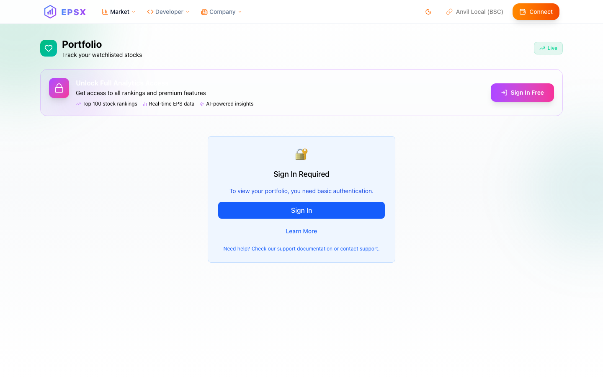](./pr4.frontend.portfolio--desktop-light--source.png) | [](./pr4.frontend.portfolio--desktop-light--target.png) | [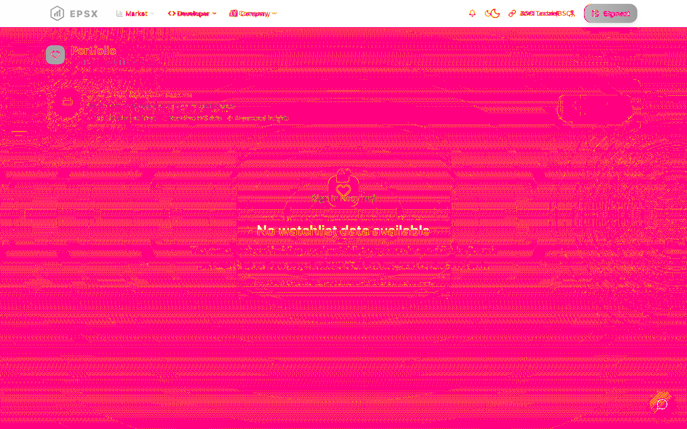](./pr4.frontend.portfolio--desktop-light--diff.png) | 84.039% | No owner-scoped Rust portfolio contract was selected for the migration. The target therefore keeps the authenticated route but removes the pinned source's browser-composed holdings, balances, search, watchlist, and Live claims and reports the capability as unavailable. | pre=PASS, post=PASS |
| `pr4.frontend.portfolio` | `mobile-dark` | PASS; 2 clean repeats | [](./pr4.frontend.portfolio--mobile-dark--source.png) | [](./pr4.frontend.portfolio--mobile-dark--target.png) | [](./pr4.frontend.portfolio--mobile-dark--diff.png) | 12.6021% | No owner-scoped Rust portfolio contract was selected for the migration. The target therefore keeps the authenticated route but removes the pinned source's browser-composed holdings, balances, search, watchlist, and Live claims and reports the capability as unavailable. | pre=PASS, post=PASS |
| `pr5.admin.media-delete` | `desktop-light` | PASS; 2 clean repeats | [](./pr5.admin.media-delete--desktop-light--source.png) | [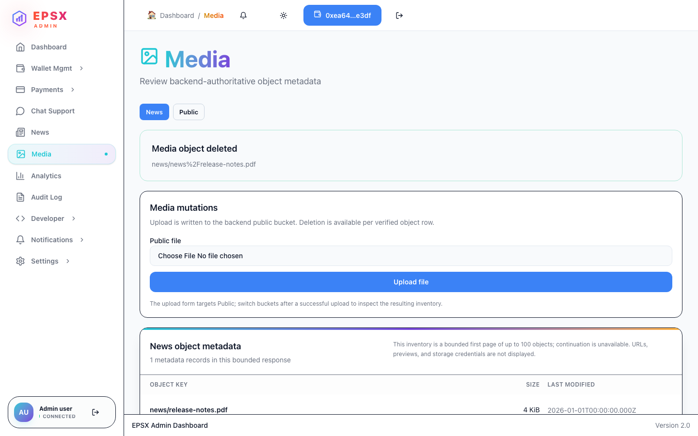](./pr5.admin.media-delete--desktop-light--target.png) | [](./pr5.admin.media-delete--desktop-light--diff.png) | 6.7228% | The target treats deletion as committed only after the Rust adapter accepts the backend acknowledgement, then reconciles against the authoritative bucket without retaining a deleted preview. | pre=PASS, post=PASS |
| `pr5.admin.media-delete` | `mobile-dark` | PASS; 2 clean repeats | [](./pr5.admin.media-delete--mobile-dark--source.png) | [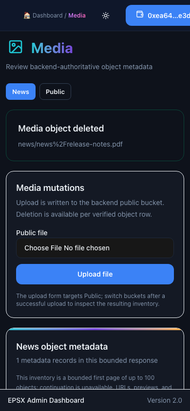](./pr5.admin.media-delete--mobile-dark--target.png) | [](./pr5.admin.media-delete--mobile-dark--diff.png) | 12.7947% | The target treats deletion as committed only after the Rust adapter accepts the backend acknowledgement, then reconciles against the authoritative bucket without retaining a deleted preview. | pre=PASS, post=PASS |
| `pr5.admin.media-empty` | `desktop-light` | PASS; 2 clean repeats | [](./pr5.admin.media-empty--desktop-light--source.png) | [](./pr5.admin.media-empty--desktop-light--target.png) | [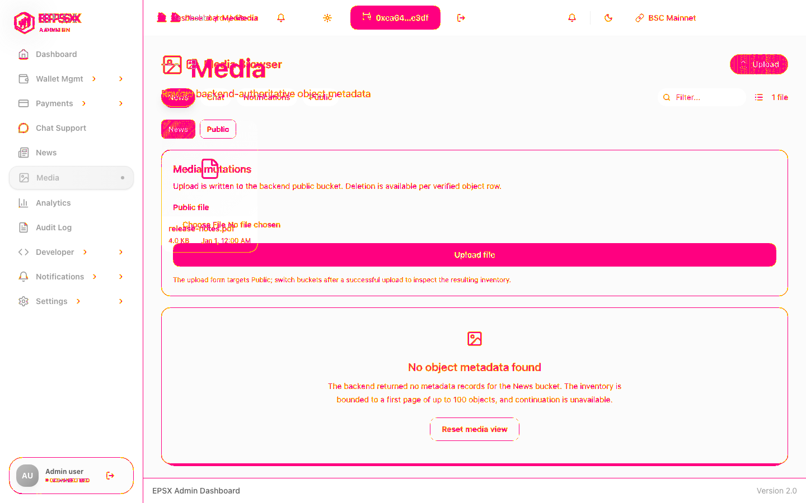](./pr5.admin.media-empty--desktop-light--diff.png) | 6.5098% | The source receives its healthy media baseline while the target service returns an authoritative empty bucket. The target removes all object metadata and does not retain a preview or cached item. | pre=PASS, post=PASS |
| `pr5.admin.media-empty` | `mobile-dark` | PASS; 2 clean repeats | [](./pr5.admin.media-empty--mobile-dark--source.png) | [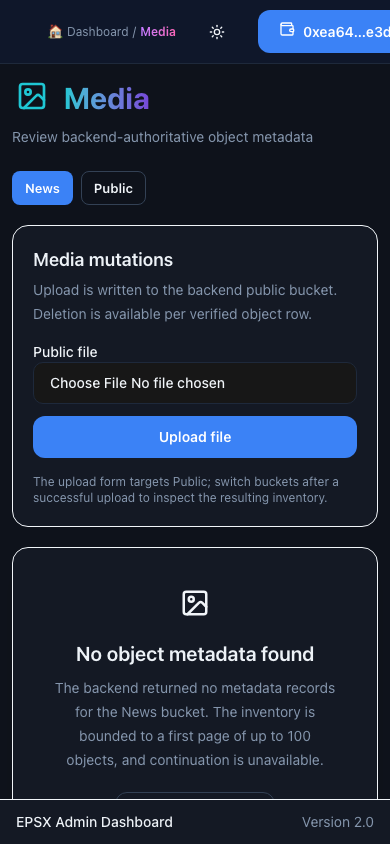](./pr5.admin.media-empty--mobile-dark--target.png) | [](./pr5.admin.media-empty--mobile-dark--diff.png) | 12.2658% | The source receives its healthy media baseline while the target service returns an authoritative empty bucket. The target removes all object metadata and does not retain a preview or cached item. | pre=PASS, post=PASS |
| `pr5.admin.media-forbidden` | `desktop-light` | PASS; 2 clean repeats | [](./pr5.admin.media-forbidden--desktop-light--source.png) | [](./pr5.admin.media-forbidden--desktop-light--target.png) | [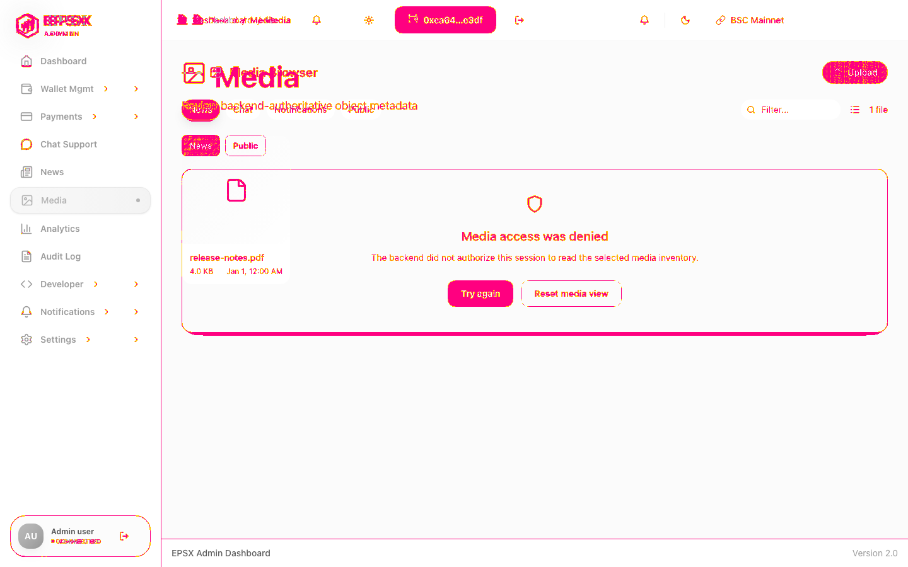](./pr5.admin.media-forbidden--desktop-light--diff.png) | 2.8892% | The source receives its permitted baseline while the target backend denies media access. The Rust BFF exposes no key, URL, size, MIME, modification, upload, or deletion claim. | pre=PASS, post=PASS |
| `pr5.admin.media-forbidden` | `mobile-dark` | PASS; 2 clean repeats | [](./pr5.admin.media-forbidden--mobile-dark--source.png) | [](./pr5.admin.media-forbidden--mobile-dark--target.png) | [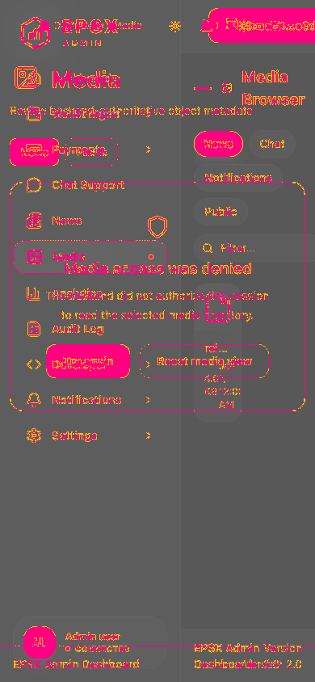](./pr5.admin.media-forbidden--mobile-dark--diff.png) | 8.2288% | The source receives its permitted baseline while the target backend denies media access. The Rust BFF exposes no key, URL, size, MIME, modification, upload, or deletion claim. | pre=PASS, post=PASS |
| `pr5.admin.media-malformed` | `desktop-light` | PASS; 2 clean repeats | [](./pr5.admin.media-malformed--desktop-light--source.png) | [](./pr5.admin.media-malformed--desktop-light--target.png) | [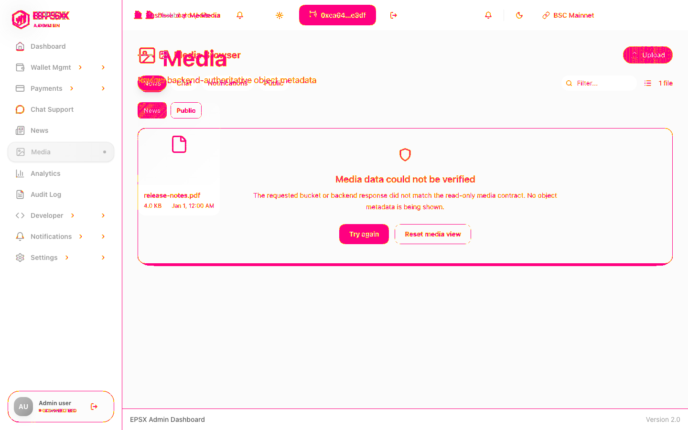](./pr5.admin.media-malformed--desktop-light--diff.png) | 2.9442% | The source receives its healthy baseline while the target media payload violates the strict sorted projection. The Rust decoder fails closed and renders no hostile or partial object metadata. | pre=PASS, post=PASS |
| `pr5.admin.media-malformed` | `mobile-dark` | PASS; 2 clean repeats | [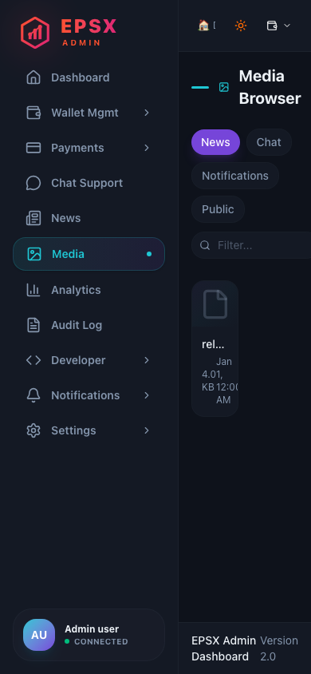](./pr5.admin.media-malformed--mobile-dark--source.png) | [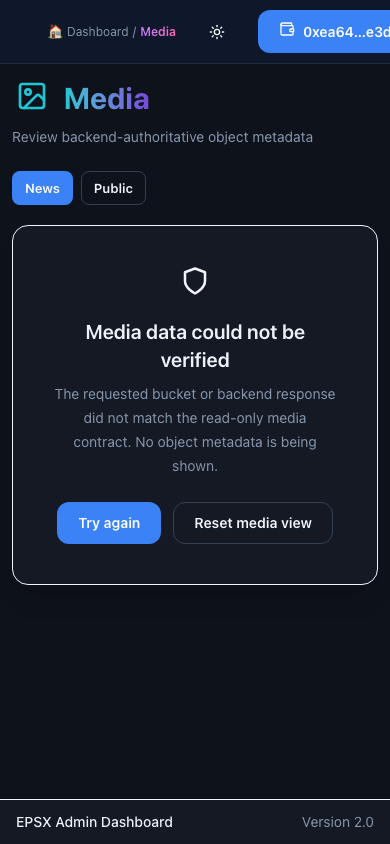](./pr5.admin.media-malformed--mobile-dark--target.png) | [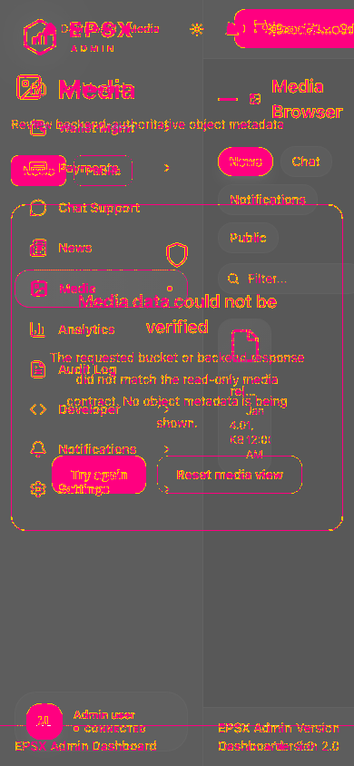](./pr5.admin.media-malformed--mobile-dark--diff.png) | 8.4731% | The source receives its healthy baseline while the target media payload violates the strict sorted projection. The Rust decoder fails closed and renders no hostile or partial object metadata. | pre=PASS, post=PASS |
| `pr5.admin.media-news-ready` | `desktop-light` | PASS; 2 clean repeats | [](./pr5.admin.media-news-ready--desktop-light--source.png) | [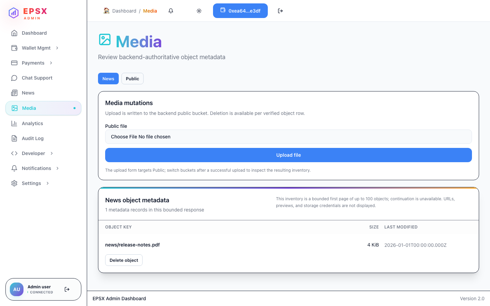](./pr5.admin.media-news-ready--desktop-light--target.png) | [](./pr5.admin.media-news-ready--desktop-light--diff.png) | 6.9998% | The target projects storage URLs and preview capabilities away, rendering only backend-verified news-bucket key, size, MIME, and modification metadata plus bounded BFF actions. | pre=PASS, post=PASS |
| `pr5.admin.media-news-ready` | `mobile-dark` | PASS; 2 clean repeats | [](./pr5.admin.media-news-ready--mobile-dark--source.png) | [](./pr5.admin.media-news-ready--mobile-dark--target.png) | [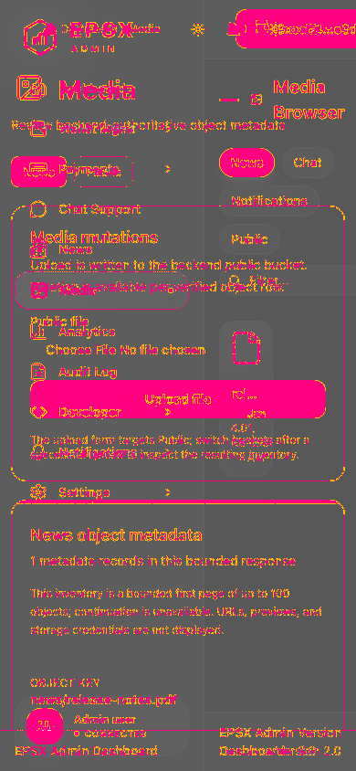](./pr5.admin.media-news-ready--mobile-dark--diff.png) | 12.5793% | The target projects storage URLs and preview capabilities away, rendering only backend-verified news-bucket key, size, MIME, and modification metadata plus bounded BFF actions. | pre=PASS, post=PASS |
| `pr5.admin.media-public-ready` | `desktop-light` | PASS; 2 clean repeats | [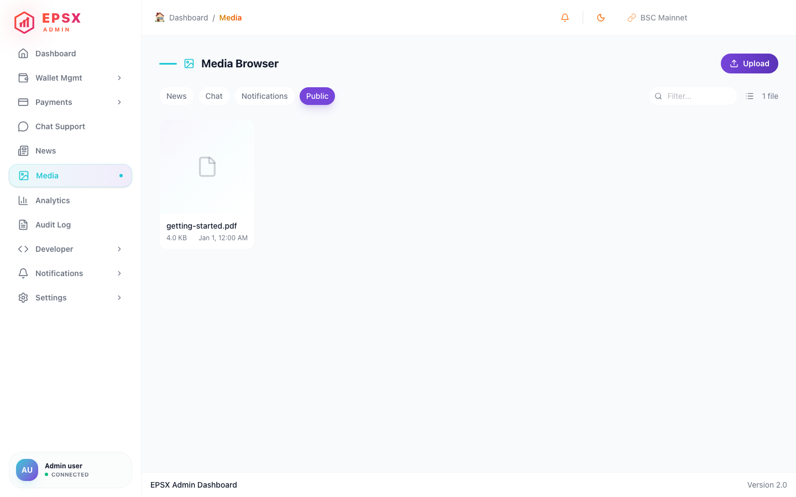](./pr5.admin.media-public-ready--desktop-light--source.png) | [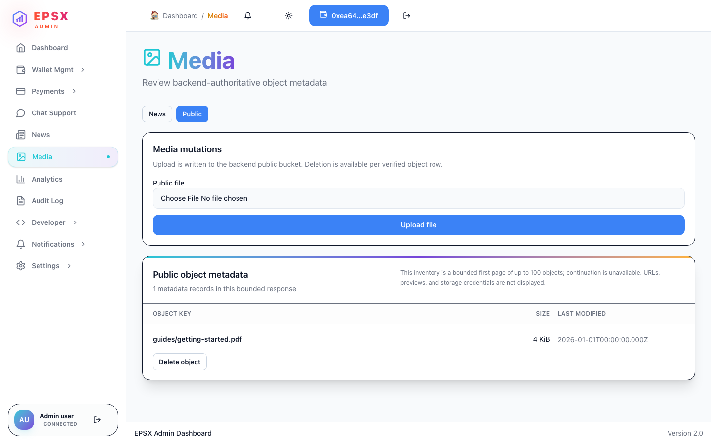](./pr5.admin.media-public-ready--desktop-light--target.png) | [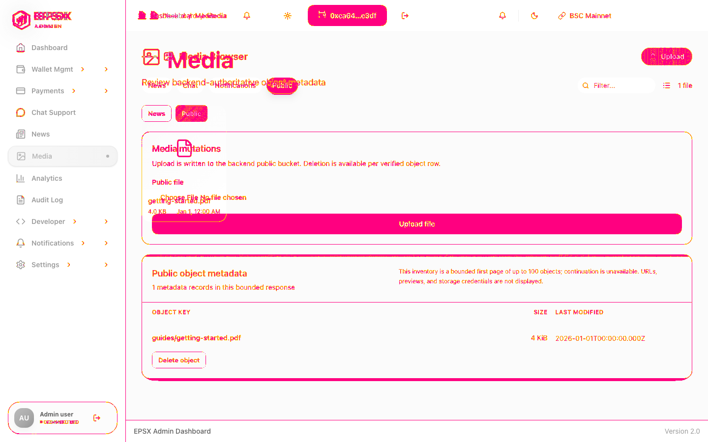](./pr5.admin.media-public-ready--desktop-light--diff.png) | 6.9234% | The target binds the public bucket at the Rust query boundary and renders redacted object metadata without projecting backend URLs, previews, or storage credentials into the browser. | pre=PASS, post=PASS |
| `pr5.admin.media-public-ready` | `mobile-dark` | PASS; 2 clean repeats | [](./pr5.admin.media-public-ready--mobile-dark--source.png) | [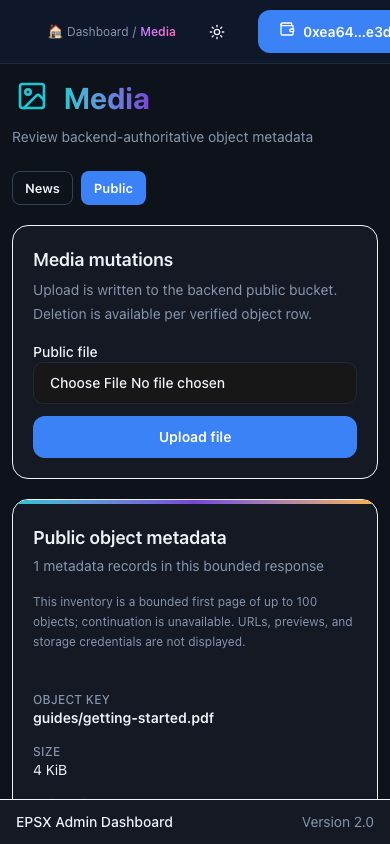](./pr5.admin.media-public-ready--mobile-dark--target.png) | [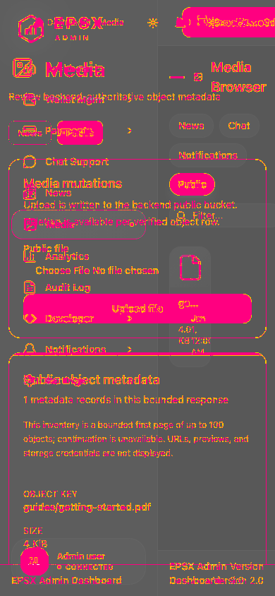](./pr5.admin.media-public-ready--mobile-dark--diff.png) | 12.3341% | The target binds the public bucket at the Rust query boundary and renders redacted object metadata without projecting backend URLs, previews, or storage credentials into the browser. | pre=PASS, post=PASS |
| `pr5.admin.media-unavailable` | `desktop-light` | PASS; 2 clean repeats | [](./pr5.admin.media-unavailable--desktop-light--source.png) | [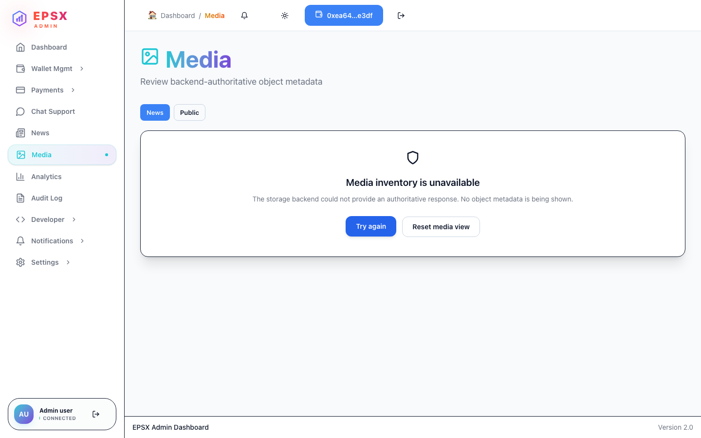](./pr5.admin.media-unavailable--desktop-light--target.png) | [](./pr5.admin.media-unavailable--desktop-light--diff.png) | 2.9231% | The source receives its healthy baseline while the target media dependency remains unavailable after retry. The Rust BFF removes stale object metadata and renders a distinct retry boundary. | pre=PASS, post=PASS |
| `pr5.admin.media-unavailable` | `mobile-dark` | PASS; 2 clean repeats | [](./pr5.admin.media-unavailable--mobile-dark--source.png) | [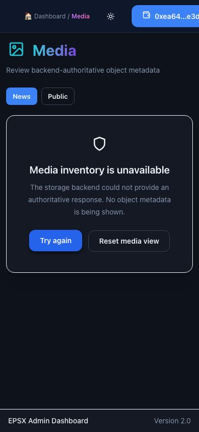](./pr5.admin.media-unavailable--mobile-dark--target.png) | [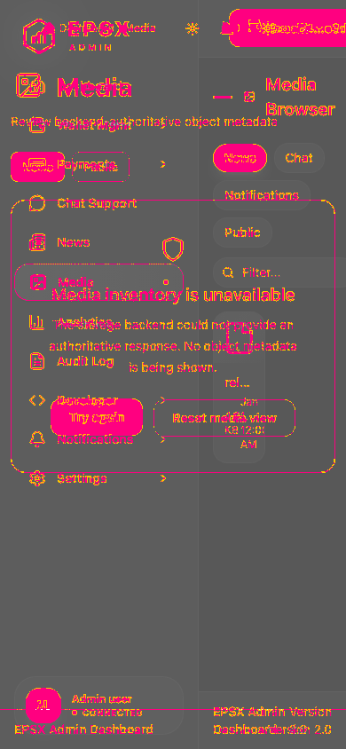](./pr5.admin.media-unavailable--mobile-dark--diff.png) | 8.447% | The source receives its healthy baseline while the target media dependency remains unavailable after retry. The Rust BFF removes stale object metadata and renders a distinct retry boundary. | pre=PASS, post=PASS |
| `pr5.admin.media-upload-conflict` | `desktop-light` | PASS; 2 clean repeats | [](./pr5.admin.media-upload-conflict--desktop-light--source.png) | [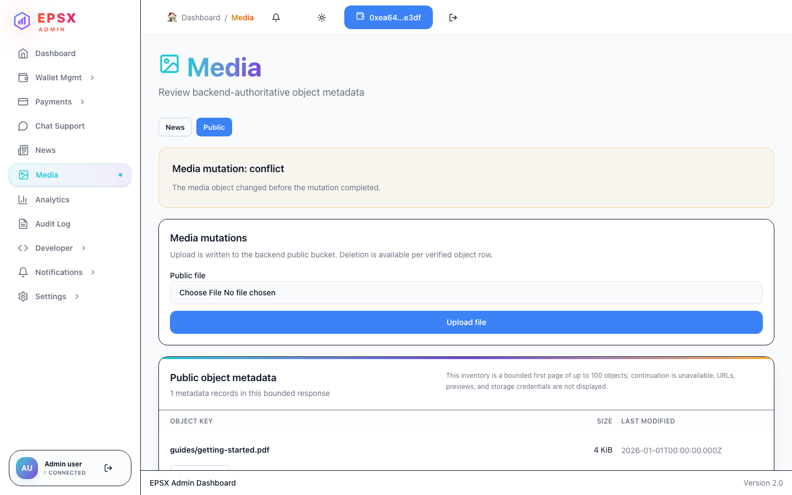](./pr5.admin.media-upload-conflict--desktop-light--target.png) | [](./pr5.admin.media-upload-conflict--desktop-light--diff.png) | 6.6774% | The target preserves the storage service's conflict result and does not claim that duplicate object bytes committed or display a fabricated upload acknowledgement. | pre=PASS, post=PASS |
| `pr5.admin.media-upload-conflict` | `mobile-dark` | PASS; 2 clean repeats | [](./pr5.admin.media-upload-conflict--mobile-dark--source.png) | [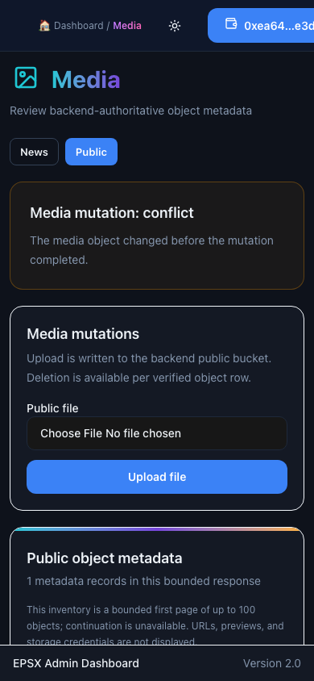](./pr5.admin.media-upload-conflict--mobile-dark--target.png) | [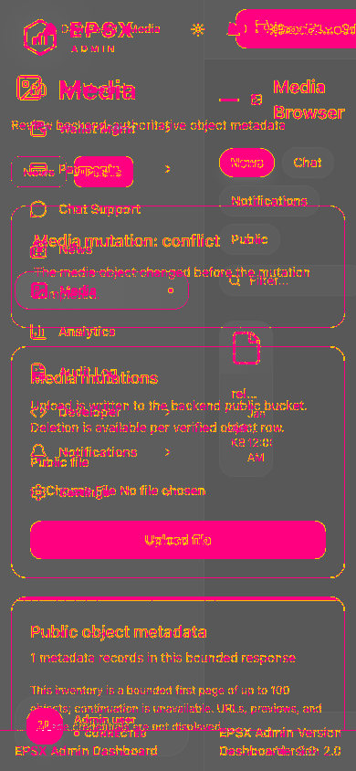](./pr5.admin.media-upload-conflict--mobile-dark--diff.png) | 12.8424% | The target preserves the storage service's conflict result and does not claim that duplicate object bytes committed or display a fabricated upload acknowledgement. | pre=PASS, post=PASS |
| `pr5.admin.media-upload` | `desktop-light` | PASS; 2 clean repeats | [](./pr5.admin.media-upload--desktop-light--source.png) | [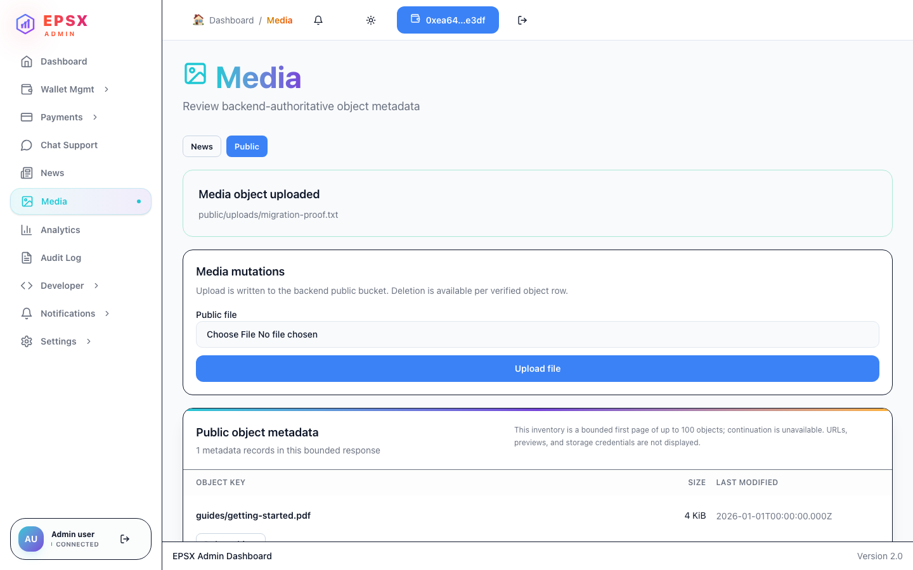](./pr5.admin.media-upload--desktop-light--target.png) | [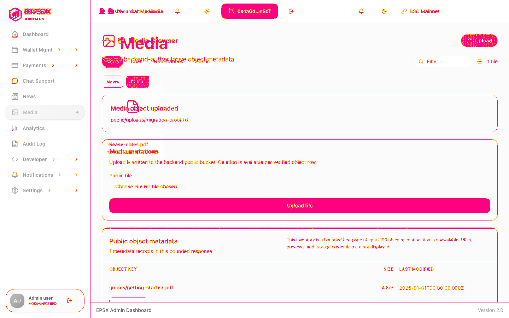](./pr5.admin.media-upload--desktop-light--diff.png) | 6.6557% | The target submits exact multipart bytes through the Rust BFF and renders only the redacted backend acknowledgement; storage URLs and credentials remain absent. | pre=PASS, post=PASS |
| `pr5.admin.media-upload` | `mobile-dark` | PASS; 2 clean repeats | [](./pr5.admin.media-upload--mobile-dark--source.png) | [](./pr5.admin.media-upload--mobile-dark--target.png) | [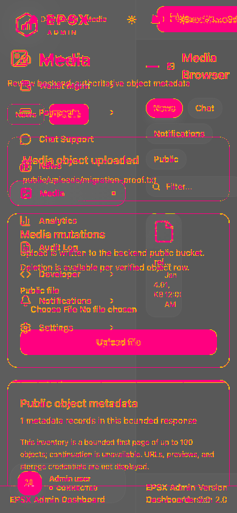](./pr5.admin.media-upload--mobile-dark--diff.png) | 12.6783% | The target submits exact multipart bytes through the Rust BFF and renders only the redacted backend acknowledgement; storage URLs and credentials remain absent. | pre=PASS, post=PASS |
| `pr5.admin.news-conflict` | `desktop-light` | PASS; 2 clean repeats | [](./pr5.admin.news-conflict--desktop-light--source.png) | [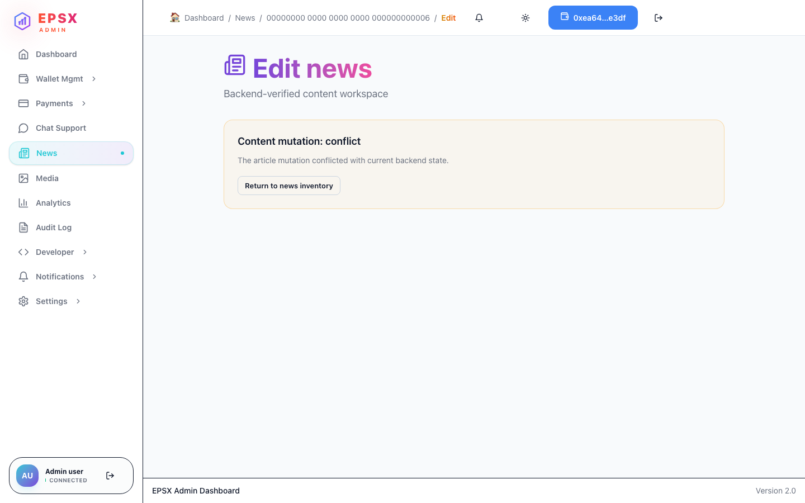](./pr5.admin.news-conflict--desktop-light--target.png) | [](./pr5.admin.news-conflict--desktop-light--diff.png) | 2.4757% | The target preserves the content service's optimistic 409 and replaces the editor with an explicit conflict result rather than presenting stale fields as committed. | pre=PASS, post=PASS |
| `pr5.admin.news-conflict` | `mobile-dark` | PASS; 2 clean repeats | [](./pr5.admin.news-conflict--mobile-dark--source.png) | [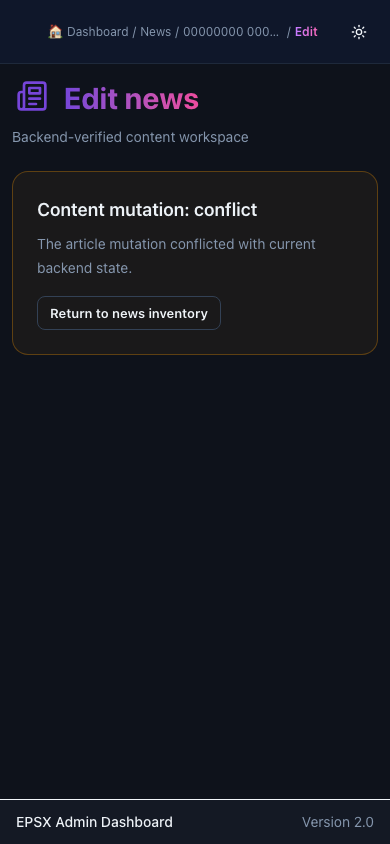](./pr5.admin.news-conflict--mobile-dark--target.png) | [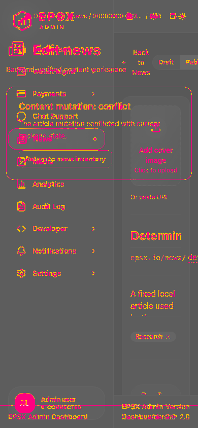](./pr5.admin.news-conflict--mobile-dark--diff.png) | 4.5713% | The target preserves the content service's optimistic 409 and replaces the editor with an explicit conflict result rather than presenting stale fields as committed. | pre=PASS, post=PASS |
| `pr5.admin.news-create-form` | `desktop-light` | PASS; 2 clean repeats | [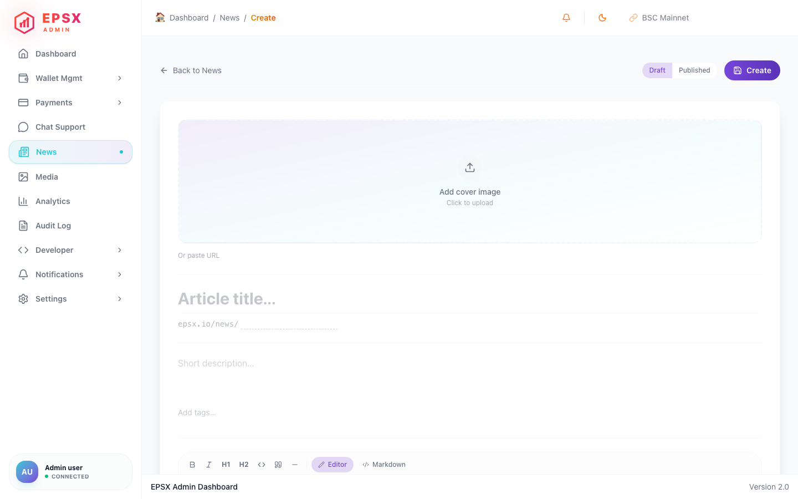](./pr5.admin.news-create-form--desktop-light--source.png) | [](./pr5.admin.news-create-form--desktop-light--target.png) | [](./pr5.admin.news-create-form--desktop-light--diff.png) | 2.4214% | The target replaces the source's client-owned rich editor with a bounded server form whose accepted fields, idempotency key, and publication status are validated by the Rust BFF. | pre=PASS, post=PASS |
| `pr5.admin.news-create-form` | `mobile-dark` | PASS; 2 clean repeats | [](./pr5.admin.news-create-form--mobile-dark--source.png) | [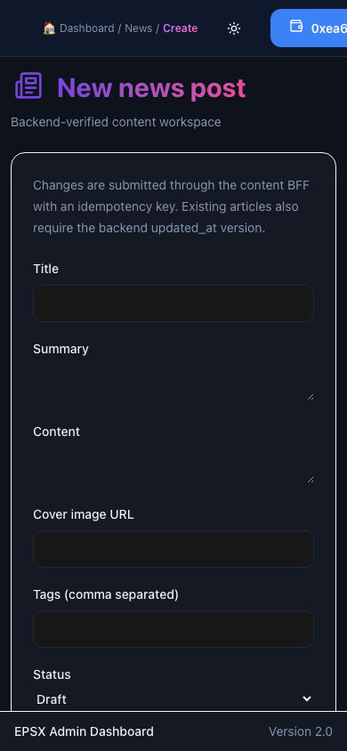](./pr5.admin.news-create-form--mobile-dark--target.png) | [](./pr5.admin.news-create-form--mobile-dark--diff.png) | 6.0697% | The target replaces the source's client-owned rich editor with a bounded server form whose accepted fields, idempotency key, and publication status are validated by the Rust BFF. | pre=PASS, post=PASS |
| `pr5.admin.news-create-submit` | `desktop-light` | PASS; 2 clean repeats | [](./pr5.admin.news-create-submit--desktop-light--source.png) | [](./pr5.admin.news-create-submit--desktop-light--target.png) | [](./pr5.admin.news-create-submit--desktop-light--diff.png) | 2.5762% | The target treats creation as committed only after the Rust adapter accepts the strict response and then renders the returned canonical editor projection; the browser does not synthesize a draft or revision. | pre=PASS, post=PASS |
| `pr5.admin.news-create-submit` | `mobile-dark` | PASS; 2 clean repeats | [](./pr5.admin.news-create-submit--mobile-dark--source.png) | [](./pr5.admin.news-create-submit--mobile-dark--target.png) | [](./pr5.admin.news-create-submit--mobile-dark--diff.png) | 5.8816% | The target treats creation as committed only after the Rust adapter accepts the strict response and then renders the returned canonical editor projection; the browser does not synthesize a draft or revision. | pre=PASS, post=PASS |
| `pr5.admin.news-delete` | `desktop-light` | PASS; 2 clean repeats | [](./pr5.admin.news-delete--desktop-light--source.png) | [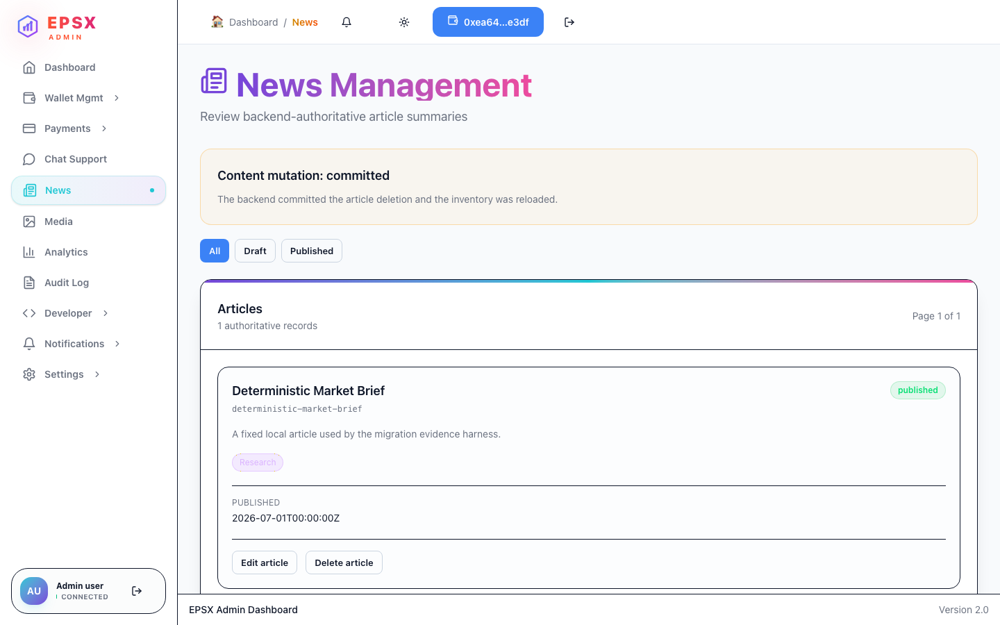](./pr5.admin.news-delete--desktop-light--target.png) | [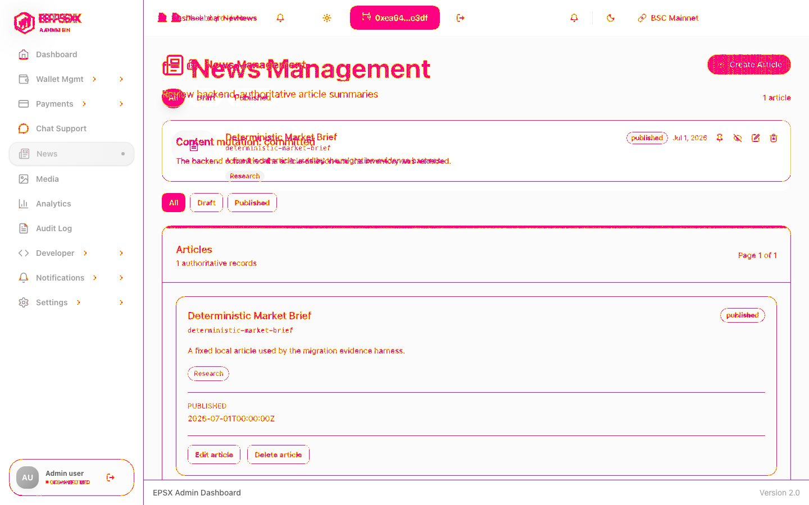](./pr5.admin.news-delete--desktop-light--diff.png) | 3.683% | The target renders deletion as committed only after the versioned Rust mutation succeeds, then reloads the backend inventory and displays the bounded audit-facing result. | pre=PASS, post=PASS |
| `pr5.admin.news-delete` | `mobile-dark` | PASS; 2 clean repeats | [](./pr5.admin.news-delete--mobile-dark--source.png) | [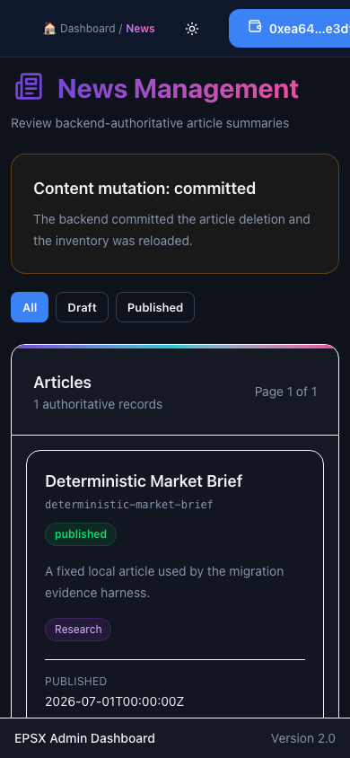](./pr5.admin.news-delete--mobile-dark--target.png) | [](./pr5.admin.news-delete--mobile-dark--diff.png) | 8.848% | The target renders deletion as committed only after the versioned Rust mutation succeeds, then reloads the backend inventory and displays the bounded audit-facing result. | pre=PASS, post=PASS |
| `pr5.admin.news-draft-filter` | `desktop-light` | PASS; 2 clean repeats | [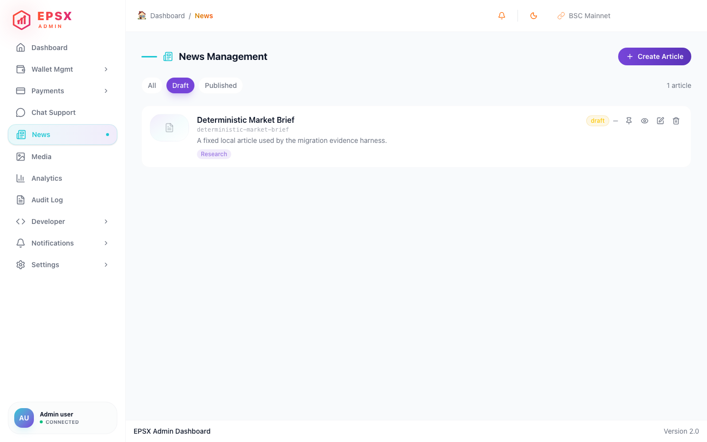](./pr5.admin.news-draft-filter--desktop-light--source.png) | [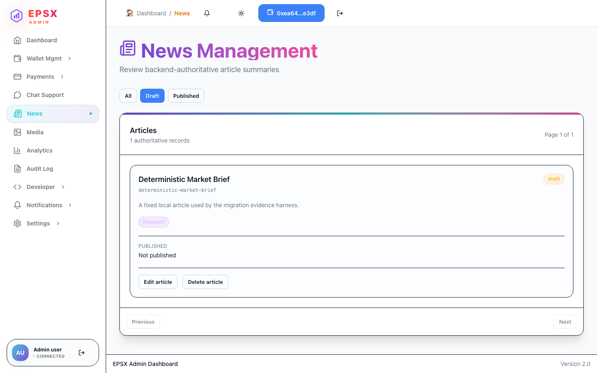](./pr5.admin.news-draft-filter--desktop-light--target.png) | [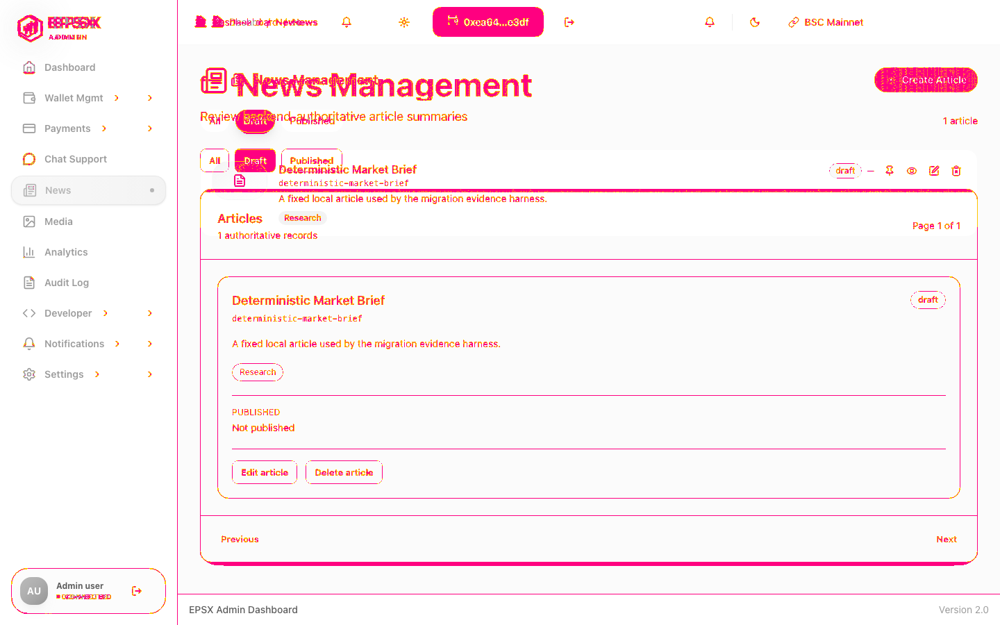](./pr5.admin.news-draft-filter--desktop-light--diff.png) | 4.0046% | The target preserves the backend-owned draft filter and displays the exact strict projection without deriving publication or pin state in the browser. | pre=PASS, post=PASS |
| `pr5.admin.news-draft-filter` | `mobile-dark` | PASS; 2 clean repeats | [](./pr5.admin.news-draft-filter--mobile-dark--source.png) | [](./pr5.admin.news-draft-filter--mobile-dark--target.png) | [](./pr5.admin.news-draft-filter--mobile-dark--diff.png) | 8.8939% | The target preserves the backend-owned draft filter and displays the exact strict projection without deriving publication or pin state in the browser. | pre=PASS, post=PASS |
| `pr5.admin.news-edit-ready` | `desktop-light` | PASS; 2 clean repeats | [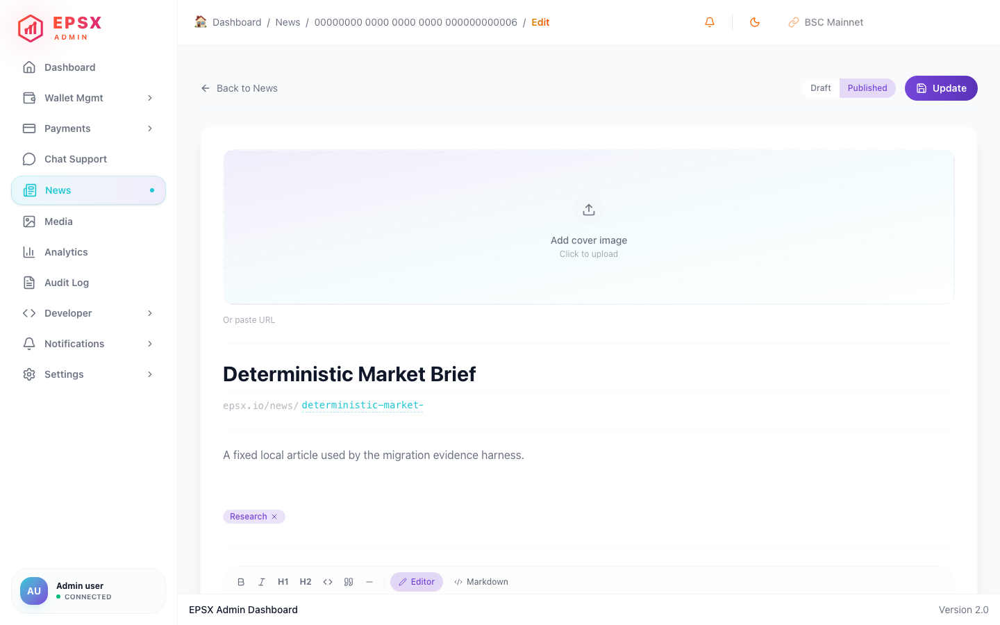](./pr5.admin.news-edit-ready--desktop-light--source.png) | [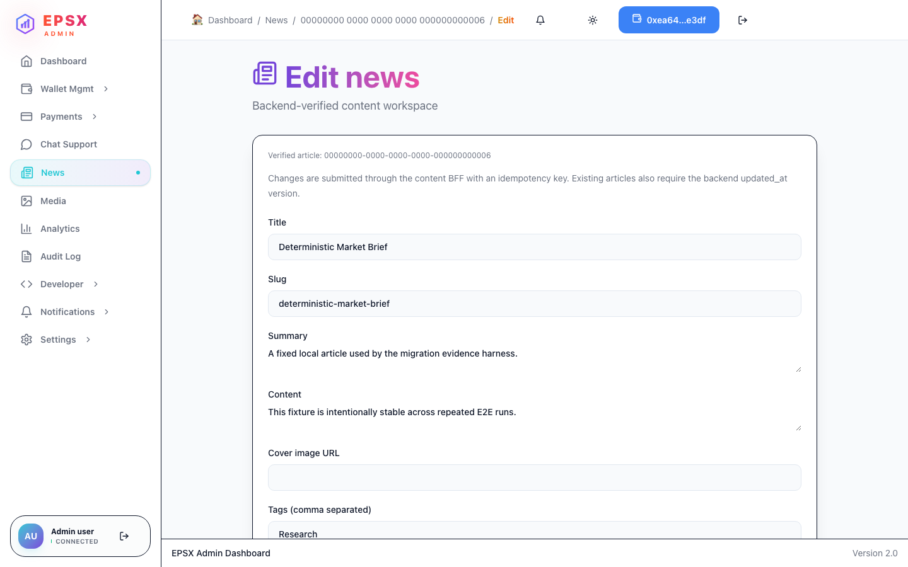](./pr5.admin.news-edit-ready--desktop-light--target.png) | [](./pr5.admin.news-edit-ready--desktop-light--diff.png) | 2.8497% | The target removes the source's browser-only rich-text and local image-editor behaviors and retains a bounded server form populated only from the canonical article and revision returned by the Rust content adapter. | pre=PASS, post=PASS |
| `pr5.admin.news-edit-ready` | `mobile-dark` | PASS; 2 clean repeats | [](./pr5.admin.news-edit-ready--mobile-dark--source.png) | [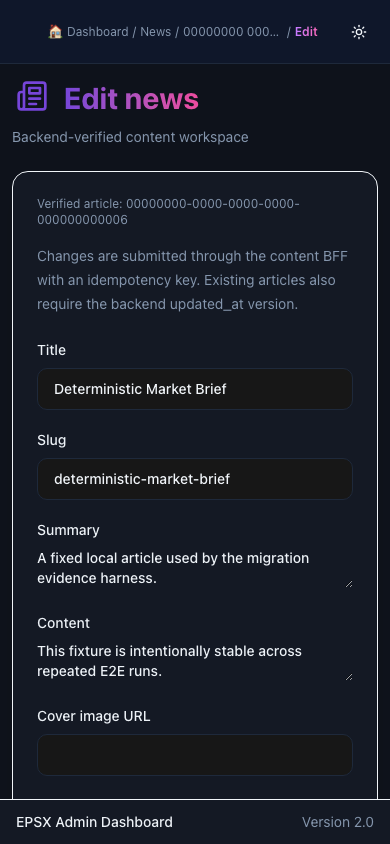](./pr5.admin.news-edit-ready--mobile-dark--target.png) | [](./pr5.admin.news-edit-ready--mobile-dark--diff.png) | 5.9624% | The target removes the source's browser-only rich-text and local image-editor behaviors and retains a bounded server form populated only from the canonical article and revision returned by the Rust content adapter. | pre=PASS, post=PASS |
| `pr5.admin.news-empty` | `desktop-light` | PASS; 2 clean repeats | [](./pr5.admin.news-empty--desktop-light--source.png) | [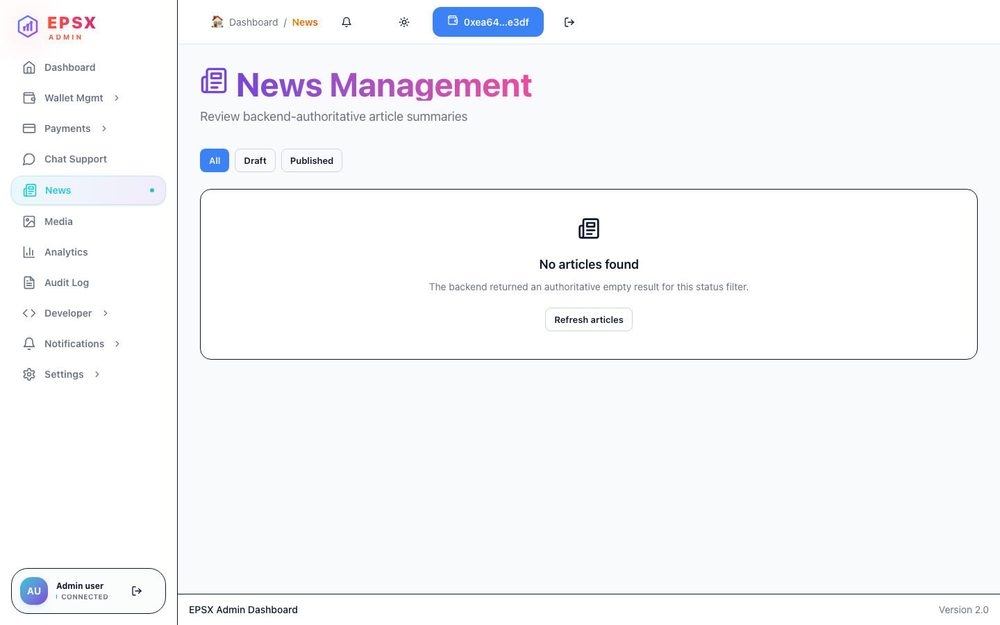](./pr5.admin.news-empty--desktop-light--target.png) | [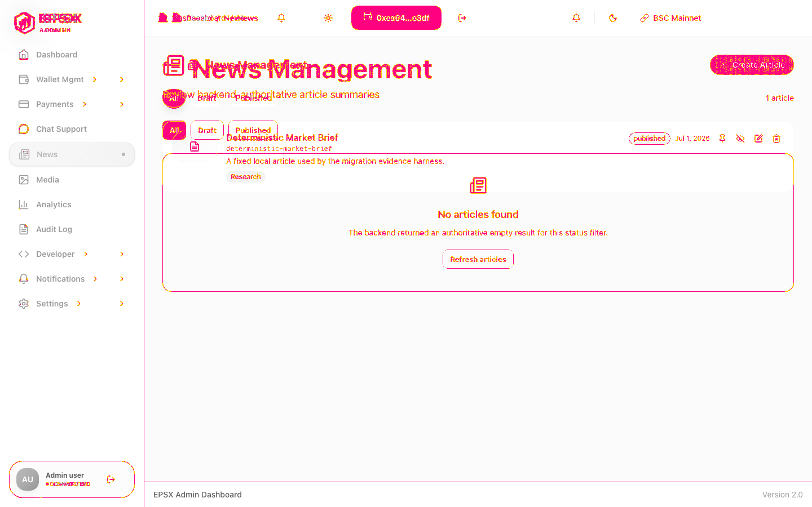](./pr5.admin.news-empty--desktop-light--diff.png) | 2.5336% | The source receives its healthy inventory baseline while the target content service returns a structurally valid zero-record page. The target renders authoritative empty data and does not retain an article row from the prior state. | pre=PASS, post=PASS |
| `pr5.admin.news-empty` | `mobile-dark` | PASS; 2 clean repeats | [](./pr5.admin.news-empty--mobile-dark--source.png) | [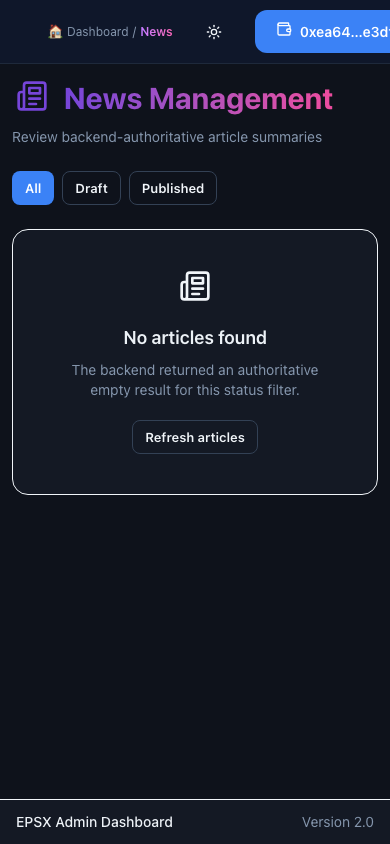](./pr5.admin.news-empty--mobile-dark--target.png) | [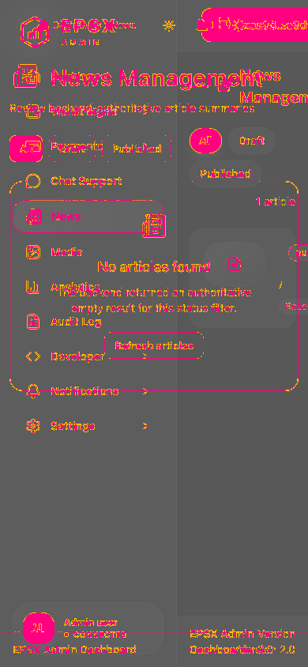](./pr5.admin.news-empty--mobile-dark--diff.png) | 6.9562% | The source receives its healthy inventory baseline while the target content service returns a structurally valid zero-record page. The target renders authoritative empty data and does not retain an article row from the prior state. | pre=PASS, post=PASS |
| `pr5.admin.news-forbidden` | `desktop-light` | PASS; 2 clean repeats | [](./pr5.admin.news-forbidden--desktop-light--source.png) | [](./pr5.admin.news-forbidden--desktop-light--target.png) | [](./pr5.admin.news-forbidden--desktop-light--diff.png) | 2.5155% | The source receives its permitted baseline while the target backend denies content access. The Rust BFF removes all article and mutation fields and renders a denial distinct from empty or unavailable data. | pre=PASS, post=PASS |
| `pr5.admin.news-forbidden` | `mobile-dark` | PASS; 2 clean repeats | [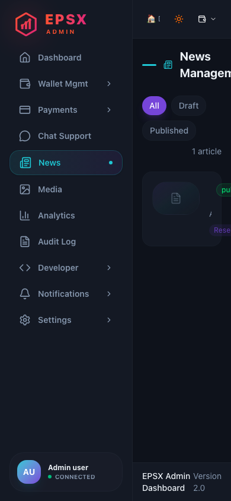](./pr5.admin.news-forbidden--mobile-dark--source.png) | [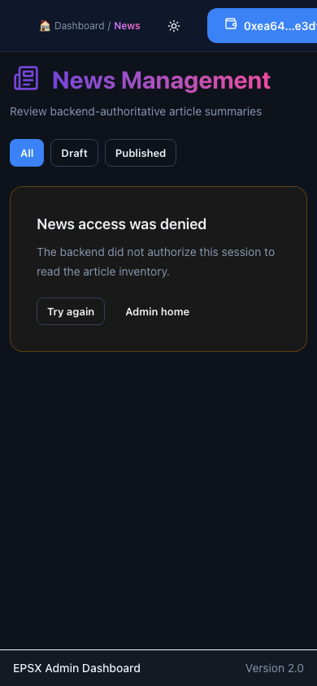](./pr5.admin.news-forbidden--mobile-dark--target.png) | [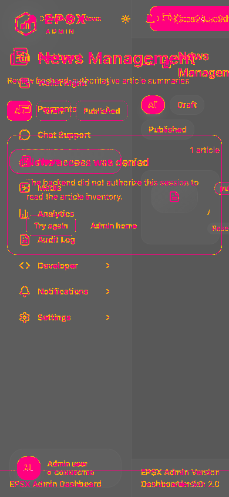](./pr5.admin.news-forbidden--mobile-dark--diff.png) | 6.9346% | The source receives its permitted baseline while the target backend denies content access. The Rust BFF removes all article and mutation fields and renders a denial distinct from empty or unavailable data. | pre=PASS, post=PASS |
| `pr5.admin.news-image-upload` | `desktop-light` | PASS; 2 clean repeats | [](./pr5.admin.news-image-upload--desktop-light--source.png) | [](./pr5.admin.news-image-upload--desktop-light--target.png) | [](./pr5.admin.news-image-upload--desktop-light--diff.png) | 3.1954% | The target accepts exact multipart bytes at the Rust boundary, validates the returned HTTPS URL, and renders a committed upload notice without exposing storage credentials or claiming that the article itself was saved. | pre=PASS, post=PASS |
| `pr5.admin.news-image-upload` | `mobile-dark` | PASS; 2 clean repeats | [](./pr5.admin.news-image-upload--mobile-dark--source.png) | [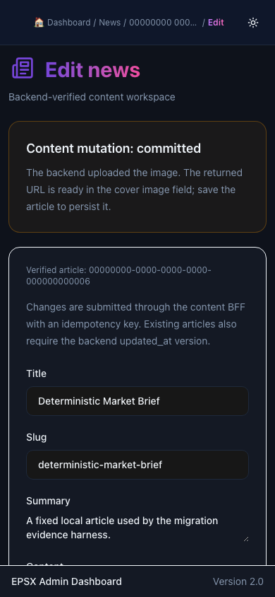](./pr5.admin.news-image-upload--mobile-dark--target.png) | [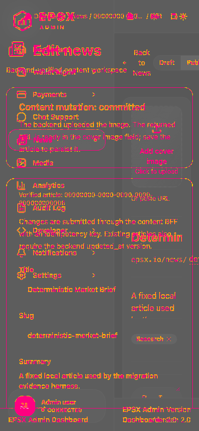](./pr5.admin.news-image-upload--mobile-dark--diff.png) | 6.3996% | The target accepts exact multipart bytes at the Rust boundary, validates the returned HTTPS URL, and renders a committed upload notice without exposing storage credentials or claiming that the article itself was saved. | pre=PASS, post=PASS |
| `pr5.admin.news-malformed` | `desktop-light` | PASS; 2 clean repeats | [](./pr5.admin.news-malformed--desktop-light--source.png) | [](./pr5.admin.news-malformed--desktop-light--target.png) | [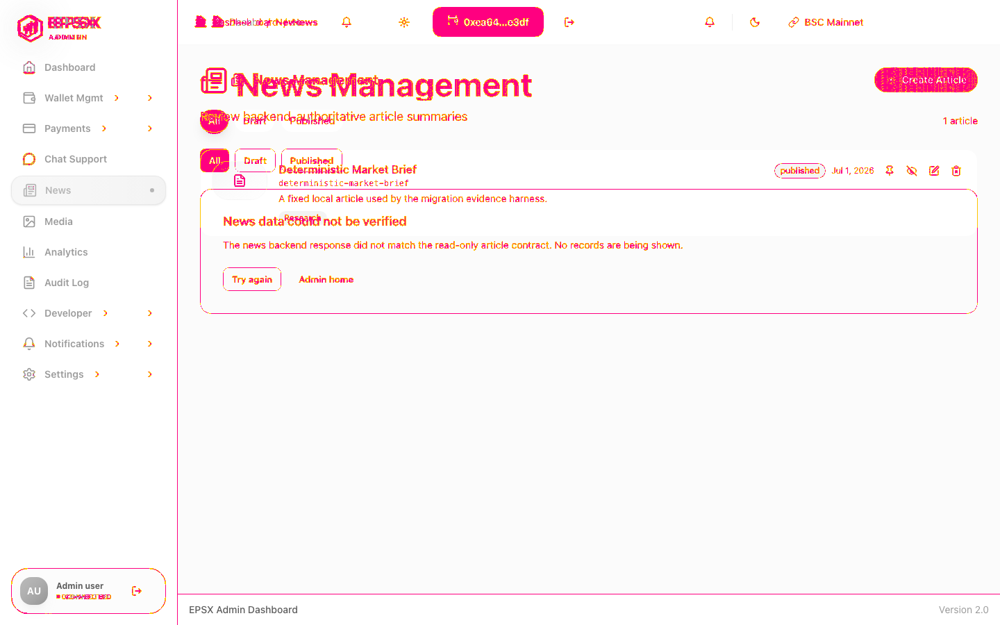](./pr5.admin.news-malformed--desktop-light--diff.png) | 2.5565% | The source receives its healthy baseline while the target content payload violates the closed admin envelope. The Rust adapter rejects the response and renders no article, revision, or publication claims. | pre=PASS, post=PASS |
| `pr5.admin.news-malformed` | `mobile-dark` | PASS; 2 clean repeats | [](./pr5.admin.news-malformed--mobile-dark--source.png) | [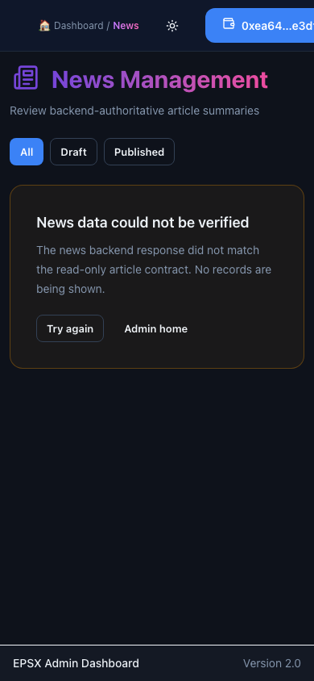](./pr5.admin.news-malformed--mobile-dark--target.png) | [](./pr5.admin.news-malformed--mobile-dark--diff.png) | 7.1403% | The source receives its healthy baseline while the target content payload violates the closed admin envelope. The Rust adapter rejects the response and renders no article, revision, or publication claims. | pre=PASS, post=PASS |
| `pr5.admin.news-publish` | `desktop-light` | PASS; 2 clean repeats | [](./pr5.admin.news-publish--desktop-light--source.png) | [](./pr5.admin.news-publish--desktop-light--target.png) | [](./pr5.admin.news-publish--desktop-light--diff.png) | 2.8497% | The target preserves publication as a versioned Rust content mutation and renders only the returned article projection after the service commits the transition. | pre=PASS, post=PASS |
| `pr5.admin.news-publish` | `mobile-dark` | PASS; 2 clean repeats | [](./pr5.admin.news-publish--mobile-dark--source.png) | [](./pr5.admin.news-publish--mobile-dark--target.png) | [](./pr5.admin.news-publish--mobile-dark--diff.png) | 5.9624% | The target preserves publication as a versioned Rust content mutation and renders only the returned article projection after the service commits the transition. | pre=PASS, post=PASS |
| `pr5.admin.news-ready` | `desktop-light` | PASS; 2 clean repeats | [](./pr5.admin.news-ready--desktop-light--source.png) | [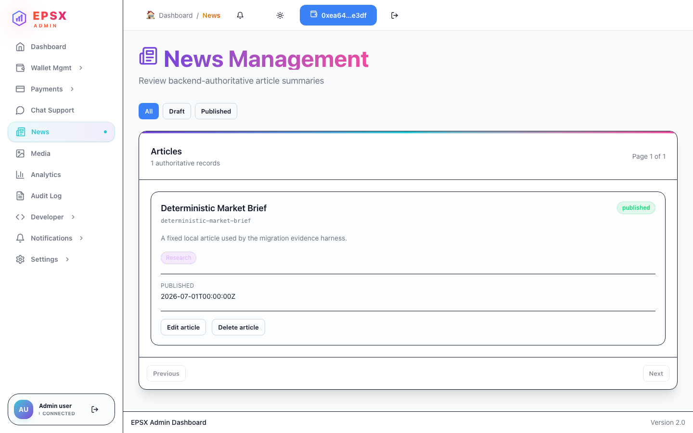](./pr5.admin.news-ready--desktop-light--target.png) | [](./pr5.admin.news-ready--desktop-light--diff.png) | 3.978% | The target inventory renders only the bounded article summary accepted by the Rust content adapter and replaces legacy client mutation affordances with links and controls backed by explicit BFF routes. | pre=PASS, post=PASS |
| `pr5.admin.news-ready` | `mobile-dark` | PASS; 2 clean repeats | [](./pr5.admin.news-ready--mobile-dark--source.png) | [](./pr5.admin.news-ready--mobile-dark--target.png) | [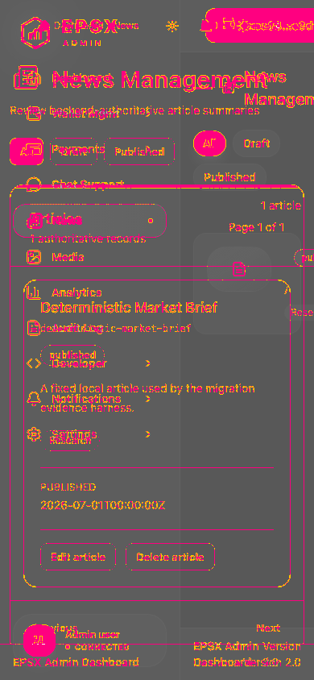](./pr5.admin.news-ready--mobile-dark--diff.png) | 8.6882% | The target inventory renders only the bounded article summary accepted by the Rust content adapter and replaces legacy client mutation affordances with links and controls backed by explicit BFF routes. | pre=PASS, post=PASS |
| `pr5.admin.news-unavailable` | `desktop-light` | PASS; 2 clean repeats | [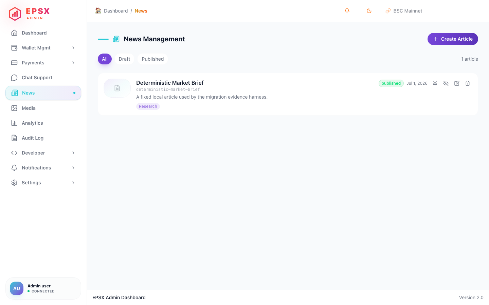](./pr5.admin.news-unavailable--desktop-light--source.png) | [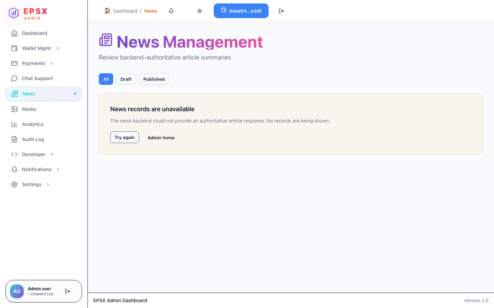](./pr5.admin.news-unavailable--desktop-light--target.png) | [](./pr5.admin.news-unavailable--desktop-light--diff.png) | 2.5556% | The source receives its healthy baseline while the target content dependency remains unavailable after retry. The target exposes no stale inventory or mutation authority and preserves an explicit retryable state. | pre=PASS, post=PASS |
| `pr5.admin.news-unavailable` | `mobile-dark` | PASS; 2 clean repeats | [](./pr5.admin.news-unavailable--mobile-dark--source.png) | [](./pr5.admin.news-unavailable--mobile-dark--target.png) | [](./pr5.admin.news-unavailable--mobile-dark--diff.png) | 7.1245% | The source receives its healthy baseline while the target content dependency remains unavailable after retry. The target exposes no stale inventory or mutation authority and preserves an explicit retryable state. | pre=PASS, post=PASS |
| `pr5.admin.news-unpublish` | `desktop-light` | PASS; 2 clean repeats | [](./pr5.admin.news-unpublish--desktop-light--source.png) | [](./pr5.admin.news-unpublish--desktop-light--target.png) | [](./pr5.admin.news-unpublish--desktop-light--diff.png) | 2.8497% | The target preserves unpublication as a versioned Rust content mutation and renders only the returned draft projection after the service commits the transition. | pre=PASS, post=PASS |
| `pr5.admin.news-unpublish` | `mobile-dark` | PASS; 2 clean repeats | [](./pr5.admin.news-unpublish--mobile-dark--source.png) | [](./pr5.admin.news-unpublish--mobile-dark--target.png) | [](./pr5.admin.news-unpublish--mobile-dark--diff.png) | 5.9624% | The target preserves unpublication as a versioned Rust content mutation and renders only the returned draft projection after the service commits the transition. | pre=PASS, post=PASS |
| `pr5.admin.news-update` | `desktop-light` | PASS; 2 clean repeats | [](./pr5.admin.news-update--desktop-light--source.png) | [](./pr5.admin.news-update--desktop-light--target.png) | [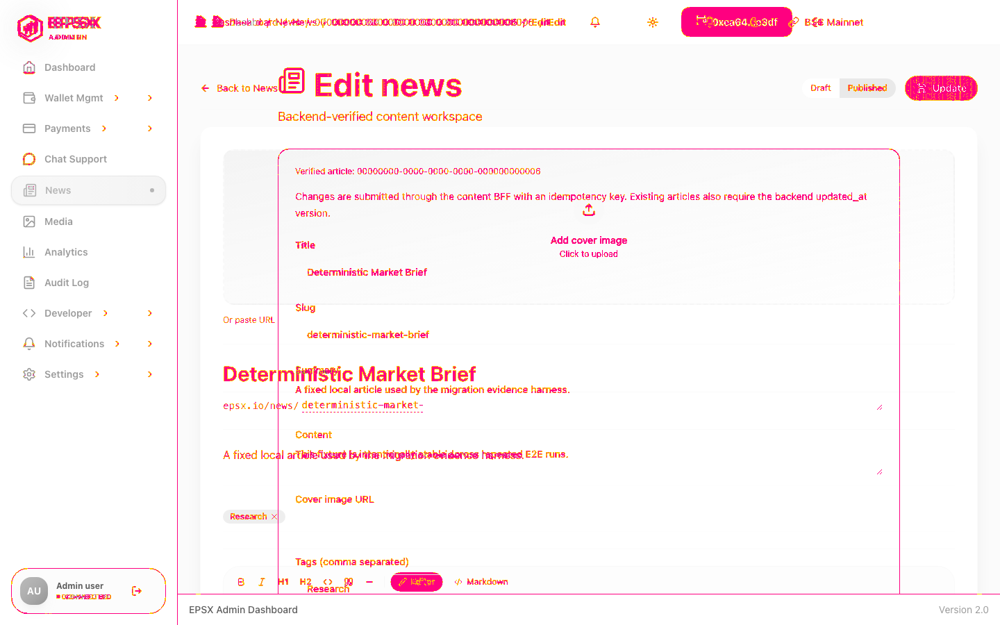](./pr5.admin.news-update--desktop-light--diff.png) | 2.8497% | The target submits the backend revision and idempotency key and renders the article returned after the write. It does not optimistically claim that the edited title committed from browser state. | pre=PASS, post=PASS |
| `pr5.admin.news-update` | `mobile-dark` | PASS; 2 clean repeats | [](./pr5.admin.news-update--mobile-dark--source.png) | [](./pr5.admin.news-update--mobile-dark--target.png) | [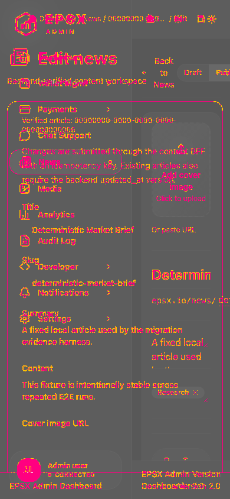](./pr5.admin.news-update--mobile-dark--diff.png) | 5.9624% | The target submits the backend revision and idempotency key and renders the article returned after the write. It does not optimistically claim that the edited title committed from browser state. | pre=PASS, post=PASS |
| `pr5.frontend.manual` | `desktop-light` | PASS; 2 clean repeats | [](./pr5.frontend.manual--desktop-light--source.png) | [](./pr5.frontend.manual--desktop-light--target.png) | [](./pr5.frontend.manual--desktop-light--diff.png) | 0.5643% | Within the 1% campaign visual threshold. | pre=PASS, post=PASS |
| `pr5.frontend.manual` | `mobile-dark` | PASS; 2 clean repeats | [](./pr5.frontend.manual--mobile-dark--source.png) | [](./pr5.frontend.manual--mobile-dark--target.png) | [](./pr5.frontend.manual--mobile-dark--diff.png) | 22.473% | At 390px the pinned source retains its 224px fixed desktop sidebar, leaving the feature cards clipped and their controls outside the usable viewport. The target removes that unsupported fixed-sidebar mode at the mobile breakpoint while retaining every category anchor in an overflow-safe index and every manual card and action. | pre=PASS, post=PASS |
| `pr5.frontend.news-detail-malformed` | `desktop-light` | PASS; 2 clean repeats | [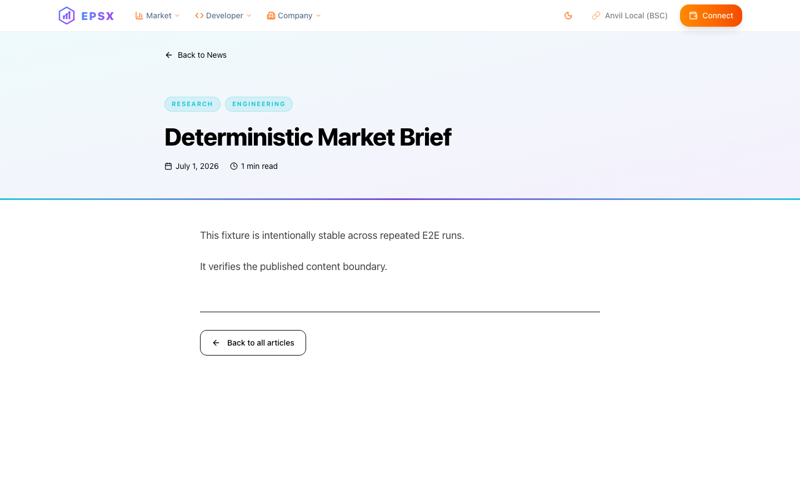](./pr5.frontend.news-detail-malformed--desktop-light--source.png) | [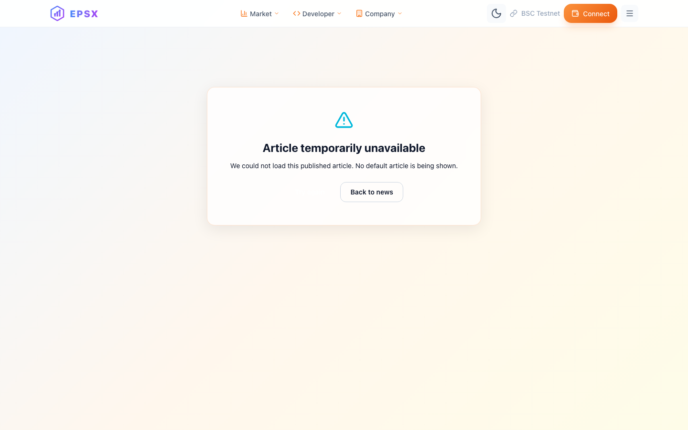](./pr5.frontend.news-detail-malformed--desktop-light--target.png) | [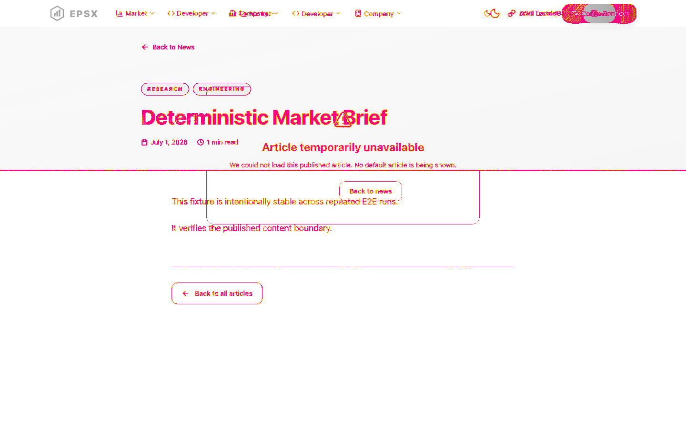](./pr5.frontend.news-detail-malformed--desktop-light--diff.png) | 2.0219% | The source receives its healthy article baseline while the target detail payload is malformed. The strict Rust projection fails closed and shows no unverified title, content, cover, author, or publication metadata. | pre=PASS, post=PASS |
| `pr5.frontend.news-detail-malformed` | `mobile-dark` | PASS; 2 clean repeats | [](./pr5.frontend.news-detail-malformed--mobile-dark--source.png) | [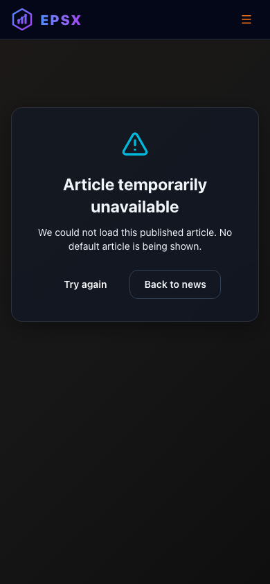](./pr5.frontend.news-detail-malformed--mobile-dark--target.png) | [](./pr5.frontend.news-detail-malformed--mobile-dark--diff.png) | 5.2816% | The source receives its healthy article baseline while the target detail payload is malformed. The strict Rust projection fails closed and shows no unverified title, content, cover, author, or publication metadata. | pre=PASS, post=PASS |
| `pr5.frontend.news-detail-not-found` | `desktop-light` | PASS; 2 clean repeats | [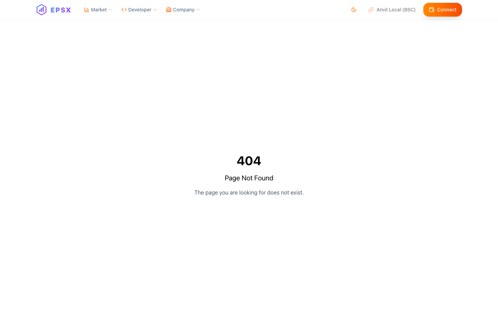](./pr5.frontend.news-detail-not-found--desktop-light--source.png) | [](./pr5.frontend.news-detail-not-found--desktop-light--target.png) | [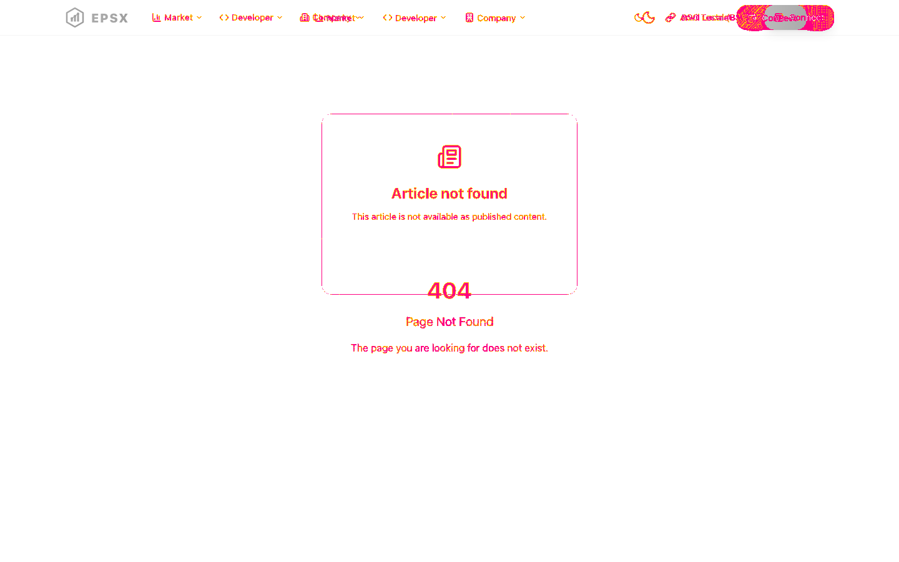](./pr5.frontend.news-detail-not-found--desktop-light--diff.png) | 0.8106% | Within the 1% campaign visual threshold. | pre=PASS, post=PASS |
| `pr5.frontend.news-detail-not-found` | `mobile-dark` | PASS; 2 clean repeats | [](./pr5.frontend.news-detail-not-found--mobile-dark--source.png) | [](./pr5.frontend.news-detail-not-found--mobile-dark--target.png) | [](./pr5.frontend.news-detail-not-found--mobile-dark--diff.png) | 1.6411% | The pinned source converts the missing slug to a generic client 404 body with HTTP 200, while the target preserves the content service's truthful 404 and exposes no article fields. The compact mobile bodies therefore differ beyond the default threshold. | pre=PASS, post=PASS |
| `pr5.frontend.news-detail-ready` | `desktop-light` | PASS; 2 clean repeats | [](./pr5.frontend.news-detail-ready--desktop-light--source.png) | [](./pr5.frontend.news-detail-ready--desktop-light--target.png) | [](./pr5.frontend.news-detail-ready--desktop-light--diff.png) | 0.6907% | Within the 1% campaign visual threshold. | pre=PASS, post=PASS |
| `pr5.frontend.news-detail-ready` | `mobile-dark` | PASS; 2 clean repeats | [](./pr5.frontend.news-detail-ready--mobile-dark--source.png) | [](./pr5.frontend.news-detail-ready--mobile-dark--target.png) | [](./pr5.frontend.news-detail-ready--mobile-dark--diff.png) | 0.8367% | Within the 1% campaign visual threshold. | pre=PASS, post=PASS |
| `pr5.frontend.news-detail-unavailable` | `desktop-light` | PASS; 2 clean repeats | [](./pr5.frontend.news-detail-unavailable--desktop-light--source.png) | [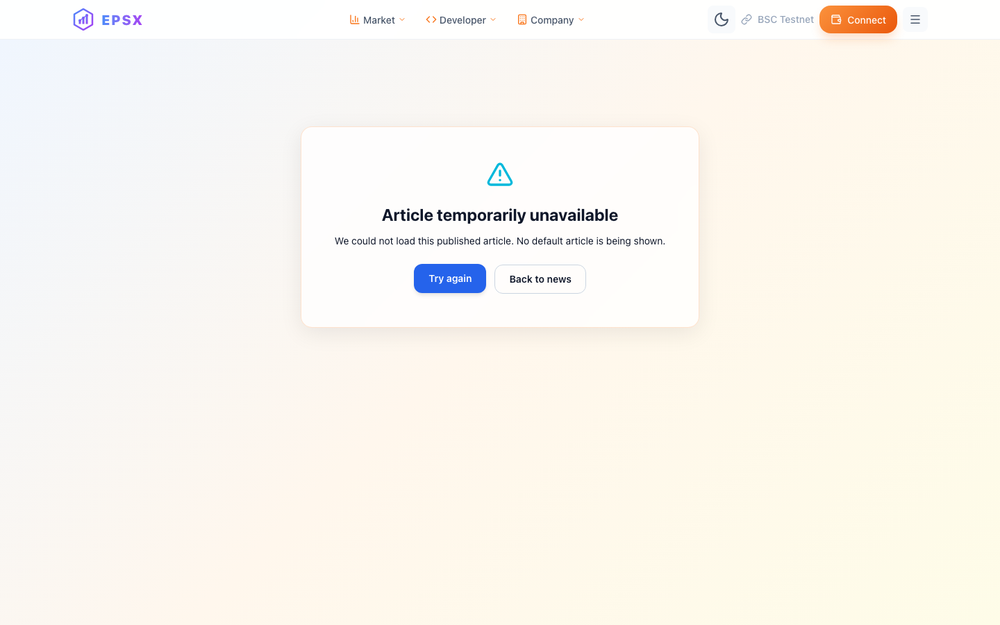](./pr5.frontend.news-detail-unavailable--desktop-light--target.png) | [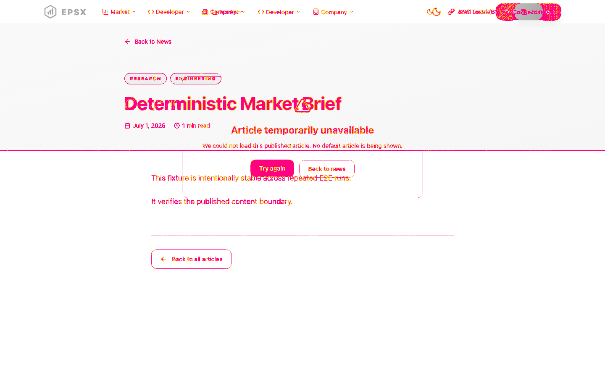](./pr5.frontend.news-detail-unavailable--desktop-light--diff.png) | 2.3314% | The source receives its healthy article baseline while the target detail dependency is unavailable. The target removes the title, body, author, and publication claims and renders the Rust-classified retry boundary. | pre=PASS, post=PASS |
| `pr5.frontend.news-detail-unavailable` | `mobile-dark` | PASS; 2 clean repeats | [](./pr5.frontend.news-detail-unavailable--mobile-dark--source.png) | [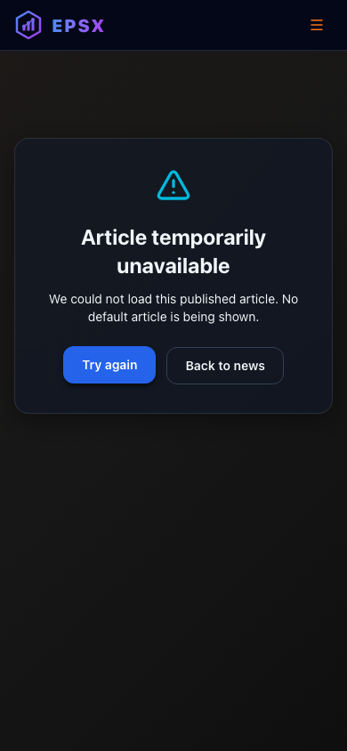](./pr5.frontend.news-detail-unavailable--mobile-dark--target.png) | [](./pr5.frontend.news-detail-unavailable--mobile-dark--diff.png) | 6.2571% | The source receives its healthy article baseline while the target detail dependency is unavailable. The target removes the title, body, author, and publication claims and renders the Rust-classified retry boundary. | pre=PASS, post=PASS |
| `pr5.frontend.news-empty` | `desktop-light` | PASS; 2 clean repeats | [](./pr5.frontend.news-empty--desktop-light--source.png) | [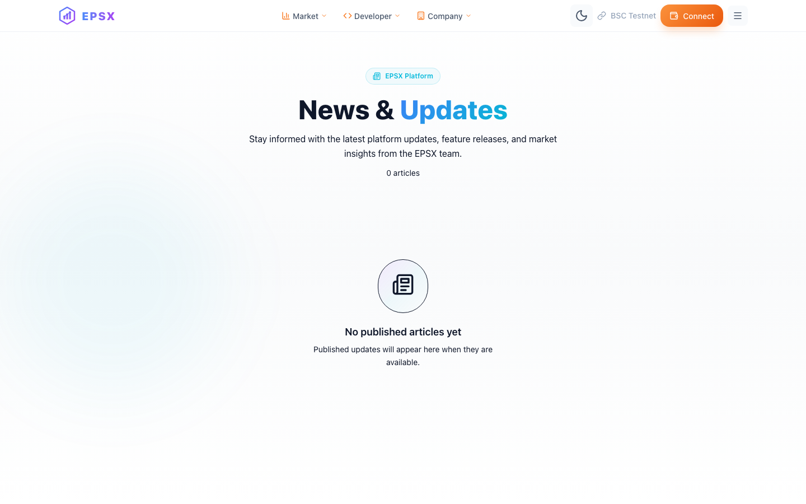](./pr5.frontend.news-empty--desktop-light--target.png) | [](./pr5.frontend.news-empty--desktop-light--diff.png) | 41.7863% | The source receives its healthy published-content baseline while the target content service returns an authoritative zero-row result. The target removes the source article card and renders the exact empty projection without sample or cached content. | pre=PASS, post=PASS |
| `pr5.frontend.news-empty` | `mobile-dark` | PASS; 2 clean repeats | [](./pr5.frontend.news-empty--mobile-dark--source.png) | [](./pr5.frontend.news-empty--mobile-dark--target.png) | [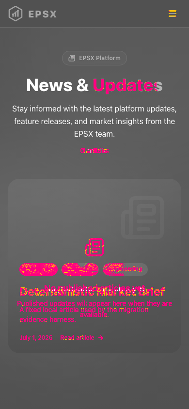](./pr5.frontend.news-empty--mobile-dark--diff.png) | 4.1099% | The source receives its healthy published-content baseline while the target content service returns an authoritative zero-row result. The target removes the source article card and renders the exact empty projection without sample or cached content. | pre=PASS, post=PASS |
| `pr5.frontend.news-filter` | `desktop-light` | PASS; 2 clean repeats | [](./pr5.frontend.news-filter--desktop-light--source.png) | [](./pr5.frontend.news-filter--desktop-light--target.png) | [](./pr5.frontend.news-filter--desktop-light--diff.png) | 0.6201% | Within the 1% campaign visual threshold. | pre=PASS, post=PASS |
| `pr5.frontend.news-filter` | `mobile-dark` | PASS; 2 clean repeats | [](./pr5.frontend.news-filter--mobile-dark--source.png) | [](./pr5.frontend.news-filter--mobile-dark--target.png) | [](./pr5.frontend.news-filter--mobile-dark--diff.png) | 0.5623% | Within the 1% campaign visual threshold. | pre=PASS, post=PASS |
| `pr5.frontend.news-malformed` | `desktop-light` | PASS; 2 clean repeats | [](./pr5.frontend.news-malformed--desktop-light--source.png) | [](./pr5.frontend.news-malformed--desktop-light--target.png) | [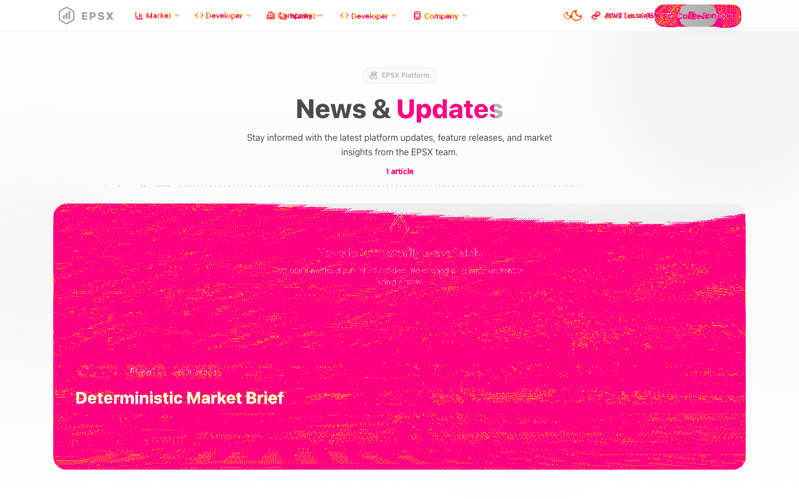](./pr5.frontend.news-malformed--desktop-light--diff.png) | 43.0887% | The source receives its healthy comparison baseline while the target content response violates the strict publication envelope. The Rust decoder fails closed and renders no fields from the malformed payload. | pre=PASS, post=PASS |
| `pr5.frontend.news-malformed` | `mobile-dark` | PASS; 2 clean repeats | [](./pr5.frontend.news-malformed--mobile-dark--source.png) | [](./pr5.frontend.news-malformed--mobile-dark--target.png) | [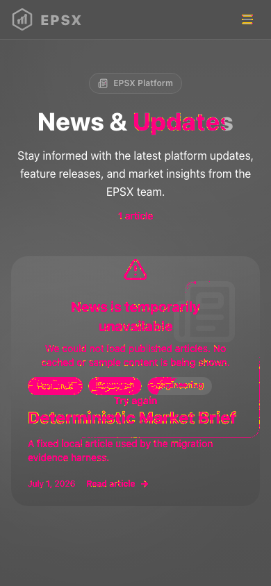](./pr5.frontend.news-malformed--mobile-dark--diff.png) | 4.7138% | The source receives its healthy comparison baseline while the target content response violates the strict publication envelope. The Rust decoder fails closed and renders no fields from the malformed payload. | pre=PASS, post=PASS |
| `pr5.frontend.news-ready` | `desktop-light` | PASS; 2 clean repeats | [](./pr5.frontend.news-ready--desktop-light--source.png) | [](./pr5.frontend.news-ready--desktop-light--target.png) | [](./pr5.frontend.news-ready--desktop-light--diff.png) | 0.6201% | Within the 1% campaign visual threshold. | pre=PASS, post=PASS |
| `pr5.frontend.news-ready` | `mobile-dark` | PASS; 2 clean repeats | [](./pr5.frontend.news-ready--mobile-dark--source.png) | [](./pr5.frontend.news-ready--mobile-dark--target.png) | [](./pr5.frontend.news-ready--mobile-dark--diff.png) | 0.5623% | Within the 1% campaign visual threshold. | pre=PASS, post=PASS |
| `pr5.frontend.news-unavailable` | `desktop-light` | PASS; 2 clean repeats | [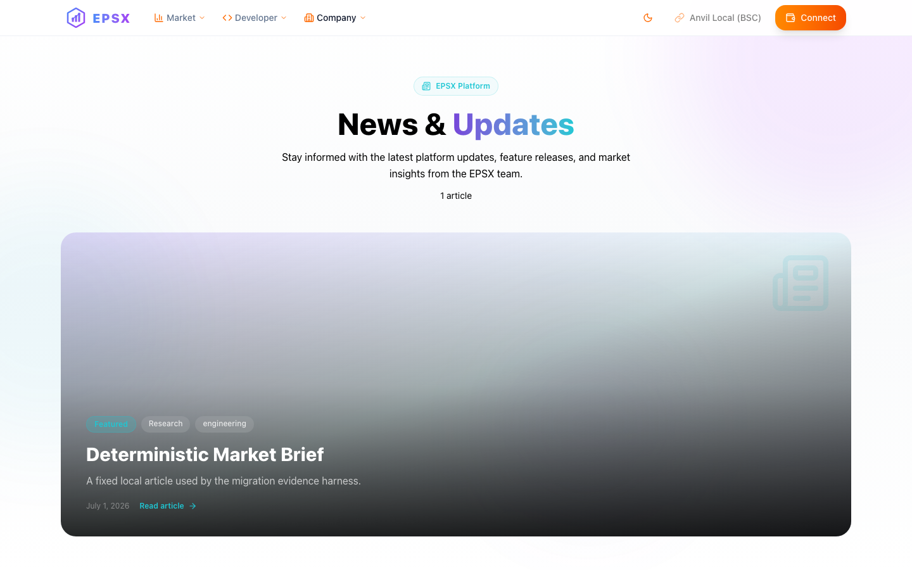](./pr5.frontend.news-unavailable--desktop-light--source.png) | [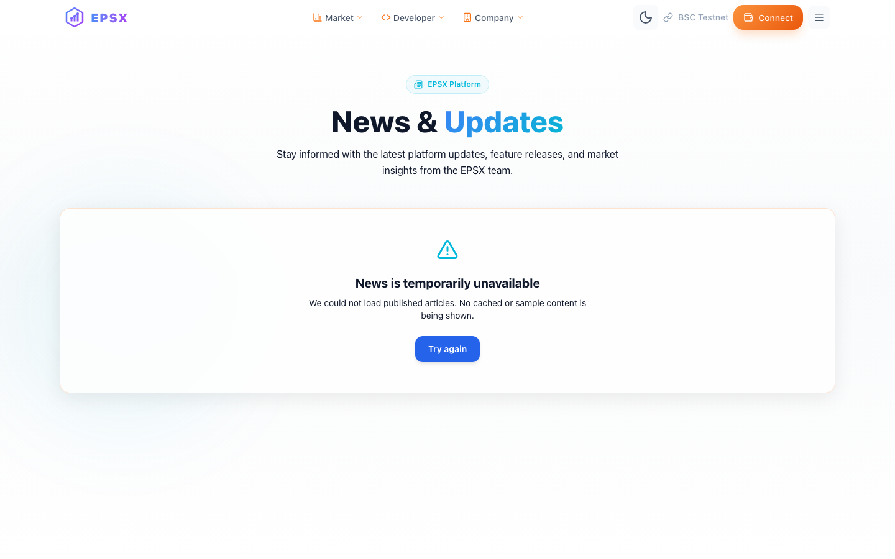](./pr5.frontend.news-unavailable--desktop-light--target.png) | [](./pr5.frontend.news-unavailable--desktop-light--diff.png) | 43.085% | The source receives its healthy comparison baseline while the target content dependency remains unavailable after retry. The Rust BFF exposes no article or publication claims and renders a distinct retryable dependency state. | pre=PASS, post=PASS |
| `pr5.frontend.news-unavailable` | `mobile-dark` | PASS; 2 clean repeats | [](./pr5.frontend.news-unavailable--mobile-dark--source.png) | [](./pr5.frontend.news-unavailable--mobile-dark--target.png) | [](./pr5.frontend.news-unavailable--mobile-dark--diff.png) | 5.5055% | The source receives its healthy comparison baseline while the target content dependency remains unavailable after retry. The Rust BFF exposes no article or publication claims and renders a distinct retryable dependency state. | pre=PASS, post=PASS |

## Backend-authoritative contract evidence

| Suite | Group | Result | Clean repeats | Rust tests per repeat | Claims | Source anchors |
|---|---:|---|---:|---:|---|---|
| `pr2.admin-session-boundary` | 2 | PASS | 2 | 161 | SIWE exchange requires the admin audience; frontend and multiple audiences cannot establish admin authority; refresh rotation, rejection, transport failure, and logout fail closed; backend profile permissions remain verbatim; unauthenticated and under-permissioned requests stop before upstream access | `apps/admin/src/session_auth.rs`<br>`apps/admin/src/session_auth_tests.rs`<br>`apps/admin/src/auth.rs`<br>`apps/admin/src/main.rs` |
| `pr2.frontend-session-boundary` | 2 | PASS | 2 | 126 | invalid login and identity mismatch set no session; refresh rotates the verified cookie pair without replay; refresh dependency failure clears unprovable sessions; logout clears canonical and legacy cookies; profile and account data stay bound to the verified owner | `apps/frontend/src/api.rs`<br>`apps/frontend/src/auth.rs`<br>`apps/frontend/src/ssr.rs` |
| `pr2.identity-service-policy` | 2 | PASS | 2 | 8 | identity routes require exact audiences and literal permissions; spoofable owner headers are stripped; malformed credentials and hidden lifecycle routes fail closed; dependency verifier failures do not expose protected handlers | `services/identity/src/lib.rs` |
| `pr2.identity-token-contracts` | 2 | PASS | 2 | 34 | SIWE nonce entropy and replay-state classification; refresh client and family-state isolation; revoked, consumed, replayed, and invalid refresh states fail closed; single exact access-token audience; RS256 issuer, audience, algorithm, and key-id validation; persistent signing material survives service reconstruction | `shared/rust/epsx-identity-shared/src/auth_service.rs`<br>`shared/rust/epsx-identity-shared/src/token_service.rs`<br>`shared/rust/epsx-identity-shared/src/key_manager.rs`<br>`shared/rust/epsx-identity-shared/src/refresh_token_digest.rs` |
| `pr2.service-auth-boundary` | 2 | PASS | 2 | 8 | frontend and admin audiences are exact and isolated; wrong audience, issuer, expiry, algorithm, and unknown keys are rejected; permission wildcard grammar does not widen authority | `shared/rust/epsx-service-auth/src/lib.rs` |
| `pr3.admin-audit-adapter` | 3 | PASS | 2 | 7 | audit reads accept only bounded backend summaries; invalid filters and cursors fail before upstream access; duplicate, unsorted, or malformed audit records are rejected; sensitive actor and metadata fields never enter the UI projection | `apps/admin/src/audit_log_adapter.rs` |
| `pr3.admin-commerce-adapter` | 3 | PASS | 2 | 4 | wallet, credit, access, and plan DTOs reject unknown or malformed fields; wallet and plan identifiers are canonical before upstream I/O; optimistic conflicts and forbidden mutations remain distinct; mutation success requires evidence-bearing backend responses | `apps/admin/src/commerce_adapter.rs` |
| `pr3.subscription-service-policy` | 3 | PASS | 2 | 10 | plan and access reads require their literal read permissions; plan and access mutations require their literal manage permissions; audience and owner isolation are enforced by the Rust service; spoofed headers and hidden paths cannot widen authority | `services/subscription/src/lib.rs` |
| `pr3.wallet-service-policy` | 3 | PASS | 2 | 12 | wallet and credit reads require exact read permissions; wallet and credit mutations require exact manage permissions; frontend owners cannot cross wallet boundaries; admin and frontend audiences remain isolated; spoofed owner headers and unsafe paths fail closed | `services/wallet/src/lib.rs` |
| `pr4.admin-analytics-adapter` | 4 | PASS | 2 | 2 | admin analytics accepts only its exact backend envelope; freshness is injected from the verified envelope rather than upstream data; fabricated telemetry and unknown fields are rejected; ready and authoritative empty projections preserve the backend timestamp | `apps/admin/src/analytics_admin_adapter.rs`<br>`shared/rust/dioxus_ui/src/pages/admin_pages/analytics.rs` |
| `pr4.admin-dashboard-adapter` | 4 | PASS | 2 | 9 | dashboard counts and observation time come only from the strict backend envelope; forbidden, unavailable, and malformed states remain distinct; health, uptime, activity, and permission metrics are not invented; invalid counts, timestamps, redirects, and oversized bodies fail closed | `apps/admin/src/dashboard_user_status_adapter.rs`<br>`shared/rust/dioxus_ui/src/pages/admin_pages/dashboard.rs` |
| `pr4.analytics-service-policy` | 4 | PASS | 2 | 10 | administrator analytics reads require the exact admin audience; analytics and audit reads require their literal permissions; untrusted owner headers and hidden routes cannot widen access; unsafe filters and cursors fail before data access | `services/analytics/src/lib.rs` |
| `pr4.backend-ranking-policy` | 4 | PASS | 2 | 32 | ranking offsets are resolved from the backend authority port; locked ranks cannot be recovered through pagination or limit changes; cache keys isolate distinct backend ranking offsets; malformed, overflowing, or unavailable authority fails closed | `apps/backend/src/web/analytics/eps/cache.rs`<br>`apps/backend/src/web/analytics/eps/rankings.rs`<br>`apps/backend/src/domain/market_analytics/services/eps_ranking_service.rs` |
| `pr4.frontend-analytics-adapter` | 4 | PASS | 2 | 4 | only canonical filter, sort, and pagination query fields reach analytics; ranking, access, freshness, filters, and watchlist projections are validated; empty, unavailable, and malformed responses remain distinct; unsupported dashboard and portfolio decisions are not inferred | `apps/frontend/src/ssr.rs`<br>`shared/rust/dioxus_ui/src/pages/analytics.rs`<br>`shared/rust/dioxus_ui/src/pages/portfolio.rs`<br>`shared/rust/dioxus_ui/src/pages/dashboard.rs` |
| `pr5-admin-media-bff` | 5 | PASS | 2 | 9 | media inventory exposes bounded metadata without storage credentials; upload and deletion outcomes require strict backend evidence | `apps/admin/src/media_adapter.rs` |
| `pr5-admin-news-bff` | 5 | PASS | 2 | 14 | admin news reads and writes require verified backend projections; revision conflicts and malformed lifecycle results fail closed | `apps/admin/src/news_adapter.rs` |
| `pr5-content-service` | 5 | PASS | 2 | 8 | publication lifecycle remains in the Rust content service; revisions, authorization, and cache invalidation fail closed | `services/content/src/lib.rs` |
| `pr5-frontend-news-bff` | 5 | PASS | 2 | 10 | public list and detail envelopes are strict and bounded; not-found, malformed, and unavailable outcomes never become content | `apps/frontend/src/api.rs` |

Each repeat has a checksummed Cargo log plus guarded pre/post PostgreSQL, Redis, Anvil, and fixture reset proofs in the full artifact. Test counts and ignored-test counts must be stable, every command must pass, and ignored tests are forbidden.

## Contact sheets

Each sheet is ordered **Next.js source → Rust/Dioxus target → highlighted pixel diff**.

### pr0.public.about — desktop-light


### pr0.public.about — mobile-dark


### pr0.public.contact — desktop-light


### pr0.public.contact — mobile-dark


### pr0.public.home — desktop-light


### pr0.public.home — mobile-dark


### pr1.about.authenticated — desktop-light


### pr1.about.authenticated — mobile-dark


### pr1.admin.denial-query — desktop-light


### pr1.admin.denial-query — mobile-dark

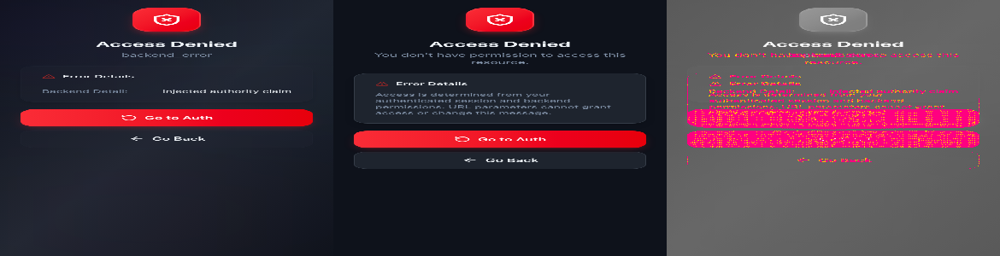

### pr1.admin.unauthorized — desktop-light


### pr1.admin.unauthorized — mobile-dark


### pr1.auth.about-redirect — desktop-light


### pr1.auth.about-redirect — mobile-dark


### pr1.auth.contact-redirect — desktop-light


### pr1.auth.contact-redirect — mobile-dark


### pr1.contact.authenticated — desktop-light


### pr1.contact.authenticated — mobile-dark


### pr1.error.access-denied — desktop-light


### pr1.error.access-denied — mobile-dark

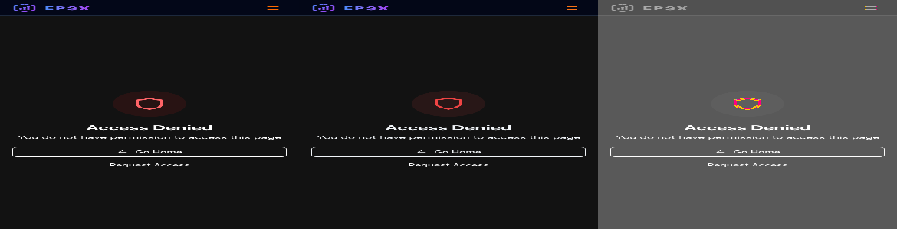

### pr1.error.not-found — desktop-light

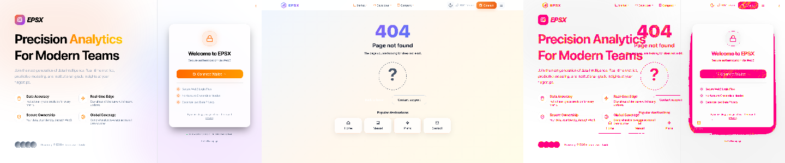

### pr1.error.not-found — mobile-dark


### pr1.offline.public — desktop-light


### pr1.offline.public — mobile-dark


### pr1.privacy.legal — desktop-light

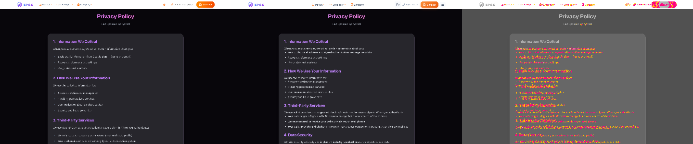

### pr1.privacy.legal — mobile-dark


### pr1.shell.home — desktop-light


### pr1.shell.home — mobile-dark


### pr1.terms.legal — desktop-light

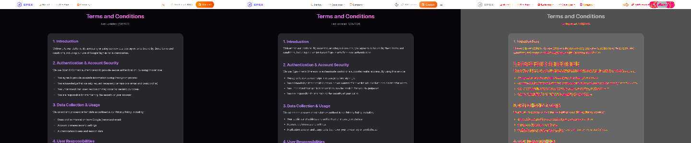

### pr1.terms.legal — mobile-dark

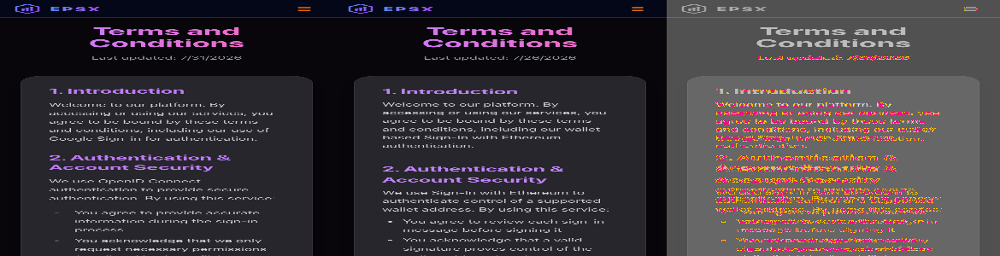

### pr2.account.verified — desktop-light


### pr2.account.verified — mobile-dark


### pr2.admin.settings — desktop-light


### pr2.admin.settings — mobile-dark

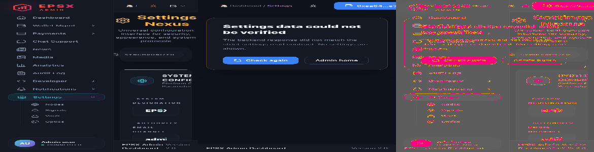

### pr2.admin.wrong-audience — desktop-light


### pr2.admin.wrong-audience — mobile-dark

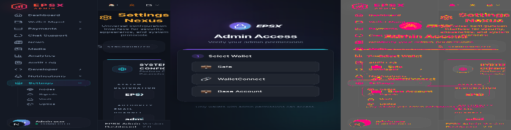

### pr2.auth.dependency-failure — desktop-light


### pr2.auth.dependency-failure — mobile-dark


### pr2.auth.logout — desktop-light


### pr2.auth.logout — mobile-dark


### pr2.auth.signed-out — desktop-light


### pr2.auth.signed-out — mobile-dark


### pr2.frontend.wrong-audience — desktop-light


### pr2.frontend.wrong-audience — mobile-dark


### pr2.permissions.empty-claims — desktop-light


### pr2.permissions.empty-claims — mobile-dark


### pr2.permissions.verified — desktop-light

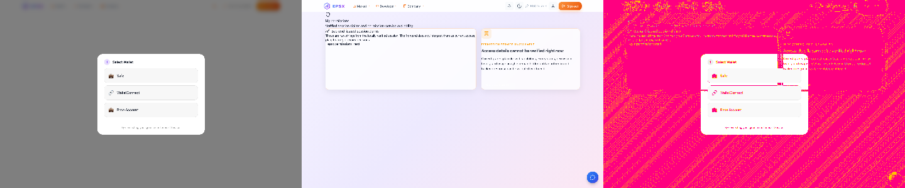

### pr2.permissions.verified — mobile-dark


### pr2.profile.verified — desktop-light

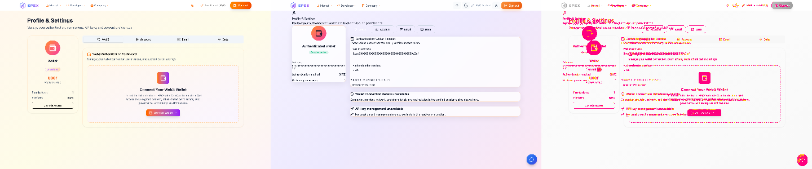

### pr2.profile.verified — mobile-dark

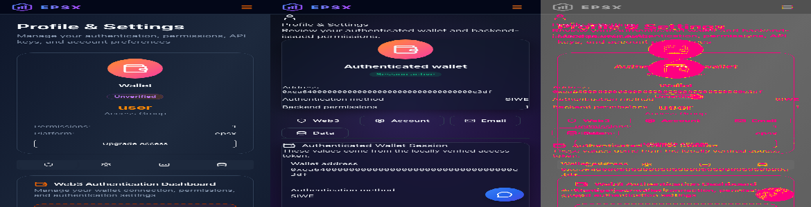

### pr3.admin.access-forbidden — desktop-light

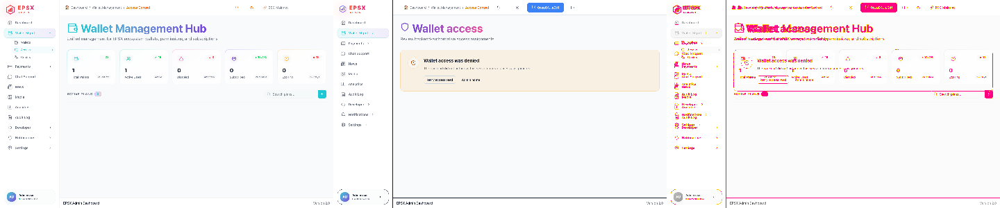

### pr3.admin.access-forbidden — mobile-dark


### pr3.admin.access — desktop-light

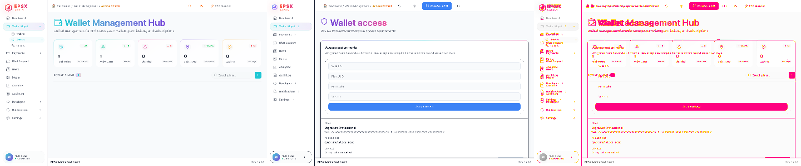

### pr3.admin.access — mobile-dark


### pr3.admin.audit — desktop-light


### pr3.admin.audit — mobile-dark


### pr3.admin.credits-validation — desktop-light


### pr3.admin.credits-validation — mobile-dark

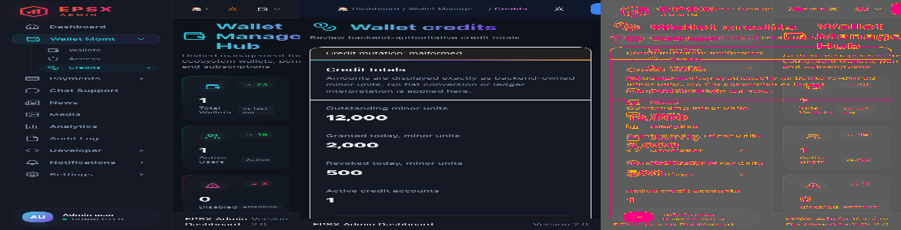

### pr3.admin.credits — desktop-light

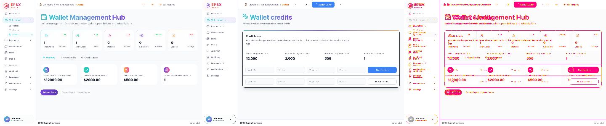

### pr3.admin.credits — mobile-dark


### pr3.admin.disable-audit — desktop-light

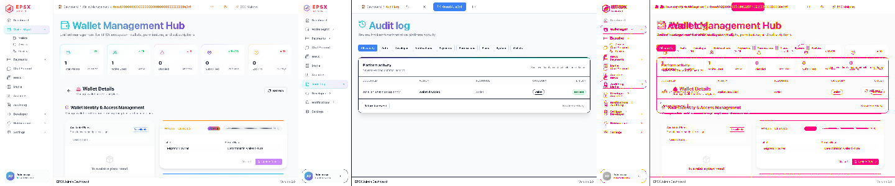

### pr3.admin.disable-audit — mobile-dark

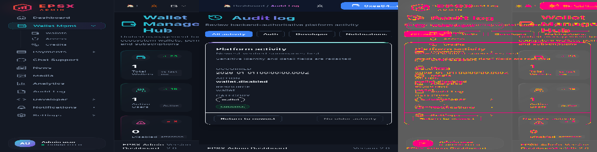

### pr3.admin.disable — desktop-light


### pr3.admin.disable — mobile-dark


### pr3.admin.plan-conflict — desktop-light


### pr3.admin.plan-conflict — mobile-dark


### pr3.admin.plan-detail — desktop-light

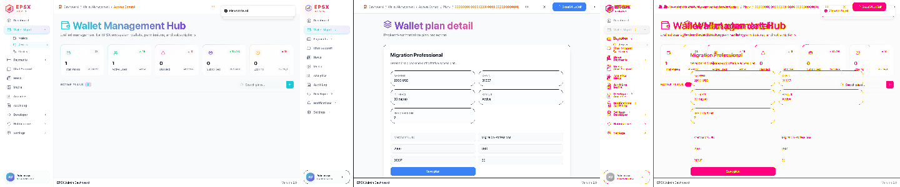

### pr3.admin.plan-detail — mobile-dark


### pr3.admin.plans — desktop-light


### pr3.admin.plans — mobile-dark


### pr3.admin.wallet-detail-forbidden — desktop-light


### pr3.admin.wallet-detail-forbidden — mobile-dark


### pr3.admin.wallet-detail — desktop-light


### pr3.admin.wallet-detail — mobile-dark

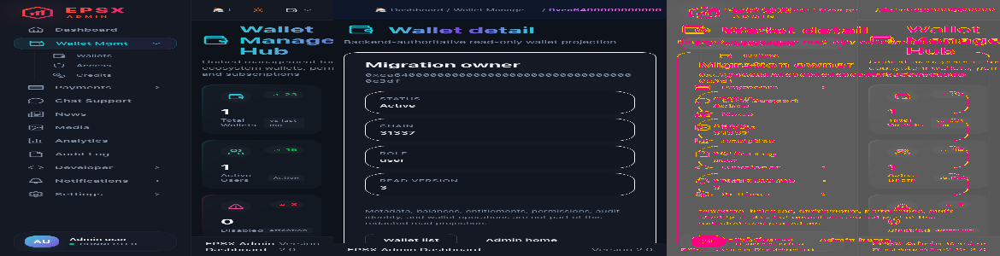

### pr3.admin.wallet-redirect — desktop-light

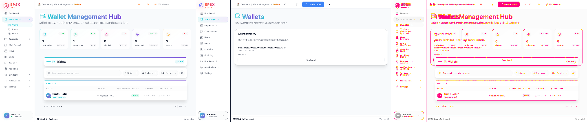

### pr3.admin.wallet-redirect — mobile-dark

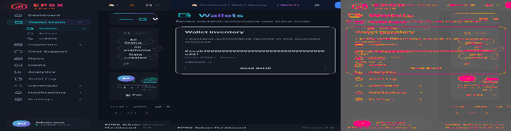

### pr3.admin.wallets-query-rejected — desktop-light

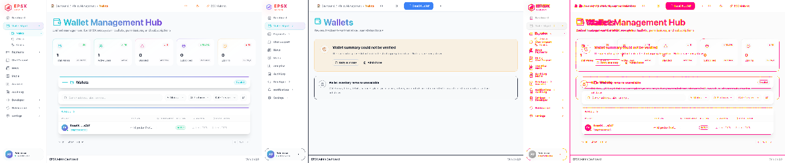

### pr3.admin.wallets-query-rejected — mobile-dark

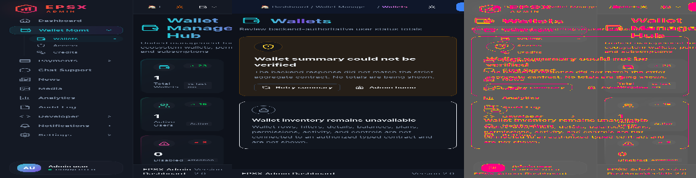

### pr3.admin.wallets — desktop-light

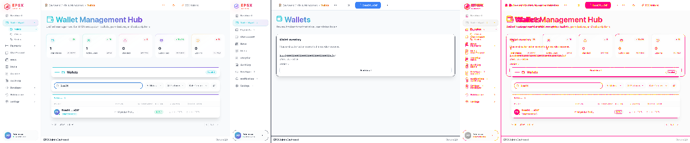

### pr3.admin.wallets — mobile-dark


### pr3.frontend.credits — desktop-light


### pr3.frontend.credits — mobile-dark

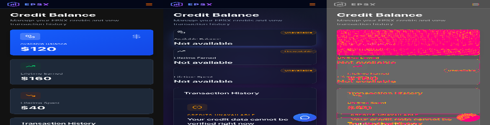

### pr4.admin.analytics-empty — desktop-light

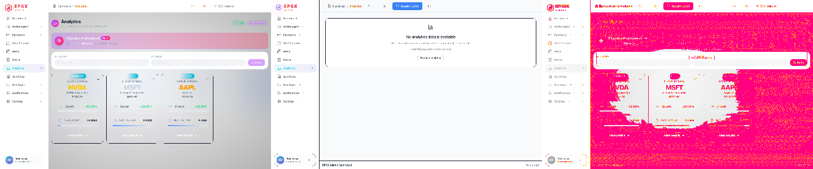

### pr4.admin.analytics-empty — mobile-dark

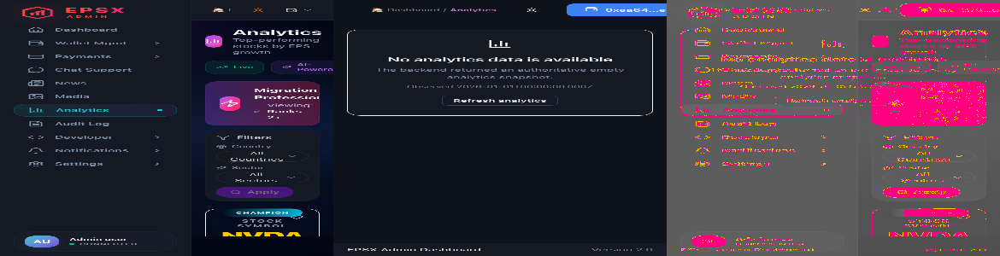

### pr4.admin.analytics-forbidden — desktop-light


### pr4.admin.analytics-forbidden — mobile-dark

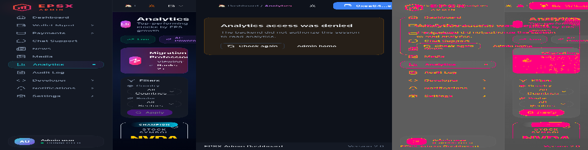

### pr4.admin.analytics-malformed — desktop-light


### pr4.admin.analytics-malformed — mobile-dark


### pr4.admin.analytics-unavailable — desktop-light

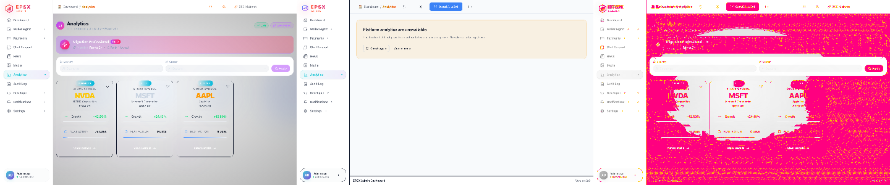

### pr4.admin.analytics-unavailable — mobile-dark

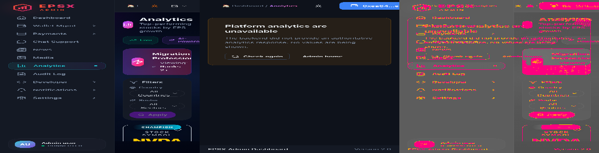

### pr4.admin.analytics — desktop-light


### pr4.admin.analytics — mobile-dark


### pr4.admin.dashboard-forbidden — desktop-light


### pr4.admin.dashboard-forbidden — mobile-dark


### pr4.admin.dashboard-malformed — desktop-light


### pr4.admin.dashboard-malformed — mobile-dark


### pr4.admin.dashboard-unavailable — desktop-light


### pr4.admin.dashboard-unavailable — mobile-dark


### pr4.admin.dashboard — desktop-light

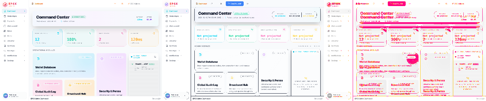

### pr4.admin.dashboard — mobile-dark

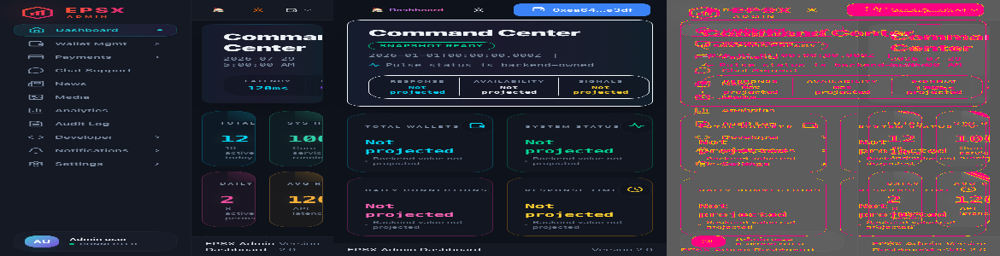

### pr4.frontend.analytics-empty — desktop-light

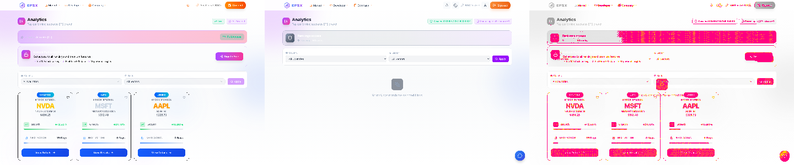

### pr4.frontend.analytics-empty — mobile-dark


### pr4.frontend.analytics-limited — desktop-light

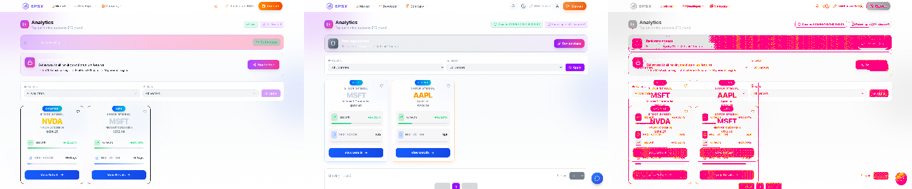

### pr4.frontend.analytics-limited — mobile-dark


### pr4.frontend.analytics-malformed — desktop-light

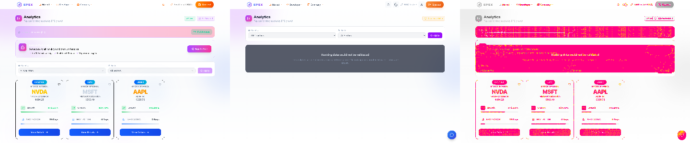

### pr4.frontend.analytics-malformed — mobile-dark

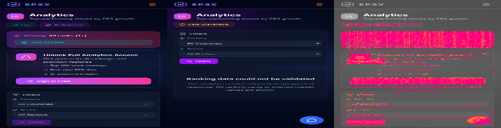

### pr4.frontend.analytics-query — desktop-light

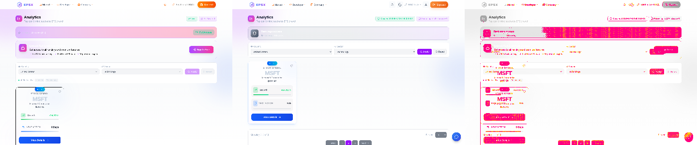

### pr4.frontend.analytics-query — mobile-dark

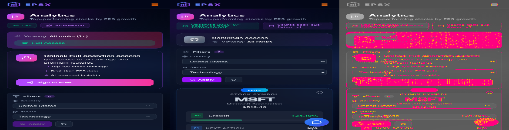

### pr4.frontend.analytics-stale — desktop-light

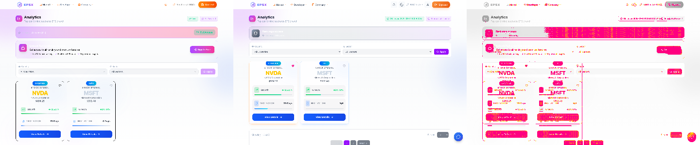

### pr4.frontend.analytics-stale — mobile-dark

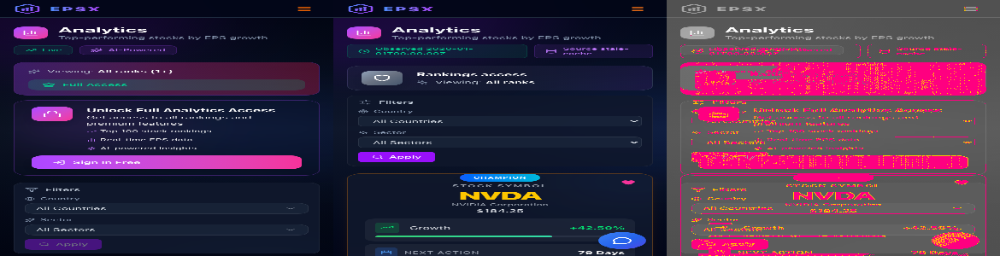

### pr4.frontend.analytics-unavailable — desktop-light


### pr4.frontend.analytics-unavailable — mobile-dark


### pr4.frontend.dashboard — desktop-light

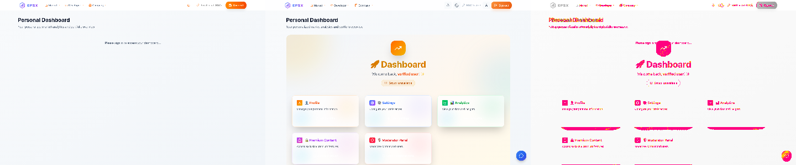

### pr4.frontend.dashboard — mobile-dark


### pr4.frontend.home-rankings — desktop-light


### pr4.frontend.home-rankings — mobile-dark


### pr4.frontend.portfolio — desktop-light


### pr4.frontend.portfolio — mobile-dark


### pr5.admin.media-delete — desktop-light


### pr5.admin.media-delete — mobile-dark

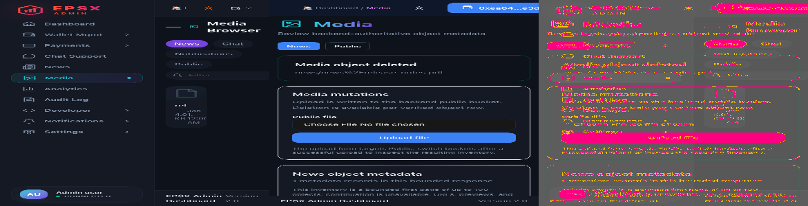

### pr5.admin.media-empty — desktop-light


### pr5.admin.media-empty — mobile-dark

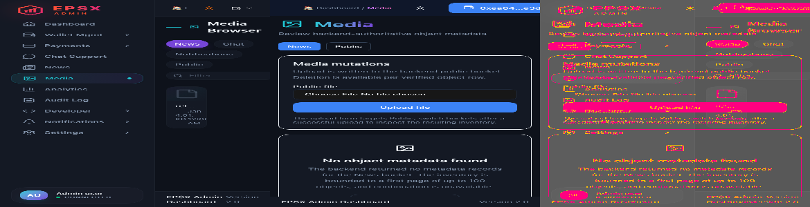

### pr5.admin.media-forbidden — desktop-light

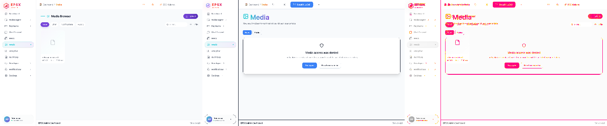

### pr5.admin.media-forbidden — mobile-dark

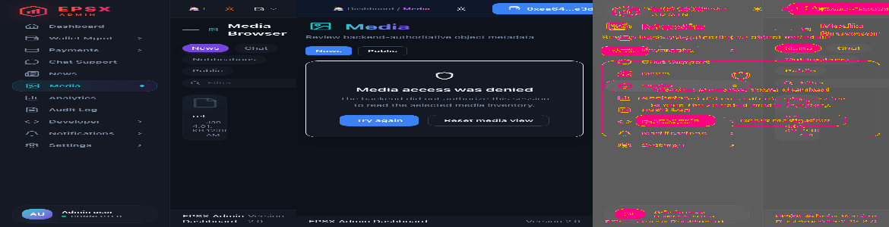

### pr5.admin.media-malformed — desktop-light

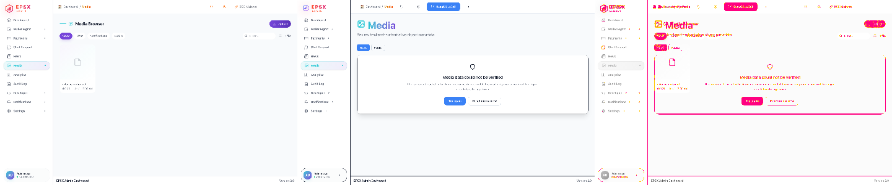

### pr5.admin.media-malformed — mobile-dark

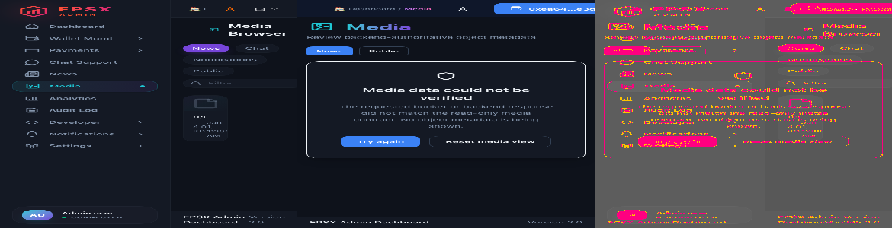

### pr5.admin.media-news-ready — desktop-light


### pr5.admin.media-news-ready — mobile-dark

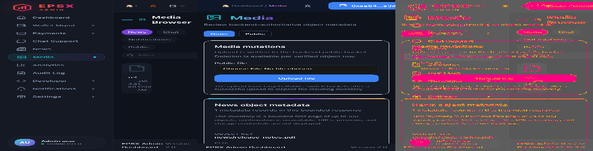

### pr5.admin.media-public-ready — desktop-light

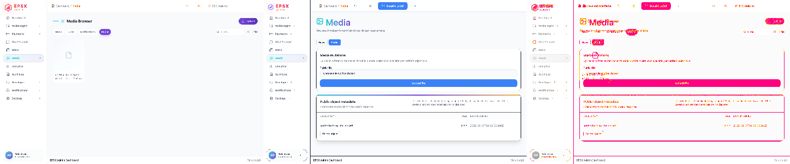

### pr5.admin.media-public-ready — mobile-dark

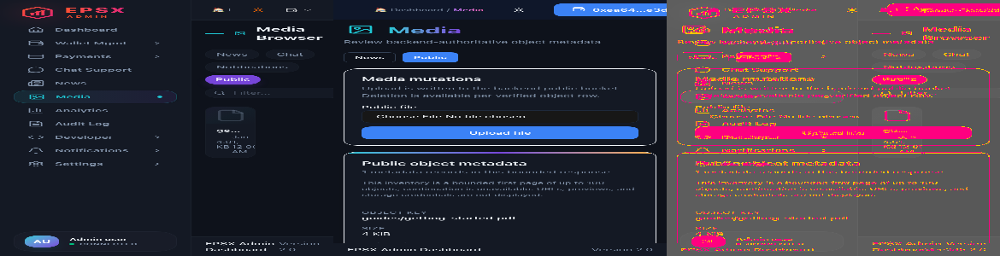

### pr5.admin.media-unavailable — desktop-light

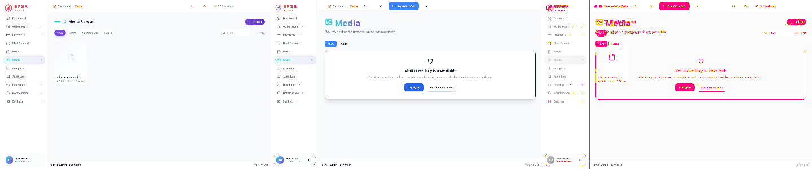

### pr5.admin.media-unavailable — mobile-dark


### pr5.admin.media-upload-conflict — desktop-light

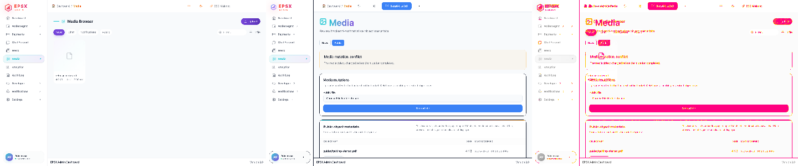

### pr5.admin.media-upload-conflict — mobile-dark

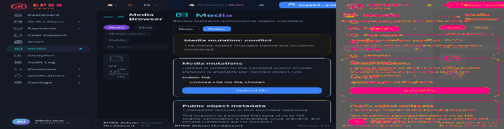

### pr5.admin.media-upload — desktop-light


### pr5.admin.media-upload — mobile-dark


### pr5.admin.news-conflict — desktop-light

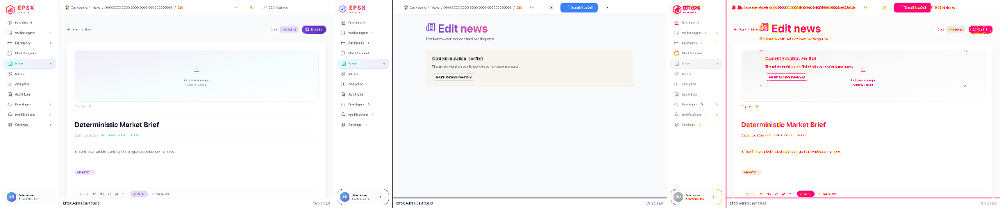

### pr5.admin.news-conflict — mobile-dark

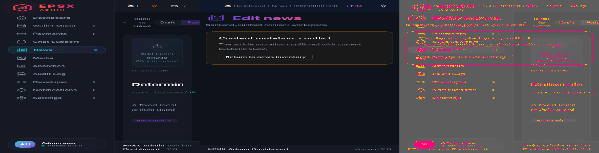

### pr5.admin.news-create-form — desktop-light


### pr5.admin.news-create-form — mobile-dark

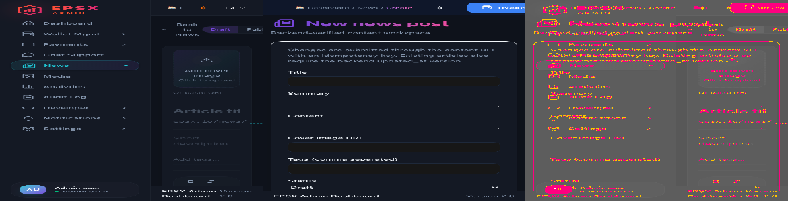

### pr5.admin.news-create-submit — desktop-light


### pr5.admin.news-create-submit — mobile-dark


### pr5.admin.news-delete — desktop-light


### pr5.admin.news-delete — mobile-dark

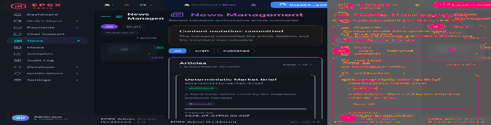

### pr5.admin.news-draft-filter — desktop-light


### pr5.admin.news-draft-filter — mobile-dark


### pr5.admin.news-edit-ready — desktop-light


### pr5.admin.news-edit-ready — mobile-dark

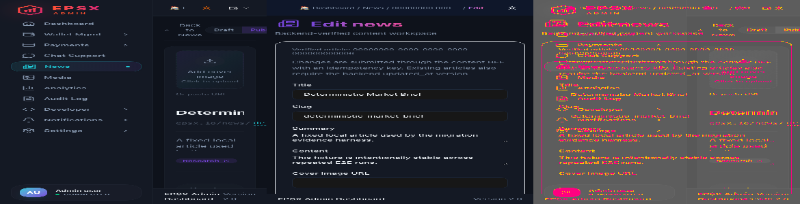

### pr5.admin.news-empty — desktop-light

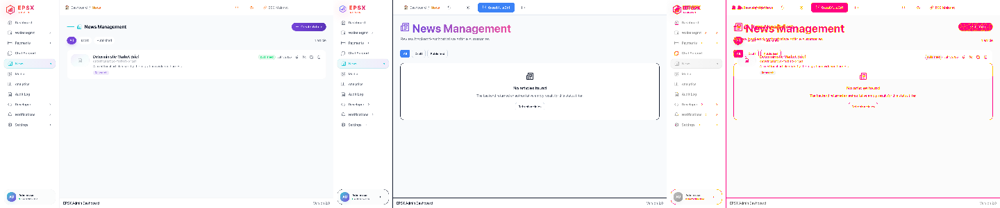

### pr5.admin.news-empty — mobile-dark


### pr5.admin.news-forbidden — desktop-light


### pr5.admin.news-forbidden — mobile-dark

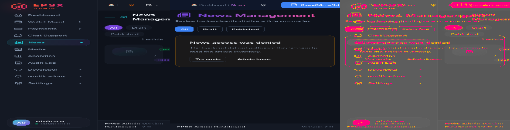

### pr5.admin.news-image-upload — desktop-light

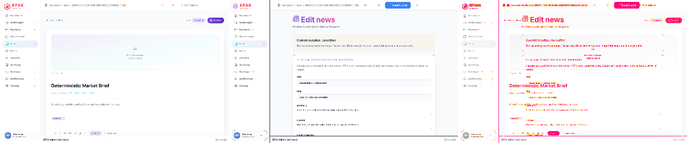

### pr5.admin.news-image-upload — mobile-dark


### pr5.admin.news-malformed — desktop-light


### pr5.admin.news-malformed — mobile-dark


### pr5.admin.news-publish — desktop-light

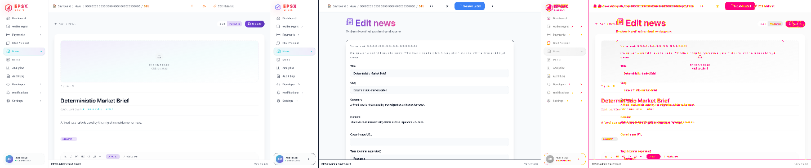

### pr5.admin.news-publish — mobile-dark


### pr5.admin.news-ready — desktop-light

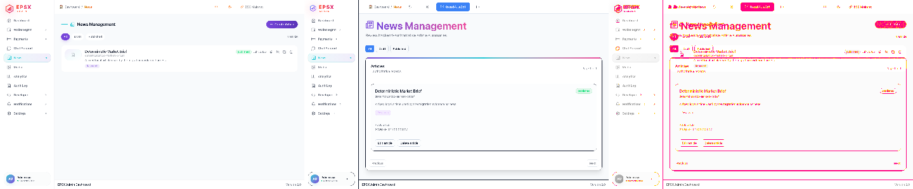

### pr5.admin.news-ready — mobile-dark

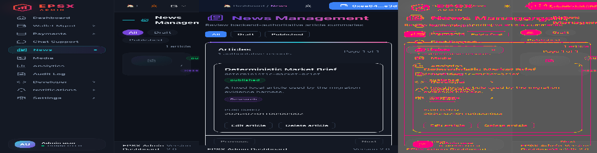

### pr5.admin.news-unavailable — desktop-light

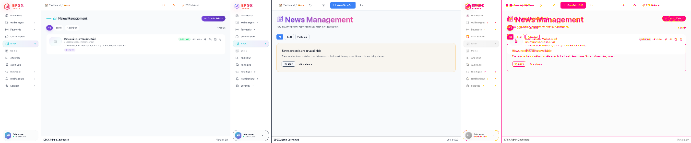

### pr5.admin.news-unavailable — mobile-dark


### pr5.admin.news-unpublish — desktop-light


### pr5.admin.news-unpublish — mobile-dark


### pr5.admin.news-update — desktop-light


### pr5.admin.news-update — mobile-dark


### pr5.frontend.manual — desktop-light


### pr5.frontend.manual — mobile-dark

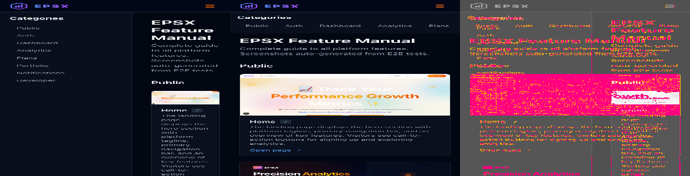

### pr5.frontend.news-detail-malformed — desktop-light


### pr5.frontend.news-detail-malformed — mobile-dark


### pr5.frontend.news-detail-not-found — desktop-light


### pr5.frontend.news-detail-not-found — mobile-dark


### pr5.frontend.news-detail-ready — desktop-light

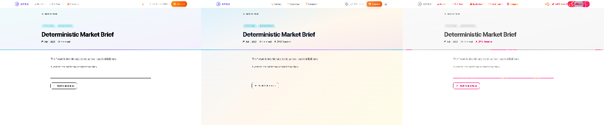

### pr5.frontend.news-detail-ready — mobile-dark


### pr5.frontend.news-detail-unavailable — desktop-light

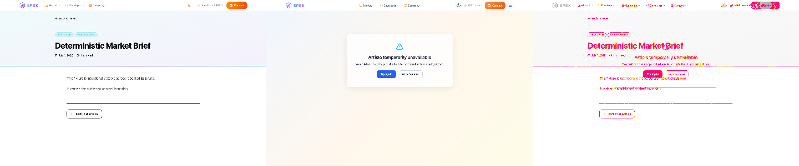

### pr5.frontend.news-detail-unavailable — mobile-dark

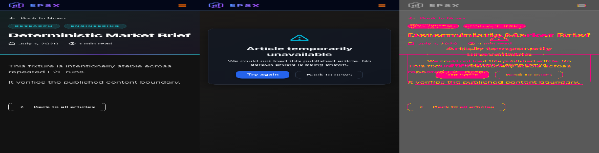

### pr5.frontend.news-empty — desktop-light

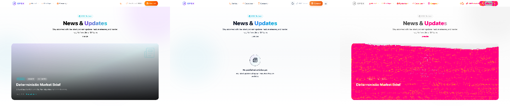

### pr5.frontend.news-empty — mobile-dark

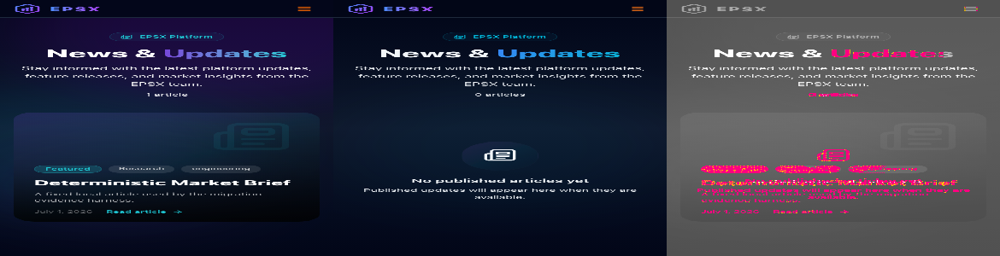

### pr5.frontend.news-filter — desktop-light


### pr5.frontend.news-filter — mobile-dark


### pr5.frontend.news-malformed — desktop-light

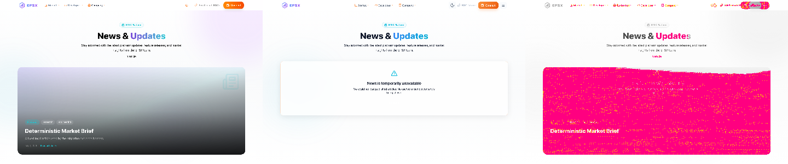

### pr5.frontend.news-malformed — mobile-dark


### pr5.frontend.news-ready — desktop-light

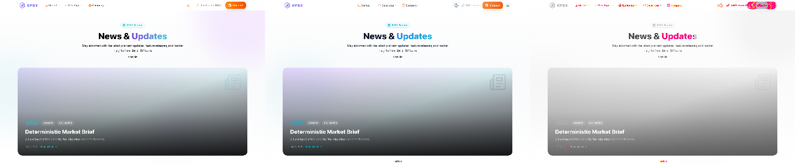

### pr5.frontend.news-ready — mobile-dark


### pr5.frontend.news-unavailable — desktop-light


### pr5.frontend.news-unavailable — mobile-dark

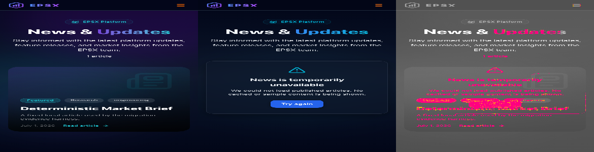

## Runtime rollback gate

Every repeat restored a guarded `epsx_e2e_*` PostgreSQL database from its template, deleted only the `epsx:e2e:*` Redis namespace, reverted Anvil chain 31337 to its recorded snapshot, reset fixture requests/mutations, and cleared its isolated browser context. PostgreSQL checksums and row counts, transient queue/outbox emptiness, Redis hashes, Anvil account/block state, and fixture counters matched the baseline after reset.

Final process-stopped rollback: **PASS**. The source and target applications were stopped before the final reset and smoke, preventing background polling from repopulating fixture or durable state. The full artifact manifest includes `reset-final.json` with every baseline comparison.

## Full artifacts

The CI artifact contains full-resolution PNGs, video, traces, HAR/network data, DOM, accessibility snapshots, browser/server logs, Playwright HTML, and reset proofs. [`artifact-manifest.json`](./artifact-manifest.json) records the SHA-256 and byte length of every file in that artifact.

## Reproduce

```bash
bun install --frozen-lockfile
bunx playwright install chromium
bun e2e/migration/cli.ts run --group 5
bun e2e/migration/cli.ts verify-artifacts --group 5
```
