# PR 7 — cumulative migration E2E evidence

Result: **PASS**

Source Next.js SHA: `373bd231cb7a616c3d4c0ddc1d60e0099a88a5db`

Target Rust/Dioxus SHA: `0d4b89ccb12f698a9c00ab948775ed370c937acf`

Generated: 2026-07-31T22:04:08.934Z

This report covers every executable scenario owned by cumulative groups 0–7. Visual differences above 1% require a machine-readable non-styling exception.

## Scenario evidence

| Scenario | Matrix | Result / coverage | Next.js | Rust/Dioxus | Highlighted diff | Δ pixels | Difference disposition | Reset proof |
|---|---|---|---|---|---|---:|---|---|
| `pr7.admin.create-key-conflict` | `desktop-light` | PASS; 2 clean repeats | [](./pr7.admin.create-key-conflict--desktop-light--source.png) | [](./pr7.admin.create-key-conflict--desktop-light--target.png) | [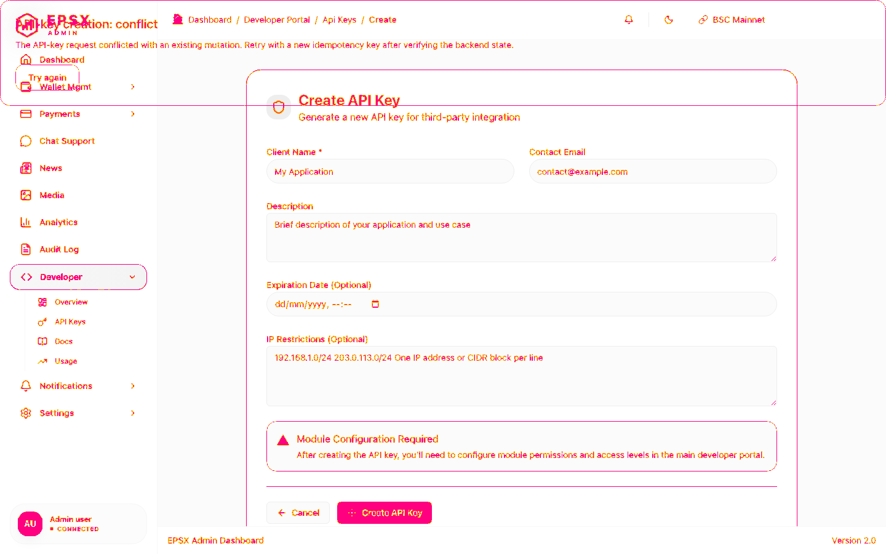](./pr7.admin.create-key-conflict--desktop-light--diff.png) | 2.4394% | The target reports the Rust idempotency conflict and withholds any secret or success claim. The pinned source has no authoritative conflict ledger, so the state difference is required by the backend contract. | pre=PASS, post=PASS |
| `pr7.admin.create-key-conflict` | `mobile-dark` | PASS; 2 clean repeats | [](./pr7.admin.create-key-conflict--mobile-dark--source.png) | [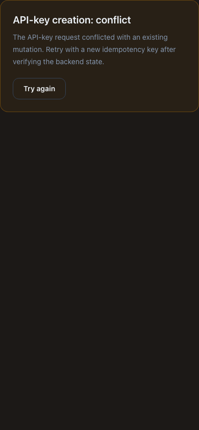](./pr7.admin.create-key-conflict--mobile-dark--target.png) | [](./pr7.admin.create-key-conflict--mobile-dark--diff.png) | 4.8229% | The target reports the Rust idempotency conflict and withholds any secret or success claim. The pinned source has no authoritative conflict ledger, so the state difference is required by the backend contract. | pre=PASS, post=PASS |
| `pr7.admin.create-key-form` | `desktop-light` | PASS; 2 clean repeats | [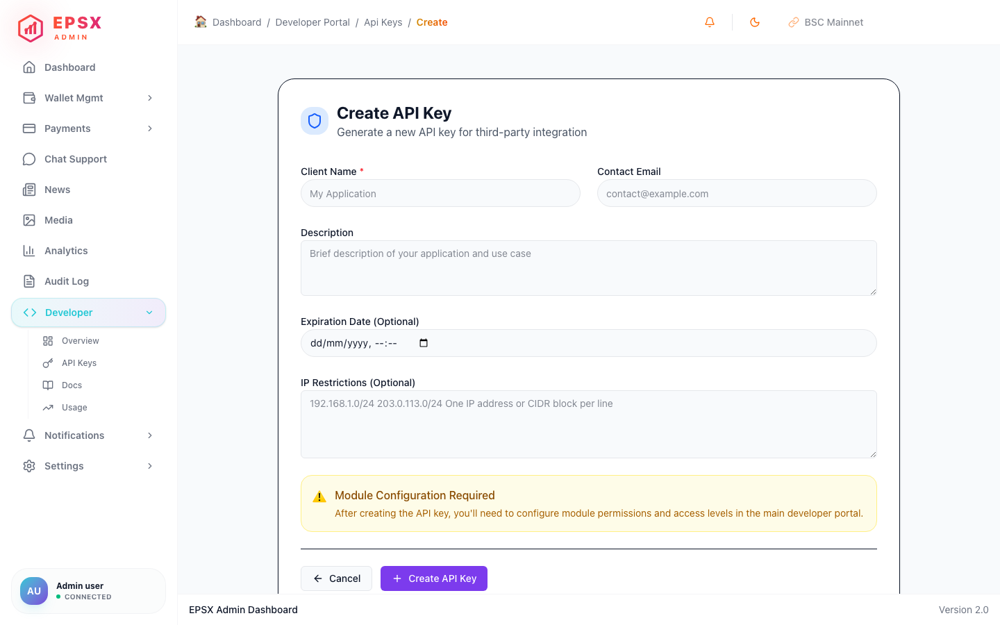](./pr7.admin.create-key-form--desktop-light--source.png) | [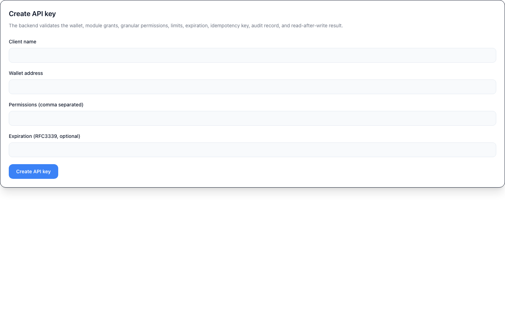](./pr7.admin.create-key-form--desktop-light--target.png) | [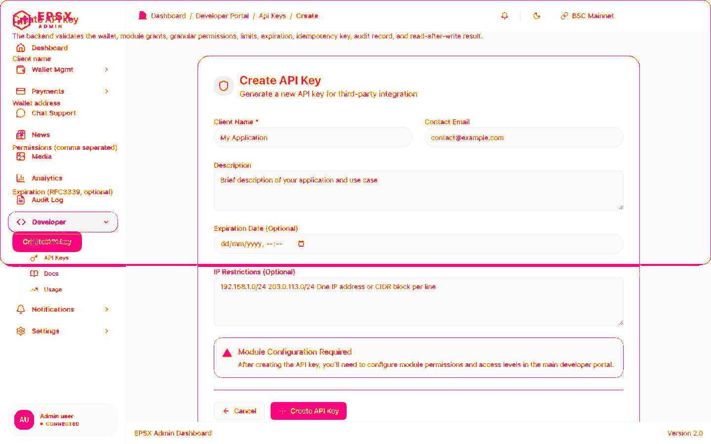](./pr7.admin.create-key-form--desktop-light--diff.png) | 3.48% | The target exposes a create form whose submit is routed through the Rust BFF and its idempotency and audit ledger. The pinned source does not provide a verified secret-once creation contract, so the structural delta is required rather than styling-only. | pre=PASS, post=PASS |
| `pr7.admin.create-key-form` | `mobile-dark` | PASS; 2 clean repeats | [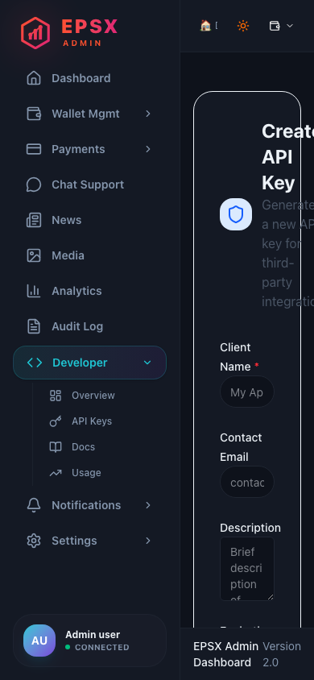](./pr7.admin.create-key-form--mobile-dark--source.png) | [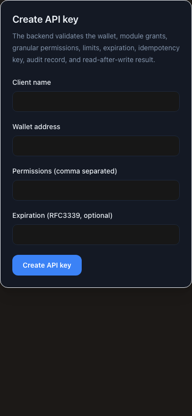](./pr7.admin.create-key-form--mobile-dark--target.png) | [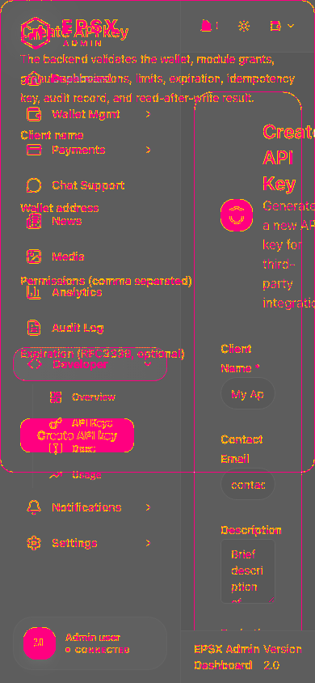](./pr7.admin.create-key-form--mobile-dark--diff.png) | 6.9611% | The target exposes a create form whose submit is routed through the Rust BFF and its idempotency and audit ledger. The pinned source does not provide a verified secret-once creation contract, so the structural delta is required rather than styling-only. | pre=PASS, post=PASS |
| `pr7.admin.create-key-secret-cleared` | `desktop-light` | PASS; 2 clean repeats | [](./pr7.admin.create-key-secret-cleared--desktop-light--source.png) | [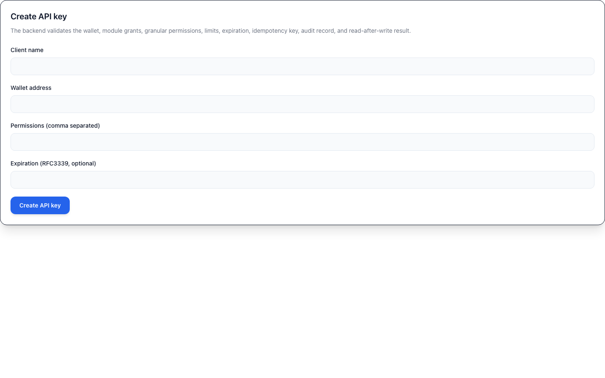](./pr7.admin.create-key-secret-cleared--desktop-light--target.png) | [](./pr7.admin.create-key-secret-cleared--desktop-light--diff.png) | 3.481% | The target clears the secret-once response on reload and returns to the Rust-backed creation form, proving that plaintext credentials are not persisted in browser state. The pinned source has no equivalent verified lifecycle, so this delta is required security behavior. | pre=PASS, post=PASS |
| `pr7.admin.create-key-secret-cleared` | `mobile-dark` | PASS; 2 clean repeats | [](./pr7.admin.create-key-secret-cleared--mobile-dark--source.png) | [](./pr7.admin.create-key-secret-cleared--mobile-dark--target.png) | [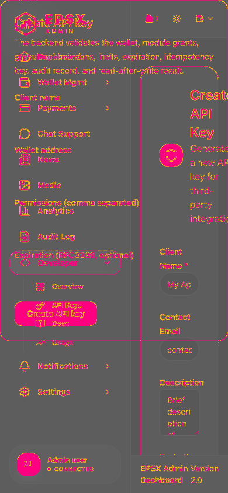](./pr7.admin.create-key-secret-cleared--mobile-dark--diff.png) | 6.9817% | The target clears the secret-once response on reload and returns to the Rust-backed creation form, proving that plaintext credentials are not persisted in browser state. The pinned source has no equivalent verified lifecycle, so this delta is required security behavior. | pre=PASS, post=PASS |
| `pr7.admin.create-key-secret-once` | `desktop-light` | PASS; 2 clean repeats | [](./pr7.admin.create-key-secret-once--desktop-light--source.png) | [](./pr7.admin.create-key-secret-once--desktop-light--target.png) | [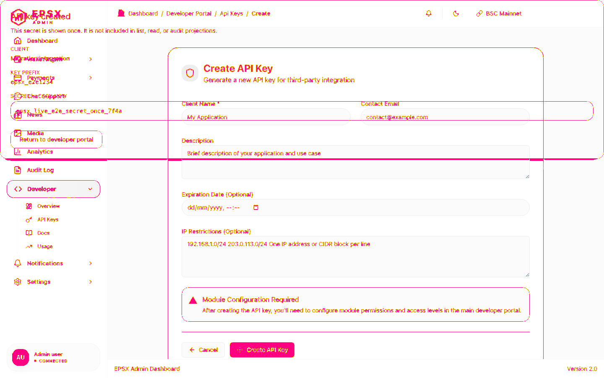](./pr7.admin.create-key-secret-once--desktop-light--diff.png) | 3.1311% | The target reveals the API-key secret only in the Rust BFF creation response and persists only its hash and audit record. The pinned source has no verified secret-once boundary; the visual difference is required security behavior. | pre=PASS, post=PASS |
| `pr7.admin.create-key-secret-once` | `mobile-dark` | PASS; 2 clean repeats | [](./pr7.admin.create-key-secret-once--mobile-dark--source.png) | [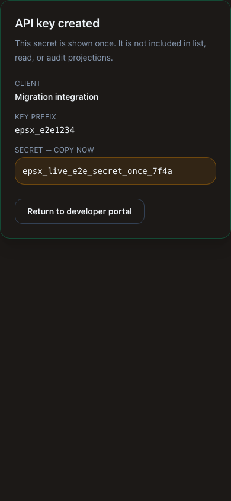](./pr7.admin.create-key-secret-once--mobile-dark--target.png) | [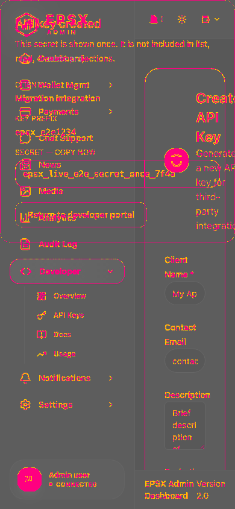](./pr7.admin.create-key-secret-once--mobile-dark--diff.png) | 5.4299% | The target reveals the API-key secret only in the Rust BFF creation response and persists only its hash and audit record. The pinned source has no verified secret-once boundary; the visual difference is required security behavior. | pre=PASS, post=PASS |
| `pr7.admin.portal-empty` | `desktop-light` | PASS; 2 clean repeats | [](./pr7.admin.portal-empty--desktop-light--source.png) | [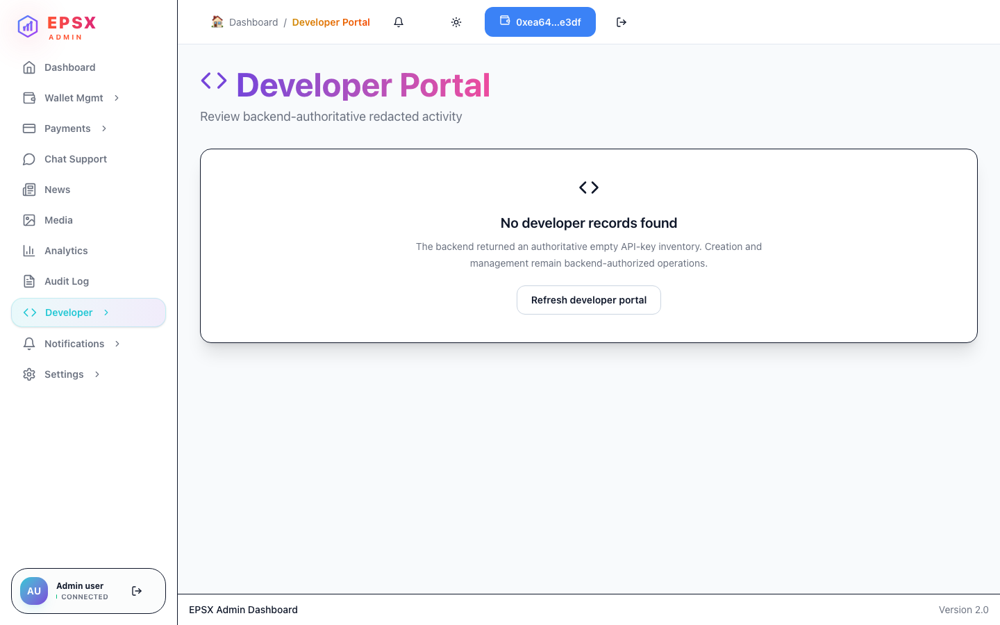](./pr7.admin.portal-empty--desktop-light--target.png) | [](./pr7.admin.portal-empty--desktop-light--diff.png) | 5.3617% | The target renders an authoritative empty registry only when the Rust BFF returns an empty owner-scoped projection. The pinned source calls unsupported legacy endpoints, so this state is a required backend-contract difference. | pre=PASS, post=PASS |
| `pr7.admin.portal-empty` | `mobile-dark` | PASS; 2 clean repeats | [](./pr7.admin.portal-empty--mobile-dark--source.png) | [](./pr7.admin.portal-empty--mobile-dark--target.png) | [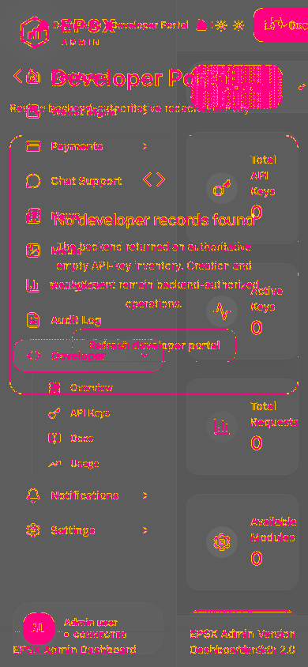](./pr7.admin.portal-empty--mobile-dark--diff.png) | 7.6352% | The target renders an authoritative empty registry only when the Rust BFF returns an empty owner-scoped projection. The pinned source calls unsupported legacy endpoints, so this state is a required backend-contract difference. | pre=PASS, post=PASS |
| `pr7.admin.portal-forbidden` | `desktop-light` | PASS; 2 clean repeats | [](./pr7.admin.portal-forbidden--desktop-light--source.png) | [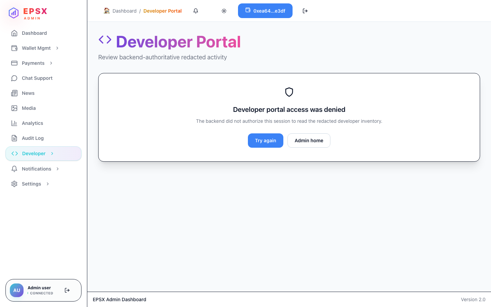](./pr7.admin.portal-forbidden--desktop-light--target.png) | [](./pr7.admin.portal-forbidden--desktop-light--diff.png) | 5.4965% | The target displays the Rust BFF permission denial and withholds the registry projection. The pinned source has no equivalent verified developer permission boundary and instead fails through legacy browser requests. | pre=PASS, post=PASS |
| `pr7.admin.portal-forbidden` | `mobile-dark` | PASS; 2 clean repeats | [](./pr7.admin.portal-forbidden--mobile-dark--source.png) | [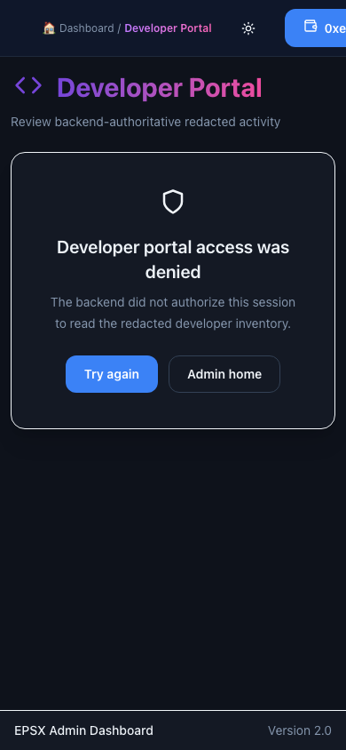](./pr7.admin.portal-forbidden--mobile-dark--target.png) | [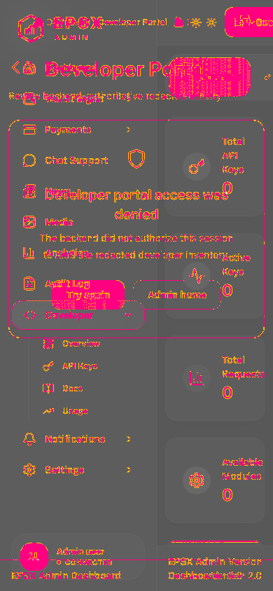](./pr7.admin.portal-forbidden--mobile-dark--diff.png) | 8.4178% | The target displays the Rust BFF permission denial and withholds the registry projection. The pinned source has no equivalent verified developer permission boundary and instead fails through legacy browser requests. | pre=PASS, post=PASS |
| `pr7.admin.portal-malformed` | `desktop-light` | PASS; 2 clean repeats | [](./pr7.admin.portal-malformed--desktop-light--source.png) | [](./pr7.admin.portal-malformed--desktop-light--target.png) | [](./pr7.admin.portal-malformed--desktop-light--diff.png) | 5.6036% | The target fails closed when a developer projection is malformed or contains secret-bearing fields. This deliberate redaction and rejection is required security behavior and cannot be replaced by the pinned source's legacy client projection. | pre=PASS, post=PASS |
| `pr7.admin.portal-malformed` | `mobile-dark` | PASS; 2 clean repeats | [](./pr7.admin.portal-malformed--mobile-dark--source.png) | [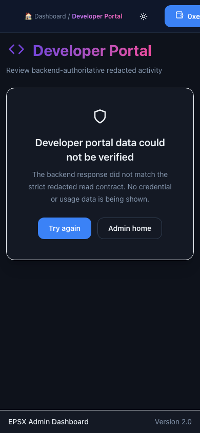](./pr7.admin.portal-malformed--mobile-dark--target.png) | [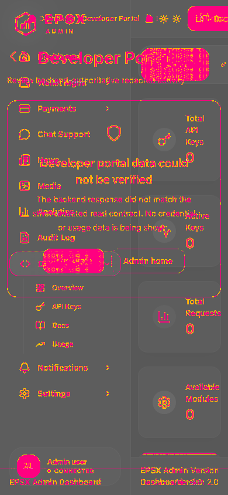](./pr7.admin.portal-malformed--mobile-dark--diff.png) | 8.5949% | The target fails closed when a developer projection is malformed or contains secret-bearing fields. This deliberate redaction and rejection is required security behavior and cannot be replaced by the pinned source's legacy client projection. | pre=PASS, post=PASS |
| `pr7.admin.portal-ready` | `desktop-light` | PASS; 2 clean repeats | [](./pr7.admin.portal-ready--desktop-light--source.png) | [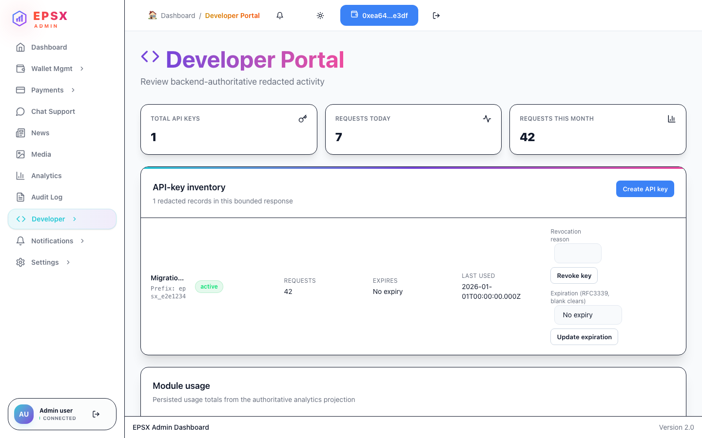](./pr7.admin.portal-ready--desktop-light--target.png) | [](./pr7.admin.portal-ready--desktop-light--diff.png) | 6.5465% | The target projects only the redacted API-key and usage records returned by the Rust admin BFF, while the pinned source uses legacy browser API paths. Secret, wallet, ownership, and audit decisions therefore remain backend-authoritative. | pre=PASS, post=PASS |
| `pr7.admin.portal-ready` | `mobile-dark` | PASS; 2 clean repeats | [](./pr7.admin.portal-ready--mobile-dark--source.png) | [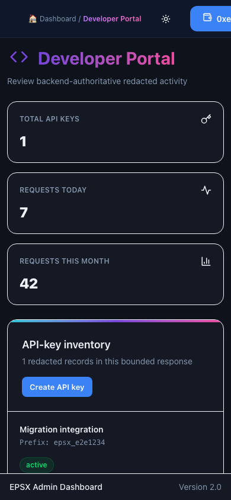](./pr7.admin.portal-ready--mobile-dark--target.png) | [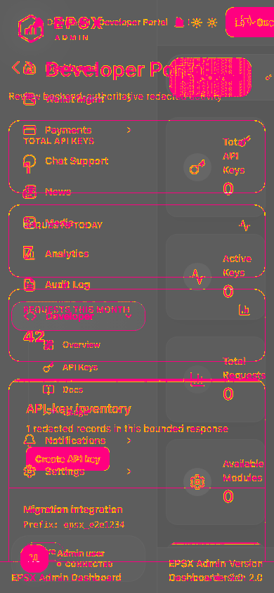](./pr7.admin.portal-ready--mobile-dark--diff.png) | 9.5716% | The target projects only the redacted API-key and usage records returned by the Rust admin BFF, while the pinned source uses legacy browser API paths. Secret, wallet, ownership, and audit decisions therefore remain backend-authoritative. | pre=PASS, post=PASS |
| `pr7.admin.portal-unavailable` | `desktop-light` | PASS; 2 clean repeats | [](./pr7.admin.portal-unavailable--desktop-light--source.png) | [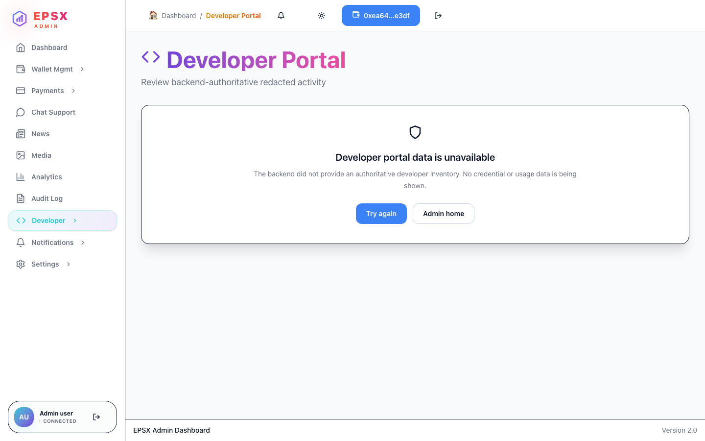](./pr7.admin.portal-unavailable--desktop-light--target.png) | [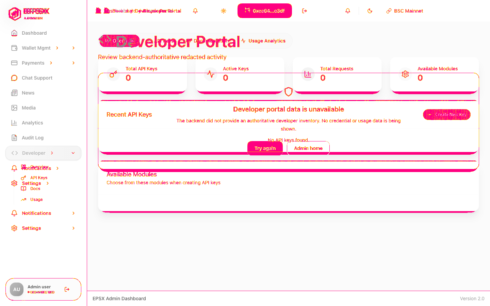](./pr7.admin.portal-unavailable--desktop-light--diff.png) | 5.5951% | The target preserves the backend dependency failure and does not fabricate an API-key inventory. The source's legacy browser endpoints are not an authoritative replacement for the Rust developer BFF. | pre=PASS, post=PASS |
| `pr7.admin.portal-unavailable` | `mobile-dark` | PASS; 2 clean repeats | [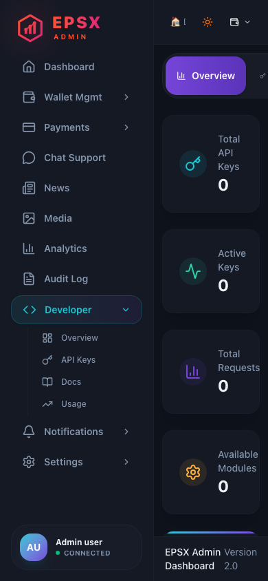](./pr7.admin.portal-unavailable--mobile-dark--source.png) | [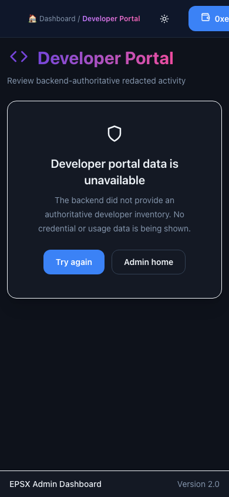](./pr7.admin.portal-unavailable--mobile-dark--target.png) | [](./pr7.admin.portal-unavailable--mobile-dark--diff.png) | 8.5588% | The target preserves the backend dependency failure and does not fabricate an API-key inventory. The source's legacy browser endpoints are not an authoritative replacement for the Rust developer BFF. | pre=PASS, post=PASS |
| `pr7.admin.revoke-key` | `desktop-light` | PASS; 2 clean repeats | [](./pr7.admin.revoke-key--desktop-light--source.png) | [](./pr7.admin.revoke-key--desktop-light--target.png) | [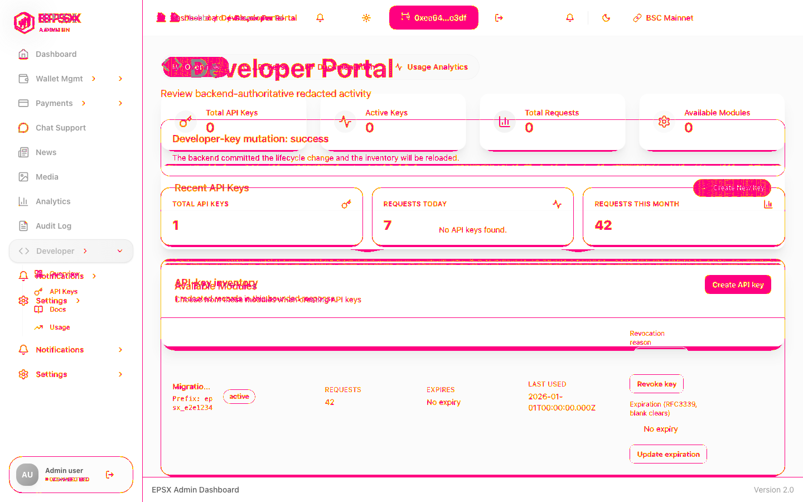](./pr7.admin.revoke-key--desktop-light--diff.png) | 5.7302% | The target acknowledges revocation only after the Rust BFF validates ownership, permission, and audit persistence. The pinned source uses unsupported legacy developer endpoints, so the visible mutation state is a required backend-authority difference. | pre=PASS, post=PASS |
| `pr7.admin.revoke-key` | `mobile-dark` | PASS; 2 clean repeats | [](./pr7.admin.revoke-key--mobile-dark--source.png) | [](./pr7.admin.revoke-key--mobile-dark--target.png) | [](./pr7.admin.revoke-key--mobile-dark--diff.png) | 9.2162% | The target acknowledges revocation only after the Rust BFF validates ownership, permission, and audit persistence. The pinned source uses unsupported legacy developer endpoints, so the visible mutation state is a required backend-authority difference. | pre=PASS, post=PASS |
| `pr7.frontend.developer-unavailable` | `desktop-light` | PASS; 2 clean repeats | [](./pr7.frontend.developer-unavailable--desktop-light--source.png) | [](./pr7.frontend.developer-unavailable--desktop-light--target.png) | [](./pr7.frontend.developer-unavailable--desktop-light--diff.png) | 71.9209% | The pinned source exposes an owner API-key inventory without a verified Rust ownership projection. The target fails closed and renders only the backend-owned unavailable state, never projecting a live secret or unverified usage claim. | pre=PASS, post=PASS |
| `pr7.frontend.developer-unavailable` | `mobile-dark` | PASS; 2 clean repeats | [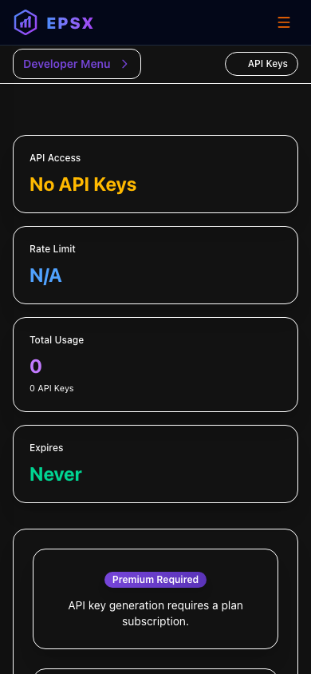](./pr7.frontend.developer-unavailable--mobile-dark--source.png) | [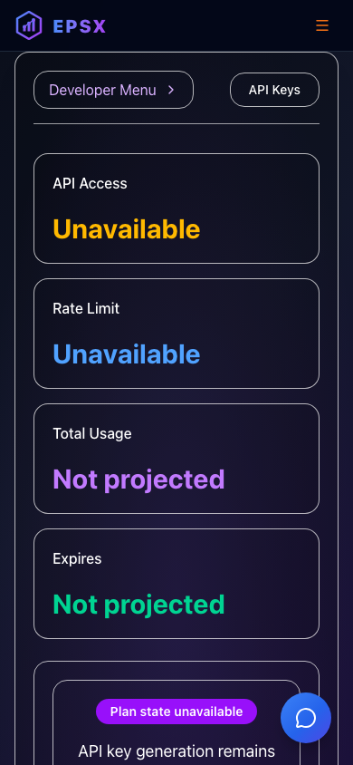](./pr7.frontend.developer-unavailable--mobile-dark--target.png) | [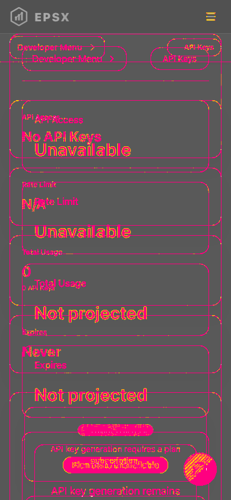](./pr7.frontend.developer-unavailable--mobile-dark--diff.png) | 9.9171% | The pinned source exposes an owner API-key inventory without a verified Rust ownership projection. The target fails closed and renders only the backend-owned unavailable state, never projecting a live secret or unverified usage claim. | pre=PASS, post=PASS |
| `pr7.frontend.docs` | `desktop-light` | PASS; 2 clean repeats | [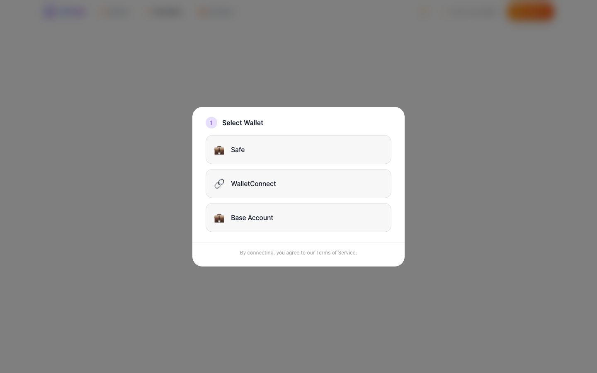](./pr7.frontend.docs--desktop-light--source.png) | [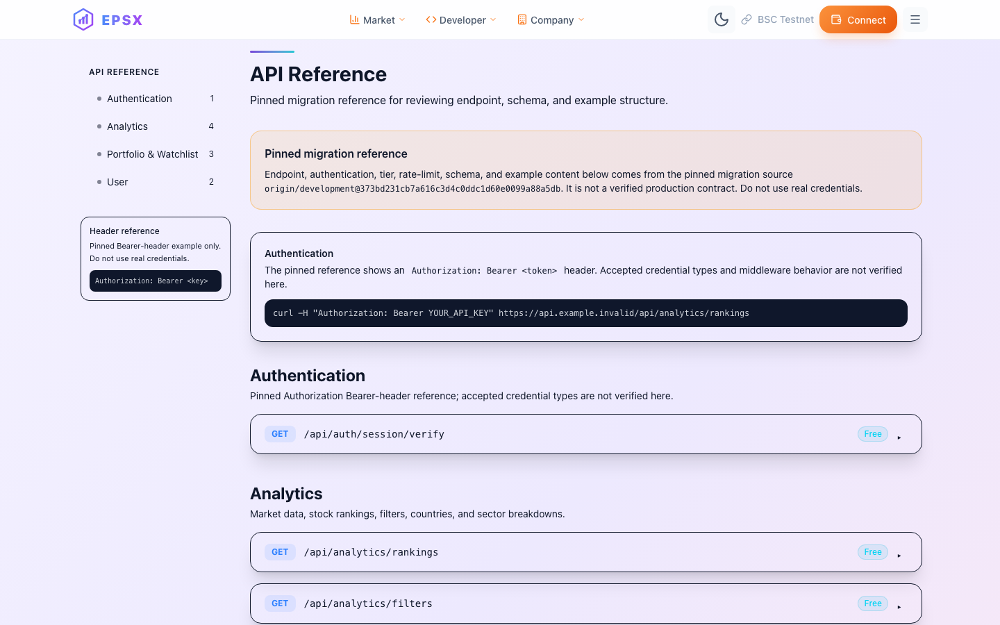](./pr7.frontend.docs--desktop-light--target.png) | [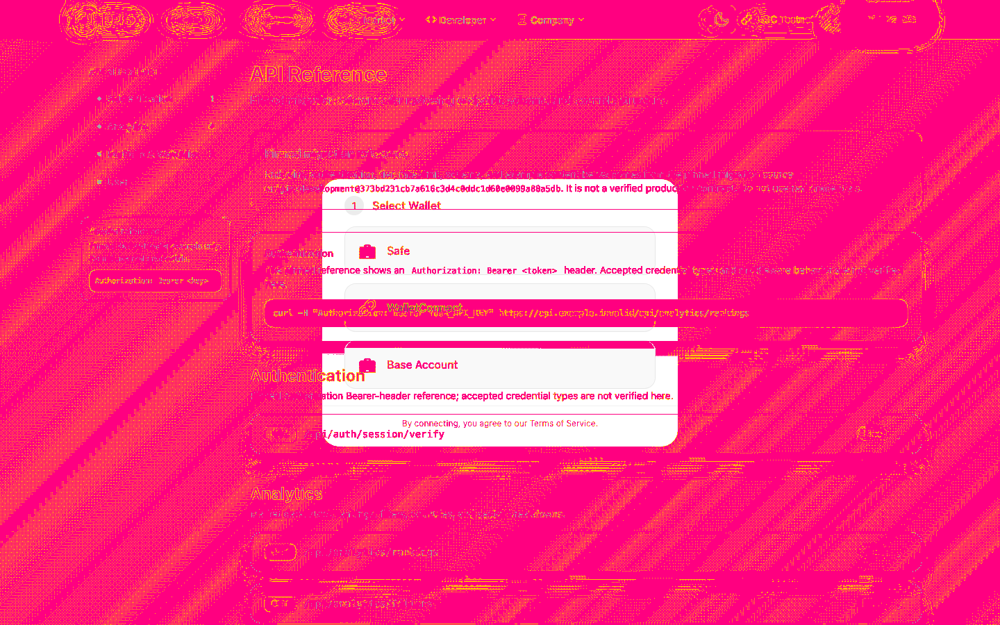](./pr7.frontend.docs--desktop-light--diff.png) | 78.7378% | The target serves a version-pinned, explicitly warned OpenAPI reference from the migration source snapshot instead of presenting an unverified live developer contract. The large delta is the required removal of unsupported documentation claims, not styling. | pre=PASS, post=PASS |
| `pr7.frontend.docs` | `mobile-dark` | PASS; 2 clean repeats | [](./pr7.frontend.docs--mobile-dark--source.png) | [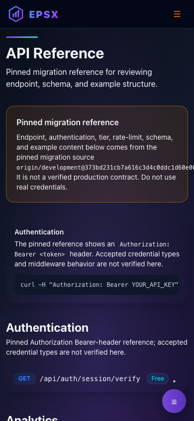](./pr7.frontend.docs--mobile-dark--target.png) | [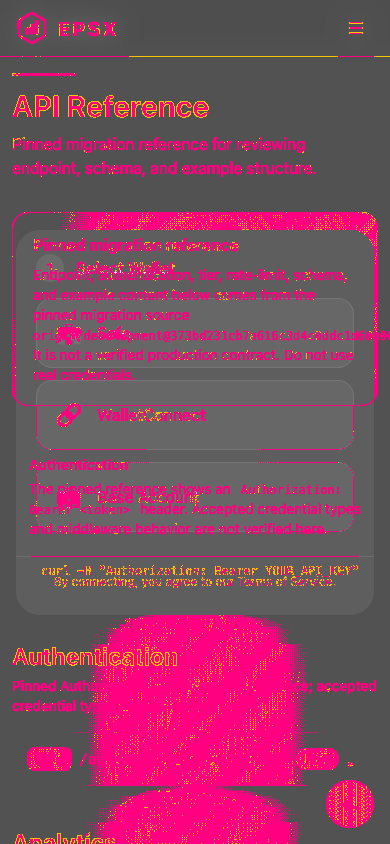](./pr7.frontend.docs--mobile-dark--diff.png) | 22.6522% | The target serves a version-pinned, explicitly warned OpenAPI reference from the migration source snapshot instead of presenting an unverified live developer contract. The large delta is the required removal of unsupported documentation claims, not styling. | pre=PASS, post=PASS |
| `pr7.frontend.usage-unavailable` | `desktop-light` | PASS; 2 clean repeats | [](./pr7.frontend.usage-unavailable--desktop-light--source.png) | [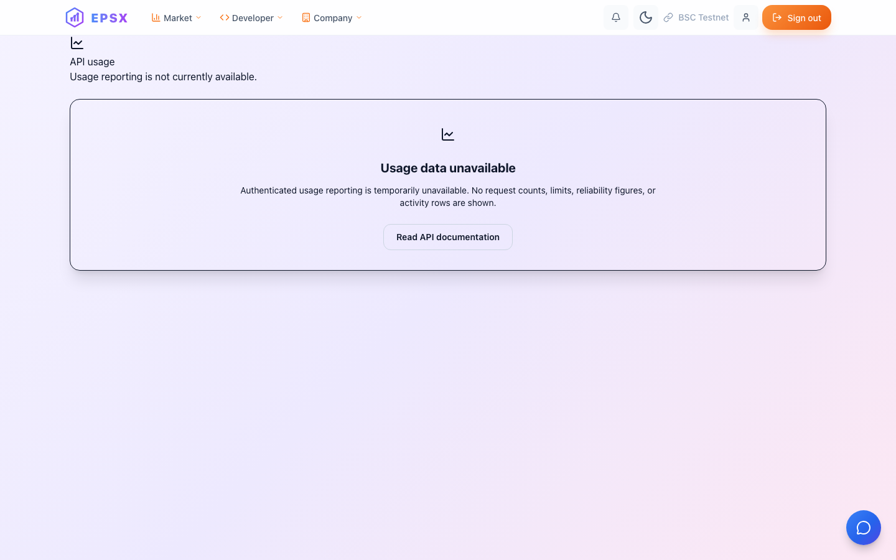](./pr7.frontend.usage-unavailable--desktop-light--target.png) | [](./pr7.frontend.usage-unavailable--desktop-light--diff.png) | 4.6822% | The pinned source renders usage figures without a verified owner-isolated meter. The target refuses to invent request counts and shows the backend-owned unavailable projection until the Rust usage contract is present. | pre=PASS, post=PASS |
| `pr7.frontend.usage-unavailable` | `mobile-dark` | PASS; 2 clean repeats | [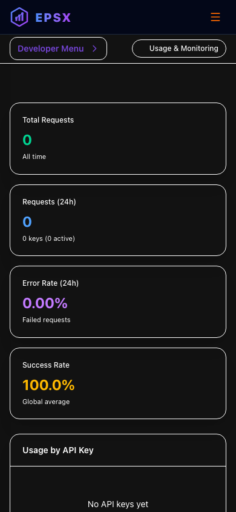](./pr7.frontend.usage-unavailable--mobile-dark--source.png) | [](./pr7.frontend.usage-unavailable--mobile-dark--target.png) | [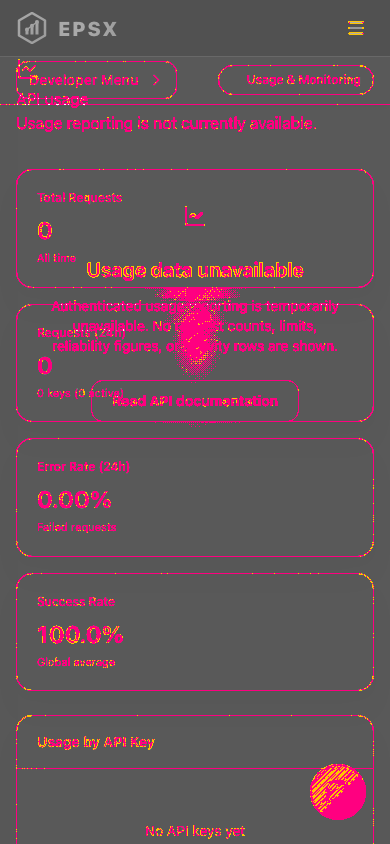](./pr7.frontend.usage-unavailable--mobile-dark--diff.png) | 7.1227% | The pinned source renders usage figures without a verified owner-isolated meter. The target refuses to invent request counts and shows the backend-owned unavailable projection until the Rust usage contract is present. | pre=PASS, post=PASS |

## Backend-authoritative contract evidence

| Suite | Group | Result | Clean repeats | Rust tests per repeat | Claims | Source anchors |
|---|---:|---|---:|---:|---|---|
| `pr2.admin-session-boundary` | 2 | PASS | 2 | 161 | SIWE exchange requires the admin audience; frontend and multiple audiences cannot establish admin authority; refresh rotation, rejection, transport failure, and logout fail closed; backend profile permissions remain verbatim; unauthenticated and under-permissioned requests stop before upstream access | `apps/admin/src/session_auth.rs`<br>`apps/admin/src/session_auth_tests.rs`<br>`apps/admin/src/auth.rs`<br>`apps/admin/src/main.rs` |
| `pr2.frontend-session-boundary` | 2 | PASS | 2 | 127 | invalid login and identity mismatch set no session; refresh rotates the verified cookie pair without replay; refresh dependency failure clears unprovable sessions; logout clears canonical and legacy cookies; profile and account data stay bound to the verified owner | `apps/frontend/src/api.rs`<br>`apps/frontend/src/auth.rs`<br>`apps/frontend/src/ssr.rs` |
| `pr2.identity-service-policy` | 2 | PASS | 2 | 8 | identity routes require exact audiences and literal permissions; spoofable owner headers are stripped; malformed credentials and hidden lifecycle routes fail closed; dependency verifier failures do not expose protected handlers | `services/identity/src/lib.rs` |
| `pr2.identity-token-contracts` | 2 | PASS | 2 | 34 | SIWE nonce entropy and replay-state classification; refresh client and family-state isolation; revoked, consumed, replayed, and invalid refresh states fail closed; single exact access-token audience; RS256 issuer, audience, algorithm, and key-id validation; persistent signing material survives service reconstruction | `shared/rust/epsx-identity-shared/src/auth_service.rs`<br>`shared/rust/epsx-identity-shared/src/token_service.rs`<br>`shared/rust/epsx-identity-shared/src/key_manager.rs`<br>`shared/rust/epsx-identity-shared/src/refresh_token_digest.rs` |
| `pr2.service-auth-boundary` | 2 | PASS | 2 | 8 | frontend and admin audiences are exact and isolated; wrong audience, issuer, expiry, algorithm, and unknown keys are rejected; permission wildcard grammar does not widen authority | `shared/rust/epsx-service-auth/src/lib.rs` |
| `pr3.admin-audit-adapter` | 3 | PASS | 2 | 7 | audit reads accept only bounded backend summaries; invalid filters and cursors fail before upstream access; duplicate, unsorted, or malformed audit records are rejected; sensitive actor and metadata fields never enter the UI projection | `apps/admin/src/audit_log_adapter.rs` |
| `pr3.admin-commerce-adapter` | 3 | PASS | 2 | 4 | wallet, credit, access, and plan DTOs reject unknown or malformed fields; wallet and plan identifiers are canonical before upstream I/O; optimistic conflicts and forbidden mutations remain distinct; mutation success requires evidence-bearing backend responses | `apps/admin/src/commerce_adapter.rs` |
| `pr3.subscription-service-policy` | 3 | PASS | 2 | 10 | plan and access reads require their literal read permissions; plan and access mutations require their literal manage permissions; audience and owner isolation are enforced by the Rust service; spoofed headers and hidden paths cannot widen authority | `services/subscription/src/lib.rs` |
| `pr3.wallet-service-policy` | 3 | PASS | 2 | 12 | wallet and credit reads require exact read permissions; wallet and credit mutations require exact manage permissions; frontend owners cannot cross wallet boundaries; admin and frontend audiences remain isolated; spoofed owner headers and unsafe paths fail closed | `services/wallet/src/lib.rs` |
| `pr4.admin-analytics-adapter` | 4 | PASS | 2 | 2 | admin analytics accepts only its exact backend envelope; freshness is injected from the verified envelope rather than upstream data; fabricated telemetry and unknown fields are rejected; ready and authoritative empty projections preserve the backend timestamp | `apps/admin/src/analytics_admin_adapter.rs`<br>`shared/rust/dioxus_ui/src/pages/admin_pages/analytics.rs` |
| `pr4.admin-dashboard-adapter` | 4 | PASS | 2 | 9 | dashboard counts and observation time come only from the strict backend envelope; forbidden, unavailable, and malformed states remain distinct; health, uptime, activity, and permission metrics are not invented; invalid counts, timestamps, redirects, and oversized bodies fail closed | `apps/admin/src/dashboard_user_status_adapter.rs`<br>`shared/rust/dioxus_ui/src/pages/admin_pages/dashboard.rs` |
| `pr4.analytics-service-policy` | 4 | PASS | 2 | 10 | administrator analytics reads require the exact admin audience; analytics and audit reads require their literal permissions; untrusted owner headers and hidden routes cannot widen access; unsafe filters and cursors fail before data access | `services/analytics/src/lib.rs` |
| `pr4.backend-ranking-policy` | 4 | PASS | 2 | 32 | ranking offsets are resolved from the backend authority port; locked ranks cannot be recovered through pagination or limit changes; cache keys isolate distinct backend ranking offsets; malformed, overflowing, or unavailable authority fails closed | `apps/backend/src/web/analytics/eps/cache.rs`<br>`apps/backend/src/web/analytics/eps/rankings.rs`<br>`apps/backend/src/domain/market_analytics/services/eps_ranking_service.rs` |
| `pr4.frontend-analytics-adapter` | 4 | PASS | 2 | 4 | only canonical filter, sort, and pagination query fields reach analytics; ranking, access, freshness, filters, and watchlist projections are validated; empty, unavailable, and malformed responses remain distinct; unsupported dashboard and portfolio decisions are not inferred | `apps/frontend/src/ssr.rs`<br>`shared/rust/dioxus_ui/src/pages/analytics.rs`<br>`shared/rust/dioxus_ui/src/pages/portfolio.rs`<br>`shared/rust/dioxus_ui/src/pages/dashboard.rs` |
| `pr5-admin-media-bff` | 5 | PASS | 2 | 9 | media inventory exposes bounded metadata without storage credentials; upload and deletion outcomes require strict backend evidence | `apps/admin/src/media_adapter.rs` |
| `pr5-admin-news-bff` | 5 | PASS | 2 | 14 | admin news reads and writes require verified backend projections; revision conflicts and malformed lifecycle results fail closed | `apps/admin/src/news_adapter.rs` |
| `pr5-content-service` | 5 | PASS | 2 | 8 | publication lifecycle remains in the Rust content service; revisions, authorization, and cache invalidation fail closed | `services/content/src/lib.rs` |
| `pr5-frontend-news-bff` | 5 | PASS | 2 | 10 | public list and detail envelopes are strict and bounded; not-found, malformed, and unavailable outcomes never become content | `apps/frontend/src/api.rs` |
| `pr6-admin-chat-bff` | 6 | PASS | 2 | 2 | chat list detail and messages require strict backend envelopes; ownership status assignment and retries remain backend decisions | `apps/admin/src/chat_admin_adapter.rs` |
| `pr6-admin-notification-bff` | 6 | PASS | 2 | 17 | admin reads redact recipient body and provider errors; send mutation and metrics require strict backend evidence | `apps/admin/src/notification_admin_adapter.rs` |
| `pr6-frontend-notification-bff` | 6 | PASS | 2 | 20 | list preferences mutations stream replay and push remain owner-bound; malformed dependencies never become authoritative empty state | `apps/frontend/src/api.rs`<br>`apps/frontend/src/ssr.rs` |
| `pr6-gateway-chat-policy` | 6 | PASS | 2 | 1 | chat history owner selectors are injected by the Rust gateway; caller supplied owner identities are rejected | `services/gateway/src/policy.rs` |
| `pr6-notification-binary-boundaries` | 6 | PASS | 2 | 42 | push subscription and delivery validation fail closed with stable provider identities; stream cursors remain owner scoped and notification payloads remain bounded; template composition provider callbacks and preference inputs reject malformed data | `services/notification/src/main.rs` |
| `pr6-notification-delivery-runtime` | 6 | PASS | 2 | 1 | dead-letter and redrive transitions remain durable and auditable; an expired worker lease is reclaimed after restart without losing the job | `services/notification/src/delivery.rs` |
| `pr6-notification-preferences-runtime` | 6 | PASS | 2 | 1 | quiet hours are calculated from the persisted timezone and defer delivery; disabled channels are suppressed without fabricating successful delivery | `services/notification/src/main.rs` |
| `pr6-notification-provider-runtime` | 6 | PASS | 2 | 1 | signed provider callbacks reconcile durable delivery state; replayed provider events remain idempotent and auditable | `services/notification/src/main.rs` |
| `pr6-notification-redis-runtime` | 6 | PASS | 2 | 1 | Redis fanout wakes independent notification stream instances; Redis loss remains bounded and preserves the local PostgreSQL replay wake-up | `services/notification/src/main.rs` |
| `pr6-notification-service` | 6 | PASS | 2 | 20 | delivery deduplication quiet hours and provider outcomes remain in Rust; SSE replay push lifecycle worker restart and Redis loss fail closed | `services/notification/src/lib.rs`<br>`services/notification/src/delivery.rs` |
| `pr6-notification-stream-runtime` | 6 | PASS | 2 | 1 | SSE replay cursors and acknowledgements remain bound to the verified owner; cross-owner cursor reuse cannot advance or expose another owner's stream | `services/notification/src/main.rs` |
| `pr6-notification-template-runtime` | 6 | PASS | 2 | 1 | template revisions and rollback restore the exact body; template rollback emits an auditable durable history | `services/notification/src/main.rs` |
| `pr7-admin-developer-bff` | 7 | PASS | 2 | 5 | plaintext secrets exist only in the creation response; list usage lifecycle and malformed outcomes are strict and redacted | `apps/admin/src/developer_portal_adapter.rs` |
| `pr7-backend-developer-authority` | 7 | PASS | 2 | 2 | API-key ownership lifecycle and usage remain backend-owned; creation revocation and expiration require audit evidence | `apps/backend/src/web/admin/developer_portal_handlers.rs`<br>`apps/backend/src/infrastructure/adapters/repositories/developer_portal/api_key_repository.rs` |
| `pr7-rate-plan-enforcement` | 7 | PASS | 2 | 3 | global user API-key and plan limits are enforced in Rust; usage windows are deterministic and isolated per principal | `apps/backend/src/web/middleware/multi_level_rate_limiter.rs` |

Each repeat has a checksummed Cargo log plus guarded pre/post PostgreSQL, Redis, Anvil, and fixture reset proofs in the full artifact. Test counts and ignored-test counts must be stable, every command must pass, and ignored tests are forbidden.

## Contact sheets

Each sheet is ordered **Next.js source → Rust/Dioxus target → highlighted pixel diff**.

### pr7.admin.create-key-conflict — desktop-light

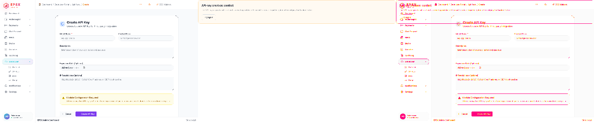

### pr7.admin.create-key-conflict — mobile-dark

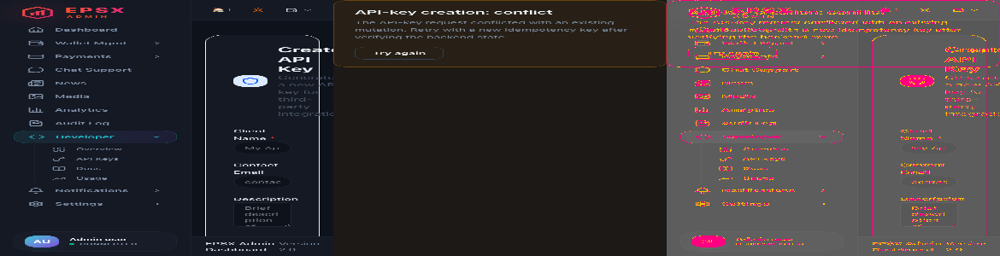

### pr7.admin.create-key-form — desktop-light

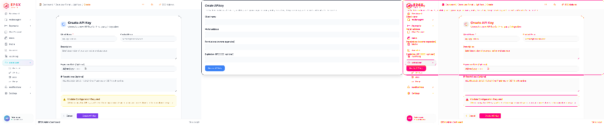

### pr7.admin.create-key-form — mobile-dark


### pr7.admin.create-key-secret-cleared — desktop-light

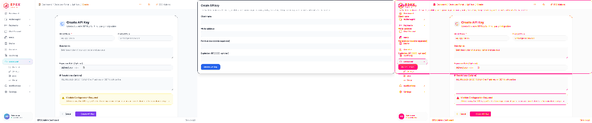

### pr7.admin.create-key-secret-cleared — mobile-dark

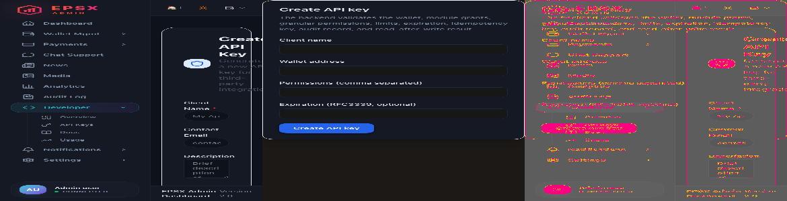

### pr7.admin.create-key-secret-once — desktop-light

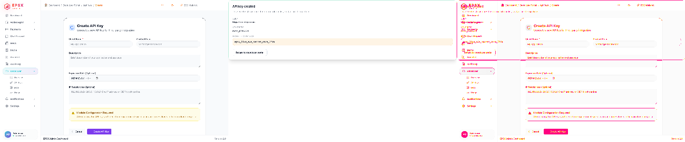

### pr7.admin.create-key-secret-once — mobile-dark

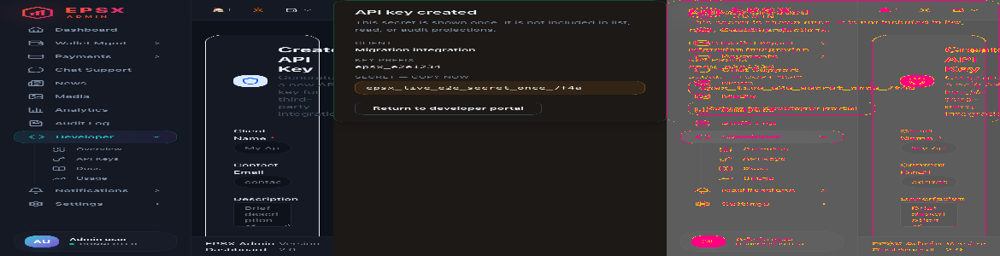

### pr7.admin.portal-empty — desktop-light

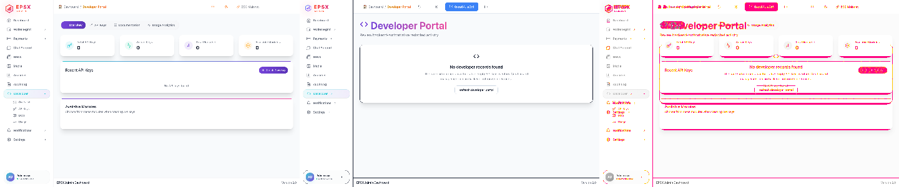

### pr7.admin.portal-empty — mobile-dark

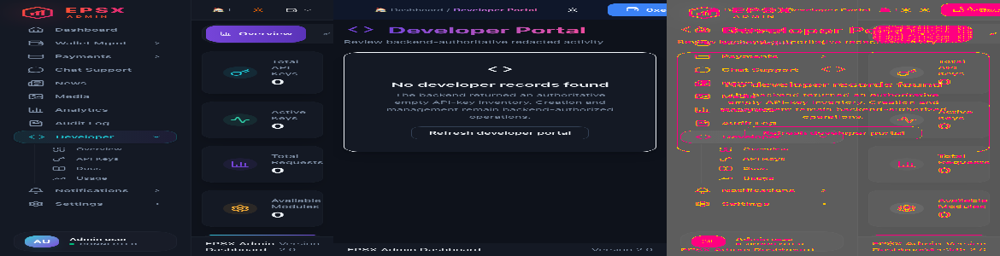

### pr7.admin.portal-forbidden — desktop-light

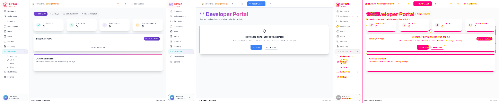

### pr7.admin.portal-forbidden — mobile-dark


### pr7.admin.portal-malformed — desktop-light


### pr7.admin.portal-malformed — mobile-dark


### pr7.admin.portal-ready — desktop-light

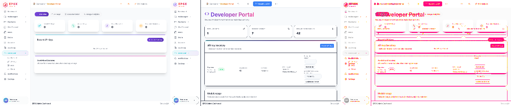

### pr7.admin.portal-ready — mobile-dark

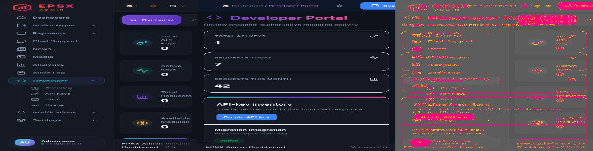

### pr7.admin.portal-unavailable — desktop-light


### pr7.admin.portal-unavailable — mobile-dark

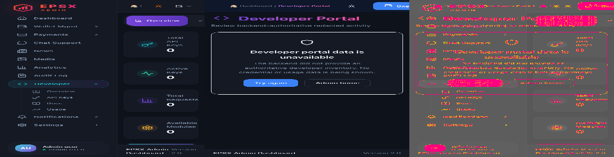

### pr7.admin.revoke-key — desktop-light


### pr7.admin.revoke-key — mobile-dark


### pr7.frontend.developer-unavailable — desktop-light

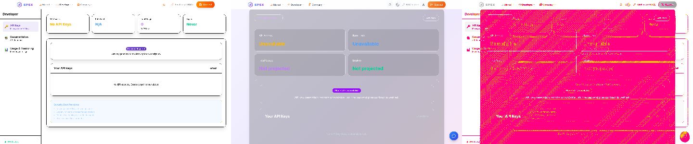

### pr7.frontend.developer-unavailable — mobile-dark

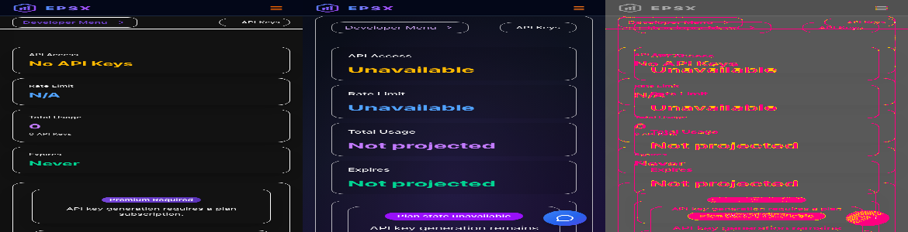

### pr7.frontend.docs — desktop-light


### pr7.frontend.docs — mobile-dark

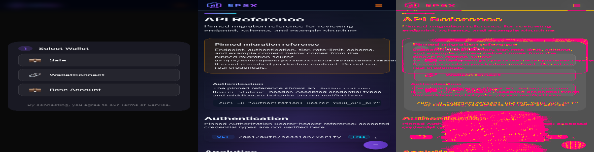

### pr7.frontend.usage-unavailable — desktop-light


### pr7.frontend.usage-unavailable — mobile-dark


## Runtime rollback gate

Every repeat restored a guarded `epsx_e2e_*` PostgreSQL database from its template, deleted only the `epsx:e2e:*` Redis namespace, reverted Anvil chain 31337 to its recorded snapshot, reset fixture requests/mutations, and cleared its isolated browser context. PostgreSQL checksums and row counts, transient queue/outbox emptiness, Redis hashes, Anvil account/block state, and fixture counters matched the baseline after reset.

Final process-stopped rollback: **PASS**. The source and target applications were stopped before the final reset and smoke, preventing background polling from repopulating fixture or durable state. The full artifact manifest includes `reset-final.json` with every baseline comparison.

## Full artifacts

The CI artifact contains full-resolution PNGs, video, traces, HAR/network data, DOM, accessibility snapshots, browser/server logs, Playwright HTML, and reset proofs. [`artifact-manifest.json`](./artifact-manifest.json) records the SHA-256 and byte length of every file in that artifact.

## Reproduce

```bash
bun install --frozen-lockfile
bunx playwright install chromium
bun e2e/migration/cli.ts run --group 7
bun e2e/migration/cli.ts verify-artifacts --group 7
```
