# PR 8 — cumulative migration E2E evidence

Result: **PASS**

Source Next.js SHA: `373bd231cb7a616c3d4c0ddc1d60e0099a88a5db`

Target Rust/Dioxus SHA: `3b32d6d18ec93053523041c950bcd49eefeb6f19`

Generated: 2026-07-31T22:02:02.032Z

This report covers every executable scenario owned by cumulative groups 0–8. Visual differences above 1% require a machine-readable non-styling exception.

## Scenario evidence

| Scenario | Matrix | Result / coverage | Next.js | Rust/Dioxus | Highlighted diff | Δ pixels | Difference disposition | Reset proof |
|---|---|---|---|---|---|---:|---|---|
| `pr8.admin.intent-cancel-conflict` | `desktop-light` | PASS; 2 clean repeats | [](./pr8.admin.intent-cancel-conflict--desktop-light--source.png) | [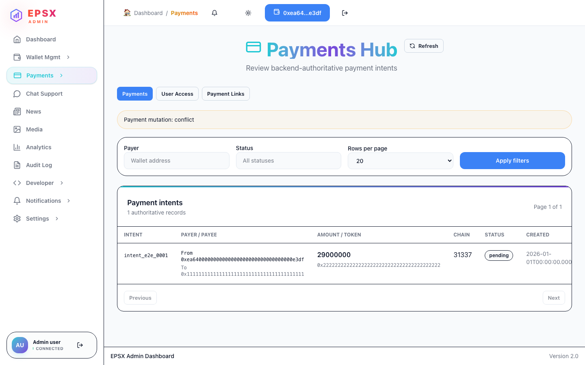](./pr8.admin.intent-cancel-conflict--desktop-light--target.png) | [](./pr8.admin.intent-cancel-conflict--desktop-light--diff.png) | 7.4998% | The target preserves the Rust payment service's optimistic-concurrency conflict and withholds a cancellation success claim. The pinned source does not expose an equivalent verified conflict boundary, so this delta is required backend behavior. | pre=PASS, post=PASS |
| `pr8.admin.intent-cancel-conflict` | `mobile-dark` | PASS; 2 clean repeats | [](./pr8.admin.intent-cancel-conflict--mobile-dark--source.png) | [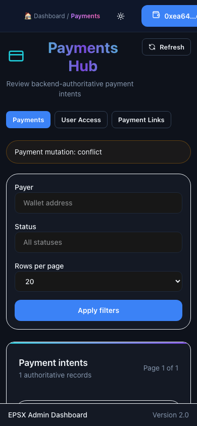](./pr8.admin.intent-cancel-conflict--mobile-dark--target.png) | [](./pr8.admin.intent-cancel-conflict--mobile-dark--diff.png) | 13.1577% | The target preserves the Rust payment service's optimistic-concurrency conflict and withholds a cancellation success claim. The pinned source does not expose an equivalent verified conflict boundary, so this delta is required backend behavior. | pre=PASS, post=PASS |
| `pr8.admin.intent-cancel` | `desktop-light` | PASS; 2 clean repeats | [](./pr8.admin.intent-cancel--desktop-light--source.png) | [](./pr8.admin.intent-cancel--desktop-light--target.png) | [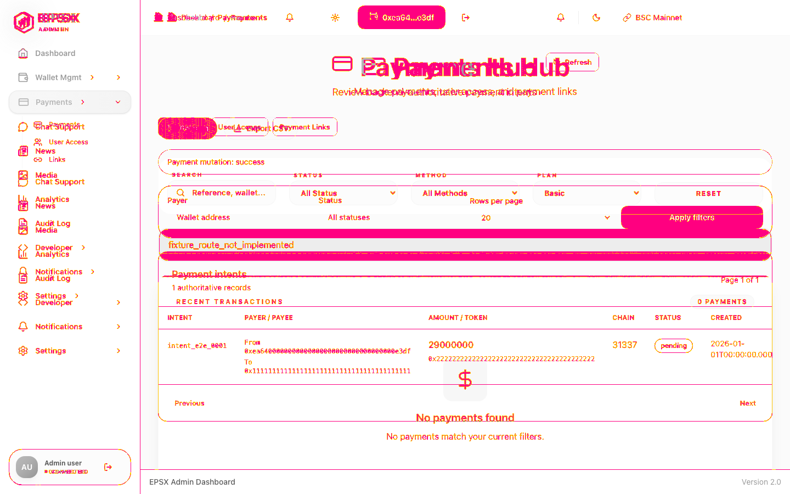](./pr8.admin.intent-cancel--desktop-light--diff.png) | 7.502% | The target reports the Rust payment service's versioned cancellation acknowledgement through the BFF mutation redirect, while the pinned source has no equivalent verified lifecycle state. The visible status difference is required by backend authority, not styling. | pre=PASS, post=PASS |
| `pr8.admin.intent-cancel` | `mobile-dark` | PASS; 2 clean repeats | [](./pr8.admin.intent-cancel--mobile-dark--source.png) | [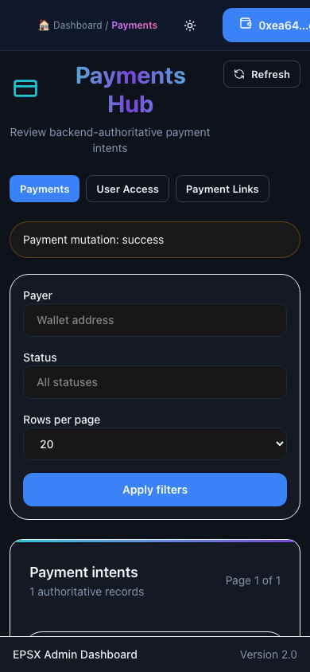](./pr8.admin.intent-cancel--mobile-dark--target.png) | [](./pr8.admin.intent-cancel--mobile-dark--diff.png) | 13.1681% | The target reports the Rust payment service's versioned cancellation acknowledgement through the BFF mutation redirect, while the pinned source has no equivalent verified lifecycle state. The visible status difference is required by backend authority, not styling. | pre=PASS, post=PASS |
| `pr8.admin.intents-empty` | `desktop-light` | PASS; 2 clean repeats | [](./pr8.admin.intents-empty--desktop-light--source.png) | [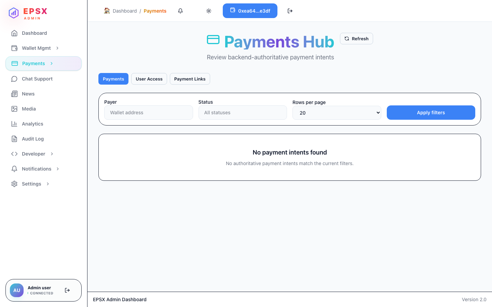](./pr8.admin.intents-empty--desktop-light--target.png) | [](./pr8.admin.intents-empty--desktop-light--diff.png) | 8.8604% | The target displays an authoritative empty payment-intent inventory from the Rust payment service instead of fabricating rows from legacy browser data. | pre=PASS, post=PASS |
| `pr8.admin.intents-empty` | `mobile-dark` | PASS; 2 clean repeats | [](./pr8.admin.intents-empty--mobile-dark--source.png) | [](./pr8.admin.intents-empty--mobile-dark--target.png) | [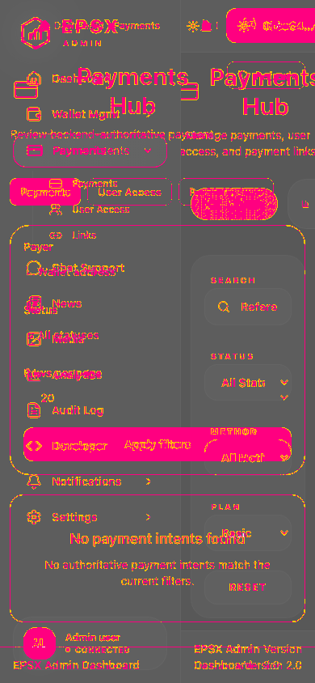](./pr8.admin.intents-empty--mobile-dark--diff.png) | 12.6492% | The target displays an authoritative empty payment-intent inventory from the Rust payment service instead of fabricating rows from legacy browser data. | pre=PASS, post=PASS |
| `pr8.admin.intents-malformed` | `desktop-light` | PASS; 2 clean repeats | [](./pr8.admin.intents-malformed--desktop-light--source.png) | [](./pr8.admin.intents-malformed--desktop-light--target.png) | [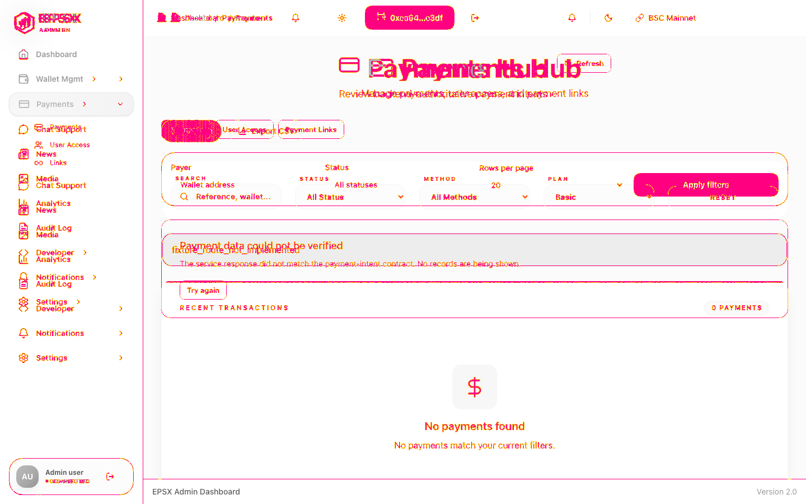](./pr8.admin.intents-malformed--desktop-light--diff.png) | 4.339% | The target fails closed on a malformed payment-intent contract and renders no fabricated financial data. The state difference is required by the Rust BFF's strict security boundary. | pre=PASS, post=PASS |
| `pr8.admin.intents-malformed` | `mobile-dark` | PASS; 2 clean repeats | [](./pr8.admin.intents-malformed--mobile-dark--source.png) | [](./pr8.admin.intents-malformed--mobile-dark--target.png) | [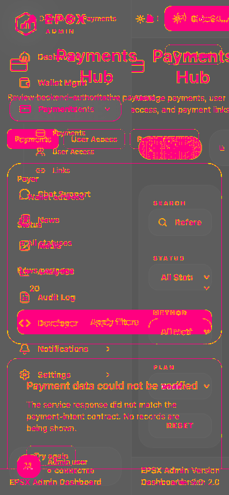](./pr8.admin.intents-malformed--mobile-dark--diff.png) | 12.8515% | The target fails closed on a malformed payment-intent contract and renders no fabricated financial data. The state difference is required by the Rust BFF's strict security boundary. | pre=PASS, post=PASS |
| `pr8.admin.intents-ready` | `desktop-light` | PASS; 2 clean repeats | [](./pr8.admin.intents-ready--desktop-light--source.png) | [](./pr8.admin.intents-ready--desktop-light--target.png) | [](./pr8.admin.intents-ready--desktop-light--diff.png) | 9.5717% | The target renders only the redacted, typed payment-intent projection verified by the Rust BFF. The pinned source has no equivalent backend-owned projection contract. | pre=PASS, post=PASS |
| `pr8.admin.intents-ready` | `mobile-dark` | PASS; 2 clean repeats | [](./pr8.admin.intents-ready--mobile-dark--source.png) | [](./pr8.admin.intents-ready--mobile-dark--target.png) | [](./pr8.admin.intents-ready--mobile-dark--diff.png) | 13.2379% | The target renders only the redacted, typed payment-intent projection verified by the Rust BFF. The pinned source has no equivalent backend-owned projection contract. | pre=PASS, post=PASS |
| `pr8.admin.intents-unavailable` | `desktop-light` | PASS; 2 clean repeats | [](./pr8.admin.intents-unavailable--desktop-light--source.png) | [](./pr8.admin.intents-unavailable--desktop-light--target.png) | [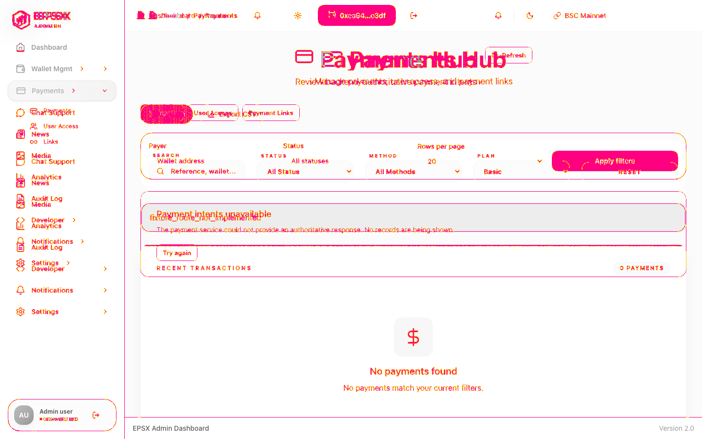](./pr8.admin.intents-unavailable--desktop-light--diff.png) | 4.3379% | The target preserves the Rust payment dependency failure and withholds an unverifiable intent list. This is a required service-owned state, not styling. | pre=PASS, post=PASS |
| `pr8.admin.intents-unavailable` | `mobile-dark` | PASS; 2 clean repeats | [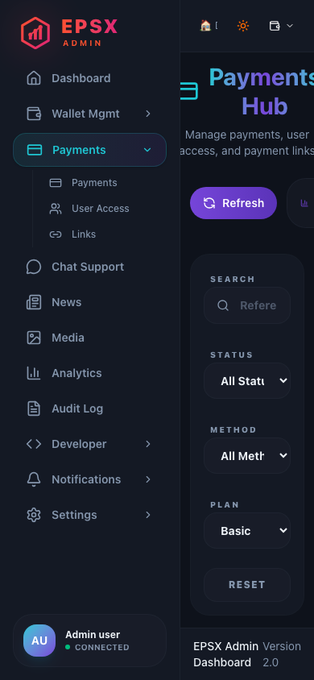](./pr8.admin.intents-unavailable--mobile-dark--source.png) | [](./pr8.admin.intents-unavailable--mobile-dark--target.png) | [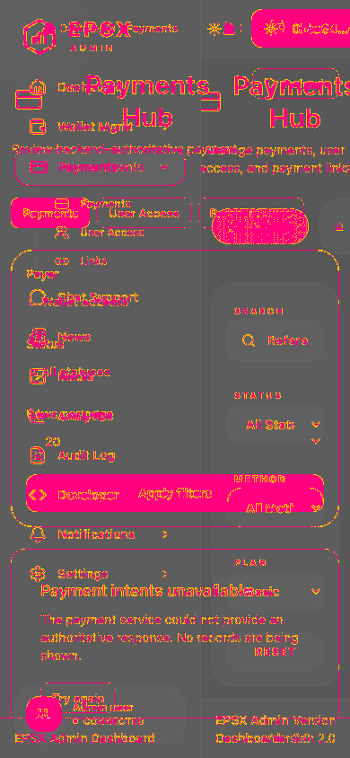](./pr8.admin.intents-unavailable--mobile-dark--diff.png) | 12.8488% | The target preserves the Rust payment dependency failure and withholds an unverifiable intent list. This is a required service-owned state, not styling. | pre=PASS, post=PASS |
| `pr8.admin.link-create` | `desktop-light` | PASS; 2 clean repeats | [](./pr8.admin.link-create--desktop-light--source.png) | [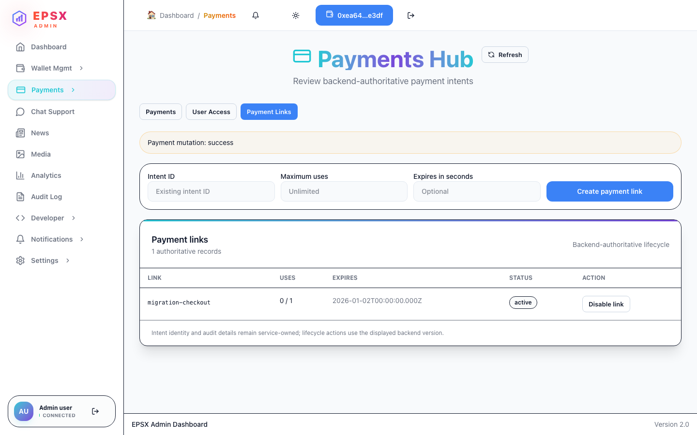](./pr8.admin.link-create--desktop-light--target.png) | [](./pr8.admin.link-create--desktop-light--diff.png) | 7.5954% | The target acknowledges payment-link creation only through the Rust payment service and its versioned audit evidence. The pinned source has no equivalent verified lifecycle boundary. | pre=PASS, post=PASS |
| `pr8.admin.link-create` | `mobile-dark` | PASS; 2 clean repeats | [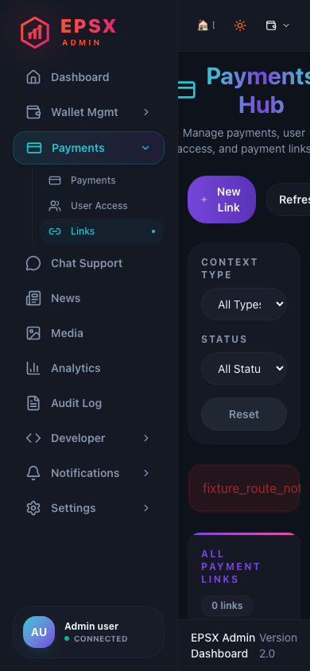](./pr8.admin.link-create--mobile-dark--source.png) | [](./pr8.admin.link-create--mobile-dark--target.png) | [](./pr8.admin.link-create--mobile-dark--diff.png) | 13.0332% | The target acknowledges payment-link creation only through the Rust payment service and its versioned audit evidence. The pinned source has no equivalent verified lifecycle boundary. | pre=PASS, post=PASS |
| `pr8.admin.link-disable` | `desktop-light` | PASS; 2 clean repeats | [](./pr8.admin.link-disable--desktop-light--source.png) | [](./pr8.admin.link-disable--desktop-light--target.png) | [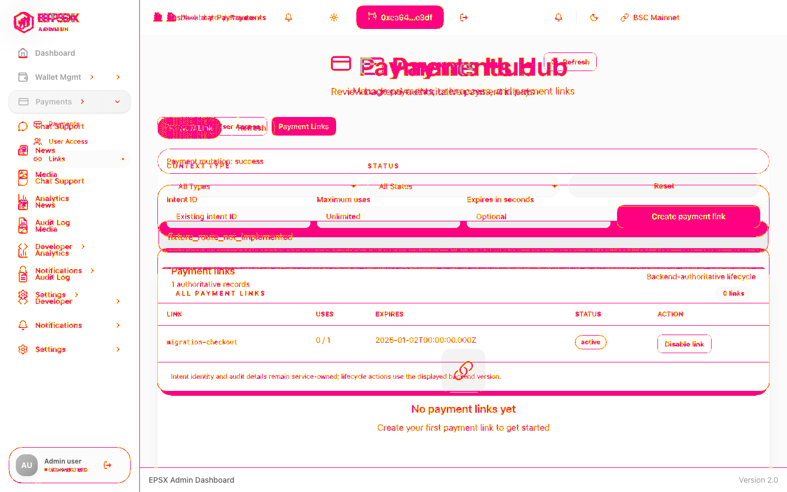](./pr8.admin.link-disable--desktop-light--diff.png) | 7.5954% | The target acknowledges payment-link disable only after the Rust service validates ownership and version, so the visible lifecycle state is required backend behavior. | pre=PASS, post=PASS |
| `pr8.admin.link-disable` | `mobile-dark` | PASS; 2 clean repeats | [](./pr8.admin.link-disable--mobile-dark--source.png) | [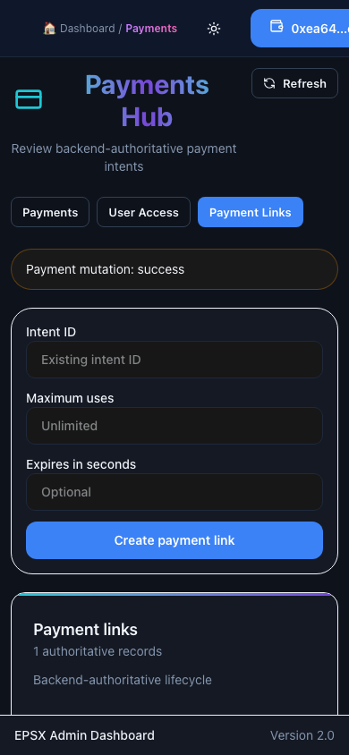](./pr8.admin.link-disable--mobile-dark--target.png) | [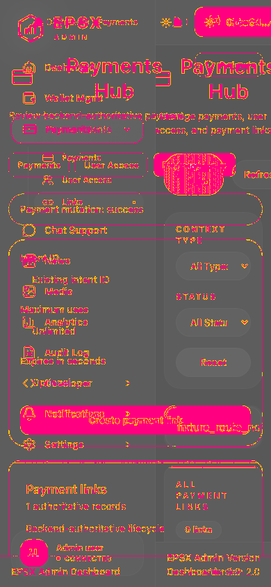](./pr8.admin.link-disable--mobile-dark--diff.png) | 12.9466% | The target acknowledges payment-link disable only after the Rust service validates ownership and version, so the visible lifecycle state is required backend behavior. | pre=PASS, post=PASS |
| `pr8.admin.links-empty` | `desktop-light` | PASS; 2 clean repeats | [](./pr8.admin.links-empty--desktop-light--source.png) | [](./pr8.admin.links-empty--desktop-light--target.png) | [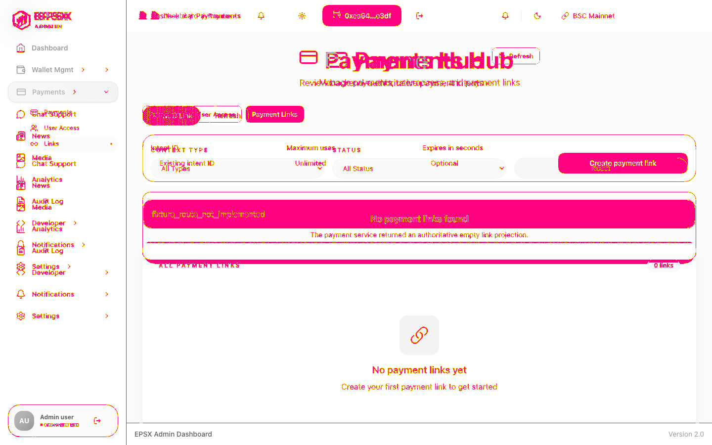](./pr8.admin.links-empty--desktop-light--diff.png) | 9.7195% | The target renders the Rust BFF's authoritative empty payment-link registry with a typed zero-item envelope. The pinned source has no equivalent verified backend-owned empty state, so the visible state difference is required by the migration contract. | pre=PASS, post=PASS |
| `pr8.admin.links-empty` | `mobile-dark` | PASS; 2 clean repeats | [](./pr8.admin.links-empty--mobile-dark--source.png) | [](./pr8.admin.links-empty--mobile-dark--target.png) | [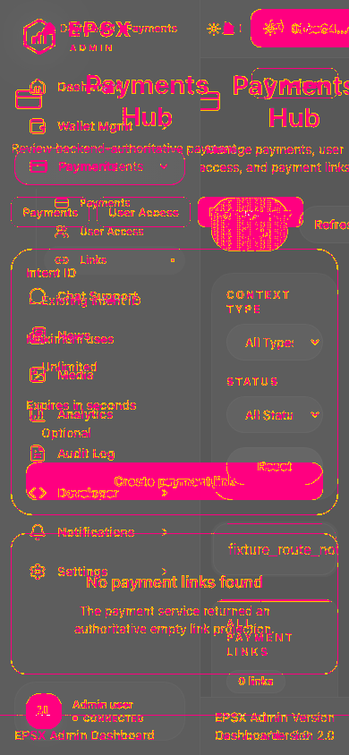](./pr8.admin.links-empty--mobile-dark--diff.png) | 12.7713% | The target renders the Rust BFF's authoritative empty payment-link registry with a typed zero-item envelope. The pinned source has no equivalent verified backend-owned empty state, so the visible state difference is required by the migration contract. | pre=PASS, post=PASS |
| `pr8.admin.links-forbidden` | `desktop-light` | PASS; 2 clean repeats | [](./pr8.admin.links-forbidden--desktop-light--source.png) | [](./pr8.admin.links-forbidden--desktop-light--target.png) | [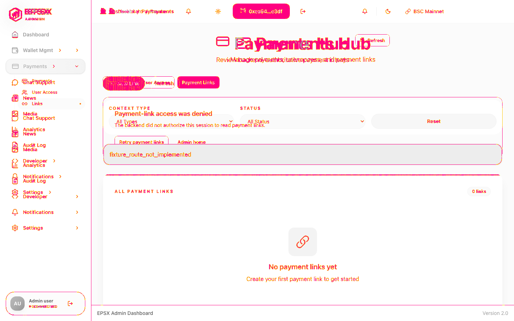](./pr8.admin.links-forbidden--desktop-light--diff.png) | 3.4336% | The target preserves the Rust permission denial and withholds payment-link identity data. The visible delta is required by the backend authorization boundary. | pre=PASS, post=PASS |
| `pr8.admin.links-forbidden` | `mobile-dark` | PASS; 2 clean repeats | [](./pr8.admin.links-forbidden--mobile-dark--source.png) | [](./pr8.admin.links-forbidden--mobile-dark--target.png) | [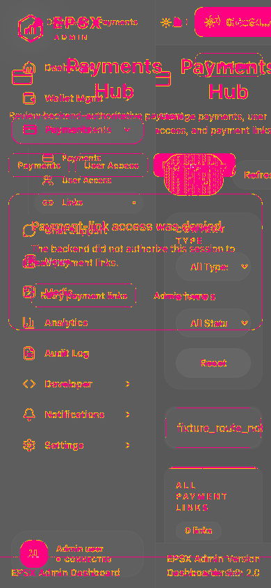](./pr8.admin.links-forbidden--mobile-dark--diff.png) | 8.6572% | The target preserves the Rust permission denial and withholds payment-link identity data. The visible delta is required by the backend authorization boundary. | pre=PASS, post=PASS |
| `pr8.admin.links-ready` | `desktop-light` | PASS; 2 clean repeats | [](./pr8.admin.links-ready--desktop-light--source.png) | [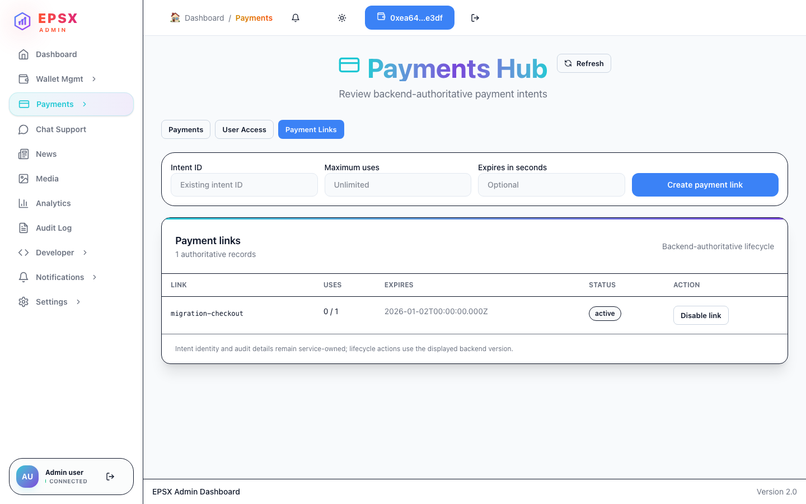](./pr8.admin.links-ready--desktop-light--target.png) | [](./pr8.admin.links-ready--desktop-light--diff.png) | 10.2424% | The target renders only the redacted, versioned payment-link projection accepted by the Rust BFF. The pinned source has no equivalent verified backend contract. | pre=PASS, post=PASS |
| `pr8.admin.links-ready` | `mobile-dark` | PASS; 2 clean repeats | [](./pr8.admin.links-ready--mobile-dark--source.png) | [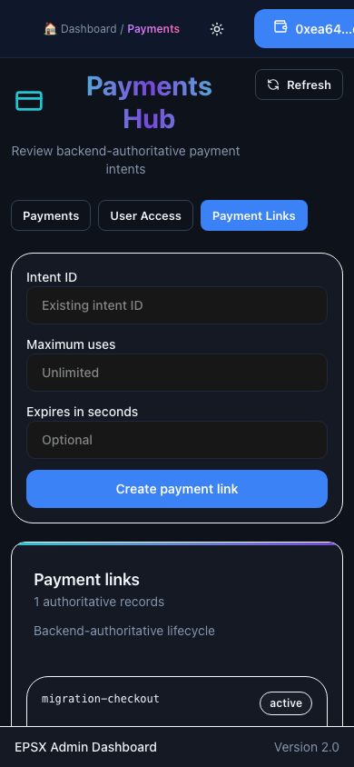](./pr8.admin.links-ready--mobile-dark--target.png) | [](./pr8.admin.links-ready--mobile-dark--diff.png) | 12.9964% | The target renders only the redacted, versioned payment-link projection accepted by the Rust BFF. The pinned source has no equivalent verified backend contract. | pre=PASS, post=PASS |
| `pr8.frontend.payment-auth-required` | `desktop-light` | PASS; 2 clean repeats | [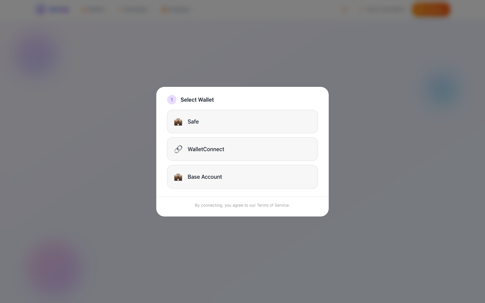](./pr8.frontend.payment-auth-required--desktop-light--source.png) | [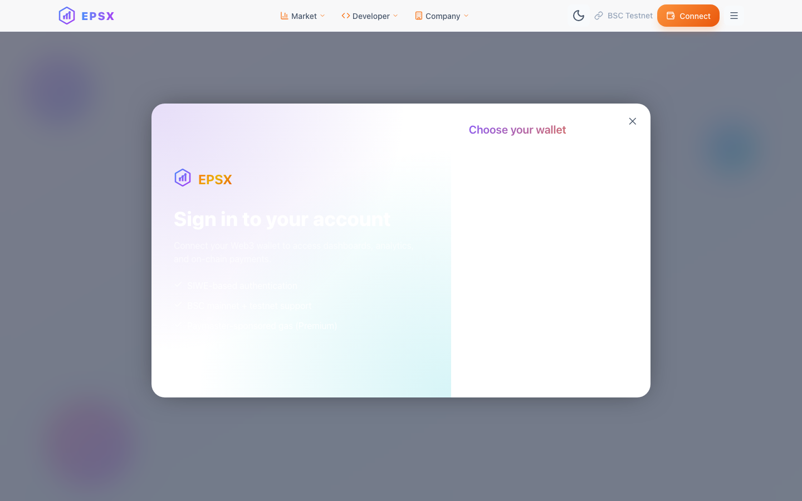](./pr8.frontend.payment-auth-required--desktop-light--target.png) | [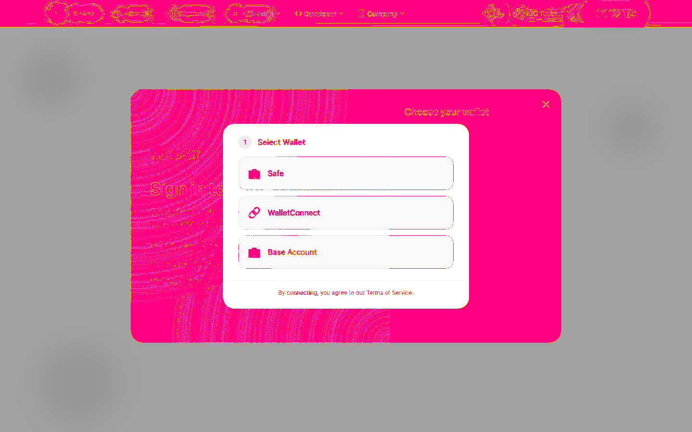](./pr8.frontend.payment-auth-required--desktop-light--diff.png) | 26.2145% | The target accurately requires a wallet/SIWE-authenticated payment session before rendering payment controls, while the pinned source exposes a different legacy auth surface. The visible difference is required by wallet and legal accuracy. | pre=PASS, post=PASS |
| `pr8.frontend.payment-auth-required` | `mobile-dark` | PASS; 2 clean repeats | [](./pr8.frontend.payment-auth-required--mobile-dark--source.png) | [](./pr8.frontend.payment-auth-required--mobile-dark--target.png) | [](./pr8.frontend.payment-auth-required--mobile-dark--diff.png) | 2.6446% | The target accurately requires a wallet/SIWE-authenticated payment session before rendering payment controls, while the pinned source exposes a different legacy auth surface. The visible difference is required by wallet and legal accuracy. | pre=PASS, post=PASS |
| `pr8.frontend.payment-unavailable` | `desktop-light` | PASS; 2 clean repeats | [](./pr8.frontend.payment-unavailable--desktop-light--source.png) | [](./pr8.frontend.payment-unavailable--desktop-light--target.png) | [](./pr8.frontend.payment-unavailable--desktop-light--diff.png) | 87.9486% | The target preserves the Rust payment-service dependency failure and does not claim checkout availability. The pinned source does not provide an equivalent backend-authoritative failure state. | pre=PASS, post=PASS |
| `pr8.frontend.payment-unavailable` | `mobile-dark` | PASS; 2 clean repeats | [](./pr8.frontend.payment-unavailable--mobile-dark--source.png) | [](./pr8.frontend.payment-unavailable--mobile-dark--target.png) | [](./pr8.frontend.payment-unavailable--mobile-dark--diff.png) | 9.4914% | The target preserves the Rust payment-service dependency failure and does not claim checkout availability. The pinned source does not provide an equivalent backend-authoritative failure state. | pre=PASS, post=PASS |
| `pr8.frontend.plans-unavailable` | `desktop-light` | PASS; 2 clean repeats | [](./pr8.frontend.plans-unavailable--desktop-light--source.png) | [](./pr8.frontend.plans-unavailable--desktop-light--target.png) | [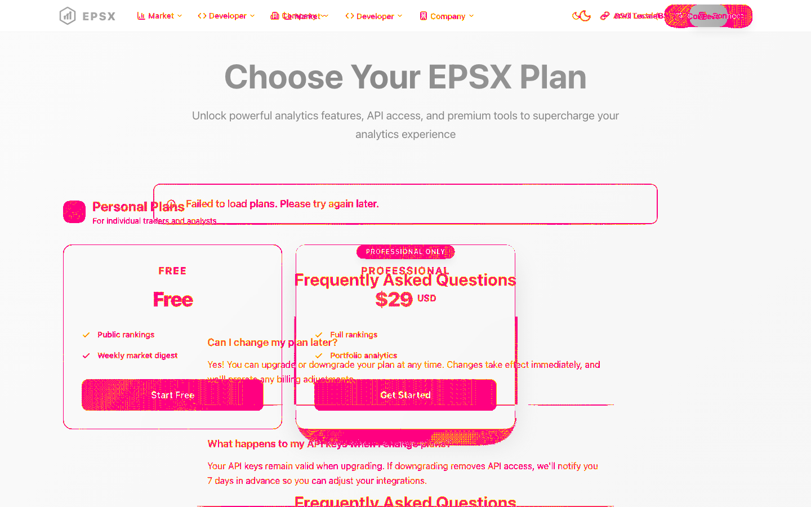](./pr8.frontend.plans-unavailable--desktop-light--diff.png) | 6.0512% | The target renders a dependency-unavailable plan state from the Rust-owned subscription authority and withholds fabricated plan data. The pinned source has no equivalent verified service boundary, so the state difference is required backend behavior. | pre=PASS, post=PASS |
| `pr8.frontend.plans-unavailable` | `mobile-dark` | PASS; 2 clean repeats | [](./pr8.frontend.plans-unavailable--mobile-dark--source.png) | [](./pr8.frontend.plans-unavailable--mobile-dark--target.png) | [](./pr8.frontend.plans-unavailable--mobile-dark--diff.png) | 8.8027% | The target renders a dependency-unavailable plan state from the Rust-owned subscription authority and withholds fabricated plan data. The pinned source has no equivalent verified service boundary, so the state difference is required backend behavior. | pre=PASS, post=PASS |
| `pr8.frontend.receipt-unavailable` | `desktop-light` | PASS; 2 clean repeats | [](./pr8.frontend.receipt-unavailable--desktop-light--source.png) | [](./pr8.frontend.receipt-unavailable--desktop-light--target.png) | [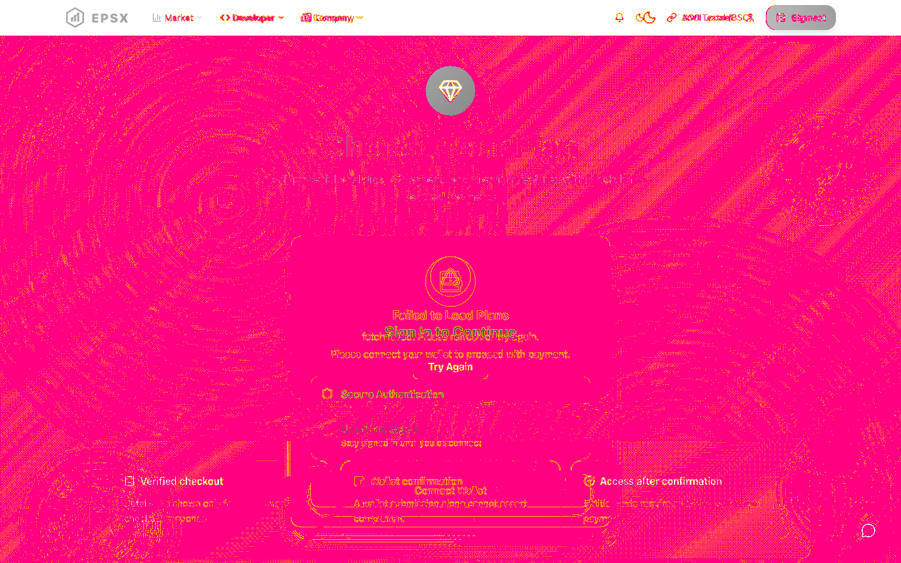](./pr8.frontend.receipt-unavailable--desktop-light--diff.png) | 87.9488% | The target reports unavailable receipt verification from the Rust payment authority and withholds financial success claims. The visible delta is required for financial/backend correctness. | pre=PASS, post=PASS |
| `pr8.frontend.receipt-unavailable` | `mobile-dark` | PASS; 2 clean repeats | [](./pr8.frontend.receipt-unavailable--mobile-dark--source.png) | [](./pr8.frontend.receipt-unavailable--mobile-dark--target.png) | [](./pr8.frontend.receipt-unavailable--mobile-dark--diff.png) | 9.4911% | The target reports unavailable receipt verification from the Rust payment authority and withholds financial success claims. The visible delta is required for financial/backend correctness. | pre=PASS, post=PASS |

## Backend-authoritative contract evidence

| Suite | Group | Result | Clean repeats | Rust tests per repeat | Claims | Source anchors |
|---|---:|---|---:|---:|---|---|
| `pr2.admin-session-boundary` | 2 | PASS | 2 | 163 | SIWE exchange requires the admin audience; frontend and multiple audiences cannot establish admin authority; refresh rotation, rejection, transport failure, and logout fail closed; backend profile permissions remain verbatim; unauthenticated and under-permissioned requests stop before upstream access | `apps/admin/src/session_auth.rs`<br>`apps/admin/src/session_auth_tests.rs`<br>`apps/admin/src/auth.rs`<br>`apps/admin/src/main.rs` |
| `pr2.frontend-session-boundary` | 2 | PASS | 2 | 127 | invalid login and identity mismatch set no session; refresh rotates the verified cookie pair without replay; refresh dependency failure clears unprovable sessions; logout clears canonical and legacy cookies; profile and account data stay bound to the verified owner | `apps/frontend/src/api.rs`<br>`apps/frontend/src/auth.rs`<br>`apps/frontend/src/ssr.rs` |
| `pr2.identity-service-policy` | 2 | PASS | 2 | 8 | identity routes require exact audiences and literal permissions; spoofable owner headers are stripped; malformed credentials and hidden lifecycle routes fail closed; dependency verifier failures do not expose protected handlers | `services/identity/src/lib.rs` |
| `pr2.identity-token-contracts` | 2 | PASS | 2 | 34 | SIWE nonce entropy and replay-state classification; refresh client and family-state isolation; revoked, consumed, replayed, and invalid refresh states fail closed; single exact access-token audience; RS256 issuer, audience, algorithm, and key-id validation; persistent signing material survives service reconstruction | `shared/rust/epsx-identity-shared/src/auth_service.rs`<br>`shared/rust/epsx-identity-shared/src/token_service.rs`<br>`shared/rust/epsx-identity-shared/src/key_manager.rs`<br>`shared/rust/epsx-identity-shared/src/refresh_token_digest.rs` |
| `pr2.service-auth-boundary` | 2 | PASS | 2 | 8 | frontend and admin audiences are exact and isolated; wrong audience, issuer, expiry, algorithm, and unknown keys are rejected; permission wildcard grammar does not widen authority | `shared/rust/epsx-service-auth/src/lib.rs` |
| `pr3.admin-audit-adapter` | 3 | PASS | 2 | 7 | audit reads accept only bounded backend summaries; invalid filters and cursors fail before upstream access; duplicate, unsorted, or malformed audit records are rejected; sensitive actor and metadata fields never enter the UI projection | `apps/admin/src/audit_log_adapter.rs` |
| `pr3.admin-commerce-adapter` | 3 | PASS | 2 | 5 | wallet, credit, access, and plan DTOs reject unknown or malformed fields; wallet and plan identifiers are canonical before upstream I/O; optimistic conflicts and forbidden mutations remain distinct; mutation success requires evidence-bearing backend responses | `apps/admin/src/commerce_adapter.rs` |
| `pr3.subscription-service-policy` | 3 | PASS | 2 | 10 | plan and access reads require their literal read permissions; plan and access mutations require their literal manage permissions; audience and owner isolation are enforced by the Rust service; spoofed headers and hidden paths cannot widen authority | `services/subscription/src/lib.rs` |
| `pr3.wallet-service-policy` | 3 | PASS | 2 | 12 | wallet and credit reads require exact read permissions; wallet and credit mutations require exact manage permissions; frontend owners cannot cross wallet boundaries; admin and frontend audiences remain isolated; spoofed owner headers and unsafe paths fail closed | `services/wallet/src/lib.rs` |
| `pr4.admin-analytics-adapter` | 4 | PASS | 2 | 2 | admin analytics accepts only its exact backend envelope; freshness is injected from the verified envelope rather than upstream data; fabricated telemetry and unknown fields are rejected; ready and authoritative empty projections preserve the backend timestamp | `apps/admin/src/analytics_admin_adapter.rs`<br>`shared/rust/dioxus_ui/src/pages/admin_pages/analytics.rs` |
| `pr4.admin-dashboard-adapter` | 4 | PASS | 2 | 9 | dashboard counts and observation time come only from the strict backend envelope; forbidden, unavailable, and malformed states remain distinct; health, uptime, activity, and permission metrics are not invented; invalid counts, timestamps, redirects, and oversized bodies fail closed | `apps/admin/src/dashboard_user_status_adapter.rs`<br>`shared/rust/dioxus_ui/src/pages/admin_pages/dashboard.rs` |
| `pr4.analytics-service-policy` | 4 | PASS | 2 | 10 | administrator analytics reads require the exact admin audience; analytics and audit reads require their literal permissions; untrusted owner headers and hidden routes cannot widen access; unsafe filters and cursors fail before data access | `services/analytics/src/lib.rs` |
| `pr4.backend-ranking-policy` | 4 | PASS | 2 | 32 | ranking offsets are resolved from the backend authority port; locked ranks cannot be recovered through pagination or limit changes; cache keys isolate distinct backend ranking offsets; malformed, overflowing, or unavailable authority fails closed | `apps/backend/src/web/analytics/eps/cache.rs`<br>`apps/backend/src/web/analytics/eps/rankings.rs`<br>`apps/backend/src/domain/market_analytics/services/eps_ranking_service.rs` |
| `pr4.frontend-analytics-adapter` | 4 | PASS | 2 | 4 | only canonical filter, sort, and pagination query fields reach analytics; ranking, access, freshness, filters, and watchlist projections are validated; empty, unavailable, and malformed responses remain distinct; unsupported dashboard and portfolio decisions are not inferred | `apps/frontend/src/ssr.rs`<br>`shared/rust/dioxus_ui/src/pages/analytics.rs`<br>`shared/rust/dioxus_ui/src/pages/portfolio.rs`<br>`shared/rust/dioxus_ui/src/pages/dashboard.rs` |
| `pr5-admin-media-bff` | 5 | PASS | 2 | 9 | media inventory exposes bounded metadata without storage credentials; upload and deletion outcomes require strict backend evidence | `apps/admin/src/media_adapter.rs` |
| `pr5-admin-news-bff` | 5 | PASS | 2 | 14 | admin news reads and writes require verified backend projections; revision conflicts and malformed lifecycle results fail closed | `apps/admin/src/news_adapter.rs` |
| `pr5-content-service` | 5 | PASS | 2 | 8 | publication lifecycle remains in the Rust content service; revisions, authorization, and cache invalidation fail closed | `services/content/src/lib.rs` |
| `pr5-frontend-news-bff` | 5 | PASS | 2 | 10 | public list and detail envelopes are strict and bounded; not-found, malformed, and unavailable outcomes never become content | `apps/frontend/src/api.rs` |
| `pr6-admin-chat-bff` | 6 | PASS | 2 | 2 | chat list detail and messages require strict backend envelopes; ownership status assignment and retries remain backend decisions | `apps/admin/src/chat_admin_adapter.rs` |
| `pr6-admin-notification-bff` | 6 | PASS | 2 | 17 | admin reads redact recipient body and provider errors; send mutation and metrics require strict backend evidence | `apps/admin/src/notification_admin_adapter.rs` |
| `pr6-frontend-notification-bff` | 6 | PASS | 2 | 20 | list preferences mutations stream replay and push remain owner-bound; malformed dependencies never become authoritative empty state | `apps/frontend/src/api.rs`<br>`apps/frontend/src/ssr.rs` |
| `pr6-gateway-chat-policy` | 6 | PASS | 2 | 1 | chat history owner selectors are injected by the Rust gateway; caller supplied owner identities are rejected | `services/gateway/src/policy.rs` |
| `pr6-notification-binary-boundaries` | 6 | PASS | 2 | 42 | push subscription and delivery validation fail closed with stable provider identities; stream cursors remain owner scoped and notification payloads remain bounded; template composition provider callbacks and preference inputs reject malformed data | `services/notification/src/main.rs` |
| `pr6-notification-delivery-runtime` | 6 | PASS | 2 | 1 | dead-letter and redrive transitions remain durable and auditable; an expired worker lease is reclaimed after restart without losing the job | `services/notification/src/delivery.rs` |
| `pr6-notification-preferences-runtime` | 6 | PASS | 2 | 1 | quiet hours are calculated from the persisted timezone and defer delivery; disabled channels are suppressed without fabricating successful delivery | `services/notification/src/main.rs` |
| `pr6-notification-provider-runtime` | 6 | PASS | 2 | 1 | signed provider callbacks reconcile durable delivery state; replayed provider events remain idempotent and auditable | `services/notification/src/main.rs` |
| `pr6-notification-redis-runtime` | 6 | PASS | 2 | 1 | Redis fanout wakes independent notification stream instances; Redis loss remains bounded and preserves the local PostgreSQL replay wake-up | `services/notification/src/main.rs` |
| `pr6-notification-service` | 6 | PASS | 2 | 20 | delivery deduplication quiet hours and provider outcomes remain in Rust; SSE replay push lifecycle worker restart and Redis loss fail closed | `services/notification/src/lib.rs`<br>`services/notification/src/delivery.rs` |
| `pr6-notification-stream-runtime` | 6 | PASS | 2 | 1 | SSE replay cursors and acknowledgements remain bound to the verified owner; cross-owner cursor reuse cannot advance or expose another owner's stream | `services/notification/src/main.rs` |
| `pr6-notification-template-runtime` | 6 | PASS | 2 | 1 | template revisions and rollback restore the exact body; template rollback emits an auditable durable history | `services/notification/src/main.rs` |
| `pr7-admin-developer-bff` | 7 | PASS | 2 | 5 | plaintext secrets exist only in the creation response; list usage lifecycle and malformed outcomes are strict and redacted | `apps/admin/src/developer_portal_adapter.rs` |
| `pr7-backend-developer-authority` | 7 | PASS | 2 | 2 | API-key ownership lifecycle and usage remain backend-owned; creation revocation and expiration require audit evidence | `apps/backend/src/web/admin/developer_portal_handlers.rs`<br>`apps/backend/src/infrastructure/adapters/repositories/developer_portal/api_key_repository.rs` |
| `pr7-rate-plan-enforcement` | 7 | PASS | 2 | 3 | global user API-key and plan limits are enforced in Rust; usage windows are deterministic and isolated per principal | `apps/backend/src/web/middleware/multi_level_rate_limiter.rs` |
| `pr8-admin-commerce-bff` | 8 | PASS | 2 | 5 | financial projections reject malformed or extra authority; payment-link mutations remain versioned and redacted | `apps/admin/src/commerce_adapter.rs` |
| `pr8-admin-payment-intent-bff` | 8 | PASS | 2 | 5 | read filters are allowlisted and bounded; cancellation requires a version and idempotency key | `apps/admin/src/main.rs` |
| `pr8-backend-receipt-verification` | 8 | PASS | 2 | 1 | receipt verification state is represented in Rust; frontend route labels cannot assert a finalized payment | `apps/backend/src/infrastructure/blockchain/payment_verifier.rs` |
| `pr8-pay-service-authority` | 8 | PASS | 2 | 10 | checkout, links, webhooks, reconciliation, and audit evidence remain service-owned; idempotency, finality, reorg, and escrow transitions fail closed | `services/pay/src/lib.rs`<br>`services/pay/src/handlers` |
| `pr8-subscription-authority` | 8 | PASS | 2 | 10 | subscription lifecycle remains owner-isolated and idempotent; entitlements are projected only from backend-authoritative state | `services/subscription/src/lib.rs` |

Each repeat has a checksummed Cargo log plus guarded pre/post PostgreSQL, Redis, Anvil, and fixture reset proofs in the full artifact. Test counts and ignored-test counts must be stable, every command must pass, and ignored tests are forbidden.

## Contact sheets

Each sheet is ordered **Next.js source → Rust/Dioxus target → highlighted pixel diff**.

### pr8.admin.intent-cancel-conflict — desktop-light

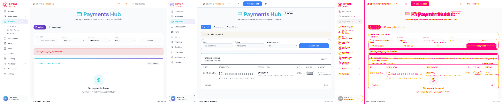

### pr8.admin.intent-cancel-conflict — mobile-dark


### pr8.admin.intent-cancel — desktop-light


### pr8.admin.intent-cancel — mobile-dark


### pr8.admin.intents-empty — desktop-light


### pr8.admin.intents-empty — mobile-dark


### pr8.admin.intents-malformed — desktop-light


### pr8.admin.intents-malformed — mobile-dark

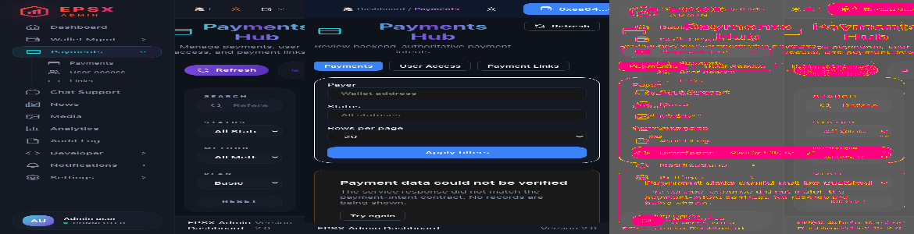

### pr8.admin.intents-ready — desktop-light

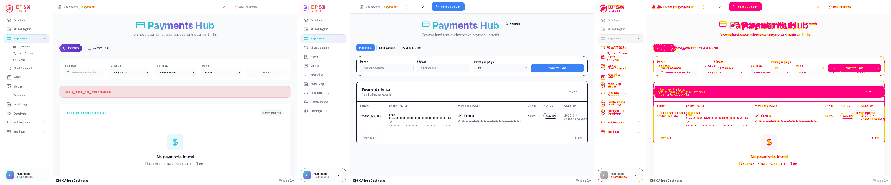

### pr8.admin.intents-ready — mobile-dark


### pr8.admin.intents-unavailable — desktop-light

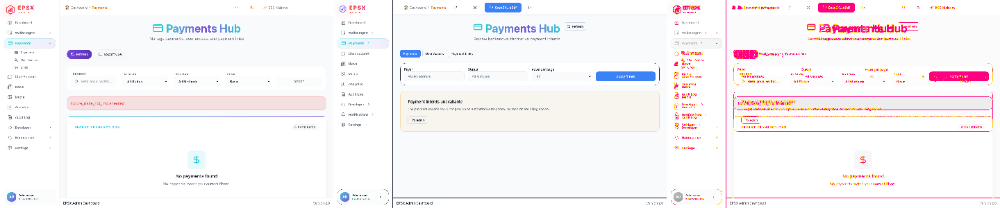

### pr8.admin.intents-unavailable — mobile-dark


### pr8.admin.link-create — desktop-light

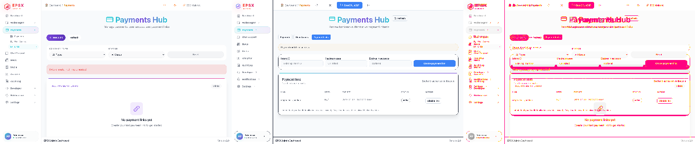

### pr8.admin.link-create — mobile-dark


### pr8.admin.link-disable — desktop-light


### pr8.admin.link-disable — mobile-dark


### pr8.admin.links-empty — desktop-light


### pr8.admin.links-empty — mobile-dark

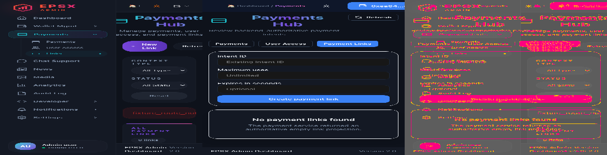

### pr8.admin.links-forbidden — desktop-light

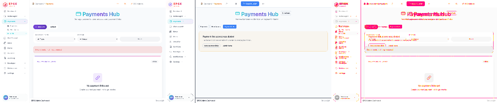

### pr8.admin.links-forbidden — mobile-dark


### pr8.admin.links-ready — desktop-light


### pr8.admin.links-ready — mobile-dark


### pr8.frontend.payment-auth-required — desktop-light

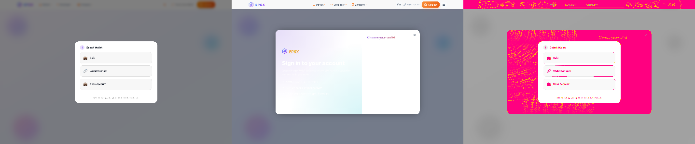

### pr8.frontend.payment-auth-required — mobile-dark

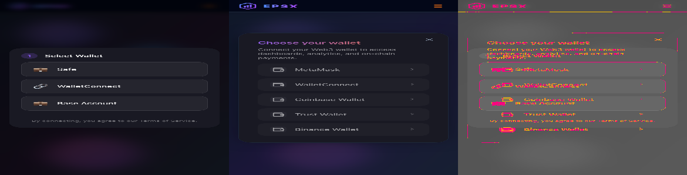

### pr8.frontend.payment-unavailable — desktop-light


### pr8.frontend.payment-unavailable — mobile-dark


### pr8.frontend.plans-unavailable — desktop-light


### pr8.frontend.plans-unavailable — mobile-dark


### pr8.frontend.receipt-unavailable — desktop-light

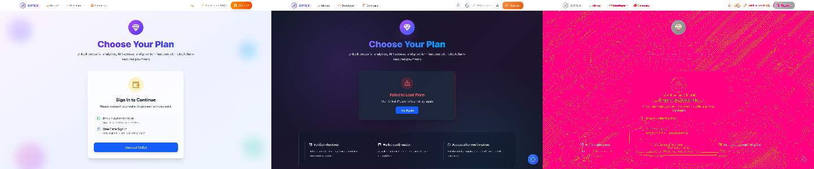

### pr8.frontend.receipt-unavailable — mobile-dark


## Runtime rollback gate

Every repeat restored a guarded `epsx_e2e_*` PostgreSQL database from its template, deleted only the `epsx:e2e:*` Redis namespace, reverted Anvil chain 31337 to its recorded snapshot, reset fixture requests/mutations, and cleared its isolated browser context. PostgreSQL checksums and row counts, transient queue/outbox emptiness, Redis hashes, Anvil account/block state, and fixture counters matched the baseline after reset.

Final process-stopped rollback: **PASS**. The source and target applications were stopped before the final reset and smoke, preventing background polling from repopulating fixture or durable state. The full artifact manifest includes `reset-final.json` with every baseline comparison.

## Full artifacts

The CI artifact contains full-resolution PNGs, video, traces, HAR/network data, DOM, accessibility snapshots, browser/server logs, Playwright HTML, and reset proofs. [`artifact-manifest.json`](./artifact-manifest.json) records the SHA-256 and byte length of every file in that artifact.

## Reproduce

```bash
bun install --frozen-lockfile
bunx playwright install chromium
bun e2e/migration/cli.ts run --group 8
bun e2e/migration/cli.ts verify-artifacts --group 8
```
