# PR 9 — cumulative migration E2E evidence

Result: **PASS**

Source Next.js SHA: `373bd231cb7a616c3d4c0ddc1d60e0099a88a5db`

Target Rust/Dioxus SHA: `8b2a9fb867a112bad343050ee7dded2c65d6564d`

Generated: 2026-08-01T03:29:34.870Z

This report covers every executable scenario owned by cumulative groups 0–9. Visual differences above 1% require a machine-readable non-styling exception.

## Scenario evidence

| Scenario | Matrix | Result / coverage | Next.js | Rust/Dioxus | Highlighted diff | Δ pixels | Difference disposition | Reset proof |
|---|---|---|---|---|---|---:|---|---|
| `pr0.public.about` | `desktop-light` | PASS; 2 clean repeats | [](./pr0.public.about--desktop-light--source.png) | [](./pr0.public.about--desktop-light--target.png) | [](./pr0.public.about--desktop-light--diff.png) | 8.3697% | PR 0 establishes the immutable baseline and reproducible evidence path; source/target parity disposition is owned by PR 1. | pre=PASS, post=PASS |
| `pr0.public.about` | `mobile-dark` | PASS; 2 clean repeats | [](./pr0.public.about--mobile-dark--source.png) | [](./pr0.public.about--mobile-dark--target.png) | [](./pr0.public.about--mobile-dark--diff.png) | 15.6565% | PR 0 establishes the immutable baseline and reproducible evidence path; source/target parity disposition is owned by PR 1. | pre=PASS, post=PASS |
| `pr0.public.contact` | `desktop-light` | PASS; 2 clean repeats | [](./pr0.public.contact--desktop-light--source.png) | [](./pr0.public.contact--desktop-light--target.png) | [](./pr0.public.contact--desktop-light--diff.png) | 8.3697% | PR 0 establishes the immutable baseline and reproducible evidence path; source/target parity disposition is owned by PR 1. | pre=PASS, post=PASS |
| `pr0.public.contact` | `mobile-dark` | PASS; 2 clean repeats | [](./pr0.public.contact--mobile-dark--source.png) | [](./pr0.public.contact--mobile-dark--target.png) | [](./pr0.public.contact--mobile-dark--diff.png) | 15.6568% | PR 0 establishes the immutable baseline and reproducible evidence path; source/target parity disposition is owned by PR 1. | pre=PASS, post=PASS |
| `pr0.public.home` | `desktop-light` | PASS; 2 clean repeats | [](./pr0.public.home--desktop-light--source.png) | [](./pr0.public.home--desktop-light--target.png) | [](./pr0.public.home--desktop-light--diff.png) | 8.8315% | PR 0 establishes the immutable baseline and reproducible evidence path; source/target parity disposition is owned by PR 1. | pre=PASS, post=PASS |
| `pr0.public.home` | `mobile-dark` | PASS; 2 clean repeats | [](./pr0.public.home--mobile-dark--source.png) | [](./pr0.public.home--mobile-dark--target.png) | [](./pr0.public.home--mobile-dark--diff.png) | 20.288% | PR 0 establishes the immutable baseline and reproducible evidence path; source/target parity disposition is owned by PR 1. | pre=PASS, post=PASS |
| `pr1.about.authenticated` | `desktop-light` | PASS; 2 clean repeats | [](./pr1.about.authenticated--desktop-light--source.png) | [](./pr1.about.authenticated--desktop-light--target.png) | [](./pr1.about.authenticated--desktop-light--diff.png) | 0.6133% | Within the 1% campaign visual threshold. | pre=PASS, post=PASS |
| `pr1.about.authenticated` | `mobile-dark` | PASS; 2 clean repeats | [](./pr1.about.authenticated--mobile-dark--source.png) | [](./pr1.about.authenticated--mobile-dark--target.png) | [](./pr1.about.authenticated--mobile-dark--diff.png) | 1.1177% | The target validates the fixture's signed frontend session with the Rust BFF and renders the authenticated, owner-scoped chat control. The pinned source middleware admits the cookie for this public body but its client shell has no verified identity and therefore omits that control. With the authenticated control region excluded, the screenshot delta is below 1%. | pre=PASS, post=PASS |
| `pr1.admin.denial-query` | `desktop-light` | PASS; 2 clean repeats | [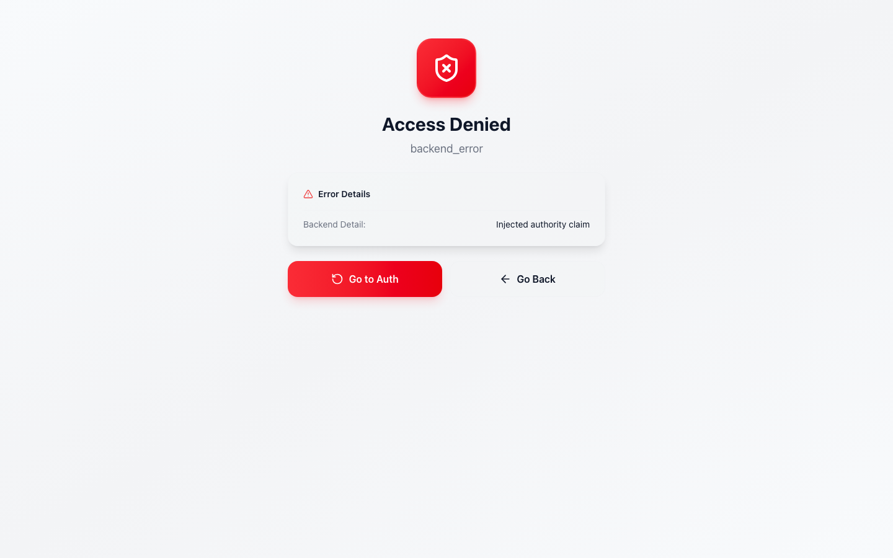](./pr1.admin.denial-query--desktop-light--source.png) | [](./pr1.admin.denial-query--desktop-light--target.png) | [](./pr1.admin.denial-query--desktop-light--diff.png) | 1.5624% | The pinned source presents browser-controlled reason and detail parameters as authoritative denial evidence. The target ignores those claims and explains that only the authenticated session and backend permissions determine access. | pre=PASS, post=PASS |
| `pr1.admin.denial-query` | `mobile-dark` | PASS; 2 clean repeats | [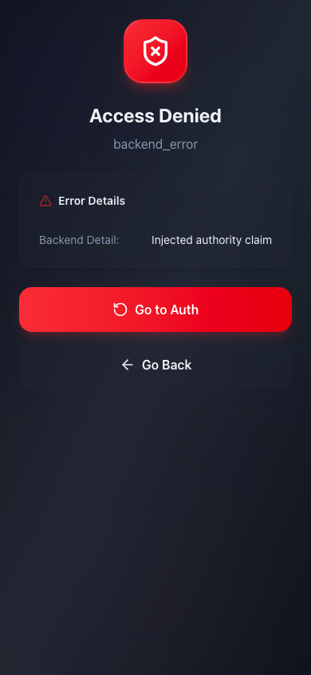](./pr1.admin.denial-query--mobile-dark--source.png) | [](./pr1.admin.denial-query--mobile-dark--target.png) | [](./pr1.admin.denial-query--mobile-dark--diff.png) | 12.771% | The pinned source presents browser-controlled reason and detail parameters as authoritative denial evidence. The target ignores those claims and explains that only the authenticated session and backend permissions determine access. | pre=PASS, post=PASS |
| `pr1.admin.unauthorized` | `desktop-light` | PASS; 2 clean repeats | [](./pr1.admin.unauthorized--desktop-light--source.png) | [](./pr1.admin.unauthorized--desktop-light--target.png) | [](./pr1.admin.unauthorized--desktop-light--diff.png) | 3.5723% | The target removes browser-controlled denial context and adds static administrator guidance without claiming an unverified route, permission, or backend error. Access remains determined by the Rust backend. | pre=PASS, post=PASS |
| `pr1.admin.unauthorized` | `mobile-dark` | PASS; 2 clean repeats | [](./pr1.admin.unauthorized--mobile-dark--source.png) | [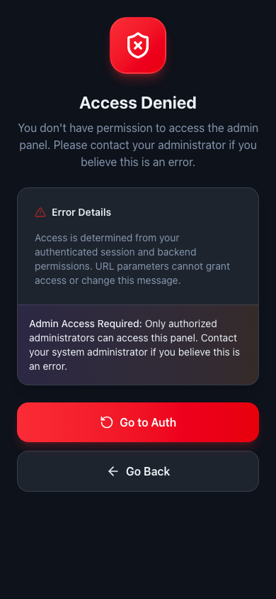](./pr1.admin.unauthorized--mobile-dark--target.png) | [](./pr1.admin.unauthorized--mobile-dark--diff.png) | 12.5586% | The target removes browser-controlled denial context and adds static administrator guidance without claiming an unverified route, permission, or backend error. Access remains determined by the Rust backend. | pre=PASS, post=PASS |
| `pr1.auth.about-redirect` | `desktop-light` | PASS; 2 clean repeats | [](./pr1.auth.about-redirect--desktop-light--source.png) | [](./pr1.auth.about-redirect--desktop-light--target.png) | [](./pr1.auth.about-redirect--desktop-light--diff.png) | 8.3697% | The pinned source auth surface asserts that the network is secure and operational without a backend health proof and advertises an unverified customer count. The target keeps the wallet CTA and feature geometry while replacing those claims with a static wallet-sign-in description and truthful product copy. | pre=PASS, post=PASS |
| `pr1.auth.about-redirect` | `mobile-dark` | PASS; 2 clean repeats | [](./pr1.auth.about-redirect--mobile-dark--source.png) | [](./pr1.auth.about-redirect--mobile-dark--target.png) | [](./pr1.auth.about-redirect--mobile-dark--diff.png) | 15.6568% | The pinned source auth surface asserts that the network is secure and operational without a backend health proof and advertises an unverified customer count. The target keeps the wallet CTA and feature geometry while replacing those claims with a static wallet-sign-in description and truthful product copy. | pre=PASS, post=PASS |
| `pr1.auth.contact-redirect` | `desktop-light` | PASS; 2 clean repeats | [](./pr1.auth.contact-redirect--desktop-light--source.png) | [](./pr1.auth.contact-redirect--desktop-light--target.png) | [](./pr1.auth.contact-redirect--desktop-light--diff.png) | 8.3697% | The pinned source auth surface asserts that the network is secure and operational without a backend health proof and advertises an unverified customer count. The target keeps the wallet CTA and feature geometry while replacing those claims with a static wallet-sign-in description and truthful product copy. | pre=PASS, post=PASS |
| `pr1.auth.contact-redirect` | `mobile-dark` | PASS; 2 clean repeats | [](./pr1.auth.contact-redirect--mobile-dark--source.png) | [](./pr1.auth.contact-redirect--mobile-dark--target.png) | [](./pr1.auth.contact-redirect--mobile-dark--diff.png) | 15.6568% | The pinned source auth surface asserts that the network is secure and operational without a backend health proof and advertises an unverified customer count. The target keeps the wallet CTA and feature geometry while replacing those claims with a static wallet-sign-in description and truthful product copy. | pre=PASS, post=PASS |
| `pr1.contact.authenticated` | `desktop-light` | PASS; 2 clean repeats | [](./pr1.contact.authenticated--desktop-light--source.png) | [](./pr1.contact.authenticated--desktop-light--target.png) | [](./pr1.contact.authenticated--desktop-light--diff.png) | 0.376% | Within the 1% campaign visual threshold. | pre=PASS, post=PASS |
| `pr1.contact.authenticated` | `mobile-dark` | PASS; 2 clean repeats | [](./pr1.contact.authenticated--mobile-dark--source.png) | [](./pr1.contact.authenticated--mobile-dark--target.png) | [](./pr1.contact.authenticated--mobile-dark--diff.png) | 1.5825% | The target validates the fixture's signed frontend session with the Rust BFF and renders the authenticated, owner-scoped chat control. The pinned source middleware admits the cookie for this public body but its client shell has no verified identity and therefore omits that control. With the authenticated control region excluded, the screenshot delta is below 1%. | pre=PASS, post=PASS |
| `pr1.error.access-denied` | `desktop-light` | PASS; 2 clean repeats | [](./pr1.error.access-denied--desktop-light--source.png) | [](./pr1.error.access-denied--desktop-light--target.png) | [](./pr1.error.access-denied--desktop-light--diff.png) | 0.8513% | Within the 1% campaign visual threshold. | pre=PASS, post=PASS |
| `pr1.error.access-denied` | `mobile-dark` | PASS; 2 clean repeats | [](./pr1.error.access-denied--mobile-dark--source.png) | [](./pr1.error.access-denied--mobile-dark--target.png) | [](./pr1.error.access-denied--mobile-dark--diff.png) | 0.0933% | Within the 1% campaign visual threshold. | pre=PASS, post=PASS |
| `pr1.error.not-found` | `desktop-light` | PASS; 2 clean repeats | [](./pr1.error.not-found--desktop-light--source.png) | [](./pr1.error.not-found--desktop-light--target.png) | [](./pr1.error.not-found--desktop-light--diff.png) | 8.7822% | The pinned source masks an unknown signed-out route by redirecting to authentication. The target preserves the HTTP 404 boundary and renders safe recovery links, so route existence and error semantics are not confused with an authorization decision. | pre=PASS, post=PASS |
| `pr1.error.not-found` | `mobile-dark` | PASS; 2 clean repeats | [](./pr1.error.not-found--mobile-dark--source.png) | [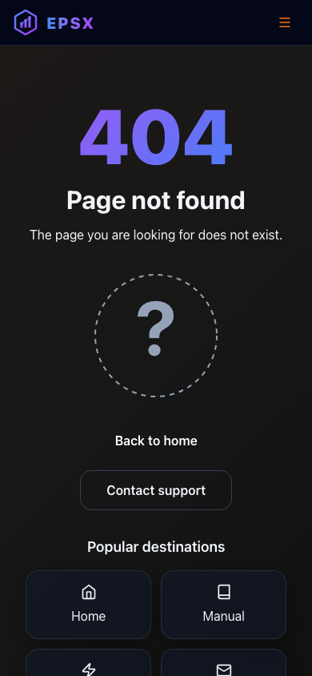](./pr1.error.not-found--mobile-dark--target.png) | [](./pr1.error.not-found--mobile-dark--diff.png) | 12.4338% | The pinned source masks an unknown signed-out route by redirecting to authentication. The target preserves the HTTP 404 boundary and renders safe recovery links, so route existence and error semantics are not confused with an authorization decision. | pre=PASS, post=PASS |
| `pr1.offline.public` | `desktop-light` | PASS; 2 clean repeats | [](./pr1.offline.public--desktop-light--source.png) | [](./pr1.offline.public--desktop-light--target.png) | [](./pr1.offline.public--desktop-light--diff.png) | 2.0041% | The pinned source offline page claims cached dashboard and analytics capabilities that have no verified service-worker cache contract. The target limits its availability list to the static shell and recovery actions that actually work offline. | pre=PASS, post=PASS |
| `pr1.offline.public` | `mobile-dark` | PASS; 2 clean repeats | [](./pr1.offline.public--mobile-dark--source.png) | [](./pr1.offline.public--mobile-dark--target.png) | [](./pr1.offline.public--mobile-dark--diff.png) | 6.1298% | The pinned source offline page claims cached dashboard and analytics capabilities that have no verified service-worker cache contract. The target limits its availability list to the static shell and recovery actions that actually work offline. | pre=PASS, post=PASS |
| `pr1.privacy.legal` | `desktop-light` | PASS; 2 clean repeats | [](./pr1.privacy.legal--desktop-light--source.png) | [](./pr1.privacy.legal--desktop-light--target.png) | [](./pr1.privacy.legal--desktop-light--diff.png) | 2.4726% | The pinned source privacy policy describes Google/OIDC and OAuth data flows that this wallet-only application does not use. The target accurately documents wallet addresses, EIP-4361 signatures, nonce/session handling, and provides a real contact link. | pre=PASS, post=PASS |
| `pr1.privacy.legal` | `mobile-dark` | PASS; 2 clean repeats | [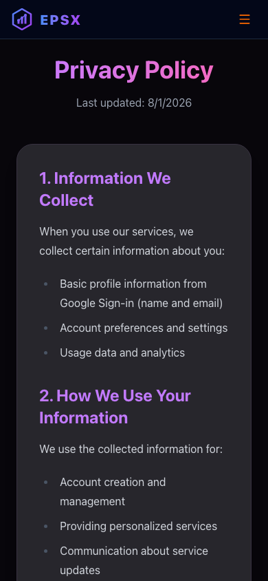](./pr1.privacy.legal--mobile-dark--source.png) | [](./pr1.privacy.legal--mobile-dark--target.png) | [](./pr1.privacy.legal--mobile-dark--diff.png) | 4.4121% | The pinned source privacy policy describes Google/OIDC and OAuth data flows that this wallet-only application does not use. The target accurately documents wallet addresses, EIP-4361 signatures, nonce/session handling, and provides a real contact link. | pre=PASS, post=PASS |
| `pr1.shell.home` | `desktop-light` | PASS; 2 clean repeats | [](./pr1.shell.home--desktop-light--source.png) | [](./pr1.shell.home--desktop-light--target.png) | [](./pr1.shell.home--desktop-light--diff.png) | 8.8315% | The pinned source hero advertises real-time analytics and interactive sharing before their verified public data contracts are available. The target replaces those claims with truthful navigation to dedicated routes; the shell structure and controls remain functional. | pre=PASS, post=PASS |
| `pr1.shell.home` | `mobile-dark` | PASS; 2 clean repeats | [](./pr1.shell.home--mobile-dark--source.png) | [](./pr1.shell.home--mobile-dark--target.png) | [](./pr1.shell.home--mobile-dark--diff.png) | 20.288% | The pinned source hero advertises real-time analytics and interactive sharing before their verified public data contracts are available. The target replaces those claims with truthful navigation to dedicated routes; the shell structure and controls remain functional. | pre=PASS, post=PASS |
| `pr1.terms.legal` | `desktop-light` | PASS; 2 clean repeats | [](./pr1.terms.legal--desktop-light--source.png) | [](./pr1.terms.legal--desktop-light--target.png) | [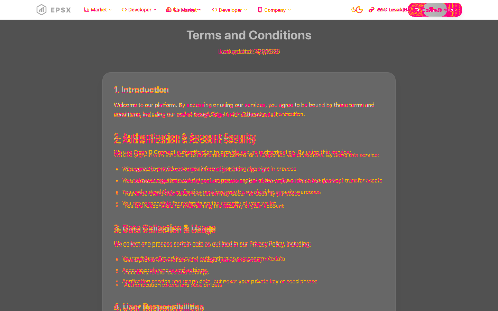](./pr1.terms.legal--desktop-light--diff.png) | 2.655% | The pinned source terms describe OAuth and Google sign-in and render non-functional subscription controls. The target states the wallet/SIWE authentication contract, links to contact, and removes the unsupported pseudo-form. | pre=PASS, post=PASS |
| `pr1.terms.legal` | `mobile-dark` | PASS; 2 clean repeats | [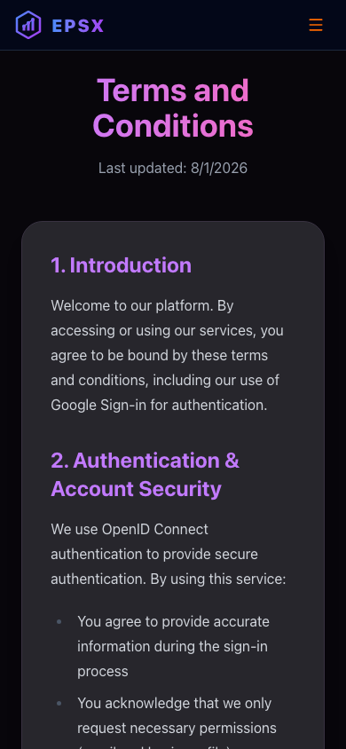](./pr1.terms.legal--mobile-dark--source.png) | [](./pr1.terms.legal--mobile-dark--target.png) | [](./pr1.terms.legal--mobile-dark--diff.png) | 4.4389% | The pinned source terms describe OAuth and Google sign-in and render non-functional subscription controls. The target states the wallet/SIWE authentication contract, links to contact, and removes the unsupported pseudo-form. | pre=PASS, post=PASS |
| `pr2.account.verified` | `desktop-light` | PASS; 2 clean repeats | [](./pr2.account.verified--desktop-light--source.png) | [](./pr2.account.verified--desktop-light--target.png) | [](./pr2.account.verified--desktop-light--diff.png) | 13.9544% | The pinned source mixes a server session with client wallet state and renders fixture-derived membership, credit, plan, feature, payment, and preference claims. The target renders the verified wallet and SIWE method but marks every unselected owner-scoped backend projection unavailable instead of inventing authority. | pre=PASS, post=PASS |
| `pr2.account.verified` | `mobile-dark` | PASS; 2 clean repeats | [](./pr2.account.verified--mobile-dark--source.png) | [](./pr2.account.verified--mobile-dark--target.png) | [](./pr2.account.verified--mobile-dark--diff.png) | 15.1571% | The pinned source mixes a server session with client wallet state and renders fixture-derived membership, credit, plan, feature, payment, and preference claims. The target renders the verified wallet and SIWE method but marks every unselected owner-scoped backend projection unavailable instead of inventing authority. | pre=PASS, post=PASS |
| `pr2.admin.settings` | `desktop-light` | PASS; 2 clean repeats | [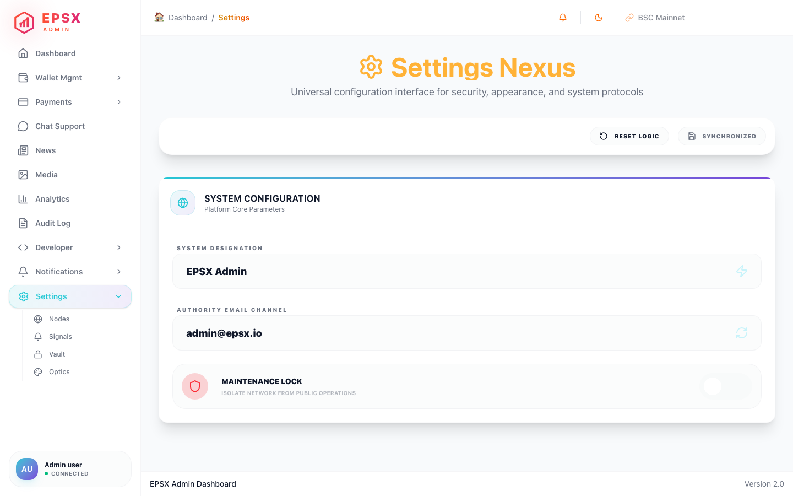](./pr2.admin.settings--desktop-light--source.png) | [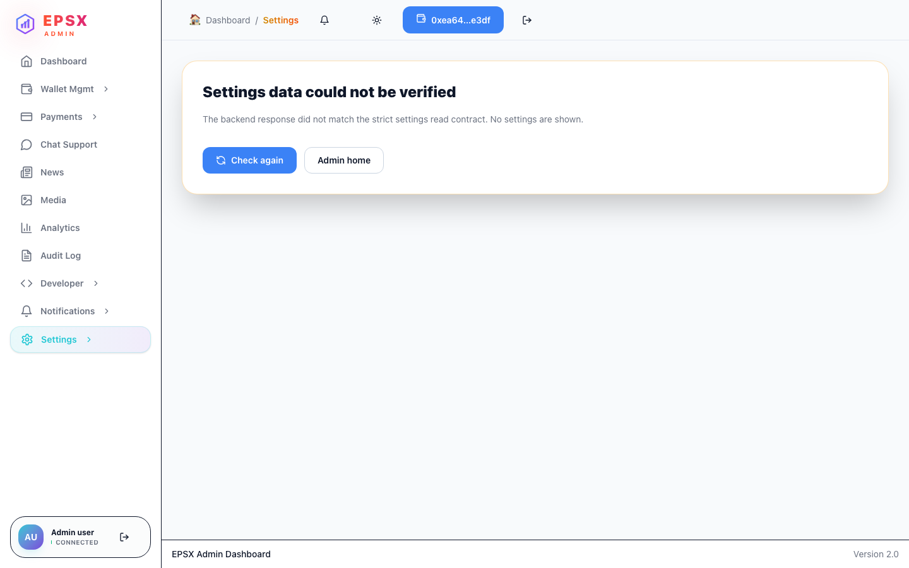](./pr2.admin.settings--desktop-light--target.png) | [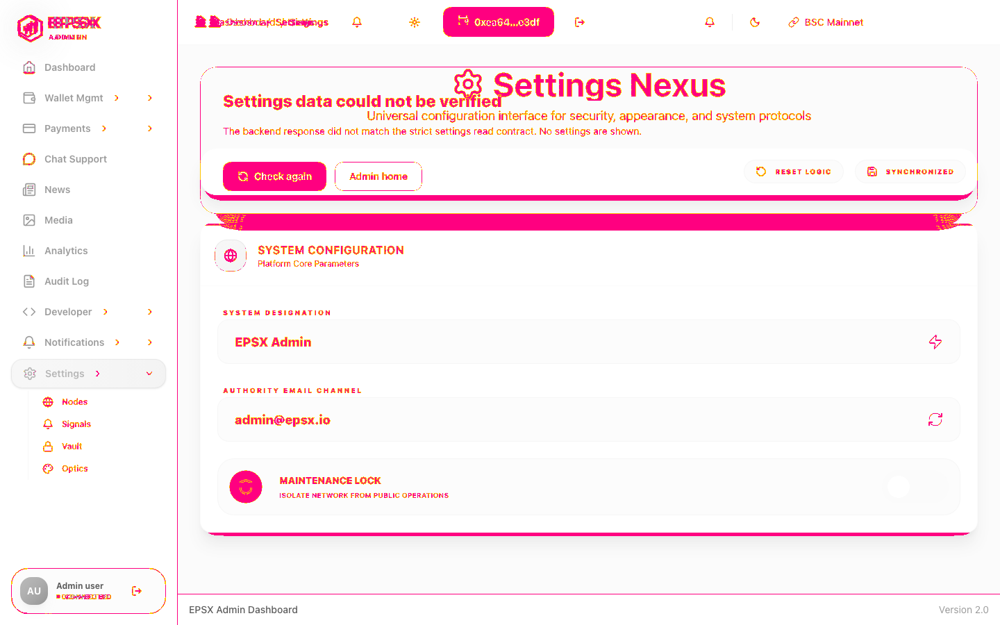](./pr2.admin.settings--desktop-light--diff.png) | 5.7444% | The pinned source renders fixture-owned administrator contact and maintenance values as settings. The target keeps the authenticated settings route but explicitly declines to project those claims when the Rust adapter cannot verify its strict backend contract. | pre=PASS, post=PASS |
| `pr2.admin.settings` | `mobile-dark` | PASS; 2 clean repeats | [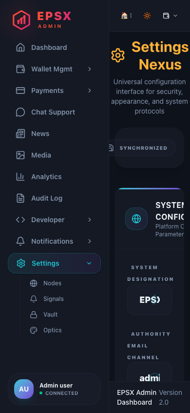](./pr2.admin.settings--mobile-dark--source.png) | [](./pr2.admin.settings--mobile-dark--target.png) | [](./pr2.admin.settings--mobile-dark--diff.png) | 8.741% | The pinned source renders fixture-owned administrator contact and maintenance values as settings. The target keeps the authenticated settings route but explicitly declines to project those claims when the Rust adapter cannot verify its strict backend contract. | pre=PASS, post=PASS |
| `pr2.admin.wrong-audience` | `desktop-light` | PASS; 2 clean repeats | [](./pr2.admin.wrong-audience--desktop-light--source.png) | [](./pr2.admin.wrong-audience--desktop-light--target.png) | [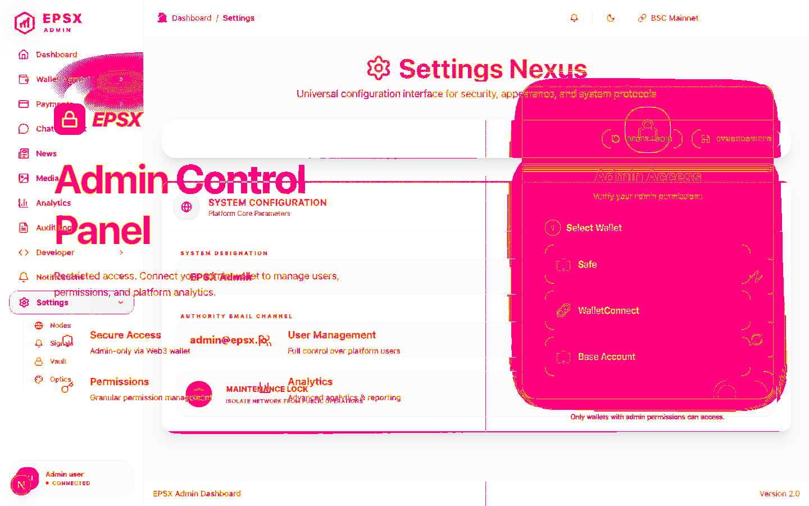](./pr2.admin.wrong-audience--desktop-light--diff.png) | 25.2198% | The source receives its valid admin baseline session, while the target receives an equally signed frontend-audience token and must replace all administrator settings with the public Admin Access gate. | pre=PASS, post=PASS |
| `pr2.admin.wrong-audience` | `mobile-dark` | PASS; 2 clean repeats | [](./pr2.admin.wrong-audience--mobile-dark--source.png) | [](./pr2.admin.wrong-audience--mobile-dark--target.png) | [](./pr2.admin.wrong-audience--mobile-dark--diff.png) | 6.7013% | The source receives its valid admin baseline session, while the target receives an equally signed frontend-audience token and must replace all administrator settings with the public Admin Access gate. | pre=PASS, post=PASS |
| `pr2.auth.dependency-failure` | `desktop-light` | PASS; 2 clean repeats | [](./pr2.auth.dependency-failure--desktop-light--source.png) | [](./pr2.auth.dependency-failure--desktop-light--target.png) | [](./pr2.auth.dependency-failure--desktop-light--diff.png) | 8.5552% | The source receives its normal valid-session baseline. The target's token uses an uncached key identifier while identity verification is unavailable, so the Rust verifier clears unprovable authority and renders the explicit unavailable sign-in gate. | pre=PASS, post=PASS |
| `pr2.auth.dependency-failure` | `mobile-dark` | PASS; 2 clean repeats | [](./pr2.auth.dependency-failure--mobile-dark--source.png) | [](./pr2.auth.dependency-failure--mobile-dark--target.png) | [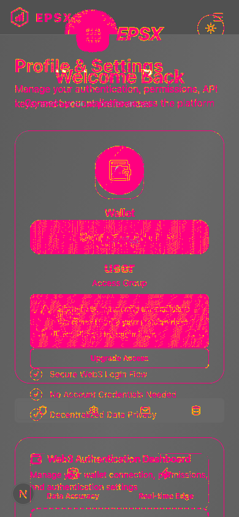](./pr2.auth.dependency-failure--mobile-dark--diff.png) | 19.5331% | The source receives its normal valid-session baseline. The target's token uses an uncached key identifier while identity verification is unavailable, so the Rust verifier clears unprovable authority and renders the explicit unavailable sign-in gate. | pre=PASS, post=PASS |
| `pr2.auth.logout` | `desktop-light` | PASS; 2 clean repeats | [](./pr2.auth.logout--desktop-light--source.png) | [](./pr2.auth.logout--desktop-light--target.png) | [](./pr2.auth.logout--desktop-light--diff.png) | 9.132% | Both captures finish signed out after their respective session-clearing mechanisms. The residual public-home difference is the same removal of unsupported live-market, social-proof, customer, and call-to-action claims approved for the shared-shell home capture. | pre=PASS, post=PASS |
| `pr2.auth.logout` | `mobile-dark` | PASS; 2 clean repeats | [](./pr2.auth.logout--mobile-dark--source.png) | [](./pr2.auth.logout--mobile-dark--target.png) | [](./pr2.auth.logout--mobile-dark--diff.png) | 20.5207% | Both captures finish signed out after their respective session-clearing mechanisms. The residual public-home difference is the same removal of unsupported live-market, social-proof, customer, and call-to-action claims approved for the shared-shell home capture. | pre=PASS, post=PASS |
| `pr2.auth.signed-out` | `desktop-light` | PASS; 2 clean repeats | [](./pr2.auth.signed-out--desktop-light--source.png) | [](./pr2.auth.signed-out--desktop-light--target.png) | [](./pr2.auth.signed-out--desktop-light--diff.png) | 8.3697% | The pinned source sign-in gate claims secure operation and customer adoption without backend evidence. The target preserves the wallet CTA and gate structure while removing those unverified claims and describing only the wallet-based authentication contract. | pre=PASS, post=PASS |
| `pr2.auth.signed-out` | `mobile-dark` | PASS; 2 clean repeats | [](./pr2.auth.signed-out--mobile-dark--source.png) | [](./pr2.auth.signed-out--mobile-dark--target.png) | [](./pr2.auth.signed-out--mobile-dark--diff.png) | 15.6568% | The pinned source sign-in gate claims secure operation and customer adoption without backend evidence. The target preserves the wallet CTA and gate structure while removing those unverified claims and describing only the wallet-based authentication contract. | pre=PASS, post=PASS |
| `pr2.frontend.wrong-audience` | `desktop-light` | PASS; 2 clean repeats | [](./pr2.frontend.wrong-audience--desktop-light--source.png) | [](./pr2.frontend.wrong-audience--desktop-light--target.png) | [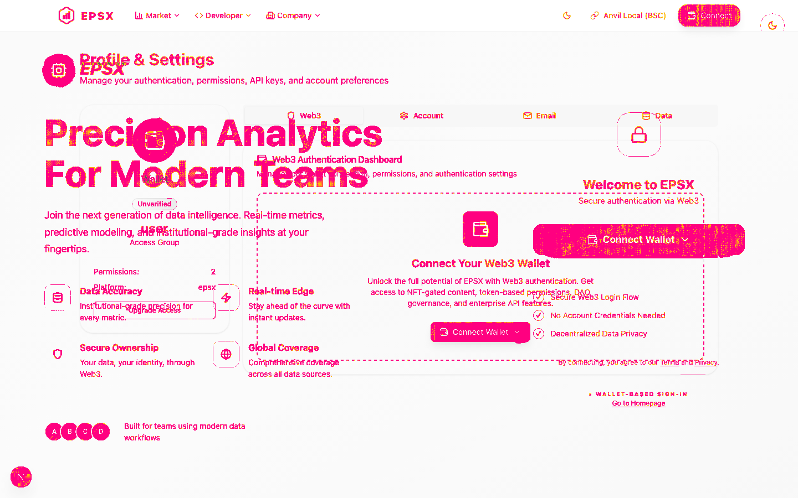](./pr2.frontend.wrong-audience--desktop-light--diff.png) | 8.5798% | The source receives its valid frontend-audience baseline session, while the target receives an equally signed admin-audience token and must replace the owner profile with the public authentication gate. | pre=PASS, post=PASS |
| `pr2.frontend.wrong-audience` | `mobile-dark` | PASS; 2 clean repeats | [](./pr2.frontend.wrong-audience--mobile-dark--source.png) | [](./pr2.frontend.wrong-audience--mobile-dark--target.png) | [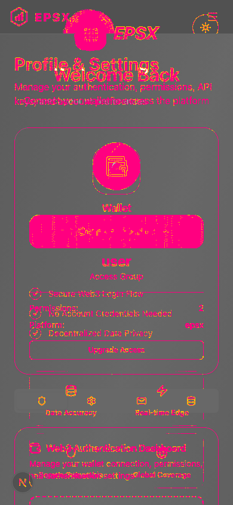](./pr2.frontend.wrong-audience--mobile-dark--diff.png) | 13.5548% | The source receives its valid frontend-audience baseline session, while the target receives an equally signed admin-audience token and must replace the owner profile with the public authentication gate. | pre=PASS, post=PASS |
| `pr2.permissions.empty-claims` | `desktop-light` | PASS; 2 clean repeats | [](./pr2.permissions.empty-claims--desktop-light--source.png) | [](./pr2.permissions.empty-claims--desktop-light--target.png) | [](./pr2.permissions.empty-claims--desktop-light--diff.png) | 78.3572% | The pinned source client gate cannot establish authority from the valid backend session without a connected browser wallet. The target accepts the correctly signed owner session but renders an explicit zero-permission state, proving that empty backend claims stay empty and gain no frontend defaults. | pre=PASS, post=PASS |
| `pr2.permissions.empty-claims` | `mobile-dark` | PASS; 2 clean repeats | [](./pr2.permissions.empty-claims--mobile-dark--source.png) | [](./pr2.permissions.empty-claims--mobile-dark--target.png) | [](./pr2.permissions.empty-claims--mobile-dark--diff.png) | 6.7165% | The pinned source client gate cannot establish authority from the valid backend session without a connected browser wallet. The target accepts the correctly signed owner session but renders an explicit zero-permission state, proving that empty backend claims stay empty and gain no frontend defaults. | pre=PASS, post=PASS |
| `pr2.permissions.verified` | `desktop-light` | PASS; 2 clean repeats | [](./pr2.permissions.verified--desktop-light--source.png) | [](./pr2.permissions.verified--desktop-light--target.png) | [](./pr2.permissions.verified--desktop-light--diff.png) | 78.4425% | The pinned source client gate cannot establish authority from the valid backend session without a connected browser wallet and therefore obscures the permission body. The target validates the exact Rust-issued audience and scope and renders only those verified permission claims. | pre=PASS, post=PASS |
| `pr2.permissions.verified` | `mobile-dark` | PASS; 2 clean repeats | [](./pr2.permissions.verified--mobile-dark--source.png) | [](./pr2.permissions.verified--mobile-dark--target.png) | [](./pr2.permissions.verified--mobile-dark--diff.png) | 6.509% | The pinned source client gate cannot establish authority from the valid backend session without a connected browser wallet and therefore obscures the permission body. The target validates the exact Rust-issued audience and scope and renders only those verified permission claims. | pre=PASS, post=PASS |
| `pr2.profile.verified` | `desktop-light` | PASS; 2 clean repeats | [](./pr2.profile.verified--desktop-light--source.png) | [](./pr2.profile.verified--desktop-light--target.png) | [](./pr2.profile.verified--desktop-light--diff.png) | 4.8801% | The pinned source profile treats browser wallet connectivity as the profile authority even when its server session is valid. The target distinguishes the backend-verified session wallet from unavailable browser-wallet and policy-management state, preserving owner identity without fabricating connected-provider capabilities. | pre=PASS, post=PASS |
| `pr2.profile.verified` | `mobile-dark` | PASS; 2 clean repeats | [](./pr2.profile.verified--mobile-dark--source.png) | [](./pr2.profile.verified--mobile-dark--target.png) | [](./pr2.profile.verified--mobile-dark--diff.png) | 11.1113% | The pinned source profile treats browser wallet connectivity as the profile authority even when its server session is valid. The target distinguishes the backend-verified session wallet from unavailable browser-wallet and policy-management state, preserving owner identity without fabricating connected-provider capabilities. | pre=PASS, post=PASS |
| `pr3.admin.access-forbidden` | `desktop-light` | PASS; 2 clean repeats | [](./pr3.admin.access-forbidden--desktop-light--source.png) | [](./pr3.admin.access-forbidden--desktop-light--target.png) | [](./pr3.admin.access-forbidden--desktop-light--diff.png) | 2.919% | The source receives its healthy baseline while the target subscription service denies the access read. The Rust BFF exposes no assignment fields and distinguishes the denial from empty data. | pre=PASS, post=PASS |
| `pr3.admin.access-forbidden` | `mobile-dark` | PASS; 2 clean repeats | [](./pr3.admin.access-forbidden--mobile-dark--source.png) | [](./pr3.admin.access-forbidden--mobile-dark--target.png) | [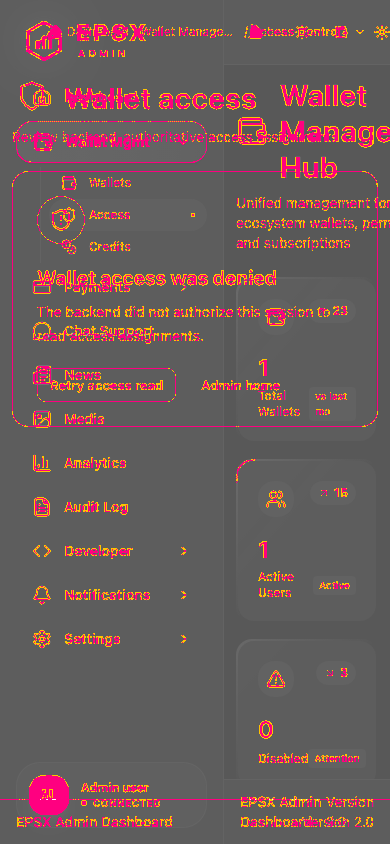](./pr3.admin.access-forbidden--mobile-dark--diff.png) | 5.7218% | The source receives its healthy baseline while the target subscription service denies the access read. The Rust BFF exposes no assignment fields and distinguishes the denial from empty data. | pre=PASS, post=PASS |
| `pr3.admin.access` | `desktop-light` | PASS; 2 clean repeats | [](./pr3.admin.access--desktop-light--source.png) | [](./pr3.admin.access--desktop-light--target.png) | [](./pr3.admin.access--desktop-light--diff.png) | 7.01% | The target renders exact backend plan, wallet, permission, expiry, and version claims and omits legacy client-composed membership and hierarchy interpretations. | pre=PASS, post=PASS |
| `pr3.admin.access` | `mobile-dark` | PASS; 2 clean repeats | [](./pr3.admin.access--mobile-dark--source.png) | [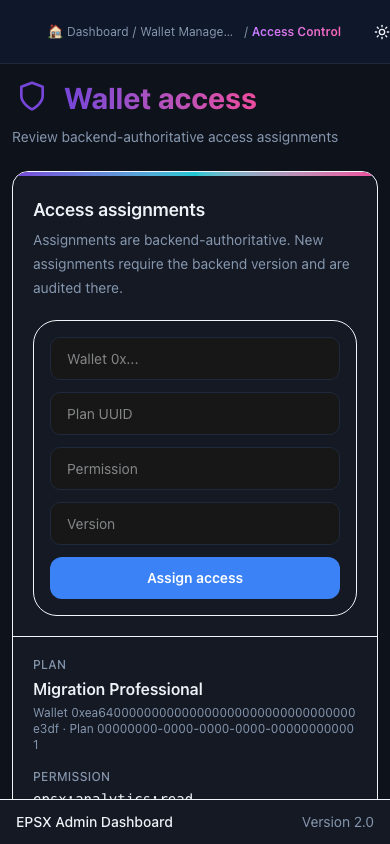](./pr3.admin.access--mobile-dark--target.png) | [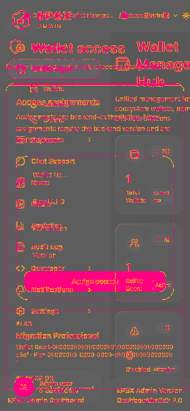](./pr3.admin.access--mobile-dark--diff.png) | 10.3318% | The target renders exact backend plan, wallet, permission, expiry, and version claims and omits legacy client-composed membership and hierarchy interpretations. | pre=PASS, post=PASS |
| `pr3.admin.audit` | `desktop-light` | PASS; 2 clean repeats | [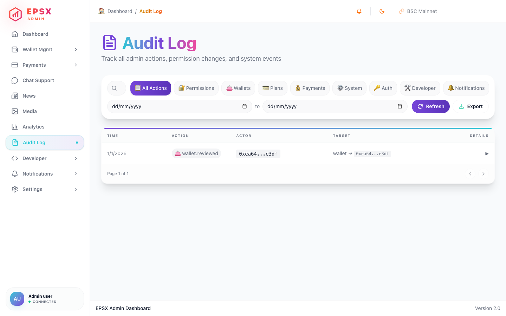](./pr3.admin.audit--desktop-light--source.png) | [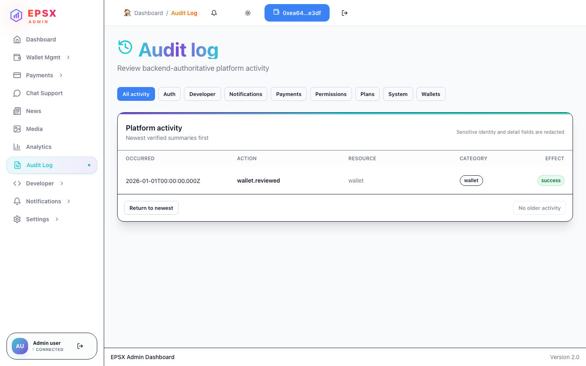](./pr3.admin.audit--desktop-light--target.png) | [](./pr3.admin.audit--desktop-light--diff.png) | 5.3897% | The target audit page accepts only a bounded Rust projection and intentionally omits legacy actor identity, network, device, arbitrary details, totals, and export claims. | pre=PASS, post=PASS |
| `pr3.admin.audit` | `mobile-dark` | PASS; 2 clean repeats | [](./pr3.admin.audit--mobile-dark--source.png) | [](./pr3.admin.audit--mobile-dark--target.png) | [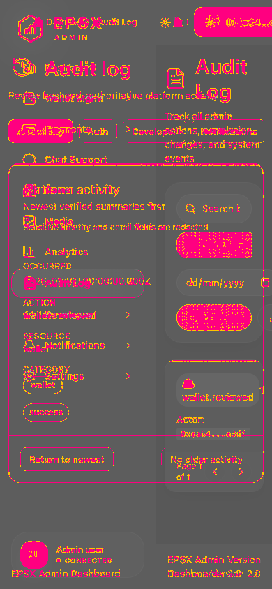](./pr3.admin.audit--mobile-dark--diff.png) | 10.35% | The target audit page accepts only a bounded Rust projection and intentionally omits legacy actor identity, network, device, arbitrary details, totals, and export claims. | pre=PASS, post=PASS |
| `pr3.admin.credits-validation` | `desktop-light` | PASS; 2 clean repeats | [](./pr3.admin.credits-validation--desktop-light--source.png) | [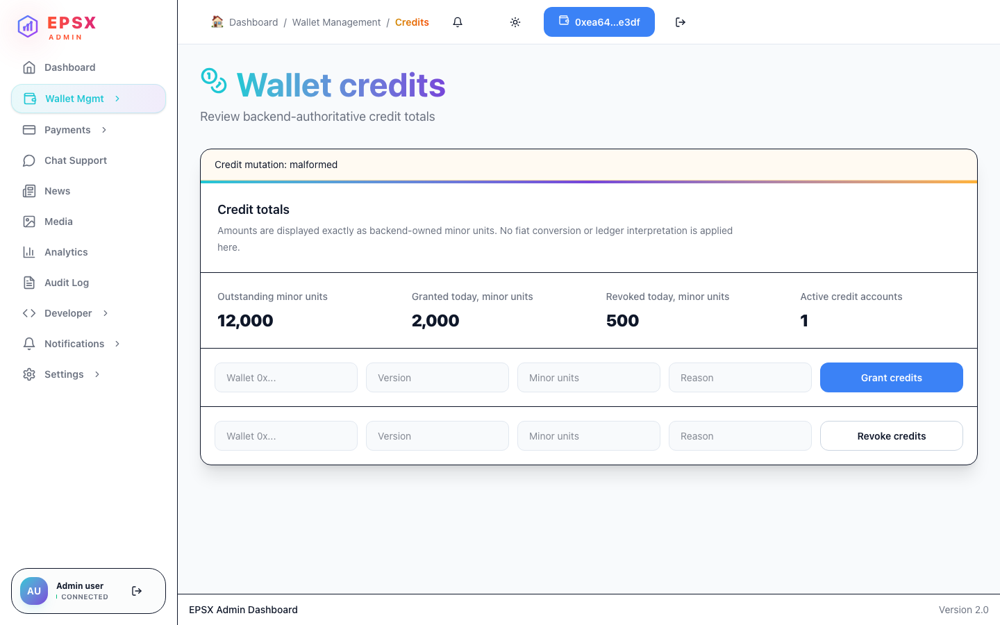](./pr3.admin.credits-validation--desktop-light--target.png) | [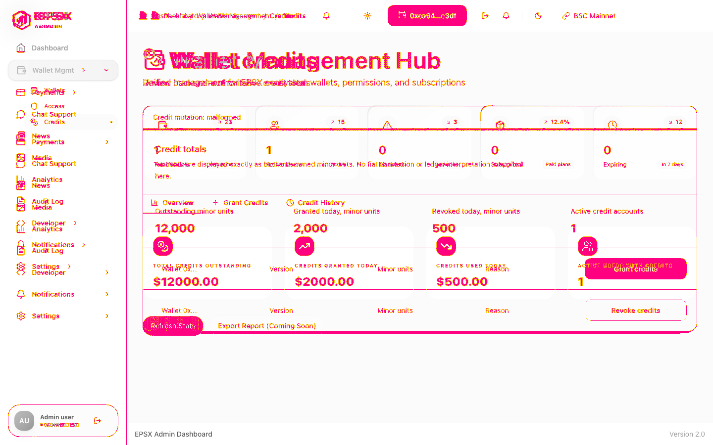](./pr3.admin.credits-validation--desktop-light--diff.png) | 5.5569% | The target rejects an oversized credit amount at the Rust BFF boundary and renders a malformed mutation state without sending a wallet-service mutation. | pre=PASS, post=PASS |
| `pr3.admin.credits-validation` | `mobile-dark` | PASS; 2 clean repeats | [](./pr3.admin.credits-validation--mobile-dark--source.png) | [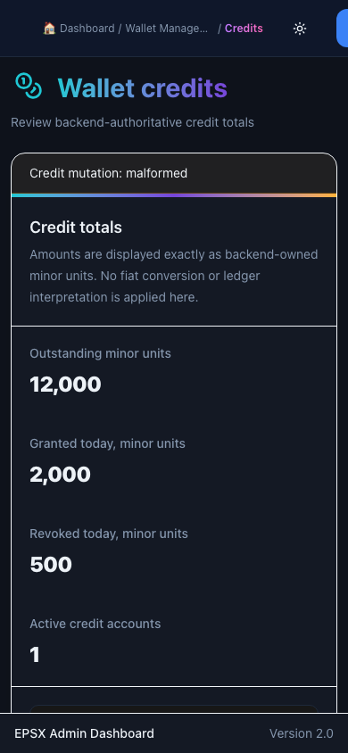](./pr3.admin.credits-validation--mobile-dark--target.png) | [](./pr3.admin.credits-validation--mobile-dark--diff.png) | 7.1737% | The target rejects an oversized credit amount at the Rust BFF boundary and renders a malformed mutation state without sending a wallet-service mutation. | pre=PASS, post=PASS |
| `pr3.admin.credits` | `desktop-light` | PASS; 2 clean repeats | [](./pr3.admin.credits--desktop-light--source.png) | [](./pr3.admin.credits--desktop-light--target.png) | [](./pr3.admin.credits--desktop-light--diff.png) | 5.5229% | The target displays backend-owned minor units without fiat conversion or ledger interpretation and keeps grant/revoke authority behind the Rust service. | pre=PASS, post=PASS |
| `pr3.admin.credits` | `mobile-dark` | PASS; 2 clean repeats | [](./pr3.admin.credits--mobile-dark--source.png) | [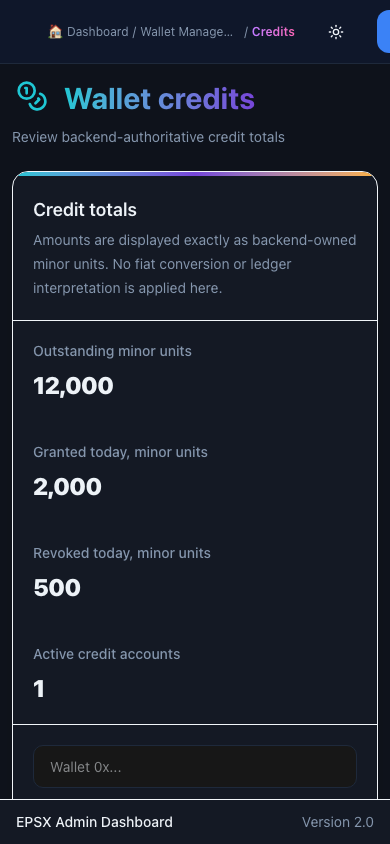](./pr3.admin.credits--mobile-dark--target.png) | [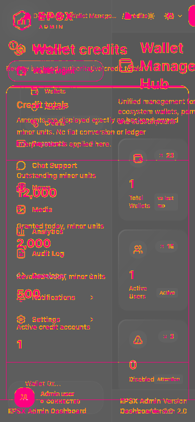](./pr3.admin.credits--mobile-dark--diff.png) | 7.0054% | The target displays backend-owned minor units without fiat conversion or ledger interpretation and keeps grant/revoke authority behind the Rust service. | pre=PASS, post=PASS |
| `pr3.admin.disable-audit` | `desktop-light` | PASS; 2 clean repeats | [](./pr3.admin.disable-audit--desktop-light--source.png) | [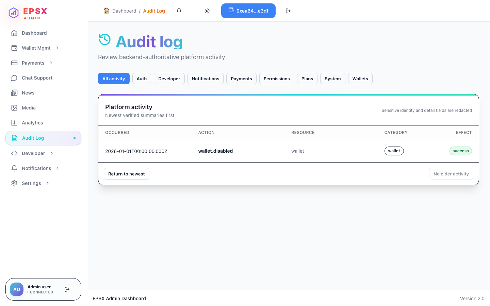](./pr3.admin.disable-audit--desktop-light--target.png) | [](./pr3.admin.disable-audit--desktop-light--diff.png) | 5.4138% | The pinned source comparison remains on its stable wallet detail because its client-only disable route emits an invalid duplicate-key error before any service decision. The target treats disable as committed only after an evidence-bearing wallet response, then displays the resulting bounded wallet.disabled audit summary from analytics. | pre=PASS, post=PASS |
| `pr3.admin.disable-audit` | `mobile-dark` | PASS; 2 clean repeats | [](./pr3.admin.disable-audit--mobile-dark--source.png) | [](./pr3.admin.disable-audit--mobile-dark--target.png) | [](./pr3.admin.disable-audit--mobile-dark--diff.png) | 8.707% | The pinned source comparison remains on its stable wallet detail because its client-only disable route emits an invalid duplicate-key error before any service decision. The target treats disable as committed only after an evidence-bearing wallet response, then displays the resulting bounded wallet.disabled audit summary from analytics. | pre=PASS, post=PASS |
| `pr3.admin.disable` | `desktop-light` | PASS; 2 clean repeats | [](./pr3.admin.disable--desktop-light--source.png) | [](./pr3.admin.disable--desktop-light--target.png) | [](./pr3.admin.disable--desktop-light--diff.png) | 4.2421% | The pinned source comparison remains on its stable wallet detail because its client-only disable route emits an invalid duplicate-key error before any service decision. The target enters the versioned form and proves that literal admin:wallets:manage authority is required: a read-only administrator receives an explicit forbidden result and no success claim. | pre=PASS, post=PASS |
| `pr3.admin.disable` | `mobile-dark` | PASS; 2 clean repeats | [](./pr3.admin.disable--mobile-dark--source.png) | [](./pr3.admin.disable--mobile-dark--target.png) | [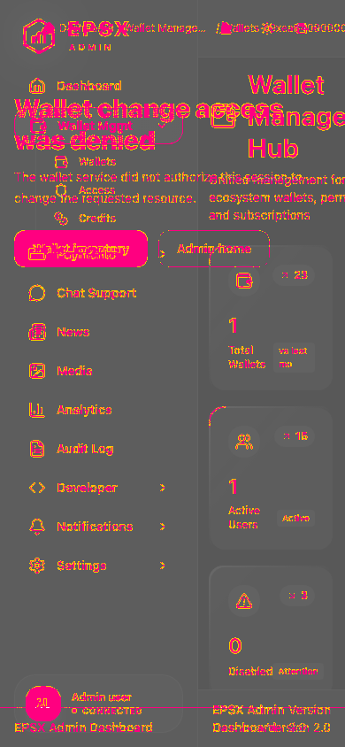](./pr3.admin.disable--mobile-dark--diff.png) | 7.1901% | The pinned source comparison remains on its stable wallet detail because its client-only disable route emits an invalid duplicate-key error before any service decision. The target enters the versioned form and proves that literal admin:wallets:manage authority is required: a read-only administrator receives an explicit forbidden result and no success claim. | pre=PASS, post=PASS |
| `pr3.admin.plan-conflict` | `desktop-light` | PASS; 2 clean repeats | [](./pr3.admin.plan-conflict--desktop-light--source.png) | [](./pr3.admin.plan-conflict--desktop-light--target.png) | [](./pr3.admin.plan-conflict--desktop-light--diff.png) | 3.5666% | The target submits the read version and preserves the subscription service's 409 as an explicit optimistic-conflict state rather than inferring that an update committed. | pre=PASS, post=PASS |
| `pr3.admin.plan-conflict` | `mobile-dark` | PASS; 2 clean repeats | [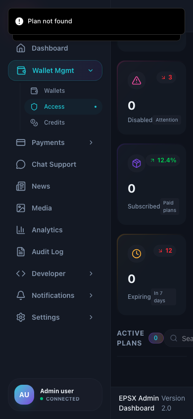](./pr3.admin.plan-conflict--mobile-dark--source.png) | [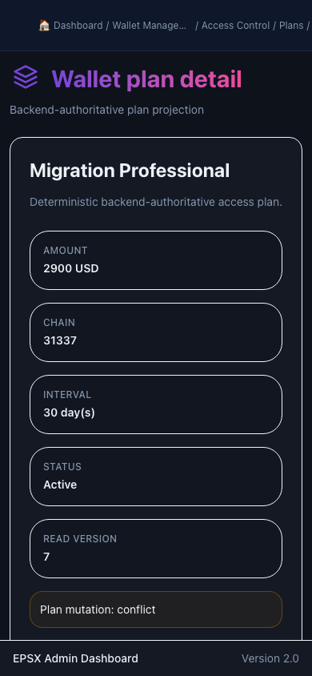](./pr3.admin.plan-conflict--mobile-dark--target.png) | [](./pr3.admin.plan-conflict--mobile-dark--diff.png) | 6.6685% | The target submits the read version and preserves the subscription service's 409 as an explicit optimistic-conflict state rather than inferring that an update committed. | pre=PASS, post=PASS |
| `pr3.admin.plan-detail` | `desktop-light` | PASS; 2 clean repeats | [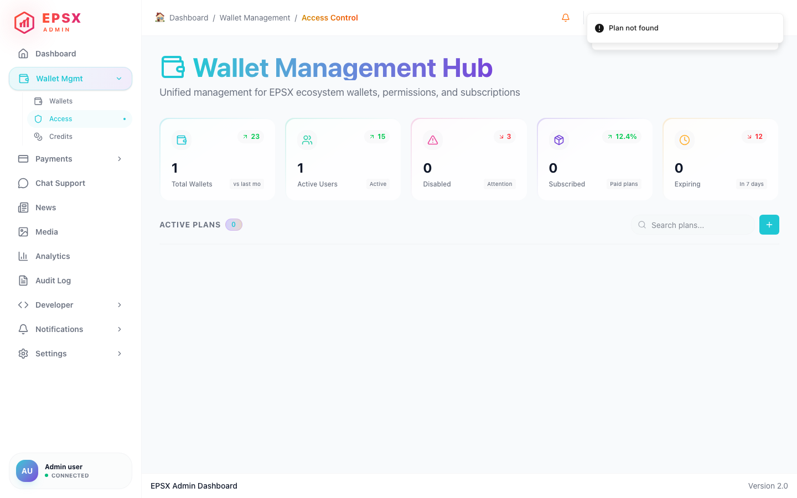](./pr3.admin.plan-detail--desktop-light--source.png) | [](./pr3.admin.plan-detail--desktop-light--target.png) | [](./pr3.admin.plan-detail--desktop-light--diff.png) | 4.704% | The target exposes only the Rust-verified plan identifier, amount, currency, chain, interval, active state, and version; merchant and legacy permission-policy details remain redacted. | pre=PASS, post=PASS |
| `pr3.admin.plan-detail` | `mobile-dark` | PASS; 2 clean repeats | [](./pr3.admin.plan-detail--mobile-dark--source.png) | [](./pr3.admin.plan-detail--mobile-dark--target.png) | [](./pr3.admin.plan-detail--mobile-dark--diff.png) | 6.5357% | The target exposes only the Rust-verified plan identifier, amount, currency, chain, interval, active state, and version; merchant and legacy permission-policy details remain redacted. | pre=PASS, post=PASS |
| `pr3.admin.plans` | `desktop-light` | PASS; 2 clean repeats | [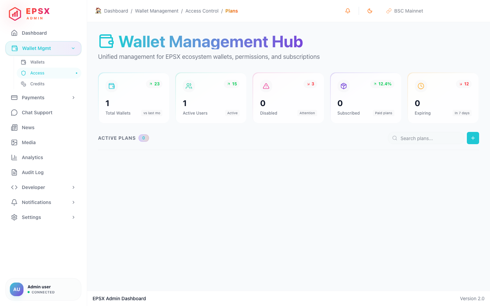](./pr3.admin.plans--desktop-light--source.png) | [](./pr3.admin.plans--desktop-light--target.png) | [](./pr3.admin.plans--desktop-light--diff.png) | 4.9485% | The target plan list is limited to the strict subscription-service DTO and does not recreate legacy permission-plan policy, hierarchy, membership, or client-owned operation claims. | pre=PASS, post=PASS |
| `pr3.admin.plans` | `mobile-dark` | PASS; 2 clean repeats | [](./pr3.admin.plans--mobile-dark--source.png) | [](./pr3.admin.plans--mobile-dark--target.png) | [](./pr3.admin.plans--mobile-dark--diff.png) | 10.3424% | The target plan list is limited to the strict subscription-service DTO and does not recreate legacy permission-plan policy, hierarchy, membership, or client-owned operation claims. | pre=PASS, post=PASS |
| `pr3.admin.wallet-detail-forbidden` | `desktop-light` | PASS; 2 clean repeats | [](./pr3.admin.wallet-detail-forbidden--desktop-light--source.png) | [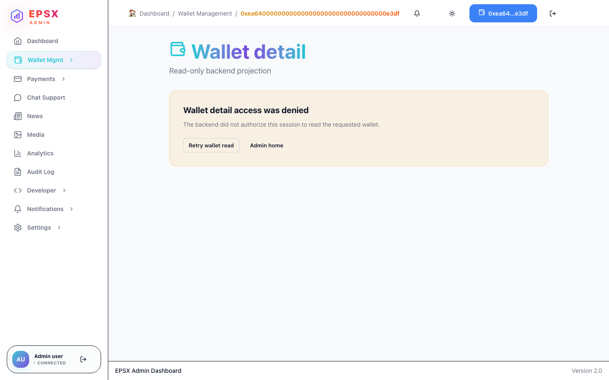](./pr3.admin.wallet-detail-forbidden--desktop-light--target.png) | [](./pr3.admin.wallet-detail-forbidden--desktop-light--diff.png) | 4.0285% | The source receives its healthy baseline while the target wallet service denies the same signed administrator. The Rust BFF removes all wallet fields and renders an explicit forbidden state. | pre=PASS, post=PASS |
| `pr3.admin.wallet-detail-forbidden` | `mobile-dark` | PASS; 2 clean repeats | [](./pr3.admin.wallet-detail-forbidden--mobile-dark--source.png) | [](./pr3.admin.wallet-detail-forbidden--mobile-dark--target.png) | [](./pr3.admin.wallet-detail-forbidden--mobile-dark--diff.png) | 5.7477% | The source receives its healthy baseline while the target wallet service denies the same signed administrator. The Rust BFF removes all wallet fields and renders an explicit forbidden state. | pre=PASS, post=PASS |
| `pr3.admin.wallet-detail` | `desktop-light` | PASS; 2 clean repeats | [](./pr3.admin.wallet-detail--desktop-light--source.png) | [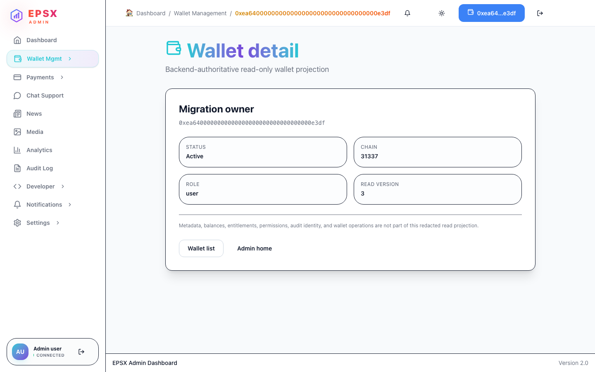](./pr3.admin.wallet-detail--desktop-light--target.png) | [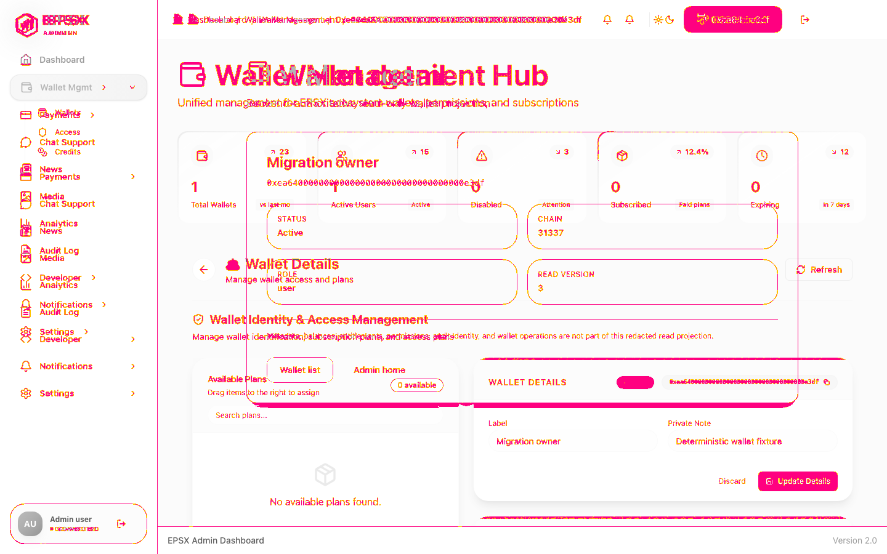](./pr3.admin.wallet-detail--desktop-light--diff.png) | 5.0812% | The target detail is a strict redacted wallet projection and omits legacy metadata, permission, group, plan, subscription, and inferred activity fields that the wallet service did not authorize for this boundary. | pre=PASS, post=PASS |
| `pr3.admin.wallet-detail` | `mobile-dark` | PASS; 2 clean repeats | [](./pr3.admin.wallet-detail--mobile-dark--source.png) | [](./pr3.admin.wallet-detail--mobile-dark--target.png) | [](./pr3.admin.wallet-detail--mobile-dark--diff.png) | 7.2497% | The target detail is a strict redacted wallet projection and omits legacy metadata, permission, group, plan, subscription, and inferred activity fields that the wallet service did not authorize for this boundary. | pre=PASS, post=PASS |
| `pr3.admin.wallet-redirect` | `desktop-light` | PASS; 2 clean repeats | [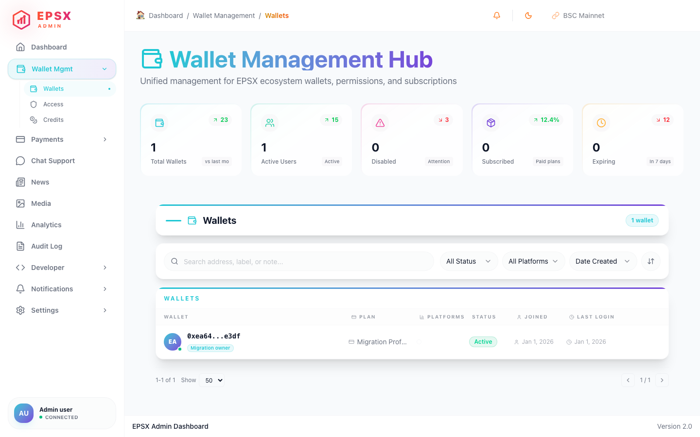](./pr3.admin.wallet-redirect--desktop-light--source.png) | [](./pr3.admin.wallet-redirect--desktop-light--target.png) | [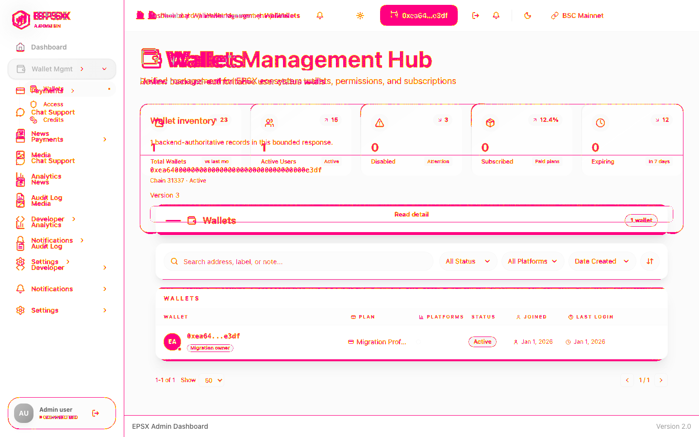](./pr3.admin.wallet-redirect--desktop-light--diff.png) | 4.5756% | The legacy wallet hub exposes unsupported mixed management claims. The target canonicalizes the entry route to the bounded backend-authoritative wallet list. | pre=PASS, post=PASS |
| `pr3.admin.wallet-redirect` | `mobile-dark` | PASS; 2 clean repeats | [](./pr3.admin.wallet-redirect--mobile-dark--source.png) | [](./pr3.admin.wallet-redirect--mobile-dark--target.png) | [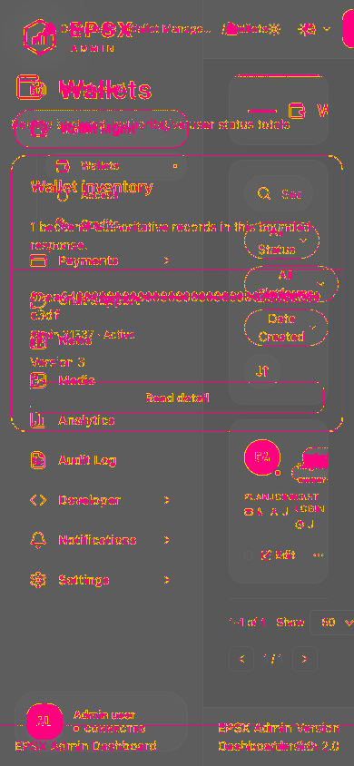](./pr3.admin.wallet-redirect--mobile-dark--diff.png) | 5.9679% | The legacy wallet hub exposes unsupported mixed management claims. The target canonicalizes the entry route to the bounded backend-authoritative wallet list. | pre=PASS, post=PASS |
| `pr3.admin.wallets-query-rejected` | `desktop-light` | PASS; 2 clean repeats | [](./pr3.admin.wallets-query-rejected--desktop-light--source.png) | [](./pr3.admin.wallets-query-rejected--desktop-light--target.png) | [](./pr3.admin.wallets-query-rejected--desktop-light--diff.png) | 4.4958% | The source applies browser-controlled search and status filters. The target rejects those unsupported query claims before upstream I/O because the wallet service exposes only a bounded authoritative list contract. | pre=PASS, post=PASS |
| `pr3.admin.wallets-query-rejected` | `mobile-dark` | PASS; 2 clean repeats | [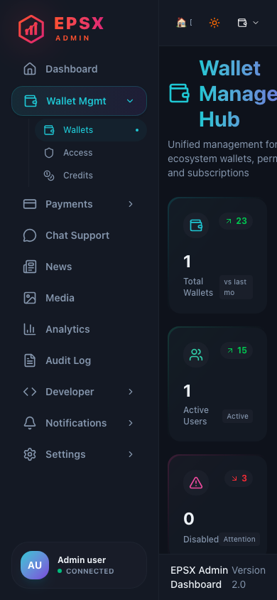](./pr3.admin.wallets-query-rejected--mobile-dark--source.png) | [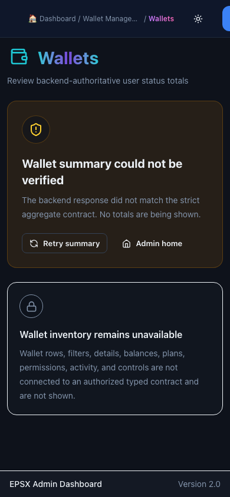](./pr3.admin.wallets-query-rejected--mobile-dark--target.png) | [](./pr3.admin.wallets-query-rejected--mobile-dark--diff.png) | 7.1202% | The source applies browser-controlled search and status filters. The target rejects those unsupported query claims before upstream I/O because the wallet service exposes only a bounded authoritative list contract. | pre=PASS, post=PASS |
| `pr3.admin.wallets` | `desktop-light` | PASS; 2 clean repeats | [](./pr3.admin.wallets--desktop-light--source.png) | [](./pr3.admin.wallets--desktop-light--target.png) | [](./pr3.admin.wallets--desktop-light--diff.png) | 4.7291% | The source presents client-side search, filter facets, activity, subscription, and platform distributions that are absent from the selected wallet service contract. The target renders only the bounded wallet rows and stored status totals verified by Rust. | pre=PASS, post=PASS |
| `pr3.admin.wallets` | `mobile-dark` | PASS; 2 clean repeats | [](./pr3.admin.wallets--mobile-dark--source.png) | [](./pr3.admin.wallets--mobile-dark--target.png) | [](./pr3.admin.wallets--mobile-dark--diff.png) | 5.4308% | The source presents client-side search, filter facets, activity, subscription, and platform distributions that are absent from the selected wallet service contract. The target renders only the bounded wallet rows and stored status totals verified by Rust. | pre=PASS, post=PASS |
| `pr3.frontend.credits` | `desktop-light` | PASS; 2 clean repeats | [](./pr3.frontend.credits--desktop-light--source.png) | [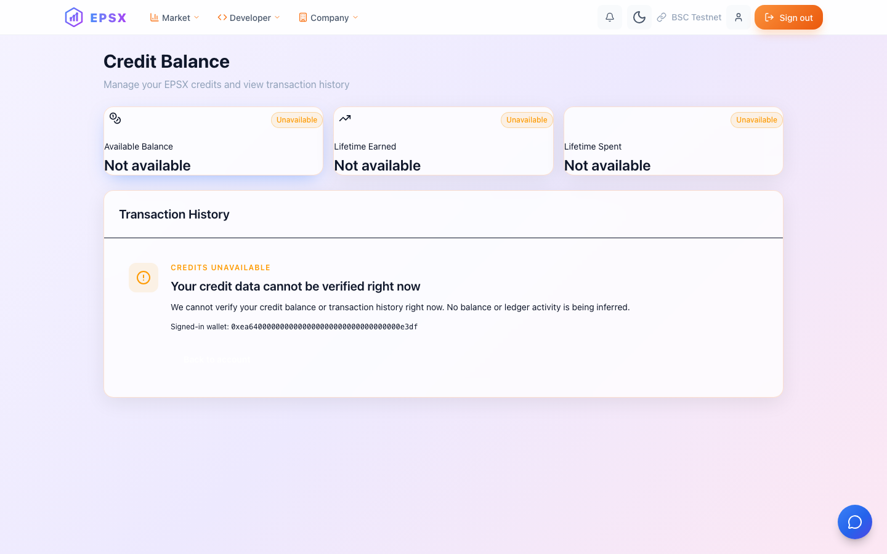](./pr3.frontend.credits--desktop-light--target.png) | [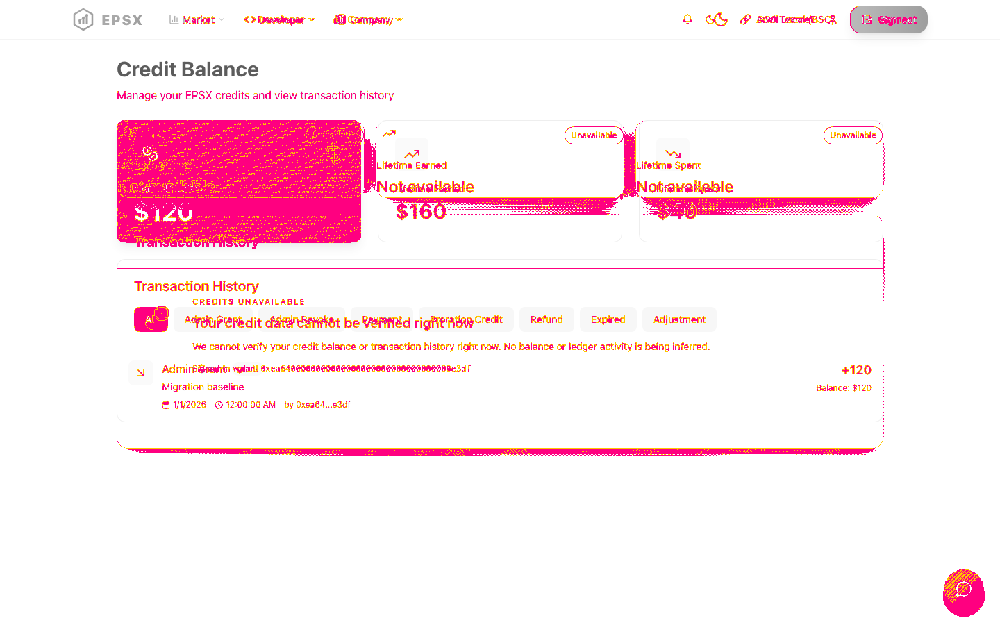](./pr3.frontend.credits--desktop-light--diff.png) | 7.4506% | The pinned source renders a legacy credits balance and transaction interpretation. The target preserves the authenticated route but explicitly reports that no owner-scoped Rust ledger contract was selected, so it cannot infer a balance, zero value, or transaction history. | pre=PASS, post=PASS |
| `pr3.frontend.credits` | `mobile-dark` | PASS; 2 clean repeats | [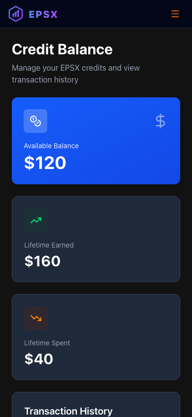](./pr3.frontend.credits--mobile-dark--source.png) | [](./pr3.frontend.credits--mobile-dark--target.png) | [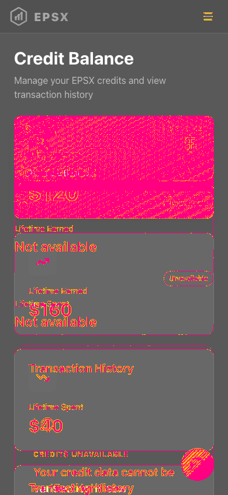](./pr3.frontend.credits--mobile-dark--diff.png) | 19.6758% | The pinned source renders a legacy credits balance and transaction interpretation. The target preserves the authenticated route but explicitly reports that no owner-scoped Rust ledger contract was selected, so it cannot infer a balance, zero value, or transaction history. | pre=PASS, post=PASS |
| `pr4.admin.analytics-empty` | `desktop-light` | PASS; 2 clean repeats | [](./pr4.admin.analytics-empty--desktop-light--source.png) | [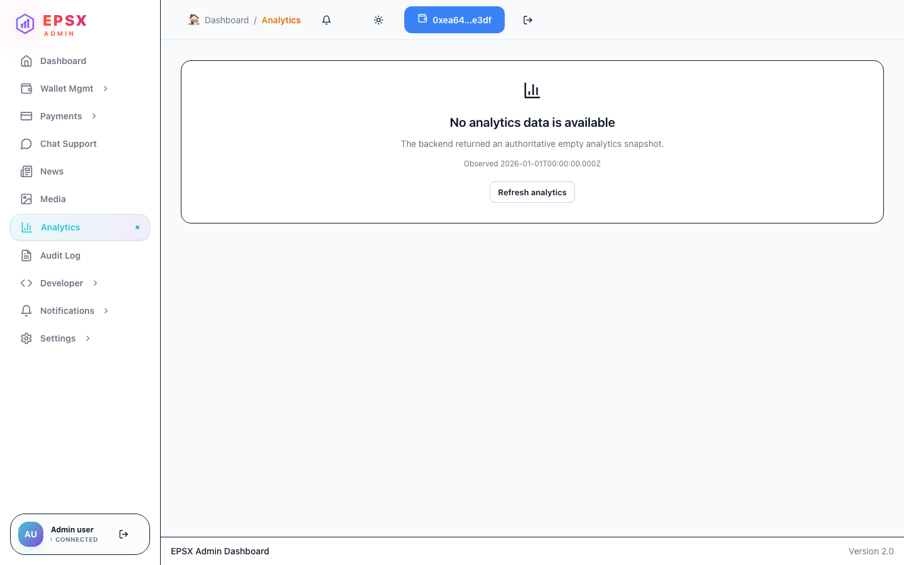](./pr4.admin.analytics-empty--desktop-light--target.png) | [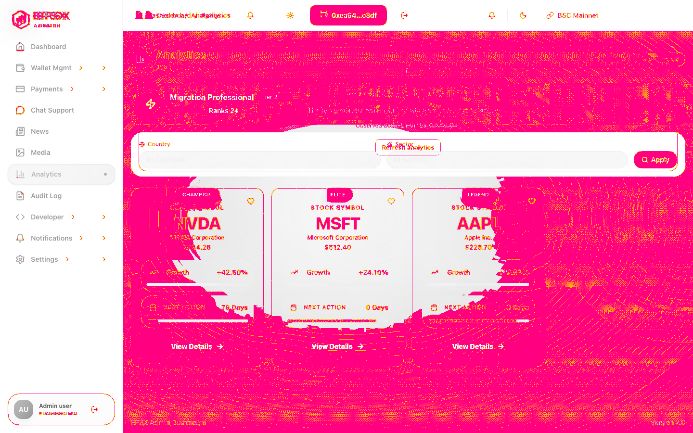](./pr4.admin.analytics-empty--desktop-light--diff.png) | 51.5894% | The target accepts the verified envelope observation time but treats a zero-valued service projection as authoritative empty data. It does not create charts, totals, freshness, or activity from frontend defaults. | pre=PASS, post=PASS |
| `pr4.admin.analytics-empty` | `mobile-dark` | PASS; 2 clean repeats | [](./pr4.admin.analytics-empty--mobile-dark--source.png) | [](./pr4.admin.analytics-empty--mobile-dark--target.png) | [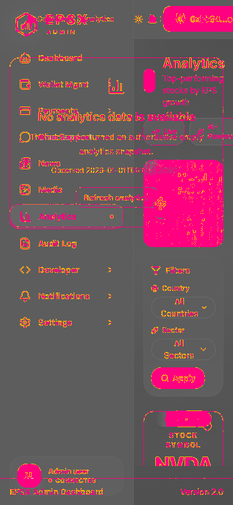](./pr4.admin.analytics-empty--mobile-dark--diff.png) | 13.2829% | The target accepts the verified envelope observation time but treats a zero-valued service projection as authoritative empty data. It does not create charts, totals, freshness, or activity from frontend defaults. | pre=PASS, post=PASS |
| `pr4.admin.analytics-forbidden` | `desktop-light` | PASS; 2 clean repeats | [](./pr4.admin.analytics-forbidden--desktop-light--source.png) | [](./pr4.admin.analytics-forbidden--desktop-light--target.png) | [](./pr4.admin.analytics-forbidden--desktop-light--diff.png) | 49.9666% | The source receives its healthy baseline while the target analytics service denies the read. The Rust BFF removes every analytics field and renders a denial that cannot be confused with a zero-valued snapshot. | pre=PASS, post=PASS |
| `pr4.admin.analytics-forbidden` | `mobile-dark` | PASS; 2 clean repeats | [](./pr4.admin.analytics-forbidden--mobile-dark--source.png) | [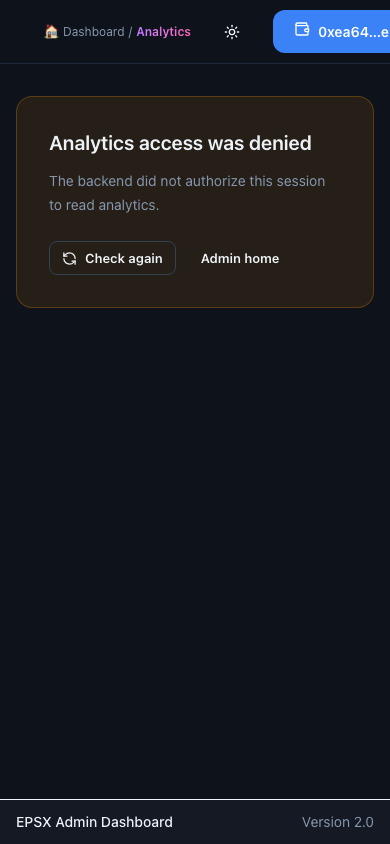](./pr4.admin.analytics-forbidden--mobile-dark--target.png) | [](./pr4.admin.analytics-forbidden--mobile-dark--diff.png) | 12.1658% | The source receives its healthy baseline while the target analytics service denies the read. The Rust BFF removes every analytics field and renders a denial that cannot be confused with a zero-valued snapshot. | pre=PASS, post=PASS |
| `pr4.admin.analytics-malformed` | `desktop-light` | PASS; 2 clean repeats | [](./pr4.admin.analytics-malformed--desktop-light--source.png) | [](./pr4.admin.analytics-malformed--desktop-light--target.png) | [](./pr4.admin.analytics-malformed--desktop-light--diff.png) | 49.9547% | The source receives its healthy baseline while the target payload attempts to own its observation time. The Rust adapter rejects data-owned freshness, exposes no analytics values, and renders a malformed state. | pre=PASS, post=PASS |
| `pr4.admin.analytics-malformed` | `mobile-dark` | PASS; 2 clean repeats | [](./pr4.admin.analytics-malformed--mobile-dark--source.png) | [](./pr4.admin.analytics-malformed--mobile-dark--target.png) | [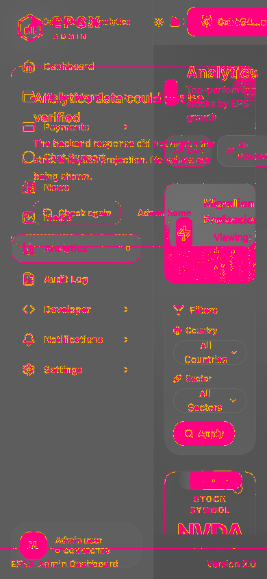](./pr4.admin.analytics-malformed--mobile-dark--diff.png) | 10.9436% | The source receives its healthy baseline while the target payload attempts to own its observation time. The Rust adapter rejects data-owned freshness, exposes no analytics values, and renders a malformed state. | pre=PASS, post=PASS |
| `pr4.admin.analytics-unavailable` | `desktop-light` | PASS; 2 clean repeats | [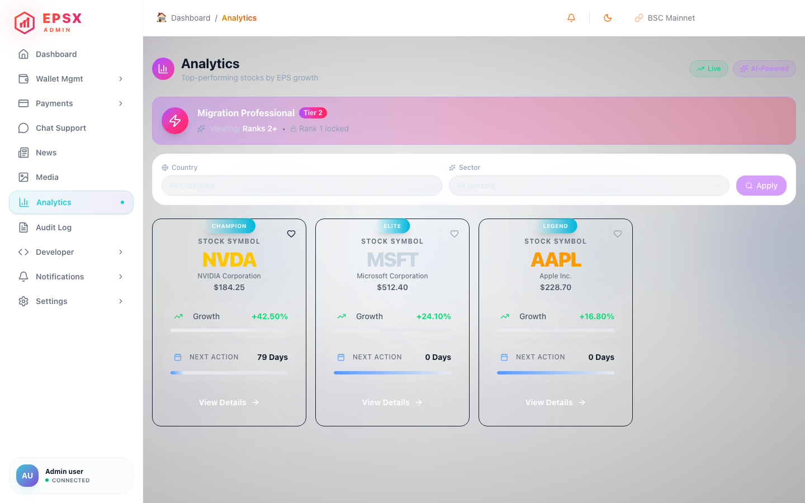](./pr4.admin.analytics-unavailable--desktop-light--source.png) | [](./pr4.admin.analytics-unavailable--desktop-light--target.png) | [](./pr4.admin.analytics-unavailable--desktop-light--diff.png) | 49.9532% | The source receives its healthy baseline while the target analytics dependency remains unavailable after retry. The Rust BFF exposes no stale totals or invented freshness and renders a distinct unavailable state. | pre=PASS, post=PASS |
| `pr4.admin.analytics-unavailable` | `mobile-dark` | PASS; 2 clean repeats | [](./pr4.admin.analytics-unavailable--mobile-dark--source.png) | [](./pr4.admin.analytics-unavailable--mobile-dark--target.png) | [](./pr4.admin.analytics-unavailable--mobile-dark--diff.png) | 10.9375% | The source receives its healthy baseline while the target analytics dependency remains unavailable after retry. The Rust BFF exposes no stale totals or invented freshness and renders a distinct unavailable state. | pre=PASS, post=PASS |
| `pr4.admin.analytics` | `desktop-light` | PASS; 2 clean repeats | [](./pr4.admin.analytics--desktop-light--source.png) | [](./pr4.admin.analytics--desktop-light--target.png) | [](./pr4.admin.analytics--desktop-light--diff.png) | 52.2293% | The target renders only bounded user, permission, plan, developer, and system values accepted by the Rust adapter and binds freshness exclusively to the verified response envelope. It removes the pinned source's unconditional Live and AI-Powered claims. | pre=PASS, post=PASS |
| `pr4.admin.analytics` | `mobile-dark` | PASS; 2 clean repeats | [](./pr4.admin.analytics--mobile-dark--source.png) | [](./pr4.admin.analytics--mobile-dark--target.png) | [](./pr4.admin.analytics--mobile-dark--diff.png) | 13.779% | The target renders only bounded user, permission, plan, developer, and system values accepted by the Rust adapter and binds freshness exclusively to the verified response envelope. It removes the pinned source's unconditional Live and AI-Powered claims. | pre=PASS, post=PASS |
| `pr4.admin.dashboard-forbidden` | `desktop-light` | PASS; 2 clean repeats | [](./pr4.admin.dashboard-forbidden--desktop-light--source.png) | [](./pr4.admin.dashboard-forbidden--desktop-light--target.png) | [](./pr4.admin.dashboard-forbidden--desktop-light--diff.png) | 8.8319% | The source receives its healthy baseline while the target analytics service denies the dashboard read. The Rust BFF removes all count and activity fields and renders the denial as distinct from empty or unavailable data. | pre=PASS, post=PASS |
| `pr4.admin.dashboard-forbidden` | `mobile-dark` | PASS; 2 clean repeats | [](./pr4.admin.dashboard-forbidden--mobile-dark--source.png) | [](./pr4.admin.dashboard-forbidden--mobile-dark--target.png) | [](./pr4.admin.dashboard-forbidden--mobile-dark--diff.png) | 10.6875% | The source receives its healthy baseline while the target analytics service denies the dashboard read. The Rust BFF removes all count and activity fields and renders the denial as distinct from empty or unavailable data. | pre=PASS, post=PASS |
| `pr4.admin.dashboard-malformed` | `desktop-light` | PASS; 2 clean repeats | [](./pr4.admin.dashboard-malformed--desktop-light--source.png) | [](./pr4.admin.dashboard-malformed--desktop-light--target.png) | [](./pr4.admin.dashboard-malformed--desktop-light--diff.png) | 8.8319% | The source receives its healthy baseline while the target dashboard snapshot violates the bounded projection. The Rust decoder fails closed and renders no totals, activity, or observation-time claim from malformed data. | pre=PASS, post=PASS |
| `pr4.admin.dashboard-malformed` | `mobile-dark` | PASS; 2 clean repeats | [](./pr4.admin.dashboard-malformed--mobile-dark--source.png) | [](./pr4.admin.dashboard-malformed--mobile-dark--target.png) | [](./pr4.admin.dashboard-malformed--mobile-dark--diff.png) | 10.6881% | The source receives its healthy baseline while the target dashboard snapshot violates the bounded projection. The Rust decoder fails closed and renders no totals, activity, or observation-time claim from malformed data. | pre=PASS, post=PASS |
| `pr4.admin.dashboard-unavailable` | `desktop-light` | PASS; 2 clean repeats | [](./pr4.admin.dashboard-unavailable--desktop-light--source.png) | [](./pr4.admin.dashboard-unavailable--desktop-light--target.png) | [](./pr4.admin.dashboard-unavailable--desktop-light--diff.png) | 8.8319% | The source receives its healthy baseline while the target dashboard dependency is unavailable. The Rust BFF exposes no cached or fabricated counts and preserves a distinct retryable unavailable state. | pre=PASS, post=PASS |
| `pr4.admin.dashboard-unavailable` | `mobile-dark` | PASS; 2 clean repeats | [](./pr4.admin.dashboard-unavailable--mobile-dark--source.png) | [](./pr4.admin.dashboard-unavailable--mobile-dark--target.png) | [](./pr4.admin.dashboard-unavailable--mobile-dark--diff.png) | 10.6881% | The source receives its healthy baseline while the target dashboard dependency is unavailable. The Rust BFF exposes no cached or fabricated counts and preserves a distinct retryable unavailable state. | pre=PASS, post=PASS |
| `pr4.admin.dashboard` | `desktop-light` | PASS; 2 clean repeats | [](./pr4.admin.dashboard--desktop-light--source.png) | [](./pr4.admin.dashboard--desktop-light--target.png) | [](./pr4.admin.dashboard--desktop-light--diff.png) | 8.8274% | The target dashboard limits its authoritative data region to the analytics service's strict total-user, active-user, and envelope observation-time projection. Legacy recent-wallet activity and additional HUD values remain non-authoritative navigation rather than service claims. | pre=PASS, post=PASS |
| `pr4.admin.dashboard` | `mobile-dark` | PASS; 2 clean repeats | [](./pr4.admin.dashboard--mobile-dark--source.png) | [](./pr4.admin.dashboard--mobile-dark--target.png) | [](./pr4.admin.dashboard--mobile-dark--diff.png) | 10.641% | The target dashboard limits its authoritative data region to the analytics service's strict total-user, active-user, and envelope observation-time projection. Legacy recent-wallet activity and additional HUD values remain non-authoritative navigation rather than service claims. | pre=PASS, post=PASS |
| `pr4.frontend.analytics-empty` | `desktop-light` | PASS; 2 clean repeats | [](./pr4.frontend.analytics-empty--desktop-light--source.png) | [](./pr4.frontend.analytics-empty--desktop-light--target.png) | [](./pr4.frontend.analytics-empty--desktop-light--diff.png) | 10.8858% | The target preserves a valid service observation while rendering an explicit empty ranking result. It does not substitute sample rows, a synthetic count, or a frontend-owned freshness label. | pre=PASS, post=PASS |
| `pr4.frontend.analytics-empty` | `mobile-dark` | PASS; 2 clean repeats | [](./pr4.frontend.analytics-empty--mobile-dark--source.png) | [](./pr4.frontend.analytics-empty--mobile-dark--target.png) | [](./pr4.frontend.analytics-empty--mobile-dark--diff.png) | 19.7904% | The target preserves a valid service observation while rendering an explicit empty ranking result. It does not substitute sample rows, a synthetic count, or a frontend-owned freshness label. | pre=PASS, post=PASS |
| `pr4.frontend.analytics-limited` | `desktop-light` | PASS; 2 clean repeats | [](./pr4.frontend.analytics-limited--desktop-light--source.png) | [](./pr4.frontend.analytics-limited--desktop-light--target.png) | [](./pr4.frontend.analytics-limited--desktop-light--diff.png) | 12.0594% | The target applies the ranking offset supplied by the Rust service, marks the locked range, and omits rows outside that entitlement. The pinned source composes plan presentation in the frontend and cannot prove the same backend-owned offset. | pre=PASS, post=PASS |
| `pr4.frontend.analytics-limited` | `mobile-dark` | PASS; 2 clean repeats | [](./pr4.frontend.analytics-limited--mobile-dark--source.png) | [](./pr4.frontend.analytics-limited--mobile-dark--target.png) | [](./pr4.frontend.analytics-limited--mobile-dark--diff.png) | 24.3161% | The target applies the ranking offset supplied by the Rust service, marks the locked range, and omits rows outside that entitlement. The pinned source composes plan presentation in the frontend and cannot prove the same backend-owned offset. | pre=PASS, post=PASS |
| `pr4.frontend.analytics-malformed` | `desktop-light` | PASS; 2 clean repeats | [](./pr4.frontend.analytics-malformed--desktop-light--source.png) | [](./pr4.frontend.analytics-malformed--desktop-light--target.png) | [](./pr4.frontend.analytics-malformed--desktop-light--diff.png) | 26.6191% | The source receives its healthy comparison baseline while the target response carries malformed freshness evidence. The Rust decoder fails closed, exposes no ranking fields, and does not present the hostile value as an observation time. | pre=PASS, post=PASS |
| `pr4.frontend.analytics-malformed` | `mobile-dark` | PASS; 2 clean repeats | [](./pr4.frontend.analytics-malformed--mobile-dark--source.png) | [](./pr4.frontend.analytics-malformed--mobile-dark--target.png) | [](./pr4.frontend.analytics-malformed--mobile-dark--diff.png) | 19.9201% | The source receives its healthy comparison baseline while the target response carries malformed freshness evidence. The Rust decoder fails closed, exposes no ranking fields, and does not present the hostile value as an observation time. | pre=PASS, post=PASS |
| `pr4.frontend.analytics-query` | `desktop-light` | PASS; 2 clean repeats | [](./pr4.frontend.analytics-query--desktop-light--source.png) | [](./pr4.frontend.analytics-query--desktop-light--target.png) | [](./pr4.frontend.analytics-query--desktop-light--diff.png) | 9.6607% | The target preserves the requested filters and pagination while rendering the service's exact row, total, access, source, and observation-time projection. It removes the pinned source's unconditional Live and AI-Powered badges because neither is established by the response. | pre=PASS, post=PASS |
| `pr4.frontend.analytics-query` | `mobile-dark` | PASS; 2 clean repeats | [](./pr4.frontend.analytics-query--mobile-dark--source.png) | [](./pr4.frontend.analytics-query--mobile-dark--target.png) | [](./pr4.frontend.analytics-query--mobile-dark--diff.png) | 20.8048% | The target preserves the requested filters and pagination while rendering the service's exact row, total, access, source, and observation-time projection. It removes the pinned source's unconditional Live and AI-Powered badges because neither is established by the response. | pre=PASS, post=PASS |
| `pr4.frontend.analytics-stale` | `desktop-light` | PASS; 2 clean repeats | [](./pr4.frontend.analytics-stale--desktop-light--source.png) | [](./pr4.frontend.analytics-stale--desktop-light--target.png) | [](./pr4.frontend.analytics-stale--desktop-light--diff.png) | 12.2451% | The target exposes the service's stale observation time and source verbatim and deliberately omits the pinned source's unconditional Live badge. No browser clock or frontend heuristic upgrades stale data to fresh. | pre=PASS, post=PASS |
| `pr4.frontend.analytics-stale` | `mobile-dark` | PASS; 2 clean repeats | [](./pr4.frontend.analytics-stale--mobile-dark--source.png) | [](./pr4.frontend.analytics-stale--mobile-dark--target.png) | [](./pr4.frontend.analytics-stale--mobile-dark--diff.png) | 21.6089% | The target exposes the service's stale observation time and source verbatim and deliberately omits the pinned source's unconditional Live badge. No browser clock or frontend heuristic upgrades stale data to fresh. | pre=PASS, post=PASS |
| `pr4.frontend.analytics-unavailable` | `desktop-light` | PASS; 2 clean repeats | [](./pr4.frontend.analytics-unavailable--desktop-light--source.png) | [](./pr4.frontend.analytics-unavailable--desktop-light--target.png) | [](./pr4.frontend.analytics-unavailable--desktop-light--diff.png) | 24.9324% | The source receives its healthy comparison baseline while the target ranking dependency is unavailable. The Rust boundary removes all ranking and freshness claims and renders a retryable unavailable state. | pre=PASS, post=PASS |
| `pr4.frontend.analytics-unavailable` | `mobile-dark` | PASS; 2 clean repeats | [](./pr4.frontend.analytics-unavailable--mobile-dark--source.png) | [](./pr4.frontend.analytics-unavailable--mobile-dark--target.png) | [](./pr4.frontend.analytics-unavailable--mobile-dark--diff.png) | 20.0805% | The source receives its healthy comparison baseline while the target ranking dependency is unavailable. The Rust boundary removes all ranking and freshness claims and renders a retryable unavailable state. | pre=PASS, post=PASS |
| `pr4.frontend.dashboard` | `desktop-light` | PASS; 2 clean repeats | [](./pr4.frontend.dashboard--desktop-light--source.png) | [](./pr4.frontend.dashboard--desktop-light--target.png) | [](./pr4.frontend.dashboard--desktop-light--diff.png) | 3.941% | No owner-scoped dashboard projection was selected for the Rust boundary. The target renders verified session identity and safe navigation but marks analytics, portfolio, and subscription summaries unavailable instead of reconstructing the pinned source's client-owned dashboard claims. | pre=PASS, post=PASS |
| `pr4.frontend.dashboard` | `mobile-dark` | PASS; 2 clean repeats | [](./pr4.frontend.dashboard--mobile-dark--source.png) | [](./pr4.frontend.dashboard--mobile-dark--target.png) | [](./pr4.frontend.dashboard--mobile-dark--diff.png) | 6.6083% | No owner-scoped dashboard projection was selected for the Rust boundary. The target renders verified session identity and safe navigation but marks analytics, portfolio, and subscription summaries unavailable instead of reconstructing the pinned source's client-owned dashboard claims. | pre=PASS, post=PASS |
| `pr4.frontend.home-rankings` | `desktop-light` | PASS; 2 clean repeats | [](./pr4.frontend.home-rankings--desktop-light--source.png) | [](./pr4.frontend.home-rankings--desktop-light--target.png) | [](./pr4.frontend.home-rankings--desktop-light--diff.png) | 8.8315% | The target preview renders only rows accepted by the strict Rust ranking projection and gives empty and unavailable data distinct states. It does not recreate the pinned source's client-composed market metrics or freshness claims. | pre=PASS, post=PASS |
| `pr4.frontend.home-rankings` | `mobile-dark` | PASS; 2 clean repeats | [](./pr4.frontend.home-rankings--mobile-dark--source.png) | [](./pr4.frontend.home-rankings--mobile-dark--target.png) | [](./pr4.frontend.home-rankings--mobile-dark--diff.png) | 20.2828% | The target preview renders only rows accepted by the strict Rust ranking projection and gives empty and unavailable data distinct states. It does not recreate the pinned source's client-composed market metrics or freshness claims. | pre=PASS, post=PASS |
| `pr4.frontend.portfolio` | `desktop-light` | PASS; 2 clean repeats | [](./pr4.frontend.portfolio--desktop-light--source.png) | [](./pr4.frontend.portfolio--desktop-light--target.png) | [](./pr4.frontend.portfolio--desktop-light--diff.png) | 84.039% | No owner-scoped Rust portfolio contract was selected for the migration. The target therefore keeps the authenticated route but removes the pinned source's browser-composed holdings, balances, search, watchlist, and Live claims and reports the capability as unavailable. | pre=PASS, post=PASS |
| `pr4.frontend.portfolio` | `mobile-dark` | PASS; 2 clean repeats | [](./pr4.frontend.portfolio--mobile-dark--source.png) | [](./pr4.frontend.portfolio--mobile-dark--target.png) | [](./pr4.frontend.portfolio--mobile-dark--diff.png) | 12.6021% | No owner-scoped Rust portfolio contract was selected for the migration. The target therefore keeps the authenticated route but removes the pinned source's browser-composed holdings, balances, search, watchlist, and Live claims and reports the capability as unavailable. | pre=PASS, post=PASS |
| `pr5.admin.media-delete` | `desktop-light` | PASS; 2 clean repeats | [](./pr5.admin.media-delete--desktop-light--source.png) | [](./pr5.admin.media-delete--desktop-light--target.png) | [](./pr5.admin.media-delete--desktop-light--diff.png) | 6.7228% | The target treats deletion as committed only after the Rust adapter accepts the backend acknowledgement, then reconciles against the authoritative bucket without retaining a deleted preview. | pre=PASS, post=PASS |
| `pr5.admin.media-delete` | `mobile-dark` | PASS; 2 clean repeats | [](./pr5.admin.media-delete--mobile-dark--source.png) | [](./pr5.admin.media-delete--mobile-dark--target.png) | [](./pr5.admin.media-delete--mobile-dark--diff.png) | 12.7947% | The target treats deletion as committed only after the Rust adapter accepts the backend acknowledgement, then reconciles against the authoritative bucket without retaining a deleted preview. | pre=PASS, post=PASS |
| `pr5.admin.media-empty` | `desktop-light` | PASS; 2 clean repeats | [](./pr5.admin.media-empty--desktop-light--source.png) | [](./pr5.admin.media-empty--desktop-light--target.png) | [](./pr5.admin.media-empty--desktop-light--diff.png) | 6.5098% | The source receives its healthy media baseline while the target service returns an authoritative empty bucket. The target removes all object metadata and does not retain a preview or cached item. | pre=PASS, post=PASS |
| `pr5.admin.media-empty` | `mobile-dark` | PASS; 2 clean repeats | [](./pr5.admin.media-empty--mobile-dark--source.png) | [](./pr5.admin.media-empty--mobile-dark--target.png) | [](./pr5.admin.media-empty--mobile-dark--diff.png) | 12.2658% | The source receives its healthy media baseline while the target service returns an authoritative empty bucket. The target removes all object metadata and does not retain a preview or cached item. | pre=PASS, post=PASS |
| `pr5.admin.media-forbidden` | `desktop-light` | PASS; 2 clean repeats | [](./pr5.admin.media-forbidden--desktop-light--source.png) | [](./pr5.admin.media-forbidden--desktop-light--target.png) | [](./pr5.admin.media-forbidden--desktop-light--diff.png) | 2.8892% | The source receives its permitted baseline while the target backend denies media access. The Rust BFF exposes no key, URL, size, MIME, modification, upload, or deletion claim. | pre=PASS, post=PASS |
| `pr5.admin.media-forbidden` | `mobile-dark` | PASS; 2 clean repeats | [](./pr5.admin.media-forbidden--mobile-dark--source.png) | [](./pr5.admin.media-forbidden--mobile-dark--target.png) | [](./pr5.admin.media-forbidden--mobile-dark--diff.png) | 8.2291% | The source receives its permitted baseline while the target backend denies media access. The Rust BFF exposes no key, URL, size, MIME, modification, upload, or deletion claim. | pre=PASS, post=PASS |
| `pr5.admin.media-malformed` | `desktop-light` | PASS; 2 clean repeats | [](./pr5.admin.media-malformed--desktop-light--source.png) | [](./pr5.admin.media-malformed--desktop-light--target.png) | [](./pr5.admin.media-malformed--desktop-light--diff.png) | 2.9442% | The source receives its healthy baseline while the target media payload violates the strict sorted projection. The Rust decoder fails closed and renders no hostile or partial object metadata. | pre=PASS, post=PASS |
| `pr5.admin.media-malformed` | `mobile-dark` | PASS; 2 clean repeats | [](./pr5.admin.media-malformed--mobile-dark--source.png) | [](./pr5.admin.media-malformed--mobile-dark--target.png) | [](./pr5.admin.media-malformed--mobile-dark--diff.png) | 8.4731% | The source receives its healthy baseline while the target media payload violates the strict sorted projection. The Rust decoder fails closed and renders no hostile or partial object metadata. | pre=PASS, post=PASS |
| `pr5.admin.media-news-ready` | `desktop-light` | PASS; 2 clean repeats | [](./pr5.admin.media-news-ready--desktop-light--source.png) | [](./pr5.admin.media-news-ready--desktop-light--target.png) | [](./pr5.admin.media-news-ready--desktop-light--diff.png) | 6.9998% | The target projects storage URLs and preview capabilities away, rendering only backend-verified news-bucket key, size, MIME, and modification metadata plus bounded BFF actions. | pre=PASS, post=PASS |
| `pr5.admin.media-news-ready` | `mobile-dark` | PASS; 2 clean repeats | [](./pr5.admin.media-news-ready--mobile-dark--source.png) | [](./pr5.admin.media-news-ready--mobile-dark--target.png) | [](./pr5.admin.media-news-ready--mobile-dark--diff.png) | 12.5796% | The target projects storage URLs and preview capabilities away, rendering only backend-verified news-bucket key, size, MIME, and modification metadata plus bounded BFF actions. | pre=PASS, post=PASS |
| `pr5.admin.media-public-ready` | `desktop-light` | PASS; 2 clean repeats | [](./pr5.admin.media-public-ready--desktop-light--source.png) | [](./pr5.admin.media-public-ready--desktop-light--target.png) | [](./pr5.admin.media-public-ready--desktop-light--diff.png) | 6.9234% | The target binds the public bucket at the Rust query boundary and renders redacted object metadata without projecting backend URLs, previews, or storage credentials into the browser. | pre=PASS, post=PASS |
| `pr5.admin.media-public-ready` | `mobile-dark` | PASS; 2 clean repeats | [](./pr5.admin.media-public-ready--mobile-dark--source.png) | [](./pr5.admin.media-public-ready--mobile-dark--target.png) | [](./pr5.admin.media-public-ready--mobile-dark--diff.png) | 12.3341% | The target binds the public bucket at the Rust query boundary and renders redacted object metadata without projecting backend URLs, previews, or storage credentials into the browser. | pre=PASS, post=PASS |
| `pr5.admin.media-unavailable` | `desktop-light` | PASS; 2 clean repeats | [](./pr5.admin.media-unavailable--desktop-light--source.png) | [](./pr5.admin.media-unavailable--desktop-light--target.png) | [](./pr5.admin.media-unavailable--desktop-light--diff.png) | 2.9231% | The source receives its healthy baseline while the target media dependency remains unavailable after retry. The Rust BFF removes stale object metadata and renders a distinct retry boundary. | pre=PASS, post=PASS |
| `pr5.admin.media-unavailable` | `mobile-dark` | PASS; 2 clean repeats | [](./pr5.admin.media-unavailable--mobile-dark--source.png) | [](./pr5.admin.media-unavailable--mobile-dark--target.png) | [](./pr5.admin.media-unavailable--mobile-dark--diff.png) | 8.4467% | The source receives its healthy baseline while the target media dependency remains unavailable after retry. The Rust BFF removes stale object metadata and renders a distinct retry boundary. | pre=PASS, post=PASS |
| `pr5.admin.media-upload-conflict` | `desktop-light` | PASS; 2 clean repeats | [](./pr5.admin.media-upload-conflict--desktop-light--source.png) | [](./pr5.admin.media-upload-conflict--desktop-light--target.png) | [](./pr5.admin.media-upload-conflict--desktop-light--diff.png) | 6.6774% | The target preserves the storage service's conflict result and does not claim that duplicate object bytes committed or display a fabricated upload acknowledgement. | pre=PASS, post=PASS |
| `pr5.admin.media-upload-conflict` | `mobile-dark` | PASS; 2 clean repeats | [](./pr5.admin.media-upload-conflict--mobile-dark--source.png) | [](./pr5.admin.media-upload-conflict--mobile-dark--target.png) | [](./pr5.admin.media-upload-conflict--mobile-dark--diff.png) | 12.8424% | The target preserves the storage service's conflict result and does not claim that duplicate object bytes committed or display a fabricated upload acknowledgement. | pre=PASS, post=PASS |
| `pr5.admin.media-upload` | `desktop-light` | PASS; 2 clean repeats | [](./pr5.admin.media-upload--desktop-light--source.png) | [](./pr5.admin.media-upload--desktop-light--target.png) | [](./pr5.admin.media-upload--desktop-light--diff.png) | 6.6557% | The target submits exact multipart bytes through the Rust BFF and renders only the redacted backend acknowledgement; storage URLs and credentials remain absent. | pre=PASS, post=PASS |
| `pr5.admin.media-upload` | `mobile-dark` | PASS; 2 clean repeats | [](./pr5.admin.media-upload--mobile-dark--source.png) | [](./pr5.admin.media-upload--mobile-dark--target.png) | [](./pr5.admin.media-upload--mobile-dark--diff.png) | 12.6783% | The target submits exact multipart bytes through the Rust BFF and renders only the redacted backend acknowledgement; storage URLs and credentials remain absent. | pre=PASS, post=PASS |
| `pr5.admin.news-conflict` | `desktop-light` | PASS; 2 clean repeats | [](./pr5.admin.news-conflict--desktop-light--source.png) | [](./pr5.admin.news-conflict--desktop-light--target.png) | [](./pr5.admin.news-conflict--desktop-light--diff.png) | 2.4757% | The target preserves the content service's optimistic 409 and replaces the editor with an explicit conflict result rather than presenting stale fields as committed. | pre=PASS, post=PASS |
| `pr5.admin.news-conflict` | `mobile-dark` | PASS; 2 clean repeats | [](./pr5.admin.news-conflict--mobile-dark--source.png) | [](./pr5.admin.news-conflict--mobile-dark--target.png) | [](./pr5.admin.news-conflict--mobile-dark--diff.png) | 4.5713% | The target preserves the content service's optimistic 409 and replaces the editor with an explicit conflict result rather than presenting stale fields as committed. | pre=PASS, post=PASS |
| `pr5.admin.news-create-form` | `desktop-light` | PASS; 2 clean repeats | [](./pr5.admin.news-create-form--desktop-light--source.png) | [](./pr5.admin.news-create-form--desktop-light--target.png) | [](./pr5.admin.news-create-form--desktop-light--diff.png) | 2.4214% | The target replaces the source's client-owned rich editor with a bounded server form whose accepted fields, idempotency key, and publication status are validated by the Rust BFF. | pre=PASS, post=PASS |
| `pr5.admin.news-create-form` | `mobile-dark` | PASS; 2 clean repeats | [](./pr5.admin.news-create-form--mobile-dark--source.png) | [](./pr5.admin.news-create-form--mobile-dark--target.png) | [](./pr5.admin.news-create-form--mobile-dark--diff.png) | 6.0697% | The target replaces the source's client-owned rich editor with a bounded server form whose accepted fields, idempotency key, and publication status are validated by the Rust BFF. | pre=PASS, post=PASS |
| `pr5.admin.news-create-submit` | `desktop-light` | PASS; 2 clean repeats | [](./pr5.admin.news-create-submit--desktop-light--source.png) | [](./pr5.admin.news-create-submit--desktop-light--target.png) | [](./pr5.admin.news-create-submit--desktop-light--diff.png) | 2.5762% | The target treats creation as committed only after the Rust adapter accepts the strict response and then renders the returned canonical editor projection; the browser does not synthesize a draft or revision. | pre=PASS, post=PASS |
| `pr5.admin.news-create-submit` | `mobile-dark` | PASS; 2 clean repeats | [](./pr5.admin.news-create-submit--mobile-dark--source.png) | [](./pr5.admin.news-create-submit--mobile-dark--target.png) | [](./pr5.admin.news-create-submit--mobile-dark--diff.png) | 5.8816% | The target treats creation as committed only after the Rust adapter accepts the strict response and then renders the returned canonical editor projection; the browser does not synthesize a draft or revision. | pre=PASS, post=PASS |
| `pr5.admin.news-delete` | `desktop-light` | PASS; 2 clean repeats | [](./pr5.admin.news-delete--desktop-light--source.png) | [](./pr5.admin.news-delete--desktop-light--target.png) | [](./pr5.admin.news-delete--desktop-light--diff.png) | 3.683% | The target renders deletion as committed only after the versioned Rust mutation succeeds, then reloads the backend inventory and displays the bounded audit-facing result. | pre=PASS, post=PASS |
| `pr5.admin.news-delete` | `mobile-dark` | PASS; 2 clean repeats | [](./pr5.admin.news-delete--mobile-dark--source.png) | [](./pr5.admin.news-delete--mobile-dark--target.png) | [](./pr5.admin.news-delete--mobile-dark--diff.png) | 8.848% | The target renders deletion as committed only after the versioned Rust mutation succeeds, then reloads the backend inventory and displays the bounded audit-facing result. | pre=PASS, post=PASS |
| `pr5.admin.news-draft-filter` | `desktop-light` | PASS; 2 clean repeats | [](./pr5.admin.news-draft-filter--desktop-light--source.png) | [](./pr5.admin.news-draft-filter--desktop-light--target.png) | [](./pr5.admin.news-draft-filter--desktop-light--diff.png) | 4.0046% | The target preserves the backend-owned draft filter and displays the exact strict projection without deriving publication or pin state in the browser. | pre=PASS, post=PASS |
| `pr5.admin.news-draft-filter` | `mobile-dark` | PASS; 2 clean repeats | [](./pr5.admin.news-draft-filter--mobile-dark--source.png) | [](./pr5.admin.news-draft-filter--mobile-dark--target.png) | [](./pr5.admin.news-draft-filter--mobile-dark--diff.png) | 8.8939% | The target preserves the backend-owned draft filter and displays the exact strict projection without deriving publication or pin state in the browser. | pre=PASS, post=PASS |
| `pr5.admin.news-edit-ready` | `desktop-light` | PASS; 2 clean repeats | [](./pr5.admin.news-edit-ready--desktop-light--source.png) | [](./pr5.admin.news-edit-ready--desktop-light--target.png) | [](./pr5.admin.news-edit-ready--desktop-light--diff.png) | 2.8497% | The target removes the source's browser-only rich-text and local image-editor behaviors and retains a bounded server form populated only from the canonical article and revision returned by the Rust content adapter. | pre=PASS, post=PASS |
| `pr5.admin.news-edit-ready` | `mobile-dark` | PASS; 2 clean repeats | [](./pr5.admin.news-edit-ready--mobile-dark--source.png) | [](./pr5.admin.news-edit-ready--mobile-dark--target.png) | [](./pr5.admin.news-edit-ready--mobile-dark--diff.png) | 5.9624% | The target removes the source's browser-only rich-text and local image-editor behaviors and retains a bounded server form populated only from the canonical article and revision returned by the Rust content adapter. | pre=PASS, post=PASS |
| `pr5.admin.news-empty` | `desktop-light` | PASS; 2 clean repeats | [](./pr5.admin.news-empty--desktop-light--source.png) | [](./pr5.admin.news-empty--desktop-light--target.png) | [](./pr5.admin.news-empty--desktop-light--diff.png) | 2.5336% | The source receives its healthy inventory baseline while the target content service returns a structurally valid zero-record page. The target renders authoritative empty data and does not retain an article row from the prior state. | pre=PASS, post=PASS |
| `pr5.admin.news-empty` | `mobile-dark` | PASS; 2 clean repeats | [](./pr5.admin.news-empty--mobile-dark--source.png) | [](./pr5.admin.news-empty--mobile-dark--target.png) | [](./pr5.admin.news-empty--mobile-dark--diff.png) | 6.9562% | The source receives its healthy inventory baseline while the target content service returns a structurally valid zero-record page. The target renders authoritative empty data and does not retain an article row from the prior state. | pre=PASS, post=PASS |
| `pr5.admin.news-forbidden` | `desktop-light` | PASS; 2 clean repeats | [](./pr5.admin.news-forbidden--desktop-light--source.png) | [](./pr5.admin.news-forbidden--desktop-light--target.png) | [](./pr5.admin.news-forbidden--desktop-light--diff.png) | 2.5155% | The source receives its permitted baseline while the target backend denies content access. The Rust BFF removes all article and mutation fields and renders a denial distinct from empty or unavailable data. | pre=PASS, post=PASS |
| `pr5.admin.news-forbidden` | `mobile-dark` | PASS; 2 clean repeats | [](./pr5.admin.news-forbidden--mobile-dark--source.png) | [](./pr5.admin.news-forbidden--mobile-dark--target.png) | [](./pr5.admin.news-forbidden--mobile-dark--diff.png) | 6.9346% | The source receives its permitted baseline while the target backend denies content access. The Rust BFF removes all article and mutation fields and renders a denial distinct from empty or unavailable data. | pre=PASS, post=PASS |
| `pr5.admin.news-image-upload` | `desktop-light` | PASS; 2 clean repeats | [](./pr5.admin.news-image-upload--desktop-light--source.png) | [](./pr5.admin.news-image-upload--desktop-light--target.png) | [](./pr5.admin.news-image-upload--desktop-light--diff.png) | 3.1954% | The target accepts exact multipart bytes at the Rust boundary, validates the returned HTTPS URL, and renders a committed upload notice without exposing storage credentials or claiming that the article itself was saved. | pre=PASS, post=PASS |
| `pr5.admin.news-image-upload` | `mobile-dark` | PASS; 2 clean repeats | [](./pr5.admin.news-image-upload--mobile-dark--source.png) | [](./pr5.admin.news-image-upload--mobile-dark--target.png) | [](./pr5.admin.news-image-upload--mobile-dark--diff.png) | 6.3996% | The target accepts exact multipart bytes at the Rust boundary, validates the returned HTTPS URL, and renders a committed upload notice without exposing storage credentials or claiming that the article itself was saved. | pre=PASS, post=PASS |
| `pr5.admin.news-malformed` | `desktop-light` | PASS; 2 clean repeats | [](./pr5.admin.news-malformed--desktop-light--source.png) | [](./pr5.admin.news-malformed--desktop-light--target.png) | [](./pr5.admin.news-malformed--desktop-light--diff.png) | 2.5565% | The source receives its healthy baseline while the target content payload violates the closed admin envelope. The Rust adapter rejects the response and renders no article, revision, or publication claims. | pre=PASS, post=PASS |
| `pr5.admin.news-malformed` | `mobile-dark` | PASS; 2 clean repeats | [](./pr5.admin.news-malformed--mobile-dark--source.png) | [](./pr5.admin.news-malformed--mobile-dark--target.png) | [](./pr5.admin.news-malformed--mobile-dark--diff.png) | 7.1403% | The source receives its healthy baseline while the target content payload violates the closed admin envelope. The Rust adapter rejects the response and renders no article, revision, or publication claims. | pre=PASS, post=PASS |
| `pr5.admin.news-publish` | `desktop-light` | PASS; 2 clean repeats | [](./pr5.admin.news-publish--desktop-light--source.png) | [](./pr5.admin.news-publish--desktop-light--target.png) | [](./pr5.admin.news-publish--desktop-light--diff.png) | 2.8497% | The target preserves publication as a versioned Rust content mutation and renders only the returned article projection after the service commits the transition. | pre=PASS, post=PASS |
| `pr5.admin.news-publish` | `mobile-dark` | PASS; 2 clean repeats | [](./pr5.admin.news-publish--mobile-dark--source.png) | [](./pr5.admin.news-publish--mobile-dark--target.png) | [](./pr5.admin.news-publish--mobile-dark--diff.png) | 5.9624% | The target preserves publication as a versioned Rust content mutation and renders only the returned article projection after the service commits the transition. | pre=PASS, post=PASS |
| `pr5.admin.news-ready` | `desktop-light` | PASS; 2 clean repeats | [](./pr5.admin.news-ready--desktop-light--source.png) | [](./pr5.admin.news-ready--desktop-light--target.png) | [](./pr5.admin.news-ready--desktop-light--diff.png) | 3.978% | The target inventory renders only the bounded article summary accepted by the Rust content adapter and replaces legacy client mutation affordances with links and controls backed by explicit BFF routes. | pre=PASS, post=PASS |
| `pr5.admin.news-ready` | `mobile-dark` | PASS; 2 clean repeats | [](./pr5.admin.news-ready--mobile-dark--source.png) | [](./pr5.admin.news-ready--mobile-dark--target.png) | [](./pr5.admin.news-ready--mobile-dark--diff.png) | 8.6882% | The target inventory renders only the bounded article summary accepted by the Rust content adapter and replaces legacy client mutation affordances with links and controls backed by explicit BFF routes. | pre=PASS, post=PASS |
| `pr5.admin.news-unavailable` | `desktop-light` | PASS; 2 clean repeats | [](./pr5.admin.news-unavailable--desktop-light--source.png) | [](./pr5.admin.news-unavailable--desktop-light--target.png) | [](./pr5.admin.news-unavailable--desktop-light--diff.png) | 2.5556% | The source receives its healthy baseline while the target content dependency remains unavailable after retry. The target exposes no stale inventory or mutation authority and preserves an explicit retryable state. | pre=PASS, post=PASS |
| `pr5.admin.news-unavailable` | `mobile-dark` | PASS; 2 clean repeats | [](./pr5.admin.news-unavailable--mobile-dark--source.png) | [](./pr5.admin.news-unavailable--mobile-dark--target.png) | [](./pr5.admin.news-unavailable--mobile-dark--diff.png) | 7.1245% | The source receives its healthy baseline while the target content dependency remains unavailable after retry. The target exposes no stale inventory or mutation authority and preserves an explicit retryable state. | pre=PASS, post=PASS |
| `pr5.admin.news-unpublish` | `desktop-light` | PASS; 2 clean repeats | [](./pr5.admin.news-unpublish--desktop-light--source.png) | [](./pr5.admin.news-unpublish--desktop-light--target.png) | [](./pr5.admin.news-unpublish--desktop-light--diff.png) | 2.8497% | The target preserves unpublication as a versioned Rust content mutation and renders only the returned draft projection after the service commits the transition. | pre=PASS, post=PASS |
| `pr5.admin.news-unpublish` | `mobile-dark` | PASS; 2 clean repeats | [](./pr5.admin.news-unpublish--mobile-dark--source.png) | [](./pr5.admin.news-unpublish--mobile-dark--target.png) | [](./pr5.admin.news-unpublish--mobile-dark--diff.png) | 5.9624% | The target preserves unpublication as a versioned Rust content mutation and renders only the returned draft projection after the service commits the transition. | pre=PASS, post=PASS |
| `pr5.admin.news-update` | `desktop-light` | PASS; 2 clean repeats | [](./pr5.admin.news-update--desktop-light--source.png) | [](./pr5.admin.news-update--desktop-light--target.png) | [](./pr5.admin.news-update--desktop-light--diff.png) | 2.8497% | The target submits the backend revision and idempotency key and renders the article returned after the write. It does not optimistically claim that the edited title committed from browser state. | pre=PASS, post=PASS |
| `pr5.admin.news-update` | `mobile-dark` | PASS; 2 clean repeats | [](./pr5.admin.news-update--mobile-dark--source.png) | [](./pr5.admin.news-update--mobile-dark--target.png) | [](./pr5.admin.news-update--mobile-dark--diff.png) | 5.9624% | The target submits the backend revision and idempotency key and renders the article returned after the write. It does not optimistically claim that the edited title committed from browser state. | pre=PASS, post=PASS |
| `pr5.frontend.manual` | `desktop-light` | PASS; 2 clean repeats | [](./pr5.frontend.manual--desktop-light--source.png) | [](./pr5.frontend.manual--desktop-light--target.png) | [](./pr5.frontend.manual--desktop-light--diff.png) | 0.5643% | Within the 1% campaign visual threshold. | pre=PASS, post=PASS |
| `pr5.frontend.manual` | `mobile-dark` | PASS; 2 clean repeats | [](./pr5.frontend.manual--mobile-dark--source.png) | [](./pr5.frontend.manual--mobile-dark--target.png) | [](./pr5.frontend.manual--mobile-dark--diff.png) | 22.473% | At 390px the pinned source retains its 224px fixed desktop sidebar, leaving the feature cards clipped and their controls outside the usable viewport. The target removes that unsupported fixed-sidebar mode at the mobile breakpoint while retaining every category anchor in an overflow-safe index and every manual card and action. | pre=PASS, post=PASS |
| `pr5.frontend.news-detail-malformed` | `desktop-light` | PASS; 2 clean repeats | [](./pr5.frontend.news-detail-malformed--desktop-light--source.png) | [](./pr5.frontend.news-detail-malformed--desktop-light--target.png) | [](./pr5.frontend.news-detail-malformed--desktop-light--diff.png) | 2.0219% | The source receives its healthy article baseline while the target detail payload is malformed. The strict Rust projection fails closed and shows no unverified title, content, cover, author, or publication metadata. | pre=PASS, post=PASS |
| `pr5.frontend.news-detail-malformed` | `mobile-dark` | PASS; 2 clean repeats | [](./pr5.frontend.news-detail-malformed--mobile-dark--source.png) | [](./pr5.frontend.news-detail-malformed--mobile-dark--target.png) | [](./pr5.frontend.news-detail-malformed--mobile-dark--diff.png) | 5.2816% | The source receives its healthy article baseline while the target detail payload is malformed. The strict Rust projection fails closed and shows no unverified title, content, cover, author, or publication metadata. | pre=PASS, post=PASS |
| `pr5.frontend.news-detail-not-found` | `desktop-light` | PASS; 2 clean repeats | [](./pr5.frontend.news-detail-not-found--desktop-light--source.png) | [](./pr5.frontend.news-detail-not-found--desktop-light--target.png) | [](./pr5.frontend.news-detail-not-found--desktop-light--diff.png) | 0.8106% | Within the 1% campaign visual threshold. | pre=PASS, post=PASS |
| `pr5.frontend.news-detail-not-found` | `mobile-dark` | PASS; 2 clean repeats | [](./pr5.frontend.news-detail-not-found--mobile-dark--source.png) | [](./pr5.frontend.news-detail-not-found--mobile-dark--target.png) | [](./pr5.frontend.news-detail-not-found--mobile-dark--diff.png) | 1.6411% | The pinned source converts the missing slug to a generic client 404 body with HTTP 200, while the target preserves the content service's truthful 404 and exposes no article fields. The compact mobile bodies therefore differ beyond the default threshold. | pre=PASS, post=PASS |
| `pr5.frontend.news-detail-ready` | `desktop-light` | PASS; 2 clean repeats | [](./pr5.frontend.news-detail-ready--desktop-light--source.png) | [](./pr5.frontend.news-detail-ready--desktop-light--target.png) | [](./pr5.frontend.news-detail-ready--desktop-light--diff.png) | 0.6907% | Within the 1% campaign visual threshold. | pre=PASS, post=PASS |
| `pr5.frontend.news-detail-ready` | `mobile-dark` | PASS; 2 clean repeats | [](./pr5.frontend.news-detail-ready--mobile-dark--source.png) | [](./pr5.frontend.news-detail-ready--mobile-dark--target.png) | [](./pr5.frontend.news-detail-ready--mobile-dark--diff.png) | 0.8367% | Within the 1% campaign visual threshold. | pre=PASS, post=PASS |
| `pr5.frontend.news-detail-unavailable` | `desktop-light` | PASS; 2 clean repeats | [](./pr5.frontend.news-detail-unavailable--desktop-light--source.png) | [](./pr5.frontend.news-detail-unavailable--desktop-light--target.png) | [](./pr5.frontend.news-detail-unavailable--desktop-light--diff.png) | 2.3314% | The source receives its healthy article baseline while the target detail dependency is unavailable. The target removes the title, body, author, and publication claims and renders the Rust-classified retry boundary. | pre=PASS, post=PASS |
| `pr5.frontend.news-detail-unavailable` | `mobile-dark` | PASS; 2 clean repeats | [](./pr5.frontend.news-detail-unavailable--mobile-dark--source.png) | [](./pr5.frontend.news-detail-unavailable--mobile-dark--target.png) | [](./pr5.frontend.news-detail-unavailable--mobile-dark--diff.png) | 6.2571% | The source receives its healthy article baseline while the target detail dependency is unavailable. The target removes the title, body, author, and publication claims and renders the Rust-classified retry boundary. | pre=PASS, post=PASS |
| `pr5.frontend.news-empty` | `desktop-light` | PASS; 2 clean repeats | [](./pr5.frontend.news-empty--desktop-light--source.png) | [](./pr5.frontend.news-empty--desktop-light--target.png) | [](./pr5.frontend.news-empty--desktop-light--diff.png) | 41.7863% | The source receives its healthy published-content baseline while the target content service returns an authoritative zero-row result. The target removes the source article card and renders the exact empty projection without sample or cached content. | pre=PASS, post=PASS |
| `pr5.frontend.news-empty` | `mobile-dark` | PASS; 2 clean repeats | [](./pr5.frontend.news-empty--mobile-dark--source.png) | [](./pr5.frontend.news-empty--mobile-dark--target.png) | [](./pr5.frontend.news-empty--mobile-dark--diff.png) | 4.1099% | The source receives its healthy published-content baseline while the target content service returns an authoritative zero-row result. The target removes the source article card and renders the exact empty projection without sample or cached content. | pre=PASS, post=PASS |
| `pr5.frontend.news-filter` | `desktop-light` | PASS; 2 clean repeats | [](./pr5.frontend.news-filter--desktop-light--source.png) | [](./pr5.frontend.news-filter--desktop-light--target.png) | [](./pr5.frontend.news-filter--desktop-light--diff.png) | 0.6201% | Within the 1% campaign visual threshold. | pre=PASS, post=PASS |
| `pr5.frontend.news-filter` | `mobile-dark` | PASS; 2 clean repeats | [](./pr5.frontend.news-filter--mobile-dark--source.png) | [](./pr5.frontend.news-filter--mobile-dark--target.png) | [](./pr5.frontend.news-filter--mobile-dark--diff.png) | 0.5623% | Within the 1% campaign visual threshold. | pre=PASS, post=PASS |
| `pr5.frontend.news-malformed` | `desktop-light` | PASS; 2 clean repeats | [](./pr5.frontend.news-malformed--desktop-light--source.png) | [](./pr5.frontend.news-malformed--desktop-light--target.png) | [](./pr5.frontend.news-malformed--desktop-light--diff.png) | 43.0887% | The source receives its healthy comparison baseline while the target content response violates the strict publication envelope. The Rust decoder fails closed and renders no fields from the malformed payload. | pre=PASS, post=PASS |
| `pr5.frontend.news-malformed` | `mobile-dark` | PASS; 2 clean repeats | [](./pr5.frontend.news-malformed--mobile-dark--source.png) | [](./pr5.frontend.news-malformed--mobile-dark--target.png) | [](./pr5.frontend.news-malformed--mobile-dark--diff.png) | 4.7138% | The source receives its healthy comparison baseline while the target content response violates the strict publication envelope. The Rust decoder fails closed and renders no fields from the malformed payload. | pre=PASS, post=PASS |
| `pr5.frontend.news-ready` | `desktop-light` | PASS; 2 clean repeats | [](./pr5.frontend.news-ready--desktop-light--source.png) | [](./pr5.frontend.news-ready--desktop-light--target.png) | [](./pr5.frontend.news-ready--desktop-light--diff.png) | 0.6201% | Within the 1% campaign visual threshold. | pre=PASS, post=PASS |
| `pr5.frontend.news-ready` | `mobile-dark` | PASS; 2 clean repeats | [](./pr5.frontend.news-ready--mobile-dark--source.png) | [](./pr5.frontend.news-ready--mobile-dark--target.png) | [](./pr5.frontend.news-ready--mobile-dark--diff.png) | 0.5623% | Within the 1% campaign visual threshold. | pre=PASS, post=PASS |
| `pr5.frontend.news-unavailable` | `desktop-light` | PASS; 2 clean repeats | [](./pr5.frontend.news-unavailable--desktop-light--source.png) | [](./pr5.frontend.news-unavailable--desktop-light--target.png) | [](./pr5.frontend.news-unavailable--desktop-light--diff.png) | 43.085% | The source receives its healthy comparison baseline while the target content dependency remains unavailable after retry. The Rust BFF exposes no article or publication claims and renders a distinct retryable dependency state. | pre=PASS, post=PASS |
| `pr5.frontend.news-unavailable` | `mobile-dark` | PASS; 2 clean repeats | [](./pr5.frontend.news-unavailable--mobile-dark--source.png) | [](./pr5.frontend.news-unavailable--mobile-dark--target.png) | [](./pr5.frontend.news-unavailable--mobile-dark--diff.png) | 5.5055% | The source receives its healthy comparison baseline while the target content dependency remains unavailable after retry. The Rust BFF exposes no article or publication claims and renders a distinct retryable dependency state. | pre=PASS, post=PASS |
| `pr6.admin.chat-detail` | `desktop-light` | PASS; 2 clean repeats | [](./pr6.admin.chat-detail--desktop-light--source.png) | [](./pr6.admin.chat-detail--desktop-light--target.png) | [](./pr6.admin.chat-detail--desktop-light--diff.png) | 7.165% | The pinned source route falls into its generic error boundary when its chat dependency is unavailable. The target instead renders the strictly decoded, owner-isolated conversation and messages returned by the Rust BFF. | pre=PASS, post=PASS |
| `pr6.admin.chat-detail` | `mobile-dark` | PASS; 2 clean repeats | [](./pr6.admin.chat-detail--mobile-dark--source.png) | [](./pr6.admin.chat-detail--mobile-dark--target.png) | [](./pr6.admin.chat-detail--mobile-dark--diff.png) | 7.8472% | The pinned source route falls into its generic error boundary when its chat dependency is unavailable. The target instead renders the strictly decoded, owner-isolated conversation and messages returned by the Rust BFF. | pre=PASS, post=PASS |
| `pr6.admin.chat-empty` | `desktop-light` | PASS; 2 clean repeats | [](./pr6.admin.chat-empty--desktop-light--source.png) | [](./pr6.admin.chat-empty--desktop-light--target.png) | [](./pr6.admin.chat-empty--desktop-light--diff.png) | 1.8053% | The target renders an empty support queue only after receiving a valid owner-scoped zero-item projection. It omits the source's synthesized operational counters because those values were not supplied by the backend. | pre=PASS, post=PASS |
| `pr6.admin.chat-empty` | `mobile-dark` | PASS; 2 clean repeats | [](./pr6.admin.chat-empty--mobile-dark--source.png) | [](./pr6.admin.chat-empty--mobile-dark--target.png) | [](./pr6.admin.chat-empty--mobile-dark--diff.png) | 6.8687% | The target renders an empty support queue only after receiving a valid owner-scoped zero-item projection. It omits the source's synthesized operational counters because those values were not supplied by the backend. | pre=PASS, post=PASS |
| `pr6.admin.chat-forbidden` | `desktop-light` | PASS; 2 clean repeats | [](./pr6.admin.chat-forbidden--desktop-light--source.png) | [](./pr6.admin.chat-forbidden--desktop-light--target.png) | [](./pr6.admin.chat-forbidden--desktop-light--diff.png) | 1.6877% | The target preserves the Rust BFF chat permission denial and withholds conversation and ownership data. The source substitutes zero counters and an empty queue instead of representing that authorization boundary. | pre=PASS, post=PASS |
| `pr6.admin.chat-forbidden` | `mobile-dark` | PASS; 2 clean repeats | [](./pr6.admin.chat-forbidden--mobile-dark--source.png) | [](./pr6.admin.chat-forbidden--mobile-dark--target.png) | [](./pr6.admin.chat-forbidden--mobile-dark--diff.png) | 6.2091% | The target preserves the Rust BFF chat permission denial and withholds conversation and ownership data. The source substitutes zero counters and an empty queue instead of representing that authorization boundary. | pre=PASS, post=PASS |
| `pr6.admin.chat-malformed` | `desktop-light` | PASS; 2 clean repeats | [](./pr6.admin.chat-malformed--desktop-light--source.png) | [](./pr6.admin.chat-malformed--desktop-light--target.png) | [](./pr6.admin.chat-malformed--desktop-light--diff.png) | 1.7583% | The target rejects malformed conversation data at the strict Rust projection boundary and exposes no ownership claims. The source's synthesized empty queue cannot distinguish malformed backend data from a valid empty response. | pre=PASS, post=PASS |
| `pr6.admin.chat-malformed` | `mobile-dark` | PASS; 2 clean repeats | [](./pr6.admin.chat-malformed--mobile-dark--source.png) | [](./pr6.admin.chat-malformed--mobile-dark--target.png) | [](./pr6.admin.chat-malformed--mobile-dark--diff.png) | 6.5767% | The target rejects malformed conversation data at the strict Rust projection boundary and exposes no ownership claims. The source's synthesized empty queue cannot distinguish malformed backend data from a valid empty response. | pre=PASS, post=PASS |
| `pr6.admin.chat-reply-conflict` | `desktop-light` | PASS; 2 clean repeats | [](./pr6.admin.chat-reply-conflict--desktop-light--source.png) | [](./pr6.admin.chat-reply-conflict--desktop-light--target.png) | [](./pr6.admin.chat-reply-conflict--desktop-light--diff.png) | 7.3519% | The target preserves the backend retry conflict and does not present a successful reply claim. The pinned source remains in its dependency error boundary and has no equivalent deterministic conflict state. | pre=PASS, post=PASS |
| `pr6.admin.chat-reply-conflict` | `mobile-dark` | PASS; 2 clean repeats | [](./pr6.admin.chat-reply-conflict--mobile-dark--source.png) | [](./pr6.admin.chat-reply-conflict--mobile-dark--target.png) | [](./pr6.admin.chat-reply-conflict--mobile-dark--diff.png) | 8.0742% | The target preserves the backend retry conflict and does not present a successful reply claim. The pinned source remains in its dependency error boundary and has no equivalent deterministic conflict state. | pre=PASS, post=PASS |
| `pr6.admin.chat-reply` | `desktop-light` | PASS; 2 clean repeats | [](./pr6.admin.chat-reply--desktop-light--source.png) | [](./pr6.admin.chat-reply--desktop-light--target.png) | [](./pr6.admin.chat-reply--desktop-light--diff.png) | 7.3527% | The target reports a reply only after the Rust BFF validates the owner-scoped conversation, message body, and idempotency key and receives backend acknowledgement. The pinned source remains in its dependency error boundary. | pre=PASS, post=PASS |
| `pr6.admin.chat-reply` | `mobile-dark` | PASS; 2 clean repeats | [](./pr6.admin.chat-reply--mobile-dark--source.png) | [](./pr6.admin.chat-reply--mobile-dark--target.png) | [](./pr6.admin.chat-reply--mobile-dark--diff.png) | 8.0794% | The target reports a reply only after the Rust BFF validates the owner-scoped conversation, message body, and idempotency key and receives backend acknowledgement. The pinned source remains in its dependency error boundary. | pre=PASS, post=PASS |
| `pr6.admin.chat` | `desktop-light` | PASS; 2 clean repeats | [](./pr6.admin.chat--desktop-light--source.png) | [](./pr6.admin.chat--desktop-light--target.png) | [](./pr6.admin.chat--desktop-light--diff.png) | 1.9931% | The target renders the owner-isolated conversation returned by the strict Rust BFF projection. The source converts its unavailable dependency into synthesized zero counters and an empty queue, which would conceal the verified conversation. | pre=PASS, post=PASS |
| `pr6.admin.chat` | `mobile-dark` | PASS; 2 clean repeats | [](./pr6.admin.chat--mobile-dark--source.png) | [](./pr6.admin.chat--mobile-dark--target.png) | [](./pr6.admin.chat--mobile-dark--diff.png) | 6.55% | The target renders the owner-isolated conversation returned by the strict Rust BFF projection. The source converts its unavailable dependency into synthesized zero counters and an empty queue, which would conceal the verified conversation. | pre=PASS, post=PASS |
| `pr6.admin.notification-create` | `desktop-light` | PASS; 2 clean repeats | [](./pr6.admin.notification-create--desktop-light--source.png) | [](./pr6.admin.notification-create--desktop-light--target.png) | [](./pr6.admin.notification-create--desktop-light--diff.png) | 4.3972% | The source composer exposes broadcast, classification, priority, action-URL, and upload controls without a frozen target mutation contract. The target retains only the recipient, title, message, and idempotency fields accepted by the Rust BFF. | pre=PASS, post=PASS |
| `pr6.admin.notification-create` | `mobile-dark` | PASS; 2 clean repeats | [](./pr6.admin.notification-create--mobile-dark--source.png) | [](./pr6.admin.notification-create--mobile-dark--target.png) | [](./pr6.admin.notification-create--mobile-dark--diff.png) | 9.0619% | The source composer exposes broadcast, classification, priority, action-URL, and upload controls without a frozen target mutation contract. The target retains only the recipient, title, message, and idempotency fields accepted by the Rust BFF. | pre=PASS, post=PASS |
| `pr6.admin.notification-empty` | `desktop-light` | PASS; 2 clean repeats | [](./pr6.admin.notification-empty--desktop-light--source.png) | [](./pr6.admin.notification-empty--desktop-light--target.png) | [](./pr6.admin.notification-empty--desktop-light--diff.png) | 4.772% | The target renders an empty inventory only after the Rust BFF returns a valid zero-item projection. The source substitutes its unrelated command-center cards and fixture-independent empty claim when its notification dependency is unavailable. | pre=PASS, post=PASS |
| `pr6.admin.notification-empty` | `mobile-dark` | PASS; 2 clean repeats | [](./pr6.admin.notification-empty--mobile-dark--source.png) | [](./pr6.admin.notification-empty--mobile-dark--target.png) | [](./pr6.admin.notification-empty--mobile-dark--diff.png) | 7.113% | The target renders an empty inventory only after the Rust BFF returns a valid zero-item projection. The source substitutes its unrelated command-center cards and fixture-independent empty claim when its notification dependency is unavailable. | pre=PASS, post=PASS |
| `pr6.admin.notification-forbidden` | `desktop-light` | PASS; 2 clean repeats | [](./pr6.admin.notification-forbidden--desktop-light--source.png) | [](./pr6.admin.notification-forbidden--desktop-light--target.png) | [](./pr6.admin.notification-forbidden--desktop-light--diff.png) | 3.6649% | The target preserves the Rust BFF permission denial and withholds notification inventory and delivery data. The source command-center fallback does not represent that backend authorization boundary. | pre=PASS, post=PASS |
| `pr6.admin.notification-forbidden` | `mobile-dark` | PASS; 2 clean repeats | [](./pr6.admin.notification-forbidden--mobile-dark--source.png) | [](./pr6.admin.notification-forbidden--mobile-dark--target.png) | [](./pr6.admin.notification-forbidden--mobile-dark--diff.png) | 6.7675% | The target preserves the Rust BFF permission denial and withholds notification inventory and delivery data. The source command-center fallback does not represent that backend authorization boundary. | pre=PASS, post=PASS |
| `pr6.admin.notification-malformed` | `desktop-light` | PASS; 2 clean repeats | [](./pr6.admin.notification-malformed--desktop-light--source.png) | [](./pr6.admin.notification-malformed--desktop-light--target.png) | [](./pr6.admin.notification-malformed--desktop-light--diff.png) | 3.6988% | The target rejects a malformed notification response at the strict Rust projection boundary and exposes no inventory claims. The source command-center fallback cannot prove or display this fail-closed state. | pre=PASS, post=PASS |
| `pr6.admin.notification-malformed` | `mobile-dark` | PASS; 2 clean repeats | [](./pr6.admin.notification-malformed--mobile-dark--source.png) | [](./pr6.admin.notification-malformed--mobile-dark--target.png) | [](./pr6.admin.notification-malformed--mobile-dark--diff.png) | 6.9267% | The target rejects a malformed notification response at the strict Rust projection boundary and exposes no inventory claims. The source command-center fallback cannot prove or display this fail-closed state. | pre=PASS, post=PASS |
| `pr6.admin.notification-manage` | `desktop-light` | PASS; 2 clean repeats | [](./pr6.admin.notification-manage--desktop-light--source.png) | [](./pr6.admin.notification-manage--desktop-light--target.png) | [](./pr6.admin.notification-manage--desktop-light--diff.png) | 5.174% | The target renders the strict administrator notification inventory, delivery counters, bounded filters, and redrive actions accepted by the Rust BFF. It does not substitute the source command-center fallback or invent operational totals. | pre=PASS, post=PASS |
| `pr6.admin.notification-manage` | `mobile-dark` | PASS; 2 clean repeats | [](./pr6.admin.notification-manage--mobile-dark--source.png) | [](./pr6.admin.notification-manage--mobile-dark--target.png) | [](./pr6.admin.notification-manage--mobile-dark--diff.png) | 7.113% | The target renders the strict administrator notification inventory, delivery counters, bounded filters, and redrive actions accepted by the Rust BFF. It does not substitute the source command-center fallback or invent operational totals. | pre=PASS, post=PASS |
| `pr6.admin.notification-send-conflict` | `desktop-light` | PASS; 2 clean repeats | [](./pr6.admin.notification-send-conflict--desktop-light--source.png) | [](./pr6.admin.notification-send-conflict--desktop-light--target.png) | [](./pr6.admin.notification-send-conflict--desktop-light--diff.png) | 3.8478% | The target preserves the backend idempotency conflict and never presents a successful delivery claim. The source client-side mutation surface does not model this fail-closed conflict boundary. | pre=PASS, post=PASS |
| `pr6.admin.notification-send-conflict` | `mobile-dark` | PASS; 2 clean repeats | [](./pr6.admin.notification-send-conflict--mobile-dark--source.png) | [](./pr6.admin.notification-send-conflict--mobile-dark--target.png) | [](./pr6.admin.notification-send-conflict--mobile-dark--diff.png) | 9.0412% | The target preserves the backend idempotency conflict and never presents a successful delivery claim. The source client-side mutation surface does not model this fail-closed conflict boundary. | pre=PASS, post=PASS |
| `pr6.admin.notification-send` | `desktop-light` | PASS; 2 clean repeats | [](./pr6.admin.notification-send--desktop-light--source.png) | [](./pr6.admin.notification-send--desktop-light--target.png) | [](./pr6.admin.notification-send--desktop-light--diff.png) | 4.1393% | The target reports delivery acceptance only after the Rust BFF validates the canonical form and receives the backend's idempotent acknowledgement. The source client-side composer has no equivalent deterministic acknowledgement state. | pre=PASS, post=PASS |
| `pr6.admin.notification-send` | `mobile-dark` | PASS; 2 clean repeats | [](./pr6.admin.notification-send--mobile-dark--source.png) | [](./pr6.admin.notification-send--mobile-dark--target.png) | [](./pr6.admin.notification-send--mobile-dark--diff.png) | 8.7015% | The target reports delivery acceptance only after the Rust BFF validates the canonical form and receives the backend's idempotent acknowledgement. The source client-side composer has no equivalent deterministic acknowledgement state. | pre=PASS, post=PASS |
| `pr6.admin.notifications-redirect` | `desktop-light` | PASS; 2 clean repeats | [](./pr6.admin.notifications-redirect--desktop-light--source.png) | [](./pr6.admin.notifications-redirect--desktop-light--target.png) | [](./pr6.admin.notifications-redirect--desktop-light--diff.png) | 5.1745% | The target canonicalizes the legacy administrator notification path to the backend-verified inventory instead of rendering the source command-center fallback and its unrelated synthesized operational cards. | pre=PASS, post=PASS |
| `pr6.admin.notifications-redirect` | `mobile-dark` | PASS; 2 clean repeats | [](./pr6.admin.notifications-redirect--mobile-dark--source.png) | [](./pr6.admin.notifications-redirect--mobile-dark--target.png) | [](./pr6.admin.notifications-redirect--mobile-dark--diff.png) | 7.113% | The target canonicalizes the legacy administrator notification path to the backend-verified inventory instead of rendering the source command-center fallback and its unrelated synthesized operational cards. | pre=PASS, post=PASS |
| `pr6.frontend.chat-detail` | `desktop-light` | PASS; 2 clean repeats | [](./pr6.frontend.chat-detail--desktop-light--source.png) | [](./pr6.frontend.chat-detail--desktop-light--target.png) | [](./pr6.frontend.chat-detail--desktop-light--diff.png) | 1.297% | No frozen owner-scoped conversation loader or send, read, attachment, status, or SSE mutation contract exists for the target route. The target therefore removes the source conversation controls and message claims and exposes only a bounded unverified route reference in an unavailable boundary. | pre=PASS, post=PASS |
| `pr6.frontend.chat-detail` | `mobile-dark` | PASS; 2 clean repeats | [](./pr6.frontend.chat-detail--mobile-dark--source.png) | [](./pr6.frontend.chat-detail--mobile-dark--target.png) | [](./pr6.frontend.chat-detail--mobile-dark--diff.png) | 18.2641% | No frozen owner-scoped conversation loader or send, read, attachment, status, or SSE mutation contract exists for the target route. The pinned mobile source stops at its shallow sign-in gate, while the target validates the owner session, removes the unsupported conversation controls and message claims, and renders the explicit unavailable boundary with only a bounded unverified route reference. | pre=PASS, post=PASS |
| `pr6.frontend.chat-history` | `desktop-light` | PASS; 2 clean repeats | [](./pr6.frontend.chat-history--desktop-light--source.png) | [](./pr6.frontend.chat-history--desktop-light--target.png) | [](./pr6.frontend.chat-history--desktop-light--diff.png) | 1.1546% | The target has no frozen owner-scoped conversation-history loader, so it removes source filters, counts, rows, topics, statuses, unread states, timestamps, and recovery mutations instead of treating missing data as an authoritative empty history. | pre=PASS, post=PASS |
| `pr6.frontend.chat-history` | `mobile-dark` | PASS; 2 clean repeats | [](./pr6.frontend.chat-history--mobile-dark--source.png) | [](./pr6.frontend.chat-history--mobile-dark--target.png) | [](./pr6.frontend.chat-history--mobile-dark--diff.png) | 2.3812% | The target has no frozen owner-scoped conversation-history loader, so it removes source filters, counts, rows, topics, statuses, unread states, timestamps, and recovery mutations instead of treating missing data as an authoritative empty history. | pre=PASS, post=PASS |
| `pr6.frontend.chat` | `desktop-light` | PASS; 2 clean repeats | [](./pr6.frontend.chat--desktop-light--source.png) | [](./pr6.frontend.chat--desktop-light--target.png) | [](./pr6.frontend.chat--desktop-light--diff.png) | 2.1615% | The source renders search, filters, a new-conversation mutation, response-time status, and an empty-inbox claim without a frozen owner-scoped chat contract. The target preserves the inbox geometry but removes those unsupported claims and controls and renders an explicit unavailable state. | pre=PASS, post=PASS |
| `pr6.frontend.chat` | `mobile-dark` | PASS; 2 clean repeats | [](./pr6.frontend.chat--mobile-dark--source.png) | [](./pr6.frontend.chat--mobile-dark--target.png) | [](./pr6.frontend.chat--mobile-dark--diff.png) | 7.9378% | The source renders search, filters, a new-conversation mutation, response-time status, and an empty-inbox claim without a frozen owner-scoped chat contract. The target preserves the responsive inbox geometry but removes those unsupported claims and controls and renders an explicit unavailable state. | pre=PASS, post=PASS |
| `pr6.frontend.notification-read` | `desktop-light` | PASS; 2 clean repeats | [](./pr6.frontend.notification-read--desktop-light--source.png) | [](./pr6.frontend.notification-read--desktop-light--target.png) | [](./pr6.frontend.notification-read--desktop-light--diff.png) | 2.9015% | The target keeps the notification row and mutation toolbar visible only after the Rust BFF accepts the owner-scoped read acknowledgement and reloads the verified inbox. The source comparison fallback has no equivalent committed mutation evidence. | pre=PASS, post=PASS |
| `pr6.frontend.notification-read` | `mobile-dark` | PASS; 2 clean repeats | [](./pr6.frontend.notification-read--mobile-dark--source.png) | [](./pr6.frontend.notification-read--mobile-dark--target.png) | [](./pr6.frontend.notification-read--mobile-dark--diff.png) | 13.1325% | The target keeps the notification row and mutation toolbar visible only after the Rust BFF accepts the owner-scoped read acknowledgement and reloads the verified inbox. The source comparison fallback has no equivalent committed mutation evidence. | pre=PASS, post=PASS |
| `pr6.frontend.notifications-empty` | `desktop-light` | PASS; 2 clean repeats | [](./pr6.frontend.notifications-empty--desktop-light--source.png) | [](./pr6.frontend.notifications-empty--desktop-light--target.png) | [](./pr6.frontend.notifications-empty--desktop-light--diff.png) | 2.5038% | The target distinguishes a complete backend-verified zero-row window from loading, unavailable, malformed, and filtered-empty states, and exposes no notification row or unread claim. The source empty fallback does not carry that authoritative window state. | pre=PASS, post=PASS |
| `pr6.frontend.notifications-empty` | `mobile-dark` | PASS; 2 clean repeats | [](./pr6.frontend.notifications-empty--mobile-dark--source.png) | [](./pr6.frontend.notifications-empty--mobile-dark--target.png) | [](./pr6.frontend.notifications-empty--mobile-dark--diff.png) | 11.602% | The target distinguishes a complete backend-verified zero-row window from loading, unavailable, malformed, and filtered-empty states, exposes no notification row or unread claim, and retains only session-verified mobile controls. | pre=PASS, post=PASS |
| `pr6.frontend.notifications-malformed` | `desktop-light` | PASS; 2 clean repeats | [](./pr6.frontend.notifications-malformed--desktop-light--source.png) | [](./pr6.frontend.notifications-malformed--desktop-light--target.png) | [](./pr6.frontend.notifications-malformed--desktop-light--diff.png) | 4.4207% | The source receives its healthy comparison fallback while the target owner projection is malformed. The strict Rust decoder fails closed with a 502 and renders no notification title, body, owner, unread state, action, delivery state, or partial payload field. | pre=PASS, post=PASS |
| `pr6.frontend.notifications-malformed` | `mobile-dark` | PASS; 2 clean repeats | [](./pr6.frontend.notifications-malformed--mobile-dark--source.png) | [](./pr6.frontend.notifications-malformed--mobile-dark--target.png) | [](./pr6.frontend.notifications-malformed--mobile-dark--diff.png) | 9.9806% | The source receives its healthy comparison fallback while the target owner projection is malformed. The strict Rust decoder fails closed with a 502 and renders no notification title, body, owner, unread state, action, delivery state, or partial payload field. | pre=PASS, post=PASS |
| `pr6.frontend.notifications-ready` | `desktop-light` | PASS; 2 clean repeats | [](./pr6.frontend.notifications-ready--desktop-light--source.png) | [](./pr6.frontend.notifications-ready--desktop-light--target.png) | [](./pr6.frontend.notifications-ready--desktop-light--diff.png) | 2.899% | The source renders its client-side empty fallback while the target renders the owner-scoped notification, unread state, filters, actions, and replay status accepted by the strict Rust projection. The target does not replace that verified row with the source fallback. | pre=PASS, post=PASS |
| `pr6.frontend.notifications-ready` | `mobile-dark` | PASS; 2 clean repeats | [](./pr6.frontend.notifications-ready--mobile-dark--source.png) | [](./pr6.frontend.notifications-ready--mobile-dark--target.png) | [](./pr6.frontend.notifications-ready--mobile-dark--diff.png) | 13.1097% | The source renders its client-side empty fallback while the target renders the owner-scoped notification, unread state, filters, actions, and replay status accepted by the strict Rust projection. The authenticated mobile target also retains only controls backed by the verified session. | pre=PASS, post=PASS |
| `pr6.frontend.notifications-unavailable` | `desktop-light` | PASS; 2 clean repeats | [](./pr6.frontend.notifications-unavailable--desktop-light--source.png) | [](./pr6.frontend.notifications-unavailable--desktop-light--target.png) | [](./pr6.frontend.notifications-unavailable--desktop-light--diff.png) | 4.4296% | The source receives its healthy comparison fallback while the target notification dependency remains unavailable. The Rust BFF preserves the retryable 503 boundary and removes every notification, unread, delivery, and empty-inbox claim. | pre=PASS, post=PASS |
| `pr6.frontend.notifications-unavailable` | `mobile-dark` | PASS; 2 clean repeats | [](./pr6.frontend.notifications-unavailable--mobile-dark--source.png) | [](./pr6.frontend.notifications-unavailable--mobile-dark--target.png) | [](./pr6.frontend.notifications-unavailable--mobile-dark--diff.png) | 10.0504% | The source receives its healthy comparison fallback while the target notification dependency remains unavailable. The Rust BFF preserves the retryable 503 boundary and removes every notification, unread, delivery, and empty-inbox claim. | pre=PASS, post=PASS |
| `pr6.frontend.preferences-ready` | `desktop-light` | PASS; 2 clean repeats | [](./pr6.frontend.preferences-ready--desktop-light--source.png) | [](./pr6.frontend.preferences-ready--desktop-light--target.png) | [](./pr6.frontend.preferences-ready--desktop-light--diff.png) | 13.8765% | The target renders the owner-scoped quiet-hours and push-capability projection while suppressing the source account surface's fixture-derived plan, credit, payment, and preference claims. Unselected owner projections remain explicitly unavailable. | pre=PASS, post=PASS |
| `pr6.frontend.preferences-ready` | `mobile-dark` | PASS; 2 clean repeats | [](./pr6.frontend.preferences-ready--mobile-dark--source.png) | [](./pr6.frontend.preferences-ready--mobile-dark--target.png) | [](./pr6.frontend.preferences-ready--mobile-dark--diff.png) | 16.5664% | The target renders the owner-scoped quiet-hours and push-capability projection while suppressing the source account surface's fixture-derived plan, credit, payment, and preference claims. Unselected owner projections remain explicitly unavailable. | pre=PASS, post=PASS |
| `pr6.frontend.preferences-save` | `desktop-light` | PASS; 2 clean repeats | [](./pr6.frontend.preferences-save--desktop-light--source.png) | [](./pr6.frontend.preferences-save--desktop-light--target.png) | [](./pr6.frontend.preferences-save--desktop-light--diff.png) | 13.8446% | The target reports the quiet-hours update only after the Rust BFF validates the canonical form, receives a strict owner-scoped backend acknowledgement, and redirects to the saved state. It continues to suppress unrelated unverified account claims. | pre=PASS, post=PASS |
| `pr6.frontend.preferences-save` | `mobile-dark` | PASS; 2 clean repeats | [](./pr6.frontend.preferences-save--mobile-dark--source.png) | [](./pr6.frontend.preferences-save--mobile-dark--target.png) | [](./pr6.frontend.preferences-save--mobile-dark--diff.png) | 16.6223% | The target reports the quiet-hours update only after the Rust BFF validates the canonical form, receives a strict owner-scoped backend acknowledgement, and redirects to the saved state. It continues to suppress unrelated unverified account claims. | pre=PASS, post=PASS |
| `pr7.admin.create-key-conflict` | `desktop-light` | PASS; 2 clean repeats | [](./pr7.admin.create-key-conflict--desktop-light--source.png) | [](./pr7.admin.create-key-conflict--desktop-light--target.png) | [](./pr7.admin.create-key-conflict--desktop-light--diff.png) | 2.4394% | The target reports the Rust idempotency conflict and withholds any secret or success claim. The pinned source has no authoritative conflict ledger, so the state difference is required by the backend contract. | pre=PASS, post=PASS |
| `pr7.admin.create-key-conflict` | `mobile-dark` | PASS; 2 clean repeats | [](./pr7.admin.create-key-conflict--mobile-dark--source.png) | [](./pr7.admin.create-key-conflict--mobile-dark--target.png) | [](./pr7.admin.create-key-conflict--mobile-dark--diff.png) | 4.8229% | The target reports the Rust idempotency conflict and withholds any secret or success claim. The pinned source has no authoritative conflict ledger, so the state difference is required by the backend contract. | pre=PASS, post=PASS |
| `pr7.admin.create-key-form` | `desktop-light` | PASS; 2 clean repeats | [](./pr7.admin.create-key-form--desktop-light--source.png) | [](./pr7.admin.create-key-form--desktop-light--target.png) | [](./pr7.admin.create-key-form--desktop-light--diff.png) | 3.48% | The target exposes a create form whose submit is routed through the Rust BFF and its idempotency and audit ledger. The pinned source does not provide a verified secret-once creation contract, so the structural delta is required rather than styling-only. | pre=PASS, post=PASS |
| `pr7.admin.create-key-form` | `mobile-dark` | PASS; 2 clean repeats | [](./pr7.admin.create-key-form--mobile-dark--source.png) | [](./pr7.admin.create-key-form--mobile-dark--target.png) | [](./pr7.admin.create-key-form--mobile-dark--diff.png) | 6.9611% | The target exposes a create form whose submit is routed through the Rust BFF and its idempotency and audit ledger. The pinned source does not provide a verified secret-once creation contract, so the structural delta is required rather than styling-only. | pre=PASS, post=PASS |
| `pr7.admin.create-key-secret-cleared` | `desktop-light` | PASS; 2 clean repeats | [](./pr7.admin.create-key-secret-cleared--desktop-light--source.png) | [](./pr7.admin.create-key-secret-cleared--desktop-light--target.png) | [](./pr7.admin.create-key-secret-cleared--desktop-light--diff.png) | 3.481% | The target clears the secret-once response on reload and returns to the Rust-backed creation form, proving that plaintext credentials are not persisted in browser state. The pinned source has no equivalent verified lifecycle, so this delta is required security behavior. | pre=PASS, post=PASS |
| `pr7.admin.create-key-secret-cleared` | `mobile-dark` | PASS; 2 clean repeats | [](./pr7.admin.create-key-secret-cleared--mobile-dark--source.png) | [](./pr7.admin.create-key-secret-cleared--mobile-dark--target.png) | [](./pr7.admin.create-key-secret-cleared--mobile-dark--diff.png) | 6.9817% | The target clears the secret-once response on reload and returns to the Rust-backed creation form, proving that plaintext credentials are not persisted in browser state. The pinned source has no equivalent verified lifecycle, so this delta is required security behavior. | pre=PASS, post=PASS |
| `pr7.admin.create-key-secret-once` | `desktop-light` | PASS; 2 clean repeats | [](./pr7.admin.create-key-secret-once--desktop-light--source.png) | [](./pr7.admin.create-key-secret-once--desktop-light--target.png) | [](./pr7.admin.create-key-secret-once--desktop-light--diff.png) | 3.1311% | The target reveals the API-key secret only in the Rust BFF creation response and persists only its hash and audit record. The pinned source has no verified secret-once boundary; the visual difference is required security behavior. | pre=PASS, post=PASS |
| `pr7.admin.create-key-secret-once` | `mobile-dark` | PASS; 2 clean repeats | [](./pr7.admin.create-key-secret-once--mobile-dark--source.png) | [](./pr7.admin.create-key-secret-once--mobile-dark--target.png) | [](./pr7.admin.create-key-secret-once--mobile-dark--diff.png) | 5.4299% | The target reveals the API-key secret only in the Rust BFF creation response and persists only its hash and audit record. The pinned source has no verified secret-once boundary; the visual difference is required security behavior. | pre=PASS, post=PASS |
| `pr7.admin.portal-empty` | `desktop-light` | PASS; 2 clean repeats | [](./pr7.admin.portal-empty--desktop-light--source.png) | [](./pr7.admin.portal-empty--desktop-light--target.png) | [](./pr7.admin.portal-empty--desktop-light--diff.png) | 5.3617% | The target renders an authoritative empty registry only when the Rust BFF returns an empty owner-scoped projection. The pinned source calls unsupported legacy endpoints, so this state is a required backend-contract difference. | pre=PASS, post=PASS |
| `pr7.admin.portal-empty` | `mobile-dark` | PASS; 2 clean repeats | [](./pr7.admin.portal-empty--mobile-dark--source.png) | [](./pr7.admin.portal-empty--mobile-dark--target.png) | [](./pr7.admin.portal-empty--mobile-dark--diff.png) | 7.6352% | The target renders an authoritative empty registry only when the Rust BFF returns an empty owner-scoped projection. The pinned source calls unsupported legacy endpoints, so this state is a required backend-contract difference. | pre=PASS, post=PASS |
| `pr7.admin.portal-forbidden` | `desktop-light` | PASS; 2 clean repeats | [](./pr7.admin.portal-forbidden--desktop-light--source.png) | [](./pr7.admin.portal-forbidden--desktop-light--target.png) | [](./pr7.admin.portal-forbidden--desktop-light--diff.png) | 5.4965% | The target displays the Rust BFF permission denial and withholds the registry projection. The pinned source has no equivalent verified developer permission boundary and instead fails through legacy browser requests. | pre=PASS, post=PASS |
| `pr7.admin.portal-forbidden` | `mobile-dark` | PASS; 2 clean repeats | [](./pr7.admin.portal-forbidden--mobile-dark--source.png) | [](./pr7.admin.portal-forbidden--mobile-dark--target.png) | [](./pr7.admin.portal-forbidden--mobile-dark--diff.png) | 8.4178% | The target displays the Rust BFF permission denial and withholds the registry projection. The pinned source has no equivalent verified developer permission boundary and instead fails through legacy browser requests. | pre=PASS, post=PASS |
| `pr7.admin.portal-malformed` | `desktop-light` | PASS; 2 clean repeats | [](./pr7.admin.portal-malformed--desktop-light--source.png) | [](./pr7.admin.portal-malformed--desktop-light--target.png) | [](./pr7.admin.portal-malformed--desktop-light--diff.png) | 5.6036% | The target fails closed when a developer projection is malformed or contains secret-bearing fields. This deliberate redaction and rejection is required security behavior and cannot be replaced by the pinned source's legacy client projection. | pre=PASS, post=PASS |
| `pr7.admin.portal-malformed` | `mobile-dark` | PASS; 2 clean repeats | [](./pr7.admin.portal-malformed--mobile-dark--source.png) | [](./pr7.admin.portal-malformed--mobile-dark--target.png) | [](./pr7.admin.portal-malformed--mobile-dark--diff.png) | 8.5949% | The target fails closed when a developer projection is malformed or contains secret-bearing fields. This deliberate redaction and rejection is required security behavior and cannot be replaced by the pinned source's legacy client projection. | pre=PASS, post=PASS |
| `pr7.admin.portal-ready` | `desktop-light` | PASS; 2 clean repeats | [](./pr7.admin.portal-ready--desktop-light--source.png) | [](./pr7.admin.portal-ready--desktop-light--target.png) | [](./pr7.admin.portal-ready--desktop-light--diff.png) | 6.5465% | The target projects only the redacted API-key and usage records returned by the Rust admin BFF, while the pinned source uses legacy browser API paths. Secret, wallet, ownership, and audit decisions therefore remain backend-authoritative. | pre=PASS, post=PASS |
| `pr7.admin.portal-ready` | `mobile-dark` | PASS; 2 clean repeats | [](./pr7.admin.portal-ready--mobile-dark--source.png) | [](./pr7.admin.portal-ready--mobile-dark--target.png) | [](./pr7.admin.portal-ready--mobile-dark--diff.png) | 9.5716% | The target projects only the redacted API-key and usage records returned by the Rust admin BFF, while the pinned source uses legacy browser API paths. Secret, wallet, ownership, and audit decisions therefore remain backend-authoritative. | pre=PASS, post=PASS |
| `pr7.admin.portal-unavailable` | `desktop-light` | PASS; 2 clean repeats | [](./pr7.admin.portal-unavailable--desktop-light--source.png) | [](./pr7.admin.portal-unavailable--desktop-light--target.png) | [](./pr7.admin.portal-unavailable--desktop-light--diff.png) | 5.5951% | The target preserves the backend dependency failure and does not fabricate an API-key inventory. The source's legacy browser endpoints are not an authoritative replacement for the Rust developer BFF. | pre=PASS, post=PASS |
| `pr7.admin.portal-unavailable` | `mobile-dark` | PASS; 2 clean repeats | [](./pr7.admin.portal-unavailable--mobile-dark--source.png) | [](./pr7.admin.portal-unavailable--mobile-dark--target.png) | [](./pr7.admin.portal-unavailable--mobile-dark--diff.png) | 8.5588% | The target preserves the backend dependency failure and does not fabricate an API-key inventory. The source's legacy browser endpoints are not an authoritative replacement for the Rust developer BFF. | pre=PASS, post=PASS |
| `pr7.admin.revoke-key` | `desktop-light` | PASS; 2 clean repeats | [](./pr7.admin.revoke-key--desktop-light--source.png) | [](./pr7.admin.revoke-key--desktop-light--target.png) | [](./pr7.admin.revoke-key--desktop-light--diff.png) | 5.7302% | The target acknowledges revocation only after the Rust BFF validates ownership, permission, and audit persistence. The pinned source uses unsupported legacy developer endpoints, so the visible mutation state is a required backend-authority difference. | pre=PASS, post=PASS |
| `pr7.admin.revoke-key` | `mobile-dark` | PASS; 2 clean repeats | [](./pr7.admin.revoke-key--mobile-dark--source.png) | [](./pr7.admin.revoke-key--mobile-dark--target.png) | [](./pr7.admin.revoke-key--mobile-dark--diff.png) | 9.2162% | The target acknowledges revocation only after the Rust BFF validates ownership, permission, and audit persistence. The pinned source uses unsupported legacy developer endpoints, so the visible mutation state is a required backend-authority difference. | pre=PASS, post=PASS |
| `pr7.frontend.developer-unavailable` | `desktop-light` | PASS; 2 clean repeats | [](./pr7.frontend.developer-unavailable--desktop-light--source.png) | [](./pr7.frontend.developer-unavailable--desktop-light--target.png) | [](./pr7.frontend.developer-unavailable--desktop-light--diff.png) | 71.9209% | The pinned source exposes an owner API-key inventory without a verified Rust ownership projection. The target fails closed and renders only the backend-owned unavailable state, never projecting a live secret or unverified usage claim. | pre=PASS, post=PASS |
| `pr7.frontend.developer-unavailable` | `mobile-dark` | PASS; 2 clean repeats | [](./pr7.frontend.developer-unavailable--mobile-dark--source.png) | [](./pr7.frontend.developer-unavailable--mobile-dark--target.png) | [](./pr7.frontend.developer-unavailable--mobile-dark--diff.png) | 9.9171% | The pinned source exposes an owner API-key inventory without a verified Rust ownership projection. The target fails closed and renders only the backend-owned unavailable state, never projecting a live secret or unverified usage claim. | pre=PASS, post=PASS |
| `pr7.frontend.docs` | `desktop-light` | PASS; 2 clean repeats | [](./pr7.frontend.docs--desktop-light--source.png) | [](./pr7.frontend.docs--desktop-light--target.png) | [](./pr7.frontend.docs--desktop-light--diff.png) | 78.7378% | The target serves a version-pinned, explicitly warned OpenAPI reference from the migration source snapshot instead of presenting an unverified live developer contract. The large delta is the required removal of unsupported documentation claims, not styling. | pre=PASS, post=PASS |
| `pr7.frontend.docs` | `mobile-dark` | PASS; 2 clean repeats | [](./pr7.frontend.docs--mobile-dark--source.png) | [](./pr7.frontend.docs--mobile-dark--target.png) | [](./pr7.frontend.docs--mobile-dark--diff.png) | 22.6522% | The target serves a version-pinned, explicitly warned OpenAPI reference from the migration source snapshot instead of presenting an unverified live developer contract. The large delta is the required removal of unsupported documentation claims, not styling. | pre=PASS, post=PASS |
| `pr7.frontend.usage-unavailable` | `desktop-light` | PASS; 2 clean repeats | [](./pr7.frontend.usage-unavailable--desktop-light--source.png) | [](./pr7.frontend.usage-unavailable--desktop-light--target.png) | [](./pr7.frontend.usage-unavailable--desktop-light--diff.png) | 4.6822% | The pinned source renders usage figures without a verified owner-isolated meter. The target refuses to invent request counts and shows the backend-owned unavailable projection until the Rust usage contract is present. | pre=PASS, post=PASS |
| `pr7.frontend.usage-unavailable` | `mobile-dark` | PASS; 2 clean repeats | [](./pr7.frontend.usage-unavailable--mobile-dark--source.png) | [](./pr7.frontend.usage-unavailable--mobile-dark--target.png) | [](./pr7.frontend.usage-unavailable--mobile-dark--diff.png) | 7.1227% | The pinned source renders usage figures without a verified owner-isolated meter. The target refuses to invent request counts and shows the backend-owned unavailable projection until the Rust usage contract is present. | pre=PASS, post=PASS |
| `pr8.admin.intent-cancel-conflict` | `desktop-light` | PASS; 2 clean repeats | [](./pr8.admin.intent-cancel-conflict--desktop-light--source.png) | [](./pr8.admin.intent-cancel-conflict--desktop-light--target.png) | [](./pr8.admin.intent-cancel-conflict--desktop-light--diff.png) | 7.4998% | The target preserves the Rust payment service's optimistic-concurrency conflict and withholds a cancellation success claim. The pinned source does not expose an equivalent verified conflict boundary, so this delta is required backend behavior. | pre=PASS, post=PASS |
| `pr8.admin.intent-cancel-conflict` | `mobile-dark` | PASS; 2 clean repeats | [](./pr8.admin.intent-cancel-conflict--mobile-dark--source.png) | [](./pr8.admin.intent-cancel-conflict--mobile-dark--target.png) | [](./pr8.admin.intent-cancel-conflict--mobile-dark--diff.png) | 13.1577% | The target preserves the Rust payment service's optimistic-concurrency conflict and withholds a cancellation success claim. The pinned source does not expose an equivalent verified conflict boundary, so this delta is required backend behavior. | pre=PASS, post=PASS |
| `pr8.admin.intent-cancel` | `desktop-light` | PASS; 2 clean repeats | [](./pr8.admin.intent-cancel--desktop-light--source.png) | [](./pr8.admin.intent-cancel--desktop-light--target.png) | [](./pr8.admin.intent-cancel--desktop-light--diff.png) | 7.502% | The target reports the Rust payment service's versioned cancellation acknowledgement through the BFF mutation redirect, while the pinned source has no equivalent verified lifecycle state. The visible status difference is required by backend authority, not styling. | pre=PASS, post=PASS |
| `pr8.admin.intent-cancel` | `mobile-dark` | PASS; 2 clean repeats | [](./pr8.admin.intent-cancel--mobile-dark--source.png) | [](./pr8.admin.intent-cancel--mobile-dark--target.png) | [](./pr8.admin.intent-cancel--mobile-dark--diff.png) | 13.1681% | The target reports the Rust payment service's versioned cancellation acknowledgement through the BFF mutation redirect, while the pinned source has no equivalent verified lifecycle state. The visible status difference is required by backend authority, not styling. | pre=PASS, post=PASS |
| `pr8.admin.intents-empty` | `desktop-light` | PASS; 2 clean repeats | [](./pr8.admin.intents-empty--desktop-light--source.png) | [](./pr8.admin.intents-empty--desktop-light--target.png) | [](./pr8.admin.intents-empty--desktop-light--diff.png) | 8.8604% | The target displays an authoritative empty payment-intent inventory from the Rust payment service instead of fabricating rows from legacy browser data. | pre=PASS, post=PASS |
| `pr8.admin.intents-empty` | `mobile-dark` | PASS; 2 clean repeats | [](./pr8.admin.intents-empty--mobile-dark--source.png) | [](./pr8.admin.intents-empty--mobile-dark--target.png) | [](./pr8.admin.intents-empty--mobile-dark--diff.png) | 12.6492% | The target displays an authoritative empty payment-intent inventory from the Rust payment service instead of fabricating rows from legacy browser data. | pre=PASS, post=PASS |
| `pr8.admin.intents-malformed` | `desktop-light` | PASS; 2 clean repeats | [](./pr8.admin.intents-malformed--desktop-light--source.png) | [](./pr8.admin.intents-malformed--desktop-light--target.png) | [](./pr8.admin.intents-malformed--desktop-light--diff.png) | 4.339% | The target fails closed on a malformed payment-intent contract and renders no fabricated financial data. The state difference is required by the Rust BFF's strict security boundary. | pre=PASS, post=PASS |
| `pr8.admin.intents-malformed` | `mobile-dark` | PASS; 2 clean repeats | [](./pr8.admin.intents-malformed--mobile-dark--source.png) | [](./pr8.admin.intents-malformed--mobile-dark--target.png) | [](./pr8.admin.intents-malformed--mobile-dark--diff.png) | 12.8515% | The target fails closed on a malformed payment-intent contract and renders no fabricated financial data. The state difference is required by the Rust BFF's strict security boundary. | pre=PASS, post=PASS |
| `pr8.admin.intents-ready` | `desktop-light` | PASS; 2 clean repeats | [](./pr8.admin.intents-ready--desktop-light--source.png) | [](./pr8.admin.intents-ready--desktop-light--target.png) | [](./pr8.admin.intents-ready--desktop-light--diff.png) | 9.5717% | The target renders only the redacted, typed payment-intent projection verified by the Rust BFF. The pinned source has no equivalent backend-owned projection contract. | pre=PASS, post=PASS |
| `pr8.admin.intents-ready` | `mobile-dark` | PASS; 2 clean repeats | [](./pr8.admin.intents-ready--mobile-dark--source.png) | [](./pr8.admin.intents-ready--mobile-dark--target.png) | [](./pr8.admin.intents-ready--mobile-dark--diff.png) | 13.2379% | The target renders only the redacted, typed payment-intent projection verified by the Rust BFF. The pinned source has no equivalent backend-owned projection contract. | pre=PASS, post=PASS |
| `pr8.admin.intents-unavailable` | `desktop-light` | PASS; 2 clean repeats | [](./pr8.admin.intents-unavailable--desktop-light--source.png) | [](./pr8.admin.intents-unavailable--desktop-light--target.png) | [](./pr8.admin.intents-unavailable--desktop-light--diff.png) | 4.3373% | The target preserves the Rust payment dependency failure and withholds an unverifiable intent list. This is a required service-owned state, not styling. | pre=PASS, post=PASS |
| `pr8.admin.intents-unavailable` | `mobile-dark` | PASS; 2 clean repeats | [](./pr8.admin.intents-unavailable--mobile-dark--source.png) | [](./pr8.admin.intents-unavailable--mobile-dark--target.png) | [](./pr8.admin.intents-unavailable--mobile-dark--diff.png) | 12.8488% | The target preserves the Rust payment dependency failure and withholds an unverifiable intent list. This is a required service-owned state, not styling. | pre=PASS, post=PASS |
| `pr8.admin.link-create` | `desktop-light` | PASS; 2 clean repeats | [](./pr8.admin.link-create--desktop-light--source.png) | [](./pr8.admin.link-create--desktop-light--target.png) | [](./pr8.admin.link-create--desktop-light--diff.png) | 7.5954% | The target acknowledges payment-link creation only through the Rust payment service and its versioned audit evidence. The pinned source has no equivalent verified lifecycle boundary. | pre=PASS, post=PASS |
| `pr8.admin.link-create` | `mobile-dark` | PASS; 2 clean repeats | [](./pr8.admin.link-create--mobile-dark--source.png) | [](./pr8.admin.link-create--mobile-dark--target.png) | [](./pr8.admin.link-create--mobile-dark--diff.png) | 13.0332% | The target acknowledges payment-link creation only through the Rust payment service and its versioned audit evidence. The pinned source has no equivalent verified lifecycle boundary. | pre=PASS, post=PASS |
| `pr8.admin.link-disable` | `desktop-light` | PASS; 2 clean repeats | [](./pr8.admin.link-disable--desktop-light--source.png) | [](./pr8.admin.link-disable--desktop-light--target.png) | [](./pr8.admin.link-disable--desktop-light--diff.png) | 7.5954% | The target acknowledges payment-link disable only after the Rust service validates ownership and version, so the visible lifecycle state is required backend behavior. | pre=PASS, post=PASS |
| `pr8.admin.link-disable` | `mobile-dark` | PASS; 2 clean repeats | [](./pr8.admin.link-disable--mobile-dark--source.png) | [](./pr8.admin.link-disable--mobile-dark--target.png) | [](./pr8.admin.link-disable--mobile-dark--diff.png) | 12.9466% | The target acknowledges payment-link disable only after the Rust service validates ownership and version, so the visible lifecycle state is required backend behavior. | pre=PASS, post=PASS |
| `pr8.admin.links-empty` | `desktop-light` | PASS; 2 clean repeats | [](./pr8.admin.links-empty--desktop-light--source.png) | [](./pr8.admin.links-empty--desktop-light--target.png) | [](./pr8.admin.links-empty--desktop-light--diff.png) | 9.7195% | The target renders the Rust BFF's authoritative empty payment-link registry with a typed zero-item envelope. The pinned source has no equivalent verified backend-owned empty state, so the visible state difference is required by the migration contract. | pre=PASS, post=PASS |
| `pr8.admin.links-empty` | `mobile-dark` | PASS; 2 clean repeats | [](./pr8.admin.links-empty--mobile-dark--source.png) | [](./pr8.admin.links-empty--mobile-dark--target.png) | [](./pr8.admin.links-empty--mobile-dark--diff.png) | 12.7713% | The target renders the Rust BFF's authoritative empty payment-link registry with a typed zero-item envelope. The pinned source has no equivalent verified backend-owned empty state, so the visible state difference is required by the migration contract. | pre=PASS, post=PASS |
| `pr8.admin.links-forbidden` | `desktop-light` | PASS; 2 clean repeats | [](./pr8.admin.links-forbidden--desktop-light--source.png) | [](./pr8.admin.links-forbidden--desktop-light--target.png) | [](./pr8.admin.links-forbidden--desktop-light--diff.png) | 3.4335% | The target preserves the Rust permission denial and withholds payment-link identity data. The visible delta is required by the backend authorization boundary. | pre=PASS, post=PASS |
| `pr8.admin.links-forbidden` | `mobile-dark` | PASS; 2 clean repeats | [](./pr8.admin.links-forbidden--mobile-dark--source.png) | [](./pr8.admin.links-forbidden--mobile-dark--target.png) | [](./pr8.admin.links-forbidden--mobile-dark--diff.png) | 8.6572% | The target preserves the Rust permission denial and withholds payment-link identity data. The visible delta is required by the backend authorization boundary. | pre=PASS, post=PASS |
| `pr8.admin.links-ready` | `desktop-light` | PASS; 2 clean repeats | [](./pr8.admin.links-ready--desktop-light--source.png) | [](./pr8.admin.links-ready--desktop-light--target.png) | [](./pr8.admin.links-ready--desktop-light--diff.png) | 10.2424% | The target renders only the redacted, versioned payment-link projection accepted by the Rust BFF. The pinned source has no equivalent verified backend contract. | pre=PASS, post=PASS |
| `pr8.admin.links-ready` | `mobile-dark` | PASS; 2 clean repeats | [](./pr8.admin.links-ready--mobile-dark--source.png) | [](./pr8.admin.links-ready--mobile-dark--target.png) | [](./pr8.admin.links-ready--mobile-dark--diff.png) | 12.9964% | The target renders only the redacted, versioned payment-link projection accepted by the Rust BFF. The pinned source has no equivalent verified backend contract. | pre=PASS, post=PASS |
| `pr8.frontend.payment-auth-required` | `desktop-light` | PASS; 2 clean repeats | [](./pr8.frontend.payment-auth-required--desktop-light--source.png) | [](./pr8.frontend.payment-auth-required--desktop-light--target.png) | [](./pr8.frontend.payment-auth-required--desktop-light--diff.png) | 26.2145% | The target accurately requires a wallet/SIWE-authenticated payment session before rendering payment controls, while the pinned source exposes a different legacy auth surface. The visible difference is required by wallet and legal accuracy. | pre=PASS, post=PASS |
| `pr8.frontend.payment-auth-required` | `mobile-dark` | PASS; 2 clean repeats | [](./pr8.frontend.payment-auth-required--mobile-dark--source.png) | [](./pr8.frontend.payment-auth-required--mobile-dark--target.png) | [](./pr8.frontend.payment-auth-required--mobile-dark--diff.png) | 2.6446% | The target accurately requires a wallet/SIWE-authenticated payment session before rendering payment controls, while the pinned source exposes a different legacy auth surface. The visible difference is required by wallet and legal accuracy. | pre=PASS, post=PASS |
| `pr8.frontend.payment-unavailable` | `desktop-light` | PASS; 2 clean repeats | [](./pr8.frontend.payment-unavailable--desktop-light--source.png) | [](./pr8.frontend.payment-unavailable--desktop-light--target.png) | [](./pr8.frontend.payment-unavailable--desktop-light--diff.png) | 87.9488% | The target preserves the Rust payment-service dependency failure and does not claim checkout availability. The pinned source does not provide an equivalent backend-authoritative failure state. | pre=PASS, post=PASS |
| `pr8.frontend.payment-unavailable` | `mobile-dark` | PASS; 2 clean repeats | [](./pr8.frontend.payment-unavailable--mobile-dark--source.png) | [](./pr8.frontend.payment-unavailable--mobile-dark--target.png) | [](./pr8.frontend.payment-unavailable--mobile-dark--diff.png) | 9.4945% | The target preserves the Rust payment-service dependency failure and does not claim checkout availability. The pinned source does not provide an equivalent backend-authoritative failure state. | pre=PASS, post=PASS |
| `pr8.frontend.plans-unavailable` | `desktop-light` | PASS; 2 clean repeats | [](./pr8.frontend.plans-unavailable--desktop-light--source.png) | [](./pr8.frontend.plans-unavailable--desktop-light--target.png) | [](./pr8.frontend.plans-unavailable--desktop-light--diff.png) | 6.0512% | The target renders a dependency-unavailable plan state from the Rust-owned subscription authority and withholds fabricated plan data. The pinned source has no equivalent verified service boundary, so the state difference is required backend behavior. | pre=PASS, post=PASS |
| `pr8.frontend.plans-unavailable` | `mobile-dark` | PASS; 2 clean repeats | [](./pr8.frontend.plans-unavailable--mobile-dark--source.png) | [](./pr8.frontend.plans-unavailable--mobile-dark--target.png) | [](./pr8.frontend.plans-unavailable--mobile-dark--diff.png) | 8.8027% | The target renders a dependency-unavailable plan state from the Rust-owned subscription authority and withholds fabricated plan data. The pinned source has no equivalent verified service boundary, so the state difference is required backend behavior. | pre=PASS, post=PASS |
| `pr8.frontend.receipt-unavailable` | `desktop-light` | PASS; 2 clean repeats | [](./pr8.frontend.receipt-unavailable--desktop-light--source.png) | [](./pr8.frontend.receipt-unavailable--desktop-light--target.png) | [](./pr8.frontend.receipt-unavailable--desktop-light--diff.png) | 87.9486% | The target reports unavailable receipt verification from the Rust payment authority and withholds financial success claims. The visible delta is required for financial/backend correctness. | pre=PASS, post=PASS |
| `pr8.frontend.receipt-unavailable` | `mobile-dark` | PASS; 2 clean repeats | [](./pr8.frontend.receipt-unavailable--mobile-dark--source.png) | [](./pr8.frontend.receipt-unavailable--mobile-dark--target.png) | [](./pr8.frontend.receipt-unavailable--mobile-dark--diff.png) | 9.4914% | The target reports unavailable receipt verification from the Rust payment authority and withholds financial success claims. The visible delta is required for financial/backend correctness. | pre=PASS, post=PASS |
| `pr9.frontend.about` | `desktop-dark` | PASS; 2 clean repeats | [](./pr9.frontend.about--desktop-dark--source.png) | [](./pr9.frontend.about--desktop-dark--target.png) | [](./pr9.frontend.about--desktop-dark--diff.png) | 0.976% | Within the 1% campaign visual threshold. | pre=PASS, post=PASS |
| `pr9.frontend.about` | `desktop-light` | PASS; 2 clean repeats | [](./pr9.frontend.about--desktop-light--source.png) | [](./pr9.frontend.about--desktop-light--target.png) | [](./pr9.frontend.about--desktop-light--diff.png) | 0.6209% | Within the 1% campaign visual threshold. | pre=PASS, post=PASS |
| `pr9.frontend.about` | `mobile-dark` | PASS; 2 clean repeats | [](./pr9.frontend.about--mobile-dark--source.png) | [](./pr9.frontend.about--mobile-dark--target.png) | [](./pr9.frontend.about--mobile-dark--diff.png) | 1.1177% | The target renders the authenticated About body from the Rust-owned session and public-content projection, while the pinned source uses a legacy client shell. The small full-route delta is required by the backend authority boundary. | pre=PASS, post=PASS |
| `pr9.frontend.about` | `mobile-light` | PASS; 2 clean repeats | [](./pr9.frontend.about--mobile-light--source.png) | [](./pr9.frontend.about--mobile-light--target.png) | [](./pr9.frontend.about--mobile-light--diff.png) | 0.8288% | Within the 1% campaign visual threshold. | pre=PASS, post=PASS |
| `pr9.frontend.access-denied` | `desktop-dark` | PASS; 2 clean repeats | [](./pr9.frontend.access-denied--desktop-dark--source.png) | [](./pr9.frontend.access-denied--desktop-dark--target.png) | [](./pr9.frontend.access-denied--desktop-dark--diff.png) | 0.8115% | Within the 1% campaign visual threshold. | pre=PASS, post=PASS |
| `pr9.frontend.access-denied` | `desktop-light` | PASS; 2 clean repeats | [](./pr9.frontend.access-denied--desktop-light--source.png) | [](./pr9.frontend.access-denied--desktop-light--target.png) | [](./pr9.frontend.access-denied--desktop-light--diff.png) | 0.8513% | Within the 1% campaign visual threshold. | pre=PASS, post=PASS |
| `pr9.frontend.access-denied` | `mobile-dark` | PASS; 2 clean repeats | [](./pr9.frontend.access-denied--mobile-dark--source.png) | [](./pr9.frontend.access-denied--mobile-dark--target.png) | [](./pr9.frontend.access-denied--mobile-dark--diff.png) | 0.0933% | Within the 1% campaign visual threshold. | pre=PASS, post=PASS |
| `pr9.frontend.access-denied` | `mobile-light` | PASS; 2 clean repeats | [](./pr9.frontend.access-denied--mobile-light--source.png) | [](./pr9.frontend.access-denied--mobile-light--target.png) | [](./pr9.frontend.access-denied--mobile-light--diff.png) | 0.2327% | Within the 1% campaign visual threshold. | pre=PASS, post=PASS |
| `pr9.frontend.account-credits` | `desktop-dark` | PASS; 2 clean repeats | [](./pr9.frontend.account-credits--desktop-dark--source.png) | [](./pr9.frontend.account-credits--desktop-dark--target.png) | [](./pr9.frontend.account-credits--desktop-dark--diff.png) | 8.0167% | The target refuses to infer a balance or transaction history without an owner-scoped Rust ledger contract; the pinned source exposes the unsupported legacy credits interpretation. The difference is required feature removal. | pre=PASS, post=PASS |
| `pr9.frontend.account-credits` | `desktop-light` | PASS; 2 clean repeats | [](./pr9.frontend.account-credits--desktop-light--source.png) | [](./pr9.frontend.account-credits--desktop-light--target.png) | [](./pr9.frontend.account-credits--desktop-light--diff.png) | 7.4583% | The target refuses to infer a balance or transaction history without an owner-scoped Rust ledger contract; the pinned source exposes the unsupported legacy credits interpretation. The difference is required feature removal. | pre=PASS, post=PASS |
| `pr9.frontend.account-credits` | `mobile-dark` | PASS; 2 clean repeats | [](./pr9.frontend.account-credits--mobile-dark--source.png) | [](./pr9.frontend.account-credits--mobile-dark--target.png) | [](./pr9.frontend.account-credits--mobile-dark--diff.png) | 19.6758% | The target refuses to infer a balance or transaction history without an owner-scoped Rust ledger contract; the pinned source exposes the unsupported legacy credits interpretation. The difference is required feature removal. | pre=PASS, post=PASS |
| `pr9.frontend.account-credits` | `mobile-light` | PASS; 2 clean repeats | [](./pr9.frontend.account-credits--mobile-light--source.png) | [](./pr9.frontend.account-credits--mobile-light--target.png) | [](./pr9.frontend.account-credits--mobile-light--diff.png) | 22.1977% | The target refuses to infer a balance or transaction history without an owner-scoped Rust ledger contract; the pinned source exposes the unsupported legacy credits interpretation. The difference is required feature removal. | pre=PASS, post=PASS |
| `pr9.frontend.account` | `desktop-dark` | PASS; 2 clean repeats | [](./pr9.frontend.account--desktop-dark--source.png) | [](./pr9.frontend.account--desktop-dark--target.png) | [](./pr9.frontend.account--desktop-dark--diff.png) | 14.9593% | The target renders the owner account only from the Rust-verified session/profile projection and omits legacy client-owned claims. The visible state difference is required by the backend authority boundary. | pre=PASS, post=PASS |
| `pr9.frontend.account` | `desktop-light` | PASS; 2 clean repeats | [](./pr9.frontend.account--desktop-light--source.png) | [](./pr9.frontend.account--desktop-light--target.png) | [](./pr9.frontend.account--desktop-light--diff.png) | 13.8765% | The target renders the owner account only from the Rust-verified session/profile projection and omits legacy client-owned claims. The visible state difference is required by the backend authority boundary. | pre=PASS, post=PASS |
| `pr9.frontend.account` | `mobile-dark` | PASS; 2 clean repeats | [](./pr9.frontend.account--mobile-dark--source.png) | [](./pr9.frontend.account--mobile-dark--target.png) | [](./pr9.frontend.account--mobile-dark--diff.png) | 16.5664% | The target renders the owner account only from the Rust-verified session/profile projection and omits legacy client-owned claims. The visible state difference is required by the backend authority boundary. | pre=PASS, post=PASS |
| `pr9.frontend.account` | `mobile-light` | PASS; 2 clean repeats | [](./pr9.frontend.account--mobile-light--source.png) | [](./pr9.frontend.account--mobile-light--target.png) | [](./pr9.frontend.account--mobile-light--diff.png) | 11.1156% | The target renders the owner account only from the Rust-verified session/profile projection and omits legacy client-owned claims. The visible state difference is required by the backend authority boundary. | pre=PASS, post=PASS |
| `pr9.frontend.analytics` | `desktop-dark` | PASS; 2 clean repeats | [](./pr9.frontend.analytics--desktop-dark--source.png) | [](./pr9.frontend.analytics--desktop-dark--target.png) | [](./pr9.frontend.analytics--desktop-dark--diff.png) | 16.2055% | The target projects only the bounded ranking and analytics data verified by Rust services; the pinned source exposes a broader legacy analytics surface. The difference is required by backend-owned ranking and entitlement policy. | pre=PASS, post=PASS |
| `pr9.frontend.analytics` | `desktop-light` | PASS; 2 clean repeats | [](./pr9.frontend.analytics--desktop-light--source.png) | [](./pr9.frontend.analytics--desktop-light--target.png) | [](./pr9.frontend.analytics--desktop-light--diff.png) | 14.7698% | The target projects only the bounded ranking and analytics data verified by Rust services; the pinned source exposes a broader legacy analytics surface. The difference is required by backend-owned ranking and entitlement policy. | pre=PASS, post=PASS |
| `pr9.frontend.analytics` | `mobile-dark` | PASS; 2 clean repeats | [](./pr9.frontend.analytics--mobile-dark--source.png) | [](./pr9.frontend.analytics--mobile-dark--target.png) | [](./pr9.frontend.analytics--mobile-dark--diff.png) | 21.6737% | The target projects only the bounded ranking and analytics data verified by Rust services; the pinned source exposes a broader legacy analytics surface. The difference is required by backend-owned ranking and entitlement policy. | pre=PASS, post=PASS |
| `pr9.frontend.analytics` | `mobile-light` | PASS; 2 clean repeats | [](./pr9.frontend.analytics--mobile-light--source.png) | [](./pr9.frontend.analytics--mobile-light--target.png) | [](./pr9.frontend.analytics--mobile-light--diff.png) | 20.6392% | The target projects only the bounded ranking and analytics data verified by Rust services; the pinned source exposes a broader legacy analytics surface. The difference is required by backend-owned ranking and entitlement policy. | pre=PASS, post=PASS |
| `pr9.frontend.auth` | `desktop-dark` | PASS; 2 clean repeats | [](./pr9.frontend.auth--desktop-dark--source.png) | [](./pr9.frontend.auth--desktop-dark--target.png) | [](./pr9.frontend.auth--desktop-dark--diff.png) | 7.2835% | The target keeps the wallet/SIWE sign-in boundary and does not expose unsupported client-auth claims from the pinned source. The visible auth-surface difference is required security behavior. | pre=PASS, post=PASS |
| `pr9.frontend.auth` | `desktop-light` | PASS; 2 clean repeats | [](./pr9.frontend.auth--desktop-light--source.png) | [](./pr9.frontend.auth--desktop-light--target.png) | [](./pr9.frontend.auth--desktop-light--diff.png) | 8.3697% | The target keeps the wallet/SIWE sign-in boundary and does not expose unsupported client-auth claims from the pinned source. The visible auth-surface difference is required security behavior. | pre=PASS, post=PASS |
| `pr9.frontend.auth` | `mobile-dark` | PASS; 2 clean repeats | [](./pr9.frontend.auth--mobile-dark--source.png) | [](./pr9.frontend.auth--mobile-dark--target.png) | [](./pr9.frontend.auth--mobile-dark--diff.png) | 15.6565% | The target keeps the wallet/SIWE sign-in boundary and does not expose unsupported client-auth claims from the pinned source. The visible auth-surface difference is required security behavior. | pre=PASS, post=PASS |
| `pr9.frontend.auth` | `mobile-light` | PASS; 2 clean repeats | [](./pr9.frontend.auth--mobile-light--source.png) | [](./pr9.frontend.auth--mobile-light--target.png) | [](./pr9.frontend.auth--mobile-light--diff.png) | 16.9528% | The target keeps the wallet/SIWE sign-in boundary and does not expose unsupported client-auth claims from the pinned source. The visible auth-surface difference is required security behavior. | pre=PASS, post=PASS |
| `pr9.frontend.chat-detail` | `desktop-dark` | PASS; 2 clean repeats | [](./pr9.frontend.chat-detail--desktop-dark--source.png) | [](./pr9.frontend.chat-detail--desktop-dark--target.png) | [](./pr9.frontend.chat-detail--desktop-dark--diff.png) | 16.1037% | The target preserves owner-scoped chat navigation while withholding unsupported conversation mutation claims. The small residual difference is the reviewed unsupported-feature removal. | pre=PASS, post=PASS |
| `pr9.frontend.chat-detail` | `desktop-light` | PASS; 2 clean repeats | [](./pr9.frontend.chat-detail--desktop-light--source.png) | [](./pr9.frontend.chat-detail--desktop-light--target.png) | [](./pr9.frontend.chat-detail--desktop-light--diff.png) | 1.3046% | The target preserves owner-scoped chat navigation while withholding unsupported conversation mutation claims. The small residual difference is the reviewed unsupported-feature removal. | pre=PASS, post=PASS |
| `pr9.frontend.chat-detail` | `mobile-dark` | PASS; 2 clean repeats | [](./pr9.frontend.chat-detail--mobile-dark--source.png) | [](./pr9.frontend.chat-detail--mobile-dark--target.png) | [](./pr9.frontend.chat-detail--mobile-dark--diff.png) | 18.2641% | The target preserves owner-scoped chat navigation while withholding unsupported conversation mutation claims. The small residual difference is the reviewed unsupported-feature removal. | pre=PASS, post=PASS |
| `pr9.frontend.chat-detail` | `mobile-light` | PASS; 2 clean repeats | [](./pr9.frontend.chat-detail--mobile-light--source.png) | [](./pr9.frontend.chat-detail--mobile-light--target.png) | [](./pr9.frontend.chat-detail--mobile-light--diff.png) | 4.5713% | The target preserves owner-scoped chat navigation while withholding unsupported conversation mutation claims. The small residual difference is the reviewed unsupported-feature removal. | pre=PASS, post=PASS |
| `pr9.frontend.chat-history` | `desktop-dark` | PASS; 2 clean repeats | [](./pr9.frontend.chat-history--desktop-dark--source.png) | [](./pr9.frontend.chat-history--desktop-dark--target.png) | [](./pr9.frontend.chat-history--desktop-dark--diff.png) | 1.0783% | The target does not fabricate a chat history projection that lacks a verified Rust owner contract. The visible difference is required unsupported-feature removal. | pre=PASS, post=PASS |
| `pr9.frontend.chat-history` | `desktop-light` | PASS; 2 clean repeats | [](./pr9.frontend.chat-history--desktop-light--source.png) | [](./pr9.frontend.chat-history--desktop-light--target.png) | [](./pr9.frontend.chat-history--desktop-light--diff.png) | 1.1623% | The target does not fabricate a chat history projection that lacks a verified Rust owner contract. The visible difference is required unsupported-feature removal. | pre=PASS, post=PASS |
| `pr9.frontend.chat-history` | `mobile-dark` | PASS; 2 clean repeats | [](./pr9.frontend.chat-history--mobile-dark--source.png) | [](./pr9.frontend.chat-history--mobile-dark--target.png) | [](./pr9.frontend.chat-history--mobile-dark--diff.png) | 2.3812% | The target does not fabricate a chat history projection that lacks a verified Rust owner contract. The visible difference is required unsupported-feature removal. | pre=PASS, post=PASS |
| `pr9.frontend.chat-history` | `mobile-light` | PASS; 2 clean repeats | [](./pr9.frontend.chat-history--mobile-light--source.png) | [](./pr9.frontend.chat-history--mobile-light--target.png) | [](./pr9.frontend.chat-history--mobile-light--diff.png) | 2.9888% | The target does not fabricate a chat history projection that lacks a verified Rust owner contract. The visible difference is required unsupported-feature removal. | pre=PASS, post=PASS |
| `pr9.frontend.chat` | `desktop-dark` | PASS; 2 clean repeats | [](./pr9.frontend.chat--desktop-dark--source.png) | [](./pr9.frontend.chat--desktop-dark--target.png) | [](./pr9.frontend.chat--desktop-dark--diff.png) | 2.5236% | The target truthfully renders the chat route without asserting unsupported live conversation capabilities from the pinned source. The visible difference is required feature removal. | pre=PASS, post=PASS |
| `pr9.frontend.chat` | `desktop-light` | PASS; 2 clean repeats | [](./pr9.frontend.chat--desktop-light--source.png) | [](./pr9.frontend.chat--desktop-light--target.png) | [](./pr9.frontend.chat--desktop-light--diff.png) | 2.1691% | The target truthfully renders the chat route without asserting unsupported live conversation capabilities from the pinned source. The visible difference is required feature removal. | pre=PASS, post=PASS |
| `pr9.frontend.chat` | `mobile-dark` | PASS; 2 clean repeats | [](./pr9.frontend.chat--mobile-dark--source.png) | [](./pr9.frontend.chat--mobile-dark--target.png) | [](./pr9.frontend.chat--mobile-dark--diff.png) | 7.9378% | The target truthfully renders the chat route without asserting unsupported live conversation capabilities from the pinned source. The visible difference is required feature removal. | pre=PASS, post=PASS |
| `pr9.frontend.chat` | `mobile-light` | PASS; 2 clean repeats | [](./pr9.frontend.chat--mobile-light--source.png) | [](./pr9.frontend.chat--mobile-light--target.png) | [](./pr9.frontend.chat--mobile-light--diff.png) | 7.3235% | The target truthfully renders the chat route without asserting unsupported live conversation capabilities from the pinned source. The visible difference is required feature removal. | pre=PASS, post=PASS |
| `pr9.frontend.contact` | `desktop-dark` | PASS; 2 clean repeats | [](./pr9.frontend.contact--desktop-dark--source.png) | [](./pr9.frontend.contact--desktop-dark--target.png) | [](./pr9.frontend.contact--desktop-dark--diff.png) | 0.8102% | Within the 1% campaign visual threshold. | pre=PASS, post=PASS |
| `pr9.frontend.contact` | `desktop-light` | PASS; 2 clean repeats | [](./pr9.frontend.contact--desktop-light--source.png) | [](./pr9.frontend.contact--desktop-light--target.png) | [](./pr9.frontend.contact--desktop-light--diff.png) | 0.3836% | Within the 1% campaign visual threshold. | pre=PASS, post=PASS |
| `pr9.frontend.contact` | `mobile-dark` | PASS; 2 clean repeats | [](./pr9.frontend.contact--mobile-dark--source.png) | [](./pr9.frontend.contact--mobile-dark--target.png) | [](./pr9.frontend.contact--mobile-dark--diff.png) | 1.5825% | The target renders the authenticated Contact body from the Rust-owned session and public-content projection, while the pinned source uses a legacy client shell. The small full-route delta is required by the backend authority boundary. | pre=PASS, post=PASS |
| `pr9.frontend.contact` | `mobile-light` | PASS; 2 clean repeats | [](./pr9.frontend.contact--mobile-light--source.png) | [](./pr9.frontend.contact--mobile-light--target.png) | [](./pr9.frontend.contact--mobile-light--diff.png) | 0.7862% | Within the 1% campaign visual threshold. | pre=PASS, post=PASS |
| `pr9.frontend.dashboard` | `desktop-dark` | PASS; 2 clean repeats | [](./pr9.frontend.dashboard--desktop-dark--source.png) | [](./pr9.frontend.dashboard--desktop-dark--target.png) | [](./pr9.frontend.dashboard--desktop-dark--diff.png) | 3.3334% | The target dashboard withholds unsupported client-computed portfolio and market claims until Rust-owned contracts are verified. The visible difference is required feature removal. | pre=PASS, post=PASS |
| `pr9.frontend.dashboard` | `desktop-light` | PASS; 2 clean repeats | [](./pr9.frontend.dashboard--desktop-light--source.png) | [](./pr9.frontend.dashboard--desktop-light--target.png) | [](./pr9.frontend.dashboard--desktop-light--diff.png) | 3.9487% | The target dashboard withholds unsupported client-computed portfolio and market claims until Rust-owned contracts are verified. The visible difference is required feature removal. | pre=PASS, post=PASS |
| `pr9.frontend.dashboard` | `mobile-dark` | PASS; 2 clean repeats | [](./pr9.frontend.dashboard--mobile-dark--source.png) | [](./pr9.frontend.dashboard--mobile-dark--target.png) | [](./pr9.frontend.dashboard--mobile-dark--diff.png) | 6.6083% | The target dashboard withholds unsupported client-computed portfolio and market claims until Rust-owned contracts are verified. The visible difference is required feature removal. | pre=PASS, post=PASS |
| `pr9.frontend.dashboard` | `mobile-light` | PASS; 2 clean repeats | [](./pr9.frontend.dashboard--mobile-light--source.png) | [](./pr9.frontend.dashboard--mobile-light--target.png) | [](./pr9.frontend.dashboard--mobile-light--diff.png) | 7.0406% | The target dashboard withholds unsupported client-computed portfolio and market claims until Rust-owned contracts are verified. The visible difference is required feature removal. | pre=PASS, post=PASS |
| `pr9.frontend.developer-docs` | `desktop-dark` | PASS; 2 clean repeats | [](./pr9.frontend.developer-docs--desktop-dark--source.png) | [](./pr9.frontend.developer-docs--desktop-dark--target.png) | [](./pr9.frontend.developer-docs--desktop-dark--diff.png) | 23.9238% | The target documentation page removes the pinned source's unsupported live-request execution and keeps the API contract as non-executing documentation. The visible difference is required security behavior. | pre=PASS, post=PASS |
| `pr9.frontend.developer-docs` | `desktop-light` | PASS; 2 clean repeats | [](./pr9.frontend.developer-docs--desktop-light--source.png) | [](./pr9.frontend.developer-docs--desktop-light--target.png) | [](./pr9.frontend.developer-docs--desktop-light--diff.png) | 78.7378% | The target documentation page removes the pinned source's unsupported live-request execution and keeps the API contract as non-executing documentation. The visible difference is required security behavior. | pre=PASS, post=PASS |
| `pr9.frontend.developer-docs` | `mobile-dark` | PASS; 2 clean repeats | [](./pr9.frontend.developer-docs--mobile-dark--source.png) | [](./pr9.frontend.developer-docs--mobile-dark--target.png) | [](./pr9.frontend.developer-docs--mobile-dark--diff.png) | 22.6522% | The target documentation page removes the pinned source's unsupported live-request execution and keeps the API contract as non-executing documentation. The visible difference is required security behavior. | pre=PASS, post=PASS |
| `pr9.frontend.developer-docs` | `mobile-light` | PASS; 2 clean repeats | [](./pr9.frontend.developer-docs--mobile-light--source.png) | [](./pr9.frontend.developer-docs--mobile-light--target.png) | [](./pr9.frontend.developer-docs--mobile-light--diff.png) | 60.7753% | The target documentation page removes the pinned source's unsupported live-request execution and keeps the API contract as non-executing documentation. The visible difference is required security behavior. | pre=PASS, post=PASS |
| `pr9.frontend.developer-usage` | `desktop-dark` | PASS; 2 clean repeats | [](./pr9.frontend.developer-usage--desktop-dark--source.png) | [](./pr9.frontend.developer-usage--desktop-dark--target.png) | [](./pr9.frontend.developer-usage--desktop-dark--diff.png) | 3.9799% | The target reports unavailable usage until the Rust metering service returns an authoritative owner projection; it does not fabricate usage totals from the pinned source. The difference is required backend behavior. | pre=PASS, post=PASS |
| `pr9.frontend.developer-usage` | `desktop-light` | PASS; 2 clean repeats | [](./pr9.frontend.developer-usage--desktop-light--source.png) | [](./pr9.frontend.developer-usage--desktop-light--target.png) | [](./pr9.frontend.developer-usage--desktop-light--diff.png) | 4.6898% | The target reports unavailable usage until the Rust metering service returns an authoritative owner projection; it does not fabricate usage totals from the pinned source. The difference is required backend behavior. | pre=PASS, post=PASS |
| `pr9.frontend.developer-usage` | `mobile-dark` | PASS; 2 clean repeats | [](./pr9.frontend.developer-usage--mobile-dark--source.png) | [](./pr9.frontend.developer-usage--mobile-dark--target.png) | [](./pr9.frontend.developer-usage--mobile-dark--diff.png) | 7.1227% | The target reports unavailable usage until the Rust metering service returns an authoritative owner projection; it does not fabricate usage totals from the pinned source. The difference is required backend behavior. | pre=PASS, post=PASS |
| `pr9.frontend.developer-usage` | `mobile-light` | PASS; 2 clean repeats | [](./pr9.frontend.developer-usage--mobile-light--source.png) | [](./pr9.frontend.developer-usage--mobile-light--target.png) | [](./pr9.frontend.developer-usage--mobile-light--diff.png) | 8.2926% | The target reports unavailable usage until the Rust metering service returns an authoritative owner projection; it does not fabricate usage totals from the pinned source. The difference is required backend behavior. | pre=PASS, post=PASS |
| `pr9.frontend.developer` | `desktop-dark` | PASS; 2 clean repeats | [](./pr9.frontend.developer--desktop-dark--source.png) | [](./pr9.frontend.developer--desktop-dark--target.png) | [](./pr9.frontend.developer--desktop-dark--diff.png) | 5.396% | The target developer surface exposes only the Rust-owned API catalog and refuses unsupported live usage or request claims. The difference is required by the backend contract. | pre=PASS, post=PASS |
| `pr9.frontend.developer` | `desktop-light` | PASS; 2 clean repeats | [](./pr9.frontend.developer--desktop-light--source.png) | [](./pr9.frontend.developer--desktop-light--target.png) | [](./pr9.frontend.developer--desktop-light--diff.png) | 71.9285% | The target developer surface exposes only the Rust-owned API catalog and refuses unsupported live usage or request claims. The difference is required by the backend contract. | pre=PASS, post=PASS |
| `pr9.frontend.developer` | `mobile-dark` | PASS; 2 clean repeats | [](./pr9.frontend.developer--mobile-dark--source.png) | [](./pr9.frontend.developer--mobile-dark--target.png) | [](./pr9.frontend.developer--mobile-dark--diff.png) | 9.9171% | The target developer surface exposes only the Rust-owned API catalog and refuses unsupported live usage or request claims. The difference is required by the backend contract. | pre=PASS, post=PASS |
| `pr9.frontend.developer` | `mobile-light` | PASS; 2 clean repeats | [](./pr9.frontend.developer--mobile-light--source.png) | [](./pr9.frontend.developer--mobile-light--target.png) | [](./pr9.frontend.developer--mobile-light--diff.png) | 74.1007% | The target developer surface exposes only the Rust-owned API catalog and refuses unsupported live usage or request claims. The difference is required by the backend contract. | pre=PASS, post=PASS |
| `pr9.frontend.home` | `desktop-dark` | PASS; 2 clean repeats | [](./pr9.frontend.home--desktop-dark--source.png) | [](./pr9.frontend.home--desktop-dark--target.png) | [](./pr9.frontend.home--desktop-dark--diff.png) | 8.7719% | The full-route target preserves the migrated public shell while removing the pinned source's unsupported live-market, social-proof, customer, and call-to-action claims. This is the same reviewed public-home disposition as the shared-shell migration, not a styling exception. | pre=PASS, post=PASS |
| `pr9.frontend.home` | `desktop-light` | PASS; 2 clean repeats | [](./pr9.frontend.home--desktop-light--source.png) | [](./pr9.frontend.home--desktop-light--target.png) | [](./pr9.frontend.home--desktop-light--diff.png) | 8.8315% | The full-route target preserves the migrated public shell while removing the pinned source's unsupported live-market, social-proof, customer, and call-to-action claims. This is the same reviewed public-home disposition as the shared-shell migration, not a styling exception. | pre=PASS, post=PASS |
| `pr9.frontend.home` | `mobile-dark` | PASS; 2 clean repeats | [](./pr9.frontend.home--mobile-dark--source.png) | [](./pr9.frontend.home--mobile-dark--target.png) | [](./pr9.frontend.home--mobile-dark--diff.png) | 20.2828% | The full-route target preserves the migrated public shell while removing the pinned source's unsupported live-market, social-proof, customer, and call-to-action claims. This is the same reviewed public-home disposition as the shared-shell migration, not a styling exception. | pre=PASS, post=PASS |
| `pr9.frontend.home` | `mobile-light` | PASS; 2 clean repeats | [](./pr9.frontend.home--mobile-light--source.png) | [](./pr9.frontend.home--mobile-light--target.png) | [](./pr9.frontend.home--mobile-light--diff.png) | 21.406% | The full-route target preserves the migrated public shell while removing the pinned source's unsupported live-market, social-proof, customer, and call-to-action claims. This is the same reviewed public-home disposition as the shared-shell migration, not a styling exception. | pre=PASS, post=PASS |
| `pr9.frontend.manual` | `desktop-dark` | PASS; 2 clean repeats | [](./pr9.frontend.manual--desktop-dark--source.png) | [](./pr9.frontend.manual--desktop-dark--target.png) | [](./pr9.frontend.manual--desktop-dark--diff.png) | 0.6404% | Within the 1% campaign visual threshold. | pre=PASS, post=PASS |
| `pr9.frontend.manual` | `desktop-light` | PASS; 2 clean repeats | [](./pr9.frontend.manual--desktop-light--source.png) | [](./pr9.frontend.manual--desktop-light--target.png) | [](./pr9.frontend.manual--desktop-light--diff.png) | 0.5643% | Within the 1% campaign visual threshold. | pre=PASS, post=PASS |
| `pr9.frontend.manual` | `mobile-dark` | PASS; 2 clean repeats | [](./pr9.frontend.manual--mobile-dark--source.png) | [](./pr9.frontend.manual--mobile-dark--target.png) | [](./pr9.frontend.manual--mobile-dark--diff.png) | 22.473% | The target manual route retains only the reviewed route inventory and truthfully removes unsupported legacy manual capability claims. The full-route difference is the same reviewed unsupported-feature disposition as PR5. | pre=PASS, post=PASS |
| `pr9.frontend.manual` | `mobile-light` | PASS; 2 clean repeats | [](./pr9.frontend.manual--mobile-light--source.png) | [](./pr9.frontend.manual--mobile-light--target.png) | [](./pr9.frontend.manual--mobile-light--diff.png) | 22.473% | The target manual route retains only the reviewed route inventory and truthfully removes unsupported legacy manual capability claims. The full-route difference is the same reviewed unsupported-feature disposition as PR5. | pre=PASS, post=PASS |
| `pr9.frontend.news-detail` | `desktop-dark` | PASS; 2 clean repeats | [](./pr9.frontend.news-detail--desktop-dark--source.png) | [](./pr9.frontend.news-detail--desktop-dark--target.png) | [](./pr9.frontend.news-detail--desktop-dark--diff.png) | 0.6766% | Within the 1% campaign visual threshold. | pre=PASS, post=PASS |
| `pr9.frontend.news-detail` | `desktop-light` | PASS; 2 clean repeats | [](./pr9.frontend.news-detail--desktop-light--source.png) | [](./pr9.frontend.news-detail--desktop-light--target.png) | [](./pr9.frontend.news-detail--desktop-light--diff.png) | 0.6907% | Within the 1% campaign visual threshold. | pre=PASS, post=PASS |
| `pr9.frontend.news-detail` | `mobile-dark` | PASS; 2 clean repeats | [](./pr9.frontend.news-detail--mobile-dark--source.png) | [](./pr9.frontend.news-detail--mobile-dark--target.png) | [](./pr9.frontend.news-detail--mobile-dark--diff.png) | 0.8367% | Within the 1% campaign visual threshold. | pre=PASS, post=PASS |
| `pr9.frontend.news-detail` | `mobile-light` | PASS; 2 clean repeats | [](./pr9.frontend.news-detail--mobile-light--source.png) | [](./pr9.frontend.news-detail--mobile-light--target.png) | [](./pr9.frontend.news-detail--mobile-light--diff.png) | 1.1706% | The target news detail renders only the bounded publication projection verified by the Rust content service. The small full-route difference is required backend authority, matching the reviewed PR5 detail state. | pre=PASS, post=PASS |
| `pr9.frontend.news` | `desktop-dark` | PASS; 2 clean repeats | [](./pr9.frontend.news--desktop-dark--source.png) | [](./pr9.frontend.news--desktop-dark--target.png) | [](./pr9.frontend.news--desktop-dark--diff.png) | 0.6978% | Within the 1% campaign visual threshold. | pre=PASS, post=PASS |
| `pr9.frontend.news` | `desktop-light` | PASS; 2 clean repeats | [](./pr9.frontend.news--desktop-light--source.png) | [](./pr9.frontend.news--desktop-light--target.png) | [](./pr9.frontend.news--desktop-light--diff.png) | 0.6201% | Within the 1% campaign visual threshold. | pre=PASS, post=PASS |
| `pr9.frontend.news` | `mobile-dark` | PASS; 2 clean repeats | [](./pr9.frontend.news--mobile-dark--source.png) | [](./pr9.frontend.news--mobile-dark--target.png) | [](./pr9.frontend.news--mobile-dark--diff.png) | 0.5623% | Within the 1% campaign visual threshold. | pre=PASS, post=PASS |
| `pr9.frontend.news` | `mobile-light` | PASS; 2 clean repeats | [](./pr9.frontend.news--mobile-light--source.png) | [](./pr9.frontend.news--mobile-light--target.png) | [](./pr9.frontend.news--mobile-light--diff.png) | 0.5654% | Within the 1% campaign visual threshold. | pre=PASS, post=PASS |
| `pr9.frontend.notifications` | `desktop-dark` | PASS; 2 clean repeats | [](./pr9.frontend.notifications--desktop-dark--source.png) | [](./pr9.frontend.notifications--desktop-dark--target.png) | [](./pr9.frontend.notifications--desktop-dark--diff.png) | 4.5444% | The target renders only the bounded notification projection returned by the Rust service and does not expose unsupported client-side mutation or action claims. The difference is required backend authority. | pre=PASS, post=PASS |
| `pr9.frontend.notifications` | `desktop-light` | PASS; 2 clean repeats | [](./pr9.frontend.notifications--desktop-light--source.png) | [](./pr9.frontend.notifications--desktop-light--target.png) | [](./pr9.frontend.notifications--desktop-light--diff.png) | 2.899% | The target renders only the bounded notification projection returned by the Rust service and does not expose unsupported client-side mutation or action claims. The difference is required backend authority. | pre=PASS, post=PASS |
| `pr9.frontend.notifications` | `mobile-dark` | PASS; 2 clean repeats | [](./pr9.frontend.notifications--mobile-dark--source.png) | [](./pr9.frontend.notifications--mobile-dark--target.png) | [](./pr9.frontend.notifications--mobile-dark--diff.png) | 13.1097% | The target renders only the bounded notification projection returned by the Rust service and does not expose unsupported client-side mutation or action claims. The difference is required backend authority. | pre=PASS, post=PASS |
| `pr9.frontend.notifications` | `mobile-light` | PASS; 2 clean repeats | [](./pr9.frontend.notifications--mobile-light--source.png) | [](./pr9.frontend.notifications--mobile-light--target.png) | [](./pr9.frontend.notifications--mobile-light--diff.png) | 9.1202% | The target renders only the bounded notification projection returned by the Rust service and does not expose unsupported client-side mutation or action claims. The difference is required backend authority. | pre=PASS, post=PASS |
| `pr9.frontend.offline` | `desktop-dark` | PASS; 2 clean repeats | [](./pr9.frontend.offline--desktop-dark--source.png) | [](./pr9.frontend.offline--desktop-dark--target.png) | [](./pr9.frontend.offline--desktop-dark--diff.png) | 6.456% | The target offline page promises only the public shell fallback and explicitly removes unsupported claims that private data will be cached or synchronized. The residual difference is required feature removal. | pre=PASS, post=PASS |
| `pr9.frontend.offline` | `desktop-light` | PASS; 2 clean repeats | [](./pr9.frontend.offline--desktop-light--source.png) | [](./pr9.frontend.offline--desktop-light--target.png) | [](./pr9.frontend.offline--desktop-light--diff.png) | 8.1477% | The target offline page promises only the public shell fallback and explicitly removes unsupported claims that private data will be cached or synchronized. The residual difference is required feature removal. | pre=PASS, post=PASS |
| `pr9.frontend.offline` | `mobile-dark` | PASS; 2 clean repeats | [](./pr9.frontend.offline--mobile-dark--source.png) | [](./pr9.frontend.offline--mobile-dark--target.png) | [](./pr9.frontend.offline--mobile-dark--diff.png) | 10.6076% | The target offline page promises only the public shell fallback and explicitly removes unsupported claims that private data will be cached or synchronized. The residual difference is required feature removal. | pre=PASS, post=PASS |
| `pr9.frontend.offline` | `mobile-light` | PASS; 2 clean repeats | [](./pr9.frontend.offline--mobile-light--source.png) | [](./pr9.frontend.offline--mobile-light--target.png) | [](./pr9.frontend.offline--mobile-light--diff.png) | 13.3546% | The target offline page promises only the public shell fallback and explicitly removes unsupported claims that private data will be cached or synchronized. The residual difference is required feature removal. | pre=PASS, post=PASS |
| `pr9.frontend.payment-detail` | `desktop-dark` | PASS; 2 clean repeats | [](./pr9.frontend.payment-detail--desktop-dark--source.png) | [](./pr9.frontend.payment-detail--desktop-dark--target.png) | [](./pr9.frontend.payment-detail--desktop-dark--diff.png) | 5.5356% | The target refuses to claim receipt finality without Rust-owned verification and chain state. The visible difference is required financial/backend behavior. | pre=PASS, post=PASS |
| `pr9.frontend.payment-detail` | `desktop-light` | PASS; 2 clean repeats | [](./pr9.frontend.payment-detail--desktop-light--source.png) | [](./pr9.frontend.payment-detail--desktop-light--target.png) | [](./pr9.frontend.payment-detail--desktop-light--diff.png) | 87.9617% | The target refuses to claim receipt finality without Rust-owned verification and chain state. The visible difference is required financial/backend behavior. | pre=PASS, post=PASS |
| `pr9.frontend.payment-detail` | `mobile-dark` | PASS; 2 clean repeats | [](./pr9.frontend.payment-detail--mobile-dark--source.png) | [](./pr9.frontend.payment-detail--mobile-dark--target.png) | [](./pr9.frontend.payment-detail--mobile-dark--diff.png) | 9.4945% | The target refuses to claim receipt finality without Rust-owned verification and chain state. The visible difference is required financial/backend behavior. | pre=PASS, post=PASS |
| `pr9.frontend.payment-detail` | `mobile-light` | PASS; 2 clean repeats | [](./pr9.frontend.payment-detail--mobile-light--source.png) | [](./pr9.frontend.payment-detail--mobile-light--target.png) | [](./pr9.frontend.payment-detail--mobile-light--diff.png) | 86.217% | The target refuses to claim receipt finality without Rust-owned verification and chain state. The visible difference is required financial/backend behavior. | pre=PASS, post=PASS |
| `pr9.frontend.payment` | `desktop-dark` | PASS; 2 clean repeats | [](./pr9.frontend.payment--desktop-dark--source.png) | [](./pr9.frontend.payment--desktop-dark--target.png) | [](./pr9.frontend.payment--desktop-dark--diff.png) | 5.537% | The target withholds checkout and financial success claims until the Rust payment authority verifies an intent. The visible difference is required financial/backend behavior. | pre=PASS, post=PASS |
| `pr9.frontend.payment` | `desktop-light` | PASS; 2 clean repeats | [](./pr9.frontend.payment--desktop-light--source.png) | [](./pr9.frontend.payment--desktop-light--target.png) | [](./pr9.frontend.payment--desktop-light--diff.png) | 87.9562% | The target withholds checkout and financial success claims until the Rust payment authority verifies an intent. The visible difference is required financial/backend behavior. | pre=PASS, post=PASS |
| `pr9.frontend.payment` | `mobile-dark` | PASS; 2 clean repeats | [](./pr9.frontend.payment--mobile-dark--source.png) | [](./pr9.frontend.payment--mobile-dark--target.png) | [](./pr9.frontend.payment--mobile-dark--diff.png) | 9.4914% | The target withholds checkout and financial success claims until the Rust payment authority verifies an intent. The visible difference is required financial/backend behavior. | pre=PASS, post=PASS |
| `pr9.frontend.payment` | `mobile-light` | PASS; 2 clean repeats | [](./pr9.frontend.payment--mobile-light--source.png) | [](./pr9.frontend.payment--mobile-light--target.png) | [](./pr9.frontend.payment--mobile-light--diff.png) | 86.2186% | The target withholds checkout and financial success claims until the Rust payment authority verifies an intent. The visible difference is required financial/backend behavior. | pre=PASS, post=PASS |
| `pr9.frontend.permissions` | `desktop-dark` | PASS; 2 clean repeats | [](./pr9.frontend.permissions--desktop-dark--source.png) | [](./pr9.frontend.permissions--desktop-dark--target.png) | [](./pr9.frontend.permissions--desktop-dark--diff.png) | 4.2728% | The target renders only exact Rust-issued audience and permission claims and refuses frontend defaults or inferred access. The visible difference is required backend authority. | pre=PASS, post=PASS |
| `pr9.frontend.permissions` | `desktop-light` | PASS; 2 clean repeats | [](./pr9.frontend.permissions--desktop-light--source.png) | [](./pr9.frontend.permissions--desktop-light--target.png) | [](./pr9.frontend.permissions--desktop-light--diff.png) | 78.4609% | The target renders only exact Rust-issued audience and permission claims and refuses frontend defaults or inferred access. The visible difference is required backend authority. | pre=PASS, post=PASS |
| `pr9.frontend.permissions` | `mobile-dark` | PASS; 2 clean repeats | [](./pr9.frontend.permissions--mobile-dark--source.png) | [](./pr9.frontend.permissions--mobile-dark--target.png) | [](./pr9.frontend.permissions--mobile-dark--diff.png) | 6.4242% | The target renders only exact Rust-issued audience and permission claims and refuses frontend defaults or inferred access. The visible difference is required backend authority. | pre=PASS, post=PASS |
| `pr9.frontend.permissions` | `mobile-light` | PASS; 2 clean repeats | [](./pr9.frontend.permissions--mobile-light--source.png) | [](./pr9.frontend.permissions--mobile-light--target.png) | [](./pr9.frontend.permissions--mobile-light--diff.png) | 56.015% | The target renders only exact Rust-issued audience and permission claims and refuses frontend defaults or inferred access. The visible difference is required backend authority. | pre=PASS, post=PASS |
| `pr9.frontend.plans` | `desktop-dark` | PASS; 2 clean repeats | [](./pr9.frontend.plans--desktop-dark--source.png) | [](./pr9.frontend.plans--desktop-dark--target.png) | [](./pr9.frontend.plans--desktop-dark--diff.png) | 5.2434% | The target renders plans only from the Rust-owned subscription authority and withholds unverified catalog or purchase claims. The visible difference is required backend behavior. | pre=PASS, post=PASS |
| `pr9.frontend.plans` | `desktop-light` | PASS; 2 clean repeats | [](./pr9.frontend.plans--desktop-light--source.png) | [](./pr9.frontend.plans--desktop-light--target.png) | [](./pr9.frontend.plans--desktop-light--diff.png) | 6.0512% | The target renders plans only from the Rust-owned subscription authority and withholds unverified catalog or purchase claims. The visible difference is required backend behavior. | pre=PASS, post=PASS |
| `pr9.frontend.plans` | `mobile-dark` | PASS; 2 clean repeats | [](./pr9.frontend.plans--mobile-dark--source.png) | [](./pr9.frontend.plans--mobile-dark--target.png) | [](./pr9.frontend.plans--mobile-dark--diff.png) | 8.8027% | The target renders plans only from the Rust-owned subscription authority and withholds unverified catalog or purchase claims. The visible difference is required backend behavior. | pre=PASS, post=PASS |
| `pr9.frontend.plans` | `mobile-light` | PASS; 2 clean repeats | [](./pr9.frontend.plans--mobile-light--source.png) | [](./pr9.frontend.plans--mobile-light--target.png) | [](./pr9.frontend.plans--mobile-light--diff.png) | 9.15% | The target renders plans only from the Rust-owned subscription authority and withholds unverified catalog or purchase claims. The visible difference is required backend behavior. | pre=PASS, post=PASS |
| `pr9.frontend.portfolio` | `desktop-dark` | PASS; 2 clean repeats | [](./pr9.frontend.portfolio--desktop-dark--source.png) | [](./pr9.frontend.portfolio--desktop-dark--target.png) | [](./pr9.frontend.portfolio--desktop-dark--diff.png) | 3.9826% | The target refuses to fabricate portfolio positions, ranking, or ownership claims without the selected Rust portfolio contract. The visible difference is required unsupported-feature removal. | pre=PASS, post=PASS |
| `pr9.frontend.portfolio` | `desktop-light` | PASS; 2 clean repeats | [](./pr9.frontend.portfolio--desktop-light--source.png) | [](./pr9.frontend.portfolio--desktop-light--target.png) | [](./pr9.frontend.portfolio--desktop-light--diff.png) | 84.0466% | The target refuses to fabricate portfolio positions, ranking, or ownership claims without the selected Rust portfolio contract. The visible difference is required unsupported-feature removal. | pre=PASS, post=PASS |
| `pr9.frontend.portfolio` | `mobile-dark` | PASS; 2 clean repeats | [](./pr9.frontend.portfolio--mobile-dark--source.png) | [](./pr9.frontend.portfolio--mobile-dark--target.png) | [](./pr9.frontend.portfolio--mobile-dark--diff.png) | 12.6021% | The target refuses to fabricate portfolio positions, ranking, or ownership claims without the selected Rust portfolio contract. The visible difference is required unsupported-feature removal. | pre=PASS, post=PASS |
| `pr9.frontend.portfolio` | `mobile-light` | PASS; 2 clean repeats | [](./pr9.frontend.portfolio--mobile-light--source.png) | [](./pr9.frontend.portfolio--mobile-light--target.png) | [](./pr9.frontend.portfolio--mobile-light--diff.png) | 84.197% | The target refuses to fabricate portfolio positions, ranking, or ownership claims without the selected Rust portfolio contract. The visible difference is required unsupported-feature removal. | pre=PASS, post=PASS |
| `pr9.frontend.privacy` | `desktop-dark` | PASS; 2 clean repeats | [](./pr9.frontend.privacy--desktop-dark--source.png) | [](./pr9.frontend.privacy--desktop-dark--target.png) | [](./pr9.frontend.privacy--desktop-dark--diff.png) | 2.5488% | The target preserves the wallet/SIWE legal identity and removes unsupported OAuth/legal claims from the pinned source. The visible difference is required legal accuracy. | pre=PASS, post=PASS |
| `pr9.frontend.privacy` | `desktop-light` | PASS; 2 clean repeats | [](./pr9.frontend.privacy--desktop-light--source.png) | [](./pr9.frontend.privacy--desktop-light--target.png) | [](./pr9.frontend.privacy--desktop-light--diff.png) | 2.4726% | The target preserves the wallet/SIWE legal identity and removes unsupported OAuth/legal claims from the pinned source. The visible difference is required legal accuracy. | pre=PASS, post=PASS |
| `pr9.frontend.privacy` | `mobile-dark` | PASS; 2 clean repeats | [](./pr9.frontend.privacy--mobile-dark--source.png) | [](./pr9.frontend.privacy--mobile-dark--target.png) | [](./pr9.frontend.privacy--mobile-dark--diff.png) | 4.4121% | The target preserves the wallet/SIWE legal identity and removes unsupported OAuth/legal claims from the pinned source. The visible difference is required legal accuracy. | pre=PASS, post=PASS |
| `pr9.frontend.privacy` | `mobile-light` | PASS; 2 clean repeats | [](./pr9.frontend.privacy--mobile-light--source.png) | [](./pr9.frontend.privacy--mobile-light--target.png) | [](./pr9.frontend.privacy--mobile-light--diff.png) | 4.4121% | The target preserves the wallet/SIWE legal identity and removes unsupported OAuth/legal claims from the pinned source. The visible difference is required legal accuracy. | pre=PASS, post=PASS |
| `pr9.frontend.profile` | `desktop-dark` | PASS; 2 clean repeats | [](./pr9.frontend.profile--desktop-dark--source.png) | [](./pr9.frontend.profile--desktop-dark--target.png) | [](./pr9.frontend.profile--desktop-dark--diff.png) | 5.3951% | The target distinguishes backend-verified owner identity from unavailable browser-wallet state and renders only the Rust profile projection. The visible difference is required backend authority. | pre=PASS, post=PASS |
| `pr9.frontend.profile` | `desktop-light` | PASS; 2 clean repeats | [](./pr9.frontend.profile--desktop-light--source.png) | [](./pr9.frontend.profile--desktop-light--target.png) | [](./pr9.frontend.profile--desktop-light--diff.png) | 4.8674% | The target distinguishes backend-verified owner identity from unavailable browser-wallet state and renders only the Rust profile projection. The visible difference is required backend authority. | pre=PASS, post=PASS |
| `pr9.frontend.profile` | `mobile-dark` | PASS; 2 clean repeats | [](./pr9.frontend.profile--mobile-dark--source.png) | [](./pr9.frontend.profile--mobile-dark--target.png) | [](./pr9.frontend.profile--mobile-dark--diff.png) | 11.1113% | The target distinguishes backend-verified owner identity from unavailable browser-wallet state and renders only the Rust profile projection. The visible difference is required backend authority. | pre=PASS, post=PASS |
| `pr9.frontend.profile` | `mobile-light` | PASS; 2 clean repeats | [](./pr9.frontend.profile--mobile-light--source.png) | [](./pr9.frontend.profile--mobile-light--target.png) | [](./pr9.frontend.profile--mobile-light--diff.png) | 11.1484% | The target distinguishes backend-verified owner identity from unavailable browser-wallet state and renders only the Rust profile projection. The visible difference is required backend authority. | pre=PASS, post=PASS |
| `pr9.frontend.terms` | `desktop-dark` | PASS; 2 clean repeats | [](./pr9.frontend.terms--desktop-dark--source.png) | [](./pr9.frontend.terms--desktop-dark--target.png) | [](./pr9.frontend.terms--desktop-dark--diff.png) | 2.731% | The target terms page retains truthful wallet/SIWE legal controls and omits the pinned source's unsupported newsletter/OAuth claims. The visible difference is required legal accuracy. | pre=PASS, post=PASS |
| `pr9.frontend.terms` | `desktop-light` | PASS; 2 clean repeats | [](./pr9.frontend.terms--desktop-light--source.png) | [](./pr9.frontend.terms--desktop-light--target.png) | [](./pr9.frontend.terms--desktop-light--diff.png) | 2.655% | The target terms page retains truthful wallet/SIWE legal controls and omits the pinned source's unsupported newsletter/OAuth claims. The visible difference is required legal accuracy. | pre=PASS, post=PASS |
| `pr9.frontend.terms` | `mobile-dark` | PASS; 2 clean repeats | [](./pr9.frontend.terms--mobile-dark--source.png) | [](./pr9.frontend.terms--mobile-dark--target.png) | [](./pr9.frontend.terms--mobile-dark--diff.png) | 4.4389% | The target terms page retains truthful wallet/SIWE legal controls and omits the pinned source's unsupported newsletter/OAuth claims. The visible difference is required legal accuracy. | pre=PASS, post=PASS |
| `pr9.frontend.terms` | `mobile-light` | PASS; 2 clean repeats | [](./pr9.frontend.terms--mobile-light--source.png) | [](./pr9.frontend.terms--mobile-light--target.png) | [](./pr9.frontend.terms--mobile-light--diff.png) | 4.4389% | The target terms page retains truthful wallet/SIWE legal controls and omits the pinned source's unsupported newsletter/OAuth claims. The visible difference is required legal accuracy. | pre=PASS, post=PASS |

## Backend-authoritative contract evidence

| Suite | Group | Result | Clean repeats | Rust tests per repeat | Claims | Source anchors |
|---|---:|---|---:|---:|---|---|
| `pr2.admin-session-boundary` | 2 | PASS | 2 | 163 | SIWE exchange requires the admin audience; frontend and multiple audiences cannot establish admin authority; refresh rotation, rejection, transport failure, and logout fail closed; backend profile permissions remain verbatim; unauthenticated and under-permissioned requests stop before upstream access | `apps/admin/src/session_auth.rs`<br>`apps/admin/src/session_auth_tests.rs`<br>`apps/admin/src/auth.rs`<br>`apps/admin/src/main.rs` |
| `pr2.frontend-session-boundary` | 2 | PASS | 2 | 127 | invalid login and identity mismatch set no session; refresh rotates the verified cookie pair without replay; refresh dependency failure clears unprovable sessions; logout clears canonical and legacy cookies; profile and account data stay bound to the verified owner | `apps/frontend/src/api.rs`<br>`apps/frontend/src/auth.rs`<br>`apps/frontend/src/ssr.rs` |
| `pr2.identity-service-policy` | 2 | PASS | 2 | 8 | identity routes require exact audiences and literal permissions; spoofable owner headers are stripped; malformed credentials and hidden lifecycle routes fail closed; dependency verifier failures do not expose protected handlers | `services/identity/src/lib.rs` |
| `pr2.identity-token-contracts` | 2 | PASS | 2 | 34 | SIWE nonce entropy and replay-state classification; refresh client and family-state isolation; revoked, consumed, replayed, and invalid refresh states fail closed; single exact access-token audience; RS256 issuer, audience, algorithm, and key-id validation; persistent signing material survives service reconstruction | `shared/rust/epsx-identity-shared/src/auth_service.rs`<br>`shared/rust/epsx-identity-shared/src/token_service.rs`<br>`shared/rust/epsx-identity-shared/src/key_manager.rs`<br>`shared/rust/epsx-identity-shared/src/refresh_token_digest.rs` |
| `pr2.service-auth-boundary` | 2 | PASS | 2 | 8 | frontend and admin audiences are exact and isolated; wrong audience, issuer, expiry, algorithm, and unknown keys are rejected; permission wildcard grammar does not widen authority | `shared/rust/epsx-service-auth/src/lib.rs` |
| `pr3.admin-audit-adapter` | 3 | PASS | 2 | 7 | audit reads accept only bounded backend summaries; invalid filters and cursors fail before upstream access; duplicate, unsorted, or malformed audit records are rejected; sensitive actor and metadata fields never enter the UI projection | `apps/admin/src/audit_log_adapter.rs` |
| `pr3.admin-commerce-adapter` | 3 | PASS | 2 | 5 | wallet, credit, access, and plan DTOs reject unknown or malformed fields; wallet and plan identifiers are canonical before upstream I/O; optimistic conflicts and forbidden mutations remain distinct; mutation success requires evidence-bearing backend responses | `apps/admin/src/commerce_adapter.rs` |
| `pr3.subscription-service-policy` | 3 | PASS | 2 | 10 | plan and access reads require their literal read permissions; plan and access mutations require their literal manage permissions; audience and owner isolation are enforced by the Rust service; spoofed headers and hidden paths cannot widen authority | `services/subscription/src/lib.rs` |
| `pr3.wallet-service-policy` | 3 | PASS | 2 | 12 | wallet and credit reads require exact read permissions; wallet and credit mutations require exact manage permissions; frontend owners cannot cross wallet boundaries; admin and frontend audiences remain isolated; spoofed owner headers and unsafe paths fail closed | `services/wallet/src/lib.rs` |
| `pr4.admin-analytics-adapter` | 4 | PASS | 2 | 2 | admin analytics accepts only its exact backend envelope; freshness is injected from the verified envelope rather than upstream data; fabricated telemetry and unknown fields are rejected; ready and authoritative empty projections preserve the backend timestamp | `apps/admin/src/analytics_admin_adapter.rs`<br>`shared/rust/dioxus_ui/src/pages/admin_pages/analytics.rs` |
| `pr4.admin-dashboard-adapter` | 4 | PASS | 2 | 9 | dashboard counts and observation time come only from the strict backend envelope; forbidden, unavailable, and malformed states remain distinct; health, uptime, activity, and permission metrics are not invented; invalid counts, timestamps, redirects, and oversized bodies fail closed | `apps/admin/src/dashboard_user_status_adapter.rs`<br>`shared/rust/dioxus_ui/src/pages/admin_pages/dashboard.rs` |
| `pr4.analytics-service-policy` | 4 | PASS | 2 | 10 | administrator analytics reads require the exact admin audience; analytics and audit reads require their literal permissions; untrusted owner headers and hidden routes cannot widen access; unsafe filters and cursors fail before data access | `services/analytics/src/lib.rs` |
| `pr4.backend-ranking-policy` | 4 | PASS | 2 | 32 | ranking offsets are resolved from the backend authority port; locked ranks cannot be recovered through pagination or limit changes; cache keys isolate distinct backend ranking offsets; malformed, overflowing, or unavailable authority fails closed | `apps/backend/src/web/analytics/eps/cache.rs`<br>`apps/backend/src/web/analytics/eps/rankings.rs`<br>`apps/backend/src/domain/market_analytics/services/eps_ranking_service.rs` |
| `pr4.frontend-analytics-adapter` | 4 | PASS | 2 | 4 | only canonical filter, sort, and pagination query fields reach analytics; ranking, access, freshness, filters, and watchlist projections are validated; empty, unavailable, and malformed responses remain distinct; unsupported dashboard and portfolio decisions are not inferred | `apps/frontend/src/ssr.rs`<br>`shared/rust/dioxus_ui/src/pages/analytics.rs`<br>`shared/rust/dioxus_ui/src/pages/portfolio.rs`<br>`shared/rust/dioxus_ui/src/pages/dashboard.rs` |
| `pr5-admin-media-bff` | 5 | PASS | 2 | 9 | media inventory exposes bounded metadata without storage credentials; upload and deletion outcomes require strict backend evidence | `apps/admin/src/media_adapter.rs` |
| `pr5-admin-news-bff` | 5 | PASS | 2 | 14 | admin news reads and writes require verified backend projections; revision conflicts and malformed lifecycle results fail closed | `apps/admin/src/news_adapter.rs` |
| `pr5-content-service` | 5 | PASS | 2 | 8 | publication lifecycle remains in the Rust content service; revisions, authorization, and cache invalidation fail closed | `services/content/src/lib.rs` |
| `pr5-frontend-news-bff` | 5 | PASS | 2 | 10 | public list and detail envelopes are strict and bounded; not-found, malformed, and unavailable outcomes never become content | `apps/frontend/src/api.rs` |
| `pr6-admin-chat-bff` | 6 | PASS | 2 | 2 | chat list detail and messages require strict backend envelopes; ownership status assignment and retries remain backend decisions | `apps/admin/src/chat_admin_adapter.rs` |
| `pr6-admin-notification-bff` | 6 | PASS | 2 | 17 | admin reads redact recipient body and provider errors; send mutation and metrics require strict backend evidence | `apps/admin/src/notification_admin_adapter.rs` |
| `pr6-frontend-notification-bff` | 6 | PASS | 2 | 20 | list preferences mutations stream replay and push remain owner-bound; malformed dependencies never become authoritative empty state | `apps/frontend/src/api.rs`<br>`apps/frontend/src/ssr.rs` |
| `pr6-gateway-chat-policy` | 6 | PASS | 2 | 1 | chat history owner selectors are injected by the Rust gateway; caller supplied owner identities are rejected | `services/gateway/src/policy.rs` |
| `pr6-notification-binary-boundaries` | 6 | PASS | 2 | 42 | push subscription and delivery validation fail closed with stable provider identities; stream cursors remain owner scoped and notification payloads remain bounded; template composition provider callbacks and preference inputs reject malformed data | `services/notification/src/main.rs` |
| `pr6-notification-delivery-runtime` | 6 | PASS | 2 | 1 | dead-letter and redrive transitions remain durable and auditable; an expired worker lease is reclaimed after restart without losing the job | `services/notification/src/delivery.rs` |
| `pr6-notification-preferences-runtime` | 6 | PASS | 2 | 1 | quiet hours are calculated from the persisted timezone and defer delivery; disabled channels are suppressed without fabricating successful delivery | `services/notification/src/main.rs` |
| `pr6-notification-provider-runtime` | 6 | PASS | 2 | 1 | signed provider callbacks reconcile durable delivery state; replayed provider events remain idempotent and auditable | `services/notification/src/main.rs` |
| `pr6-notification-redis-runtime` | 6 | PASS | 2 | 1 | Redis fanout wakes independent notification stream instances; Redis loss remains bounded and preserves the local PostgreSQL replay wake-up | `services/notification/src/main.rs` |
| `pr6-notification-service` | 6 | PASS | 2 | 20 | delivery deduplication quiet hours and provider outcomes remain in Rust; SSE replay push lifecycle worker restart and Redis loss fail closed | `services/notification/src/lib.rs`<br>`services/notification/src/delivery.rs` |
| `pr6-notification-stream-runtime` | 6 | PASS | 2 | 1 | SSE replay cursors and acknowledgements remain bound to the verified owner; cross-owner cursor reuse cannot advance or expose another owner's stream | `services/notification/src/main.rs` |
| `pr6-notification-template-runtime` | 6 | PASS | 2 | 1 | template revisions and rollback restore the exact body; template rollback emits an auditable durable history | `services/notification/src/main.rs` |
| `pr7-admin-developer-bff` | 7 | PASS | 2 | 5 | plaintext secrets exist only in the creation response; list usage lifecycle and malformed outcomes are strict and redacted | `apps/admin/src/developer_portal_adapter.rs` |
| `pr7-backend-developer-authority` | 7 | PASS | 2 | 2 | API-key ownership lifecycle and usage remain backend-owned; creation revocation and expiration require audit evidence | `apps/backend/src/web/admin/developer_portal_handlers.rs`<br>`apps/backend/src/infrastructure/adapters/repositories/developer_portal/api_key_repository.rs` |
| `pr7-rate-plan-enforcement` | 7 | PASS | 2 | 3 | global user API-key and plan limits are enforced in Rust; usage windows are deterministic and isolated per principal | `apps/backend/src/web/middleware/multi_level_rate_limiter.rs` |
| `pr8-admin-commerce-bff` | 8 | PASS | 2 | 5 | financial projections reject malformed or extra authority; payment-link mutations remain versioned and redacted | `apps/admin/src/commerce_adapter.rs` |
| `pr8-admin-payment-intent-bff` | 8 | PASS | 2 | 5 | read filters are allowlisted and bounded; cancellation requires a version and idempotency key | `apps/admin/src/main.rs` |
| `pr8-backend-receipt-verification` | 8 | PASS | 2 | 1 | receipt verification state is represented in Rust; frontend route labels cannot assert a finalized payment | `apps/backend/src/infrastructure/blockchain/payment_verifier.rs` |
| `pr8-pay-service-authority` | 8 | PASS | 2 | 10 | checkout, links, webhooks, reconciliation, and audit evidence remain service-owned; idempotency, finality, reorg, and escrow transitions fail closed | `services/pay/src/lib.rs`<br>`services/pay/src/handlers` |
| `pr8-subscription-authority` | 8 | PASS | 2 | 10 | subscription lifecycle remains owner-isolated and idempotent; entitlements are projected only from backend-authoritative state | `services/subscription/src/lib.rs` |

Each repeat has a checksummed Cargo log plus guarded pre/post PostgreSQL, Redis, Anvil, and fixture reset proofs in the full artifact. Test counts and ignored-test counts must be stable, every command must pass, and ignored tests are forbidden.

## Contact sheets

Each sheet is ordered **Next.js source → Rust/Dioxus target → highlighted pixel diff**.

### pr0.public.about — desktop-light


### pr0.public.about — mobile-dark


### pr0.public.contact — desktop-light


### pr0.public.contact — mobile-dark


### pr0.public.home — desktop-light


### pr0.public.home — mobile-dark


### pr1.about.authenticated — desktop-light


### pr1.about.authenticated — mobile-dark


### pr1.admin.denial-query — desktop-light


### pr1.admin.denial-query — mobile-dark


### pr1.admin.unauthorized — desktop-light


### pr1.admin.unauthorized — mobile-dark


### pr1.auth.about-redirect — desktop-light


### pr1.auth.about-redirect — mobile-dark


### pr1.auth.contact-redirect — desktop-light


### pr1.auth.contact-redirect — mobile-dark


### pr1.contact.authenticated — desktop-light


### pr1.contact.authenticated — mobile-dark


### pr1.error.access-denied — desktop-light


### pr1.error.access-denied — mobile-dark


### pr1.error.not-found — desktop-light


### pr1.error.not-found — mobile-dark


### pr1.offline.public — desktop-light


### pr1.offline.public — mobile-dark


### pr1.privacy.legal — desktop-light


### pr1.privacy.legal — mobile-dark


### pr1.shell.home — desktop-light


### pr1.shell.home — mobile-dark


### pr1.terms.legal — desktop-light


### pr1.terms.legal — mobile-dark


### pr2.account.verified — desktop-light


### pr2.account.verified — mobile-dark


### pr2.admin.settings — desktop-light


### pr2.admin.settings — mobile-dark


### pr2.admin.wrong-audience — desktop-light


### pr2.admin.wrong-audience — mobile-dark


### pr2.auth.dependency-failure — desktop-light


### pr2.auth.dependency-failure — mobile-dark


### pr2.auth.logout — desktop-light


### pr2.auth.logout — mobile-dark


### pr2.auth.signed-out — desktop-light


### pr2.auth.signed-out — mobile-dark


### pr2.frontend.wrong-audience — desktop-light


### pr2.frontend.wrong-audience — mobile-dark


### pr2.permissions.empty-claims — desktop-light


### pr2.permissions.empty-claims — mobile-dark


### pr2.permissions.verified — desktop-light


### pr2.permissions.verified — mobile-dark


### pr2.profile.verified — desktop-light


### pr2.profile.verified — mobile-dark


### pr3.admin.access-forbidden — desktop-light


### pr3.admin.access-forbidden — mobile-dark


### pr3.admin.access — desktop-light


### pr3.admin.access — mobile-dark


### pr3.admin.audit — desktop-light


### pr3.admin.audit — mobile-dark


### pr3.admin.credits-validation — desktop-light


### pr3.admin.credits-validation — mobile-dark


### pr3.admin.credits — desktop-light


### pr3.admin.credits — mobile-dark


### pr3.admin.disable-audit — desktop-light


### pr3.admin.disable-audit — mobile-dark


### pr3.admin.disable — desktop-light


### pr3.admin.disable — mobile-dark


### pr3.admin.plan-conflict — desktop-light


### pr3.admin.plan-conflict — mobile-dark


### pr3.admin.plan-detail — desktop-light


### pr3.admin.plan-detail — mobile-dark


### pr3.admin.plans — desktop-light


### pr3.admin.plans — mobile-dark


### pr3.admin.wallet-detail-forbidden — desktop-light


### pr3.admin.wallet-detail-forbidden — mobile-dark


### pr3.admin.wallet-detail — desktop-light


### pr3.admin.wallet-detail — mobile-dark


### pr3.admin.wallet-redirect — desktop-light


### pr3.admin.wallet-redirect — mobile-dark


### pr3.admin.wallets-query-rejected — desktop-light


### pr3.admin.wallets-query-rejected — mobile-dark


### pr3.admin.wallets — desktop-light


### pr3.admin.wallets — mobile-dark


### pr3.frontend.credits — desktop-light


### pr3.frontend.credits — mobile-dark


### pr4.admin.analytics-empty — desktop-light


### pr4.admin.analytics-empty — mobile-dark


### pr4.admin.analytics-forbidden — desktop-light


### pr4.admin.analytics-forbidden — mobile-dark


### pr4.admin.analytics-malformed — desktop-light


### pr4.admin.analytics-malformed — mobile-dark


### pr4.admin.analytics-unavailable — desktop-light


### pr4.admin.analytics-unavailable — mobile-dark


### pr4.admin.analytics — desktop-light


### pr4.admin.analytics — mobile-dark


### pr4.admin.dashboard-forbidden — desktop-light


### pr4.admin.dashboard-forbidden — mobile-dark


### pr4.admin.dashboard-malformed — desktop-light


### pr4.admin.dashboard-malformed — mobile-dark


### pr4.admin.dashboard-unavailable — desktop-light


### pr4.admin.dashboard-unavailable — mobile-dark


### pr4.admin.dashboard — desktop-light


### pr4.admin.dashboard — mobile-dark


### pr4.frontend.analytics-empty — desktop-light


### pr4.frontend.analytics-empty — mobile-dark


### pr4.frontend.analytics-limited — desktop-light


### pr4.frontend.analytics-limited — mobile-dark


### pr4.frontend.analytics-malformed — desktop-light


### pr4.frontend.analytics-malformed — mobile-dark


### pr4.frontend.analytics-query — desktop-light


### pr4.frontend.analytics-query — mobile-dark


### pr4.frontend.analytics-stale — desktop-light


### pr4.frontend.analytics-stale — mobile-dark


### pr4.frontend.analytics-unavailable — desktop-light


### pr4.frontend.analytics-unavailable — mobile-dark


### pr4.frontend.dashboard — desktop-light


### pr4.frontend.dashboard — mobile-dark


### pr4.frontend.home-rankings — desktop-light


### pr4.frontend.home-rankings — mobile-dark


### pr4.frontend.portfolio — desktop-light


### pr4.frontend.portfolio — mobile-dark


### pr5.admin.media-delete — desktop-light


### pr5.admin.media-delete — mobile-dark


### pr5.admin.media-empty — desktop-light


### pr5.admin.media-empty — mobile-dark


### pr5.admin.media-forbidden — desktop-light


### pr5.admin.media-forbidden — mobile-dark


### pr5.admin.media-malformed — desktop-light


### pr5.admin.media-malformed — mobile-dark


### pr5.admin.media-news-ready — desktop-light


### pr5.admin.media-news-ready — mobile-dark


### pr5.admin.media-public-ready — desktop-light


### pr5.admin.media-public-ready — mobile-dark


### pr5.admin.media-unavailable — desktop-light


### pr5.admin.media-unavailable — mobile-dark


### pr5.admin.media-upload-conflict — desktop-light


### pr5.admin.media-upload-conflict — mobile-dark


### pr5.admin.media-upload — desktop-light


### pr5.admin.media-upload — mobile-dark


### pr5.admin.news-conflict — desktop-light


### pr5.admin.news-conflict — mobile-dark


### pr5.admin.news-create-form — desktop-light


### pr5.admin.news-create-form — mobile-dark


### pr5.admin.news-create-submit — desktop-light


### pr5.admin.news-create-submit — mobile-dark


### pr5.admin.news-delete — desktop-light


### pr5.admin.news-delete — mobile-dark


### pr5.admin.news-draft-filter — desktop-light


### pr5.admin.news-draft-filter — mobile-dark


### pr5.admin.news-edit-ready — desktop-light


### pr5.admin.news-edit-ready — mobile-dark


### pr5.admin.news-empty — desktop-light


### pr5.admin.news-empty — mobile-dark


### pr5.admin.news-forbidden — desktop-light


### pr5.admin.news-forbidden — mobile-dark


### pr5.admin.news-image-upload — desktop-light


### pr5.admin.news-image-upload — mobile-dark


### pr5.admin.news-malformed — desktop-light


### pr5.admin.news-malformed — mobile-dark


### pr5.admin.news-publish — desktop-light


### pr5.admin.news-publish — mobile-dark


### pr5.admin.news-ready — desktop-light


### pr5.admin.news-ready — mobile-dark


### pr5.admin.news-unavailable — desktop-light


### pr5.admin.news-unavailable — mobile-dark


### pr5.admin.news-unpublish — desktop-light


### pr5.admin.news-unpublish — mobile-dark


### pr5.admin.news-update — desktop-light


### pr5.admin.news-update — mobile-dark


### pr5.frontend.manual — desktop-light


### pr5.frontend.manual — mobile-dark


### pr5.frontend.news-detail-malformed — desktop-light


### pr5.frontend.news-detail-malformed — mobile-dark


### pr5.frontend.news-detail-not-found — desktop-light


### pr5.frontend.news-detail-not-found — mobile-dark


### pr5.frontend.news-detail-ready — desktop-light


### pr5.frontend.news-detail-ready — mobile-dark


### pr5.frontend.news-detail-unavailable — desktop-light


### pr5.frontend.news-detail-unavailable — mobile-dark


### pr5.frontend.news-empty — desktop-light


### pr5.frontend.news-empty — mobile-dark


### pr5.frontend.news-filter — desktop-light


### pr5.frontend.news-filter — mobile-dark


### pr5.frontend.news-malformed — desktop-light


### pr5.frontend.news-malformed — mobile-dark


### pr5.frontend.news-ready — desktop-light


### pr5.frontend.news-ready — mobile-dark


### pr5.frontend.news-unavailable — desktop-light


### pr5.frontend.news-unavailable — mobile-dark


### pr6.admin.chat-detail — desktop-light


### pr6.admin.chat-detail — mobile-dark


### pr6.admin.chat-empty — desktop-light


### pr6.admin.chat-empty — mobile-dark


### pr6.admin.chat-forbidden — desktop-light


### pr6.admin.chat-forbidden — mobile-dark


### pr6.admin.chat-malformed — desktop-light


### pr6.admin.chat-malformed — mobile-dark


### pr6.admin.chat-reply-conflict — desktop-light


### pr6.admin.chat-reply-conflict — mobile-dark


### pr6.admin.chat-reply — desktop-light


### pr6.admin.chat-reply — mobile-dark


### pr6.admin.chat — desktop-light


### pr6.admin.chat — mobile-dark


### pr6.admin.notification-create — desktop-light


### pr6.admin.notification-create — mobile-dark


### pr6.admin.notification-empty — desktop-light


### pr6.admin.notification-empty — mobile-dark


### pr6.admin.notification-forbidden — desktop-light


### pr6.admin.notification-forbidden — mobile-dark


### pr6.admin.notification-malformed — desktop-light


### pr6.admin.notification-malformed — mobile-dark


### pr6.admin.notification-manage — desktop-light


### pr6.admin.notification-manage — mobile-dark


### pr6.admin.notification-send-conflict — desktop-light


### pr6.admin.notification-send-conflict — mobile-dark


### pr6.admin.notification-send — desktop-light


### pr6.admin.notification-send — mobile-dark


### pr6.admin.notifications-redirect — desktop-light


### pr6.admin.notifications-redirect — mobile-dark


### pr6.frontend.chat-detail — desktop-light


### pr6.frontend.chat-detail — mobile-dark


### pr6.frontend.chat-history — desktop-light


### pr6.frontend.chat-history — mobile-dark


### pr6.frontend.chat — desktop-light


### pr6.frontend.chat — mobile-dark


### pr6.frontend.notification-read — desktop-light


### pr6.frontend.notification-read — mobile-dark


### pr6.frontend.notifications-empty — desktop-light


### pr6.frontend.notifications-empty — mobile-dark


### pr6.frontend.notifications-malformed — desktop-light


### pr6.frontend.notifications-malformed — mobile-dark


### pr6.frontend.notifications-ready — desktop-light


### pr6.frontend.notifications-ready — mobile-dark


### pr6.frontend.notifications-unavailable — desktop-light


### pr6.frontend.notifications-unavailable — mobile-dark


### pr6.frontend.preferences-ready — desktop-light


### pr6.frontend.preferences-ready — mobile-dark


### pr6.frontend.preferences-save — desktop-light


### pr6.frontend.preferences-save — mobile-dark


### pr7.admin.create-key-conflict — desktop-light


### pr7.admin.create-key-conflict — mobile-dark


### pr7.admin.create-key-form — desktop-light


### pr7.admin.create-key-form — mobile-dark


### pr7.admin.create-key-secret-cleared — desktop-light


### pr7.admin.create-key-secret-cleared — mobile-dark


### pr7.admin.create-key-secret-once — desktop-light


### pr7.admin.create-key-secret-once — mobile-dark


### pr7.admin.portal-empty — desktop-light


### pr7.admin.portal-empty — mobile-dark


### pr7.admin.portal-forbidden — desktop-light


### pr7.admin.portal-forbidden — mobile-dark


### pr7.admin.portal-malformed — desktop-light


### pr7.admin.portal-malformed — mobile-dark


### pr7.admin.portal-ready — desktop-light


### pr7.admin.portal-ready — mobile-dark


### pr7.admin.portal-unavailable — desktop-light


### pr7.admin.portal-unavailable — mobile-dark


### pr7.admin.revoke-key — desktop-light


### pr7.admin.revoke-key — mobile-dark


### pr7.frontend.developer-unavailable — desktop-light


### pr7.frontend.developer-unavailable — mobile-dark


### pr7.frontend.docs — desktop-light


### pr7.frontend.docs — mobile-dark


### pr7.frontend.usage-unavailable — desktop-light


### pr7.frontend.usage-unavailable — mobile-dark


### pr8.admin.intent-cancel-conflict — desktop-light


### pr8.admin.intent-cancel-conflict — mobile-dark


### pr8.admin.intent-cancel — desktop-light


### pr8.admin.intent-cancel — mobile-dark


### pr8.admin.intents-empty — desktop-light


### pr8.admin.intents-empty — mobile-dark


### pr8.admin.intents-malformed — desktop-light


### pr8.admin.intents-malformed — mobile-dark


### pr8.admin.intents-ready — desktop-light


### pr8.admin.intents-ready — mobile-dark


### pr8.admin.intents-unavailable — desktop-light


### pr8.admin.intents-unavailable — mobile-dark


### pr8.admin.link-create — desktop-light


### pr8.admin.link-create — mobile-dark


### pr8.admin.link-disable — desktop-light


### pr8.admin.link-disable — mobile-dark


### pr8.admin.links-empty — desktop-light


### pr8.admin.links-empty — mobile-dark


### pr8.admin.links-forbidden — desktop-light


### pr8.admin.links-forbidden — mobile-dark


### pr8.admin.links-ready — desktop-light


### pr8.admin.links-ready — mobile-dark


### pr8.frontend.payment-auth-required — desktop-light


### pr8.frontend.payment-auth-required — mobile-dark


### pr8.frontend.payment-unavailable — desktop-light


### pr8.frontend.payment-unavailable — mobile-dark


### pr8.frontend.plans-unavailable — desktop-light


### pr8.frontend.plans-unavailable — mobile-dark


### pr8.frontend.receipt-unavailable — desktop-light


### pr8.frontend.receipt-unavailable — mobile-dark


### pr9.frontend.about — desktop-dark


### pr9.frontend.about — desktop-light


### pr9.frontend.about — mobile-dark


### pr9.frontend.about — mobile-light


### pr9.frontend.access-denied — desktop-dark


### pr9.frontend.access-denied — desktop-light


### pr9.frontend.access-denied — mobile-dark


### pr9.frontend.access-denied — mobile-light


### pr9.frontend.account-credits — desktop-dark


### pr9.frontend.account-credits — desktop-light


### pr9.frontend.account-credits — mobile-dark


### pr9.frontend.account-credits — mobile-light


### pr9.frontend.account — desktop-dark


### pr9.frontend.account — desktop-light


### pr9.frontend.account — mobile-dark


### pr9.frontend.account — mobile-light


### pr9.frontend.analytics — desktop-dark


### pr9.frontend.analytics — desktop-light


### pr9.frontend.analytics — mobile-dark


### pr9.frontend.analytics — mobile-light


### pr9.frontend.auth — desktop-dark


### pr9.frontend.auth — desktop-light


### pr9.frontend.auth — mobile-dark


### pr9.frontend.auth — mobile-light


### pr9.frontend.chat-detail — desktop-dark


### pr9.frontend.chat-detail — desktop-light


### pr9.frontend.chat-detail — mobile-dark


### pr9.frontend.chat-detail — mobile-light


### pr9.frontend.chat-history — desktop-dark


### pr9.frontend.chat-history — desktop-light


### pr9.frontend.chat-history — mobile-dark


### pr9.frontend.chat-history — mobile-light


### pr9.frontend.chat — desktop-dark


### pr9.frontend.chat — desktop-light


### pr9.frontend.chat — mobile-dark


### pr9.frontend.chat — mobile-light


### pr9.frontend.contact — desktop-dark


### pr9.frontend.contact — desktop-light


### pr9.frontend.contact — mobile-dark


### pr9.frontend.contact — mobile-light


### pr9.frontend.dashboard — desktop-dark


### pr9.frontend.dashboard — desktop-light


### pr9.frontend.dashboard — mobile-dark


### pr9.frontend.dashboard — mobile-light


### pr9.frontend.developer-docs — desktop-dark


### pr9.frontend.developer-docs — desktop-light


### pr9.frontend.developer-docs — mobile-dark


### pr9.frontend.developer-docs — mobile-light


### pr9.frontend.developer-usage — desktop-dark


### pr9.frontend.developer-usage — desktop-light


### pr9.frontend.developer-usage — mobile-dark


### pr9.frontend.developer-usage — mobile-light


### pr9.frontend.developer — desktop-dark


### pr9.frontend.developer — desktop-light


### pr9.frontend.developer — mobile-dark


### pr9.frontend.developer — mobile-light


### pr9.frontend.home — desktop-dark


### pr9.frontend.home — desktop-light


### pr9.frontend.home — mobile-dark


### pr9.frontend.home — mobile-light


### pr9.frontend.manual — desktop-dark


### pr9.frontend.manual — desktop-light


### pr9.frontend.manual — mobile-dark


### pr9.frontend.manual — mobile-light


### pr9.frontend.news-detail — desktop-dark


### pr9.frontend.news-detail — desktop-light


### pr9.frontend.news-detail — mobile-dark


### pr9.frontend.news-detail — mobile-light


### pr9.frontend.news — desktop-dark


### pr9.frontend.news — desktop-light


### pr9.frontend.news — mobile-dark


### pr9.frontend.news — mobile-light


### pr9.frontend.notifications — desktop-dark


### pr9.frontend.notifications — desktop-light


### pr9.frontend.notifications — mobile-dark


### pr9.frontend.notifications — mobile-light


### pr9.frontend.offline — desktop-dark


### pr9.frontend.offline — desktop-light


### pr9.frontend.offline — mobile-dark


### pr9.frontend.offline — mobile-light


### pr9.frontend.payment-detail — desktop-dark


### pr9.frontend.payment-detail — desktop-light


### pr9.frontend.payment-detail — mobile-dark


### pr9.frontend.payment-detail — mobile-light


### pr9.frontend.payment — desktop-dark


### pr9.frontend.payment — desktop-light


### pr9.frontend.payment — mobile-dark


### pr9.frontend.payment — mobile-light


### pr9.frontend.permissions — desktop-dark


### pr9.frontend.permissions — desktop-light


### pr9.frontend.permissions — mobile-dark


### pr9.frontend.permissions — mobile-light


### pr9.frontend.plans — desktop-dark


### pr9.frontend.plans — desktop-light


### pr9.frontend.plans — mobile-dark


### pr9.frontend.plans — mobile-light


### pr9.frontend.portfolio — desktop-dark


### pr9.frontend.portfolio — desktop-light


### pr9.frontend.portfolio — mobile-dark


### pr9.frontend.portfolio — mobile-light


### pr9.frontend.privacy — desktop-dark


### pr9.frontend.privacy — desktop-light


### pr9.frontend.privacy — mobile-dark


### pr9.frontend.privacy — mobile-light


### pr9.frontend.profile — desktop-dark


### pr9.frontend.profile — desktop-light


### pr9.frontend.profile — mobile-dark


### pr9.frontend.profile — mobile-light


### pr9.frontend.terms — desktop-dark


### pr9.frontend.terms — desktop-light


### pr9.frontend.terms — mobile-dark


### pr9.frontend.terms — mobile-light


## Runtime rollback gate

Every repeat restored a guarded `epsx_e2e_*` PostgreSQL database from its template, deleted only the `epsx:e2e:*` Redis namespace, reverted Anvil chain 31337 to its recorded snapshot, reset fixture requests/mutations, and cleared its isolated browser context. PostgreSQL checksums and row counts, transient queue/outbox emptiness, Redis hashes, Anvil account/block state, and fixture counters matched the baseline after reset.

Final process-stopped rollback: **PASS**. The source and target applications were stopped before the final reset and smoke, preventing background polling from repopulating fixture or durable state. The full artifact manifest includes `reset-final.json` with every baseline comparison.

## Full artifacts

The CI artifact contains full-resolution PNGs, video, traces, HAR/network data, DOM, accessibility snapshots, browser/server logs, Playwright HTML, and reset proofs. [`artifact-manifest.json`](./artifact-manifest.json) records the SHA-256 and byte length of every file in that artifact.

## Reproduce

```bash
bun install --frozen-lockfile
bunx playwright install chromium
bun e2e/migration/cli.ts run --group 9
bun e2e/migration/cli.ts verify-artifacts --group 9
```
