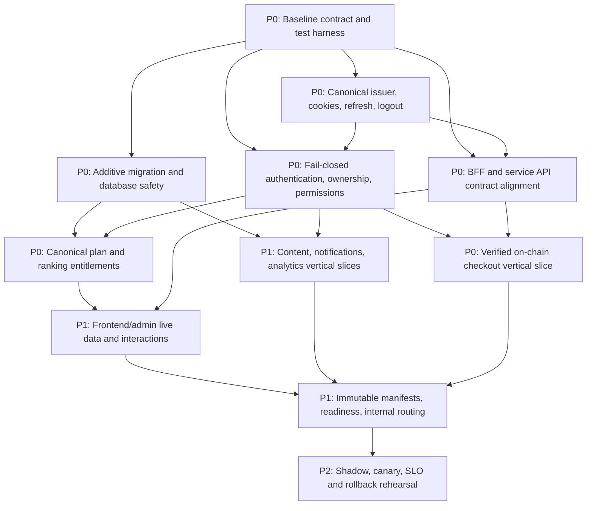

# Production readiness plan: Dioxus and Rust microservices

Last evidence review: 2026-07-22 (Asia/Bangkok)

## Purpose and safety boundary

This plan moves `migration/dioxus-microservices` toward production parity with
`origin/development` without treating file coverage, route dispatch, compilation,
or visual similarity as functional completion.

The default release strategy is a **controlled hybrid**:

- `apps/backend` remains the source of truth for authentication, sessions,
  permissions, plans, subscriptions, credits, and durable business data.
- Dioxus frontend and admin remain UI/BFF layers. They may display backend
  decisions but must not implement permission, plan, ranking-offset, feature-
  flag, or subscription business rules.
- An extracted service receives production traffic only after its vertical
  contract, authorization, migration, observability, and rollback gates pass.
- Monolith fallbacks are removed last, one domain at a time.

> **Production guard:** do not deploy, apply Kubernetes resources, mutate a
> production database, change Cloudflare/DNS routing, restart production
> workloads, or remove a production fallback without explicit user approval for
> that exact action. Completing an agent package does not authorize deployment.

## Audited baseline

### Source baseline

- Branch/ref: `origin/development`
- Audited commit: `373bd231cb7a616c3d4c0ddc1d60e0099a88a5db`
- Behavioral baseline: the existing Rust monolith plus the production frontend
  and admin contracts represented on the development branch.
- Canonical backend rules: `apps/backend`, including SIWE/OIDC session handling,
  granular permissions, active plans, ranking offsets, payments, subscriptions,
  credits, notifications, and analytics routes.

### Target baseline

- Branch/ref: `migration/dioxus-microservices`
- Audited commit before this plan: `975c09567fe14ce278370720bd7a0e5aa571e116`
- Current evidence checkpoint: `7c7a8e39152acc21604eddf163e5c2aebe1bcaf9`
  (payment authority/database crosswalk). The immediately preceding pushed
  evidence is `39f176eeda7b0b973e7522b4c7819c8cbffe279b` for the truthful read-only
  notification UI, `3b523f06d80922bb010702ef1111f56e44538c1c` for central schema-readiness
  reconciliation, and `a5f5113d0f0fe42d4fb1700eb1099f8ec99be218` for the combined notification/
  indexer/pay startup-DDL removal. The earlier wallet/content boundary and
  readiness checkpoints remain `b624f320c2db3dc24944cc0414deae7bc2d42196`
  and `526c3850fd4b1af336cb29a1a86f86b68be6c59f`.
- UI/BFF targets: `apps/frontend`, `apps/admin`, and `apps/pay`.
- Candidate extracted services: `services/gateway`, `services/identity`,
  `services/wallet`, `services/pay`, `services/subscription`, `services/content`,
  `services/notification`, `services/analytics`, and `services/indexer`.
- Deployed production base currently includes the monolith, Dioxus frontend and
  admin, `apps/analytics`, a separate identity ranking-offset stub, and pay
  service/BFF resources. It does not deploy most candidate services.

The two identity implementations are not interchangeable:

1. `services/identity` is an HTTP SIWE/JWT/user service with its own database.
2. `shared/rust/epsx-identity-service` is the deployed gRPC/SSE ranking-offset
   service and currently returns the free-plan offset for every wallet.

Likewise, `apps/analytics` is the deployed market-ranking extraction while
`services/analytics` is a separate event-tracking service. Names alone must not
be used to infer parity or deployment.

## Route coverage: presence is not parity

The audited path inventory is in `docs/wave21-pixel-recheck/route-inventory.md`.

| Surface | Source pages | Target path counterparts | Path result | Important distinction |
|---|---:|---:|---|---|
| Frontend | 28 | 28 | 28/28 | Includes dynamic examples such as chat, news, and payment; says nothing about live behavior. |
| Admin | 27 | 27 | 27/27 | Two source paths intentionally redirect to canonical management paths. |

The frontend E2E inventory has 28 representative paths. The admin E2E inventory
has 29 scenarios because it includes target routing samples/additions beyond the
27-page source inventory. E2E scenario count and source-page count answer
different questions.

For each path, parity has six independent layers:

1. **Path:** a dispatcher recognizes the URL.
2. **Render:** the route returns meaningful target markup rather than a generic
   fallback, redirect loop, skeleton-only response, or sample page.
3. **Visual:** responsive layout, content hierarchy, states, and accessibility
   match the accepted baseline.
4. **Interaction:** every link, form, filter, modal, pagination control, wallet
   action, and error/retry state works with and without hydration as designed.
5. **Data and security:** the route uses live authorized data and backend-owned
   business decisions, with correct empty/loading/error states.
6. **Operations:** downstream failures, retries, observability, migrations,
   readiness, canary, and rollback are proven.

Only layer 1 is complete across 28/28 frontend and 27/27 admin source paths.

## Current architecture and production hot path

```text
epsx.io / admin.epsx.io
  -> Dioxus frontend/admin BFF
  -> shared API_URL / api.epsx.io
  -> apps/backend monolith

market analytics
  -> apps/analytics
  -> epsx-identity-service gRPC/SSE
  -> free-plan ranking-offset stub

pay.epsx.io
  -> Cloudflare localhost:4747
  -> NodePort 30082
  -> epsx-pay-svc directly (not the BFF at NodePort 30083)
```

Most `services/*` binaries compile but are not deployed by
`infrastructure/kubernetes/base/kustomization.yaml`. A service is not considered
migrated merely because a binary and route table exist.

## Evidence-backed findings

### Interaction and UI behavior

- Frontend account, rankings, plans, subscriptions, news, portfolio, credits,
  developer/API-key, usage, analytics, dashboard, and payment responses include
  static/sample payloads in `apps/frontend/src/api.rs`.
- Admin exposes proxy handlers, but SSR constructs empty page parameters in
  `apps/admin/src/ssr.rs`; multiple pages therefore render samples or skeletons
  instead of live domain state.
- `/payment` in the shared frontend UI intentionally renders a redirect stub to
  `pay.epsx.io`. Its tests must assert the redirect contract, not the retired
  embedded wizard.
- Server-rendered interaction must be tested explicitly. A component appearing
  in HTML does not prove that its click, submit, focus, validation, retry, or
  navigation behavior works.

### Authentication and session behavior

- The monolith remains the canonical issuer and durable session store. It emits
  persistent-key RS256 tokens and a bounded current/backup JWKS document.
- Both Rust BFFs now use their exact frontend/admin audience, verify issuer,
  audience, lifetime, subject/wallet equality, algorithm, and `kid` before
  establishing or forwarding a session, and preserve backend permissions
  verbatim.
- Both BFFs use the shared host-only HttpOnly access/refresh cookie pair, rotate
  it from the refresh cookie only, return token-free browser JSON, and always
  clear local state on logout. Logout is wired to monolith refresh revocation.
- A1.4 provides hermetic mock-backed proof for these contracts, but no real
  wallet/nonces or disposable-database test yet proves old-token rejection and
  durable revocation across the complete flow.
- The candidate HTTP identity service uses the same claim shape for access and
  refresh tokens and has no durable refresh rotation/revocation model.

Until the identity extraction passes parity, the monolith issuer, session store,
and revocation behavior remain canonical.

### Backend-only permissions and plans

- The gateway now verifies exact RS256/JWKS issuer and frontend/admin audience
  claims, uses a method-and-path allowlist, and denies unknown, internal, and
  unresolved payment routes before upstream I/O. This is an edge boundary only;
  it does not prove owner checks or direct-service isolation.
- Candidate subscription, wallet, content, notification, analytics, indexer,
  and pay routers now have direct fail-closed boundaries, but their route
  matrices remain partial or blocked until owner models, internal-service
  identity, domain semantics, and runtime integration are proven.
- Pay admin force-cancel/release/refund shapes now verify the admin audience and
  `admin:payments:manage`, then return `404` before their current DB-only
  handlers. Those handlers remain unsuitable for production until real chain,
  transaction, idempotency, and recovery contracts replace them.
- Both BFFs preserve verified backend permissions without expanding roles. The
  37-record permission inventory contains three Dioxus security-gate records and,
  by grammar, 33 canonical three-segment records, two legacy two-segment gates,
  one unknown record, and one impossible/cross-grammar record. The two legacy
  security gates remain blockers; UI gates remain presentation controls, never
  policy authority. The ten removed legacy gates were the invented
  `profile:read`/`profile:write`, duplicate `payments:read`, `analytics:read`,
  `permissions:read`, and four `chat:read`/`chat:write` checks on
  authentication-only, public-unavailable, or deliberately unavailable
  frontend surfaces. Eleven additional operation gates were removed from the
  fail-closed admin dashboard, audit, chat, media, news, notification,
  developer-portal, and settings shells because those pages now expose no
  operational records or actions. Nine more canonical UI literals were removed
  from fail-closed analytics, wallet list/detail/disable, wallet-access, and
  wallet-plan surfaces; their future read/manage authorization remains
  backend-owned.
- The deployed identity ranking service returns offset `100` for all wallets,
  including paid users. This is not acceptable entitlement behavior.

### Checkout and payment

- The payment execution contract now pins 48 current-target anchors, nine exact
  route models, and 17 STOP blockers. Its authority decision remains
  `unresolved-do-not-cut-over-or-dual-write`, with no production write authority
  selected among the canonical backend, historical prototype, current pay
  candidate, or subscription candidate.
- Pay BFF calls singular `/api/v1/pay/intent/{id}/execute`; the service exposes
  plural `/api/v1/pay/intents/{id}/confirm` and `/cancel` with no execute route.
- Gateway uses `/api/v1/payment/*` while the service exposes `/api/v1/pay/*` and
  does not rewrite the prefix.
- Intent confirmation trusts a supplied transaction hash without validating the
  receipt, chain, amount, token, payer, payee, or confirmations.
- Escrow release/refund/dispute handlers update PostgreSQL state rather than
  submitting and confirming escrow-contract operations.
- Kubernetes supplies `ESCROW_CONTRACT=0`; the on-chain webhook secret is not
  configured in the pay deployment.
- Cloudflare currently exposes the pay service port rather than the pay BFF
  port, expanding the unauthenticated service surface.
- Payment database names are not proven aliases: the canonical backend compose
  runtime uses `epsx_payments_dev` while its migrator uses `epsx_pay_dev`, the
  current pay candidate and deployment use `epsx_pay`, provisioning creates
  `epsx_payments_{dev,staging,prod}`, and the historical prototype used
  `epsx_payment`. Their table and route models also differ, so the A3.13 guarded
  fresh-schema migration is not adoption, backfill, or authority evidence.

### Data and migration safety

- Runtime-DDL triage now reports nine findings across 1,124 tracked Rust files:
  six exact reviewed test exceptions and three actionable backend findings. No
  service-startup schema mutation remains; the three actionables are one
  migration-binary `CREATE DATABASE` bootstrap and two lexical "create database
  pool" error strings that have not been promoted to reviewed exceptions.
  Event analytics, subscription, wallet, content, notification, indexer, and pay
  have removed their startup DDL and now have pinned candidate migrations plus
  read-only schema compatibility checks. Identity has a schema-only additive
  lifecycle migration while its lifecycle routes remain disabled. The combined
  static inventory is 15/15 registered roots, 175 migration SQL files, and 511
  destructive-token findings. All 16 migration risks remain blocked: zero
  startup mutation is useful static remediation, but these packages still lack
  the required runner/adoption, populated-upgrade, reconciliation,
  concurrent-startup, runtime-lifecycle, and production-shaped database proof.
  A3.13's isolated disposable PostgreSQL 18 fresh-schema exercise validates
  catalog behavior only; it is explicitly not payment-authority, adoption,
  populated-upgrade, deployed-database, or production-readiness evidence.
- Provisioning creates `epsx_payments_*` databases while pay service manifests
  and compose files also refer to `epsx_pay`; other candidate service database
  names are not consistently provisioned.
- Applied migration history has been removed or edited relative to development.
  Existing databases will not rerun an edited baseline, while new databases can
  receive a different schema.
- Analytics request-usage partitions stop at 2026-04-01 without a default
  partition, so current writes can fail.
- Payments plan replication creates a future-write trigger but delegates the
  initial copy to a separate manual script.
- A notification migration drops `notification_subscriptions CASCADE`; data
  preservation and dependency impact are not demonstrated.

All structural changes must be new additive migrations with idempotent backfills,
row-count reconciliation, rollback/forward-fix procedures, and production-sized
timing evidence. Existing production data must not be dropped to simplify a cut.

### Infrastructure and release safety

- Exact production Kustomize image matching is repaired for admin, frontend,
  and pay: local rendering replaces the first two `:dev` tags with `:prod` and
  resolves pay to `:wave49`. Identity still renders as `epsx-identity:dev`, and
  no workload image is digest-pinned.
- Most candidate microservices are absent from the production Kustomize base.
- Health endpoints are generally liveness-only and do not prove database,
  Redis, identity, chain RPC, or downstream readiness.
- There is no complete shadow/canary/rollback proof for the new topology.

## Definition-of-done scorecard

Scoring is evidence-based: `0 = not demonstrated`, `1 = partial`, `2 = gate
passed`. It is not a percentage estimate of engineering effort.

| Gate | Score | Current evidence | Done when |
|---|---:|---|---|
| Frontend path presence | 2 | 28/28 dispatcher counterparts | Inventory and dispatcher contract test stay green. |
| Admin path presence | 2 | 27/27 counterparts; two canonical redirects | Redirects and dynamic params have contract tests. |
| Shared UI package baseline | 2 | Targeted unit/doctest repair in this slice | `cargo test -p epsx-dioxus-ui --lib` and `--doc` pass. |
| Visual/responsive/accessibility | 1 | Historical screenshots exist; current accepted baseline is incomplete | All routes pass agreed viewport, state, keyboard, and accessibility thresholds. |
| Interaction parity | 0 | No complete click/form/wallet/navigation matrix | Every interactive control has E2E success and failure coverage. |
| Auth/session parity | 1 | A1.4 hermetic gate covers 71 focused tests across both BFFs; durable database-backed rotation/revocation and a real wallet flow remain unproven | SIWE -> SSR me -> rotation -> revocation works across both BFFs. |
| Backend authorization | 1 | Gateway is fail-closed with exact RS256/JWKS and granular edge policy; the 117-route service matrix is 11 aligned, 47 partial, and 59 blocked | Anonymous/cross-owner calls fail at both gateway and service boundaries; granular backend permissions pass. |
| Live data parity | 0 | The notification owner page and focused news routes now have sample-free explicit dependency outcomes, and notifications adds a statically verified authenticated read-only shared-header count, but browser/live proof is absent, 17 frontend routes remain blocked, other frontend mocks remain, and admin SSR still supplies empty params | Sample payloads removed and real empty/error states proven. |
| Checkout/on-chain parity | 0 | Route mismatch and DB-only escrow transitions | Verified receipts and contract transactions drive state. |
| Backend/API contract parity | 1 | Both BFFs now return explicit HTML/JSON 404s and preserve 405/redirect semantics; payment prefixes and broader payload/status drift remain | Versioned contract matrix passes for monolith and replacement. |
| Migration/data safety | 0 | Static remediation reduced runtime DDL to 9 findings (6 reviewed exceptions + 3 actionable) and service-startup mutations to 0; 15 roots and 175 SQL files are inventoried, but all 16 migration risks remain blocked and 511 destructive-token findings, naming drift, baseline edits, and expired partitions remain. The isolated A3.13 PostgreSQL 18 fresh-schema proof is not an upgrade or readiness gate. | Upgrade/backfill/reconcile/rollback tests pass on production-shaped data. |
| Production manifests/routing | 0 | Admin/frontend/pay transforms are repaired, but identity still uses `:dev`, images lack digests, and direct pay-service ingress remains | Rendered manifests use approved immutable images and intended BFF ingress. |
| Observability/readiness | 0 | Shallow health checks and incomplete cross-service traces | Dependency readiness, SLO metrics, alerts, and trace IDs pass drills. |
| Canary/rollback | 0 | Not demonstrated | Shadow, canary, abort thresholds, and rollback rehearsal are approved. |

**Current evidence score: 10/28.** This score records gate evidence only. It must
not be used to forecast dates or authorize production traffic.

## Dependency DAG



### Priority interpretation

- **P0:** security, canonical state, contract, payment, and data-safety work that
  blocks any traffic cutover.
- **P1:** domain and UI parity needed for a usable release after P0 gates pass.
- **P2:** scale, resilience, cleanup, and release optimization after correctness
  and rollback are proven.

## Agent-sized execution packages

Agents may work in parallel only where dependencies permit. Each package owns a
bounded path set. Shared contract files require coordination through package A0.

### A0 — Baseline contracts and test harness (P0)

- **Scope:** create a machine-readable route/API/cookie/status inventory under
  `docs/migration/contracts/`; add non-production test scripts under
  `scripts/migration/`; cover 28 frontend and 27 admin source paths, dynamic
  params, two admin canonical redirects, and monolith API baselines.
- **Do not change:** runtime routing, business logic, database schemas, or infra.
- **Dependencies:** none.
- **Acceptance:**

  ```bash
  cargo test -p epsx-dioxus-ui --lib
  cargo test -p epsx-dioxus-ui --doc
  ./scripts/migration/verify-route-inventory.sh
  ./scripts/migration/verify-contract-fixtures.sh
  ```

### A1 — Canonical authentication and session compatibility (P0)

- **Scope:** `apps/frontend/src/auth.rs`, frontend auth handlers in
  `apps/frontend/src/api.rs`, `apps/admin/src/auth.rs`, admin auth handlers in
  `apps/admin/src/main.rs`, and shared verifier/client changes strictly needed
  for monolith RS256 claims, secure cookies, refresh rotation, and logout
  revocation.
- **Strategy:** keep the monolith issuer/session store canonical. Do not activate
  `services/identity` as issuer in this package.
- **Dependencies:** A0.
- **Acceptance:**

  ```bash
  cargo test -p epsx-frontend auth
  cargo test -p epsx-admin auth
  cargo test -p epsx-auth
  ./scripts/migration/verify-auth-session-flow.sh
  ```

  The script must prove challenge, signed verification, SSR `/me`, refresh-token
  rotation, old-token rejection, logout revocation, secure cookie attributes,
  and access-token rejection when a refresh token is supplied.

- **A1.4 status:** the local hermetic gate passes only when its 71 focused tests
  and both baseline fixture checks pass. It proves BFF audience/verifier,
  token-redaction, cookie, local rotation/clearing, proxy rejection, and safe
  return-target contracts. It deliberately does not satisfy the full A1
  acceptance condition: real wallet signing, nonce consumption, durable
  database-backed old-token rejection/revocation, and production-shaped browser
  behavior remain blocked. See `docs/migration/A1_4_AUTH_SESSION_GATE.md`.

### A2 — Fail-closed service authorization (P0)

- **Scope:** `services/gateway`, shared auth middleware, and authentication,
  ownership, and granular permission guards for candidate service endpoints.
  Add a public-route allowlist; everything else is protected by default.
- **Dependencies:** A0 and A1 token contract.
- **Acceptance:**

  ```bash
  cargo test -p epsx-gateway
  cargo test -p epsx-identity
  cargo test -p epsx-wallet
  cargo test -p epsx-pay-svc
  cargo test -p epsx-subscription
  cargo test -p epsx-content
  cargo test -p epsx-notification
  cargo test -p epsx-analytics
  cargo test -p epsx-indexer
  ./scripts/migration/verify-service-authorization.sh
  ```

  The matrix must cover anonymous, expired, wrong audience, ordinary user,
  cross-owner, and granular-admin cases for every mutation.

- **A2.1 status:** gateway edge enforcement passes 18 focused tests and the
  117-route authorization fixture remains integrity-clean. The fixture still
  reports readiness as not proven because direct-service verification,
  cross-owner denial, internal service identity, and handler-level permission
  enforcement remain open. See `docs/migration/A2_GATEWAY_AUTHORIZATION.md`.

- **A2.2 status:** the canonical RS256/JWKS verifier and strict bearer-header
  API now live in `epsx-service-auth`, and the gateway consumes that shared
  implementation. Seven direct-service routers now consume the same verifier,
  while each route still requires its own audience, ownership, permission, and
  fail-closed evidence; extraction alone is not service-level authorization
  proof.

- **A2.3a status:** the candidate event-analytics service now consumes the
  shared verifier directly. Health is the sole anonymous allowlist, tracking
  requires a verified frontend/admin principal, operator reads require the
  admin audience plus `admin:analytics:view`, and internal/unknown routes fail
  closed before storage. Canonical wallet attribution, internal-service
  identity, migration runner/adoption, and analytics semantics remain
  unresolved.

- **A2.3b status:** the candidate content service also consumes the shared
  verifier. Public route shapes are explicit, CMS mutations require the admin
  audience plus canonical `admin:content:manage`, and editor-session routes
  remain fail-closed rather than persisting a caller-selected UUID. Published-
  only filtering, editor identity mapping, migration runner/adoption,
  content-domain semantics, and cache/validation behavior remain unresolved.

- **A2.3c status:** the notification service now consumes the shared verifier.
  Health is its only anonymous surface, template/send operations require the
  admin audience plus `admin:notifications:manage`, and all eight user routes
  derive and bind their SQL owner key from the verified wallet. The service
  matrix is now five aligned, 54 partial, and 58 blocked. Startup DDL and seeds
  are statically absent, but migration-history/adoption and legacy-owner
  reconciliation, internal publisher identity, delivery idempotency/outbox,
  SMTP behavior, template consistency, and DB integration remain unresolved.

- **A2.3d status:** the subscription service now consumes the shared verifier.
  Health is its only anonymous surface; plan reads require the admin audience
  plus `admin:plans:read`, and plan creation requires
  `admin:plans:manage`. Owner-subscription and vault routes intentionally return
  `404` before storage until the UUID owner model can be derived from the
  verified wallet and activation can be bound to finalized payment evidence.
  The service matrix is now six aligned, 53 partial, and 58 blocked. All 20 A9
  lifecycle blockers remain open; this boundary does not prove subscription
  production readiness.

- **A2.3e status:** the indexer now consumes the shared verifier. Health is the
  only anonymous surface. All four read projections return `404` before DB/RPC
  work because canonical ingestion, finality, reorg, and privacy semantics are
  unproven. Sync requires the admin audience plus `admin:indexer:manage`, then
  returns `404` before placeholder ingestion. A12 retains all 24 STOP blockers.

- **A2.3f status:** the pay service now consumes the shared verifier. Health and
  a bounded active pay-link projection are the only anonymous surfaces. Owner
  intent, escrow, and history reads bind SQL to the verified wallet; admin reads
  require `admin:payments:view`. All 14 financial/internal mutations remain
  unavailable; admin mutation shapes verify `admin:payments:manage` and then
  fail closed. The service matrix is now eight aligned, 52 partial, and 57
  blocked. All 17 A6 STOP blockers remain open.

- **A2.3g status:** the wallet service now consumes the shared verifier. Health
  and an 8 KiB-bounded, read-only signature recovery endpoint are its only
  anonymous surfaces. Account list/detail reads accept only the exact frontend
  or admin audience, derive the owner from the verified wallet, bind that owner
  in SQL, and exclude encrypted key material. Account creation, balance, send,
  signing, and gas estimation return `404` before unsafe custody/RPC handlers.
  The service matrix is now ten aligned, 50 partial, and 57 blocked; wallet
  custody, truthful chain behavior, migration runner/adoption, and runtime
  integration remain STOP conditions.

- **A2.3h status:** this is an immutable historical pre-remediation identity
  audit pinned to commit `0cdd7ba1967d52e299000b7290873cd4d19dfd09`; it does
  not describe the current runtime. At that snapshot the audit pinned the exact
  eleven route shapes, promoted none to aligned, classified health as partial
  and ten routes as blocked, and recorded twenty STOP conditions including
  defaultable shared-secret tokens, non-atomic nonce consumption, absent
  durable refresh rotation/revocation, mutable demo issuance, role-based admin
  authorization, and runtime authority-table creation. Its integrity and tamper
  tests pass while readiness intentionally exits `3`.

- **A2.3i status:** the current identity boundary makes all eleven exact route
  boundaries fail closed. Only `GET`/`HEAD /health` is functional and aligned;
  the other ten route shapes are structurally unavailable and blocked.
  Protected candidates verify the canonical audience and, for admin shapes,
  the exact literal granular permission before returning an intentional `404`.
  The global 117-route service-authorization matrix is now 11 aligned, 47
  partial, and 59 blocked. Twelve STOP blockers remain: there is no database,
  Redis, external JWKS, service-integration, migration, or deployment proof,
  and the disabled identity lifecycle is not production functionality.

### A3 — Additive migrations and data reconciliation (P0)

- **Scope:** new migration directories only, database provisioning scripts,
  future analytics partitions/default strategy, pay database naming, identity
  backfill design, plan replica backfill, and reconciliation tooling.
- **Do not change:** an already-applied baseline migration; do not drop existing
  production data.
- **Dependencies:** A0 schema/contract inventory.
- **Acceptance:**

  ```bash
  ./scripts/migration/create-ephemeral-databases.sh
  ./scripts/migration/upgrade-development-snapshot.sh
  ./scripts/migration/reconcile-row-counts.sh
  ./scripts/migration/verify-forward-fix.sh
  ```

  Tests must start with a development-shaped database containing representative
  users, active plans, subscriptions, payments, notifications, and usage rows.
  Upgrade and retry must be idempotent; reconciliation must be exact.

- **A3.1/A3.2 status:** the read-only database preflight tooling is constrained
  to capture checksum-pinned, non-production evidence for core, analytics,
  notifications, and payments. The offline A3.2 classifier accepts exactly 13
  known history/schema classes, rejects tampered, hybrid, credential-bearing,
  unknown, traversal,
  symlink, and output-race inputs, and emits only redacted deterministic
  fingerprints. Exit `0` still declares `productionReady: false`; no live
  preflight, reconciliation, migration, repair, or database mutation has run.

- **A3.3 status:** the checksum-pinned runtime-DDL triage reproduces the
  migration-safety scanner over 1,124 tracked Rust files and enumerates all nine
  findings in stable order. Six are exact reviewed test exceptions; all three
  actionable backend findings remain blocked. Service-startup schema mutations
  are zero after the combined analytics, subscription, wallet, content,
  notification, indexer, and pay remediation. It invents no priority,
  dependency, database state, or forward SQL and exits `2` with `STOP` for
  readiness. The wider migration-safety inventory covers all 15/15 roots and
  175 SQL files; its 511 destructive-token findings remain classified, and all
  16/16 risks remain blocked. Both static integrity gates and the A3.3 tamper
  self-test pass. No production-shaped migration, adoption, upgrade,
  reconciliation, or rollout proof was run.

- **A3.6 status:** event analytics removed its one startup `CREATE TABLE` and
  now carries a checksum-pinned, 260-byte additive `public.events` migration
  plus a read-only exact schema-compatibility check before listener bind. This
  is partial evidence only: there is no migration runner, baseline-adoption
  proof, populated upgrade, row reconciliation, concurrent-startup test, or
  live-database evidence. Readiness therefore remains `STOP`; no migration or
  database action was run.

- **A3.7 status:** subscription removed both runtime DDL findings (**2 -> 0**),
  added an exact guarded 844-byte two-table migration, and now stops startup on
  any mismatch in its read-only exact schema-compatibility check. Handler SQL
  is schema-qualified, and the Rust UUID and nullable model/request boundaries
  match the certified columns. Six STOPs remain: there is no reviewed runner,
  safe baseline adoption, populated upgrade, reconciliation, concurrent-startup
  proof, or live-database execution. No migration or database action was run.

- **A3.8 status:** identity has a schema-only, checksum-pinned 6,417-byte
  additive migration with four guarded tables and six guarded indexes. It
  models lowercase wallet-to-UUID identity mapping, client-bound hashed SIWE
  challenges, and hashed refresh families/sessions with constrained lineage.
  Lifecycle routes remain disabled. Ten STOPs cover runner/version-ledger and
  catalog adoption, baseline mapping/backfill, populated upgrade, concurrency,
  reconciliation, audited runtime transactions, issuer/JWKS integration, and
  disposable/live-database evidence. In particular, the schema is not runtime
  proof of generation increments or revoke-versus-rotate race safety. No
  migration, route enablement, or production action was run.

- **A3.9 status:** wallet removed its three startup DDL findings (**3 -> 0**),
  added one checksum-pinned 775-byte additive migration for three public tables
  and 17 exact columns, and now stops before listener bind when its read-only
  catalog probe finds schema, constraint, index, sequence, collation, or default
  drift. Owner addresses and U256 values are canonicalized before binding, and
  nonce allocation plus signed-transaction insertion share one SQLx transaction.
  The locked offline evidence passes 11 library tests, four binary tests, the
  binary check, integrity verification, and the tamper self-test; the final
  independent boundary re-review reported no actionable finding. Six STOPs
  remain: runner/version ledger, safe baseline adoption, populated upgrade,
  reconciliation, concurrent startup, and PostgreSQL execution. No migration or
  database action was run.

- **A3.10 status:** content removed its four startup DDL findings (**4 -> 0**),
  added one checksum-pinned 1,656-byte additive migration for four public tables
  and 34 exact columns, and now stops before synchronization/listener bind on
  incompatible columns, constraints, inbound/outbound foreign keys, or any
  unexpected unique index. Its exact type/bind audit covers JSONB, UUID, and
  timestamptz projections, while all 19 runtime relation references are public-
  qualified. The locked offline evidence passes eight library tests, two binary
  tests, the binary check, integrity verification, and the tamper self-test; the
  final independent boundary re-review reported no actionable finding. The
  preserved `ON DELETE CASCADE` contributes one explicit reviewed lexical safety
  STOP. Runner/version ledger, baseline adoption, populated upgrade,
  reconciliation, concurrent startup, and PostgreSQL execution remain absent.
  No migration or database action was run.

- **A3.11 status:** notification removed its four startup DDL findings
  (**4 -> 0**) and both startup seed paths, public-qualified all 19 runtime
  relation references, and now fails before provider/listener startup unless
  the exact 26-column, three-key, five-index schema and template cache load pass.
  The guarded migration is a fresh-schema candidate only. Unsafe/ambiguous
  existing notification history, baseline adoption, populated upgrade, legacy
  owner mapping/backfill/reconciliation, recovery, and deployment remain STOPs;
  all 22 A11 lifecycle blockers stay open.

- **A3.12 status:** indexer removed its five startup DDL findings (**5 -> 0**),
  its default-on provider/sync worker, and fabricated block ingestion. A pinned
  27-column, chain-scoped projection migration plus exact read-only catalog
  probe now gates startup, while every non-health route stays fail-closed.
  Runner/adoption, populated upgrade, canonical ingestion, checkpoint, receipt/
  raw-log, finality/reorg, backfill/reconciliation, privacy, runtime, and
  deployment proof remain absent; all 24 A12 blockers stay open.

- **A3.13 status:** pay removed its ten startup DDL findings (**10 -> 0**),
  public-qualified all 54 runtime relation references, and now checks an exact
  39-column candidate schema before provider/router/listener construction. All
  unsafe financial/admin/webhook mutations remain `404`. A disposable isolated
  PostgreSQL 18.4 cluster proved the fresh migration and exact catalog probe,
  then was removed; that evidence does not decide payment write authority or
  prove adoption, populated upgrade, reconciliation, concurrency, chain
  execution, a deployed database, or production readiness. All eight A3.13 and
  17 A6 blockers remain open.

### A4 — Canonical permission and entitlement authority (P0)

- **Scope:** move/adapter-wrap the backend `UnifiedPermissionService` behavior
  behind the identity authority; implement live ranking-offset queries and
  entitlement-change events without frontend rule duplication.
- **Strategy:** monolith remains canonical until shadow comparisons are exact.
- **Dependencies:** A1, A2, A3.
- **Acceptance:**

  ```bash
  cargo test -p epsx-identity
  cargo test -p epsx-identity-shared
  cargo test -p epsx-analytics
  ./scripts/migration/verify-entitlement-parity.sh
  ```

  Free, paid, expired, overlapping, revoked, and admin assignments must match the
  monolith decision and ranking offset. Protected paid data must not silently
  fall back to the free plan on authority failure.

- **A4.0/A8.1 status:** the deterministic permission-grammar inventory covers
  37 UI/service records, including three Dioxus security gates. Unavailable
  analytics, wallet, wallet-access, and wallet-plan surfaces now use only the
  session boundary while all future read/manage policy remains backend-owned;
  readiness intentionally stops with two legacy security gates and two
  presentation-only drift records. Entitlement and ranking-offset parity in the
  acceptance condition above is not yet implemented.

### A5 — BFF/API contract alignment (P0)

- **Scope:** `shared/rust/client`, frontend/admin/pay proxy handlers, and gateway
  prefix rewriting. Align singular/plural paths, status codes, error envelopes,
  cookie forwarding, correlation IDs, timeouts, and retry policy.
- **Dependencies:** A0 and A1; use A2 authorization contract.
- **Acceptance:**

  ```bash
  cargo test -p epsx-client
  cargo test -p epsx-frontend
  cargo test -p epsx-admin
  cargo test -p epsx-pay-bff
  cargo test -p epsx-gateway
  ./scripts/migration/verify-bff-contracts.sh
  ```

- **A5.0 status:** shared route dispatch and both BFF fallbacks now distinguish
  known routes, malformed dynamic arity, HTML page misses, JSON API misses,
  registered-path method mismatches, and intentional redirects. Payment route
  prefixes, live payloads, correlation/retry policy, and the pay BFF remain in
  later A5/A6 slices.

- **A5.1 status:** `epsx-client` now emits typed, body-free upstream status
  errors. The admin BFF preserves only the closed safe set `400`, `401`, `403`,
  `404`, `409`, `422`, `429`, `502`, `503`, and `504`; unknown statuses and
  legacy string errors become `502`, while timeout and connect failures become
  `504` and `503`. Typed error envelopes, validation detail, retryability,
  correlation, cross-hop consistency, and page consumption remain blocked.

### A6 — Checkout and escrow vertical slice (P0)

- **Scope:** `apps/pay`, `services/pay`, escrow contract adapter, receipt
  validation, webhook/indexer integration, payer/payee ownership, idempotency,
  confirmation depth, release/refund/dispute transactions, and failure recovery.
- **Dependencies:** A1, A2, A3, A5.
- **Acceptance:**

  ```bash
  bun dev:anvil
  bun setup:local
  cargo test -p epsx-pay-svc
  cargo test -p epsx-pay-bff
  ./scripts/migration/verify-pay-anvil-e2e.sh
  ```

  A database state transition passes only after the expected Anvil receipt is
  verified. Replaying create, webhook, confirm, release, or refund must not
  duplicate value or state transitions.

- **A6.0 status:** the pinned payment execution contract inventories 48 target
  anchors, nine exact route/lifecycle models, and 17 evidence-backed STOP
  blockers. Its integrity and tamper tests pass, while readiness intentionally
  exits `3`. The authority crosswalk leaves `productionWriteAuthority` null and
  explicitly forbids cutover or dual write: the canonical backend, historical
  prototype, current pay candidate, and subscription candidate have distinct
  route, table, reachability, and database models. The canonical backend's
  compose runtime/migrator split (`epsx_payments_dev` versus `epsx_pay_dev`) is
  itself unresolved. A3.13 removes all ten pay startup-DDL findings and supplies
  an exact candidate schema boundary, but does not choose the payment system of
  record or add runner/adoption, populated upgrade, durable financial
  constraints, idempotency transactions, receipt/finality, escrow transactions,
  webhook, ingress, or end-to-end browser proof required to close any blocker.

- **A6.1 authorization status:** direct pay-service access now proves verified
  owner/admin read boundaries and hides foreign resources. It deliberately
  keeps every financial, escrow, link, webhook, deposit, resolve, and force
  mutation away from its current DB-only handler until A6 idempotency,
  transaction, chain/finality, audit, and recovery contracts pass.

### A7 — Frontend live data and interaction parity (P1)

- **Scope:** `apps/frontend` loaders/API handlers and frontend pages in
  `shared/rust/dioxus_ui/src/pages`. Replace static payloads route by route;
  implement loading, empty, error, retry, pagination, form, keyboard, wallet,
  and unauthenticated states.
- **Do not implement:** permissions, plan selection rules, ranking offsets,
  subscription eligibility, or payment decisions in the frontend.
- **Dependencies:** A1, A4, A5; checkout routes also depend on A6.
- **Acceptance:**

  ```bash
  cargo test -p epsx-frontend
  cargo test -p epsx-dioxus-ui --lib
  bun test:e2e --project=frontend
  ./scripts/migration/verify-no-frontend-sample-data.sh
  ```

  Close routes in small batches; all 28 must pass interaction and live-data
  fixtures before the frontend gate moves to done.

- **A7.0–A7.3/B7.2 status:** the exact 28-route live-data contract records two
  aligned routes, nine partial routes, and 17 blocked routes. `/about`
  removes invented claims and matches the pinned source order, copy, metadata,
  landmarks, and responsive keyboard behavior. `/access-denied`
  has bounded and escaped query rendering plus responsive keyboard browser
  proof. `/manual` preserves the pinned 35-feature target catalog and proves all
  screenshot assets, responsive layout, links, dialog focus, and image-error
  fallback, but a prominent safety notice now says intended workflows do not
  establish live data or enabled actions and that route unavailable states are
  authoritative. It remains partial pending product acceptance, status-aware
  description synchronization, and browser proof of the notice. `/developer/docs` now matches the pinned ten-endpoint catalog and
  proves responsive navigation, accordions, language tabs, copy controls, and
  keyboard behavior, while live requests remain disabled pending A1/A4/A5.
  `/offline` is public and now proves a fresh controlled mobile and desktop
  navigation while disconnected after installation from another page. Its
  worker fetches exact `/offline` with credentials omitted and CacheStorage is
  proven to contain only that query-free public shell; API, auth, account,
  notification, analytics, admin, payment, and query-bearing requests bypass
  the cache. The route remains partial because truthful public-shell-only copy
  intentionally differs from the pinned source's unsupported claims that
  sensitive feature data is cached and later synchronized. Privacy and terms
  remain partial pending wallet/SIWE legal approval; terms also lacks a real
  subscription handler. `/news` and `/news/:slug` have removed their canned
  catalog, list/detail fallbacks, synthesized frontend article, and hard-coded
  related articles. Shared strict content adapters now give SSR and JSON paths
  truthful `200`, validation `400`, not-found `404`, and dependency `503`
  outcomes; the list enforces exact categories and fixed 12-item pagination,
  while both routes normalize dates, escape outer metadata, and expose
  accessible filter-preserving recovery/retry navigation. Both routes remain
  partial: A5 is not frozen, the list filters and paginates locally over only
  the upstream first 100 records, upstream detail is HTML while the accepted
  presentation requires GFM, the content service synthesizes unknown slugs,
  and no live-service browser proof exists. `/notifications` is now a truthful
  read-only partial: authenticated SSR records exact success or dependency
  error, consumes the current nullable notification DTO without sample fallback,
  parses timestamps as UTC, escapes content, ignores unapproved action URLs,
  and renders native empty/error/retry states. Its active shared header now
  starts the badge hidden/unavailable and injects the exact read-only unread-
  count controller only for server-verified authenticated non-offline responses;
  authenticated HTML plus every list/count outcome is private/no-store, and the
  fetch bypasses caches. Exact DTO validation, zero/error hiding, stale-response
  guards, the `99+` visual cap with exact accessible count, AA badge contrast,
  and text-only DOM writes have static and unit evidence. It still lacks source-compatible list/count envelopes,
  pagination, broadcast/expiry/read semantics, mutations, preferences, push/SSE,
  approved action-URL behavior, and live-service/browser runtime proof. The
  blocked-route inventory is also more truthful without overstating parity:
  `/profile` exposes only locally verified session claims; `/account` preserves
  strict owner payment history while replacing canned identity/credit/access
  and local preference state with verified claims or unavailable states;
  `/account/credits` no longer turns failures or missing authority into a zero
  balance or empty ledger; `/analytics` has no canned producer, sample ranking,
  fake policy gate, or inert query/mutation controls; `/developer` and
  `/developer/usage` no longer publish canned keys, plans, mutations, metering,
  charts, or service health; `/dashboard` removes its canned stats, activity,
  roles, tiers, and entitlement decisions while retaining only verified session
  identity; `/portfolio` removes its canned holdings, prices, Live label, and
  inert watchlist controls; `/permissions` removes hard-coded grants, history,
  features, SLA, and its circular frontend gate while labeling raw verified
  session strings as non-canonical; home removes fixed performer, price, plan,
  and news fixtures and exposes explicit unavailable market/plans/news sections;
  all three chat routes remove sample conversations, messages, presence, counts,
  filters, and fake mutations, require authentication, and fail closed without
  an owner loader; `/plans` removes canned catalogs, pricing, promotions,
  eligibility, checkout, its compatibility producer, and its unused SSR loader;
  and both payment routes fail closed without accepting query-owned financial
  state, submitting a mutation, or claiming an intent or completion. These
  routes remain blocked until their documented
  A1/A4/A5/A6 authorities and runtime proofs exist. The resulting **2 aligned /
  9 partial / 17 blocked** inventory keeps readiness at exit `3`.

### A8 — Admin live data and mutation parity (P1)

- **Scope:** `apps/admin` SSR/loaders/proxies and admin pages in
  `shared/rust/dioxus_ui/src/pages/admin_pages`. Replace empty params and samples;
  require server-side admin authorization for every mutation.
- **Dependencies:** A1, A2, A4, A5; payment views depend on A6.
- **Acceptance:**

  ```bash
  cargo test -p epsx-admin
  cargo test -p epsx-dioxus-ui --lib
  bun test:e2e --project=admin
  ./scripts/migration/verify-admin-mutation-authorization.sh
  ```

  All 27 source paths, dynamic params, and two canonical redirects must pass.

- **A8.0–A8.1 status:** the pinned admin contract covers the exact 27 source
  routes and both intentional redirects in seven execution batches. It records
  two aligned, two partial, and 23 blocked routes plus 20 cross-cutting STOP
  blockers. `/access-denied` and `/unauthorized` now preserve bounded escaped
  copy, inherited metadata, safe reauthentication/return behavior, keyboard
  order, responsive light/dark layout, and authenticated local browser proof.
  `/notifications` remains a partial 200 script redirect and
  `/wallet-management` remains a partial pre-SSR HTTP 308; fixed-target
  in-process proof does not establish source middleware/logout/session ordering,
  method/body/cache semantics, query policy, or authenticated browser history,
  RSC, and client-navigation parity. The admin SSR still provides no general
  per-page loader. Dashboard, analytics, audit-log, chat list/detail, media,
  news list/create/edit, notification manage/create, settings, developer portal,
  wallet credits/access/list/detail/disable, and wallet-plan list/detail now
  fail closed without sample records, counts, health, history, configuration,
  credentials, balances, ledger rows, assignments, catalogs, filters, forms,
  upload controls, or mutations. The read-only payment-intents tab is the sole
  operational page with a bounded typed loader; source mutation contracts and
  BFF paths still drift, and preserved statuses still lack typed envelopes and
  general page-level consumption. Developer-portal readiness additionally
  stops on plaintext `api_keys.full_key` persistence/list projection; credit
  readiness stops on a GET path that can create a balance record and on the
  unresolved financial mutation authority.
  The exact **2 aligned / 2 partial / 23 blocked**, 20-STOP integrity and tamper
  gates pass; readiness intentionally exits `3`. No live service, database,
  chain, or deployment access is claimed.

### A9 — Subscription vertical slice (P1)

- **Scope:** `services/subscription`, canonical plan reads, verified-payment
  activation, renewal/expiry/cancel/switch flows, entitlement grant/revoke, and
  durable scheduling/outbox behavior.
- **Dependencies:** A2, A3, A4, A5, A6.
- **Acceptance:**

  ```bash
  cargo test -p epsx-subscription
  ./scripts/migration/verify-subscription-lifecycle.sh
  ./scripts/migration/verify-entitlement-parity.sh
  ```

- **A9.0 status:** the pinned subscription contract inventories 12
  route/lifecycle surfaces, 18 source anchors, 25 target anchors, and 20 stop
  blockers. It locks backend plan authority, owner/admin/service boundaries,
  verified-payment activation, manual renewal and expiry, effective-plan
  uniqueness, idempotency, outbox/reconciliation, entitlement/ranking
  projection, truthful UI states, and rollback. The reconciled evidence records
  A3.7's two-to-zero startup-DDL change, exact 844-byte candidate migration, and
  read-only startup compatibility probe without promoting any lifecycle route.
  The top-level frontend plan producer, fallback loader, static catalog, and
  checkout mutation are now absent and `/plans` fails closed. Admin wallet-plan
  list/detail samples and controls are also absent behind explicit unavailable
  shells; the canned `/api/v1/subscription/plans` producer, missing admin typed
  adapter, and backend/service contract gaps remain. There is still no runner/ledger,
  adoption, populated upgrade, reconciliation,
  concurrent-startup, live-database, payment, or entitlement proof. Integrity
  and tamper gates pass; all 20 blockers remain and readiness intentionally
  exits `3`.

### A10 — Content vertical slice (P1)

- **Scope:** `services/content`, content migrations, public reads, authorized
  draft/create/update/publish/theme operations, media references, and BFF
  contract integration.
- **Dependencies:** A2, A3, A5.
- **Acceptance:**

  ```bash
  cargo test -p epsx-content
  ./scripts/migration/verify-content-lifecycle.sh
  ```

- **A10.0 status:** the pinned content lifecycle contract records 14 source
  anchors, 32 target anchors, eight route batches, 16 lifecycle requirements,
  and 20 stop blockers. It preserves A2.3b as partial and keeps editor routes
  fail-closed until canonical actor mapping and session ownership exist. A3.10
  removes all four content startup-DDL findings and supplies a fail-closed
  additive schema boundary, but it closes none of the 20 lifecycle blockers:
  there is still no runner, populated-source adoption/upgrade, lifecycle
  revision/public-pointer schema, backfill, reconciliation, or rollback proof.
  The ordered implementation covers published-only immutable revisions, typed
  page/theme/block CRUD, media, filesystem trust, migrations/reconciliation,
  backend-owned plans/rankings/portfolio, wire/status parity, truthful UI
  states, audit/outbox/idempotency, shadowing, and rollback. Integrity and tamper
  tests pass; readiness intentionally exits `3`.

### A11 — Notification vertical slice (P1)

- **Scope:** `services/notification`, ownership-safe list/read/delete, authorized
  templates/send, outbox delivery, email/in-app delivery state, SSE/realtime
  behavior, retries, and migration/backfill.
- **Dependencies:** A2, A3, A5.
- **Acceptance:**

  ```bash
  cargo test -p epsx-notification
  ./scripts/migration/verify-notification-ownership.sh
  ./scripts/migration/verify-notification-delivery.sh
  ```

- **A11 authorization status:** direct health/admin/owner request boundaries
  are enforced by A2.3c, but the vertical slice remains incomplete until
  the A3.11 fresh-schema candidate is safely adopted and upgraded, legacy owners
  are reconciled, and internal publisher identity, durable outbox/retry/dead-
  letter delivery, safe SMTP behavior, realtime ownership, observability, and
  rollback are proven.

- **A11.0 status:** the deterministic lifecycle contract pins 14 source records
  and 53 target anchors across 12 blocked surfaces. Its 22 STOP blockers cover
  migration history/adoption, truthful asynchronous delivery, preferences/SSE/
  push, publisher inbox/outbox and idempotency, retry/dead-letter behavior,
  templates/privacy, reconciliation, observability, deployability, single-writer
  cutover, and duplicate-safe rollback. A3.11 statically reduces notification
  startup DDL from four to zero and seed calls from two to zero. The user page
  now provides a sample-free, explicit-outcome, static owner read path. The
  active shared header has a statically verified authenticated read-only unread
  count with initial hidden/unavailable state, public `/offline` exclusion,
  private/no-store HTML and BFF outcomes, cache-bypassing fetch, exact DTO
  validation, stale-response protection, AA contrast, exact accessible count,
  and no mutation or HTML injection. This does not prove source-compatible list/
  count envelopes, pagination, broadcast/expiry/read semantics, any lifecycle
  mutation, preferences, push/SSE, action-URL policy, or live delivery/browser
  runtime behavior. Fresh or populated migration execution also remains absent.
  Integrity and tamper checks pass; all 22 blockers remain, readiness
  intentionally exits `3`, and no live provider or infrastructure access is
  part of the evidence.

### A12 — Analytics/indexer vertical slice (P1)

- **Scope:** explicitly separate market rankings from event analytics; preserve
  canonical entitlement filtering; secure tracking/revenue/admin endpoints;
  add partition maintenance, indexer authentication, checkpoints, replay, and
  idempotency.
- **Dependencies:** A2, A3, A4, A5.
- **Acceptance:**

  ```bash
  cargo test -p epsx-analytics
  cargo test -p epsx-indexer
  ./scripts/migration/verify-ranking-entitlements.sh
  ./scripts/migration/verify-indexer-replay.sh
  ```

- **A12.0 status:** the audit enforces four distinct domains—market analytics,
  event analytics, chain indexing, and identity ranking-offset projection. It
  pins 14 source and 36 target anchors across 16 blocked surfaces, 31 required
  rules, 12 ordered execution phases, and 24 stop blockers. Event analytics and
  indexer startup DDL are now absent; the indexer also has a chain-scoped
  candidate projection migration/probe and no longer fabricates startup sync.
  These static boundaries do not supply a runner/adoption path, canonical
  ingestion, durable checkpoints, receipts/raw logs, finality/reorg handling,
  or backfill. Analytics, authenticated portfolio, and the public home market
  preview now remove samples and `Live` claims and fail closed; the rankings
  loader and canned frontend producer are absent. Direct service authorization,
  truthful complete live/stale UX,
  authoritative plan offsets, event taxonomy/privacy/revenue, observability,
  distinct workloads, and per-domain shadow/cutover/rollback also remain open.
  Integrity passes; all 24 blockers remain and readiness intentionally exits
  `3`.

### A13 — Infrastructure, shadow, and rollback (P1/P2)

- **Scope:** fix Kustomize image matching, use immutable approved tags/digests,
  route public pay traffic through the BFF, add readiness checks, internal-only
  service exposure, SLO dashboards, shadow routing, canary thresholds, and a
  rehearsed rollback runbook.
- **Dependencies:** all P0 packages and any P1 domain selected for canary.
- **Acceptance before requesting production approval:**

  ```bash
  kubectl kustomize infrastructure/kubernetes/overlays/prod > /tmp/epsx-prod.yaml
  ! rg 'image: .*:dev' /tmp/epsx-prod.yaml
  ! rg 'ESCROW_CONTRACT.*(^|[=: ]0$)' /tmp/epsx-prod.yaml
  kubectl apply --dry-run=client -f /tmp/epsx-prod.yaml
  ./scripts/migration/verify-public-ingress-map.sh
  ./scripts/migration/verify-readiness-failures.sh
  ./scripts/migration/rehearse-rollback.sh --non-production
  ```

  These commands validate artifacts only. They do not authorize `kubectl apply`
  against production, DNS/Cloudflare changes, or production migrations.

- **A13.0 status:** the initial hermetic local render baseline recorded 18 stop
  blockers, including three `:dev` images and a pay tag that missed the intended
  wave. It also recorded no digest-pinned images, public pay ingress that
  bypasses the BFF, literal pay database credentials, a zero escrow address, no
  webhook configuration, eight absent candidate services, and no startup or
  dependency-readiness checks. This entry preserves the pre-remediation
  baseline rather than describing the current render.

- **A13.1 status:** the exact production Kustomize image transform is repaired:
  the hermetic local render replaces admin and frontend `:dev` tags with
  `:prod`, and pay `:prod` with `:wave49`. Identity still renders with `:dev`,
  no image has an immutable digest, and 17 STOP blockers remain. Readiness
  intentionally exits `3`; the evidence used no live cluster and performed no
  deployment or infrastructure mutation.

## Release gates

Before any production-deployment request is presented to the user:

1. All P0 packages are green and their evidence is linked from the release
   candidate.
2. The selected vertical slice passes development, staging/shadow, data
   reconciliation, security, interaction, readiness, and rollback gates.
3. Rendered manifests contain only reviewed immutable images and secrets are
   referenced rather than embedded.
4. Monolith fallback remains available and tested during the canary.
5. Abort thresholds and rollback ownership are explicit.
6. The user gives explicit approval for the exact production deployment,
   migration, and routing actions to be taken.

Until then, the honest status is: **path coverage exists; production functional
parity and operational readiness do not.**
