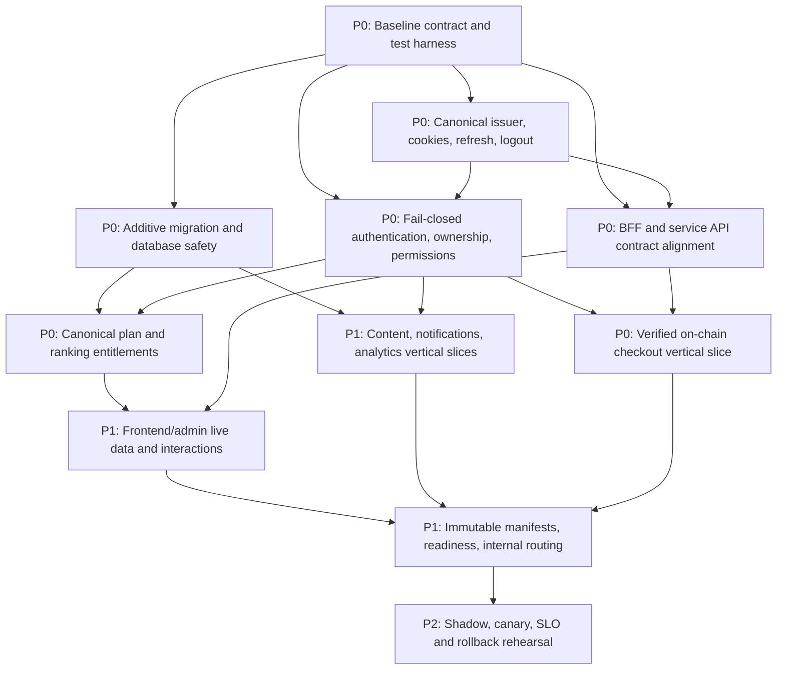

# Production readiness plan: Dioxus and Rust microservices

Last evidence review: 2026-07-22 (Asia/Bangkok)

## Purpose and safety boundary

This plan moves `migration/dioxus-microservices` toward production parity with
`origin/development` without treating file coverage, route dispatch, compilation,
or visual similarity as functional completion.

The default release strategy is a **controlled hybrid**:

- `apps/backend` remains the source of truth for authentication, sessions,
  permissions, plans, subscriptions, credits, and durable business data.
- Dioxus frontend and admin remain UI/BFF layers. They may display backend
  decisions but must not implement permission, plan, ranking-offset, feature-
  flag, or subscription business rules.
- An extracted service receives production traffic only after its vertical
  contract, authorization, migration, observability, and rollback gates pass.
- Monolith fallbacks are removed last, one domain at a time.

> **Production guard:** do not deploy, apply Kubernetes resources, mutate a
> production database, change Cloudflare/DNS routing, restart production
> workloads, or remove a production fallback without explicit user approval for
> that exact action. Completing an agent package does not authorize deployment.

## Audited baseline

### Source baseline

- Branch/ref: `origin/development`
- Audited commit: `373bd231cb7a616c3d4c0ddc1d60e0099a88a5db`
- Behavioral baseline: the existing Rust monolith plus the production frontend
  and admin contracts represented on the development branch.
- Canonical backend rules: `apps/backend`, including SIWE/OIDC session handling,
  granular permissions, active plans, ranking offsets, payments, subscriptions,
  credits, notifications, and analytics routes.

### Target baseline

- Branch/ref: `migration/dioxus-microservices`
- Audited commit before this plan: `975c09567fe14ce278370720bd7a0e5aa571e116`
- UI/BFF targets: `apps/frontend`, `apps/admin`, and `apps/pay`.
- Candidate extracted services: `services/gateway`, `services/identity`,
  `services/wallet`, `services/pay`, `services/subscription`, `services/content`,
  `services/notification`, `services/analytics`, and `services/indexer`.
- Deployed production base currently includes the monolith, Dioxus frontend and
  admin, `apps/analytics`, a separate identity ranking-offset stub, and pay
  service/BFF resources. It does not deploy most candidate services.

The two identity implementations are not interchangeable:

1. `services/identity` is an HTTP SIWE/JWT/user service with its own database.
2. `shared/rust/epsx-identity-service` is the deployed gRPC/SSE ranking-offset
   service and currently returns the free-plan offset for every wallet.

Likewise, `apps/analytics` is the deployed market-ranking extraction while
`services/analytics` is a separate event-tracking service. Names alone must not
be used to infer parity or deployment.

## Route coverage: presence is not parity

The audited path inventory is in `docs/wave21-pixel-recheck/route-inventory.md`.

| Surface | Source pages | Target path counterparts | Path result | Important distinction |
|---|---:|---:|---|---|
| Frontend | 28 | 28 | 28/28 | Includes dynamic examples such as chat, news, and payment; says nothing about live behavior. |
| Admin | 27 | 27 | 27/27 | Two source paths intentionally redirect to canonical management paths. |

The frontend E2E inventory has 28 representative paths. The admin E2E inventory
has 29 scenarios because it includes target routing samples/additions beyond the
27-page source inventory. E2E scenario count and source-page count answer
different questions.

For each path, parity has six independent layers:

1. **Path:** a dispatcher recognizes the URL.
2. **Render:** the route returns meaningful target markup rather than a generic
   fallback, redirect loop, skeleton-only response, or sample page.
3. **Visual:** responsive layout, content hierarchy, states, and accessibility
   match the accepted baseline.
4. **Interaction:** every link, form, filter, modal, pagination control, wallet
   action, and error/retry state works with and without hydration as designed.
5. **Data and security:** the route uses live authorized data and backend-owned
   business decisions, with correct empty/loading/error states.
6. **Operations:** downstream failures, retries, observability, migrations,
   readiness, canary, and rollback are proven.

Only layer 1 is complete across 28/28 frontend and 27/27 admin source paths.

## Current architecture and production hot path

```text
epsx.io / admin.epsx.io
  -> Dioxus frontend/admin BFF
  -> shared API_URL / api.epsx.io
  -> apps/backend monolith

market analytics
  -> apps/analytics
  -> epsx-identity-service gRPC/SSE
  -> free-plan ranking-offset stub

pay.epsx.io
  -> Cloudflare localhost:4747
  -> NodePort 30082
  -> epsx-pay-svc directly (not the BFF at NodePort 30083)
```

Most `services/*` binaries compile but are not deployed by
`infrastructure/kubernetes/base/kustomization.yaml`. A service is not considered
migrated merely because a binary and route table exist.

## Evidence-backed findings

### Interaction and UI behavior

- Frontend account, rankings, plans, subscriptions, news, portfolio, credits,
  developer/API-key, usage, analytics, dashboard, and payment responses include
  static/sample payloads in `apps/frontend/src/api.rs`.
- Admin exposes proxy handlers, but SSR constructs empty page parameters in
  `apps/admin/src/ssr.rs`; multiple pages therefore render samples or skeletons
  instead of live domain state.
- `/payment` in the shared frontend UI intentionally renders a redirect stub to
  `pay.epsx.io`. Its tests must assert the redirect contract, not the retired
  embedded wizard.
- Server-rendered interaction must be tested explicitly. A component appearing
  in HTML does not prove that its click, submit, focus, validation, retry, or
  navigation behavior works.

### Authentication and session behavior

- The monolith remains the canonical issuer and durable session store. It emits
  persistent-key RS256 tokens and a bounded current/backup JWKS document.
- Both Rust BFFs now use their exact frontend/admin audience, verify issuer,
  audience, lifetime, subject/wallet equality, algorithm, and `kid` before
  establishing or forwarding a session, and preserve backend permissions
  verbatim.
- Both BFFs use the shared host-only HttpOnly access/refresh cookie pair, rotate
  it from the refresh cookie only, return token-free browser JSON, and always
  clear local state on logout. Logout is wired to monolith refresh revocation.
- A1.4 provides hermetic mock-backed proof for these contracts, but no real
  wallet/nonces or disposable-database test yet proves old-token rejection and
  durable revocation across the complete flow.
- The candidate HTTP identity service uses the same claim shape for access and
  refresh tokens and has no durable refresh rotation/revocation model.

Until the identity extraction passes parity, the monolith issuer, session store,
and revocation behavior remain canonical.

### Backend-only permissions and plans

- The gateway now verifies exact RS256/JWKS issuer and frontend/admin audience
  claims, uses a method-and-path allowlist, and denies unknown, internal, and
  unresolved payment routes before upstream I/O. This is an edge boundary only;
  it does not prove owner checks or direct-service isolation.
- Candidate subscription, wallet, content, notification, analytics, indexer,
  and pay routes lack complete authentication, ownership, and granular
  authorization enforcement.
- Pay admin force-cancel/release/refund handlers explicitly rely on an external
  future gateway check and currently mutate database state directly.
- Both BFFs preserve verified backend permissions without expanding roles.
  Sixteen unambiguous admin gates now consume literal backend route permissions;
  16 legacy security-gate values remain unresolved or require operation-level
  splits. UI gates remain presentation controls, never policy authority.
- The deployed identity ranking service returns offset `100` for all wallets,
  including paid users. This is not acceptable entitlement behavior.

### Checkout and payment

- Pay BFF calls singular `/api/v1/pay/intent/{id}/execute`; the service exposes
  plural `/api/v1/pay/intents/{id}/confirm` and `/cancel` with no execute route.
- Gateway uses `/api/v1/payment/*` while the service exposes `/api/v1/pay/*` and
  does not rewrite the prefix.
- Intent confirmation trusts a supplied transaction hash without validating the
  receipt, chain, amount, token, payer, payee, or confirmations.
- Escrow release/refund/dispute handlers update PostgreSQL state rather than
  submitting and confirming escrow-contract operations.
- Kubernetes supplies `ESCROW_CONTRACT=0`; the on-chain webhook secret is not
  configured in the pay deployment.
- Cloudflare currently exposes the pay service port rather than the pay BFF
  port, expanding the unauthenticated service surface.

### Data and migration safety

- Candidate services generally create schemas at runtime and lack versioned
  service migrations/backfills.
- Provisioning creates `epsx_payments_*` databases while pay service manifests
  and compose files also refer to `epsx_pay`; other candidate service database
  names are not consistently provisioned.
- Applied migration history has been removed or edited relative to development.
  Existing databases will not rerun an edited baseline, while new databases can
  receive a different schema.
- Analytics request-usage partitions stop at 2026-04-01 without a default
  partition, so current writes can fail.
- Payments plan replication creates a future-write trigger but delegates the
  initial copy to a separate manual script.
- A notification migration drops `notification_subscriptions CASCADE`; data
  preservation and dependency impact are not demonstrated.

All structural changes must be new additive migrations with idempotent backfills,
row-count reconciliation, rollback/forward-fix procedures, and production-sized
timing evidence. Existing production data must not be dropped to simplify a cut.

### Infrastructure and release safety

- Rendering the production overlay currently produces `epsx-admin:dev`,
  `epsx-frontend:dev`, and `epsx-identity:dev`; image replacement keys do not
  match base image names. Pay tags also do not resolve to the intended wave tag.
- Most candidate microservices are absent from the production Kustomize base.
- Health endpoints are generally liveness-only and do not prove database,
  Redis, identity, chain RPC, or downstream readiness.
- There is no complete shadow/canary/rollback proof for the new topology.

## Definition-of-done scorecard

Scoring is evidence-based: `0 = not demonstrated`, `1 = partial`, `2 = gate
passed`. It is not a percentage estimate of engineering effort.

| Gate | Score | Current evidence | Done when |
|---|---:|---|---|
| Frontend path presence | 2 | 28/28 dispatcher counterparts | Inventory and dispatcher contract test stay green. |
| Admin path presence | 2 | 27/27 counterparts; two canonical redirects | Redirects and dynamic params have contract tests. |
| Shared UI package baseline | 2 | Targeted unit/doctest repair in this slice | `cargo test -p epsx-dioxus-ui --lib` and `--doc` pass. |
| Visual/responsive/accessibility | 1 | Historical screenshots exist; current accepted baseline is incomplete | All routes pass agreed viewport, state, keyboard, and accessibility thresholds. |
| Interaction parity | 0 | No complete click/form/wallet/navigation matrix | Every interactive control has E2E success and failure coverage. |
| Auth/session parity | 1 | A1.4 hermetic gate covers 71 focused tests across both BFFs; durable database-backed rotation/revocation and a real wallet flow remain unproven | SIWE -> SSR me -> rotation -> revocation works across both BFFs. |
| Backend authorization | 1 | Gateway is fail-closed with exact RS256/JWKS and granular edge policy; direct services and owner checks remain blocked | Anonymous/cross-owner calls fail at both gateway and service boundaries; granular backend permissions pass. |
| Live data parity | 0 | Frontend mocks and admin empty params remain | Sample payloads removed and real empty/error states proven. |
| Checkout/on-chain parity | 0 | Route mismatch and DB-only escrow transitions | Verified receipts and contract transactions drive state. |
| Backend/API contract parity | 1 | Both BFFs now return explicit HTML/JSON 404s and preserve 405/redirect semantics; payment prefixes and broader payload/status drift remain | Versioned contract matrix passes for monolith and replacement. |
| Migration/data safety | 0 | Runtime DDL, naming drift, baseline edits, expired partitions | Upgrade/backfill/reconcile/rollback tests pass on production-shaped data. |
| Production manifests/routing | 0 | Dev tags and direct pay-service ingress remain | Rendered manifests use approved immutable images and intended BFF ingress. |
| Observability/readiness | 0 | Shallow health checks and incomplete cross-service traces | Dependency readiness, SLO metrics, alerts, and trace IDs pass drills. |
| Canary/rollback | 0 | Not demonstrated | Shadow, canary, abort thresholds, and rollback rehearsal are approved. |

**Current evidence score: 10/28.** This score records gate evidence only. It must
not be used to forecast dates or authorize production traffic.

## Dependency DAG



### Priority interpretation

- **P0:** security, canonical state, contract, payment, and data-safety work that
  blocks any traffic cutover.
- **P1:** domain and UI parity needed for a usable release after P0 gates pass.
- **P2:** scale, resilience, cleanup, and release optimization after correctness
  and rollback are proven.

## Agent-sized execution packages

Agents may work in parallel only where dependencies permit. Each package owns a
bounded path set. Shared contract files require coordination through package A0.

### A0 — Baseline contracts and test harness (P0)

- **Scope:** create a machine-readable route/API/cookie/status inventory under
  `docs/migration/contracts/`; add non-production test scripts under
  `scripts/migration/`; cover 28 frontend and 27 admin source paths, dynamic
  params, two admin canonical redirects, and monolith API baselines.
- **Do not change:** runtime routing, business logic, database schemas, or infra.
- **Dependencies:** none.
- **Acceptance:**

  ```bash
  cargo test -p epsx-dioxus-ui --lib
  cargo test -p epsx-dioxus-ui --doc
  ./scripts/migration/verify-route-inventory.sh
  ./scripts/migration/verify-contract-fixtures.sh
  ```

### A1 — Canonical authentication and session compatibility (P0)

- **Scope:** `apps/frontend/src/auth.rs`, frontend auth handlers in
  `apps/frontend/src/api.rs`, `apps/admin/src/auth.rs`, admin auth handlers in
  `apps/admin/src/main.rs`, and shared verifier/client changes strictly needed
  for monolith RS256 claims, secure cookies, refresh rotation, and logout
  revocation.
- **Strategy:** keep the monolith issuer/session store canonical. Do not activate
  `services/identity` as issuer in this package.
- **Dependencies:** A0.
- **Acceptance:**

  ```bash
  cargo test -p epsx-frontend auth
  cargo test -p epsx-admin auth
  cargo test -p epsx-auth
  ./scripts/migration/verify-auth-session-flow.sh
  ```

  The script must prove challenge, signed verification, SSR `/me`, refresh-token
  rotation, old-token rejection, logout revocation, secure cookie attributes,
  and access-token rejection when a refresh token is supplied.

- **A1.4 status:** the local hermetic gate passes only when its 71 focused tests
  and both baseline fixture checks pass. It proves BFF audience/verifier,
  token-redaction, cookie, local rotation/clearing, proxy rejection, and safe
  return-target contracts. It deliberately does not satisfy the full A1
  acceptance condition: real wallet signing, nonce consumption, durable
  database-backed old-token rejection/revocation, and production-shaped browser
  behavior remain blocked. See `docs/migration/A1_4_AUTH_SESSION_GATE.md`.

### A2 — Fail-closed service authorization (P0)

- **Scope:** `services/gateway`, shared auth middleware, and authentication,
  ownership, and granular permission guards for candidate service endpoints.
  Add a public-route allowlist; everything else is protected by default.
- **Dependencies:** A0 and A1 token contract.
- **Acceptance:**

  ```bash
  cargo test -p epsx-gateway
  cargo test -p epsx-identity
  cargo test -p epsx-wallet
  cargo test -p epsx-pay-svc
  cargo test -p epsx-subscription
  cargo test -p epsx-content
  cargo test -p epsx-notification
  cargo test -p epsx-analytics
  cargo test -p epsx-indexer
  ./scripts/migration/verify-service-authorization.sh
  ```

  The matrix must cover anonymous, expired, wrong audience, ordinary user,
  cross-owner, and granular-admin cases for every mutation.

- **A2.1 status:** gateway edge enforcement passes 18 focused tests and the
  117-route authorization fixture remains integrity-clean. The fixture still
  reports readiness as not proven because direct-service verification,
  cross-owner denial, internal service identity, and handler-level permission
  enforcement remain open. See `docs/migration/A2_GATEWAY_AUTHORIZATION.md`.

- **A2.2 status:** the canonical RS256/JWKS verifier and strict bearer-header
  API now live in `epsx-service-auth`, and the gateway consumes that shared
  implementation. No direct service router has adopted it yet, so this
  extraction is reusable security infrastructure rather than service-level
  authorization proof.

### A3 — Additive migrations and data reconciliation (P0)

- **Scope:** new migration directories only, database provisioning scripts,
  future analytics partitions/default strategy, pay database naming, identity
  backfill design, plan replica backfill, and reconciliation tooling.
- **Do not change:** an already-applied baseline migration; do not drop existing
  production data.
- **Dependencies:** A0 schema/contract inventory.
- **Acceptance:**

  ```bash
  ./scripts/migration/create-ephemeral-databases.sh
  ./scripts/migration/upgrade-development-snapshot.sh
  ./scripts/migration/reconcile-row-counts.sh
  ./scripts/migration/verify-forward-fix.sh
  ```

  Tests must start with a development-shaped database containing representative
  users, active plans, subscriptions, payments, notifications, and usage rows.
  Upgrade and retry must be idempotent; reconciliation must be exact.

### A4 — Canonical permission and entitlement authority (P0)

- **Scope:** move/adapter-wrap the backend `UnifiedPermissionService` behavior
  behind the identity authority; implement live ranking-offset queries and
  entitlement-change events without frontend rule duplication.
- **Strategy:** monolith remains canonical until shadow comparisons are exact.
- **Dependencies:** A1, A2, A3.
- **Acceptance:**

  ```bash
  cargo test -p epsx-identity
  cargo test -p epsx-identity-shared
  cargo test -p epsx-analytics
  ./scripts/migration/verify-entitlement-parity.sh
  ```

  Free, paid, expired, overlapping, revoked, and admin assignments must match the
  monolith decision and ranking offset. Protected paid data must not silently
  fall back to the free plan on authority failure.

- **A4.0/A8.1 status:** the deterministic permission-grammar inventory covers
  66 UI/service records. A8.2 additionally separates wallet-access and plan
  read surfaces from their mutation controls using literal backend guards;
  readiness intentionally stops with 13 legacy security gates and two
  presentation-only drift records. Entitlement and ranking-offset parity in the
  acceptance condition above is not yet implemented.

### A5 — BFF/API contract alignment (P0)

- **Scope:** `shared/rust/client`, frontend/admin/pay proxy handlers, and gateway
  prefix rewriting. Align singular/plural paths, status codes, error envelopes,
  cookie forwarding, correlation IDs, timeouts, and retry policy.
- **Dependencies:** A0 and A1; use A2 authorization contract.
- **Acceptance:**

  ```bash
  cargo test -p epsx-client
  cargo test -p epsx-frontend
  cargo test -p epsx-admin
  cargo test -p epsx-pay-bff
  cargo test -p epsx-gateway
  ./scripts/migration/verify-bff-contracts.sh
  ```

- **A5.0 status:** shared route dispatch and both BFF fallbacks now distinguish
  known routes, malformed dynamic arity, HTML page misses, JSON API misses,
  registered-path method mismatches, and intentional redirects. Payment route
  prefixes, live payloads, correlation/retry policy, and the pay BFF remain in
  later A5/A6 slices.

### A6 — Checkout and escrow vertical slice (P0)

- **Scope:** `apps/pay`, `services/pay`, escrow contract adapter, receipt
  validation, webhook/indexer integration, payer/payee ownership, idempotency,
  confirmation depth, release/refund/dispute transactions, and failure recovery.
- **Dependencies:** A1, A2, A3, A5.
- **Acceptance:**

  ```bash
  bun dev:anvil
  bun setup:local
  cargo test -p epsx-pay-svc
  cargo test -p epsx-pay-bff
  ./scripts/migration/verify-pay-anvil-e2e.sh
  ```

  A database state transition passes only after the expected Anvil receipt is
  verified. Replaying create, webhook, confirm, release, or refund must not
  duplicate value or state transitions.

### A7 — Frontend live data and interaction parity (P1)

- **Scope:** `apps/frontend` loaders/API handlers and frontend pages in
  `shared/rust/dioxus_ui/src/pages`. Replace static payloads route by route;
  implement loading, empty, error, retry, pagination, form, keyboard, wallet,
  and unauthenticated states.
- **Do not implement:** permissions, plan selection rules, ranking offsets,
  subscription eligibility, or payment decisions in the frontend.
- **Dependencies:** A1, A4, A5; checkout routes also depend on A6.
- **Acceptance:**

  ```bash
  cargo test -p epsx-frontend
  cargo test -p epsx-dioxus-ui --lib
  bun test:e2e --project=frontend
  ./scripts/migration/verify-no-frontend-sample-data.sh
  ```

  Close routes in small batches; all 28 must pass interaction and live-data
  fixtures before the frontend gate moves to done.

### A8 — Admin live data and mutation parity (P1)

- **Scope:** `apps/admin` SSR/loaders/proxies and admin pages in
  `shared/rust/dioxus_ui/src/pages/admin_pages`. Replace empty params and samples;
  require server-side admin authorization for every mutation.
- **Dependencies:** A1, A2, A4, A5; payment views depend on A6.
- **Acceptance:**

  ```bash
  cargo test -p epsx-admin
  cargo test -p epsx-dioxus-ui --lib
  bun test:e2e --project=admin
  ./scripts/migration/verify-admin-mutation-authorization.sh
  ```

  All 27 source paths, dynamic params, and two canonical redirects must pass.

### A9 — Subscription vertical slice (P1)

- **Scope:** `services/subscription`, canonical plan reads, verified-payment
  activation, renewal/expiry/cancel/switch flows, entitlement grant/revoke, and
  durable scheduling/outbox behavior.
- **Dependencies:** A2, A3, A4, A5, A6.
- **Acceptance:**

  ```bash
  cargo test -p epsx-subscription
  ./scripts/migration/verify-subscription-lifecycle.sh
  ./scripts/migration/verify-entitlement-parity.sh
  ```

### A10 — Content vertical slice (P1)

- **Scope:** `services/content`, content migrations, public reads, authorized
  draft/create/update/publish/theme operations, media references, and BFF
  contract integration.
- **Dependencies:** A2, A3, A5.
- **Acceptance:**

  ```bash
  cargo test -p epsx-content
  ./scripts/migration/verify-content-lifecycle.sh
  ```

### A11 — Notification vertical slice (P1)

- **Scope:** `services/notification`, ownership-safe list/read/delete, authorized
  templates/send, outbox delivery, email/in-app delivery state, SSE/realtime
  behavior, retries, and migration/backfill.
- **Dependencies:** A2, A3, A5.
- **Acceptance:**

  ```bash
  cargo test -p epsx-notification
  ./scripts/migration/verify-notification-ownership.sh
  ./scripts/migration/verify-notification-delivery.sh
  ```

### A12 — Analytics/indexer vertical slice (P1)

- **Scope:** explicitly separate market rankings from event analytics; preserve
  canonical entitlement filtering; secure tracking/revenue/admin endpoints;
  add partition maintenance, indexer authentication, checkpoints, replay, and
  idempotency.
- **Dependencies:** A2, A3, A4, A5.
- **Acceptance:**

  ```bash
  cargo test -p epsx-analytics
  cargo test -p epsx-indexer
  ./scripts/migration/verify-ranking-entitlements.sh
  ./scripts/migration/verify-indexer-replay.sh
  ```

### A13 — Infrastructure, shadow, and rollback (P1/P2)

- **Scope:** fix Kustomize image matching, use immutable approved tags/digests,
  route public pay traffic through the BFF, add readiness checks, internal-only
  service exposure, SLO dashboards, shadow routing, canary thresholds, and a
  rehearsed rollback runbook.
- **Dependencies:** all P0 packages and any P1 domain selected for canary.
- **Acceptance before requesting production approval:**

  ```bash
  kubectl kustomize infrastructure/kubernetes/overlays/prod > /tmp/epsx-prod.yaml
  ! rg 'image: .*:dev' /tmp/epsx-prod.yaml
  ! rg 'ESCROW_CONTRACT.*(^|[=: ]0$)' /tmp/epsx-prod.yaml
  kubectl apply --dry-run=client -f /tmp/epsx-prod.yaml
  ./scripts/migration/verify-public-ingress-map.sh
  ./scripts/migration/verify-readiness-failures.sh
  ./scripts/migration/rehearse-rollback.sh --non-production
  ```

  These commands validate artifacts only. They do not authorize `kubectl apply`
  against production, DNS/Cloudflare changes, or production migrations.

## Release gates

Before any production-deployment request is presented to the user:

1. All P0 packages are green and their evidence is linked from the release
   candidate.
2. The selected vertical slice passes development, staging/shadow, data
   reconciliation, security, interaction, readiness, and rollback gates.
3. Rendered manifests contain only reviewed immutable images and secrets are
   referenced rather than embedded.
4. Monolith fallback remains available and tested during the canary.
5. Abort thresholds and rollback ownership are explicit.
6. The user gives explicit approval for the exact production deployment,
   migration, and routing actions to be taken.

Until then, the honest status is: **path coverage exists; production functional
parity and operational readiness do not.**
